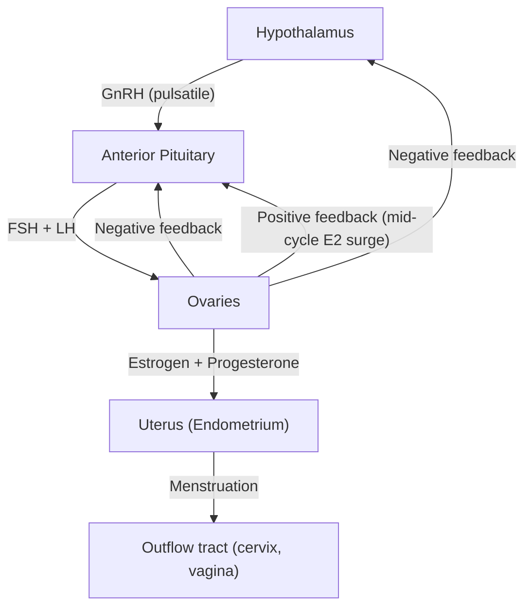

# Amenorrhea

## 1. Definition

**Amenorrhea** literally breaks down from Greek: *"a-"* = without/absence, *"men"* = month, *"rhoia"* = flow. So it means **absence of monthly flow (menstruation)**.

> **_Amenorrhea is defined as the absence of menstruation._** [1]

It is not a diagnosis in itself — it is a **symptom** that signals disruption somewhere along the hypothalamic-pituitary-ovarian-uterine (HPO) axis, or an anatomical problem with the outflow tract. Your job is to figure out *where* the break in the chain is.

### Primary vs. Secondary Amenorrhea

| | ***Primary Amenorrhea*** | ***Secondary Amenorrhea*** |
|---|---|---|
| **_Definition_** | **_Failure to menstruate by age 15 in the presence of normal secondary sexual characteristics (breast development), OR failure to menstruate by age 13 with NO secondary sexual characteristics_** [1][2] | **_Absence of menses for ≥3 consecutive months in a woman who previously had regular cycles, OR ≥6 months in a woman with previously irregular cycles_** [1][2] |
| **Implication** | Something prevented menarche from ever occurring — think developmental, chromosomal, anatomical | The machinery once worked but has stopped — think acquired causes |
| **Overlap** | Many causes of secondary amenorrhea can also present as primary if they occur early enough | — |

<Callout title="Why the age cutoffs?" type="idea">
- By age 13, >95% of girls have begun breast development (thelarche). If there are zero secondary sexual characteristics by 13, the HPO axis has likely never activated → investigate.
- By age 15, >98% of girls with breast development have had menarche. If breasts have developed but no period by 15, the ovaries are likely producing estrogen but something else is blocking menstruation (e.g., outflow tract obstruction, androgen insensitivity).
</Callout>

<Callout title="Important Must-Know" type="error">
Always exclude **pregnancy** first in any woman of reproductive age presenting with amenorrhea. This is the single most common cause of secondary amenorrhea and the most embarrassing diagnosis to miss.
</Callout>

---

## 2. Epidemiology

### Prevalence
- **Primary amenorrhea**: relatively uncommon, ~0.5–1% of reproductive-age women
- **Secondary amenorrhea**: much more common, prevalence ~3–5% of reproductive-age women (excluding pregnancy)

### Demographics
- Primary amenorrhea is more likely to involve **genetic/chromosomal** or **anatomical** causes
- Secondary amenorrhea is dominated by **functional** causes (hypothalamic amenorrhea, PCOS), **pregnancy**, and **hyperprolactinemia**

### Hong Kong Context
- **_PCOS is the most common cause of secondary amenorrhea / oligomenorrhea in Hong Kong_** [2]
- Turner syndrome prevalence: ~1 in 2,500 live female births (universal)
- Relatively high prevalence of **functional hypothalamic amenorrhea** given academic and social pressure on young women in HK, contributing to stress, excessive exercise, and restrictive eating
- Asherman syndrome may be seen following D&C for miscarriage or termination of pregnancy

---

## 3. Anatomy and Physiology of Normal Menstruation

To understand amenorrhea, you must understand the chain of events that produces a normal period. Think of it as a **relay race** with four runners:

### 3.1 The Hypothalamic-Pituitary-Ovarian-Uterine (HPO-U) Axis

#### Runner 1: Hypothalamus
- **GnRH (Gonadotropin-Releasing Hormone)** is secreted in a **pulsatile** fashion from the arcuate nucleus
- ***Pulsatility is critical***: different pulse frequencies preferentially stimulate different gonadotropins:
  - **Fast pulses (~every 60–90 min)** → favours **LH** secretion
  - **Slow pulses (~every 2–4 hours)** → favours **FSH** secretion
- **Continuous GnRH** (non-pulsatile) actually **downregulates** GnRH receptors on the pituitary → **suppresses** FSH/LH (this is why GnRH agonists given continuously are used therapeutically to suppress the axis)
- The hypothalamus integrates signals from higher cortical centers (stress, emotion), metabolic status (leptin, insulin, ghrelin), and feedback from ovarian hormones

#### Runner 2: Anterior Pituitary (Gonadotrophs)
- Responds to GnRH pulses by secreting:
  - **FSH (Follicle-Stimulating Hormone)**: stimulates follicular growth, granulosa cell proliferation, and aromatase activity (converting androgens → estrogens)
  - **LH (Luteinizing Hormone)**: stimulates theca cells to produce androgens, triggers ovulation (LH surge), and supports the corpus luteum
- **Prolactin** from lactotrophs can **inhibit GnRH pulsatility** → this is why hyperprolactinemia causes amenorrhea

#### Runner 3: Ovaries
- Respond to FSH/LH to:
  - Recruit and mature follicles
  - Produce **estradiol** (E2) from granulosa cells (via aromatization of thecal androgens)
  - Ovulate (triggered by LH surge)
  - Form corpus luteum → produces **progesterone** (+ continued estradiol)
- If no pregnancy → corpus luteum degenerates → progesterone withdrawal → menstruation
- **Ovarian reserve** depends on the number of primordial follicles (set at birth, ~1–2 million; ~400,000 at puberty; ~1,000 at menopause)

#### Runner 4: Uterus and Outflow Tract
- The endometrium responds to ovarian hormones:
  - **Estrogen** → proliferative phase (endometrial thickening)
  - **Progesterone** → secretory phase (glandular development, decidualization)
  - **Progesterone withdrawal** → organized shedding = menstruation
- The outflow tract (cervical canal, vagina) must be **patent** for menstrual blood to exit

<Callout title="The Key Principle">
**Menstruation requires ALL four levels to be intact:**
1. Hypothalamus producing pulsatile GnRH
2. Pituitary producing FSH/LH
3. Ovaries with functional follicles producing estrogen/progesterone
4. A responsive endometrium with a patent outflow tract

**Amenorrhea = a break at any one of these levels.**
</Callout>

### 3.2 Normal Puberty and Menarche

Understanding normal puberty helps you spot abnormalities in primary amenorrhea:

- **Adrenarche** (~age 6–8): adrenal androgen production begins (DHEA-S) → axillary/pubic hair
- **Gonadarche** (~age 8–13): reactivation of hypothalamic GnRH pulse generator (suppressed since infancy)
- **Thelarche** (breast budding): first sign of puberty in girls, driven by ovarian estrogen, typically age 8–13 (Tanner stage 2)
- **Menarche**: typically 2–3 years after thelarche, average age ~12.5 years (range 10–16)
- **Tanner staging** of breast and pubic hair development is essential in assessing primary amenorrhea

---

## 4. Etiology and Pathophysiology

The causes of amenorrhea are best organized by **anatomical level** — working from the top down (hypothalamus → pituitary → ovary → uterus/outflow tract), with a separate category for other endocrine causes.

### 4.1 Compartment-Based Classification

***The WHO classification and compartment model are used to categorize amenorrhea*** [1][2]:

| **Compartment** | **Level** | **Gonadotropins** | **Estrogen** |
|---|---|---|---|
| **Compartment IV** | Hypothalamus | ↓FSH, ↓LH | ↓ |
| **Compartment III** | Pituitary | ↓FSH, ↓LH (or ↑prolactin) | ↓ |
| **Compartment II** | Ovary | ↑↑FSH, ↑LH | ↓ |
| **Compartment I** | Uterus / Outflow tract | Normal FSH, LH | Normal |

### 4.2 Hypothalamic Causes (Compartment IV) — Hypogonadotropic Hypogonadism

The hypothalamus is exquisitely sensitive to systemic stressors. When the body perceives it is "not safe to reproduce," GnRH pulsatility is suppressed.

#### A. ***Functional Hypothalamic Amenorrhea (FHA)*** [1][2]

This is **the most common cause of hypothalamic amenorrhea** and one of the most common causes of secondary amenorrhea overall.

**_Three classic triggers (often overlapping):_** [1]
1. **_Stress (psychological)_**: cortisol and CRH directly suppress GnRH pulse generator
2. **_Excessive exercise_**: energy deficit suppresses GnRH; seen in athletes, ballet dancers
3. **_Weight loss / Low body weight / Eating disorders_**: 
   - **Leptin** (produced by adipocytes) is a key permissive signal for GnRH pulsatility
   - ↓fat mass → ↓leptin → hypothalamus interprets this as energy deficit → suppresses GnRH
   - This is why **anorexia nervosa** causes amenorrhea early in the disease course [3][4]
   - ***Amenorrhea traditionally part of the diagnostic triad of anorexia nervosa*** (though removed from DSM-5) [4]

**Pathophysiology in detail:**
- ↑CRH (stress) → suppresses GnRH neurons directly + activates HPA axis → ↑cortisol
- ↑Cortisol → inhibits GnRH pulsatility at hypothalamic level
- ↓Leptin + ↑Ghrelin (from low energy availability) → suppresses kisspeptin neurons in arcuate nucleus → ↓GnRH
- ↓GnRH → ↓FSH/LH → ↓ovarian stimulation → ↓estradiol → no endometrial proliferation → amenorrhea
- Additionally: ↓T3 (adaptive hypothyroidism), ↓IGF-1, ↑cortisol → "energy conservation mode"

**The Female Athlete Triad** (now updated to **Relative Energy Deficiency in Sport — RED-S**):
1. Low energy availability (with or without eating disorder)
2. Menstrual dysfunction (oligomenorrhea → amenorrhea)
3. Low bone mineral density (due to hypoestrogenism)

#### B. ***Kallmann Syndrome*** [1][5]

- *"Kallmann"* = a congenital cause of **isolated GnRH deficiency**
- **_Associated with anosmia/hyposmia_** (reduced sense of smell) — because GnRH neurons embryologically migrate from the olfactory placode to the hypothalamus; in Kallmann syndrome, this migration fails [5]
- Genetics: most commonly X-linked (KAL1 gene encoding anosmin-1), but also autosomal dominant/recessive forms
- Presents as **primary amenorrhea with absent secondary sexual characteristics** in females
- Males: micropenis, cryptorchidism, absent puberty
- ***May be associated with: anosmia, cleft lip/palate, renal agenesis, sensorineural hearing loss, mirror movements*** [5]

#### C. Other Hypothalamic Causes
- **Chronic illness** (renal failure, liver disease, uncontrolled diabetes, celiac disease) → functional GnRH suppression
- **Hypothalamic tumours** (craniopharyngioma — the classic one in children/adolescents) → structural damage to GnRH neurons
- **Infiltrative diseases**: sarcoidosis, histiocytosis X, hemochromatosis → damage to hypothalamic nuclei [5]
- **Head trauma, cranial irradiation** [5]
- **Drugs**: GnRH agonists (when given continuously), opioids, marijuana → suppress GnRH

### 4.3 Pituitary Causes (Compartment III) — Hypogonadotropic Hypogonadism

#### A. ***Hyperprolactinemia*** [1][2]

This is the **most common pituitary cause** of amenorrhea.

**Why does high prolactin cause amenorrhea?**
- Prolactin **directly inhibits GnRH pulsatility** at the hypothalamic level
- Also directly inhibits FSH/LH secretion from the pituitary gonadotrophs
- This is actually a **physiological mechanism** — during breastfeeding, high prolactin suppresses ovulation to prevent pregnancy (lactational amenorrhea)

**Causes of hyperprolactinemia:**

| Category | Examples | Mechanism |
|---|---|---|
| ***Prolactinoma*** | Microadenoma ( < 10mm), Macroadenoma (≥10mm) | Direct PRL secretion by tumour |
| **Stalk effect** | Non-functioning pituitary adenoma, craniopharyngioma | Compression of pituitary stalk → loss of dopamine inhibition → ↑PRL |
| **Drugs** | ***Antipsychotics (D2 blockers)***, metoclopramide, domperidone, methyldopa | Block dopamine inhibition of prolactin |
| **Physiological** | Pregnancy, breastfeeding, stress, nipple stimulation | Normal PRL elevation |
| **Other** | Hypothyroidism (↑TRH stimulates PRL), renal failure (↓PRL clearance), chest wall lesions (mimics suckling reflex) | Various |

**Clinical features of hyperprolactinemia:**
- **Amenorrhea / oligomenorrhea** (from GnRH suppression)
- **Galactorrhea** (milk production — prolactin's primary physiological role)
- **Mass effect** (if macroadenoma): headache, bitemporal hemianopia (compression of optic chiasm)

#### B. ***Sheehan Syndrome (Postpartum Pituitary Necrosis)*** [5]

- During pregnancy, the pituitary gland **enlarges ~120–136%** (mainly lactotroph hyperplasia driven by estrogen)
- The blood supply does NOT increase proportionally → the enlarged gland is vulnerable to ischemia
- If there is **massive postpartum hemorrhage** → hypovolemia → pituitary infarction
- Results in **panhypopituitarism** (loss of all anterior pituitary hormones)
- ***Classic presentation: failure to lactate postpartum (earliest sign due to loss of prolactin), then failure to resume menses, then features of cortisol/thyroid deficiency*** [5]

#### C. ***Other Pituitary Causes***
- **Pituitary adenomas** (non-functioning): mass effect → compression of normal gonadotrophs
- **Pituitary apoplexy**: sudden hemorrhage/infarction into a pituitary adenoma → acute hypopituitarism [5]
- **Empty sella syndrome**: regression or compression of pituitary tissue
- **Surgery / radiation** to the sella [5]
- **Lymphocytic hypophysitis**: autoimmune inflammation, classically postpartum [5]
- **Infiltrative diseases**: hemochromatosis, sarcoidosis [5]

### 4.4 Ovarian Causes (Compartment II) — Hypergonadotropic Hypogonadism

The ovaries fail → no estrogen/progesterone → loss of negative feedback → FSH/LH rise very high (the pituitary is "screaming" at ovaries that don't respond).

#### A. ***Premature Ovarian Insufficiency (POI)*** [1][2]

Previously called "premature ovarian failure" or "premature menopause."

**_Definition: Loss of ovarian function before age 40, characterized by:_** [1]
- **_Amenorrhea ≥4 months_**
- **_FSH > 25 IU/L on two occasions ≥4 weeks apart_** (some guidelines use FSH > 40 IU/L)

**_Causes:_** [1]
| Category | Examples |
|---|---|
| **_Chromosomal / Genetic_** | ***Turner syndrome (45,X)***, ***Fragile X premutation (FMR1)***, other X chromosome abnormalities |
| **_Autoimmune_** | ***Autoimmune oophoritis*** (may be associated with Addison's, thyroid disease, T1DM — autoimmune polyendocrine syndromes) |
| **_Iatrogenic_** | ***Chemotherapy (especially alkylating agents)***, ***pelvic radiation***, ***bilateral oophorectomy*** |
| **_Infections_** | Mumps oophoritis, TB |
| **_Idiopathic_** | Most common category (~50-60%) |
| **_Metabolic_** | Galactosemia (galactose-1-phosphate is toxic to ovarian follicles) |

#### B. ***Turner Syndrome (45,X)*** [1][2]

This is the **most common chromosomal cause of primary amenorrhea**.

**Pathophysiology:**
- Loss of one X chromosome (or part of it) → **streak gonads** (fibrous tissue without functional follicles)
- Follicles actually develop in utero but undergo **accelerated atresia** → depleted by birth or early childhood
- No functional follicles → no estrogen production → no puberty → primary amenorrhea with absent secondary sexual characteristics

**_Classic features:_** [1]
- **_Short stature_** (most consistent feature — due to loss of SHOX gene on X chromosome)
- **_Primary amenorrhea with absent breast development_**
- **_Webbed neck (pterygium colli), low posterior hairline_**
- **_Shield chest (widely spaced nipples)_**
- **_Coarctation of aorta, bicuspid aortic valve_** (cardiac screening mandatory)
- **_Horseshoe kidney_**
- **_Lymphedema of hands/feet at birth_**
- Normal intelligence (but may have difficulty with visuospatial tasks)

#### C. ***Gonadal Dysgenesis (46,XY — Swyer Syndrome)***
- Phenotypically female with 46,XY karyotype
- Defective testicular development → no testosterone or AMH (anti-Müllerian hormone)
- Müllerian structures (uterus, fallopian tubes) present (no AMH to cause regression)
- Streak gonads — **high risk of gonadoblastoma** → prophylactic gonadectomy required
- Presents as: primary amenorrhea, absent breast development, female external genitalia, tall stature (Y chromosome SHOX gene present)

#### D. ***Resistant Ovary Syndrome (Savage Syndrome)***
- Ovaries contain follicles but they are resistant to FSH/LH stimulation
- Due to FSH receptor mutations or anti-FSH receptor antibodies
- Clinically indistinguishable from POI but biopsy shows primordial follicles

### 4.5 Uterine and Outflow Tract Causes (Compartment I)

Hormones are normal, ovulation occurs, but menstrual blood cannot exit or there is no responsive endometrium.

#### A. ***Müllerian Agenesis (Mayer-Rokitansky-Küster-Hauser Syndrome — MRKH)*** [1][2]

- **_Second most common cause of primary amenorrhea_** (after Turner syndrome) [1]
- Congenital absence or hypoplasia of the uterus and upper 2/3 of vagina
- **46,XX karyotype** with **normal ovarian function** → normal secondary sexual characteristics (breasts, pubic/axillary hair)
- Presents as: primary amenorrhea in a phenotypically normal female with breast development
- ***Normal external genitalia but absent/short vagina on examination*** [1]
- May be associated with renal anomalies (unilateral renal agenesis) and skeletal anomalies

**Why does this happen?**
- The uterus, cervix, and upper vagina develop from the **Müllerian (paramesonephric) ducts** during embryogenesis
- In MRKH, these ducts fail to develop → no uterus/upper vagina
- The ovaries develop from a **separate** embryological origin (genital ridge) → normal ovarian function
- External genitalia develop from the **urogenital sinus** (not Müllerian) → also normal

#### B. ***Imperforate Hymen*** [1]

- Most common obstructive anomaly of the female reproductive tract
- Menstrual blood accumulates behind the membrane → **hematocolpos** (blood in vagina) → **hematometra** (blood in uterus) → **hematosalpinx** (blood in fallopian tubes)
- Presents as: **_primary amenorrhea + cyclical pelvic pain_** (the girl is menstruating but blood can't escape) + ***bulging bluish membrane at introitus*** [1]
- Treatment: simple surgical incision (cruciate incision of hymen)

#### C. ***Transverse Vaginal Septum*** [1]
- Similar presentation to imperforate hymen (obstructive symptoms)
- Requires surgical excision

#### D. ***Asherman Syndrome (Intrauterine Adhesions)*** [1][2]

- ***Cause of secondary amenorrhea*** [1]
- **_Intrauterine adhesions (synechiae)_** form after trauma to the basal layer of the endometrium
- **_Most commonly after D&C (dilatation & curettage)_** especially in the context of pregnancy (postpartum, post-miscarriage) or endometrial infection (endometritis, tuberculosis)
- The adhesions obliterate the uterine cavity → even though hormones are cycling normally, there is no functional endometrium to shed
- **_Diagnosed by hysteroscopy_** (gold standard) — adhesions directly visualized
- Treatment: hysteroscopic adhesiolysis (lysis of adhesions) + intrauterine device/balloon to prevent re-adhesion + estrogen therapy to promote endometrial regeneration

#### E. ***Cervical Stenosis***
- Narrowing of the cervical canal, usually iatrogenic (post-cone biopsy, LLETZ, cauterization)
- Causes secondary amenorrhea with cyclical pain (similar mechanism to outflow obstruction)

### 4.6 ***Androgen-Related Causes*** [1]

#### A. ***Polycystic Ovary Syndrome (PCOS)*** [1][2]

**_The most common endocrine disorder in women of reproductive age and the most common cause of anovulatory amenorrhea/oligomenorrhea._** [1][2]

**Pathophysiology (simplified):**
1. **Insulin resistance** → compensatory hyperinsulinemia
2. Hyperinsulinemia:
   - Stimulates theca cells → ↑androgen production (↑testosterone, ↑androstenedione)
   - ↓SHBG (sex hormone-binding globulin) production by liver → ↑free androgens
3. **↑Androgens** → hyperandrogenic features (hirsutism, acne, androgenic alopecia)
4. **Disordered folliculogenesis**: many small follicles are recruited but none achieves dominance → **anovulation** → amenorrhea/oligomenorrhea
5. No ovulation → no corpus luteum → no progesterone → **unopposed estrogen** → endometrial hyperplasia risk
6. ↑LH:FSH ratio (typically > 2:1 in classic PCOS, though not used diagnostically)

**_Rotterdam Criteria (2003) — need 2 of 3:_** [1]
1. **_Oligo-/anovulation_** (oligo- or amenorrhea)
2. **_Clinical or biochemical hyperandrogenism_**
3. **_Polycystic ovaries on ultrasound_** (≥12 follicles 2–9mm or ovarian volume > 10mL per ovary — updated in 2018 to ≥20 follicles with higher resolution US)
- ***Must exclude other causes of androgen excess*** (CAH, Cushing's, androgen-secreting tumour)

#### B. ***Androgen Insensitivity Syndrome (AIS) — Complete (CAIS)*** [1]

- 46,XY individual with **non-functional androgen receptors**
- Testes produce testosterone and AMH, but:
  - **Testosterone cannot act** → no virilization → female external genitalia
  - **AMH is functional** → Müllerian structures regress → **no uterus, no upper vagina**
- Testes may produce enough estrogen (via peripheral aromatization of testosterone) for **breast development**
- Presents as: ***primary amenorrhea in a phenotypically female individual with breast development but absent/sparse pubic and axillary hair*** (androgen-dependent hair requires functional AR), ***blind-ending vagina, absent uterus*** [1]
- **Inguinal hernias** in a phenotypic female child should raise suspicion (may contain testes)
- Gonads must be removed after puberty (allow feminization) due to malignancy risk (gonadoblastoma/seminoma)

#### C. ***Congenital Adrenal Hyperplasia (CAH)*** [1]

- Most commonly **21-hydroxylase deficiency** (>90% of cases)
- ↓Cortisol production → loss of negative feedback → ↑ACTH → adrenal hyperplasia → shunting of steroid precursors into androgen pathway → **virilization**
- **Classic (severe)**: ambiguous genitalia at birth in 46,XX females + salt-wasting crisis
- **Non-classic/Late-onset**: presents in adolescence/adulthood with **hirsutism, acne, oligomenorrhea/amenorrhea** — can mimic PCOS
- ***Diagnosed by elevated 17-hydroxyprogesterone*** (17-OHP) [1]

### 4.7 Other Endocrine Causes

#### A. ***Thyroid Disorders*** [1][2]
- **Hypothyroidism**: 
  - ↑TRH → ↑Prolactin → suppresses GnRH → amenorrhea
  - Also: altered SHBG, altered metabolism of sex steroids
- **Hyperthyroidism**:
  - ↑SHBG → ↓free estradiol → menstrual irregularity
  - Usually causes oligomenorrhea rather than complete amenorrhea

#### B. ***Cushing's Syndrome*** [6]
- ↑Cortisol → suppresses GnRH pulsatility → ↓LH/FSH → amenorrhea
- Also: ↑adrenal androgens → hirsutism, acne

#### C. ***Adrenal Insufficiency***
- Can cause menstrual irregularity through general metabolic derangement and stress response

---

## 5. Classification

### 5.1 ***Primary vs. Secondary*** [1]

As defined above. This is the most clinically useful initial classification.

### 5.2 ***By Compartment (WHO Classification)*** [1]

| **WHO Group** | **Level** | **FSH/LH** | **Estrogen** | **Examples** |
|---|---|---|---|---|
| **_WHO Group I_** | ***Hypothalamic-pituitary failure*** | ***↓*** | ***↓*** | ***FHA, Kallmann, Sheehan, anorexia nervosa*** |
| **_WHO Group II_** | ***Hypothalamic-pituitary-ovarian dysfunction*** | ***Normal*** | ***Normal*** | ***PCOS (most common in this group)*** |
| **_WHO Group III_** | ***Ovarian failure*** | ***↑↑*** | ***↓*** | ***POI, Turner syndrome, post-chemo/XRT*** |
| **_WHO Group IV_** | ***Outflow tract / Uterine*** | ***Normal*** | ***Normal*** | ***Asherman, MRKH, imperforate hymen*** |
| **_WHO Group V_** | ***Hyperprolactinemia*** | ***↓ or normal*** | ***↓ or normal*** | ***Prolactinoma, drug-induced*** |
| **_WHO Group VI_** | ***Other endocrine*** | ***Variable*** | ***Variable*** | ***Hypothyroidism, Cushing, CAH*** |

### 5.3 Physiological vs. Pathological

**Physiological amenorrhea** (normal, do not investigate):
- Before menarche (prepubertal)
- Pregnancy
- Lactation
- Post-menopause

---

## 6. Clinical Features

### 6.1 Symptoms

Every symptom should be linked to its pathophysiological basis:

| Symptom | Pathophysiological Basis | Suggests |
|---|---|---|
| ***Absence of menstruation*** | Disruption anywhere along HPO-U axis | Definition of amenorrhea |
| ***Cyclical pelvic pain without menses*** | Functional endometrium present but outflow obstructed → hematocolpos/hematometra | Imperforate hymen, transverse vaginal septum, cervical stenosis |
| **Hot flushes, night sweats, vaginal dryness** | Estrogen deficiency → vasomotor instability (hypothalamic thermoregulatory center is affected by declining estrogen) | POI, hypothalamic amenorrhea (severe), any cause of hypoestrogenism |
| **Galactorrhea** | Excess prolactin → stimulates breast epithelium to produce milk | Hyperprolactinemia (prolactinoma, drugs, hypothyroidism) |
| **Headache, visual disturbance** | Pituitary/hypothalamic mass → compression of optic chiasm → bitemporal hemianopia | Pituitary adenoma (prolactinoma, non-functioning), craniopharyngioma |
| ***Hirsutism, acne, oily skin, androgenic alopecia*** | Excess androgens → stimulate pilosebaceous unit, terminal hair growth in androgen-sensitive areas | PCOS, CAH, Cushing's, androgen-secreting tumour |
| **Weight gain, central obesity, striae** | Insulin resistance / cortisol excess | PCOS, Cushing's syndrome |
| ***Significant weight loss, excessive exercise*** | ↓Energy availability → ↓leptin → ↓GnRH → ↓FSH/LH | Functional hypothalamic amenorrhea, anorexia nervosa [4] |
| **Cold intolerance, constipation, fatigue, dry skin** | Hypothyroidism → ↓metabolic rate | Hypothyroidism |
| **Anosmia / hyposmia** | Failed migration of olfactory and GnRH neurons from olfactory placode | Kallmann syndrome [5] |
| **Failure to lactate postpartum** | Loss of prolactin-secreting lactotrophs due to pituitary necrosis | Sheehan syndrome [5] |
| **Infertility** | Anovulation (no egg released) or absent uterus | Any cause of amenorrhea |
| **Dyspareunia** | Vaginal dryness from estrogen deficiency or anatomical abnormality | POI, FHA, MRKH |
| **Psychological: anxiety, depression** | Hypoestrogenism affects serotonin and neurotransmitter systems; also psychological impact of diagnosis | Any prolonged amenorrhea |

### 6.2 Signs

| Sign | Pathophysiological Basis | Suggests |
|---|---|---|
| ***Absent or incomplete breast development (Tanner staging)*** | No estrogen production → no breast growth | Turner syndrome, Kallmann, gonadal dysgenesis, any pre-pubertal onset |
| ***Normal breast development but absent pubic/axillary hair*** | Breast development from estrogen (aromatization of testosterone), but androgen receptors non-functional → no androgen-dependent hair | Complete Androgen Insensitivity Syndrome (CAIS) |
| ***Short stature, webbed neck, shield chest, cubitus valgus*** | 45,X karyotype → loss of SHOX gene → short stature; lymphatic dysfunction → webbed neck, edema | Turner syndrome |
| ***Ambiguous genitalia, clitoromegaly*** | Excess androgens during fetal development (virilization of female fetus) | Classic CAH (21-hydroxylase deficiency) |
| ***Hirsutism (Ferriman-Gallwey score ≥ 4-6 in Chinese women)*** | Excess androgens → conversion of vellus to terminal hair in androgen-sensitive areas (upper lip, chin, chest, linea alba, inner thighs) | PCOS, CAH, Cushing's, androgen-secreting tumour |
| ***Acanthosis nigricans*** | Hyperinsulinemia → stimulates keratinocyte and fibroblast proliferation via IGF-1 receptors → velvety hyperpigmented skin in flexures | PCOS (insulin resistance), obesity, T2DM |
| **Virilization (deep voice, male-pattern baldness, clitoromegaly)** | Very high androgen levels (typically from tumour) → masculinization | Androgen-secreting ovarian/adrenal tumour |
| **Truncal obesity, moon face, buffalo hump, purple striae** | Cortisol excess → central fat deposition, protein catabolism, skin fragility | Cushing's syndrome [6] |
| ***Bulging bluish membrane at introitus*** | Imperforate hymen with trapped menstrual blood (hematocolpos) | Imperforate hymen |
| ***Blind-ending vagina (on speculum/digital exam)*** | Absent upper vagina and uterus | MRKH, CAIS |
| **Vaginal atrophy, dryness** | Estrogen deficiency → thinning of vaginal epithelium | Any hypoestrogenic state |
| ***Galactorrhea on breast examination*** | Prolactin excess → milk production | Hyperprolactinemia |
| **Visual field defect (bitemporal hemianopia)** | Pituitary mass compressing optic chiasm | Pituitary macroadenoma |
| **Goiter** | Thyroid pathology | Hypothyroidism/hyperthyroidism |
| **Enlarged clitoris + inguinal masses** | Inguinal testes in 46,XY individual | CAIS |

### 6.3 History Taking — Key Points for Amenorrhea

***Structured history taking is essential*** [1]:

1. **Menstrual history**: age of menarche (if any), previous cycle pattern, onset and duration of amenorrhea, any cyclical pain
2. **Obstetric history**: previous pregnancies, D&C, postpartum hemorrhage, failure to lactate → Sheehan, Asherman
3. **Sexual history**: sexual activity (rule out pregnancy!), dyspareunia
4. **Weight/exercise/stress**: quantify changes — this is critical for FHA
5. **Drug history**: OCP (withdrawal amenorrhea), antipsychotics (hyperprolactinemia), chemotherapy, GnRH agonists, depot medroxyprogesterone acetate
6. **Endocrine symptoms**: galactorrhea, hot flushes, hirsutism, acne, thyroid symptoms, Cushing features
7. **Chronic illness**: renal, liver, celiac, diabetes
8. **Family history**: age of menarche in mother/sisters, known genetic conditions (Turner, Fragile X), early menopause in family (POI)
9. **Developmental history**: puberty timing, growth, sense of smell (Kallmann)
10. **Surgical/radiation history**: pelvic surgery, cranial radiation, oophorectomy

### 6.4 Physical Examination — Systematic Approach

1. **General**: BMI, body habitus, nutritional status, overall appearance
2. **Growth and development**: height (short stature → Turner), Tanner staging (breast + pubic hair)
3. **Skin**: hirsutism (Ferriman-Gallwey score), acne, acanthosis nigricans, striae, vitiligo
4. **Head/neck**: visual fields (confrontation), goiter, facial features
5. **Breast**: Tanner stage, galactorrhea expression
6. **Abdomen**: pelvic mass (hematometra), Cushing stigmata
7. **External genitalia**: clitoromegaly, introital abnormalities, bulging hymen
8. **Vaginal examination** (if appropriate): vaginal length, cervix presence, uterine size
9. **Dysmorphic features**: webbed neck, low hairline, wide-spaced nipples, cubitus valgus (Turner)

---

## 7. Special Considerations — Hong Kong Context

- **PCOS** remains the most common cause of secondary amenorrhea/oligomenorrhea in HK [2]
- **Functional hypothalamic amenorrhea** is increasingly recognized, particularly in university students under academic pressure
- **Turner syndrome screening**: neonatal lymphedema or coarctation of aorta should prompt karyotyping
- **Asherman syndrome**: be aware of post-D&C adhesions, as termination of pregnancy and miscarriage management are common clinical scenarios
- **Congenital adrenal hyperplasia**: newborn screening programs exist in many countries but are not universally applied in HK — late-onset/non-classic CAH may present in adolescence as amenorrhea + hirsutism, mimicking PCOS

---

## 8. Mnemonic

**Mnemonic for causes of secondary amenorrhea — "SOAP":**
- **S** = Stress, Starvation (FHA)
- **O** = Ovarian failure (POI)
- **A** = Anatomical (Asherman), Androgens (PCOS)
- **P** = Pituitary/Prolactin, Pregnancy (always rule out first!)

**Mnemonic for primary amenorrhea with absent secondary sexual characteristics — "KTG":**
- **K** = Kallmann syndrome
- **T** = Turner syndrome
- **G** = Gonadal dysgenesis

---

<Callout title="High Yield Summary">

**Key Definitions:**
- ***Primary amenorrhea***: no menses by age 15 with secondary sexual characteristics, or by age 13 without them
- ***Secondary amenorrhea***: absent menses for ≥3 months (regular cycles) or ≥6 months (irregular cycles)

**Always exclude pregnancy first!**

**Classify by compartment:**
- **Hypothalamic** (WHO I): FHA (stress/weight/exercise), Kallmann → ↓FSH/LH, ↓E2
- **Pituitary** (WHO V): Hyperprolactinemia (most common pituitary cause), Sheehan → ↓FSH/LH, ↑PRL
- **Ovarian** (WHO III): POI, Turner → ↑↑FSH, ↓E2
- **Uterine/Outflow** (WHO IV): Asherman, MRKH, imperforate hymen → normal hormones
- **PCOS** (WHO II): most common cause of anovulatory amenorrhea → normal/↑LH, normal FSH

**Top causes by presentation:**
- Most common cause of secondary amenorrhea: **Pregnancy**
- Most common pathological cause of secondary amenorrhea: **PCOS**
- Most common cause of primary amenorrhea with absent secondary sexual characteristics: **Turner syndrome (45,X)**
- Most common cause of primary amenorrhea with normal secondary sexual characteristics: **MRKH**
- Second most common in same category: **CAIS**
- Most common pituitary cause: **Hyperprolactinemia**

**Key clinical clues:**
- Anosmia → Kallmann
- Short stature + webbed neck → Turner
- Breast development + no pubic hair + blind vagina → CAIS
- Cyclical pain + primary amenorrhea → outflow obstruction
- Post-D&C + secondary amenorrhea → Asherman
- Postpartum hemorrhage + failure to lactate → Sheehan
- Galactorrhea + amenorrhea → hyperprolactinemia

</Callout>

---

<ActiveRecallQuiz
  title="Active Recall - Amenorrhea"
  items={[
    {
      question: "A 16-year-old girl presents with primary amenorrhea, normal breast development, but absent pubic and axillary hair. Examination reveals a blind-ending vagina. What is the most likely diagnosis and the underlying pathophysiology?",
      markscheme: "Complete Androgen Insensitivity Syndrome (CAIS). 46,XY with non-functional androgen receptors. Testes present (produce testosterone + AMH). AMH causes Mullerian regression (no uterus). Testosterone cannot act (no virilization, no androgen-dependent hair). Breast development from peripheral aromatization of testosterone to estrogen."
    },
    {
      question: "List the WHO classification groups for amenorrhea and give one example for each group.",
      markscheme: "WHO I: Hypothalamic-pituitary failure (e.g., FHA, Kallmann). WHO II: HPO dysfunction (e.g., PCOS). WHO III: Ovarian failure (e.g., POI, Turner). WHO IV: Outflow tract/uterine (e.g., Asherman, MRKH). WHO V: Hyperprolactinemia (e.g., prolactinoma). WHO VI: Other endocrine (e.g., hypothyroidism, Cushing)."
    },
    {
      question: "Explain the pathophysiology of amenorrhea in functional hypothalamic amenorrhea. Why does low body weight cause cessation of menses?",
      markscheme: "Low fat mass leads to decreased leptin. Leptin is a permissive signal for kisspeptin neurons in the arcuate nucleus. Decreased kisspeptin leads to decreased GnRH pulsatility. Decreased GnRH leads to decreased FSH and LH. Decreased FSH/LH leads to decreased ovarian stimulation, decreased estradiol, anovulation, and no endometrial shedding. Additionally, increased CRH and cortisol from stress directly suppress GnRH."
    },
    {
      question: "A 30-year-old woman presents with secondary amenorrhea 6 months after a D&C for incomplete miscarriage. Hormone profile shows normal FSH, LH, estradiol, and prolactin. What is the most likely diagnosis and gold standard investigation?",
      markscheme: "Asherman syndrome (intrauterine adhesions/synechiae). Gold standard: hysteroscopy, which directly visualizes intrauterine adhesions. Hormones are normal because the HPO axis is intact; the problem is endometrial/anatomical."
    },
    {
      question: "Why does hyperprolactinemia cause amenorrhea? Name three causes of pathological hyperprolactinemia.",
      markscheme: "Prolactin directly inhibits GnRH pulsatility at the hypothalamus, and also inhibits FSH/LH at the pituitary level, leading to hypogonadotropic hypogonadism and anovulation. Three causes: (1) Prolactinoma, (2) Drugs (antipsychotics/D2 blockers), (3) Hypothyroidism (elevated TRH stimulates prolactin). Others acceptable: stalk effect from non-functioning pituitary adenoma, renal failure."
    },
    {
      question: "Differentiate Turner syndrome from MRKH syndrome as causes of primary amenorrhea in terms of karyotype, secondary sexual characteristics, and uterus presence.",
      markscheme: "Turner: 45,X karyotype; absent/minimal secondary sexual characteristics (streak gonads produce no estrogen); uterus present (Mullerian structures form). MRKH: 46,XX karyotype; normal secondary sexual characteristics (ovaries function normally); uterus and upper vagina absent (Mullerian agenesis). Key distinguishing feature: Turner has no breast development; MRKH has normal breasts."
    }
  ]}
/>

---

## References

[1] Lecture slides: Block C - Climacteric symptoms_ menopause and related illness; amenorrhoea.pdf
[2] Lecture slides: GC 114. Climacteric symptoms menopause and related illness; amenorrhoea.pdf
[3] Senior notes: Ryan Ho Psychiatry.pdf (Eating Disorders section, p210-211)
[4] Senior notes: Ryan Ho Psychiatry.pdf (Anorexia Nervosa, p210)
[5] Senior notes: Ryan Ho Endocrine.pdf (Hypopituitarism, p112)
[6] Senior notes: Ryan Ho Endocrine.pdf (Cushing's Syndrome, p60)
