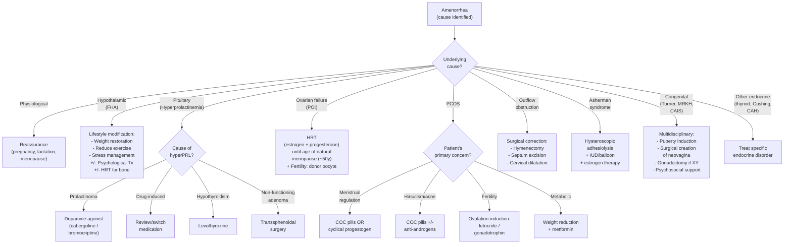

## Management of Amenorrhea

The cardinal principle of managing amenorrhea is one you've already heard: ***amenorrhea is a symptom, NOT a diagnosis*** [1][2]. Therefore, **management is always directed at the underlying cause**. There is no single "treatment for amenorrhea" — you treat the broken link in the chain.

That said, there are **universal management goals** regardless of cause:

1. **Treat the underlying condition** (the specific cause)
2. **Restore menstruation** where possible and desired
3. **Protect bone health** (prolonged hypoestrogenism → osteoporosis)
4. **Address fertility** if desired
5. **Prevent long-term sequelae** (cardiovascular risk, endometrial hyperplasia, psychological impact)

---

### 1. Management Algorithm — Overview

---

### 2. Management by Specific Cause

#### 2.1 ***Hypogonadotropic Hypogonadism — Environmental/Functional Causes*** [1][2]

**_Applies to: Functional Hypothalamic Amenorrhea (stress, weight loss, excessive exercise, anorexia nervosa)_**

***Management principles:*** [1][2]
- **_Lifestyle modification, reassurance, and observation_** [1]
- **_+/- Psychological treatment_** [1]

| Intervention | Rationale | Details |
|---|---|---|
| ***Weight restoration*** | ↑Fat mass → ↑leptin → reactivates kisspeptin → restores GnRH pulsatility | Target BMI > 18.5–20 kg/m². In anorexia nervosa, menstruation typically resumes when weight reaches ~90% of ideal body weight. Weight gain is the single most effective intervention |
| ***Reduce excessive exercise*** | ↑Energy availability → reverses the hypothalamic "energy deficit" signal | Reduce training intensity/volume, increase caloric intake to match expenditure |
| ***Stress management*** | ↓CRH/cortisol → removes inhibition of GnRH pulse generator | Cognitive-behavioural therapy (CBT), counselling, mindfulness. Address underlying psychological stressors |
| ***Psychological treatment*** [1] | Eating disorders (AN, BN) require specialist psychiatric input | Family-based therapy for adolescents (best evidence); individual CBT for adults [7] |
| ***Maintenance HRT to protect bone*** [1] | Prolonged hypoestrogenism → ↑RANKL:OPG ratio → ↑bone resorption → osteoporosis [10] | **_HRT for bone protection except for transient secondary causes_** [1]. Use physiological estrogen replacement (transdermal E2 or COCP) + calcium/vitamin D. Continue until cause resolved |

<Callout title="When is HRT needed in FHA?">
**_Maintenance HRT to protect bone_** is indicated when amenorrhea is expected to be **prolonged** (>6–12 months) and especially in young women whose peak bone mass has not yet been achieved [1]. If the cause is clearly transient (e.g., exam stress that is resolving), observation alone is reasonable. But if the patient has anorexia nervosa with ongoing low weight, estrogen replacement is needed to prevent irreversible bone loss.

Note: **COCP is often used** in young women with FHA because it provides estrogen for bone protection + cycle regulation + contraception. However, it will mask the return of natural cycles — some clinicians prefer transdermal estradiol + cyclical progestogen so that return of spontaneous menses can be detected.
</Callout>

#### 2.2 ***Hypogonadotropic Hypogonadism — Structural/Organic Causes*** [1]

**_Applies to: Pituitary/hypothalamic tumours, Kallmann syndrome, Sheehan syndrome_**

***Management principles:*** [1]
- **_Primary amenorrhea or secondary amenorrhea with no obvious external cause → pituitary imaging +/- GnRH stimulation test_** [1]
- **_Visual field perimetry_** [1]
- **_Neurosurgical treatment for hypothalamic-pituitary lesions_** [1]
- **_Induction of puberty by oestrogen in primary amenorrhea_** [1]
- **_Maintenance HRT to protect bone_** [1]
- **_Fertility treatment: gonadotrophin_** [1]

##### A. Puberty Induction (Primary Amenorrhea with Absent Secondary Sexual Characteristics)

***Induction of puberty by oestrogen in primary amenorrhea*** [1]:

This applies to girls with Turner syndrome, Kallmann syndrome, or any cause of hypogonadism presenting before puberty.

| Phase | Protocol | Rationale |
|---|---|---|
| **Initiation** | Ultra-low dose estradiol (e.g., transdermal E2 patch 25 μg → 6.25 μg by cutting, or oral ethinylestradiol 2 μg daily) | Mimics the gradual physiological rise of estrogen at puberty. Starting too high causes premature epiphyseal fusion → compromises final adult height |
| **Gradual increase** | Increase dose every 6–12 months over 2–3 years | Allows breast development (Tanner stages 2→5) to progress naturally |
| **Add progesterone** | Add cyclical progestogen once breakthrough bleeding occurs or after 2 years of estrogen | Protects endometrium from unopposed estrogen. Initiates withdrawal bleeds |
| **Maintenance** | Continue as combined HRT (estrogen + cyclical progesterone) or COCP | Provides ongoing estrogen for bone, cardiovascular, and general health |

*Why transdermal?* Transdermal estradiol avoids first-pass hepatic metabolism → more physiological estradiol:estrone ratio, less effect on hepatic proteins (e.g., clotting factors, SHBG), lower VTE risk. Preferred in Turner syndrome where cardiovascular risk is already elevated.

##### B. ***Hyperprolactinemia — Prolactinoma*** [11]

| Treatment | Details |
|---|---|
| **_First-line: Dopamine agonist_** | ***Cabergoline*** (preferred — longer acting, better tolerated, more effective at normalizing PRL and shrinking tumours) or ***bromocriptine*** |
| **Mechanism** | Dopamine (via D2 receptors) is the natural tonic inhibitor of prolactin secretion. Dopamine agonists → bind D2 receptors on lactotrophs → ↓PRL synthesis + secretion + ↓tumour size |
| **Expected response** | PRL normalizes in >80% of microprolactinomas. Tumour shrinks significantly (often within weeks). Menses resume once PRL normalizes |
| **Side effects** | Nausea, postural hypotension, nasal congestion. Rare: ***retroperitoneal fibrosis, cardiac valve fibrosis (TR)*** [11] — more with cabergoline at high doses (Parkinson's doses), less at standard prolactinoma doses |
| **Monitoring** | Serum PRL levels, pituitary MRI (initially at 3–6 months, then annually), visual fields if macroadenoma |
| **Duration** | Trial of withdrawal after ≥2 years if PRL normalized and tumour shrunk significantly |
| ***Second-line: Transsphenoidal surgery (TSS)*** [11] | ***Indications: (1) Remains symptomatic/high PRL despite medical treatment, (2) DA agonist fails to shrink tumour significantly (macroadenoma), (3) Pituitary apoplexy, (4) Planning pregnancy*** [11] |
| **Adjuvant RT** | ***If residual mass after resection and histology shows radiosensitive tumour*** [11] |

<Callout title="Special: Prolactinoma and Pregnancy" type="idea">
- Dopamine agonists restore ovulation → fertility returns → patient can become pregnant
- ***Advise contraception as needed (fertility might return after PRL normalizes)*** [11]
- **Bromocriptine** has longer safety data in pregnancy than cabergoline (though cabergoline data is also reassuring)
- For **microprolactinomas**: can stop DA agonist once pregnancy confirmed (low risk of significant tumour expansion)
- For **macroadenomas**: higher risk of tumour expansion during pregnancy (estrogen stimulates lactotrophs) → discuss with endocrinologist, may continue DA agonist or operate before conception
</Callout>

##### C. Sheehan Syndrome / Panhypopituitarism

Management is **hormone replacement for all deficient axes** [5]:

| Deficiency | Replacement | Key Points |
|---|---|---|
| **ACTH deficiency** | ***Hydrocortisone 15–25 mg/day*** (divided: 10mg morning, 5mg afternoon) [5] | ***Mineralocorticoid NOT required*** (aldosterone is ACTH-independent; regulated by RAAS) [5]. Must replace cortisol BEFORE thyroxine (T4 ↑cortisol clearance → can precipitate adrenal crisis) |
| **TSH deficiency** | ***Levothyroxine*** (start at 1.6 μg/kg) [5] | ***Aim serum fT4 in upper half of normal range*** (TSH is unreliable for monitoring in secondary hypothyroidism) [5] |
| **FSH/LH deficiency** | ***Estrogen + progesterone in females*** (as COCP or HRT) [5] | ***Unopposed estrogen is dangerous in women without hysterectomy → risk of endometrial cancer*** [5]. For fertility: gonadotrophin injections (exogenous FSH ± LH/hCG) |
| **GH deficiency** | ***Recombinant GH (SC injection at night)*** [5] | ***Indications in adults: impaired QoL + severe GH deficiency (peak GH < 9 mU/L on stimulation test)*** [5]. Reassess at 9 months |

#### 2.3 ***Polycystic Ovary Syndrome (PCOS)*** [1][2]

PCOS management is tailored to the patient's **primary concern** — there is no one-size-fits-all approach.

***Management principles:*** [1][2]
- **_Weight reduction_** [1]
- **_Menstrual regulation: prevent endometrial hyperplasia/CA_** [1]
- **_Periodic progestogen for withdrawal bleeding_** [1]
- **_COC pills_** [1]
- **_Hirsutism: COC pills, cosmetic measures, anti-oestrogens_** [1]
- **_Fertility: ovulation induction by letrozole / gonadotrophin_** [1]
- **_Metabolic disorder in long term_** [1]

| Goal | Intervention | Mechanism / Rationale |
|---|---|---|
| ***Weight reduction*** [1] | Lifestyle modification: diet + exercise. Target ≥5–10% weight loss | Even modest weight loss → ↓insulin resistance → ↓hyperinsulinemia → ↓thecal androgen production + ↑SHBG → ↓free androgens → may restore ovulation spontaneously. This is the single most impactful intervention in overweight/obese PCOS |
| ***Menstrual regulation*** [1] | **_Option 1: Cyclical progestogen_** (e.g., medroxyprogesterone acetate 10 mg for 10–14 days every 1–3 months) | Induces regular withdrawal bleeds → prevents prolonged unopposed estrogen exposure → ***prevents endometrial hyperplasia and endometrial cancer*** [1]. Why is this risk present? In PCOS, there is anovulation → no corpus luteum → no progesterone → continuous estrogen stimulation of endometrium → hyperplasia → cancer risk |
| | **_Option 2: Combined oral contraceptive pill (COCP)_** [1] | COCPs provide: (1) regular withdrawal bleeds (endometrial protection), (2) ↓ovarian androgen production (ethinylestradiol suppresses LH), (3) ↑SHBG (estrogen component stimulates hepatic SHBG production → ↓free testosterone), (4) contraception. Some COCPs contain anti-androgenic progestogens (e.g., cyproterone acetate, drospirenone) for added benefit |
| ***Hirsutism*** [1] | **_COC pills_** + **_cosmetic measures_** (shaving, waxing, laser hair removal, electrolysis, eflornithine cream) + **_anti-androgens_** | ***Anti-androgens: spironolactone (most commonly used)*** — blocks androgen receptor + inhibits 5α-reductase. ***Cyproterone acetate*** (potent anti-androgen, also progestogenic). ***Must be used with reliable contraception*** — anti-androgens are teratogenic (feminize male fetus) |
| ***Fertility*** [1] | **_First-line: Letrozole_** (aromatase inhibitor) [1] | Letrozole blocks peripheral aromatization of androgens → ↓estrogen → ↓negative feedback → ↑FSH → stimulates follicular development → ovulation. Superior to clomiphene citrate for ovulation induction in PCOS (NEJM 2014 trial). Why not clomiphene first-line anymore? Letrozole has higher ovulation, pregnancy, and live birth rates with lower multiple pregnancy rate |
| | **_Second-line: Gonadotrophin injections_** (low-dose step-up FSH) [1] | Direct ovarian stimulation when oral agents fail. Requires close monitoring (USS + E2) due to risk of ovarian hyperstimulation syndrome (OHSS) and multiple pregnancy |
| | **_Third-line: Laparoscopic ovarian drilling (LOD)_** | Electrocautery/laser to ovarian surface → destroys androgen-producing stroma → ↓androgens → may restore ovulation. Reserved for clomiphene/letrozole-resistant PCOS. Risk: adhesion formation, ↓ovarian reserve |
| | **_IVF_** | If above measures fail |
| ***Metabolic*** [1] | ***Metformin*** + lifestyle | Metformin ↓hepatic glucose output + ↑peripheral insulin sensitivity → ↓hyperinsulinemia → ↓ovarian androgen production. Not first-line for fertility (letrozole is superior) but useful for metabolic features (insulin resistance, IGT/T2DM). Screen for: fasting glucose/OGTT, lipid profile, BP |

<Callout title="COCP Contraindications — Must Know for PCOS Management" type="error">
COCPs are frequently prescribed for PCOS but have important contraindications [12]:
- ***Uncontrolled cardiovascular risk factors*** [12]
- ***Active smoking (especially age >35)*** [12]
- **History of VTE or PE**
- **Migraine with aura**
- **Active breast cancer**
- **Severe liver disease**
- **Undiagnosed uterine bleeding** (must investigate first)

In PCOS patients who cannot take COCPs (e.g., smokers > 35, obesity with hypertension), use **cyclical progestogen** alone for endometrial protection.
</Callout>

#### 2.4 ***Premature Ovarian Insufficiency (POI)*** [1]

POI management centres on **estrogen replacement** — these women are functionally menopausal decades early, and the consequences of prolonged hypoestrogenism are severe.

| Intervention | Rationale | Details |
|---|---|---|
| ***HRT (estrogen + progesterone)*** | Replace the estrogen the ovaries can no longer produce → prevent osteoporosis, cardiovascular disease, urogenital atrophy, vasomotor symptoms, cognitive effects | Continue **until the age of natural menopause (~50 years)**. Unlike HRT in postmenopausal women (where risks may outweigh benefits after age 60), HRT in POI is simply *replacing what should be there* — the risk-benefit profile is strongly favourable. ***Use physiological estrogen (transdermal E2 preferred)*** + cyclical progesterone (for endometrial protection) |
| **Calcium + Vitamin D** | ↓Bone resorption, support mineralization | Calcium 1000–1200 mg/day + Vitamin D 800–1000 IU/day |
| **DEXA scan monitoring** | Assess bone density and response to HRT | Baseline + every 2–3 years |
| **Cardiovascular risk management** | Estrogen deficiency → ↓HDL, ↑LDL, endothelial dysfunction | Monitor lipid profile, BP; HRT itself is cardioprotective in this age group |
| ***Fertility: Donor oocyte IVF*** | Patient's own oocytes are depleted/dysfunctional | Donor oocyte with patient's uterus (if present). Spontaneous conception occurs in ~5% of POI (intermittent ovarian activity), so contraception should be discussed if pregnancy is not desired |
| **Psychological support** | Diagnosis of POI at a young age → profound psychological impact (loss of fertility, premature aging, altered self-image) | Counselling, peer support groups |
| **Autoimmune screening** | POI may be part of autoimmune polyendocrine syndrome | Screen for Addison's disease (life-threatening if missed), thyroid disease, T1DM |

#### 2.5 ***Outflow Tract Obstruction*** [1]

| Condition | Treatment | Rationale |
|---|---|---|
| ***Imperforate hymen*** | **Cruciate incision (hymenectomy)** | Simple surgical procedure under anaesthesia → immediate drainage of hematocolpos. Curative. Must be done carefully to avoid damage to urethra |
| ***Transverse vaginal septum*** | **Surgical excision** of septum + anastomosis of upper and lower vaginal segments | More complex than imperforate hymen; may require staged procedures if septum is thick or high |
| ***Cervical stenosis*** | **Cervical dilatation** (serial Hegar dilators) | Usually outpatient procedure; may need repeated dilatation |

#### 2.6 ***Asherman Syndrome*** [1]

| Step | Intervention | Rationale |
|---|---|---|
| **1. Adhesiolysis** | ***Hysteroscopic adhesiolysis*** (lysis of adhesions under direct vision) | Gold standard — both diagnostic and therapeutic. Scissors or bipolar energy used to divide synechiae |
| **2. Prevent re-adhesion** | Intrauterine balloon catheter (Foley) or IUD placed post-operatively for 1–2 weeks | Physical barrier to keep uterine walls apart during healing |
| **3. Estrogen therapy** | High-dose estrogen (e.g., conjugated estrogen 2.5 mg daily or estradiol valerate 4 mg daily) for 4–6 weeks + progestogen for last 10 days | Stimulates endometrial regeneration over the denuded areas |
| **4. Follow-up** | Repeat hysteroscopy to assess cavity, further adhesiolysis if needed | Recurrence is common, especially in severe cases |

#### 2.7 ***Müllerian Agenesis (MRKH Syndrome)*** [1]

| Intervention | Details |
|---|---|
| **Creation of neovagina** | **Non-surgical (first-line)**: Frank method — progressive perineal dilatation using graduated dilators over months. Success rate ~90%. **Surgical**: Vecchietti procedure (laparoscopic traction device), McIndoe procedure (skin graft neovagina), Davydov procedure (peritoneal pull-through) — reserved for failure of non-surgical approach |
| **Fertility** | No uterus → cannot carry pregnancy. Options: **gestational surrogacy** (using patient's own oocytes — ovaries are normal), **uterine transplantation** (experimental but successful live births reported) |
| **Psychological support** | Critical — young women diagnosed with absent uterus need careful counselling about identity, sexuality, and fertility |

#### 2.8 ***Complete Androgen Insensitivity Syndrome (CAIS)***

| Intervention | Details |
|---|---|
| **Gonadectomy** | Remove intra-abdominal/inguinal testes **after puberty** (allow spontaneous breast development from aromatization of testosterone). Post-pubertal gonadectomy because malignancy risk (gonadoblastoma, seminoma) is low before puberty but increases with age (~3.6% by age 25, ~33% by age 50 in some series) |
| **Post-gonadectomy HRT** | Estrogen replacement (no progesterone needed — no uterus). Lifelong to prevent osteoporosis, vasomotor symptoms |
| **Vaginal dilatation or surgery** | If vaginal length is insufficient for sexual function → Frank dilatation or surgical vaginoplasty |
| **Psychological support** | Sensitive disclosure of diagnosis, peer support, genetic counselling |

#### 2.9 ***Congenital Adrenal Hyperplasia (Non-Classic/Late-Onset)***

| Intervention | Rationale |
|---|---|
| **Glucocorticoid replacement** (low-dose hydrocortisone or dexamethasone) | Suppresses ACTH → ↓adrenal androgen overproduction → restores ovulation and reduces hirsutism |
| **COCP** | Additional suppression of ovarian androgens + cycle regulation |
| **Fertility** | Often improves with glucocorticoid treatment alone |

#### 2.10 ***Thyroid Disease***

| Condition | Treatment | Effect on Amenorrhea |
|---|---|---|
| **Hypothyroidism** | ***Levothyroxine*** | ↓TRH → ↓PRL → restores GnRH pulsatility → menses resume. Amenorrhea resolves once euthyroid |
| **Hyperthyroidism** | Anti-thyroid drugs (carbimazole/methimazole), RAI, or surgery | Normalize thyroid function → normalize SHBG → restore menstrual regularity |

#### 2.11 ***Cushing's Syndrome***

| Treatment | Depends on Cause |
|---|---|
| **Pituitary Cushing's** | ***Transsphenoidal surgery*** ± pituitary radiotherapy [13] |
| **Adrenal Cushing's** | ***Adrenalectomy*** ± chemotherapy if carcinoma [13] |
| **Ectopic ACTH** | Treat underlying malignancy [13] |
| **Iatrogenic** | Taper exogenous steroids where possible |

---

### 3. Hormone Replacement Therapy (HRT) — Detailed Principles

HRT is a cornerstone of amenorrhea management in **hypoestrogenic states** (POI, FHA, post-gonadectomy, hypogonadotropic hypogonadism). Understanding the principles, routes, and contraindications is essential.

#### 3.1 Components

| Component | Purpose | Options |
|---|---|---|
| **Estrogen** | Replaces ovarian estrogen → relieves vasomotor symptoms, protects bone, prevents urogenital atrophy, cardiovascular protection | **Oral**: estradiol valerate, conjugated equine estrogens. **Transdermal** (preferred in many settings): E2 patches, gel. **Vaginal**: for local urogenital symptoms only |
| **Progestogen** | ***Protects endometrium from unopposed estrogen*** → prevents endometrial hyperplasia and cancer [5] | Medroxyprogesterone acetate, micronized progesterone (Utrogestan — more physiological, better side-effect profile), norethisterone, levonorgestrel IUS (Mirena) |

> ***Unopposed oestrogen is dangerous in women without hysterectomy as it can increase risk of endometrial cancer*** [5]

#### 3.2 Regimens

| Regimen | Who For | Details |
|---|---|---|
| **Cyclical combined** | Women who still want withdrawal bleeds (younger POI patients) | Continuous estrogen + cyclical progestogen (12–14 days/month) → regular withdrawal bleeds |
| **Continuous combined** | Women who do not want bleeds | Continuous estrogen + continuous progestogen → no withdrawal bleeds (amenorrhea — but this time by design!) |
| **Estrogen only** | Women post-hysterectomy (no endometrium to protect) | No progestogen needed |
| **COCP** | Young women with amenorrhea (combined benefit of HRT + contraception + convenience) | Standard COCP; note this provides supraphysiological ethinylestradiol rather than natural estradiol |

#### 3.3 Routes of Administration

| Route | Advantages | Disadvantages |
|---|---|---|
| **Oral** | Convenient, widely available | First-pass hepatic metabolism → ↑clotting factors (↑VTE risk), ↑SHBG, ↑triglycerides, ↑angiotensinogen (↑BP) |
| **Transdermal** (patches, gel) | Avoids first-pass effect → lower VTE risk, less effect on liver proteins, more physiological E2:E1 ratio | Skin irritation (patches), variable absorption (gel) |
| **Vaginal** | Targeted for urogenital atrophy symptoms only | Not systemic — does not provide bone/cardiovascular protection at standard doses |
| **Intrauterine** (Mirena IUS for progestogen) | Local progestogen delivery to endometrium → minimal systemic side effects | Only provides progestogen; still need systemic estrogen |

#### 3.4 ***HRT Contraindications*** [1]

***Contraindications to HRT:*** [1]
- **_Severe liver disease_** [1]
- **_Cerebrovascular disease_** [1]
- **_Deep vein thrombosis and embolism_** [1]
- **_Oestrogen-dependent tumours e.g. breast, uterus_** [1]
- **_Undiagnosed uterine bleeding_** [1]

#### 3.5 ***HRT Follow-up*** [1]

***Follow-up principles:*** [1]
- **_Annual monitoring for the continual need_** [1]
- **_Well-women check-up as usual_** [1]
- **_Side effects: breast tenderness, fluid retention, bloating, nausea, headache, irregular bleeding — usually transient_** [1]
- **_Bleeding pattern — report unscheduled bleeding promptly if occurs after 3 months_** [1]
- **_Cessation: tapering vs abrupt stop (no proven difference in clinical outcome); symptom recurrence possible_** [1]

<Callout title="HRT in POI vs. HRT in Postmenopausal Women — Different Risk-Benefit" type="idea">
Do not confuse these two scenarios:
- **HRT in POI (age < 40)**: This is **replacement** of what should physiologically be there. Risk of VTE, breast cancer, and CVD from HRT in this age group is **minimal** and far outweighed by benefits. Continue until age ~50 (natural menopause age).
- **HRT in postmenopausal women (age > 50)**: Used for symptom relief. The Women's Health Initiative (WHI) study showed ↑risk of VTE, stroke, and breast cancer with combined HRT in older postmenopausal women. Use lowest effective dose for shortest duration. The risks increase with duration and with initiation > 10 years after menopause.
</Callout>

---

### 4. ***Non-Hormonal Treatments*** [1]

***For patients who cannot or prefer not to use HRT:*** [1]

| Symptom | Non-Hormonal Option | Mechanism |
|---|---|---|
| ***Vasomotor symptoms (hot flushes)*** [1] | ***Clonidine*** | Central α2-adrenergic agonist → ↓sympathetic outflow → ↓vasomotor instability |
| | ***Gabapentin*** [1] | Modulates calcium channels in thermoregulatory center → ↓hot flush frequency/severity |
| | ***Lifestyle modifications*** [1] | Layered clothing, cool environment, avoiding triggers (spicy food, alcohol, caffeine) |
| | ***Relaxation techniques*** [1] | ↓Sympathetic activation |
| | **SSRIs/SNRIs** (e.g., venlafaxine, paroxetine) | Modulate serotonin → affect thermoregulatory setpoint. Paroxetine is FDA-approved for vasomotor symptoms |
| ***Mood symptoms*** [1] | ***Psychological counselling/therapy*** [1] | CBT, interpersonal therapy |
| | ***Antidepressants*** [1] | SSRIs/SNRIs for significant depression/anxiety |
| ***Vaginal atrophy*** [1] | ***Lubricants, moisturisers*** [1] | Non-hormonal barrier against dryness during intercourse and daily comfort |
| | **Low-dose vaginal estrogen** (if systemic HRT contraindicated) | Minimal systemic absorption → can often be used even when systemic HRT is contraindicated (discuss on case-by-case basis) |

---

### 5. ***Fertility Treatment in Amenorrhea*** [1]

| Cause of Amenorrhea | Fertility Approach |
|---|---|
| **FHA** | Weight restoration → spontaneous ovulation. If persistent: pulsatile GnRH pump (most physiological — mimics natural GnRH release), or gonadotrophin injections (FSH ± LH) |
| ***Hypogonadotropic hypogonadism (all causes)*** [1] | ***Gonadotrophin injections*** [1] — exogenous FSH (± LH/hCG) to directly stimulate follicular development and ovulation. ***Cannot use clomiphene or letrozole*** (these rely on intact pituitary to ↑endogenous FSH — if pituitary is suppressed/damaged, they won't work) |
| ***PCOS*** [1] | ***Ovulation induction: letrozole (first-line) / gonadotrophin (second-line)*** [1]. Letrozole blocks aromatase → ↓E2 → ↓negative feedback → ↑FSH → mono-follicular development. Lower multiple pregnancy rate than clomiphene |
| **POI** | ***Donor oocyte IVF*** (patient's own eggs are depleted). Uterus is present and can carry pregnancy with exogenous E+P support |
| **MRKH** | Gestational surrogacy (own oocytes, surrogate uterus) or uterine transplantation (experimental) |
| **Asherman** | Hysteroscopic adhesiolysis → restore cavity → then spontaneous conception or IVF |
| **Kallmann** | Pulsatile GnRH or gonadotrophin injections — excellent response because pituitary and ovaries are intrinsically normal, just understimulated |

---

### 6. Management Summary Table — Quick Reference

| Cause | Key Management | Fertility Option |
|---|---|---|
| **FHA** | Lifestyle modification, psychological Tx, HRT for bone | Weight restoration → spontaneous; pulsatile GnRH; gonadotrophins |
| **Prolactinoma** | Dopamine agonist (cabergoline) | Menses resume with PRL normalization |
| **Sheehan / panhypopituitarism** | Multi-hormone replacement (cortisol first → then T4 → then E+P → then GH) | Gonadotrophin injections |
| **POI** | HRT until age 50, Ca/VitD, DEXA, psychosocial | Donor oocyte IVF |
| **PCOS** | Weight loss, COCP or cyclical progestogen, anti-androgens | Letrozole → gonadotrophins → LOD → IVF |
| **Asherman** | Hysteroscopic adhesiolysis + IUD/balloon + estrogen | Post-adhesiolysis: spontaneous or IVF |
| **MRKH** | Vaginal dilatation or surgical neovagina | Surrogacy or uterine transplant |
| **CAIS** | Gonadectomy post-puberty + HRT + vaginal dilatation | Not possible (no uterus, no oocytes) |
| **Turner** | Puberty induction with estrogen → maintenance HRT | Donor oocyte IVF (if uterus adequate) |
| **Imperforate hymen** | Hymenectomy | Normal fertility expected |
| **CAH (non-classic)** | Low-dose glucocorticoid + COCP | Glucocorticoid → spontaneous ovulation |
| **Hypothyroidism** | Levothyroxine | Menses resume once euthyroid |
| **Cushing's** | Treat cause (surgery, etc.) | Menses resume once cortisol normalized |

---

<Callout title="High Yield Summary — Management of Amenorrhea">

**Universal Principle**: ***Amenorrhea is a symptom, NOT a diagnosis — treat the underlying cause*** [1][2]

**Key Management Points from Lecture Slides:**
- ***FHA: Lifestyle modification, reassurance, psychological treatment, HRT for bone protection (except transient causes)*** [1]
- ***PCOS: Weight reduction, menstrual regulation (cyclical progestogen or COCP), hirsutism treatment (COCP + anti-androgens), fertility (letrozole first-line), metabolic management*** [1]
- ***Hypogonadotropic hypogonadism: Pituitary imaging, puberty induction with estrogen, maintenance HRT, fertility with gonadotrophins*** [1]
- ***Prolactinoma: Dopamine agonists first-line; TSS second-line*** [11]
- ***POI: HRT until natural menopause age; donor oocyte for fertility***
- ***Asherman: Hysteroscopic adhesiolysis***
- ***HRT contraindications: Severe liver disease, cerebrovascular disease, DVT/PE, estrogen-dependent tumours, undiagnosed uterine bleeding*** [1]
- ***Non-hormonal options: Clonidine, gabapentin, lifestyle modifications, counselling, antidepressants, lubricants*** [1]

**Critical Safety Points:**
- ***Unopposed estrogen → endometrial cancer risk → always add progestogen if uterus present*** [5]
- ***Replace cortisol BEFORE thyroxine in panhypopituitarism*** [5]
- ***Anti-androgens are teratogenic → must use with contraception***
- ***COCP contraindicated in uncontrolled CV risk, active smoking, VTE history*** [12]

</Callout>

---

<ActiveRecallQuiz
  title="Active Recall - Management of Amenorrhea"
  items={[
    {
      question: "A 17-year-old with Turner syndrome has had no breast development. Outline the stepwise approach to puberty induction and explain why you start with a low estrogen dose.",
      markscheme: "Start with ultra-low dose estradiol (e.g., transdermal E2 patch 6.25 mcg or oral ethinylestradiol 2 mcg daily). Gradually increase dose every 6-12 months over 2-3 years to mimic physiological puberty. Add cyclical progestogen once breakthrough bleeding occurs or after 2 years. Starting too high causes premature epiphyseal fusion, compromising final adult height. Transdermal route preferred because it avoids first-pass hepatic effects and lower VTE risk."
    },
    {
      question: "List the management principles for PCOS as stated in the lecture slides, covering at least five aspects.",
      markscheme: "(1) Weight reduction. (2) Menstrual regulation to prevent endometrial hyperplasia/CA: cyclical progestogen or COCP. (3) Hirsutism: COCP, cosmetic measures, anti-androgens. (4) Fertility: ovulation induction by letrozole (first-line) or gonadotrophin (second-line). (5) Metabolic disorder management in the long term (metformin, lipid/glucose screening)."
    },
    {
      question: "Why can you NOT use letrozole or clomiphene for ovulation induction in hypogonadotropic hypogonadism? What do you use instead?",
      markscheme: "Letrozole and clomiphene work by reducing negative feedback on the pituitary (letrozole via reducing estrogen, clomiphene via blocking estrogen receptors), thereby increasing endogenous FSH secretion. In hypogonadotropic hypogonadism, the pituitary is either suppressed or damaged and cannot increase FSH output in response. Therefore, you must use exogenous gonadotrophin injections (FSH +/- LH/hCG) to directly stimulate the ovaries, bypassing the pituitary."
    },
    {
      question: "List the five contraindications to HRT as stated in the lecture slides.",
      markscheme: "(1) Severe liver disease. (2) Cerebrovascular disease. (3) Deep vein thrombosis and embolism. (4) Oestrogen-dependent tumours (e.g., breast, uterus). (5) Undiagnosed uterine bleeding."
    },
    {
      question: "In panhypopituitarism (e.g., Sheehan syndrome), which hormone must be replaced FIRST and why? What is the consequence of incorrect sequencing?",
      markscheme: "Cortisol (hydrocortisone) must be replaced FIRST, before levothyroxine. Reason: Levothyroxine increases cortisol clearance/metabolism. If given to a cortisol-deficient patient without cortisol replacement, it will precipitate an acute adrenal crisis (circulatory shock, hypoglycemia, hyponatremia). Correct sequence: cortisol first, then T4, then sex steroids, then GH."
    },
    {
      question: "A 25-year-old woman with POI asks why she needs HRT when her grandmother was told HRT was dangerous after menopause. Explain the different risk-benefit profiles.",
      markscheme: "In POI (age less than 40), HRT is REPLACEMENT of physiological estrogen that should be present. The risks (VTE, breast cancer) are minimal at this age and far outweighed by benefits (bone protection, cardiovascular protection, symptom relief, quality of life). Continue until age ~50 (natural menopause). In contrast, her grandmother's situation (HRT for postmenopausal symptoms at age >50-60) carries higher absolute risks, especially if started >10 years after menopause (WHI data). In POI, NOT giving HRT is more dangerous than giving it."
    }
  ]}
/>

---

## References

[1] Lecture slides: Block C - Climacteric symptoms_ menopause and related illness; amenorrhoea.pdf
[2] Lecture slides: GC 114. Climacteric symptoms menopause and related illness; amenorrhoea.pdf
[5] Senior notes: Ryan Ho Endocrine.pdf (Hypopituitarism, p112–113)
[7] Senior notes: Ryan Ho Psychiatry.pdf (Anorexia Nervosa, p210)
[10] Senior notes: Ryan Ho Endocrine.pdf (Osteoporosis, p47)
[11] Senior notes: Maksim Medicine Notes.pdf (Prolactinoma management, p107)
[12] Lecture slides: Block C - O&G Theme Case 2.docx.pdf (p5)
[13] Senior notes: Maksim Surgery Notes.pdf (Cushing syndrome management, p204)
