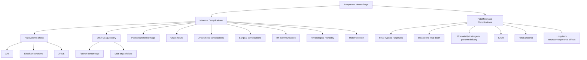

## Complications of Antepartum Hemorrhage

Complications of APH affect both mother and fetus/neonate. Understanding them requires tracing the pathophysiology from the initial hemorrhagic insult through to its downstream consequences. Every complication can be explained from first principles — hemorrhage reduces perfusion, coagulopathy amplifies bleeding, and prematurity results from early delivery forced by the emergency.

---

### Framework for Understanding Complications

---

### A. Maternal Complications

#### 1. Hypovolemic Shock and Maternal Death

***Bleeding (haemorrhage) is one of the major causes of maternal mortality*** [1][11]. ***Primary postpartum haemorrhage is often torrential and can cause shock and death within a short period of time*** [1][11].

**Why does APH cause shock so quickly?**

- Uterine blood flow at term is ~500–700 mL/min — the placental bed is among the most richly perfused vascular beds in the body
- ***The placental bed is where the uterus is very vascular*** [3]. Any disruption to this interface opens high-flow maternal spiral arteries
- In placenta praevia, ***the lower part of the uterus does not contract very well → hence, the blood vessels are not controlled, results in massive bleeding*** [3]
- Although pregnant women have expanded blood volume (~40% increase, to ~6–7 L), they can decompensate rapidly once compensatory mechanisms are exhausted — and young, healthy women maintain normal vital signs until they have lost 30–40% of their blood volume, after which collapse is sudden

**Pathophysiology of hypovolemic shock:**
1. Blood loss → ↓ circulating volume → ↓ venous return → ↓ preload
2. ↓ Preload → ↓ stroke volume → ↓ cardiac output (Frank-Starling mechanism)
3. Sympathetic activation → tachycardia + peripheral vasoconstriction (cold extremities, pallor, delayed capillary refill) → attempts to maintain MAP
4. If blood loss continues → sympathetic compensation overwhelmed → ↓ MAP → ↓ end-organ perfusion → organ ischemia → multi-organ failure → death

**Aortocaval compression** worsens shock in the supine position — the gravid uterus compresses the IVC → further reduces venous return → compounds hypovolemia. This is why ***left lateral uterine displacement*** or left lateral tilt is essential during resuscitation [16].

---

#### 2. Disseminated Intravascular Coagulation (DIC)

This is the most feared hematological complication of APH, particularly **placental abruption**.

***Whatever the initial cause of bleeding, the patient can develop blood coagulation defects after heavy bleeding, and this causes more bleeding. Furthermore, there are some pregnancy complications which are associated with disseminated intravascular coagulation and can be the cause of postpartum haemorrhage.*** [1][11]

**Mechanism (from first principles):**

1. Damaged placenta releases **tissue factor (thromboplastin)** into maternal circulation
2. Tissue factor activates Factor VII → extrinsic pathway activation
3. Massive thrombin generation → widespread fibrin deposition in microvasculature
4. **Consumption** of platelets, fibrinogen, Factor V, Factor VIII → consumption coagulopathy → inability to form clots → bleeding diathesis
5. Secondary fibrinolysis (plasmin activation) → fibrin degradation products (FDPs) and D-dimer ↑↑ → FDPs themselves are anticoagulant (they interfere with fibrin polymerisation and platelet function) → worsening bleeding
6. RBCs forced through fibrin strands in microvasculature → mechanical fragmentation → schistocytes on PBS → **microangiopathic haemolytic anaemia (MAHA)** [4][5]
7. Microvascular thrombosis → end-organ ischemia → renal cortical necrosis, hepatic dysfunction, ARDS

**Vicious cycle:** Bleeding → tissue damage → more thromboplastin release → more DIC → more bleeding → death if not interrupted by treating the cause (delivery) and replacing consumed components.

| Lab Finding | Mechanism |
|-------------|-----------|
| ***↓ Platelets*** | Consumed in microthrombi [4][5] |
| ***↑ PT, ↑ aPTT*** | Clotting factors consumed [4][5] |
| ***↓ Fibrinogen*** | Consumed; "normal" for pregnancy is 4–6 g/L so < 2 g/L is critically low [4][5] |
| ***↑ D-dimer*** | Fibrinolysis of microthrombi [4][5] |
| ***Schistocytes on PBS*** | RBC fragmentation through fibrin meshwork (MAHA) [4][5] |

---

#### 3. Postpartum Hemorrhage (PPH)

***Antepartum hemorrhage*** is explicitly listed as a ***risk factor for postpartum hemorrhage*** [2].

APH leads to PPH through multiple mechanisms — and the 4 T's framework of PPH causes maps directly onto APH pathophysiology:

| 4 T's of PPH | How APH causes this |
|--------------|---------------------|
| ***Tone*** (uterine atony) | **Couvelaire uterus** in severe abruption: blood infiltrates the myometrium → disrupts contractile function → uterus cannot contract after delivery. Also, placenta praevia: ***lower segment does not contract very well*** [3] — the placental bed in the lower segment has sparse muscle fibres |
| ***Tissue*** (retained placenta) | **Placenta accreta spectrum** (PAS): especially when praevia coexists with prior CS scar → chorionic villi adhere to/invade myometrium without intervening decidua basalis → placenta does not separate → massive hemorrhage at attempted removal. ***Placenta accreta: abnormal implantation where the placenta invades into the myometrium. Part or whole of the placenta cannot be separated from the uterus*** [1][11] |
| ***Trauma*** | Emergency CS for APH may cause surgical trauma; ***rupture of the body of the uterus*** can complicate delivery [1][11] |
| ***Thrombin*** (coagulopathy) | DIC from abruption → consumption coagulopathy → unable to form clots → ongoing hemorrhage post-delivery [1][11] |

> ***Whatever the initial cause of bleeding, the patient can develop blood coagulation defects after heavy bleeding, and this causes more bleeding*** [1][11]. This is the critical teaching point — APH begets PPH through a self-perpetuating cycle of hemorrhage and coagulopathy.

---

#### 4. End-Organ Damage from Hemorrhagic Shock

| Organ | Complication | Mechanism |
|-------|-------------|-----------|
| **Kidneys** | **Acute kidney injury (AKI)** → may progress to **acute tubular necrosis (ATN)** or **renal cortical necrosis** | Hypovolemia → ↓ renal perfusion → tubular ischemia. In DIC, fibrin deposition in glomerular capillaries causes cortical necrosis (irreversible, unlike ATN). Clinical: oliguria → anuria → rising creatinine and urea |
| **Pituitary** | **Sheehan syndrome** (postpartum hypopituitarism) | The anterior pituitary is physiologically enlarged in pregnancy (lactotroph hyperplasia for prolactin production) but its blood supply does not increase proportionately → vulnerable to ischemia. Severe hemorrhagic shock → anterior pituitary infarction → panhypopituitarism. Classic presentation: failure of lactation (↓ prolactin), then gradual loss of other pituitary hormones (TSH, ACTH, FSH/LH, GH) |
| **Lungs** | **ARDS (Acute Respiratory Distress Syndrome)** | Massive transfusion → transfusion-related acute lung injury (TRALI). DIC → pulmonary microvascular thrombosis. Systemic inflammatory response from shock → capillary leak → non-cardiogenic pulmonary edema |
| **Liver** | **Hepatic ischemia / HELLP syndrome** | Reduced hepatic perfusion → centrilobular necrosis → elevated transaminases. If pre-eclampsia coexists → HELLP (Haemolysis, Elevated Liver enzymes, Low Platelets) |
| **Heart** | **Myocardial ischemia** | Severe anemia + tachycardia → increased myocardial oxygen demand with reduced oxygen supply → subendocardial ischemia (especially in women with pre-existing cardiac disease) |
| **Brain** | **Cerebral hypoperfusion → watershed infarcts** | Prolonged hypotension → ischemia in vulnerable watershed zones between major cerebral artery territories |

<Callout title="Sheehan Syndrome — A Delayed Complication">
Sheehan syndrome may present **weeks to months** after the hemorrhagic event. The earliest sign is usually **failure to lactate** (agalactia) because prolactin-producing lactotrophs are the first to be affected. Later features include amenorrhea (↓ FSH/LH), hypothyroidism (↓ TSH), adrenal insufficiency (↓ ACTH — potentially life-threatening), and growth hormone deficiency. Always ask a woman who had massive obstetric hemorrhage about breastfeeding ability at follow-up.
</Callout>

---

#### 5. Anaesthetic Complications

Emergency delivery for APH often requires **emergency general anaesthesia (GA)**, which carries unique risks in pregnancy [16]:

| Complication | Mechanism |
|-------------|-----------|
| **Difficult intubation** | ***Difficult intubation is 8 times more common than normal patients*** — due to ***weight gain and oedema, pre-existing obstetric disease e.g. pre-eclampsia*** [16] |
| **Aspiration (Mendelson's syndrome)** | ***Delayed gastric emptying and relaxed LES due to progesterone → risk of aspiration even with fasting*** [16]. Aspiration of acidic gastric contents → chemical pneumonitis → ARDS. Prevented by ***RSI and antacids (30 mL sodium citrate + H₂RA/PPI)*** [16] |
| **Rapid desaturation during intubation** | ***Increased oxygen demand by 20% and reduced oxygen reserve (FRC drop 20%): less apnea time allowed*** [16]. Pregnant women desaturate much faster during apnea than non-pregnant patients |
| **Aortocaval compression** | ***Supine hypotension syndrome: reduced by left lateral uterine displacement*** [16]. ***Placenta bed has no autoregulation to compensate for drop in BP*** [16] — any drop in maternal BP directly reduces uteroplacental perfusion |

> The key teaching point: ***Placenta bed has no autoregulation to compensate for drop in BP*** [16]. This means even brief maternal hypotension (e.g., during anaesthetic induction) can cause acute fetal hypoxia. This is fundamentally different from the cerebral or renal circulations, which have autoregulatory mechanisms to maintain perfusion across a range of MAP.

---

#### 6. Complications of Massive Blood Transfusion

***Massive transfusion: transfusion of > 10 units (or 1–2× blood volume)*** [17]. ***Indication: severe trauma, ruptured AAA, obstetric complications*** [17].

| Complication | Mechanism |
|-------------|-----------|
| **Hypothermia** | Stored blood is cold (4°C) → rapid infusion of multiple units drops core temperature → hypothermia impairs coagulation (enzyme reactions are temperature-dependent) → worsens bleeding |
| **Dilutional coagulopathy** | Packed RBCs contain no clotting factors or platelets → dilution of existing factors → coagulopathy. Mitigated by ***empirical transfusion of packed cells:FFP:PLT = 1:1:1*** [17] |
| **Hyperkalemia** | Stored RBCs leak K⁺ (the Na⁺/K⁺-ATPase stops working in storage) → ↑ serum K⁺ → risk of cardiac arrhythmia |
| **Citrate toxicity → Hypocalcaemia** | Citrate is the anticoagulant in blood bags → chelates ionised Ca²⁺ → hypocalcaemia → muscle cramps, tetany, QT prolongation, cardiac dysfunction. The liver normally metabolises citrate, but in massive transfusion the liver is overwhelmed |
| **Metabolic alkalosis** | Citrate is metabolised to bicarbonate → metabolic alkalosis (paradoxically, after initial lactic acidosis from shock resolves) |
| ***ABO incompatibility (1/6000)*** | Clerical error → haemolytic transfusion reaction → DIC, renal failure, death [17] |
| ***ARDS (< 1/10,000)*** | TRALI: donor antibodies react with recipient leukocytes → pulmonary capillary leak → non-cardiogenic pulmonary oedema [17] |

---

#### 7. Rh Isoimmunisation

- APH causes **feto-maternal hemorrhage (FMH)** — fetal RBCs cross into maternal circulation through the disrupted placental-decidual interface
- If the mother is **Rh-negative** and the fetus is **Rh-positive**, maternal exposure to Rh(D) antigen stimulates anti-D IgG antibody production
- In subsequent pregnancies, these IgG anti-D antibodies cross the placenta → bind fetal Rh-positive RBCs → haemolysis → **haemolytic disease of the fetus and newborn (HDFN)** — ranging from mild neonatal jaundice to fatal hydrops fetalis
- **Prevention:** Anti-D immunoglobulin within 72 hours of any sensitising event (including APH); Kleihauer-Betke test to quantify FMH and calculate additional anti-D dose

---

#### 8. Hysterectomy and Loss of Fertility

- Emergency peripartum hysterectomy may be required for uncontrollable hemorrhage, particularly in **placenta accreta spectrum (PAS)**
- This is a definitive, life-saving procedure but results in permanent loss of fertility — psychologically devastating for many women
- In Hong Kong, where family sizes are typically small and fertility is highly valued, this is an important counselling point

---

#### 9. Psychological Morbidity

| Condition | Mechanism |
|-----------|-----------|
| **Post-traumatic stress disorder (PTSD)** | Acute life-threatening hemorrhagic event → intrusive flashbacks, hyperarousal, avoidance behaviours |
| **Postnatal depression** | Traumatic delivery, emergency surgery, NICU admission of preterm baby, loss of fertility from hysterectomy → complex grief and depression |
| **Anxiety about future pregnancies** | Fear of recurrence — especially relevant in abruption (recurrence risk 5–17%) and praevia (recurrence 4–8%) |
| **Bonding difficulties** | Maternal-infant separation if baby in NICU; maternal illness/ICU admission |

---

### B. Fetal and Neonatal Complications

#### 1. Fetal Hypoxia and Intrauterine Fetal Death (IUFD)

**Mechanism:**
- Placental separation (abruption) or maternal hypovolemia (any cause) → reduced functional placental surface area for gas exchange → fetal hypoxia
- In abruption: > 50% separation is typically incompatible with fetal survival
- In praevia: fetal death is less common unless maternal hemorrhage is massive (the placenta itself may still be well-perfused if only the lower edge has separated)
- In vasa praevia: fetal blood loss → fetal exsanguination (fetal blood volume is only ~250–300 mL at term — even 50–100 mL loss can be lethal)

**CTG findings indicating fetal compromise:**
- Late decelerations → uteroplacental insufficiency
- Prolonged bradycardia → acute hypoxia
- Sinusoidal pattern → fetal anaemia (vasa praevia, massive FMH)
- Loss of variability → advanced hypoxic injury to autonomic nervous system

---

#### 2. Prematurity and Iatrogenic Preterm Delivery

This is the **most common fetal complication** of APH. Many women with APH require emergency delivery before term — either because of massive hemorrhage necessitating immediate CS, or because of fetal distress.

| Complication of Prematurity | Mechanism |
|----------------------------|-----------|
| **Respiratory distress syndrome (RDS)** | Immature Type II pneumocytes → insufficient surfactant → alveolar collapse → impaired gas exchange. Prevented/mitigated by antenatal corticosteroids |
| **Intraventricular hemorrhage (IVH)** | Fragile germinal matrix capillaries in preterm brain → susceptible to rupture with changes in cerebral blood flow (e.g., birth asphyxia, resuscitation) |
| **Necrotising enterocolitis (NEC)** | Immature intestinal barrier + ischemia-reperfusion injury → bacterial translocation → intestinal necrosis |
| **Retinopathy of prematurity (ROP)** | Immature retinal vasculature → abnormal neovascularisation in response to supplemental oxygen |
| **Bronchopulmonary dysplasia (BPD)** | Chronic lung injury from prolonged ventilation and oxygen therapy in preterm lungs |
| **Sepsis** | Immature immune system → susceptibility to nosocomial infections in NICU |
| **Hypothermia** | High surface area-to-volume ratio + immature thermoregulation → rapid heat loss |
| **Feeding difficulties** | Immature suck-swallow coordination → requires tube feeding |

---

#### 3. Intrauterine Growth Restriction (IUGR)

- Chronic or recurrent abruption → chronic uteroplacental insufficiency → reduced nutrient and oxygen supply to fetus → growth restriction
- Also seen in praevia with repeated bleeds (chronic relative placental insufficiency)
- IUGR fetuses are at higher risk during delivery and have higher perinatal morbidity and mortality

---

#### 4. Fetal Anaemia

| Cause | Mechanism |
|-------|-----------|
| **Vasa praevia** | Direct fetal blood loss through torn fetal vessels |
| **Massive feto-maternal hemorrhage** | Abruption disrupts placental integrity → fetal RBCs enter maternal circulation → fetal anaemia |
| **Chronic abruption** | Ongoing low-grade FMH → gradual fetal anaemia |

Detection: **Middle cerebral artery (MCA) Doppler** — elevated peak systolic velocity (PSV > 1.5 MoM) indicates fetal anaemia (low viscosity blood flows faster).

---

#### 5. Long-Term Neurodevelopmental Consequences

***Obstetric complications*** — including ***antepartum haemorrhage, preterm labour and low birth weight, fetal hypoxia or asphyxia*** — are identified as distal environmental risk factors for **schizophrenia** (2× risk) [18].

**Mechanism:** Perinatal hypoxia-ischemia → subtle damage to developing brain → disruption of normal neurodevelopment → predisposition to psychotic disorders decades later. This is part of the **neurodevelopmental hypothesis** of schizophrenia — early insults (genetic + environmental) alter brain maturation, with clinical manifestation in adolescence/early adulthood.

Other neurodevelopmental consequences of perinatal hypoxia:
- **Cerebral palsy** — hypoxic-ischemic encephalopathy at birth → motor cortex and white matter damage
- **Learning difficulties** — frontal lobe and hippocampal vulnerability to hypoxia
- **Epilepsy** — cortical scarring from ischemic injury → epileptogenic foci

<Callout title="APH and Schizophrenia — An Exam Connection">
***Antepartum haemorrhage*** is listed as a ***distal risk factor (prenatal, perinatal) for schizophrenia*** with approximately ***2× risk*** [18]. The mechanism is fetal hypoxia causing subtle brain injury during critical periods of neurodevelopment. This is a cross-specialty link that may appear in psychiatry or obstetrics exams.
</Callout>

---

#### 6. Neonatal Death

- Perinatal mortality rate in APH is approximately **10–15%** overall (higher in severe abruption, approaching 30–50%)
- Causes: birth asphyxia, extreme prematurity, fetal exsanguination (vasa praevia)
- Even with modern neonatal intensive care, very preterm infants born in the context of APH have high morbidity and mortality

---

### C. Complications Specific to the Cause

| Cause of APH | Specific Complications |
|--------------|----------------------|
| **Placenta praevia** | PPH (atonic lower segment); PAS (accreta/increta/percreta) → CS hysterectomy; malpresentation requiring CS; preterm delivery; recurrence in future pregnancies |
| **Placental abruption** | DIC (most important); Couvelaire uterus → PPH; renal cortical necrosis; Sheehan syndrome; IUFD; IUGR (if chronic); recurrence risk 5–17% |
| **Vasa praevia** | Fetal exsanguination → fetal death (~60% if undiagnosed); fetal anaemia requiring neonatal transfusion |
| **Uterine rupture** | Maternal hemorrhagic shock; fetal death from extrusion; hysterectomy; bladder injury; peritonitis if contamination |
| **PAS** | Massive intraoperative hemorrhage; need for CS hysterectomy; bladder/bowel injury (percreta invading adjacent organs); ICU admission; massive transfusion complications |

---

### Summary Table: Complications by System

| System | Maternal Complication | Fetal/Neonatal Complication |
|--------|----------------------|---------------------------|
| **Haematological** | DIC, dilutional coagulopathy, transfusion reactions | Fetal anaemia, neonatal anaemia |
| **Cardiovascular** | Hypovolemic shock, cardiac arrest | Fetal hypoxia, bradycardia |
| **Renal** | AKI, renal cortical necrosis | — |
| **Endocrine** | Sheehan syndrome | — |
| **Respiratory** | ARDS, aspiration pneumonitis (Mendelson's) | RDS (prematurity) |
| **Neurological** | Watershed cerebral infarcts | Cerebral palsy, IVH, neurodevelopmental delay, schizophrenia risk |
| **Reproductive** | Hysterectomy, Rh isoimmunisation, recurrence risk | — |
| **Psychological** | PTSD, postnatal depression | Bonding difficulties |
| **Mortality** | Maternal death | IUFD, neonatal death |

---

<Callout title="High Yield Summary">

**Complications of APH — Key Points:**

1. **Maternal death:** ***Haemorrhage is one of the major causes of maternal mortality*** [1][11]
2. **DIC:** Most important haematological complication; especially with abruption; ***the patient can develop blood coagulation defects after heavy bleeding, and this causes more bleeding*** [1][11]
3. **PPH:** ***APH is a risk factor for PPH*** [2] — via uterine atony (Couvelaire/lower segment), retained placenta (PAS), trauma (CS), and coagulopathy (DIC)
4. **Sheehan syndrome:** Anterior pituitary infarction from severe hemorrhagic shock → failure to lactate, then panhypopituitarism (delayed presentation)
5. **AKI/Renal cortical necrosis:** Hypovolemia + DIC → renal ischemia (cortical necrosis is irreversible)
6. **ARDS:** From massive transfusion (TRALI), DIC, or aspiration
7. **Anaesthetic risks in pregnancy:** ***Difficult intubation 8× more common; aspiration risk from delayed gastric emptying; rapid desaturation from ↓FRC; aortocaval compression*** [16]
8. **Massive transfusion complications:** Hypothermia, dilutional coagulopathy, hyperkalemia, citrate toxicity (hypocalcaemia) [17]
9. **Fetal:** Hypoxia → IUFD; prematurity (most common fetal complication); IUGR; fetal anaemia
10. **Long-term:** ***APH is a distal risk factor for schizophrenia (2× risk)*** via fetal hypoxia affecting neurodevelopment [18]
11. **Rh isoimmunisation:** FMH in Rh-negative mothers → anti-D production → HDFN in future pregnancies; prevented by anti-D immunoglobulin

</Callout>

---

<ActiveRecallQuiz
  title="Active Recall - APH Complications"
  items={[
    {
      question: "A woman who had massive APH from placental abruption requiring emergency CS and 12 units of blood presents 6 weeks postpartum unable to breastfeed. What complication has likely occurred and what is the underlying mechanism?",
      markscheme: "Sheehan syndrome (postpartum hypopituitarism). Mechanism: The anterior pituitary is physiologically enlarged in pregnancy (lactotroph hyperplasia for prolactin production) but its blood supply does not proportionally increase, making it vulnerable to ischemia. Severe hemorrhagic shock caused anterior pituitary infarction. The earliest sign is failure to lactate (agalactia) from loss of prolactin-producing lactotrophs. Other pituitary hormones (TSH, ACTH, FSH/LH, GH) may also be deficient but present later. This is a delayed complication — may not be apparent at the time of the hemorrhage."
    },
    {
      question: "Explain why APH causes PPH through at least 3 of the 4 T's framework, linking each to a specific pathophysiological mechanism.",
      markscheme: "Tone: Couvelaire uterus in severe abruption (blood infiltrates myometrium disrupting contractile function); lower segment placental bed in praevia cannot contract effectively (sparse muscle fibres). Tissue: Placenta accreta spectrum (PAS) when praevia coexists with prior CS scar - villi invade myometrium without intervening decidua, placenta cannot separate. Thrombin: Abruption releases tissue thromboplastin causing DIC - consumption of clotting factors and platelets means the patient cannot form clots after delivery. Trauma: Emergency CS for APH may cause surgical trauma; uterine rupture can complicate delivery."
    },
    {
      question: "List 5 complications of massive blood transfusion in the context of APH and explain the mechanism of each.",
      markscheme: "1) Hypothermia: stored blood at 4C, rapid infusion drops core temperature, impairs coagulation enzymes (temperature-dependent). 2) Dilutional coagulopathy: packed RBCs contain no clotting factors or platelets, diluting existing factors. 3) Hyperkalaemia: stored RBCs leak potassium as Na/K-ATPase fails in storage, risk of cardiac arrhythmia. 4) Citrate toxicity causing hypocalcaemia: citrate anticoagulant in blood bags chelates ionised calcium, overwhelms hepatic metabolism, causes QT prolongation, tetany. 5) TRALI: donor antibodies react with recipient leukocytes causing pulmonary capillary leak and non-cardiogenic pulmonary oedema (ARDS)."
    },
    {
      question: "Why does the placental bed have no autoregulation, and what is the clinical significance of this in APH management?",
      markscheme: "Placental bed spiral arteries have been remodelled by trophoblast invasion - the smooth muscle and elastic lamina are replaced by fibrinoid material, creating low-resistance high-flow vessels. These remodelled vessels cannot vasoconstrict or vasodilate in response to changes in perfusion pressure (unlike cerebral or renal arteries which have autoregulation). Clinical significance: Any drop in maternal BP (from haemorrhage, anaesthetic induction, aortocaval compression) directly and proportionally reduces uteroplacental perfusion, causing immediate fetal hypoxia. This means even brief hypotensive episodes during emergency GA or resuscitation are dangerous to the fetus. Left lateral tilt must be maintained at all times."
    },
    {
      question: "How is antepartum haemorrhage linked to schizophrenia risk in the offspring, and what is the proposed mechanism?",
      markscheme: "APH is identified as a distal environmental risk factor for schizophrenia with approximately 2x increased risk. The proposed mechanism is the neurodevelopmental hypothesis: APH causes fetal hypoxia or asphyxia during critical periods of brain development. Perinatal hypoxia-ischemia causes subtle damage to the developing brain (particularly prefrontal cortex, hippocampus, temporal lobe). This disrupts normal neurodevelopment, creating a vulnerability that interacts with genetic predisposition and later environmental stressors, with clinical manifestation of psychosis typically in adolescence or early adulthood."
    },
    {
      question: "A pregnant woman with massive APH develops oliguria, rising creatinine, and anuric renal failure that does not recover with fluid resuscitation. What has likely occurred and why is it worse than typical ATN?",
      markscheme: "Renal cortical necrosis. In APH with DIC, fibrin deposition occurs in glomerular capillaries causing thrombotic occlusion of cortical microvasculature leading to irreversible cortical infarction. This is worse than acute tubular necrosis (ATN) because: ATN affects tubular epithelial cells which can regenerate (reversible with supportive care), whereas cortical necrosis destroys the entire glomerular and tubular apparatus in the cortex (irreversible). The dual insult of hypovolaemia (reduced renal perfusion) plus DIC (microvascular thrombosis) makes obstetric-associated renal cortical necrosis particularly devastating. May require long-term dialysis."
    }
  ]}
/>

## References

[1] Lecture slides: Block C - Obstetric Emergency Notes to Students.pdf (p3 — Introduction, maternal mortality; p4 — coagulation defects after heavy bleeding; p7 — placenta accreta definition)
[2] Lecture slides: PPH for teaching (20210716)v6.pdf (p6 — APH as risk factor for PPH)
[3] Lecture slides: Block C - Postpartum Haemorrhage.pdf (p5 — lower segment cannot contract, massive bleeding)
[4] Senior notes: Maksim Medicine Notes.pdf (p165 — DIC aetiology, lab features)
[5] Senior notes: Ryan Ho Haemtology.pdf (p137–138 — DIC causes, clinical features, laboratory features)
[11] Lecture slides: GCBC-OG-Obs emergency_Notes to students_Sep2024.pdf (p3 — maternal mortality; p4 — coagulation defects; p7 — placenta accreta)
[16] Senior notes: Maksim Surgery Notes.pdf (p298 — Obstetric anaesthesia complications, aortocaval compression, Mendelson's, difficult intubation, placental bed autoregulation)
[17] Senior notes: Ryan Ho Critical Care.pdf (p20 — Massive transfusion definition, complications, 1:1:1 ratio)
[18] Senior notes: Ryan Ho Psychiatry.pdf (p135 — Distal risk factors for schizophrenia including APH, obstetric complications)
