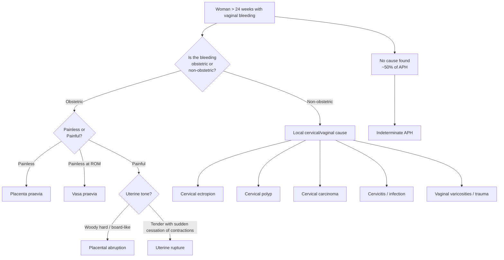
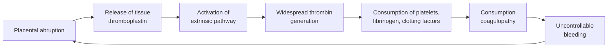

## Differential Diagnosis of Antepartum Hemorrhage

The differential diagnosis of APH is fundamentally a **source-based** exercise. You are asking: where is this blood coming from? The answer can be traced anatomically from above downward — placenta, uterus, cervix, vagina — and each source has a distinct mechanism, presentation, and level of danger. Let me walk you through this systematically.

---

### Conceptual Framework

When a pregnant woman > 24 weeks presents with vaginal bleeding, your thinking should follow this structure:

<Callout title="The 50% Rule">
Approximately **50% of APH remains unexplained** even after full investigation. This is important clinically — you cannot always give the patient a definitive diagnosis. But you *must* rule out the dangerous causes (praevia, abruption, vasa praevia, rupture) before labelling APH as "indeterminate."
</Callout>

---

### The Major Differential Diagnoses

#### 1. Placenta Praevia (~30% of diagnosed APH)

**Why does it bleed?** The placenta is implanted over or near the internal cervical os. As the lower segment stretches and thins from ~28 weeks onward, the inelastic placenta shears away from the underlying decidua. ***The placental bed is where the uterus is very vascular*** [3]. ***Since this is the lower part of the uterus, does not contract very well → hence, the blood vessels are not controlled, results in massive bleeding*** [3].

**How to recognise it at the bedside:**
- ***Painless*** bright red vaginal bleeding — classically unprovoked, often waking the patient from sleep
- ***Soft, non-tender uterus*** on palpation [7]
- ***Fetal head totally above brim*** (high presenting part) or ***malpresentation*** — because the placenta physically blocks engagement [7]
- ***Fetal heart rate usually normal*** (unless massive maternal hemorrhage → reduced uteroplacental perfusion)
- Bleeding is **recurrent** — each episode tends to be progressively heavier ("warning hemorrhages")

**Key risk factors to spot in the clinical stem:**
- ***Previous caesarean sections*** (the more CS, the higher the risk) [7]
- Multiple pregnancy, grand multiparity, advanced maternal age, prior uterine surgery [2][3]

> ***Exam stem clues for praevia:*** "soft and non-tender uterus," "fetal head 5/5 above brim," "known low-lying placenta covering os," "previous 3 caesarean sections," "cephalic presentation but not engaged" [7]

<Callout title="Exam Pearl from Past Papers" type="idea">
***A 38-year-old multiparous woman with three previous caesarean sections presents at 36 weeks with heavy APH. Uterus is soft and non-tender. Fetal head is totally above brim. → Most likely diagnosis: Placenta praevia*** [7]. The logic: multiple CS scars → high risk of praevia; soft non-tender uterus = NOT abruption; head above brim = something blocking engagement (i.e., the placenta).
</Callout>

---

#### 2. Placental Abruption (~25% of diagnosed APH)

**Why does it bleed?** A normally-sited placenta separates prematurely from the uterine wall due to rupture of a decidual artery → retroplacental haematoma formation → progressive separation. Blood may be **revealed** (tracks out through the cervix), **concealed** (trapped behind the placenta), or **mixed**.

**How to recognise it at the bedside:**
- ***Painful*** — constant, severe abdominal pain (blood is a potent myometrial irritant → tonic contraction → ischemic pain)
- ***Uterus is tender and irritable on palpation*** [7] — classically "woody hard" or "board-like" (tonic contraction)
- ***Fetal bradycardia*** or absent fetal heart (> 50% separation → fatal fetal hypoxia) [7]
- Patient may appear **more shocked than the visible blood loss suggests** (concealed component)
- Dark red blood (older, denatured blood from retroplacental collection)

**Key risk factors to spot in the clinical stem:**
- ***Chronic smoker*** [7]
- ***Hypertension / pre-eclampsia (BP 150/100 mmHg)*** [7]
- Previous abruption, cocaine use, trauma, thrombophilia
- Note: a **previous ovarian cystectomy** with a suprapubic transverse scar does **NOT** = uterine scar; it is **not** a risk factor for praevia or uterine rupture [7]

> ***Exam stem clues for abruption:*** "tender and irritable uterus," "fetal bradycardia," "chronic smoker," "hypertension," "suprapubic scar from ovarian cystectomy" (indicating NO uterine surgery, hence NOT praevia or rupture) [7]

<Callout title="Exam Pearl — The Ovarian Cystectomy Trap" type="error">
***A previous laparotomy with ovarian cystectomy (suprapubic transverse scar) does NOT constitute previous uterine surgery.*** The scar is on the abdomen, not the uterus. This patient has no increased risk of praevia from uterine scarring or uterine rupture. If her uterus is tender and irritable, the diagnosis is ***placental abruption***, not praevia or rupture [7].
</Callout>

---

#### 3. Vasa Praevia (Rare, ~1:2500 but lethal if missed)

**Why does it bleed?** Fetal blood vessels (from velamentous cord insertion or connecting a succenturiate lobe) traverse the membranes over the internal os, unsupported by placenta or Wharton's jelly. When membranes rupture, these fragile vessels tear → **fetal hemorrhage**.

**How to recognise it:**
- Painless vaginal bleeding occurring **at the time of membrane rupture** (spontaneous ROM or amniotomy)
- **Small volume** of bleeding (but devastating to the fetus — fetal blood volume is only ~80 mL/kg, i.e., ~250–300 mL at term)
- **Rapid fetal deterioration** — sinusoidal CTG pattern → bradycardia → fetal death
- **Maternal haemodynamic stability** — because the blood is fetal, not maternal

**Key distinguishing feature from praevia:**
- Praevia bleeds **maternal** blood from the placental bed; vasa praevia bleeds **fetal** blood from torn fetal vessels
- Timing: vasa praevia bleeds specifically at ROM, while praevia bleeds with cervical changes (dilation, stretching)
- The **Apt test** (alkaline denaturation test) can distinguish fetal from maternal hemoglobin — fetal Hb (HbF) resists alkali denaturation and stays pink, while adult Hb (HbA) denatures and turns brown/yellow

---

#### 4. Uterine Rupture (Rare but catastrophic)

**Why does it bleed?** The uterine wall — usually at the site of a previous scar — gives way under the pressure of contractions. This allows hemorrhage into the peritoneal cavity and may result in fetal extrusion into the abdomen.

**How to recognise it:**
- Context: ***Previous surgery on uterus (Caesarean section, myomectomy)*** [2][3] — especially **classical (upper segment) CS** which carries ***~10% rupture risk*** for subsequent vaginal delivery [3]
- ***Induced or augmented labour*** [2] — oxytocin increases intraluminal pressure against a weakened scar
- Acute severe abdominal pain, often with a "tearing" sensation
- **Sudden cessation of contractions** — the uterus has lost its wall integrity and cannot contract
- **Fetal parts may be palpable superficially** (if complete rupture with fetal expulsion)
- Maternal shock — often **disproportionate to vaginal bleeding** (most blood is intraperitoneal)
- Fetal heart absent or severely bradycardic

**How to differentiate from abruption:**
- Uterine rupture: **cessation** of contractions (uterus can't contract when ruptured)
- Abruption: **increased** uterine tone (tonic contraction from myometrial irritation)
- Uterine rupture: typically occurs **during labor** in a scarred uterus
- Abruption: can occur at any time, not necessarily during labor

---

#### 5. Local (Non-Obstetric) Cervical and Vaginal Causes

These are generally **benign** and the bleeding is typically **small volume**, **post-coital**, and comes from a visible source on **speculum examination**.

| Cause | Why it bleeds | Key Clinical Features |
|-------|-------------|----------------------|
| **Cervical ectropion** | Columnar epithelium everts under estrogen influence in pregnancy → fragile, bleeds on contact | Post-coital spotting, visible red area around os on speculum |
| **Cervical polyp** | Pedunculated mucosal growth with fragile surface vessels | Visible polyp on speculum; painless contact bleeding |
| **Cervical carcinoma** | Neovascularization within the tumor; irregular friable tissue | Irregular, friable, ulcerated cervix on speculum; may have contact bleeding; consider if no smear history |
| **Cervicitis** | Infection (Chlamydia, gonorrhea, HSV) → inflammation → hyperemia → mucosal friability | Purulent discharge, cervical motion tenderness; bleeding with contact |
| **Vaginal varicosities** | Increased pelvic blood flow in pregnancy → dilated venous channels that can rupture | Visible varicosities on speculum; can bleed with minimal trauma |
| **Vaginal/vulval trauma** | Direct mechanical disruption of tissue | History of trauma or coitus; visible laceration |

<Callout title="Clinical Approach">
You must perform a **speculum examination** (safe in APH) to visualise the cervix and rule out local causes **before** attributing bleeding to a placental source. A cervical carcinoma can present for the first time in pregnancy — don't miss it. However, ***NEVER perform a digital vaginal examination until placenta praevia has been excluded by ultrasound*** [1][7].
</Callout>

---

#### 6. Indeterminate / Unclassified APH (~50%)

- After thorough evaluation (history, examination, USS, speculum), no cause is identified in approximately half of all APH cases
- These are often thought to be due to **marginal placental separation** (small separation at the placental edge) or minor decidual bleeding
- Although often self-limiting, unclassified APH is **not benign** — it is associated with increased risk of:
  - Preterm delivery
  - Low birth weight
  - Adverse perinatal outcomes
  - ***Postpartum hemorrhage*** [2][3]
- Management: observation, serial fetal monitoring, steroids for fetal lung maturity if < 34 weeks

---

### Systematic Comparison of Major Differentials

| Feature | Placenta Praevia | Placental Abruption | Vasa Praevia | Uterine Rupture |
|---------|-----------------|---------------------|--------------|-----------------|
| **Pain** | ***None*** | ***Severe, constant*** | None | Acute, tearing |
| **Bleeding** | Bright red, recurrent | Dark, may be concealed | Small, at ROM | Variable, often intraperitoneal |
| **Blood source** | Maternal | Maternal | ***Fetal*** | Maternal |
| **Uterine tone** | ***Soft*** | ***Woody hard*** | Normal | Loss of contour |
| **Fetal heart** | Usually normal | ***Abnormal*** (bradycardia, late decels) | ***Sinusoidal → absent*** | Absent or bradycardic |
| **Presenting part** | ***High / malpresentation*** | Normal / engaged | Normal | May be superficial |
| **Shock vs. visible bleeding** | Proportional | ***Disproportionate*** | Maternal stable | Disproportionate |
| **Coagulopathy** | Rare | ***Common (DIC)*** | No | Possible if massive |
| **Key risk factor** | Prior CS, placenta praevia on USS | Smoking, pre-eclampsia, cocaine | Velamentous insertion, bilobed/succenturiate placenta | Prior uterine scar + labor |
| **Diagnosis** | USS (TVS) | Clinical + USS | TVS with colour Doppler; Apt test | Clinical → laparotomy |

---

### Less Common Differentials to Consider

| Condition | Reason to Consider | How to Differentiate |
|-----------|-------------------|----------------------|
| **"Bloody show"** (labor) | Mucus plug with blood-streaked mucus as cervix effaces | Small amount, mucoid, associated with contractions; normal part of early labor |
| **Cervical dilatation in preterm labor** | Cervical change → rupture of small cervical vessels | Contractions present, cervical dilatation on speculum/USS, no placental cause |
| **Gestational trophoblastic disease (GTD)** | Very rare beyond 24 weeks (usually presents earlier) | "Snowstorm" appearance on USS, markedly elevated β-hCG, no viable fetus |
| **Coagulopathy / bleeding disorder** | ***Bleeding tendencies*** can cause APH without a structural cause [2] | Check platelet count, PT/aPTT, fibrinogen. History of easy bruising, family history |
| **Marginal sinus rupture** | Tearing of the marginal venous sinus at the placental edge | Often self-limiting; USS may show marginal collection; no retroplacental haematoma |

---

### DIC as a Complication Mimicking a "Cause" of Bleeding

An important conceptual point: **DIC is both a complication of APH and a contributor to ongoing APH.** In placental abruption, ***release of placental materials into circulation → pro-coagulant effect*** [5] → widespread activation of the coagulation cascade → consumption of clotting factors and platelets → ***bleeding due to consumption coagulopathy*** [4].

This creates a vicious cycle:

***DIC laboratory features in acute setting: ↓ platelets, ↑ PT, ↑ APTT, ↓ fibrinogen, ↑ D-dimer, schistocytes on PBS*** [4][5][8]

***Obstetric causes of DIC include: amniotic fluid embolism, eclampsia/HELLP, placenta abruptio, septic abortion*** [4][5]

So when approaching the differential of APH, always ask: **is the bleeding due to a structural/anatomical cause, or is there a coagulopathy making it worse (or both)?**

---

### Approach to Narrowing the Differential

When you see an exam question on APH, use this rapid mental algorithm:

1. **Is the uterus soft or hard?**
   - Soft → Praevia (or local cause)
   - Hard/tender → Abruption (or rupture)

2. **Is there pain?**
   - Painless → Praevia, vasa praevia, local cause
   - Painful → Abruption, rupture

3. **What is the fetal condition?**
   - Normal → Praevia likely, local cause
   - Compromised → Abruption, vasa praevia, rupture

4. **What is the obstetric history?**
   - Prior CS / uterine surgery → Praevia or rupture (depending on uterine tone and pain)
   - Prior ovarian/non-uterine surgery → NOT a risk for praevia/rupture [7]
   - Smoker / hypertension → Abruption [7]

5. **When did it bleed relative to membrane rupture?**
   - At ROM with fetal distress → Vasa praevia

<Callout title="Worked Exam Examples from Past Papers" type="idea">

***Example 1 [7]:*** 22-year-old nullipara, chronic smoker, 35 weeks, heavy vaginal bleeding, pulse 120, BP 150/100, uterus tender and irritable, fetal bradycardia. → **Placental abruption.** Why? Smoker (risk factor), hypertensive (pre-eclampsia/chronic HTN), tender irritable uterus (myometrial irritation from blood), fetal bradycardia (placental insufficiency).

***Example 2 [7]:*** 50-year-old nullipara, 36 weeks, heavy APH, history of laparotomy with ovarian cystectomy, suprapubic transverse scar. → **Placental abruption.** Why? Ovarian cystectomy is NOT uterine surgery → no risk for praevia/rupture. Nullipara at 50 → likely IVF → higher risk of pre-eclampsia → abruption.

***Example 3 [7]:*** 38-year-old multipara with 3 previous CS, 36 weeks, heavy APH, soft non-tender uterus, fetal head totally above brim. → **Placenta praevia.** Why? 3 CS = severe uterine scarring → high risk praevia; soft non-tender = not abruption; head above brim = placenta blocking engagement.
</Callout>

---

<Callout title="High Yield Summary">

**Differential Diagnosis of APH — Key Points:**

1. **Two major causes:** Placenta praevia (~30%) and placental abruption (~25%); ~50% remain unclassified
2. **Praevia = painless, bright red, recurrent, soft uterus, malpresentation, high head**
3. **Abruption = painful, dark blood, tender/hard uterus, fetal distress, DIC risk**
4. **Vasa praevia = fetal blood at ROM, small volume but lethal to fetus, sinusoidal CTG**
5. **Uterine rupture = prior scar + labor, sudden pain then cessation of contractions, shock**
6. **Local causes = cervical ectropion/polyp/carcinoma/cervicitis → diagnosed on speculum**
7. **Never digital VE until praevia excluded by USS**
8. **Previous ovarian cystectomy ≠ previous uterine surgery → does not increase praevia/rupture risk**
9. **DIC is both a complication of and contributor to APH in abruption**
10. **Abruption leads to PPH via DIC (Thrombin) and Couvelaire uterus (Tone)**

</Callout>

---

<ActiveRecallQuiz
  title="Active Recall - APH Differential Diagnosis"
  items={[
    {
      question: "A 30-year-old nulliparous woman at 36 weeks presents with heavy APH. She had a laparotomy with ovarian cystectomy in the past (suprapubic transverse scar). Her uterus is tender and irritable. What is the most likely diagnosis and why is uterine rupture unlikely?",
      markscheme: "Most likely: Placental abruption. Clues: tender irritable uterus (blood irritating myometrium causing tonic contraction). Uterine rupture is unlikely because ovarian cystectomy does NOT involve uterine surgery - the scar is on the abdomen, not the uterus. Without a uterine scar, there is no weakened myometrium to rupture. Placenta praevia is also unlikely due to the tender irritable uterus (praevia has soft non-tender uterus)."
    },
    {
      question: "List 5 features that distinguish placenta praevia from placental abruption and explain the pathophysiological basis for each difference.",
      markscheme: "1) Pain: Praevia painless (no myometrial infiltration) vs Abruption painful (blood irritates myometrium causing tonic contraction and ischemia). 2) Uterine tone: Praevia soft (uterus uninvolved) vs Abruption woody hard (sustained contraction from blood irritation). 3) Blood colour: Praevia bright red (fresh from actively separating placental bed) vs Abruption dark (trapped retroplacental blood undergoes denaturation). 4) Shock vs visible bleeding: Praevia proportional vs Abruption disproportionate (concealed retroplacental haematoma). 5) Fetal condition: Praevia usually normal vs Abruption often compromised (reduced functional placental surface area for gas exchange)."
    },
    {
      question: "Why is vasa praevia so dangerous to the fetus despite causing only a small amount of vaginal bleeding, and how would you differentiate fetal from maternal blood?",
      markscheme: "Vasa praevia bleeds fetal blood (not maternal) from torn fetal vessels traversing membranes over the internal os. Fetal blood volume at term is only 250-300 mL (80 mL/kg), so even 50-100 mL loss can cause fetal exsanguination and death. Mother remains haemodynamically stable. Differentiate using the Apt test (alkaline denaturation test): fetal haemoglobin (HbF) resists alkali and stays pink, while adult haemoglobin (HbA) denatures and turns brown/yellow."
    },
    {
      question: "Explain the vicious cycle of DIC in placental abruption. How does abruption both cause and worsen bleeding through DIC?",
      markscheme: "Abruption causes tissue damage releasing tissue thromboplastin (tissue factor) into maternal circulation. This activates the extrinsic coagulation pathway (Factor VII activation). Widespread thrombin generation causes fibrin deposition in microvasculature, consuming platelets, fibrinogen, and clotting factors (consumption coagulopathy). The resulting inability to form clots causes uncontrollable bleeding, which worsens the abruption and releases more thromboplastin - creating a vicious cycle. Lab: low platelets, prolonged PT/aPTT, low fibrinogen (remember normal pregnancy fibrinogen is 4-6 g/L), elevated D-dimer, schistocytes on PBS."
    },
    {
      question: "A woman at 36 weeks has known placenta praevia covering the os, presents with first episode of painless vaginal bleeding, BP 100/60, pulse 108. Uterus soft non-tender, head 5/5 above brim, profuse bleeding from os on speculum. What is the most appropriate management: conservative monitoring, emergency CS, or digital VE?",
      markscheme: "Emergency Caesarean section. Reasoning: This is a confirmed placenta praevia (covering os on recent USS) with significant haemorrhage (tachycardic at 108, low normal BP indicating early shock), profuse active bleeding from os on speculum, and head completely above brim (5/5). Digital VE is absolutely contraindicated as it can provoke catastrophic haemorrhage. Conservative management is inappropriate as there is profuse active bleeding with haemodynamic compromise. Immediate delivery by CS is required to stop the bleeding."
    }
  ]}
/>

## References

[1] Lecture slides: Block C - Obstetric Emergency Notes to Students.pdf (Introduction, Definition)
[2] Lecture slides: PPH for teaching (20210716)v6.pdf (Risk factors, p6)
[3] Lecture slides: Block C - Postpartum Haemorrhage.pdf (Risk factors p5, Summary p32)
[4] Senior notes: Maksim Medicine Notes.pdf (p165, DIC section — Obstetric causes, clinical features, lab features)
[5] Senior notes: Ryan Ho Haemtology.pdf (p137–138, DIC causes, acute vs chronic DIC, laboratory features)
[7] Lecture slides: OBGYN Clinical Test By Topic.pdf (p6, APH questions and answers — M27/M28 papers)
[8] Senior notes: Ryan Ho Haemtology.pdf (p138, DIC evaluation and ASTH score)
