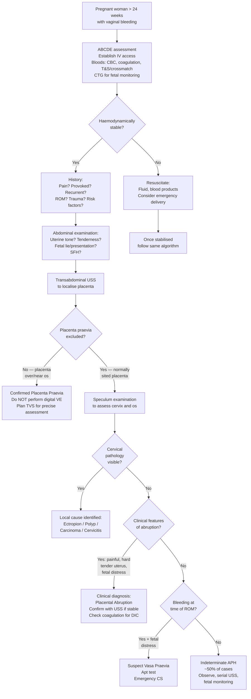

## Diagnosis of Antepartum Hemorrhage

APH is primarily a **clinical diagnosis** — you diagnose it by seeing a pregnant woman beyond 24 weeks with vaginal bleeding. The real diagnostic challenge is determining the **cause** of the APH, because this dictates management. There are no formal "diagnostic criteria" for APH itself (unlike, say, pre-eclampsia), but there are established diagnostic approaches for each underlying cause. Let me walk through the entire diagnostic algorithm from the moment the patient arrives.

---

### Principles of Diagnostic Approach

Before diving into investigations, understand the overarching logic:

1. **Stabilise first, diagnose second** — APH can be life-threatening. Resuscitation takes priority over diagnosis.
2. **History and examination give you the diagnosis in most cases** — the pattern of pain, bleeding character, uterine tone, and fetal condition will point you to the cause before any investigation result returns.
3. **Ultrasound is the single most important investigation** — it confirms or excludes placenta praevia (the diagnosis you must rule out before doing anything else).
4. ***NEVER perform a digital vaginal examination until placenta praevia has been excluded by ultrasound*** [1][7] — this cannot be overemphasised. A finger through a placenta praevia can cause torrential hemorrhage.
5. **Speculum examination IS safe** — it lets you visualise the cervix and rule out local causes (ectropion, polyp, carcinoma, cervicitis) without disturbing the placenta.

---

### Diagnostic Algorithm

---

### Initial Assessment (Before Any Investigation)

#### A. History — What to Ask and Why

| Question | What you're looking for | Why it matters |
|----------|------------------------|----------------|
| **Character of bleeding** — Colour? Amount? Clots? | Bright red = fresh arterial/venous bleeding (praevia); Dark = older denatured blood (abruption) | Blood trapped behind placenta oxidises → dark colour |
| **Pain** — Present? Character? Constant vs. intermittent? | Painless → praevia; Constant severe pain → abruption; Acute tearing pain → rupture | Pain in abruption = blood infiltrating myometrium → irritation → tonic contraction → ischemia |
| **Provocation** — Post-coital? Post-VE? Spontaneous? | Post-coital = cervical cause or praevia; Spontaneous = praevia or abruption | Coital trauma disrupts fragile cervical ectropion or provokes separation in praevia |
| **Timing relative to ROM** | Bleeding AT membrane rupture = vasa praevia | Fetal vessels over os tear when membranes rupture |
| **Recurrence** | Recurrent episodes → praevia (warning hemorrhages); Single event → abruption | Progressive lower segment stretching causes intermittent praevia separation |
| **Fetal movements** | Reduced/absent → fetal compromise (abruption) | Placental separation → reduced gas exchange → fetal hypoxia |
| **Risk factors** | ***Previous CS, myomectomy*** → praevia/rupture; ***Smoking, pre-eclampsia*** → abruption [2][7] | Uterine scarring = praevia + PAS risk; Vascular disease = abruption risk |
| **Known placental localisation** | Was the anomaly scan at 20 weeks reassuring? Was placenta low-lying? | Most praevia diagnosed antenatally at the 20-week morphology scan; if "low-lying" at 20 weeks, serial TVS should follow |
| ***Bleeding tendencies*** | Inherited or acquired coagulopathy? | May cause APH without a structural cause [2] |
| ***Anaemia (Haemoglobin < 10 g/dL)*** | Baseline Hb? | Anaemic patients decompensate earlier [2] |

#### B. Abdominal Examination

Performed **before** any vaginal assessment. Key findings:

| Component | What to assess | Interpretation |
|-----------|---------------|----------------|
| **Inspection** | Scars? Distension? | ***Scars from previous CS or myomectomy*** suggest risk of praevia/rupture vs. ovarian cystectomy scar (no uterine risk) [7] |
| **Symphysial-fundal height (SFH)** | Measure with tape (ulnar border of left hand to locate fundus) [9] | Larger than dates → polyhydramnios, multiple pregnancy, macrosomia, concealed abruption (expanding haematoma increases uterine size). Smaller → IUGR, oligohydramnios [9] |
| **Uterine tone** | Soft? Tense? "Woody hard"? | Soft = praevia or normal; Hard/tense/tender = abruption (myometrial irritation); Loss of uterine contour = rupture |
| **Tenderness** | Localised? Generalised? | Abruption = localised tenderness over haematoma site; Rupture = generalised peritonism |
| **Fetal lie and presentation** | Longitudinal/transverse/oblique? Cephalic/breech? | ***Malpresentation or high head (5/5 above brim)*** = praevia (placenta blocking engagement) [7] |
| **Engagement** | How many fifths palpable above brim? | 5/5 above = completely unengaged (praevia). A normally engaged head makes praevia very unlikely |

> ***SFH interpretation [9]:*** Usually number of weeks ≈ cm (from 20–36 weeks). ***Large SFH — wrong dates, polyhydramnios, multiple pregnancy, macrosomia.*** ***Small SFH — IUGR, wrong dates, oligohydramnios, intrauterine death, transverse lie.***

#### C. Speculum Examination (Safe — Do This, Not Digital VE)

- Performed **after** ultrasound confirms no praevia, **or** if USS is unavailable, speculum can be done first (it does not disturb the placenta)
- Visualise: cervical os (open? closed?), cervical surface (ectropion? polyp? carcinoma?), source of bleeding (from os vs. cervical surface)
- Take swabs if cervicitis suspected (Chlamydia/gonorrhea NAAT)
- If cervical carcinoma suspected → biopsy (colposcopy-guided if possible)

---

### Investigation Modalities

#### 1. Ultrasound — The Cornerstone Investigation

Ultrasound is the **first-line** investigation in APH. It answers the critical question: **where is the placenta?**

##### a. Transabdominal Ultrasound (TAS)

| Aspect | Detail |
|--------|--------|
| **Role** | Initial screening to localise placenta; assess fetal viability, presentation, amniotic fluid volume |
| **Sensitivity for praevia** | ~95% — good for detecting a posterior placenta praevia but can overcall anterior low-lying placenta due to full bladder artefact |
| **Limitation** | Cannot precisely measure the placental edge-to-os distance when the placenta is posterior or when there is a presenting part obscuring the lower segment |
| **Key findings** | Placenta overlying or near the internal os; retroplacental haematoma (hypoechoic/mixed echogenicity collection); fetal presentation; AFI |

##### b. Transvaginal Ultrasound (TVS)

| Aspect | Detail |
|--------|--------|
| **Role** | **Gold standard** for diagnosing placenta praevia and measuring the precise distance from placental edge to internal os |
| **Safety** | ***TVS is SAFE in placenta praevia*** — the probe is placed in the vagina (not through the cervix). It does NOT touch the placenta. This is different from a digital VE which can disrupt the placenta |
| **Precision** | Can measure placental edge-to-os distance to within 5 mm |
| **Key measurements** | Placental edge ≥ 20 mm from os → **low-lying but vaginal delivery may be possible**; Placental edge < 20 mm from os or covering os → **placenta praevia** (CS mandatory) |
| **Colour Doppler** | Essential for diagnosing **vasa praevia** (fetal vessels seen traversing membranes over the os) and **placenta accreta spectrum** (abnormal lacunae, loss of retroplacental clear zone, bladder wall invasion) |

<Callout title="TVS is Safe in Praevia" type="error">
Students often confuse transvaginal ultrasound with digital vaginal examination. **TVS is completely safe** — the ultrasound probe goes into the vagina but does not pass through the cervical os or touch the placenta. It is the **gold standard** for measuring placental edge-to-os distance. **Digital VE** is the dangerous one — your finger goes through the cervix and can separate the placenta.
</Callout>

##### c. USS Findings in Specific Diagnoses

| Diagnosis | USS Findings |
|-----------|-------------|
| **Placenta praevia** | Placenta covering or within 20 mm of the internal os on TVS. May be anterior (higher risk of PAS if prior CS scar), posterior, or lateral |
| **Low-lying placenta** | Placental edge within 20 mm of os but not covering it. ~90% of "low-lying" placentas at 20 weeks will "migrate" upward by term (differential growth of lower segment draws the placenta away) |
| **Placental abruption** | Retroplacental hapoechoic or mixed-echogenicity collection (haematoma). **However, USS sensitivity for abruption is only ~25–50%** — a normal USS does NOT exclude abruption. Abruption is primarily a **clinical diagnosis** |
| **Placenta accreta spectrum** | Irregular lacunae ("Swiss cheese" appearance), loss of the retroplacental clear zone (hypoechoic zone between placenta and myometrium), thinning or interruption of the hyperechoic uterine serosa-bladder interface, colour Doppler showing abnormal vascularity crossing the myometrium-placenta interface |
| **Vasa praevia** | Colour Doppler showing fetal vessels traversing the membranes over or near the internal os. Best seen on TVS with colour flow mapping |

<Callout title="USS Cannot Exclude Abruption" type="error">
A common exam mistake: assuming that a normal ultrasound rules out abruption. USS sensitivity for detecting retroplacental haematoma is only **25–50%**. Fresh blood can be isoechoic with the placenta and therefore invisible. **Placental abruption is a CLINICAL diagnosis** based on painful bleeding + tender/hard uterus + fetal distress. USS supports but does not exclude.
</Callout>

##### d. Placental Migration / Serial USS

- At the **20-week anomaly scan**, approximately 5–10% of women have a low-lying placenta
- By term, ~90% of these will have "migrated" — not because the placenta physically moves, but because the lower segment grows differentially, drawing the placental edge away from the os
- **Serial TVS** is performed at **32 weeks** and again at **36 weeks** if the placenta remains low
- If the placenta still covers or is within 20 mm of the os at 36 weeks → plan elective CS at **37–38 weeks** (praevia) or await further migration (low-lying)

---

#### 2. Cardiotocography (CTG) — Fetal Assessment

| Aspect | Detail |
|--------|--------|
| **Role** | Continuous electronic fetal heart rate monitoring — assesses fetal well-being |
| **Normal CTG** | Baseline 110–160 bpm, presence of accelerations, absence of decelerations, moderate variability (5–25 bpm) |
| **Abnormal patterns in APH** | |
| — ***Fetal bradycardia*** | Sustained FHR < 110 bpm → acute fetal hypoxia (seen in severe abruption with massive placental separation) [7] |
| — Late decelerations | FHR dips occurring after the peak of contraction → uteroplacental insufficiency (abruption) |
| — Sinusoidal pattern | Smooth, sine-wave-like undulation without accelerations → **fetal anaemia** (vasa praevia — the fetus is bleeding out, or severe abruption with massive feto-maternal hemorrhage) |
| — Absent variability | Loss of the normal beat-to-beat variation → severe fetal compromise |
| — Tachycardia | FHR > 160 bpm → early compensatory response to hypoxia, maternal fever, or dehydration |

> ***Cardiotocography shows fetal bradycardia*** is a key exam finding pointing toward **placental abruption** in the context of a tender, irritable uterus [7].

---

#### 3. Laboratory Investigations

These serve two purposes: (a) assess the severity of maternal blood loss, and (b) detect coagulopathy (especially DIC in abruption).

| Test | What it tells you | Key findings / interpretation |
|------|-------------------|------------------------------|
| **CBC (FBC)** | Hemoglobin, hematocrit, platelet count | ↓ Hb suggests significant blood loss (but Hb takes time to drop — may be falsely reassuring acutely due to hemoconcentration). ***Anaemia Hb < 10 g/dL*** worsens prognosis [2]. ↓ Platelets → suggests DIC (consumption) |
| **Blood group and crossmatch** | ABO/Rh type; crossmatch blood for transfusion | **Essential** — have at least 4 units crossmatched and available for major APH. Check Rh status for anti-D prophylaxis if Rh-negative |
| **Coagulation screen (PT, aPTT, fibrinogen)** | Assess for DIC | ***↑ PT, ↑ aPTT, ↓ fibrinogen*** → DIC [4][5]. **Remember:** Normal pregnancy fibrinogen is 4–6 g/L. A level of < 2 g/L is alarming. ***Lab features of acute DIC: ↓ platelet, ↑ PT, ↑ APTT, ↓ fibrinogen, ↑ D-dimer, schistocytes on PBS*** [4][5] |
| **D-dimer** | Fibrin degradation products | ***↑ D-dimer*** in DIC [4][5]. Note: D-dimer is physiologically elevated in pregnancy, so interpretation requires clinical context |
| **Peripheral blood smear (PBS)** | Microangiopathic hemolytic anemia (MAHA) | ***Schistocytes*** (fragmented RBCs) → blood forced through fibrin meshwork in microvasculature → MAHA (seen in DIC, TTP/HUS, HELLP) [4][5] |
| **Renal function (RFT)** | Urea, creatinine, electrolytes | Assess for acute kidney injury from hypovolemia or DIC-related renal microthrombosis |
| **Liver function (LFT)** | AST, ALT, bilirubin, albumin | Screen for HELLP syndrome (***Haemolysis, Elevated Liver enzymes, Low Platelets***) — which can coexist with abruption in the context of pre-eclampsia |
| **Urate** | Serum uric acid | Elevated in pre-eclampsia (reduced renal urate clearance from endothelial dysfunction); useful if abruption coexists with pre-eclampsia |
| **Kleihauer-Betke test** | Quantifies fetal cells in maternal circulation | Used in **Rh-negative** mothers to calculate the dose of anti-D immunoglobulin needed. Also useful in suspected feto-maternal hemorrhage (FMH) — seen in abruption, trauma |
| **Apt test (Singer test)** | Distinguishes fetal from maternal hemoglobin | Fetal Hb (HbF) resists alkali denaturation (stays pink in NaOH). Maternal Hb (HbA) denatures (turns brown/yellow). Used when **vasa praevia** is suspected — the bleeding is fetal blood |
| **Urinalysis** | Protein, glucose | ***Proteinuria ≥ 2+ → pre-eclampsia*** (which is a risk factor for abruption) [10]. Also check urine output (oliguria suggests significant hypovolemia or renal involvement) |

##### Interpreting Coagulation in APH — A Practical Framework

| Parameter | Normal in Pregnancy | Mild APH | Severe APH with DIC |
|-----------|-------------------|----------|---------------------|
| Platelets | 150–400 × 10⁹/L | Normal | ↓↓ (< 100, sometimes < 50) |
| PT | Normal (11–13s) | Normal | ↑ (> 1.5× control) |
| aPTT | Normal (25–35s) | Normal | ↑ |
| Fibrinogen | 4–6 g/L | Normal | ↓↓ (< 2 g/L = critical) |
| D-dimer | Mildly ↑ (physiological) | Mild ↑ | ↑↑↑ |

---

#### 4. Blood Pressure Monitoring

- Hypertension (***BP 150/100 mmHg***) in the context of APH points toward **pre-eclampsia** as the underlying cause of abruption [7]
- ***Pre-eclampsia diagnostic criteria: new-onset hypertension after 20 weeks + proteinuria ≥ 300 mg/day OR end-organ damage (kidneys, liver, neuro, haematological) OR uteroplacental dysfunction*** [10]
- Serial BP monitoring is essential as pre-eclampsia can evolve rapidly

---

#### 5. MRI (Adjunct)

| Aspect | Detail |
|--------|--------|
| **Role** | Second-line investigation, primarily for **placenta accreta spectrum (PAS)** when USS findings are equivocal |
| **Advantages** | Superior soft-tissue contrast; can visualise the depth of placental invasion (accreta vs. increta vs. percreta), especially posterior placenta and parametrial involvement |
| **Limitations** | Not available emergently; expensive; patient must be stable enough to lie still |
| **Key findings in PAS** | Dark T2 intraplacental bands, uterine bulging, focal myometrial thinning or disruption, bladder wall irregularity |

---

#### 6. Fetal Assessment Beyond CTG

| Investigation | Role |
|--------------|------|
| **Biophysical Profile (BPP)** | USS-based assessment of fetal breathing, movements, tone, and amniotic fluid + CTG. Used if ongoing monitoring is needed (e.g., conservative management of minor praevia) |
| **Doppler velocimetry** | Umbilical artery Doppler → assess placental resistance. Absent or reversed end-diastolic flow = severe placental insufficiency → consider delivery |
| **Middle cerebral artery (MCA) Doppler** | Peak systolic velocity (PSV) → non-invasive assessment of fetal anemia. Elevated MCA-PSV suggests fetal anemia (feto-maternal hemorrhage from abruption, or fetal bleeding from vasa praevia) |

---

### Diagnostic Criteria for Specific Causes of APH

While APH itself has no formal diagnostic criteria, the major underlying causes do:

#### Placenta Praevia — Diagnostic Criteria (RCOG / ISUOG)

| Category | TVS Finding | Clinical Implication |
|----------|------------|---------------------|
| **Placenta praevia** | Placenta partially or completely covers the internal cervical os | Caesarean section mandatory; delivery at 37–38 weeks (earlier if bleeding) |
| **Low-lying placenta** | Placental edge within 20 mm of internal os but not covering it | Serial TVS at 32 and 36 weeks; vaginal delivery may be possible if edge > 20 mm from os at term |
| **Normally sited placenta** | Placental edge > 20 mm from internal os | Praevia excluded; look for other causes of APH |

#### Placental Abruption — Diagnostic Approach

There are **no formal diagnostic criteria** for abruption. It is a **clinical diagnosis** supported (but not excluded) by investigations:

| Component | Findings |
|-----------|----------|
| **Clinical** | Painful vaginal bleeding + tender/hard uterus + fetal distress = **clinical triad of abruption** |
| **USS** | Retroplacental haematoma (sensitivity only 25–50%; absence does NOT exclude) |
| **Laboratory** | Coagulopathy (↓ platelets, ↑ PT/aPTT, ↓ fibrinogen, ↑ D-dimer) supports the diagnosis and indicates severity |
| **Retrospective** | Definitive diagnosis at delivery → retroplacental clot adherent to the placental surface |

> The key teaching point: **Abruption is diagnosed clinically, not by ultrasound.** If the clinical picture fits (painful bleeding, hard tender uterus, fetal distress), treat as abruption regardless of USS findings.

#### Vasa Praevia — Diagnostic Approach

| Setting | Diagnostic Method |
|---------|------------------|
| **Antenatal (ideal)** | TVS with colour Doppler at 20 weeks and again in 3rd trimester → fetal vessels seen traversing membranes over the internal os |
| **Acute presentation** | Bleeding at ROM + acute fetal distress + stable mother → Apt test to confirm fetal blood → emergency CS |
| **Screening indication** | Velamentous cord insertion, bilobed/succenturiate placenta, IVF conception, low-lying placenta → all warrant colour Doppler screening for vasa praevia |

---

### Summary: Investigations Ordered in APH

| Priority | Investigation | Purpose |
|----------|--------------|---------|
| **Immediate** | CBC, coagulation screen (PT/aPTT/fibrinogen), group & crossmatch | Assess blood loss severity, detect DIC, prepare for transfusion |
| **Immediate** | CTG | Fetal well-being assessment |
| **Urgent** | Transabdominal USS → TVS if needed | Localise placenta, detect retroplacental haematoma, assess fetal condition |
| **Urgent** | Speculum examination (after praevia excluded or if USS unavailable) | Visualise cervix, rule out local causes |
| **As indicated** | Kleihauer-Betke test | Rh-negative mothers (anti-D dosing); suspected FMH |
| **As indicated** | Apt test | Suspected vasa praevia (distinguish fetal vs. maternal blood) |
| **As indicated** | D-dimer, PBS, LFT, RFT | DIC workup, HELLP screen, renal assessment |
| **As indicated** | Urinalysis | Screen for proteinuria (pre-eclampsia) |
| **As indicated** | MRI | Equivocal USS for PAS |
| **As indicated** | MCA Doppler | Suspected fetal anemia |

---

<Callout title="High Yield Summary">

**Diagnosis of APH — Key Points:**

1. **APH is a clinical diagnosis** — the cause is determined primarily by history and examination pattern
2. **Ultrasound (TVS = gold standard)** confirms/excludes placenta praevia and measures edge-to-os distance (< 20 mm or covering = praevia; within 20 mm = low-lying)
3. **TVS is SAFE** in praevia — do not confuse with digital VE which is CONTRAINDICATED
4. **USS sensitivity for abruption is only 25–50%** — a normal USS does NOT exclude abruption; it is a **clinical diagnosis** (painful bleeding + hard tender uterus + fetal distress)
5. **Speculum examination** is safe and essential to rule out local cervical/vaginal causes
6. **CTG** is essential for fetal assessment — ***fetal bradycardia*** in context of tender uterus → abruption [7]
7. **Coagulation screen is critical** — look for DIC (↓ fibrinogen < 2 g/L in pregnancy is alarming; ↓ platelets, ↑ PT/aPTT, ↑ D-dimer)
8. **Kleihauer-Betke** for Rh-negative mothers; **Apt test** to distinguish fetal from maternal blood in suspected vasa praevia
9. **Placental migration**: ~90% of low-lying placentas at 20 weeks resolve by term; serial TVS at 32 and 36 weeks
10. **Pre-eclampsia screening** (BP + urinalysis) important when abruption suspected — they often coexist [7][10]

</Callout>

---

<ActiveRecallQuiz
  title="Active Recall - APH Diagnosis and Investigation"
  items={[
    {
      question: "Why is transvaginal ultrasound safe in suspected placenta praevia, while digital vaginal examination is contraindicated? Explain the anatomical difference.",
      markscheme: "TVS: the ultrasound probe is placed in the vagina (anterior fornix) but does NOT pass through the cervical os or touch the placenta. It images through the vaginal wall using sound waves. There is no mechanical disruption of the placental-decidual interface. Digital VE: the examining finger enters the cervical os and can physically contact and separate the placenta from the underlying decidua, tearing open the highly vascular placental bed spiral arteries. The lower segment cannot contract effectively to tamponade this bleeding, resulting in potentially catastrophic hemorrhage."
    },
    {
      question: "A woman at 33 weeks has clinical features strongly suggestive of placental abruption, but her transabdominal USS shows a normally sited placenta with no retroplacental collection. Can you exclude abruption? Explain.",
      markscheme: "No. USS sensitivity for detecting retroplacental haematoma in abruption is only 25-50%. Fresh blood can be isoechoic with placental tissue and therefore invisible on USS. Abruption is a CLINICAL diagnosis based on the triad of: painful vaginal bleeding, tender/hard (woody) uterus, and fetal distress. A normal USS does not exclude abruption. If the clinical picture fits, treat as abruption regardless of USS findings."
    },
    {
      question: "List the complete coagulation profile you would expect in severe placental abruption complicated by DIC, and explain why fibrinogen of 2.5 g/L is concerning in pregnancy.",
      markscheme: "Expected findings: decreased platelets (consumed in microthrombi), prolonged PT and aPTT (clotting factors consumed), decreased fibrinogen (consumed), elevated D-dimer (fibrin degradation), schistocytes on PBS (MAHA from RBC fragmentation through fibrin strands). Fibrinogen 2.5 g/L is concerning because normal pregnancy fibrinogen is 4-6 g/L (physiologically elevated). A level of 2.5 g/L represents significant consumption. Fibrinogen below 2 g/L is a strong predictor of severe hemorrhage and indicates established DIC."
    },
    {
      question: "What is the Apt test and in which specific APH diagnosis is it most useful? Explain the biochemical principle.",
      markscheme: "The Apt test (alkaline denaturation test or Singer test) distinguishes fetal from maternal haemoglobin. Most useful in suspected VASA PRAEVIA where bleeding is fetal blood. Principle: Mix the blood sample with NaOH (alkali). Fetal haemoglobin (HbF) has a different globin chain structure (alpha2-gamma2) that resists alkali denaturation - stays pink/red. Adult haemoglobin (HbA, alpha2-beta2) is denatured by alkali - turns brown/yellow. If the blood stays pink, it is fetal blood, confirming vasa praevia."
    },
    {
      question: "A 20-week anomaly scan shows a low-lying placenta reaching the internal os. Outline the follow-up plan and explain the concept of placental migration.",
      markscheme: "Follow-up plan: Serial TVS at 32 weeks and 36 weeks to reassess placental position. Approximately 90% of low-lying placentas at 20 weeks will have migrated away from the os by term. Placental migration is not actual physical movement of the placenta. Rather, the lower uterine segment grows differentially in the third trimester, stretching and elongating. This draws the placental edge upward relative to the internal os. If at 36 weeks the placenta still covers the os, plan elective CS at 37-38 weeks. If edge is more than 20 mm from os, vaginal delivery may be possible."
    }
  ]}
/>

## References

[1] Lecture slides: Block C - Obstetric Emergency Notes to Students.pdf (Introduction, Definition)
[2] Lecture slides: PPH for teaching (20210716)v6.pdf (Risk factors, p6)
[4] Senior notes: Maksim Medicine Notes.pdf (p165, DIC section — laboratory features, clinical features)
[5] Senior notes: Ryan Ho Haemtology.pdf (p137–138, DIC causes, laboratory features)
[7] Lecture slides: OBGYN Clinical Test By Topic.pdf (p6, APH questions — clinical features pointing to diagnosis)
[9] Senior notes: Ryan Ho Fundamentals.pdf (p191, Obstetric examination, SFH measurement and interpretation)
[10] Lecture slides: Block C - Hypertension and Pregnancy (CFB WCS in 2023_24).pdf (p15, p25, pre-eclampsia diagnostic criteria and management)
