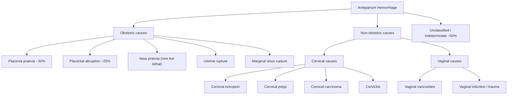

# Antepartum Hemorrhage (APH)

---

## 1. Definition

Antepartum hemorrhage (APH) literally means **bleeding before birth** — from the Latin *ante-* (before) + *partum* (birth/delivery). Formally:

> **APH is defined as bleeding from the genital tract occurring from 24+0 weeks of gestation until delivery of the baby.** [1][2]

- Why 24 weeks? Because this is the threshold of **fetal viability** — before 24 weeks, vaginal bleeding is classified under **threatened miscarriage** (< 12 weeks) or **mid-trimester bleeding** (12–24 weeks). The distinction matters because management pivots from pregnancy preservation to balancing maternal safety with potential fetal delivery.
- Note: Some sources use 20 weeks as the cut-off, but **HKU and RCOG use 24 weeks** [1].

***Bleeding (haemorrhage) is one of the major causes of maternal mortality*** [1]. In Hong Kong, maternal mortality from hemorrhage has dramatically decreased (from 17 deaths in 1961 to approximately 0–1 per year currently), but APH remains a leading cause of maternal morbidity and perinatal mortality [1].

***Bleeding can occur before the delivery of the baby (antepartum haemorrhage) or after the delivery of the baby (postpartum haemorrhage).*** [1]

<Callout title="Clinical Pearl">
APH complicates approximately 3–5% of all pregnancies. Although many cases are mild and self-limiting, APH is a **risk factor for postpartum hemorrhage (PPH)** — always be prepared for ongoing bleeding after delivery in a woman who has had APH [2][3].
</Callout>

---

## 2. Epidemiology and Risk Factors

### 2.1 Epidemiology

| Parameter | Detail |
|-----------|--------|
| Incidence | ~3–5% of pregnancies beyond 24 weeks |
| Placenta praevia incidence | ~0.3–0.5% of pregnancies at term |
| Placental abruption incidence | ~0.5–1% of pregnancies |
| Leading cause of 3rd trimester admission | Yes — APH is the #1 reason for emergency antenatal admission |
| Contribution to maternal mortality | Hemorrhage (ante- and postpartum combined) is within the top 3 direct causes of maternal death worldwide |
| Hong Kong context | Placenta praevia is relatively more common in HK due to high Caesarean section (CS) rates (~40–45% in private sector) and rising maternal age [1] |

### 2.2 Risk Factors

Understanding risk factors requires knowing the two major causes (placenta praevia and placental abruption) — each has distinct risk factors:

#### Risk Factors for Placenta Praevia

| Risk Factor | Mechanism |
|-------------|-----------|
| ***Previous Caesarean section*** | Scarred lower segment → preferential implantation on scar tissue; disrupted endometrium fails to support normal decidualization → placenta "seeks" more surface area, tends to spread over the lower segment |
| ***Previous surgery on uterus (myomectomy)*** | Same mechanism — uterine scarring [2][3] |
| Previous uterine curettage / ***repeated suction evacuation*** | Endometrial damage → abnormal implantation site [2] |
| ***Grand multiparity (≥ 5 births ≥ 20 weeks)*** | Repeated pregnancies → progressive endometrial damage and thinning → placenta migrates to lower segment [3] |
| Advanced maternal age ( > 35) | Decreased endometrial vascularity → placenta needs larger surface area → more likely to extend over os |
| ***Multiple pregnancy*** | Larger placental mass → higher probability of encroaching on the lower segment |
| Smoking | Causes relative uteroplacental hypoxia → compensatory placental enlargement → greater chance of covering os |
| IVF/ART conception | Embryo transfer technique may favour lower uterine implantation; also associated with higher rates of CS and multiple pregnancy |
| Previous placenta praevia | Recurrence risk ~4–8% |

#### Risk Factors for Placental Abruption

| Risk Factor | Mechanism |
|-------------|-----------|
| ***Pre-eclampsia*** | Endothelial dysfunction and spiral artery remodeling failure → ischemia-reperfusion injury → decidual necrosis → bleeding into decidua basalis → abruption [1] |
| Chronic hypertension | Same mechanism — vascular damage to spiral arteries |
| ***Previous PPH / previous abruption*** | Underlying abnormal placentation tends to recur [2] |
| Smoking / cocaine use | Vasoconstriction → decidual ischemia and necrosis → hemorrhage into decidual-placental interface |
| Trauma (e.g. RTA, domestic violence) | Shear forces separate the inelastic placenta from the elastic uterine wall |
| Preterm premature rupture of membranes (PPROM) | Sudden decompression of the uterus → mechanical separation |
| ***Polyhydramnios*** → sudden decompression | Same mechanism as PPROM [2] |
| Thrombophilia (e.g. APLS, Factor V Leiden) | Micro-thrombosis at the uteroplacental interface → infarction → abruption |
| Short umbilical cord | Traction on placenta during fetal movement |
| ***Anaemia (Hb < 10 g/dL)*** | Reduced oxygen carrying capacity → inadequate placental perfusion → ischemic damage (also worsens outcomes) [2] |
| Abdominal trauma | Direct mechanical disruption |

<Callout title="Exam High Yield" type="idea">
***Antepartum hemorrhage*** is itself a ***risk factor for postpartum hemorrhage*** [2][3]. Always plan for the possibility of PPH when managing APH. The mechanism: APH indicates abnormal placentation or coagulopathy — both predispose to continued bleeding after delivery.
</Callout>

---

## 3. Anatomy and Function: The Placental-Uterine Interface

To understand APH, you need to understand the architecture of where bleeding originates.

### 3.1 The Uterus

- **Upper segment (fundus and body):** Thick muscular wall composed of interlacing smooth muscle fibres ("living ligatures"). ***The upper segment of the uterus is the main contraction force*** → this is why the uterus contracts effectively after placental delivery (to compress the spiral arteries and stop bleeding) [3].
- **Lower segment:** The lower part of the uterus that develops from the isthmus during the 3rd trimester. It is:
  - **Thinner** — fewer muscle fibres
  - **Less contractile** — cannot effectively compress blood vessels
  - ***Does not contract very well → hence, the blood vessels are not controlled, results in massive bleeding*** [3]
  - This is why **placenta praevia** (placenta in the lower segment) bleeds so profusely — the lower segment cannot contract to compress the spiral arteries after separation.

### 3.2 The Placenta

- Anchored to the decidua basalis (modified endometrium) via cytotrophoblast columns
- Receives maternal blood supply through **spiral arteries** that have been remodeled by trophoblast invasion (loss of smooth muscle → low resistance, high flow system)
- At term, uterine blood flow is approximately **500–700 mL/min** — this is why any disruption to the placental-uterine interface can cause catastrophic hemorrhage within minutes

### 3.3 The Decidua

- The decidua basalis is the maternal surface of the placenta
- In **abruption**, bleeding occurs within the decidua basalis → a retroplacental haematoma forms → separates the placenta from the uterine wall
- In **praevia**, the placenta is implanted over or near the internal cervical os → as the lower segment thins and stretches in the 3rd trimester, the inelastic placenta separates from the underlying uterine wall

### 3.4 The Cervix

- The cervix must dilate and efface during labor
- If a placenta overlies the internal os, any cervical change causes mechanical shearing of the placental villi from the decidua → painless, bright red bleeding (classic praevia presentation)

***The placental bed is where the uterus is very vascular*** [3]. ***As a result, since this is the lower part of the uterus, does not contract very well → hence, the blood vessels are not controlled, results in massive bleeding*** [3].

---

## 4. Etiology (with Focus on Hong Kong)

APH is broadly classified by source:

> In clinical practice, approximately **50% of APH is unclassified** (no cause found despite investigation). The two major obstetric causes — **placenta praevia** and **placental abruption** — together account for about half of all identified causes.

### 4.1 Placenta Praevia

**Definition:** Placenta implanted wholly or partially in the lower uterine segment, in relation to the internal cervical os.

#### Pathophysiology

1. **Abnormal implantation site:** The blastocyst implants low in the uterine cavity (reasons: prior endometrial damage, large placental surface area, random chance)
2. **Lower segment formation:** From ~28 weeks, the isthmus of the uterus transforms into the lower segment by progressive stretching and thinning
3. **Shearing forces:** The inelastic placenta cannot stretch with the lower segment → partial separation occurs → maternal spiral arteries at the separation site are opened → ***bleeding from the placental bed which is very vascular*** [3]
4. **Inability to tamponade:** The lower segment has sparse muscle fibres → cannot contract to compress the torn vessels → ***results in massive bleeding*** [3]
5. **Provocation by cervical changes:** Digital vaginal examination, sexual intercourse, or onset of labor causes further cervical dilation → further placental separation → more bleeding

> Key concept: Praevia bleeding is **painless** because there is no uterine irritability or contractions — the blood escapes freely through the cervical os. The uterus is soft and non-tender.

#### Relevance to Hong Kong

Hong Kong has one of the **highest CS rates in the world** (overall ~30%, private sector ~45%). Each prior CS increases the risk of placenta praevia:
- 1 prior CS: RR ~1.5
- 2 prior CS: RR ~2.0
- ≥ 3 prior CS: RR ~3.0+

This also increases the risk of **placenta accreta spectrum (PAS)** — the feared combination of praevia + accreta.

### 4.2 Placental Abruption (Abruptio Placentae)

**Definition:** Premature separation of a normally implanted placenta from the uterine wall before delivery of the fetus.

#### Pathophysiology

1. **Decidual arterial pathology:** Abnormal spiral artery remodeling (as in pre-eclampsia) → vessel wall necrosis → rupture of a decidual artery
2. **Retroplacental haematoma formation:** Blood accumulates between the placenta and decidua basalis
3. **Expanding haematoma:** Progressive separation → more vessels disrupted → haematoma enlarges
4. **Two patterns of bleeding:**
   - **Revealed** (~80%): Blood tracks down between the membranes and uterine wall → escapes through the cervix → visible vaginal bleeding
   - **Concealed** (~20%): Blood is trapped behind the placenta → NO visible vaginal bleeding but the patient is in shock (this is the dangerous one — "the patient who looks worse than her bleeding would suggest")
   - **Mixed:** Both revealed and concealed components
5. **Uterine irritability:** Extravasated blood infiltrates the myometrium → acts as a powerful irritant → uterine hypertonicity, tenderness, and contractions
6. **Couvelaire uterus** (in severe cases): Massive myometrial infiltration → the uterus appears purple/bruised at laparotomy → impaired contractility postpartum → **PPH**
7. **DIC:** Release of tissue thromboplastin from the damaged placenta into the maternal circulation → activates the extrinsic coagulation pathway → ***disseminated intravascular coagulation*** [4][5]
   - This is the **obstetric cause par excellence** of acute DIC
   - ***Obstetric causes of DIC include amniotic fluid embolism, eclampsia/HELLP, placenta abruptio*** [4]
   - ***Release of placental materials into circulation → pro-coagulant effect*** [5]
8. **Fetal compromise:** Placental separation reduces the functional surface area for gas exchange → fetal hypoxia → fetal distress → fetal death if > 50% separation

#### Hong Kong Relevance

- Pre-eclampsia prevalence in HK: ~3–5% (similar to global)
- Smoking prevalence in HK pregnant women is low (~2%), so this is a less important risk factor locally
- However, advanced maternal age (median age of first birth in HK is ~32) increases both pre-eclampsia and abruption risk

### 4.3 Vasa Praevia

**Definition:** Fetal blood vessels traverse the fetal membranes over or near the internal cervical os, unsupported by placental tissue or umbilical cord.

#### Pathophysiology

- "Vasa" = vessels (Latin); "praevia" = going before/in front of
- Two types:
  - **Type 1:** Velamentous cord insertion — the umbilical vessels run through the membranes before reaching the placenta. If these vessels cross the internal os, they are vasa praevia.
  - **Type 2:** Vessels connecting lobes of a succenturiate (accessory) or bilobed placenta cross the internal os
- When membranes rupture (spontaneously or artificially), these unsupported fetal vessels tear → **fetal hemorrhage** → rapid fetal exsanguination (the fetal blood volume at term is only ~250–300 mL)
- The bleeding is **fetal blood**, not maternal — this is the critical distinguishing feature

<Callout title="Clinical Pearl — Vasa Praevia" type="error">
Vasa praevia has a **fetal mortality rate of ~60% if undiagnosed** but < 5% if diagnosed antenatally and planned CS performed before membrane rupture. Always suspect vasa praevia when there is painless vaginal bleeding at the time of amniotomy or spontaneous rupture of membranes with rapid fetal heart rate deceleration. The Apt test (or Singer test) can distinguish fetal from maternal hemoglobin — fetal hemoglobin is resistant to alkali denaturation.
</Callout>

### 4.4 Uterine Rupture

- Rare but catastrophic
- ***Previous surgery on uterus (Caesarean section, myomectomy)*** is a key risk factor [2][3]
- ***Upper segment*** classical CS incisions carry a **~10% rupture risk** for subsequent vaginal delivery (hence a contraindication to trial of labor after CS, or TOLAC) [3]
- ***Low segment C-section is not a contraindication for future vaginal delivery*** (rupture risk ~0.5%) [3]
- Pathophysiology: Scar tissue lacks the elasticity of normal myometrium → during labor, uterine contractions generate pressure that exceeds scar tensile strength → scar dehiscence or full-thickness rupture → hemorrhage into peritoneal cavity ± fetal expulsion
- ***Induced or augmented labour*** with oxytocin increases the risk of rupture in a scarred uterus [2]

### 4.5 Local (Non-Obstetric) Causes

These are generally benign and involve the cervix or vagina rather than the placenta:

| Cause | Mechanism |
|-------|-----------|
| Cervical ectropion (erosion) | Columnar epithelium everts onto ectocervix under estrogen influence in pregnancy → fragile, bleeds on contact (post-coital) |
| Cervical polyp | Pedunculated mucosal growth → bleeds easily |
| Cervical carcinoma | Neovascularization in tumor → friable vessels → contact bleeding |
| Cervicitis (e.g., Chlamydia, gonorrhea) | Inflammation → hyperemia → bleeding |
| Vaginal varicosities | Increased pelvic blood flow in pregnancy → dilated veins → rupture |
| Trauma | E.g., post-coital trauma |

---

## 5. Classification

### 5.1 By Cause

As above — **obstetric** vs. **non-obstetric** vs. **indeterminate**

### 5.2 By Severity

| Grade | Blood Loss | Clinical Features |
|-------|------------|-------------------|
| **Minor / spotting** | < 50 mL | Spotting, no hemodynamic changes |
| **Minor** | 50–1000 mL | No shock, hemodynamically stable |
| **Major** | 1000–2000 mL | Signs of shock (tachycardia, hypotension, pallor) |
| **Massive** | > 2000 mL or hemodynamic instability regardless of measured volume | Cardiovascular collapse, coagulopathy, altered consciousness |

### 5.3 Classification of Placenta Praevia (Updated — RCOG / ISUOG 2019)

The older 4-tier classification (Types I–IV) has been replaced by a **simpler 2-tier system** based on transvaginal ultrasound (TVS):

| Classification | Definition | Clinical Significance |
|---------------|------------|----------------------|
| **Low-lying placenta** | Placental edge is within 20 mm of the internal os but does NOT cover it | May still allow vaginal delivery if edge > 20 mm from os at term; close follow-up with serial TVS |
| **Placenta praevia** | Placenta partially or completely covers the internal os | **Caesarean section is mandatory** |

> The old classification (Types I–IV or marginal/partial/complete) is still commonly used clinically and in some HKU teaching materials:
> - Type I (marginal): Placenta in lower segment but not reaching the os
> - Type II (marginal): Reaching but not covering the os
> - Type III (partial): Partially covering the os
> - Type IV (complete/central): Completely covering the os

### 5.4 Classification of Placental Abruption

| Grade | Features |
|-------|----------|
| **Grade 0 (asymptomatic)** | Diagnosed only retrospectively by finding a retroplacental clot at delivery |
| **Grade 1 (mild, ~40%)** | Small vaginal bleed, mild uterine tenderness, no fetal or maternal compromise |
| **Grade 2 (moderate, ~45%)** | Moderate vaginal bleed, uterine tenderness and hypertonicity, fetal distress present, no maternal coagulopathy |
| **Grade 3 (severe, ~15%)** | Severe bleed (may be concealed), uterine tetany ("board-like" rigidity), fetal death, maternal shock ± DIC |

### 5.5 Placenta Accreta Spectrum (PAS)

When praevia coexists with abnormally invasive placentation:

| Type | Depth of Invasion |
|------|-------------------|
| **Accreta** | Chorionic villi attached to myometrium (no intervening decidua basalis) but not invading it |
| **Increta** | Villi invade into myometrium |
| **Percreta** | Villi penetrate through the full thickness of myometrium → may invade bladder, bowel |

> PAS is increasing in frequency in Hong Kong, mirroring the global trend of rising CS rates. The combination of **placenta praevia + prior CS scar** = highest risk for PAS.

---

## 6. Clinical Features

The clinical presentation of APH depends fundamentally on the **cause** and **severity** of bleeding. The key clinical task is to distinguish between the two major causes (praevia vs. abruption), as they have opposing presentations.

### 6.1 Symptoms

| Symptom | Placenta Praevia | Placental Abruption | Pathophysiological Basis |
|---------|-----------------|---------------------|--------------------------|
| **Nature of bleeding** | ***Painless***, bright red, fresh blood | ***Painful***, dark red blood (may be absent if concealed) | Praevia: No uterine irritability, blood flows freely out of os. Abruption: Blood irritates myometrium → contractions and pain; concealed blood is denatured → dark |
| **Onset** | Often **unprovoked** (may be during sleep) or after coitus/VE | Often **sudden**, may follow trauma, cocaine use, or spontaneous with pre-eclampsia | Praevia: Lower segment stretching is a passive process. Abruption: Acute vascular event (arterial rupture) |
| **Recurrence** | Characteristically ***recurrent*** — each episode tends to be heavier ("warning hemorrhages") | Usually a **single event** that is continuous | Praevia: As the lower segment continues to stretch, more separation occurs at intervals. Abruption: Ongoing arterial bleed |
| **Pain** | **Absent** | ***Constant, severe abdominal pain*** ± back pain (posterior placenta) | Praevia: No myometrial infiltration. Abruption: Blood infiltrates myometrium → irritation → tonic contraction → ischemia → pain |
| **Contractions** | Usually absent (unless coincidental labor) | Present — often **tonic** (uterus does not relax between contractions) | Blood as a potent uterine irritant → sustained myometrial contraction |
| **Fetal movements** | Usually normal (unless massive bleed → maternal shock → fetal hypoperfusion) | May be reduced or absent (fetal distress/death from placental insufficiency) | Abruption: Functional placental area reduced → decreased O₂ delivery to fetus |

#### Other Symptoms by Cause

- **Vasa praevia:** Sudden painless vaginal bleeding at the time of membrane rupture (spontaneous or artificial) with rapid fetal heart rate changes (sinusoidal pattern or bradycardia). The bleeding is from the **fetus**, not the mother — even a small amount (50–100 mL) can be lethal to the fetus.
- **Uterine rupture:** Acute severe abdominal pain, often during labor in a woman with a **uterine scar**. There may be a history of ***induced or augmented labour*** [2]. Classic symptom: "something tore" sensation → cessation of contractions → maternal shock.
- **Cervical causes:** Typically post-coital spotting, small volume, not associated with pain or contractions.

### 6.2 Signs

| Sign | Placenta Praevia | Placental Abruption | Pathophysiological Basis |
|------|-----------------|---------------------|--------------------------|
| **General condition** | Proportional to visible blood loss | Often ***worse than the visible blood loss would suggest*** (concealed component) | Concealed abruption: Large retroplacental haematoma → hypovolemia without visible bleeding |
| **Vital signs** | Tachycardia, hypotension if significant bleed | Tachycardia, hypotension; may be disproportionately shocked | Both → hypovolemic shock. In abruption, concealed bleed + DIC consumption worsens hemodynamics |
| **Abdominal palpation — Uterine tone** | **Soft**, non-tender, relaxed | ***"Woody hard" / "board-like"*** — tense, tender, rigid | Abruption: Extravasated blood irritates myometrium → tonic contraction. The uterus cannot be indented on palpation |
| **Uterine size** | Corresponds to dates | May be **larger than dates** (expanding retroplacental haematoma) | Concealed blood accumulates within the uterus → increasing fundal height |
| **Fetal lie/presentation** | Often ***malpresentation*** (breech, transverse, oblique) | Normal | Praevia: Low-lying placenta occupies the lower segment → prevents the fetal head from engaging → malpresentation |
| **Fetal heart rate** | Usually normal (unless maternal shock) | Often **abnormal** (late decelerations, bradycardia, sinusoidal pattern, absent) | Abruption: Reduced functional placental surface → fetal hypoxia → abnormal CTG |
| **Presenting part** | ***High, non-engaged*** head (or malpresentation) | Usually engaged (normally sited placenta) | Praevia: Placenta mechanically blocks engagement of the fetal head |
| **Vaginal examination** | ***NEVER perform digital VE*** until placenta praevia is excluded by USS | May show dark blood, cervical dilation | Praevia: VE can provoke catastrophic hemorrhage by further separating placenta from the os |
| **Speculum examination** | Blood coming from the os, cervix may look normal | Blood from the os, often mixed with clots | Both: Blood originates from above the cervix. Speculum is safe and helps exclude cervical causes |
| **Signs of DIC** | Rare (unless massive hemorrhage) | **Common** in severe abruption | Abruption: Tissue thromboplastin release → DIC → oozing from venipuncture sites, petechiae, non-clotting blood |
| **Signs of pre-eclampsia** | Not typically associated | May coexist (***pre-eclampsia*** is a risk factor for abruption) [1] | Underlying mechanism: Endothelial dysfunction → both pre-eclampsia and decidual artery rupture |

<Callout title="NEVER Perform Digital VE in APH" type="error">
This is a classic exam pitfall and an absolute clinical rule: ***NEVER perform a digital vaginal examination in a woman with APH until placenta praevia has been excluded by ultrasound.*** A digital VE through a placenta praevia can cause torrential, life-threatening hemorrhage. **Speculum examination** is safe and should be performed to visualize the cervix, rule out cervical causes, and assess the source of bleeding. If facilities are available, ultrasound first.
</Callout>

### 6.3 Comparison Table: Praevia vs. Abruption

| Feature | Placenta Praevia | Placental Abruption |
|---------|-----------------|---------------------|
| Pain | Painless | Painful (constant) |
| Blood color | Bright red | Dark red (old blood) |
| Bleeding pattern | Recurrent, provoked | Continuous, sudden onset |
| Shock vs. visible loss | Proportional | Disproportionate (worse than apparent) |
| Uterine tone | Soft, relaxed | Hard, tender ("board-like") |
| Fetal distress | Uncommon (unless massive) | Common |
| Malpresentation | Common | Uncommon |
| Coagulopathy (DIC) | Rare | Common in severe cases |
| Fetal heart | Usually reassuring | Often non-reassuring/absent |
| Digital VE | CONTRAINDICATED | Permissible (after USS excludes praevia) |

### 6.4 Vasa Praevia — Specific Features

| Feature | Detail |
|---------|--------|
| Timing | At membrane rupture (spontaneous or ARM) |
| Blood | Small volume but **fetal blood** (dark red, may mix with liquor) |
| Fetal heart | Rapid deterioration — **sinusoidal pattern** → bradycardia → death |
| Maternal condition | Stable (bleeding is fetal, not maternal) |
| Diagnosis | Apt/Singer test (distinguishes fetal from maternal Hb); antenatal TVS with color Doppler |

### 6.5 Uterine Rupture — Specific Features

| Feature | Detail |
|---------|--------|
| Context | ***Previous surgery on uterus*** [2][3], labor (especially ***induced or augmented***) [2] |
| Pain | Sudden, severe, "tearing" pain → may diminish (uterus stops contracting) |
| Contractions | Cease suddenly |
| Fetal parts | May be palpable superficially ("fetus felt under the skin") if complete rupture with extrusion |
| Fetal heart | Absent or profoundly bradycardic |
| Maternal signs | Peritonism, shock, sometimes shoulder tip pain (diaphragmatic irritation from hemoperitoneum) |
| Vaginal bleeding | May be surprisingly minimal (most blood is intraperitoneal) |

### 6.6 Clinical Signs of Hypovolemic Shock in APH

| Class | Blood Loss | Heart Rate | Blood Pressure | Signs |
|-------|------------|------------|----------------|-------|
| I | < 750 mL (< 15%) | Normal or mild ↑ | Normal | Asymptomatic |
| II | 750–1500 mL (15–30%) | 100–120 | Narrow pulse pressure | Anxious, delayed capillary refill |
| III | 1500–2000 mL (30–40%) | > 120 | Systolic < 90 | Confused, oliguria, cold peripheries |
| IV | > 2000 mL ( > 40%) | > 140 or bradycardia | Unrecordable | Unconscious, anuria |

> **Remember:** Pregnant women have a **physiologically expanded blood volume** (~40% increase, i.e., ~6–7 L at term). They can lose up to 1–1.5 L before showing signs of shock — by the time they're tachycardic, they've already lost a lot. This is why clinical signs can be deceptively reassuring early on.

<Callout title="Key Clinical Point">
***Anaemia (Haemoglobin < 10 g/dL) at onset of labour*** [2] is a risk factor listed for both APH complications and PPH. A woman who is already anemic tolerates blood loss very poorly — she will decompensate earlier and more severely. Always check the booking Hb and current Hb in any woman presenting with APH.
</Callout>

---

## 7. Link to Postpartum Hemorrhage

***Antepartum hemorrhage*** is explicitly listed as a ***risk factor for PPH*** [2][3]. The mechanisms:

1. **Placenta praevia → atonic PPH:** The placental bed in the lower segment → ***does not contract very well*** [3] → poor hemostasis after placental delivery
2. **Placenta praevia + accreta:** Abnormal adherence means the placenta does not separate → retained placenta → massive hemorrhage
3. **Abruption → DIC:** ***Release of placental materials into circulation → pro-coagulant effect*** [5] → consumption coagulopathy → inability to form clots → ongoing bleeding post-delivery (***thrombin*** arm of the 4T's of PPH)
4. **Abruption → Couvelaire uterus:** Myometrial infiltration → uterus cannot contract → ***uterine atony*** (***tone*** arm of the 4T's)

***Differential diagnosis of PPH includes the 4 T — Tone, Tissue, Trauma, Thrombin*** [6]

---

## 8. Coagulopathy in APH

### DIC in Placental Abruption

***Obstetric conditions causing DIC: amniotic fluid embolism, abruptio placentae, HELLP syndrome or eclampsia or severe pre-eclampsia, septic abortion*** [4][5]

Mechanism:
1. Damaged placenta releases **tissue factor (thromboplastin)** into maternal circulation
2. Tissue factor activates the **extrinsic pathway** (Factor VII → VIIa → Factor X activation)
3. Widespread thrombin generation → fibrin deposition in microvasculature → organ ischemia
4. **Consumption** of platelets, fibrinogen, and clotting factors → bleeding diathesis
5. Secondary activation of fibrinolysis → elevated D-dimer and FDPs

Laboratory findings in acute DIC [4][5]:
| Test | Finding | Reason |
|------|---------|--------|
| Platelets | ↓ | Consumed in microthrombi |
| PT/APTT | ↑ | Clotting factors consumed |
| Fibrinogen | ↓ | Consumed; normally elevated in pregnancy (4–6 g/L), so a "normal" level of 2 g/L is actually low |
| D-dimer | ↑↑ | Fibrinolysis of microthrombi |
| PBS | Schistocytes | RBC fragmentation through fibrin strands in microvasculature (MAHA) |

<Callout title="Fibrinogen in Pregnancy" type="error">
Normal fibrinogen in pregnancy is 4–6 g/L (much higher than non-pregnant: 2–4 g/L). A fibrinogen level of < 2 g/L in a pregnant woman with abruption is a strong predictor of severe hemorrhage and DIC. Don't be reassured by a "normal" fibrinogen level — it's low for pregnancy.
</Callout>

---

<Callout title="High Yield Summary">

**Antepartum Hemorrhage (APH):**
- Defined as bleeding from the genital tract from **24 weeks of gestation** until delivery
- **Two major causes:** Placenta praevia (~30%) and placental abruption (~25%); ~50% are unclassified
- **Placenta praevia:** Painless, bright red, recurrent bleeding; soft uterus; malpresentation; high presenting part. Lower segment cannot contract → massive bleeding
- **Placental abruption:** Painful, dark blood (may be concealed); "woody hard" uterus; fetal distress common; DIC risk from tissue thromboplastin release
- **Vasa praevia:** Fetal bleeding at membrane rupture → rapid fetal death; small volume but lethal
- **NEVER perform digital VE** until praevia excluded by USS
- **APH is a risk factor for PPH** — always prepare for ongoing hemorrhage
- **DIC is an important complication of abruption** — check fibrinogen (low for pregnancy if < 2 g/L)
- Risk factors for praevia: prior CS, prior uterine surgery, multiparity, advanced age, IVF, smoking
- Risk factors for abruption: pre-eclampsia, hypertension, trauma, smoking, cocaine, thrombophilia, PPROM
- **Placenta accreta spectrum** increasingly common with rising CS rates in Hong Kong

</Callout>

---

<ActiveRecallQuiz
  title="Active Recall - Antepartum Hemorrhage"
  items={[
    {
      question: "A 35-year-old G3P2 at 34 weeks presents with painless bright red vaginal bleeding. The uterus is soft and non-tender. Fetal presentation is breech. What is the most likely diagnosis and what examination is absolutely contraindicated?",
      markscheme: "Most likely diagnosis: Placenta praevia. Clues: painless bright red bleeding, soft uterus, malpresentation (breech due to placenta occupying lower segment preventing head engagement). Absolutely contraindicated: digital vaginal examination (may provoke catastrophic hemorrhage by further separating placenta). Must confirm with ultrasound first."
    },
    {
      question: "Explain why placenta praevia causes massive bleeding from a pathophysiological standpoint, relating to uterine anatomy.",
      markscheme: "The placenta is implanted in the lower uterine segment. The lower segment has fewer muscle fibres than the upper segment, which is the main contraction force. When the placenta separates from the lower segment, the sparse myometrium cannot contract effectively to compress the torn spiral arteries (living ligatures mechanism fails). The placental bed is very vascular (500-700 mL/min uterine blood flow at term), and without effective muscular compression, bleeding is profuse and difficult to control."
    },
    {
      question: "Compare the clinical presentation of placenta praevia versus placental abruption across 5 key features.",
      markscheme: "1) Pain: Praevia = painless; Abruption = painful (constant). 2) Blood colour: Praevia = bright red; Abruption = dark red. 3) Uterine tone: Praevia = soft, relaxed; Abruption = woody hard, board-like. 4) Shock vs visible blood loss: Praevia = proportional; Abruption = disproportionate (concealed component). 5) Fetal distress: Praevia = uncommon unless massive; Abruption = common (reduced functional placental surface)."
    },
    {
      question: "Why is a fibrinogen level of 2.5 g/L potentially concerning in a pregnant woman with suspected abruption, even though 2.5 g/L is within the normal non-pregnant range?",
      markscheme: "In pregnancy, fibrinogen is physiologically elevated to 4-6 g/L due to the hypercoagulable state. A level of 2.5 g/L, while normal in non-pregnant patients, is actually low for pregnancy and suggests consumption coagulopathy (DIC). Fibrinogen below 2 g/L in pregnancy is a strong predictor of severe hemorrhage. Abruption causes DIC through release of tissue thromboplastin (tissue factor) from damaged placenta into maternal circulation, activating the extrinsic coagulation pathway and consuming clotting factors."
    },
    {
      question: "Why is APH itself a risk factor for postpartum hemorrhage? Give at least 3 mechanisms.",
      markscheme: "1) Placenta praevia: placental bed in lower segment which cannot contract effectively to achieve hemostasis after delivery. 2) Abruption causing DIC: tissue thromboplastin release leads to consumption coagulopathy - patient cannot form clots after delivery (Thrombin arm of 4Ts). 3) Couvelaire uterus in severe abruption: blood infiltrates myometrium impairing contractility leading to uterine atony (Tone arm of 4Ts). 4) Placenta accreta spectrum associated with praevia: abnormally adherent placenta fails to separate leading to retained placenta and massive hemorrhage (Tissue arm)."
    },
    {
      question: "A woman at 36 weeks has spontaneous rupture of membranes followed immediately by a small amount of vaginal bleeding and sinusoidal fetal heart rate pattern. Maternal vitals are stable. What is the most likely diagnosis and why is it so dangerous?",
      markscheme: "Most likely diagnosis: Vasa praevia. Fetal blood vessels traverse the membranes over the internal os; when membranes rupture, these unsupported vessels tear causing fetal hemorrhage. It is dangerous because the bleeding is fetal blood (not maternal), fetal blood volume at term is only 250-300 mL, so even 50-100 mL loss can cause fetal exsanguination and death. Fetal mortality is approximately 60% if undiagnosed. The maternal condition remains stable because blood loss is from fetal circulation. Emergency CS is required."
    }
  ]}
/>

## References

[1] Lecture slides: Block C - Obstetric Emergency Notes to Students.pdf (Introduction, Definition, Risk factors sections)
[2] Lecture slides: PPH for teaching (20210716)v6.pdf (Risk factors slide, p6)
[3] Lecture slides: Block C - Postpartum Haemorrhage.pdf (Risk factors p5, Summary p32)
[4] Senior notes: Maksim Medicine Notes.pdf (p165, DIC section — Obstetric causes)
[5] Senior notes: Ryan Ho Haemtology.pdf (p137, DIC causes — Obstetric conditions)
[6] Lecture slides: PPH for teaching (20210716)v6.pdf (Summary p37)
