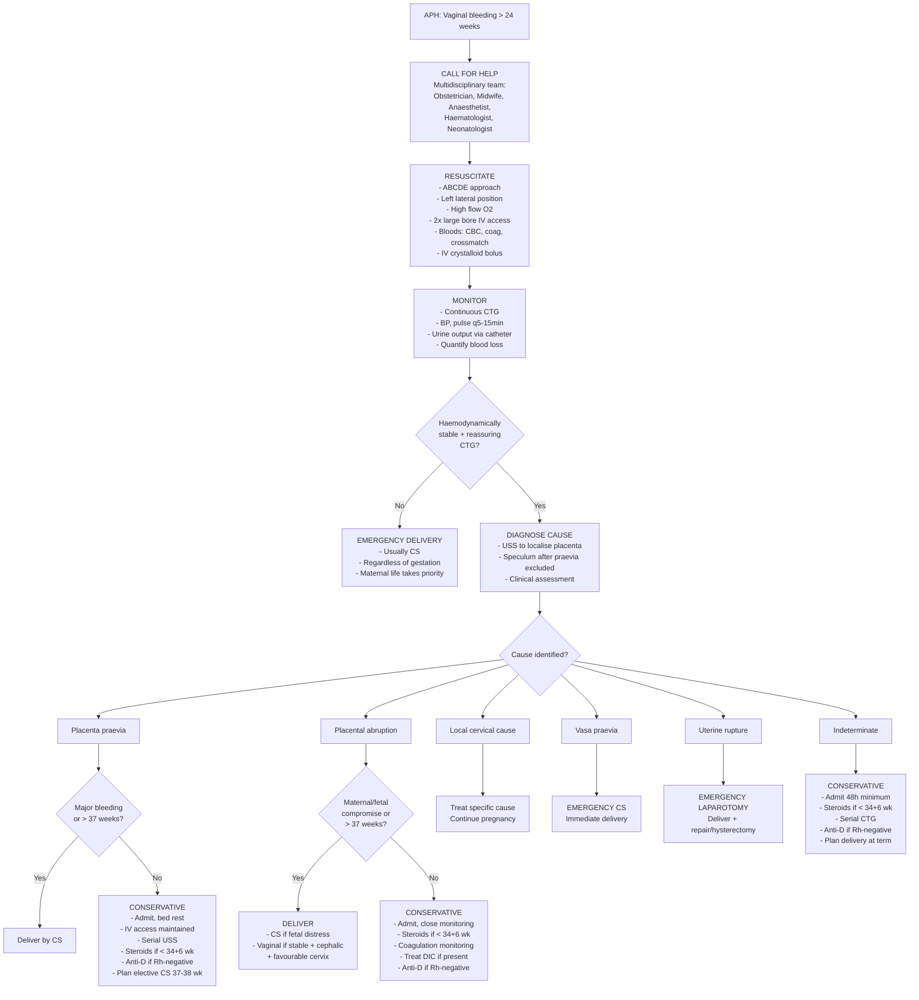

## Management of Antepartum Hemorrhage

Management of APH follows the same universal principles as **any major hemorrhage** — but with the unique obstetric dimension of having **two patients** (mother and fetus). Every decision balances maternal safety against fetal maturity and well-being. Let me build this from first principles.

---

### Overarching Principles

***Similar to the management of heavy bleeding elsewhere, the principles are to replace the blood loss to reverse or prevent shock while efforts are made to identify and stop the source of bleeding*** [1][11].

The management framework mirrors what the lecture slides describe for PPH — ***4 major principles*** [1][11]:

1. ***Communication with all relevant professionals***
2. ***Resuscitation***
3. ***Monitoring and investigation***
4. ***Arresting the bleeding***

These same principles apply to APH. The key difference is that in APH, you have an additional decision: **deliver now vs. conservative management** — which depends on the severity of bleeding, the cause, gestational age, and fetal condition.

---

### Master Management Algorithm

---

### Step 1: Communication — Call for Help

This is an **obstetric emergency**. You need a team:

| Team Member | Role |
|-------------|------|
| **Senior obstetrician** | Decision-making on mode and timing of delivery |
| **Anaesthetist** | Airway management, IV access, blood products, possible emergency GA for CS |
| **Midwife** | Monitoring, IV fluid administration, catheterisation |
| **Haematologist / blood bank** | Crossmatch, massive transfusion protocol (MTP) activation |
| **Neonatologist** | Standby for preterm or compromised neonate |
| **Porter** | Blood product transport, patient transfer to theatre |

> ***Communication with all relevant professionals*** is listed as the **first** principle — not resuscitation. Why? Because in obstetric emergencies, outcomes depend on team coordination. A single doctor cannot manage APH alone [1][11].

---

### Step 2: Resuscitation

This follows the standard approach to **hypovolemic shock** [12]:

#### A — Airway
- Ensure patent airway
- Position: ***left lateral tilt*** (15–30°) or manual uterine displacement to the left — this relieves **aortocaval compression** by the gravid uterus
  - Why? After ~20 weeks, the uterus compresses the IVC in the supine position → reduced venous return → reduced cardiac output → worsening hypotension. Tilting left shifts the uterus off the IVC.

#### B — Breathing
- ***High flow O₂*** via face mask with reservoir bag (15 L/min) [12]
- Why? Maximise maternal oxygen delivery → maximise oxygen delivery to the fetus via the placenta. The fetus is entirely dependent on maternal pO₂.

#### C — Circulation

| Action | Detail | Rationale |
|--------|--------|-----------|
| ***Large bore IV access*** | ***14/16G at antecubital vein*** — ideally **two lines** [12] | Large bore allows rapid fluid infusion (flow rate ∝ r⁴/length by Poiseuille's law → short, wide cannulae give fastest flow) |
| ***Bloods*** | ***CBC, RFT, clotting, type & screen/crossmatch*** [12] | Baseline Hb, detect DIC, prepare blood products |
| ***Rapid fluid challenge*** | ***500–1000 mL crystalloid over 5–10 min*** [12] | ***Volume replacement to maintain an effective circulation*** [1][11] |
| ***Reassess BP/P every 5 min*** | Repeat fluid bolus if not responding [12] | Titrate resuscitation to clinical response |
| ***Foley catheter*** | Monitor urine output (target > 0.5 mL/kg/hr) [12] | Urine output is the best bedside indicator of end-organ perfusion |
| **Blood transfusion** | Crossmatch 4–6 units packed RBCs; use O-negative if emergency and crossmatch unavailable | ***Red cell replacement (oxygen carriage)*** [1][11] |

##### Massive Transfusion Protocol (MTP)

Activate when estimated blood loss > 2 L or clinical signs of Class III/IV shock:

| Component | Ratio | Purpose |
|-----------|-------|---------|
| Packed RBCs | 6 units | Oxygen carrying capacity |
| FFP | 4 units (target 1:1 or 1:1.5 ratio with pRBC) | ***Replace clotting factors*** — ***FFP contains all soluble plasma proteins and clotting factors*** [13] |
| Cryoprecipitate | 10 units (if fibrinogen < 2 g/L) | Concentrated fibrinogen (***1 adult dose typically raises fibrinogen by 1 g/L***) + Factor VIII + vWF [13] |
| Platelets | 1 pool (if platelet count < 50 × 10⁹/L with active bleeding) | Replace consumed platelets |
| Tranexamic acid | 1 g IV slowly | Antifibrinolytic — inhibits plasmin → reduces clot breakdown → reduces ongoing hemorrhage |

> ***Blood components replacement (platelet and FFP) to correct coagulation defect*** [1][11]

<Callout title="Fibrinogen Target in Obstetric Hemorrhage" type="error">
In obstetric hemorrhage, the fibrinogen target is **> 2 g/L** (higher than the non-obstetric target of > 1 g/L). This is because pregnancy normally raises fibrinogen to 4–6 g/L, and a level below 2 g/L in pregnancy is a strong predictor of progression to massive hemorrhage. ***Cryoprecipitate is indicated for documented fibrinogen deficiency*** [13].
</Callout>

#### D — Disability
- Assess GCS — altered consciousness indicates severe hypovolemic shock (Class III/IV)
- Check blood glucose

#### E — Exposure
- Quantify blood loss (weigh swabs, measure in kidney dishes)
- Check for concealed bleeding (palpate uterus — a tense, enlarging uterus suggests concealed abruption)

---

### Step 3: Monitoring and Investigation

***This should be monitored with blood pressure, pulse rate, urine output, central venous pressure, laboratory haematology tests*** [1][11].

| Parameter | Frequency | Target |
|-----------|-----------|--------|
| **Blood pressure** | Every 5–15 min (depending on severity) | Systolic > 90 mmHg |
| **Heart rate** | Continuous or every 5 min | < 100 bpm |
| **Urine output** | Hourly via indwelling catheter | > 0.5 mL/kg/hr (i.e., > 30 mL/hr) |
| **CTG** | **Continuous** | Normal baseline 110–160, presence of accelerations, no decelerations |
| **Repeat bloods** | Every 1–4 hours depending on severity | Hb stable, fibrinogen > 2 g/L, platelets > 50, PT/aPTT normalising |
| **CVP** | If persistent shock or cardiac disease history [12] | Guides fluid administration — avoid over-resuscitation |
| **Blood loss** | Ongoing quantification | Objective measurement (weighing) over visual estimation |

---

### Step 4: Arresting the Bleeding — Cause-Specific Management

This is where APH management diverges based on the underlying cause. The fundamental decision is always: **deliver now or manage conservatively?**

---

#### 4A. Management of Placenta Praevia

The decision hinges on three factors: **severity of bleeding**, **gestational age**, and **maternal/fetal stability**.

##### Conservative (Expectant) Management — When Bleeding is Minor and Preterm

| Component | Detail | Rationale |
|-----------|--------|-----------|
| **Admission** | Inpatient observation (many centres keep praevia patients hospitalised from the first significant bleed until delivery) | Unpredictable, potentially massive rebleeding — need immediate access to theatre and blood bank |
| **Bed rest** | Activity restriction, avoid coitus and digital VE | Minimise provocation of further separation |
| **IV access** | Maintained at all times | Rapid volume replacement if sudden rebleed |
| **Blood available** | Crossmatched blood kept on standby (at least 2–4 units) | Praevia can rebleed massively without warning |
| **Corticosteroids** | ***If < 34+6 weeks:*** Betamethasone 12 mg IM × 2 doses, 24 hours apart (or Dexamethasone 6 mg IM × 4 doses, 12 hours apart) | Accelerates fetal lung maturity (stimulates surfactant production by Type II pneumocytes). Takes 24–48 hours for full effect. Given because premature delivery may become necessary at any time |
| **Anti-D immunoglobulin** | If mother is **Rh-negative** | APH causes feto-maternal hemorrhage (FMH) → fetal Rh-positive RBCs enter maternal circulation → maternal anti-D antibody production → haemolytic disease of the fetus/newborn (HDFN) in subsequent pregnancies. Anti-D neutralises the fetal RBCs before maternal immune sensitisation occurs |
| **Kleihauer-Betke test** | Quantify FMH to calculate anti-D dose | Standard dose (250–500 IU) covers up to 4 mL fetal RBCs. Larger FMH requires additional doses |
| **Serial USS** | TVS at 32 and 36 weeks | Monitor for placental migration; assess for PAS (accreta spectrum) |
| **Iron supplementation** | Oral or IV iron | Optimise Hb to tolerate further blood loss. ***Anaemia (Hb < 10 g/dL)*** worsens outcomes [2] |
| **Fetal monitoring** | Serial CTG, growth scans | Ensure fetal well-being |

##### Delivery — When and How

| Scenario | Action | Reasoning |
|----------|--------|-----------|
| ***Major APH with haemodynamic instability*** | ***Emergency CS*** regardless of gestation | Maternal life always takes priority over fetal maturity |
| **Praevia persisting at 36 weeks, asymptomatic** | Planned **elective CS at 37+0 to 37+6 weeks** (RCOG 2018) | Balances fetal maturity against risk of emergency bleed before term |
| **Praevia + suspected PAS (accreta)** | Planned CS at **35–36+6 weeks** in a tertiary centre with multidisciplinary team | PAS carries risk of catastrophic hemorrhage requiring hysterectomy; earlier delivery reduces risk of emergency presentation |
| **Low-lying placenta (edge 11–20 mm from os)** | Consider vaginal delivery with caution; senior obstetrician present | Edge > 20 mm from os at term → low risk of significant hemorrhage during vaginal delivery |

<Callout title="Exam Pearl — Emergency CS for Praevia">
***A 40-year-old G2P0 at 37 weeks with known placenta praevia covering os, first episode of profuse vaginal bleeding, pulse 108, BP 100/60, soft non-tender uterus, head 5/5 above brim, profuse bleeding from os on speculum → the most appropriate management is emergency Caesarean section*** [7]. Conservative management is inappropriate when there is active profuse bleeding with haemodynamic compromise. ***Digital vaginal examination*** is absolutely contraindicated [7].
</Callout>

---

#### 4B. Management of Placental Abruption

##### Conservative Management — Mild Abruption, Preterm, Stable

| Component | Detail | Rationale |
|-----------|--------|-----------|
| **Admission** | Inpatient monitoring | Risk of progression; concealed bleeding may not be clinically apparent initially |
| **Corticosteroids** | If < 34+6 weeks | Same as praevia — anticipating possible preterm delivery |
| **Anti-D** | If Rh-negative | Abruption causes significant FMH |
| **Coagulation monitoring** | Serial CBC, fibrinogen, PT/aPTT, D-dimer every 4–6 hours | Detect evolving DIC early — fibrinogen < 2 g/L is a red flag |
| **CTG** | Continuous initially, then 4–6 hourly if stable | Detect fetal deterioration early |
| **USS** | Assess retroplacental haematoma size, fetal growth | Monitor for progression; remember USS may be normal even in significant abruption |
| **Tocolysis** | Generally **avoided** — controversial | Tocolytics (e.g., nifedipine, atosiban) may be considered if preterm contractions are present and the abruption is mild. BUT: tocolysis masks the clinical sign of uterine hypertonicity and may delay recognition of worsening abruption. Most obstetricians avoid tocolysis in abruption |

##### Delivery — When Indicated

| Scenario | Mode | Reasoning |
|----------|------|-----------|
| **Severe abruption with fetal distress (fetal alive)** | ***Emergency CS*** | Time-critical — every minute of delay worsens fetal outcome |
| **Severe abruption with fetal death** | **Vaginal delivery** (aim for delivery within 4–6 hours) | No fetal indication for CS; vaginal delivery is safer for the mother when there is DIC (avoids surgical bleeding in a coagulopathic patient). Amniotomy ± oxytocin augmentation |
| **Moderate abruption at term (> 37 weeks), stable** | **Amniotomy + vaginal delivery** if cephalic and favourable cervix; CS if not | At term, no benefit to prolonging pregnancy. Amniotomy reduces intrauterine pressure, may slow further separation, and allows labour to progress |
| **Mild abruption, preterm, stable** | **Conservative** — defer delivery, optimise fetal maturity | Risk of prematurity outweighs risk of rebleeding if small abruption, stable mother and fetus |

> **Key concept — Why vaginal delivery in fetal death?** If the fetus has died, there is no fetal urgency for CS. A woman with DIC is at extreme risk during surgery — she will bleed from every incision site because she cannot form clots. Vaginal delivery minimises tissue trauma. Moreover, the abruption itself often triggers intense uterine contractions that facilitate rapid vaginal delivery.

##### DIC Management in Abruption

***Treat underlying cause: most important*** [5]. In abruption, the definitive treatment of DIC is **delivery** — removing the source of tissue thromboplastin.

| Component | Indication | Detail |
|-----------|-----------|--------|
| **FFP** | ***PT/aPTT > 1.5× control with active bleeding*** [13] | Replaces all consumed clotting factors. Dose: 12–15 mL/kg |
| **Cryoprecipitate** | ***Fibrinogen < 2 g/L*** (obstetric threshold) | Dose: 10 units for adults — ***raises fibrinogen by ~1 g/L*** [13] |
| **Platelets** | ***Platelet < 50 × 10⁹/L with active bleeding or need for invasive procedures*** [5] | Or < 20 × 10⁹/L in the presence of sepsis [5] |
| **Tranexamic acid** | Adjunct in major hemorrhage | 1 g IV over 10 min; can repeat after 30 min. WHO recommends giving within 3 hours of onset of bleeding |
| **Avoid heparin** | Acute obstetric DIC | Heparin is used in chronic (compensated) DIC to prevent thrombosis, but in acute DIC with active bleeding, it worsens hemorrhage |
| ***Good circulation and good urine output should be maintained to help clear the fibrin degradation products which cause further DIC*** [1] | Maintain UO > 0.5 mL/kg/hr | FDPs themselves are anticoagulant — they interfere with fibrin polymerisation and platelet function. Renal clearance removes them |

---

#### 4C. Management of Vasa Praevia

| Setting | Management |
|---------|-----------|
| **Antenatal diagnosis (asymptomatic)** | Admit at 30–32 weeks; planned **elective CS at 35–36 weeks** (before risk of spontaneous membrane rupture). Corticosteroids for fetal lung maturity. Avoid amniotomy. |
| **Acute presentation (bleeding at ROM)** | ***Emergency CS*** — immediate delivery. Neonatal resuscitation team on standby for severely anaemic neonate requiring transfusion |
| **Key**: Outcome depends entirely on **antenatal diagnosis** | If diagnosed antenatally and delivered by planned CS: fetal survival > 95%. If undiagnosed and presents at ROM: fetal mortality ~60% |

---

#### 4D. Management of Uterine Rupture

| Action | Detail |
|--------|--------|
| **Emergency laparotomy** | Immediate — this is a surgical emergency |
| **Deliver the fetus** | Often already partially or fully extruded into the peritoneal cavity |
| **Repair or hysterectomy** | If the tear is small and clean → uterine repair (preserves fertility). If extensive, necrotic, or uncontrollable bleeding → subtotal or total hysterectomy |
| **Massive transfusion** | Expect significant blood loss (often several litres in the peritoneal cavity) |
| **Neonatal resuscitation** | Fetus almost always severely compromised |

---

#### 4E. Management of Local Cervical/Vaginal Causes

| Cause | Management |
|-------|-----------|
| **Cervical ectropion** | Reassurance — no treatment needed in pregnancy. Usually resolves postpartum. Avoid cauterisation during pregnancy (risk of bleeding from the vascular cervix) |
| **Cervical polyp** | Usually left alone during pregnancy (polypectomy risks bleeding). Remove postpartum if persistent |
| **Cervical carcinoma** | Multidisciplinary management: staging, fetal maturity assessment. If early stage and preterm → may delay treatment until after delivery. If advanced or at/near term → deliver then treat |
| **Cervicitis** | Treat underlying infection (e.g., azithromycin for Chlamydia, ceftriaxone for gonorrhea) |
| **Vaginal varicosities** | Compression, elevation, avoid prolonged standing. Rarely require intervention |

---

#### 4F. Management of Indeterminate APH

| Component | Detail |
|-----------|--------|
| **Admission** | At least 48 hours observation |
| **Steroids** | If < 34+6 weeks — potential for preterm delivery |
| **Anti-D** | If Rh-negative |
| **Fetal monitoring** | Serial CTG, growth scans |
| **Delivery planning** | Usually at term (37–39 weeks) via normal obstetric indications |
| **Counsel about PPH risk** | ***APH is a risk factor for PPH*** [2][3] — ensure active management of the third stage of labor |

---

### Specific Treatment Modalities — Drug Table

These drugs are primarily used for **PPH** management (uterine atony) but are relevant to APH when atony complicates delivery:

| Drug | Route/Dose | Mechanism | Contraindications |
|------|-----------|-----------|-------------------|
| ***Syntometrine*** | ***1 mL IMI (ergometrine 0.5 mg + oxytocin 5 units)*** [1][14] | Dual action: oxytocin causes rhythmic uterine contractions; ergometrine causes sustained tonic contraction | ***Hypertension, heart disease*** [14] — ergometrine is a vasoconstrictor that raises BP (can precipitate hypertensive crisis or coronary spasm) |
| ***Syntocinon (oxytocin)*** | ***5 units IVI after delivery; then infusion 40 units in 500 mL NS over 4 hours*** (prophylaxis) [14]; ***10 units IVI + infusion 10 units/hr*** (treatment) [14] | Binds oxytocin receptors on myometrium → ↑ intracellular Ca²⁺ → rhythmic uterine contraction | Relatively safe; avoid rapid bolus > 5 IU (can cause hypotension, water retention at high doses due to ADH-like effect) |
| ***Carbetocin*** | ***100 μg IV bolus*** [14] | Long-acting oxytocin analogue (half-life ~40 min vs. ~3 min for oxytocin) → prolonged uterine contraction | ***For Caesarean section with high risk for PPH*** [14]; single dose only |
| ***Carboprost (15-methyl PGF₂α)*** | ***250 μg IMI, can repeat every 15 min, up to 2 mg (8 doses)*** [14] | Prostaglandin F₂α analogue → potent myometrial contraction via smooth muscle stimulation | **Asthma** (causes bronchospasm — PGF₂α constricts bronchial smooth muscle); use with caution in hepatic/renal/cardiac disease |
| ***Misoprostol (PGE₁ analogue)*** | ***800–1000 μg per rectal or sublingual*** [14] | Prostaglandin E₁ → stimulates myometrial contraction | Few absolute contraindications; causes fever, diarrhoea (prostaglandin side effects). Advantage: does not require refrigeration, can be given rectally/sublingually without IV access |
| **Tranexamic acid** | 1 g IV over 10 min (can repeat × 1 after 30 min) | Lysine analogue → binds plasminogen → inhibits plasmin-mediated fibrinolysis → stabilises existing clots | Active thromboembolic disease; use within 3 hours of bleeding onset for maximum benefit (WOMAN trial) |

<Callout title="Why is Syntometrine contraindicated in hypertension?">
***Syntometrine contains ergometrine*** — an ergot alkaloid that causes sustained vasoconstriction by acting on α-adrenergic and serotonin receptors in vascular smooth muscle. In a woman with pre-eclampsia or hypertension, this can precipitate a **hypertensive crisis**, stroke, or myocardial ischemia. ***Use oxytocin instead if Syntometrine is contraindicated (hypertension, heart disease)*** [14].
</Callout>

---

### Surgical Interventions (If Medical Management Fails)

If the APH continues despite medical management and delivery, surgical options escalate. This parallels the PPH surgical algorithm — ***these include tension, pressure, balloon, medication, embolization and surgery*** [1][11]:

| Intervention | Mechanism | When to use |
|-------------|-----------|-------------|
| **Uterine massage** | Mechanical stimulation of myometrium → contraction → compression of spiral arteries | First-line for uterine atony post-delivery |
| **Bimanual uterine compression** | One hand on the abdomen, one hand as a fist in the vagina → compresses uterus between both hands → tamponades the bleeding while awaiting other measures | Temporising measure — buys time |
| **Intrauterine balloon tamponade** | Bakri balloon or Sengstaken-Blakemore tube inserted into uterine cavity → inflated with 300–500 mL saline → exerts direct pressure on the placental bed | If atony persists despite uterotonics. Particularly useful in praevia (lower segment bleeding). "Tamponade test" — if bleeding stops after inflation, the balloon is sufficient |
| **Uterine compression sutures** | B-Lynch suture: compresses the uterus mechanically by "sandwiching" anterior and posterior walls together | At laparotomy if balloon tamponade fails. Preserves fertility |
| **Uterine artery ligation** | Surgical ligation of uterine arteries → reduces pulsatile blood flow to the uterus | Stepwise devascularisation at laparotomy |
| **Internal iliac artery ligation** | Bilateral ligation → converts pulsatile arterial flow to low-pressure venous flow in the pelvis | Technically demanding; reduces pelvic blood flow by ~50% |
| ***Uterine artery embolization (UAE)*** | Interventional radiology: selective catheterisation of uterine arteries → injection of embolic agents (Gelfoam, PVA particles) → occludes blood supply [15] | ***Post-partum haemorrhage or arteriovenous malformation*** [15]. Requires haemodynamic stability and access to interventional radiology suite. Advantage: preserves uterus |
| **Hysterectomy** | Subtotal (supracervical) or total abdominal hysterectomy → definitive. Removes the source of bleeding entirely | **Last resort** — when all other measures fail, or in **PAS (placenta accreta/percreta)** where the placenta cannot be separated. Life-saving procedure |

> ***Laparotomy is required in exceptional circumstances when the source of bleeding cannot be identified or to stop the bleeding*** [1][11]

---

### Special Scenario: Placenta Accreta Spectrum (PAS)

This is the most dangerous variant of placenta praevia and warrants specific management:

| Principle | Detail |
|-----------|--------|
| **Antenatal planning** | Multidisciplinary team conference: senior obstetrician, urologist (if bladder invasion suspected), interventional radiologist, anaesthetist, haematologist, blood bank, neonatologist |
| **Timing** | Planned CS at **35–36+6 weeks** (RCOG / FIGO) — earlier than uncomplicated praevia because the risk of emergency hemorrhage increases after 36 weeks |
| **Surgical approach** | **CS hysterectomy** — the placenta is left in situ (NOT removed manually, as this would cause catastrophic hemorrhage from the raw myometrial surface). The uterus is removed with the placenta still attached |
| **Blood products** | Have at least 6 units pRBC crossmatched, FFP, cryoprecipitate, and platelets available. Cell salvage should be set up |
| **UAE** | Prophylactic uterine artery balloon catheter placement pre-operatively (by interventional radiology) → inflate during surgery to reduce blood loss |
| **Conservative (uterine-sparing) approach** | In selected cases where the patient strongly desires fertility preservation: leave the placenta in situ, close the uterus, monitor with serial USS and β-hCG for gradual placental resorption. High risk of secondary hemorrhage and infection |

---

### Anti-D Immunoglobulin — When and Why

| Indication | Dose | Timing |
|-----------|------|--------|
| Any APH in an **Rh-negative** mother | Minimum 250 IU (before 20 weeks) or 500 IU (after 20 weeks) | Within 72 hours of the bleeding episode |
| Quantify FMH with Kleihauer-Betke test | Additional doses if FMH > 4 mL fetal cells | Calculated based on Kleihauer result |
| Repeat if further episodes of APH | Each new bleed may cause additional FMH | Within 72 hours of each new episode |

> **Why anti-D?** An Rh-negative mother exposed to Rh-positive fetal blood (via placental separation in APH) will mount an immune response producing anti-D antibodies. In future pregnancies, these antibodies cross the placenta and destroy fetal Rh-positive RBCs → **haemolytic disease of the fetus and newborn (HDFN)**. Anti-D immunoglobulin is a passive immunisation — it binds and clears fetal RBCs from the maternal circulation before the maternal immune system can mount a primary response.

---

### Corticosteroids for Fetal Lung Maturity

| Parameter | Detail |
|-----------|--------|
| **Indication** | Any APH at **24+0 to 34+6 weeks** where preterm delivery is considered possible within the next 7 days |
| **Drug** | **Betamethasone** 12 mg IM × 2 doses, 24 hours apart (preferred) OR **Dexamethasone** 6 mg IM × 4 doses, 12 hours apart |
| **Mechanism** | Crosses the placenta → induces fetal Type II pneumocyte maturation → increases surfactant production → reduces severity of respiratory distress syndrome (RDS), intraventricular hemorrhage (IVH), and necrotising enterocolitis (NEC) |
| **Time to effect** | Optimal benefit at 24–48 hours; some benefit even if delivered within hours of first dose |
| **Repeat courses** | Generally a single course is given. A "rescue" course may be considered if > 2 weeks since the first course and delivery is again anticipated |
| **Not indicated** | If > 34+6 weeks (minimal benefit; fetal lungs are usually mature) or if delivery is imminent and cannot be delayed |

---

### Tocolysis in APH — Controversial

| Situation | Recommendation | Rationale |
|-----------|---------------|-----------|
| **Placenta praevia with preterm contractions** | May consider short-term tocolysis (nifedipine or atosiban) to allow steroid completion | Buying 48 hours for steroids can significantly reduce neonatal morbidity |
| **Placental abruption** | Generally **AVOID** tocolysis | Tocolysis masks uterine hypertonicity (a key clinical sign of worsening abruption) and may delay recognition of deterioration. Moreover, abruption is driven by decidual artery rupture, not contractions — stopping contractions does not treat the cause |
| **Active hemorrhage of any cause** | **AVOID** tocolysis | Tocolysis relaxes the uterus → reduced tamponade effect → may worsen bleeding |

---

<Callout title="High Yield Summary">

**Management of APH — Key Points:**

1. ***4 principles: Communication, Resuscitation, Monitoring, Arresting the bleeding*** [1][11]
2. **Resuscitation:** Left lateral tilt, high flow O₂, 2× large bore IV, rapid crystalloid, crossmatch blood, Foley catheter
3. **Placenta praevia:** Conservative if minor and preterm (admit, steroids, anti-D, serial USS); emergency CS if major bleed or > 37 weeks; **planned CS at 37–38 weeks** if asymptomatic praevia at 36 weeks
4. **Abruption:** Deliver if maternal/fetal compromise; CS if fetal alive + distress; vaginal delivery if fetal death (avoid surgery in DIC); treat DIC with FFP + cryoprecipitate
5. **Vasa praevia:** Emergency CS immediately if acute; planned CS at 35–36 weeks if diagnosed antenatally
6. **Uterine rupture:** Emergency laparotomy → repair or hysterectomy
7. ***Syntometrine contraindicated in hypertension and heart disease*** — use oxytocin instead [14]
8. **Carboprost contraindicated in asthma** (bronchospasm from PGF₂α)
9. **Anti-D** for all Rh-negative mothers with APH within 72 hours; Kleihauer to quantify FMH
10. **Steroids** for fetal lung maturity at 24–34+6 weeks
11. **Surgical escalation:** balloon tamponade → compression sutures → artery ligation → UAE → hysterectomy (last resort)
12. **PAS (accreta):** Planned CS hysterectomy at 35–36 weeks, multidisciplinary, leave placenta in situ

</Callout>

---

<ActiveRecallQuiz
  title="Active Recall - APH Management"
  items={[
    {
      question: "A G2P0 at 37 weeks with known placenta praevia covering the os presents with profuse bleeding, pulse 108, BP 100/60. Uterus soft, head 5/5 above brim. Bleeding from os on speculum. What is the most appropriate immediate management and what examination is contraindicated?",
      markscheme: "Most appropriate: Emergency Caesarean section. Rationale: Known praevia covering os with active profuse bleeding and haemodynamic compromise (tachycardia, borderline hypotension). Conservative management inappropriate due to ongoing active bleeding with signs of early shock. Digital vaginal examination is absolutely contraindicated as it can provoke catastrophic haemorrhage by further separating placenta from the lower segment."
    },
    {
      question: "Why is vaginal delivery preferred over Caesarean section when placental abruption has resulted in fetal death?",
      markscheme: "When the fetus has died, there is no fetal indication for the urgency of CS. Severe abruption typically causes DIC (release of tissue thromboplastin activates extrinsic pathway, consuming platelets, fibrinogen, clotting factors). A coagulopathic patient will bleed from every surgical incision site during CS, making the operation extremely dangerous. Vaginal delivery minimises tissue trauma and surgical bleeding. Additionally, severe abruption often triggers intense uterine contractions that facilitate rapid vaginal delivery. Amniotomy plus oxytocin augmentation can expedite delivery. Target: delivery within 4-6 hours."
    },
    {
      question: "Explain why Syntometrine is contraindicated in pre-eclampsia but oxytocin is safe. What alternative could you use at Caesarean section?",
      markscheme: "Syntometrine contains ergometrine - an ergot alkaloid that causes sustained vasoconstriction via alpha-adrenergic and serotonin receptors in vascular smooth muscle. In pre-eclampsia (already elevated BP from endothelial dysfunction), ergometrine can precipitate hypertensive crisis, stroke, or coronary vasospasm. Oxytocin does not cause sustained vasoconstriction and is safe. At CS with high PPH risk, carbetocin 100 micrograms IV bolus can be used - it is a long-acting oxytocin analogue (half-life 40 minutes vs 3 minutes for oxytocin) providing prolonged uterine contraction with a single dose."
    },
    {
      question: "List the 4 principles of managing PPH/APH as taught in the lecture slides, and explain why communication is listed before resuscitation.",
      markscheme: "Four principles: 1) Communication with all relevant professionals, 2) Resuscitation, 3) Monitoring and investigation, 4) Arresting the bleeding. Communication is listed first because obstetric haemorrhage requires a multidisciplinary team response - no single clinician can manage it alone. You need senior obstetrician (decisions on delivery), anaesthetist (IV access, blood products, airway), haematologist/blood bank (crossmatch, MTP activation), neonatologist (preterm/compromised neonate), midwife (monitoring, drugs). Activating the team immediately while commencing resuscitation simultaneously ensures the fastest coordinated response."
    },
    {
      question: "A woman at 30 weeks has a moderate APH from confirmed placental abruption. Mother and fetus are currently stable. Outline your conservative management plan including at least 6 specific components.",
      markscheme: "1) Admit for inpatient monitoring. 2) Maintain IV access with crossmatched blood available. 3) Corticosteroids: betamethasone 12 mg IM x2 doses 24 hours apart for fetal lung maturity (24-34+6 weeks). 4) Anti-D immunoglobulin if Rh-negative (within 72 hours) with Kleihauer test to quantify FMH. 5) Serial coagulation monitoring: CBC, fibrinogen, PT/aPTT every 4-6 hours to detect evolving DIC (fibrinogen < 2 g/L is alarming). 6) Continuous CTG initially then regular monitoring to detect fetal deterioration. 7) Serial USS to monitor retroplacental haematoma. 8) Iron supplementation to optimise Hb. 9) Avoid tocolysis (masks worsening abruption). 10) Plan for delivery if maternal/fetal deterioration occurs."
    },
    {
      question: "What is the target fibrinogen level in obstetric haemorrhage, why is it different from non-obstetric patients, and what blood product do you use to raise it?",
      markscheme: "Target: fibrinogen > 2 g/L in obstetric haemorrhage (vs > 1 g/L in non-obstetric). This is higher because normal pregnancy fibrinogen is physiologically elevated to 4-6 g/L, so a level below 2 g/L represents severe consumption and is a strong predictor of progression to massive haemorrhage. Blood product: Cryoprecipitate - contains concentrated fibrinogen (150-300 mg per unit), Factor VIII, and vWF in a small volume (20-50 mL/unit vs 250 mL for FFP). Standard adult dose: 10 units, which typically raises fibrinogen by approximately 1 g/L."
    }
  ]}
/>

## References

[1] Lecture slides: Block C - Obstetric Emergency Notes to Students.pdf (p5, p7 — Management principles, blood replacement, oxytocic agents)
[2] Lecture slides: PPH for teaching (20210716)v6.pdf (p6 — Risk factors including APH, anaemia)
[3] Lecture slides: Block C - Postpartum Haemorrhage.pdf (p5, p32 — Risk factors, summary)
[5] Senior notes: Ryan Ho Haemtology.pdf (p138 — DIC management, platelet/FFP/cryoprecipitate indications)
[7] Lecture slides: OBGYN Clinical Test By Topic.pdf (p6, p11 — APH and PPH clinical questions)
[11] Lecture slides: GCBC-OG-Obs emergency_Notes to students_Sep2024.pdf (p5, p7 — Management principles, oxytocic agents)
[12] Senior notes: Ryan Ho Critical Care.pdf (p21 — Hypovolemic shock management)
[13] Senior notes: Ryan Ho Haemtology.pdf (p144 — FFP, cryoprecipitate, PCC indications and dosing)
[14] Lecture slides: Block C - Obstetric Emergency Notes to Students.pdf (p7 — Appendix I, oxytocic agents dosage and contraindications)
[15] Senior notes: Ryan Ho Diagnostic Radiology.pdf (p85 — Uterine artery embolization indications)
