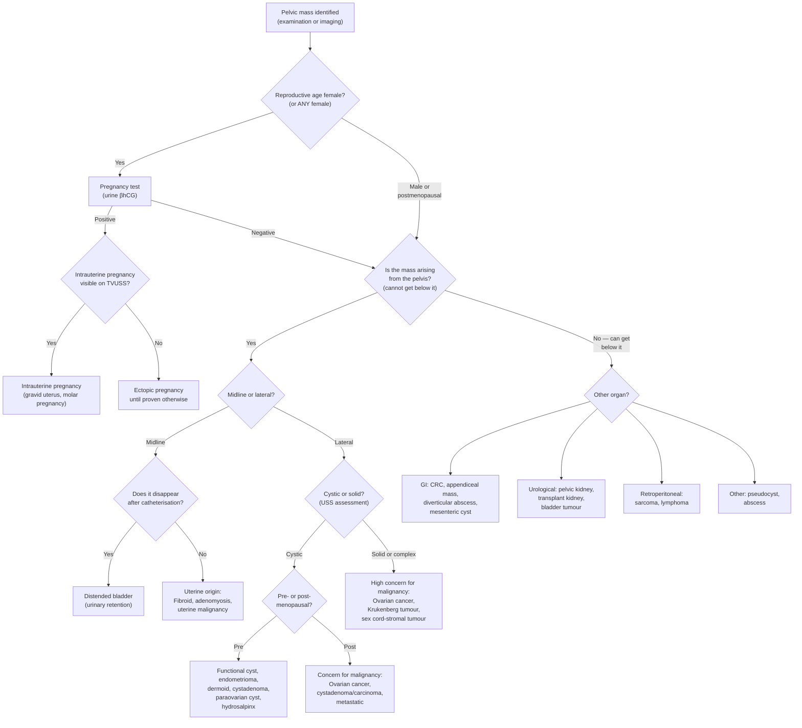

## Differential Diagnosis of a Pelvic Mass

The ability to construct a structured, prioritised differential diagnosis list is the most critical clinical skill when approaching a pelvic mass. As the Gynaecological Emergency lecture notes explicitly state: ***"The most important part is the ability to formulate the list of differential diagnoses and to prioritise them according to the clinical condition and NOT just to give the right diagnosis"*** [2].

The philosophy is straightforward: **think by organ of origin first**, then refine by clinical context (age, menopausal status, acuity, associated symptoms). The pelvis is a "shared space" — gynaecological, gastrointestinal, and urological structures all live here, so you must consider all three systems.

---

### 1. Master Differential Diagnosis List (By Organ System)

***The lecture slides (GC 118, p23) explicitly list the DDx for pelvic mass classified as gynaecological vs. non-gynaecological:*** [1]

#### 1.1 Gynaecological Causes

| Organ | Condition | Why It Presents as a Pelvic Mass |
|---|---|---|
| **Uterus** | ***Uterine fibroid (leiomyoma)*** | Monoclonal smooth muscle tumour; oestrogen/progesterone-dependent → grows progressively → can become enormous (fills pelvis and abdomen). Midline mass, mobile side-to-side |
| | ***Adenomyosis*** | Diffuse myometrial thickening from ectopic endometrial glands/stroma within the muscle wall → uniformly enlarged boggy uterus (less likely to be palpable abdominally unless severe) |
| | ***Uterine sarcoma (leiomyosarcoma)*** | Rare malignant counterpart of fibroid; suspect when a "fibroid" grows rapidly, especially in postmenopausal women when it should be shrinking (no oestrogen drive) |
| **Pregnancy-related** | ***Undiagnosed pregnancy (gravid uterus)*** | Most common physiological cause of a midline pelvic mass in a reproductive-age woman. Uterus becomes palpable abdominally from ~12 weeks' gestation |
| | ***Molar pregnancy (gestational trophoblastic disease)*** | Abnormal trophoblastic proliferation → uterus larger than expected for gestational age, markedly elevated βhCG |
| | ***Ectopic pregnancy*** | Trophoblast implants outside endometrial cavity (95% tubal) → adnexal mass ± haemoperitoneum. This is a **life-threatening emergency** |
| **Ovary** | ***Ovarian cyst (functional or neoplastic)*** | Fluid-filled structure expanding the ovary; functional cysts (follicular, corpus luteum) are cyclical and self-limiting; neoplastic cysts (serous/mucinous cystadenoma, dermoid) persist and grow |
| | ***Ovarian cancer*** | Surface epithelial malignancy (90%) → solid-cystic mass, often bilateral, with ascites and peritoneal deposits in advanced disease |
| | ***Metastatic ovarian tumour (Krukenberg)*** | Transcoelomic/haematogenous spread from GI tract (especially stomach, CRC) to ovary → bilateral solid ovarian masses. Named after pathologist Friedrich Krukenberg; histology shows signet-ring cells |
| **Tube / Adnexa** | ***Paraovarian cyst*** | Arises from mesonephric (Wolffian) duct remnants in the broad ligament → separate from the ovary, usually unilocular and benign |
| | ***Hydrosalpinx*** | Chronic tubal obstruction (post-PID, post-surgery) → fallopian tube distends with serous fluid → sausage-shaped cystic mass |
| | ***Tubo-ovarian abscess (TOA)*** | Complication of ascending PID → mixed inflammatory mass encasing tube + ovary, tender, febrile |

#### 1.2 Non-Gynaecological Causes

***The lecture slide (GC 118, p23) separates non-gynaecological causes into gastrointestinal, urological, retroperitoneal, and others:*** [1]

| System | Condition | Why It Presents as a Pelvic Mass |
|---|---|---|
| **Gastrointestinal** | ***Colorectal tumour (sigmoid/rectal cancer)*** | Annular or polypoid lesion in the rectosigmoid region → palpable on PR or as a left-sided pelvic mass |
| | ***Mesenteric cyst*** | Cystic lymphatic malformation within the mesentery → mobile mass, may transilluminate. Moves perpendicular to mesenteric root |
| | ***Diverticular abscess/phlegmon*** | Complicated sigmoid diverticulitis → inflammatory mass in left lower quadrant/pelvis, tender, febrile |
| | ***Dilated bowel (obstruction)*** | Distal large bowel obstruction → massively distended sigmoid or caecum palpable as "mass" |
| | ***Hernia (obturator, femoral, inguinal)*** | Herniated bowel can present as a groin/pelvic mass |
| | ***Appendiceal mass/abscess*** | Walled-off acute appendicitis → RLQ inflammatory mass [7] |
| **Urological** | ***Distended bladder (urinary retention)*** | Failure to empty → progressive distension → midline suprapubic mass, dull to percussion, disappears after catheterisation. ***The most common "pseudo-mass" that catches students out!*** |
| | ***Bladder diverticulum*** | Outpouching of bladder mucosa through muscular wall (from chronic outlet obstruction) |
| | ***Pelvic kidney*** | Congenital malposition — kidney fails to ascend during embryological development → remains in pelvis |
| | ***Transplanted kidney*** | Allografted kidney is placed in the iliac fossa → palpable mass (normal finding post-transplant!) |
| **Retroperitoneal** | ***Retroperitoneal sarcoma*** | Rare soft tissue malignancy arising from retroperitoneal mesenchymal tissue → usually very large before detection because the retroperitoneum is a "silent" space. ***Usually not palpable*** [1] |
| | ***Retroperitoneal lymphadenopathy (lymphoma)*** | Bulky para-aortic/pelvic lymph nodes from lymphoma or metastatic disease → fixed, non-tender |
| **Others** | ***Pseudocyst (related to previous surgery)*** | ***Post-surgical peritoneal fluid collections enclosed by adhesions → can mimic cystic pelvic mass*** [8] |
| | ***Abscess (pelvic abscess from any cause)*** | Post-operative, post-PID, perforated appendicitis/diverticulitis → walled-off collection in the pelvis |

<Callout title="Don't Forget Pregnancy!" type="error">
***The lecture slide explicitly warns: "Don't forget about pregnancy → especially for teenage girls"*** [8]. A gravid uterus is the most common midline pelvic mass in reproductive-age women. Failure to perform a pregnancy test before further investigation (especially before CT scan or surgery) is a classic and dangerous error.
</Callout>

<Callout title="Don't Forget Post-Surgical Pseudocysts!" type="idea">
***The lecture slide also specifically mentions "pseudocyst related to previous surgeries"*** [8] — these are peritoneal inclusion cysts (fluid trapped between adhesions) that can mimic ovarian cysts on imaging. A thorough surgical history is essential.
</Callout>

---

### 2. Clinical Approach to Narrowing the DDx

The key clinical discriminators are **age/menopausal status**, **acuity of presentation**, **mass characteristics**, and **associated features**. Let's work through these systematically.

#### 2.1 Age and Menopausal Status

| Age Group | Most Likely Diagnoses | Why |
|---|---|---|
| **Adolescent / Young reproductive age (< 30)** | Pregnancy (always!), functional ovarian cyst, dermoid cyst (mature cystic teratoma), ectopic pregnancy, germ cell tumour | Ovulation is active → functional cysts common. Dermoids peak at 20–40. Germ cell tumours peak 10–30 |
| **Reproductive age (30–50)** | Uterine fibroids, endometriotic cyst, ovarian cysts (functional + neoplastic), ectopic pregnancy, TOA, adenomyosis | Fibroids are oestrogen-driven → peak prevalence. Endometriosis is active while menstruating |
| **Perimenopausal (45–55)** | Fibroids (should stabilise/shrink), ovarian neoplasms (borderline/early malignant), endometrial cancer | Transition period — benign conditions should be "burning out" while malignant risk rises |
| ***Postmenopausal (> 55)*** | ***Ovarian cancer, endometrial cancer, colorectal cancer, metastatic disease*** | ***Oestrogen withdrawal means fibroids and endometriotic cysts should shrink — any NEW or GROWING pelvic mass in a postmenopausal woman is malignant until proven otherwise*** |

> This age-based thinking is the single most powerful discriminator. A 25-year-old with a smooth, mobile, unilateral cystic adnexal mass almost certainly has a benign cyst. A 65-year-old with the same finding needs urgent investigation for malignancy.

#### 2.2 Acuity of Presentation

| Presentation | Think of... | Distinguishing Features |
|---|---|---|
| **Acute pain + pelvic mass** | Ovarian torsion, ruptured ovarian cyst, ruptured ectopic pregnancy, red degeneration of fibroid, TOA | History of known cyst (torsion), missed period (ectopic), fever (TOA), pregnancy (red degeneration) [2] |
| **Subacute / progressive** | Growing fibroid, ovarian neoplasm (benign or malignant), endometrioma, hydrosalpinx | Progressive bulk symptoms, menstrual disturbance |
| **Chronic / incidental** | Fibroid, dermoid, paraovarian cyst, pelvic kidney | Found incidentally on imaging or routine examination |

#### 2.3 Mass Characteristics on Examination

***The approach to palpable mass (from Ryan Ho Fundamentals, p76) provides a framework for differentiating masses:*** [3]

| Characteristic | Likely Diagnosis | Reasoning |
|---|---|---|
| ***Midline, arising from pelvis ("cannot get below"), mobile side-to-side but NOT with respiration*** | ***Uterine origin: fibroid, gravid uterus*** | Uterus is a midline pelvic structure tethered by cardinal/uterosacral ligaments but with some lateral mobility [3] |
| **Midline, arising from pelvis, dull to percussion, disappears after catheterisation** | Distended bladder | Urine is fluid → dull to percussion; resolves when emptied |
| **Lateral pelvic mass, cystic, mobile, separate from uterus** | Ovarian cyst (benign), paraovarian cyst | Ovaries are lateral structures |
| ***Lateral pelvic mass, solid-cystic, fixed, bilateral, with ascites*** | ***Ovarian cancer*** | Malignant features: bilateral, fixed (peritoneal invasion), ascites (transcoelomic spread) |
| **Tender, ill-defined, febrile** | ***Inflammatory: TOA, appendiceal/diverticular abscess*** | Infection → oedema, pus, ill-defined borders [3] |
| ***Hard, irregular, nodular, fixed*** | ***Malignancy (advanced)*** | Infiltrative growth → irregular surface, fixation to surrounding structures [3] |
| **Completely fixed, does not move with inspiration or palpation** | ***Retroperitoneal mass or advanced tumour with fixation*** | Retroperitoneal structures are tethered against the posterior abdominal wall [3] |

#### 2.4 Associated Features as Discriminators

| Associated Feature | Points Towards | Mechanism |
|---|---|---|
| Menorrhagia + dysmenorrhoea | Fibroid (submucosal), adenomyosis | Cavity distortion → increased surface area → heavier bleeding |
| Postmenopausal bleeding | Endometrial cancer (must exclude), cervical cancer | Friable neoplastic tissue bleeds spontaneously |
| Amenorrhoea + positive βhCG | Pregnancy (intrauterine or ectopic) | hCG produced by trophoblast |
| Fever + vaginal discharge + cervical excitation | PID / TOA | Ascending polymicrobial infection |
| Ascites + weight loss + bloating | Ovarian cancer | Peritoneal carcinomatosis + cancer cachexia |
| Change in bowel habit + PR bleeding | Colorectal cancer | Mucosal invasion/ulceration → bleeding; luminal narrowing → altered bowel habit |
| Virilisation / precocious puberty | Sex cord-stromal tumour | Hormone-secreting tumour (androgens or oestrogens) |
| Raised CA-125 | Epithelial ovarian cancer (but non-specific) | CA-125 is a glycoprotein expressed by coelomic epithelium — also raised in endometriosis, PID, pregnancy, liver disease |

---

### 3. Algorithmic Approach to Differential Diagnosis

The following algorithm integrates the clinical discriminators above into a practical decision tree:

---

### 4. Differential Diagnosis by Clinical Scenario

To make this exam-ready, here are high-yield clinical scenarios with the most likely differential:

#### Scenario 1: ***Young woman (17 yr) with acute pelvic pain*** [2]

| Priority | DDx | Key Distinguishing Feature |
|---|---|---|
| 1 | ***Ectopic pregnancy*** | Amenorrhoea, positive βhCG, adnexal mass ± free fluid |
| 2 | ***Ovarian cyst torsion*** | Sudden unilateral pain, nausea/vomiting, known cyst, absent Doppler flow |
| 3 | ***Ruptured ovarian cyst*** | Mid-cycle pain, free fluid, βhCG negative |
| 4 | Acute appendicitis | RLQ pain, migration from periumbilical, fever, raised WCC [7] |
| 5 | PID / TOA | Bilateral pain, vaginal discharge, cervical excitation tenderness, fever |

#### Scenario 2: ***35-year-old woman with gradually enlarging pelvic mass + menorrhagia***

| Priority | DDx | Key Distinguishing Feature |
|---|---|---|
| 1 | ***Uterine fibroid*** | Midline firm irregular mass, mobile side-to-side, heavy regular periods |
| 2 | Adenomyosis | Uniformly enlarged tender uterus, dysmenorrhoea, "boggy" |
| 3 | Ovarian cyst/neoplasm | Separate from uterus on bimanual, lateral |
| 4 | Pregnancy | Always exclude with βhCG |

#### Scenario 3: ***60-year-old postmenopausal woman with abdominal distension + pelvic mass***

| Priority | DDx | Key Distinguishing Feature |
|---|---|---|
| 1 | ***Ovarian cancer*** | Bilateral, complex solid-cystic mass, ascites, raised CA-125, omental cake on CT |
| 2 | Colorectal cancer with pelvic extension | Change in bowel habit, PR bleeding, mass on PR exam |
| 3 | Metastatic disease (Krukenberg) | History of GI primary, bilateral solid ovarian masses |
| 4 | Uterine sarcoma | Rapidly enlarging uterine mass post-menopause |
| 5 | Endometrial cancer | PMB, thickened endometrium on USS |

#### Scenario 4: ***25-year-old woman with RLQ mass + pain + fever***

| Priority | DDx | Key Distinguishing Feature |
|---|---|---|
| 1 | ***Tubo-ovarian abscess*** | Sexually active, vaginal discharge, cervical excitation, raised CRP |
| 2 | ***Appendiceal abscess*** | History of RLQ pain → localised → mass, raised WCC [7] |
| 3 | Ectopic pregnancy (subacute) | Positive βhCG |
| 4 | Ovarian cyst complication | Known cyst, sudden pain onset |

---

### 5. Key Differentiating Features Between the "Big Three" Pelvic Masses

***The lecture summary slide (GC 118, p71) states: "Uterine fibroid, ovarian mass and cancer are important differential diagnoses of pelvic mass"*** [1]. Here is how to tell them apart:

| Feature | Uterine Fibroid | Benign Ovarian Cyst | Ovarian Cancer |
|---|---|---|---|
| **Age** | 30–50 (reproductive) | Any reproductive age | ***Postmenopausal (peak 60s)*** |
| **Position** | ***Midline, continuous with uterus*** | ***Lateral, separate from uterus*** | ***Lateral or fills pelvis, separate from uterus*** |
| **Mobility** | ***Side-to-side (uterine mobility)*** | Mobile | ***Fixed*** |
| **Consistency** | Firm, rubbery | Cystic, smooth, tense | ***Solid-cystic, irregular, hard*** |
| **Laterality** | N/A (uterine) | Usually unilateral | ***Often bilateral*** |
| **Ascites** | Absent | Absent (unless Meigs' syndrome with fibroma) | ***Present*** |
| **USS** | Hypoechoic solid mass within myometrium | Unilocular, anechoic, thin wall | ***Complex: thick septae, solid components, papillary excrescences, vascularity on Doppler*** |
| **Tumour markers** | Normal | Normal (CA-125 may be mildly elevated in endometrioma) | ***CA-125 elevated (often > 200 U/mL)*** |
| **Menstrual symptoms** | Menorrhagia, dysmenorrhoea | Usually asymptomatic or cyclical pain | Non-specific (bloating, early satiety) |

---

### 6. Special Considerations for Non-Gynaecological DDx

#### 6.1 Distended Bladder Masquerading as a Pelvic Mass
- **Why it fools you**: A chronically retaining bladder can reach the umbilicus and feel like a large smooth midline mass — exactly mimicking a fibroid uterus or gravid uterus.
- **How to differentiate**: It is **dull to percussion** (like uterus), but it **disappears after catheterisation**. Always catheterise (or get a post-void residual USS) before taking a patient to theatre for a suspected pelvic mass.
- ***Common causes in women: organ prolapse (cystocele), gynaecological tumours (fibroid compressing urethra), neurogenic bladder*** [9].

#### 6.2 Colorectal Cancer
- Sigmoid and rectal cancers can present as pelvic masses, especially when locally advanced.
- The key discriminator is **change in bowel habit**, **PR bleeding**, and **findings on PR examination**.
- ***CRC is the most common cancer overall in Hong Kong*** [4] — always consider it in the pelvic mass DDx, especially in older patients.

#### 6.3 Appendiceal Pathology
- ***Appendiceal abscess after perforated appendicitis*** presents as a tender RLQ mass with fever [7].
- **Appendiceal mucocele** (mucinous cystadenoma of the appendix) can present as an asymptomatic RLQ mass and may rupture to cause pseudomyxoma peritonei.

---

### 7. DDx by Examination Finding — Quick-Reference Table

***Integrating the physical examination approach from Ryan Ho Fundamentals (p76):*** [3]

| Examination Finding | DDx | Reasoning |
|---|---|---|
| ***Cannot get below the mass*** | Pelvic origin: fibroid, ovarian mass, pregnancy, distended bladder | Mass extends into the bony pelvis below the examiner's reach |
| ***Moves with respiration*** | NOT pelvic → liver, spleen, kidney, gallbladder | Descends with diaphragm on inspiration |
| ***Moves side-to-side but not with respiration*** | Uterine origin: fibroid, gravid uterus | Uterine ligamentous attachments permit lateral mobility [3] |
| ***Fixed, does not move at all*** | Retroperitoneal mass, advanced malignancy with invasion | Tethered to posterior abdominal wall or invaded into surrounding structures |
| ***Cystic, regular, smooth, tense*** | Ovarian cyst, mesenteric cyst, distended bladder | Fluid-filled structures have uniform tension and smooth wall [3] |
| ***Hard, irregular, nodular*** | Malignancy: ovarian cancer, CRC, sarcoma | Infiltrative growth pattern with surface irregularity [3] |
| ***Solid, ill-defined, tender*** | Inflammatory: TOA, appendiceal abscess, diverticular phlegmon | Oedema and pus create ill-defined borders; active inflammation causes tenderness [3] |

---

<Callout title="High Yield Summary — Differential Diagnosis of Pelvic Mass">

**1.** ***Classify DDx as gynaecological (uterine, ovarian, tubal/adnexal, pregnancy-related) vs. non-gynaecological (GI, urological, retroperitoneal, other)*** [1].

**2. Rule of Three — Always exclude first:**
- ***Pregnancy*** (βhCG — especially in teenage girls [8])
- ***Distended bladder*** (catheterise or post-void residual)
- ***Malignancy*** (especially in postmenopausal women)

**3. Age is the best discriminator:**
- Young → functional cyst, dermoid, ectopic, germ cell tumour
- Reproductive → fibroid, endometrioma, ectopic, cystadenoma
- Postmenopausal → **malignancy until proven otherwise** (ovarian cancer, endometrial cancer, CRC)

**4. Mass characteristics guide diagnosis:**
- Midline + side-to-side mobility = uterine (fibroid, pregnancy)
- Lateral + cystic + mobile = benign ovarian cyst
- Lateral + solid-cystic + fixed + bilateral + ascites = ovarian cancer
- Tender + ill-defined + febrile = inflammatory (TOA, abscess)

**5.** ***Uterine fibroid, ovarian mass, and ovarian cancer are the three most important DDx of a pelvic mass*** [1].

</Callout>

---

<ActiveRecallQuiz
  title="Active Recall - Differential Diagnosis of Pelvic Mass"
  items={[
    {
      question: "Classify the differential diagnosis of a pelvic mass into broad categories as per the lecture framework.",
      markscheme: "Gynaecological (uterine: fibroid, adenomyosis, sarcoma; ovarian: cysts, cancer; pregnancy: gravid uterus, ectopic, molar; tubal: paraovarian cyst, hydrosalpinx, TOA) and Non-gynaecological (GI: CRC, mesenteric cyst, diverticular abscess, dilated bowel; Urological: distended bladder, pelvic kidney, transplanted kidney; Retroperitoneal: sarcoma, lymphoma; Others: pseudocyst, abscess)."
    },
    {
      question: "A 16-year-old girl presents to the emergency department with lower abdominal pain and a pelvic mass. What is the single most important initial investigation and why?",
      markscheme: "Urine pregnancy test (or serum beta-hCG). Must exclude pregnancy (especially ectopic pregnancy) in any female of reproductive age. Lecture slides explicitly warn: do not forget pregnancy, especially in teenage girls."
    },
    {
      question: "How do you distinguish a uterine mass from an ovarian mass on abdominal and bimanual examination?",
      markscheme: "Uterine mass: midline, continuous with cervix on bimanual, moves side-to-side but not with respiration. Ovarian mass: lateral, separate from uterus on bimanual (groove palpable between mass and uterus), may be mobile in all directions."
    },
    {
      question: "A postmenopausal woman is found to have a new bilateral solid-cystic pelvic mass with ascites. What is the most likely diagnosis, and name three examination findings that support malignancy.",
      markscheme: "Most likely: Ovarian cancer (epithelial, high-grade serous). Three findings supporting malignancy: (1) Bilateral mass, (2) Fixed/irregular/hard consistency, (3) Ascites (shifting dullness). Others acceptable: cachexia, Virchow node, nodular Pouch of Douglas on PR."
    },
    {
      question: "Name two non-gynaecological conditions that can mimic a midline pelvic mass and explain how to differentiate each from a uterine fibroid.",
      markscheme: "(1) Distended bladder: dull to percussion, disappears after catheterisation, does not move side-to-side. (2) Colorectal cancer (rectosigmoid): associated with change in bowel habit, PR bleeding, abnormal PR exam. Also acceptable: faecal loading (resolves after enema/laxatives)."
    },
    {
      question: "What is a post-surgical pseudocyst and why is it important in the DDx of a pelvic mass?",
      markscheme: "A peritoneal inclusion cyst: fluid trapped between adhesions from previous surgery, forming a cystic collection in the pelvis. Important because it can mimic an ovarian cyst on imaging. History of prior surgery is the key discriminator. Mentioned specifically on lecture slides."
    }
  ]}
/>

## References

[1] Lecture slides: GC 118. Pelvic mass ovarian cancer and cysts; uterine fibroid; pelvic imaging.pdf (p2, p23, p71)
[2] Lecture slides: Block C - Gyanecological Emergency Notes to Students.pdf (p1)
[3] Senior notes: Ryan Ho Fundamentals.pdf (Section 7: Approach to Palpable Mass, p76)
[4] Senior notes: Ryan Ho GI.pdf (Section 3.3.6: Colorectal Tumours, p163)
[7] Senior notes: Maksim Surgery Notes.pdf (Section 4.6: Acute appendicitis, p89)
[8] Lecture slides: Block C - Pelvic mass_ ovarian cancer and cysts; uterine fibroid; pelvic imaging.pdf (p17)
[9] Senior notes: Ryan Ho Urogenital.pdf (Section 8: Voiding Complaints, p164)
