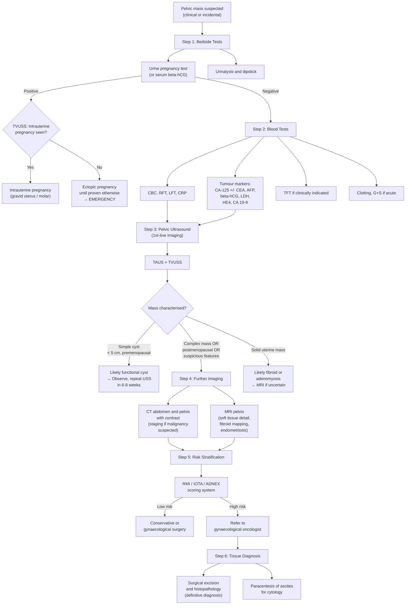

## Investigations and Diagnostic Approach to Pelvic Mass

### 1. Overarching Principles

There is no single "diagnostic criterion" for a pelvic mass the way there is for, say, rheumatoid arthritis or diabetes. Instead, the approach is an **investigative algorithm** — a sequence of bedside tests, blood tests, imaging, and (when needed) histopathology that progressively narrows the differential diagnosis from "pelvic mass" to a specific tissue diagnosis.

The logic flows from **simple → complex** and **non-invasive → invasive**:

1. **Bedside tests** (pregnancy test, urinalysis) — to immediately exclude emergencies and common mimics
2. **Blood tests** (tumour markers, CBC, biochemistry) — to stratify risk and guide imaging
3. **Imaging** (ultrasound → CT/MRI) — to characterise the mass and assess extent
4. **Histopathology** (biopsy or surgical specimen) — to provide definitive tissue diagnosis when needed

> ***The lecture slide (GC 118, p2) structures the approach as: History taking → Physical exam → DDx → Management, with pelvic imaging forming a core component*** [1]. ***A separate section of the lecture (Block C, p18) explicitly identifies "Part 4: Investigations / Pelvic imaging" and notes that "some indications require emergency management" — i.e., certain findings on investigation must trigger immediate action (e.g., ectopic pregnancy, torsion).*** [10]

---

### 2. Diagnostic Algorithm — Master Flowchart

The following algorithm represents the standard clinical approach in Hong Kong to a woman presenting with a pelvic mass:

---

### 3. Step-by-Step Investigation Modalities

#### 3.1 Step 1 — Bedside Tests

| Test | What It Tells You | Why It's Done First | Key Interpretation |
|---|---|---|---|
| ***Urine pregnancy test (or serum βhCG)*** | Detects pregnancy (intrauterine or ectopic) | ***Must be the FIRST investigation in ANY woman of reproductive age with a pelvic mass*** — failure to do so risks missing ectopic pregnancy (life-threatening) and exposes a potential fetus to harmful investigations (CT radiation, contrast) [10][11] | Positive → USS to locate pregnancy. Negative → proceed with workup |
| **Urinalysis + dipstick** | Screens for UTI, haematuria, glycosuria | May reveal urological cause (haematuria → bladder CA; pyuria → infection/TOA) | Haematuria + pelvic mass → consider bladder cancer, renal pathology [12] |
| **Vital signs** | Identifies haemodynamic instability | Ruptured ectopic, ruptured ovarian cyst, sepsis from TOA | Tachycardia + hypotension = haemorrhagic shock → emergency |

<Callout title="The Pregnancy Test Is Non-Negotiable" type="error">
***Never skip the pregnancy test. Even if the patient "can't be pregnant" — always test. Ectopic pregnancy kills, and a positive test completely changes the diagnostic pathway. This is emphasised on the lecture slide: "Don't forget about pregnancy → especially for teenage girls"*** [8].
</Callout>

#### 3.2 Step 2 — Blood Investigations

| Category | Tests | Rationale and Interpretation |
|---|---|---|
| **Haematology** | **CBC with differential** | Anaemia (Hb ↓) → chronic blood loss from menorrhagia (fibroids) or malignancy. Leukocytosis (WCC ↑) → infection (TOA, appendiceal abscess) or haematological malignancy. Thrombocytosis → reactive (malignancy, inflammation) [11] |
| **Biochemistry** | **RFT, electrolytes** | Ureteric obstruction from pelvic mass → obstructive uropathy → ↑creatinine. Also baseline before contrast CT |
| | **LFT** | Liver metastases (ovarian cancer, CRC) → ↑ALP, ↑GGT, ↑bilirubin |
| | **CRP / ESR** | Inflammatory causes: TOA, diverticular abscess, appendiceal abscess. Also elevated in malignancy |
| | **Glucose, HbA1c** | DM is a risk factor for endometrial cancer and affects surgical fitness |
| **Tumour Markers** | ***CA-125*** | ***The most important tumour marker for epithelial ovarian cancer. Normal < 35 U/mL. Elevated in ~80% of advanced epithelial ovarian cancer (especially high-grade serous). BUT non-specific: also elevated in endometriosis, PID, liver cirrhosis, pregnancy, peritonitis, fibroids, menstruation*** [1] |
| | ***HE4 (Human Epididymis Protein 4)*** | ***Newer marker, more specific than CA-125 (not elevated by endometriosis or benign cysts). Used in combination with CA-125 in the ROMA (Risk of Ovarian Malignancy Algorithm)*** |
| | **CEA** | Elevated in colorectal cancer, mucinous ovarian cancer, other GI malignancies. Useful when GI origin suspected |
| | **CA 19-9** | Mucinous ovarian tumours, pancreatic/biliary cancers. Also elevated in endometriosis and mature cystic teratomas |
| | **AFP (α-fetoprotein)** | ***Germ cell tumours: yolk sac tumour (↑↑AFP), embryonal carcinoma. Also hepatocellular carcinoma*** |
| | ***βhCG (quantitative)*** | ***Germ cell tumours: choriocarcinoma (↑↑βhCG), embryonal carcinoma. Also ectopic/molar pregnancy*** |
| | **LDH** | ***Germ cell tumours: dysgerminoma (↑↑LDH). Non-specific; also elevated in any tissue damage/turnover*** |
| | **Inhibin** | Granulosa cell tumour (sex cord-stromal) |
| **Other** | **Clotting profile, Group & Save** | Pre-operative or if haemorrhage suspected |

**Understanding Tumour Markers from First Principles:**

Tumour markers are proteins or glycoproteins produced by tumour cells (or by the body in response to cancer) that can be detected in blood. They are **not diagnostic** on their own — they are used for:
1. **Risk stratification** (pre-operative: is this likely benign or malignant?)
2. **Monitoring treatment response** (post-treatment: is the marker falling?)
3. **Surveillance for recurrence** (rising marker = possible recurrence)

The key problem is **specificity** — many benign conditions elevate the same markers. This is why CA-125 alone is insufficient for diagnosis and must always be interpreted in clinical context.

> ***A useful mnemonic for ovarian tumour markers by cell type:***
> - **Epithelial** → CA-125, HE4
> - **Germ cell** → AFP, βhCG, LDH (think "the same markers as testicular tumours" — because germ cells are germ cells regardless of sex)
> - **Sex cord-stromal** → Inhibin, oestradiol, testosterone

#### 3.3 Step 3 — Pelvic Ultrasound (First-Line Imaging)

***Pelvic ultrasound is the cornerstone investigation for a pelvic mass*** [1]. It is the first-line imaging modality because it is readily available, non-invasive, no radiation, and provides excellent resolution for pelvic structures.

##### Two Approaches: TAUS vs TVUSS

***The lecture and radiology notes distinguish two complementary approaches:*** [5]

| Feature | ***Trans-abdominal USS (TAUS)*** | ***Transvaginal USS (TVUSS)*** |
|---|---|---|
| **Probe frequency** | ***4–5 MHz (lower frequency → deeper penetration)*** | ***Up to 10 MHz (higher frequency → better resolution)*** |
| **Bladder** | ***Requires full bladder (as an acoustic window — urine transmits sound well, displaces bowel gas)*** | ***Full bladder NOT required*** |
| **Field of view** | ***Panoramic — good for large masses that extend above the pelvis*** | ***Smaller field of view*** |
| **Resolution** | Lower | ***Higher — improved resolution and contrast, better anatomical detail, reduced attenuation*** |
| **When preferred** | ***First-line (less invasive); essential for large masses; provides overview*** | ***Second-line complementary — for detailed assessment of ovarian/uterine/adnexal pathology; cannot visualise large masses in their entirety*** |
| **Patient acceptability** | Better (external probe) | Requires vaginal probe (may not be appropriate for virgins, children) |

> ***Exam pearl (from Ryan Ho Radiology Q23, M19 Rotation 3): When a patient has a left adnexal mass detected on PV examination with urinary incontinence, the most appropriate investigation is transabdominal ultrasound (not TVUSS) — because you need the panoramic view and the full bladder as an acoustic window for a mass that may be large, and you need to assess the urinary tract as well*** [5].

##### Key USS Findings and Their Interpretation

| USS Finding | Diagnosis Suggested | Why |
|---|---|---|
| ***Unilocular, anechoic, thin-walled cyst < 5 cm*** | ***Functional cyst (follicular or corpus luteum)*** | Simple fluid-filled structure with no solid components — reflects physiological ovarian activity |
| ***Homogeneous low-level internal echoes ("ground glass")*** | ***Endometriotic cyst (endometrioma / "chocolate cyst")*** | ***Old haemolysed blood has uniform fine echogenicity — the "ground glass" or "chocolate" pattern. Often causes cyclical pain in young patients*** [5] |
| ***Hyperechoic mass with posterior acoustic shadowing, containing calcification/teeth/fat*** | ***Mature cystic teratoma (dermoid cyst)*** | Ectodermal tissue (hair, teeth, fat) produces strong echogenic reflections. Fat-fluid level may be visible ("dermoid plug") |
| ***Large multiloculated cystic mass*** | ***Mucinous cystadenoma (if benign) or mucinous cystadenocarcinoma (if malignant)*** | Multiple compartments filled with mucin of varying viscosity → different echogenicity in each locule |
| ***Solid hypoechoic mass within the myometrium, with whorled texture*** | ***Uterine fibroid (leiomyoma)*** | Smooth muscle + fibrous tissue creates the characteristic "whorled" hypoechoic pattern. May show calcification (shadowing) in degenerated fibroids |
| ***Diffusely enlarged uterus with heterogeneous myometrium, myometrial cysts, ill-defined endo-myometrial junction*** | ***Adenomyosis*** | Ectopic endometrial glands within myometrium → small foci of bleeding → tiny cystic spaces within a thickened, heterogeneous myometrium |
| ***Anechoic cyst with mixed content, solid components with vascularity (on Doppler)*** | ***Ovarian cancer*** | ***"Mixed solid-cystic lesion" in a 70-year-old with pelvic mass → likely malignant*** [5] |

##### Features Suspicious for Malignancy on USS

***These USS features should raise the suspicion of ovarian malignancy:*** [1][5]

| Feature | Rationale |
|---|---|
| ***Solid component within a cystic mass*** | Benign cysts are usually entirely cystic; solid elements suggest neoplastic tissue |
| ***Thick septations (> 3 mm)*** | Thin septae are benign; thick, irregular septae suggest tumour growth along septae |
| ***Papillary excrescences (projections into the cyst)*** | Represent tumour growth protruding into the cyst lumen |
| ***Increased vascularity on Doppler (low resistance flow)*** | Malignant neovascularisation — tumours recruit new blood vessels (angiogenesis) that lack normal smooth muscle → low resistance to flow |
| ***Bilateral*** | Epithelial ovarian cancer frequently seeds the contralateral ovary |
| ***Associated ascites*** | Peritoneal carcinomatosis → fluid accumulation |

<Callout title="Exam Question Pattern" type="idea">
***From Ryan Ho Radiology (Q20, M18 Rotation 3): "F/75 complained of increasing abdominal girth. PE found abdominal mass arising from pelvis and ascites. USG found mixed solid-cystic lesion at pelvis and ascites. Uterus cannot be visualised. Most likely diagnosis? → Ovarian cancer"*** [5]. The reasoning: postmenopausal + mixed solid-cystic + ascites + cannot identify uterus separately (mass obscures it or is very large) = ovarian cancer until proven otherwise.
</Callout>

#### 3.4 Step 4 — Advanced Imaging

When ultrasound alone is insufficient (equivocal findings, suspected malignancy requiring staging, complex anatomy), further imaging is pursued:

##### CT Abdomen and Pelvis (with contrast)

| Aspect | Detail |
|---|---|
| **When** | ***Suspected malignancy (staging), equivocal USS, assessment of lymphadenopathy, peritoneal disease, distant metastases*** |
| **Strengths** | Excellent for **staging**: detects peritoneal deposits, omental cake, lymphadenopathy (para-aortic, pelvic), liver/lung metastases, ascites. Fast acquisition. Available in emergency |
| **Findings in ovarian cancer** | ***Large mass with multiple septation, solid and cystic components, peritoneal thickening/nodularity, omental cake (thickened, enhancing omentum), ascites, retroperitoneal lymphadenopathy*** [5] |
| **Limitations** | Radiation exposure. Less soft tissue contrast than MRI for pelvic organs. Should not be used in pregnancy. Requires IV contrast (check renal function) |
| **Role in emergencies** | ***CT abdomen and pelvis with contrast is used for acute abdomen workup — e.g., appendiceal abscess, diverticular abscess, perforated viscus*** [13][11] |

##### MRI Pelvis

| Aspect | Detail |
|---|---|
| **When** | ***Fibroid mapping (pre-operative planning for myomectomy or uterine artery embolisation), characterisation of indeterminate adnexal masses, endometriosis staging, local staging of cervical/endometrial cancer*** |
| **Strengths** | ***Superior soft tissue contrast — the gold standard for characterising uterine and adnexal pathology***. No radiation. Can distinguish fibroid subtypes, map their relationship to the endometrial cavity, differentiate adenomyosis from fibroids |
| **Fibroid on MRI** | Well-circumscribed, low T2 signal (because of dense fibrous/smooth muscle tissue — low water content). Degenerated fibroids may show variable signal |
| **Endometrioma on MRI** | ***"Shading sign" on T2-weighted images*** — high T1 signal (blood products), low T2 signal (concentrated old blood with high protein content causing T2 shortening) |
| **Ovarian cancer on MRI** | Solid enhancing tissue, peritoneal deposits, lymphadenopathy. MRI is particularly useful for assessing resectability and involvement of adjacent structures |

##### Hysterosalpingogram (HSG)

| Aspect | Detail |
|---|---|
| **What** | Fluoroscopic imaging after injecting radio-opaque contrast through the cervix into the uterine cavity and fallopian tubes |
| **When** | ***Infertility workup — to demonstrate patency of the fallopian tubes and outline the endometrial cavity*** [5] |
| **Findings** | Contrast fills the uterine cavity (can show submucous fibroids as filling defects, congenital anomalies), flows along the fallopian tubes, and spills into the peritoneal cavity if tubes are patent |
| **NOT used for pelvic mass workup per se** | But worth knowing as it is a pelvic imaging modality tested in exams |

> ***Exam pearl (Ryan Ho Radiology Q23, M18 Rotation 3): "33/F Ix for infertility, what imaging exam confirms fallopian tube patency? → Hysterosalpingogram"*** [5].

#### 3.5 Step 5 — Risk Stratification Scoring Systems

Once you have clinical data, blood results, and imaging, you need to decide: **is this mass likely benign or malignant?** Several scoring systems exist to help:

##### Risk of Malignancy Index (RMI)

***The RMI is the most widely used scoring system in clinical practice for pre-operative assessment of ovarian masses:*** [1]

**Formula:** **RMI = U × M × CA-125**

Where:
- **U** = Ultrasound score
  - 0 points if no suspicious features
  - 1 point if one suspicious feature
  - 3 points if ≥ 2 suspicious features
  - (Suspicious features: multilocular, solid areas, bilateral, ascites, metastases)
- **M** = Menopausal status
  - 1 if premenopausal
  - 3 if postmenopausal
- **CA-125** = serum CA-125 level (U/mL)

**Interpretation:**
- ***RMI < 200 → low risk of malignancy → can be managed by general gynaecologist***
- ***RMI ≥ 200 → high risk of malignancy → should be referred to a gynaecological oncology centre for surgery***

> **Why does this formula work?** It elegantly combines the three key risk factors: (1) ultrasound morphology (structural concern), (2) menopausal status (age-related risk), and (3) CA-125 (biochemical signal). The postmenopausal weighting (×3) and multiple USS feature weighting (×3) heavily penalise the combination of postmenopausal status + complex mass + elevated CA-125, which is exactly the high-risk combination for ovarian cancer.

**Sensitivity ~78%, Specificity ~87%** at a cut-off of 200.

##### IOTA Simple Rules and ADNEX Model

More modern approaches developed by the International Ovarian Tumor Analysis (IOTA) group:

- **IOTA Simple Rules**: Use 5 "B-features" (benign) and 5 "M-features" (malignant) on USS. If only B-features → benign; if only M-features → malignant; if mixed or no features → indeterminate (need expert USS or MRI).
  - B-features: unilocular, solid component < 7 mm, acoustic shadows, smooth multilocular < 10 cm, no blood flow
  - M-features: irregular solid tumour, ascites, ≥ 4 papillary structures, irregular multilocular-solid > 10 cm, very strong blood flow

- **ADNEX model**: A multivariate logistic regression model that gives a percentage risk of malignancy (and even the subtype — borderline, stage I, stage II–IV) based on age, CA-125, and six USS parameters.

##### ROMA (Risk of Ovarian Malignancy Algorithm)

- Combines **HE4 + CA-125 + menopausal status** into a predictive algorithm.
- Particularly useful when CA-125 is equivocal (e.g., mildly elevated in a premenopausal woman who may have endometriosis).

#### 3.6 Step 6 — Tissue Diagnosis (Histopathology)

The definitive diagnosis of a pelvic mass — especially when malignancy is suspected — requires **histopathological examination**.

| Method | When Used | Key Points |
|---|---|---|
| ***Surgical excision and histopathology*** | ***The gold standard for ovarian masses. Suspicious ovarian masses should be removed INTACT (not biopsied in situ) to avoid tumour spillage and upstaging*** | If RMI > 200 or suspicious imaging → laparotomy with full staging (midline incision, peritoneal washings, TAH + BSO + omentectomy + lymph node sampling). If low risk → laparoscopic cystectomy or oophorectomy |
| **Ascitic fluid cytology (paracentesis)** | When ascites is present and tissue diagnosis is needed pre-operatively (e.g., patient unfit for surgery) | Peritoneal fluid sent for cytology. Can identify malignant cells but sensitivity is variable (~60–90%) |
| **Image-guided biopsy (CT or USS-guided)** | Rarely used for primary ovarian masses (risk of spillage). May be used for: (1) suspected recurrent disease, (2) non-ovarian pelvic masses (e.g., retroperitoneal sarcoma, lymphoma), (3) liver/omental metastases for tissue confirmation | ***Percutaneous biopsy of an ovarian mass is generally AVOIDED because of the risk of tumour seeding along the needle tract and intraperitoneal spillage (which can upstage the cancer)*** |
| **Frozen section (intra-operative)** | During surgery, a sample is sent for rapid histological assessment. Guides the extent of surgery (if benign → conservative; if malignant → proceed to full staging) | Accuracy ~90–95% for distinguishing benign vs. malignant. Less accurate for borderline tumours |
| ***Endometrial sampling (Pipelle biopsy or hysteroscopy)*** | When the pelvic mass is uterine and endometrial cancer is suspected (e.g., PMB + thickened endometrium) | Pipelle biopsy is an office procedure; hysteroscopy allows direct visualisation + targeted biopsy |
| **Cervical biopsy (colposcopy-directed)** | When cervical cancer is suspected | |

<Callout title="Never Biopsy a Suspicious Ovarian Mass Percutaneously" type="error">
Unlike many other solid organ tumours where biopsy precedes treatment, ***ovarian masses suspected of malignancy should NOT be biopsied percutaneously***. The reasons: (1) Risk of tumour spillage into the peritoneal cavity, which worsens prognosis and upstages the cancer from stage IC (capsule ruptured) to requiring more aggressive chemotherapy; (2) The entire specimen is needed for accurate histological diagnosis (ovarian tumours are heterogeneous). The principle is: **remove it intact, examine it all**.
</Callout>

---

### 4. Summary of Investigation Findings by Diagnosis

| Diagnosis | Pregnancy Test | Key Bloods / Markers | USS Findings | Advanced Imaging |
|---|---|---|---|---|
| ***Functional cyst*** | Negative | CA-125 normal | ***Unilocular, anechoic, thin-walled, < 5 cm*** | Not needed. Repeat USS 6–8 weeks → should resolve |
| ***Endometrioma*** | Negative | CA-125 mildly ↑ | ***"Ground glass" homogeneous low-level echoes, no solid component*** [5] | MRI: "shading sign" on T2 |
| ***Dermoid (mature cystic teratoma)*** | Negative | AFP normal, CA 19-9 may be ↑ | ***Hyperechoic, calcification/teeth, fat-fluid level, "dermoid plug"*** | CT: fat density (-20 to -120 HU) + calcification is pathognomonic |
| ***Serous/mucinous cystadenoma*** | Negative | CA-125 normal/mildly ↑ | Unilocular (serous) or multilocular (mucinous), thin walls, no solid component | CT/MRI if large or indeterminate |
| ***Epithelial ovarian cancer*** | Negative | ***CA-125 ↑↑ (often > 200), HE4 ↑*** | ***Complex: solid + cystic, thick septae, papillary excrescences, bilateral, Doppler vascularity, ascites*** [5] | ***CT staging: peritoneal deposits, omental cake, lymphadenopathy, pleural effusion*** |
| ***Germ cell tumour*** | Negative (unless choriocarcinoma → βhCG ↑↑) | ***AFP ↑ (yolk sac), βhCG ↑ (choriocarcinoma), LDH ↑ (dysgerminoma)*** | Solid or mixed, unilateral, in young woman | CT staging |
| ***Uterine fibroid*** | Negative | CBC (anaemia), CA-125 normal | ***Solid hypoechoic mass within myometrium, whorled texture, calcification in degenerated fibroid*** | ***MRI: T2 low signal, well-circumscribed. Gold standard for mapping fibroids pre-operatively*** |
| ***Ectopic pregnancy*** | ***Positive*** | ***Serum βhCG: positive but lower than expected for gestational age, may show abnormal doubling*** | ***Empty uterus + adnexal mass (may see "tubal ring" sign) + free fluid in Pouch of Douglas*** | Not usually needed; if USS indeterminate → serial βhCG + repeat USS |
| ***TOA*** | Negative | WCC ↑, CRP ↑↑ | ***Complex adnexal mass with thick wall, internal debris, surrounding inflammation*** | CT if USS equivocal: rim-enhancing collection |
| ***Distended bladder*** | Negative | RFT may be deranged (if obstructive uropathy) | Fluid-filled structure in midline, resolves post-catheter | Not needed if confirmed by catheter |

---

### 5. Special Investigations for Specific Scenarios

| Scenario | Investigation | Rationale |
|---|---|---|
| ***Suspected ovarian torsion*** | ***USS with Doppler (TVUSS)*** | ***Absent or reduced ovarian blood flow on Doppler. Enlarged oedematous ovary ("whirlpool sign" of twisted pedicle). However, normal Doppler does NOT exclude torsion (dual blood supply may maintain some flow)*** |
| Suspected appendiceal mass | CT abdomen pelvis with contrast | Distended appendix > 6 mm, wall thickening, periappendiceal fat stranding ± appendicolith, abscess collection [14] |
| Suspected CRC | ***Colonoscopy (gold standard) + CT staging*** | Direct visualisation + biopsy of colonic lesion; CT for staging |
| Infertility workup with pelvic mass | ***Hysterosalpingogram (HSG)*** | Demonstrates tubal patency and uterine cavity shape [5] |
| ***Pre-operative fibroid mapping*** | ***MRI pelvis*** | Best modality for number, size, location (FIGO classification), relationship to endometrial cavity, degeneration type |
| Suspected endometrial cancer | ***Transvaginal USS (endometrial thickness) + Pipelle endometrial biopsy*** | ***Postmenopausal endometrial thickness > 4 mm is abnormal → requires histological sampling*** |

---

### 6. Integration: How to Interpret Results Together

The power of the diagnostic approach lies in **combining** clinical, biochemical, and imaging data — no single test is diagnostic in isolation.

**Example 1: 65-year-old with CA-125 of 450, bilateral complex masses on USS, and ascites**
→ RMI = 3 (USS) × 3 (postmenopausal) × 450 (CA-125) = **4,050** → very high risk → refer to gynae-oncology for staging laparotomy.

**Example 2: 28-year-old with CA-125 of 60, unilateral 4 cm cyst on USS, regular periods**
→ RMI = 0 (USS) × 1 (premenopausal) × 60 = **0** → very low risk → likely endometrioma or functional cyst. Repeat USS in 6–8 weeks.

> The lesson: CA-125 of 60 in a premenopausal woman is almost certainly benign (endometriosis, luteal cyst). CA-125 of 60 in a postmenopausal woman with a complex mass demands urgent investigation.

<Callout title="High Yield Summary — Diagnostic Approach to Pelvic Mass">

**1. Always start with a pregnancy test** — in ANY woman of reproductive age, regardless of history.

**2. Pelvic ultrasound (TAUS + TVUSS) is the first-line imaging modality** for all pelvic masses. TAUS gives the panoramic view (good for large masses); TVUSS gives superior resolution for adnexal and uterine detail.

**3. Key USS features of malignancy**: solid components, thick septae, papillary excrescences, bilateral, Doppler vascularity, ascites.

**4. CA-125** is the most important tumour marker for epithelial ovarian cancer, but is non-specific. Interpret in context: age, menopausal status, USS findings. Use RMI scoring (U × M × CA-125). RMI ≥ 200 → refer to gynae-oncology.

**5. CT** is for staging when malignancy is suspected (peritoneal disease, lymphadenopathy, distant metastases). **MRI** is for soft tissue characterisation (fibroid mapping, endometriosis, indeterminate adnexal masses).

**6. Do NOT percutaneously biopsy a suspicious ovarian mass** — risk of spillage and upstaging. Remove it intact surgically.

**7. Frozen section** intra-operatively guides surgical extent (conservative vs. radical).

**8. For fibroids**: USS is first-line for diagnosis; MRI is gold standard for pre-operative mapping.

**9. For endometrial cancer**: TVUSS for endometrial thickness + Pipelle biopsy for histology.

**10. Germ cell tumour markers**: AFP (yolk sac), βhCG (choriocarcinoma), LDH (dysgerminoma) — same as testicular tumour markers.

</Callout>

---

<ActiveRecallQuiz
  title="Active Recall - Investigations for Pelvic Mass"
  items={[
    {
      question: "What is the formula for the Risk of Malignancy Index (RMI), what does each component represent, and what threshold triggers referral to gynae-oncology?",
      markscheme: "RMI = U (ultrasound score: 0, 1, or 3 based on suspicious features) x M (menopausal status: 1 if pre, 3 if post) x CA-125 (serum level in U/mL). RMI >= 200 = high risk, refer to gynaecological oncologist."
    },
    {
      question: "A 70-year-old woman has a mixed solid-cystic pelvic mass on USS with ascites. The uterus cannot be separately visualised. What is the most likely diagnosis, and what further investigations are needed?",
      markscheme: "Most likely: Ovarian cancer. Investigations: CA-125 (and HE4), CBC, LFT, RFT; CT abdomen and pelvis with contrast for staging (peritoneal deposits, omental cake, lymphadenopathy, distant metastases); referral for surgical staging."
    },
    {
      question: "Explain the difference between TAUS and TVUSS in terms of probe frequency, bladder requirement, field of view, and resolution. When would you prefer TAUS over TVUSS?",
      markscheme: "TAUS: 4-5 MHz, requires full bladder as acoustic window, panoramic view, lower resolution. TVUSS: up to 10 MHz, no full bladder needed, smaller field of view, higher resolution. Prefer TAUS for: large masses extending above pelvis, virgins/children, initial overview, when urinary tract assessment also needed."
    },
    {
      question: "Name the USS features that suggest an ovarian mass is malignant rather than benign (at least 5 features).",
      markscheme: "Solid components within cystic mass, thick septations (> 3 mm), papillary excrescences, increased vascularity on Doppler (low resistance flow), bilateral, associated ascites. Also: irregular margins, multilocular-solid > 10 cm."
    },
    {
      question: "Why should you NOT perform percutaneous biopsy of a suspicious ovarian mass? What is the preferred approach to obtaining a tissue diagnosis?",
      markscheme: "Risk of tumour spillage into peritoneal cavity causing upstaging (from stage IA/B to IC), worsening prognosis, and requiring more aggressive chemotherapy. Also needle tract seeding risk. Preferred approach: intact surgical excision (oophorectomy or staging laparotomy with TAH-BSO, omentectomy, washings) with intra-operative frozen section."
    },
    {
      question: "Match the following tumour markers to their associated ovarian tumour subtype: CA-125, AFP, beta-hCG, LDH, Inhibin.",
      markscheme: "CA-125: epithelial ovarian cancer (especially high-grade serous). AFP: yolk sac tumour (germ cell). Beta-hCG: choriocarcinoma (germ cell). LDH: dysgerminoma (germ cell). Inhibin: granulosa cell tumour (sex cord-stromal)."
    }
  ]}
/>

## References

[1] Lecture slides: GC 118. Pelvic mass ovarian cancer and cysts; uterine fibroid; pelvic imaging.pdf (p2, p21)
[5] Senior notes: Ryan Ho Radiology.pdf (p32, p34, p39, p40)
[8] Lecture slides: Block C - Pelvic mass_ ovarian cancer and cysts; uterine fibroid; pelvic imaging.pdf (p17, p18)
[10] Lecture slides: Block C - Pelvic mass_ ovarian cancer and cysts; uterine fibroid; pelvic imaging.pdf (p18)
[11] Senior notes: Ryan Ho Fundamentals.pdf (p76, p279)
[12] Senior notes: Ryan Ho Urogenital.pdf (p133, p134)
[13] Senior notes: Ryan Ho Diagnostic Radiology.pdf (p36, p39, p81)
[14] Senior notes: Ryan Ho GI.pdf (p150)
