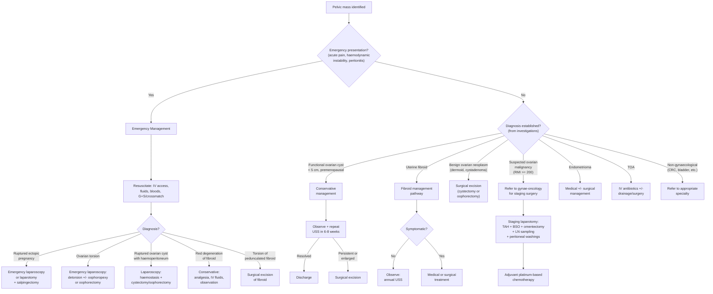
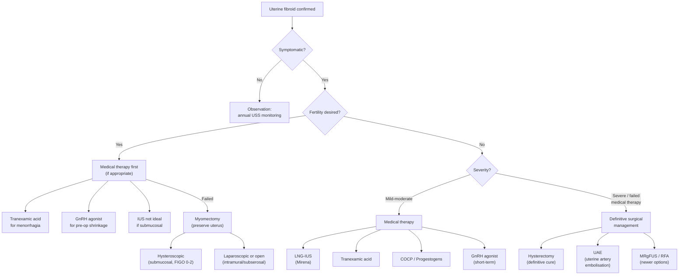

## Management of Pelvic Mass

### 1. Overarching Management Principles

***The lecture summary slide (GC 118, p71) states the key principle: "Management will depend on the age, symptom, condition and wish of the patient"*** [1]. This single sentence captures the four pillars of management decision-making:

1. **Age** — reproductive vs. postmenopausal; fertility desires; life expectancy
2. **Symptoms** — is the mass causing problems (pain, bleeding, pressure), or is it an incidental finding?
3. **Condition** — what is the mass? Benign vs. malignant? Emergency vs. elective?
4. **Wish of the patient** — fertility preservation, desire to avoid surgery, cultural preferences

***The lecture also notes: "Some indications require emergency management — ovarian cyst complications, pregnancy complications"*** [10]. So the very first branch in any management algorithm is: **is this an emergency?**

The management approach is best understood by condition, since each type of pelvic mass has its own specific treatment pathway. However, there is a unifying **master algorithm** that applies to all pelvic masses.

---

### 2. Master Management Algorithm

---

### 3. Management by Condition

#### 3.1 Functional Ovarian Cysts

**Understanding the rationale from first principles:** Functional cysts (follicular and corpus luteum) are by-products of normal ovarian physiology. A follicular cyst forms when a follicle fails to rupture; a corpus luteum cyst forms when the corpus luteum fails to regress. Since these structures are driven by the menstrual cycle, they almost always **resolve spontaneously** within 1–3 cycles as hormone levels change.

| Approach | Detail | Rationale |
|---|---|---|
| ***Conservative observation*** | ***Repeat USS in 6–8 weeks*** | Most functional cysts < 5 cm resolve spontaneously. The 6–8 week interval spans 1–2 menstrual cycles, allowing the cyst to regress if it is physiological |
| **COCP** | May be offered to prevent *new* functional cysts (by suppressing ovulation) | ***Does NOT accelerate resolution of an existing cyst*** — this is a common misconception. COCP prevents future cysts by suppressing the HPO axis |
| **Surgical excision** | Laparoscopic cystectomy or oophorectomy | Indicated if: (1) persistent > 3 cycles, (2) enlarging, (3) becoming symptomatic, (4) suspicious features develop, (5) postmenopausal (no "functional" explanation) |

<Callout title="Common Exam Misconception" type="error">
The COCP does NOT treat an existing functional ovarian cyst — it only prevents new ones from forming. An existing cyst resolves on its own because the hormonal milieu changes naturally with the next cycle. If the cyst persists beyond 2–3 cycles, it is probably not functional and needs further evaluation.
</Callout>

#### 3.2 Benign Ovarian Neoplasms

| Tumour | Management | Why |
|---|---|---|
| ***Mature cystic teratoma (dermoid cyst)*** | ***Laparoscopic ovarian cystectomy (preferred if < 10 cm and fertility desired) or oophorectomy*** | Dermoids do not resolve spontaneously (they are neoplastic, not functional). Risk of complications: torsion (due to heavy cyst acting as a pendulum), rupture (chemical peritonitis from sebaceous content), and rare malignant transformation (< 2%, usually in > 40 yr). Fertility-sparing surgery is standard in young women |
| ***Serous/mucinous cystadenoma*** | ***Laparoscopic cystectomy or oophorectomy*** | These are true neoplasms — they will not regress. Mucinous types can become enormous. Risk of malignancy increases with age and complexity. Surgical excision removes the mass and provides histological diagnosis |
| **Ovarian fibroma** | **Oophorectomy** | Solid tumour; important to differentiate from malignancy on histology. If Meigs' syndrome present (ascites + pleural effusion), both resolve after tumour removal |

**Key surgical principles for benign ovarian masses:**
- ***In young women desiring fertility → ovarian cystectomy (preserve ovarian tissue)***
- ***In older women or if malignancy suspected → oophorectomy (remove entire ovary)***
- ***Avoid spillage*** — endometriomas (chocolate cyst content causes peritoneal irritation and adhesions), dermoids (sebaceous material causes severe chemical peritonitis), and potentially malignant cysts (spillage can upstage cancer)
- Use an **endobag** to retrieve specimens laparoscopically and prevent spillage into the peritoneal cavity

#### 3.3 Suspected or Confirmed Ovarian Cancer

***This is the most critical management pathway. Ovarian cancer management requires a multidisciplinary team (MDT) approach led by a gynaecological oncologist.*** [1]

##### A. Surgical Staging and Cytoreduction

***The cornerstone of ovarian cancer management is primary debulking surgery (PDS) — the goal is to remove as much tumour as possible (optimal cytoreduction), ideally to no visible residual disease (R0).***

| Component of Staging Laparotomy | Purpose | Explanation |
|---|---|---|
| ***Midline vertical incision*** | Allows complete access to the entire abdomen and pelvis | A transverse incision is inadequate — you need to inspect the diaphragm, paracolic gutters, omentum, and all peritoneal surfaces |
| ***Peritoneal washings / ascitic fluid for cytology*** | Cytological staging — identifies malignant cells in peritoneal fluid | Positive washings upstage the cancer (stage IC/IIIA) |
| ***Total abdominal hysterectomy + bilateral salpingo-oophorectomy (TAH + BSO)*** | Remove the primary tumour and uterus | The contralateral ovary frequently harbours microscopic disease; uterus is removed to facilitate complete clearance |
| ***Infracolic omentectomy*** | Remove the greater omentum | Omentum is the most common site of peritoneal metastasis ("omental cake" on CT). Contains milky spots rich in macrophages where tumour cells preferentially seed |
| ***Pelvic and para-aortic lymph node dissection/sampling*** | Lymphatic staging | Ovarian cancer spreads to para-aortic nodes (following the ovarian vessels to the aorta at L2). Pelvic nodes may also be involved |
| ***Appendicectomy*** | Particularly in mucinous tumours | To exclude a primary appendiceal mucinous tumour masquerading as ovarian (pseudomyxoma peritonei) |
| ***Peritoneal biopsies*** | Multiple biopsies from paracolic gutters, diaphragm, pelvic peritoneum | Detects microscopic peritoneal implants not visible to the naked eye |
| **Maximum cytoreductive effort** | Resection of all visible tumour deposits — may include bowel resection, diaphragmatic stripping, splenectomy, peritoneal stripping | ***The single most important prognostic factor in advanced ovarian cancer is the amount of residual disease after surgery*** — patients with no visible residual (R0) have significantly better survival than those with > 1 cm residual |

##### B. Fertility-Sparing Surgery (Exception)

- ***In young women with early-stage (IA), low-grade ovarian cancer and desire for fertility, conservative surgery may be offered:***
  - Unilateral salpingo-oophorectomy (USO) + comprehensive staging (peritoneal washings, omentectomy, LN sampling, contralateral ovarian biopsy)
  - Followed by completion surgery (TAH + contralateral BSO) after childbearing is complete
- This is ONLY for: stage IA, unilateral, non-clear cell histology, no extra-ovarian disease

##### C. Chemotherapy

***Adjuvant platinum-based chemotherapy is the standard of care for epithelial ovarian cancer:***

| Regimen | Indication | Mechanism |
|---|---|---|
| ***Carboplatin + Paclitaxel (first-line)*** | ***Standard adjuvant for all epithelial ovarian cancer except very early stage (IA, grade 1)*** | ***Carboplatin*** (a platinum compound) cross-links DNA strands → prevents DNA replication and transcription → tumour cell apoptosis. ***Paclitaxel*** (a taxane, from *Taxus* = yew tree) stabilises microtubules → prevents mitotic spindle disassembly → arrests cell division in M phase |
| **Neoadjuvant chemotherapy (NACT)** | When primary debulking surgery is not feasible (e.g., extensive peritoneal disease, poor performance status, unresectable tumour bulk) | 3 cycles of chemotherapy → interval debulking surgery (IDS) → 3 more cycles. This "sandwich" approach reduces tumour burden before surgery |
| ***Bevacizumab (anti-VEGF)*** | ***Added to first-line chemotherapy in advanced stage (FIGO IIIB–IV) or high-risk stage III*** | Monoclonal antibody against VEGF (vascular endothelial growth factor) — "beva" = antibody targeting angiogenesis. Blocks new blood vessel formation by the tumour → starves tumour of oxygen and nutrients |
| ***PARP inhibitors (olaparib, niraparib)*** | ***Maintenance therapy after response to platinum-based chemo, especially in BRCA-mutant tumours*** | PARP (poly ADP-ribose polymerase) is a DNA repair enzyme. In BRCA-mutant cells, homologous recombination repair is already defective. Blocking PARP eliminates the "backup" repair pathway → synthetic lethality → tumour cell death. Normal cells with intact BRCA can still repair DNA, so they survive |

> **Why platinum-based?** Ovarian cancer (especially high-grade serous) is remarkably chemo-sensitive to platinum compounds. The initial response rate is ~80%. However, most patients eventually relapse — the platinum-free interval determines subsequent treatment (platinum-sensitive relapse if > 6 months; platinum-resistant if < 6 months).

##### D. Germ Cell Tumours — Management Differs

| Feature | Approach | Rationale |
|---|---|---|
| **Surgical** | ***Fertility-sparing USO + staging*** (even in advanced disease, as they are chemo-sensitive) | Germ cell tumours are usually unilateral and occur in young women. Excellent response to chemotherapy means aggressive surgical debulking of the contralateral ovary is unnecessary |
| **Chemotherapy** | ***BEP regimen: Bleomycin + Etoposide + Cisplatin*** | Same regimen as testicular germ cell tumours (because germ cells are germ cells). Cure rates > 90% even in advanced disease |

#### 3.4 Uterine Fibroids

Fibroid management is nuanced and highly individualised. The key question is: ***does the patient have symptoms, and what is her reproductive plan?***

##### Management Algorithm for Fibroids

##### A. Medical Management

| Treatment | Mechanism | Indications | Key Points |
|---|---|---|---|
| ***Tranexamic acid*** | Anti-fibrinolytic: blocks plasminogen → plasmin conversion, thereby reducing breakdown of fibrin clots at the endometrial surface → ↓menstrual blood loss | ***First-line for menorrhagia*** [15] | Taken only during menstruation (not continuous). Reduces menstrual blood loss by ~50%. ***Contraindicated with concurrent COCP use (thrombotic risk)*** [15] |
| **Non-steroidal anti-inflammatory drugs (NSAIDs)** | Inhibit cyclooxygenase → ↓prostaglandin synthesis → ↓endometrial blood flow and uterine contractility → ↓menstrual blood loss and dysmenorrhoea | Menorrhagia + dysmenorrhoea | Mefenamic acid is commonly used. Also taken only during menstruation |
| ***Combined oral contraceptive pill (COCP)*** | Suppresses ovarian steroid production → thin, atrophic endometrium → less menstrual bleeding. Also provides regular withdrawal bleeds | Menorrhagia, cycle regulation | ***Contraindicated if uncontrolled CV risk factors or active smoking*** [15] |
| ***Levonorgestrel-releasing intrauterine system (LNG-IUS / Mirena)*** | Local progesterone effect → endometrial decidualisation and atrophy → dramatically ↓menstrual blood loss | ***Effective for menorrhagia, especially in women not planning pregnancy*** | Not ideal if large submucosal fibroid distorting the cavity (risk of expulsion). May also cause fibroid volume to decrease slightly via progesterone effect |
| ***GnRH agonists (e.g. leuprolide / goserelin)*** | Initially stimulate GnRH receptors → then cause receptor downregulation ("medical menopause") → ↓↓ oestrogen and progesterone → fibroid shrinkage (40–60% volume reduction) | ***Short-term pre-operative use to shrink fibroids before surgery (3–6 months max) or as bridge-to-menopause*** | Cannot be used long-term (> 6 months) due to **hypoestrogenic side effects**: bone density loss, vasomotor symptoms (hot flushes), vaginal dryness. Fibroids regrow after stopping. "Add-back" therapy (low-dose oestrogen + progestogen) can mitigate side effects |
| ***GnRH antagonists with add-back (e.g. relugolix + E2/NETA)*** | Direct competitive blockade of GnRH receptors → rapid ↓ oestrogen → fibroid shrinkage. Combined with add-back hormones (oestradiol + norethindrone acetate) to prevent bone loss and vasomotor symptoms | ***Newer option for long-term medical management of fibroids (FDA-approved 2021)*** | Oral medication (unlike injectable GnRH agonists). Can be used for up to 24 months with add-back |
| ***Ulipristal acetate (selective progesterone receptor modulator, SPRM)*** | Binds progesterone receptors → blocks progesterone action on fibroid → ↓fibroid growth and ↓endometrial bleeding | Previously used for pre-operative fibroid management | ***Currently restricted/withdrawn in many countries (including EU) due to risk of severe liver injury.*** Important to know for exams but unlikely to be first-line in current clinical practice |

##### B. Surgical Management

| Procedure | Approach | Indications | Contraindications / Limitations |
|---|---|---|---|
| ***Myomectomy*** | ***Hysteroscopic (FIGO 0–2 submucosal): resected transcervically using resectoscope. Laparoscopic or open (FIGO 3–7): enucleation of fibroid from myometrium with closure of uterine defect*** | ***Fertility desired, symptomatic fibroids*** | Higher risk of recurrence (~15–30% over 5 years — fibroids are multifocal). May need to convert to open if multiple/large. Uterine rupture risk in subsequent pregnancy (especially if endometrial cavity entered) |
| ***Hysterectomy*** | ***Total abdominal hysterectomy (TAH), laparoscopic hysterectomy, or vaginal hysterectomy*** | ***Definitive treatment — when fertility no longer desired, severe symptoms, failed other treatments, suspected malignancy*** | Irreversible — loss of fertility. Surgical risks (bleeding, infection, ureteric/bladder injury — remember "water under the bridge"). Not appropriate if fertility desired |
| ***Uterine artery embolisation (UAE)*** | ***Interventional radiology procedure: catheter inserted via femoral artery → bilateral uterine arteries selectively embolised with particles (PVA particles or gelfoam) → devascularisation of fibroids → ischaemic necrosis and shrinkage*** [13] | ***Symptomatic fibroids in women who wish to avoid surgery or are poor surgical candidates*** | ***Contraindicated if fertility desired*** (concerns about uterine blood supply and endometrial/ovarian damage affecting future pregnancy). Also contraindicated if infection suspected, if pedunculated subserosal fibroid (risk of detachment and peritonitis), or suspected malignancy |
| **MR-guided focused ultrasound surgery (MRgFUS / HIFU)** | High-intensity focused ultrasound beams converge on the fibroid under MRI guidance → thermal ablation → coagulative necrosis | Selected fibroids (favourable location, not too large, not too many) | Limited by fibroid number, size, and location. Not widely available. Fertility data limited |
| **Radiofrequency ablation (RFA, e.g. Acessa)** | Laparoscopic or transcervical insertion of RF probe into fibroid → thermal destruction | Symptomatic, intramural or subserosal fibroids | Newer technique; growing evidence base. May preserve uterus for future fertility |

> ***UAE is specifically mentioned in the radiology notes as a key interventional radiology procedure: "Uterine fibroid embolisation" using embolic agents (Gelfoam, PVA particles, coil, glue) to block the uterine artery*** [13].

<Callout title="Hysterectomy Routes — How to Choose">
**Vaginal hysterectomy** is preferred when technically feasible (shortest recovery, fewest complications) — best for normal-sized or moderately enlarged uterus with adequate vaginal access.

**Laparoscopic hysterectomy** (total or laparoscopic-assisted vaginal) is preferred for larger uteri or when concurrent procedures are needed (adhesiolysis, oophorectomy).

**Abdominal hysterectomy** is reserved for: very large uteri (> 12–14 weeks' size), suspected malignancy (need midline incision for staging), complex pelvic pathology (severe adhesions, endometriosis).
</Callout>

#### 3.5 Adenomyosis

| Approach | Treatment | Mechanism and Rationale |
|---|---|---|
| **Medical** | LNG-IUS (Mirena), COCP, GnRH agonists, progestogens | All reduce oestrogenic stimulation of ectopic endometrial tissue within the myometrium → ↓ cyclical bleeding and inflammation → ↓ pain and menorrhagia |
| **Surgical** | Hysterectomy (definitive) | Adenomyosis is diffuse throughout the myometrium and cannot be "excised" the way a fibroid can. Hysterectomy is the only cure. Fertility-sparing adenomyomectomy is experimental |

#### 3.6 Endometriosis / Endometrioma

| Approach | Treatment | Indications |
|---|---|---|
| **Medical** | COCP (continuous), progestogens (dienogest), GnRH agonists, LNG-IUS | Pain management, suppression of ectopic endometrial tissue, prevention of recurrence after surgery |
| **Surgical** | ***Laparoscopic excision/drainage of endometrioma*** (cystectomy preferred over drainage alone — lower recurrence rate); excision/ablation of peritoneal deposits | Symptomatic endometrioma > 4 cm, failed medical therapy, fertility (endometrioma may impair ovum pickup and ovarian reserve), suspicious features |
| **Fertility** | Surgery to restore anatomy + ART (IVF) if needed | Endometriosis impairs fertility through adhesions (mechanical distortion), inflammatory peritoneal fluid (toxic to sperm/embryo), and reduced ovarian reserve (from cysts and surgery) |

#### 3.7 Ectopic Pregnancy — Emergency Management

| Approach | Treatment | Indications |
|---|---|---|
| ***Expectant*** | Close monitoring with serial βhCG measurements | Small ectopic, declining βhCG, haemodynamically stable, no symptoms, βhCG < 1000–1500. Many tubal ectopics will undergo tubal abortion and resolve. Patient must be reliable for follow-up |
| ***Medical*** | ***Methotrexate (single or multi-dose IM injection)*** | Unruptured ectopic, βhCG < 5000 (some centres < 3000), no fetal heartbeat, haemodynamically stable, no contraindication to methotrexate (e.g., liver/renal disease, thrombocytopaenia). Methotrexate inhibits dihydrofolate reductase → blocks DNA synthesis in rapidly dividing trophoblast cells → regression of ectopic pregnancy |
| ***Surgical*** | ***Laparoscopic salpingectomy (preferred) or salpingotomy*** | Ruptured ectopic (emergency), haemodynamic instability, βhCG > 5000, fetal heartbeat seen, contraindication/failure of methotrexate. **Salpingectomy** (removing the tube) is preferred over salpingotomy (opening the tube and removing the pregnancy) because of lower risk of persistent trophoblast and future ectopic in the same tube. However, **salpingotomy** may be preferred if the contralateral tube is absent/damaged (to preserve any chance of natural conception) |

#### 3.8 Tubo-Ovarian Abscess (TOA)

| Stage | Treatment | Rationale |
|---|---|---|
| **Mild / unruptured** | ***Broad-spectrum IV antibiotics*** (e.g., ceftriaxone + doxycycline + metronidazole — covers *N. gonorrhoeae*, *C. trachomatis*, anaerobes, and Gram-negatives) | Polymicrobial ascending infection; initial antibiotic therapy is successful in ~75% of cases |
| **No response to antibiotics (48–72 hours)** | ***Image-guided percutaneous or transvaginal drainage*** (interventional radiology or USS-guided) | Antibiotics cannot penetrate a walled-off abscess effectively; drainage + antibiotics is synergistic |
| **Ruptured TOA / septic shock / no response** | ***Emergency laparoscopy or laparotomy*** — drainage, unilateral or bilateral salpingo-oophorectomy (if extensive destruction) | Ruptured TOA causes diffuse peritonitis → life-threatening sepsis. Definitive source control is required |

#### 3.9 Ovarian Torsion — Emergency Management

| Step | Action | Rationale |
|---|---|---|
| ***Emergency laparoscopy*** | ***Detorsion (untwisting the pedicle) ± oophoropexy (fixing the ovary to prevent re-torsion)*** | ***The priority is to save the ovary*** — even if it appears dusky/necrotic at first, it often recovers after detorsion (reperfusion). Ovarian conservation is especially important in young women |
| **Oophorectomy** | If the ovary is clearly non-viable after detorsion, or if the mass is suspicious for malignancy | Non-viable tissue will necrose and become a source of infection. Malignant masses should not be left in situ |
| **Cystectomy** | Often performed at the same time if a cyst was the lead point for torsion | Removing the cyst (which acts as a pendulum causing torsion) reduces the risk of recurrence |

> ***Exam point: do NOT delay surgery to confirm diagnosis with Doppler — clinical suspicion alone is sufficient to proceed to emergency laparoscopy. Normal Doppler does NOT exclude torsion (dual blood supply may maintain some flow initially).***

#### 3.10 Non-Gynaecological Pelvic Masses

| Condition | Management | Referral Pathway |
|---|---|---|
| **Distended bladder** | Catheterisation (urethral or suprapubic) → investigate and treat underlying cause | Urology |
| **Colorectal cancer** | Surgical resection ± neoadjuvant/adjuvant chemo/RT | Colorectal surgery + oncology |
| **Appendiceal abscess** | IV antibiotics → interval appendicectomy (6–8 weeks) | General surgery |
| **Retroperitoneal sarcoma** | Surgical resection (often requires multidisciplinary approach) ± RT | Surgical oncology |
| **Pelvic lymphoma** | Chemotherapy ± RT (tissue biopsy for subtyping first) | Haematology-oncology |

---

### 4. Summary Table: Key Treatment Modalities — Indications and Contraindications

| Treatment | Indications | Contraindications / Limitations |
|---|---|---|
| ***Conservative observation*** | Functional cysts < 5 cm in premenopausal women; asymptomatic small fibroids | Postmenopausal cyst (higher malignancy risk); enlarging/symptomatic mass |
| ***COCP*** | Menorrhagia (fibroids), cycle regulation, prevention of new functional cysts, endometriosis suppression | ***Uncontrolled CV risk factors, active smoking (> 35 yr), history of VTE, migraine with aura, concurrent tranexamic acid*** [15] |
| ***Tranexamic acid*** | ***First-line for menorrhagia*** | ***Concurrent COCP use (↑thrombotic risk)*** [15]; active thromboembolic disease |
| ***LNG-IUS (Mirena)*** | Menorrhagia (fibroids, adenomyosis, DUB) | Large submucosal fibroid distorting cavity (risk of expulsion); uterine anomaly; active PID |
| ***GnRH agonists*** | Pre-operative fibroid shrinkage; bridge-to-menopause; endometriosis | Long-term use > 6 months (bone loss); pregnancy; undiagnosed vaginal bleeding |
| ***Myomectomy*** | Symptomatic fibroids with desire for fertility preservation | Very high risk of recurrence; may not be feasible if too many/large fibroids |
| ***Hysterectomy*** | Definitive for fibroids, adenomyosis, endometrial cancer; completed family | Fertility desired; unfit for surgery |
| ***UAE*** | Symptomatic fibroids, not desiring fertility, poor surgical candidate | ***Fertility desired; pedunculated subserosal fibroid; suspected malignancy; active infection*** [13] |
| ***Staging laparotomy*** | Suspected or confirmed ovarian cancer | Medically unfit (→ NACT first); very early favourable disease in young woman (→ fertility-sparing USO) |
| ***Platinum-based chemotherapy*** | Adjuvant for epithelial ovarian cancer (most stages) | Very early, low-grade stage IA (may not need chemo); contraindications to platinum (renal failure, allergy) |
| ***PARP inhibitors*** | Maintenance after platinum response, especially BRCA-mutant | Non-BRCA, platinum-resistant disease (less benefit); myelosuppression |
| ***Methotrexate (ectopic)*** | Unruptured ectopic, βhCG < 5000, no fetal heartbeat, stable | Ruptured ectopic, haemodynamic instability, high βhCG, fetal heartbeat, hepatic/renal disease, immunodeficiency, breastfeeding |
| ***Laparoscopic salpingectomy*** | Ruptured ectopic, failed methotrexate, high βhCG | Relative: absent contralateral tube (may prefer salpingotomy) |
| ***Emergency detorsion*** | Ovarian torsion | Mass highly suspicious for malignancy (risk of tumour dissemination during manipulation) |

---

### 5. Special Considerations

#### 5.1 Fibroids in Pregnancy

***Red (carneous) degeneration*** is the classic fibroid complication in pregnancy (typically 2nd trimester). The rapidly growing uterus causes venous thrombosis within the fibroid → haemorrhagic infarction.

| Aspect | Management |
|---|---|
| **Treatment** | ***Conservative: rest, IV fluids, analgesia (paracetamol first-line; NSAIDs avoided in pregnancy, especially after 28 weeks due to premature closure of ductus arteriosus)*** |
| **Surgery** | ***AVOID myomectomy during pregnancy*** — the uterus is extremely vascular and surgery risks catastrophic haemorrhage. Exception: torsion of pedunculated fibroid |
| **Delivery** | Fibroids in the lower segment may obstruct vaginal delivery → caesarean section. Myomectomy at caesarean is controversial (risk of haemorrhage from highly vascular myometrium) |

#### 5.2 Fertility Preservation in Ovarian Cancer

- For young patients with early-stage, unilateral, non-clear-cell ovarian cancer: ***unilateral salpingo-oophorectomy + comprehensive staging*** preserves contralateral ovary and uterus
- For germ cell tumours: ***fertility-sparing USO standard*** even in advanced disease (excellent chemo-sensitivity)
- ***Oocyte or embryo cryopreservation*** should be discussed before starting chemotherapy (gonadotoxic agents)
- GnRH agonists during chemotherapy may offer some ovarian protection (controversial but increasingly used)

#### 5.3 The Role of MDT (Multidisciplinary Team)

***Management of ovarian cancer should be discussed at an MDT meeting*** involving:
- Gynaecological oncologist (surgery)
- Medical oncologist (chemotherapy)
- Radiologist (imaging interpretation)
- Pathologist (histological typing/grading)
- Clinical nurse specialist
- Genetic counsellor (for BRCA testing)

---

<Callout title="High Yield Summary — Management of Pelvic Mass">

**1. Management depends on 4 factors: age, symptoms, diagnosis, and patient's wishes** [1].

**2. Emergency management first:** ruptured ectopic → emergency laparoscopy/laparotomy; ovarian torsion → emergency detorsion; ruptured cyst with haemodynamic instability → surgical haemostasis.

**3. Functional ovarian cysts:** observe + repeat USS in 6–8 weeks. COCP prevents NEW cysts but does NOT treat existing ones.

**4. Benign ovarian neoplasms:** surgical excision (cystectomy if fertility desired; oophorectomy if not).

**5. Ovarian cancer:** staging laparotomy (TAH + BSO + omentectomy + LN sampling + washings) → adjuvant carboplatin + paclitaxel. Goal = R0 (no visible residual). PARP inhibitors for BRCA-mutant maintenance.

**6. Fibroids:** medical first (tranexamic acid, LNG-IUS, GnRH agonists) → surgical if failed (myomectomy if fertility desired; hysterectomy if definitive). UAE is an alternative in selected patients not desiring fertility.

**7. Ectopic pregnancy:** expectant (low βhCG, declining), methotrexate (unruptured, βhCG < 5000), salpingectomy (ruptured/failed/high βhCG).

**8. TOA:** IV antibiotics first → drainage if no response → surgery if ruptured/no improvement.

**9. Ovarian torsion:** emergency detorsion — try to save the ovary.

**10. UAE contraindicated if fertility desired, pedunculated fibroid, suspected malignancy.**

</Callout>

---

<ActiveRecallQuiz
  title="Active Recall - Management of Pelvic Mass"
  items={[
    {
      question: "A 45-year-old woman with a symptomatic 8 cm intramural fibroid has completed her family. She is a smoker. She asks about her options. Outline the management options and any contraindications relevant to her.",
      markscheme: "Options: (1) Medical: tranexamic acid for menorrhagia, LNG-IUS (Mirena), GnRH agonist for pre-op shrinkage. COCP is contraindicated (active smoker over 35). (2) Surgical: hysterectomy (definitive, family complete), myomectomy (fertility not needed, so hysterectomy preferred). (3) UAE as alternative to surgery. (4) Newer: MRgFUS, RFA. Key contraindication: COCP contraindicated with active smoking and uncontrolled CV risk."
    },
    {
      question: "Describe the components of a staging laparotomy for ovarian cancer and explain the rationale for each step.",
      markscheme: "Midline vertical incision (access entire abdomen), peritoneal washings/ascitic fluid for cytology (cytological staging), TAH + BSO (remove primary tumour), infracolic omentectomy (commonest site of metastasis), pelvic and para-aortic lymph node sampling (lymphatic staging), appendicectomy (especially mucinous tumours), multiple peritoneal biopsies from paracolic gutters, diaphragm, pelvis (detect microscopic deposits). Goal is maximum cytoreduction to R0."
    },
    {
      question: "What is uterine artery embolisation? Name three contraindications.",
      markscheme: "UAE is an interventional radiology procedure where bilateral uterine arteries are selectively catheterised and embolised with particles (PVA, gelfoam) causing ischaemic necrosis and shrinkage of fibroids. Contraindications: (1) Desire for future fertility, (2) Pedunculated subserosal fibroid (risk of detachment into peritoneal cavity), (3) Suspected malignancy, (4) Active pelvic infection."
    },
    {
      question: "A 25-year-old woman presents with a confirmed unruptured tubal ectopic pregnancy. Her beta-hCG is 3500, she is haemodynamically stable, and there is no fetal heartbeat. What are her management options?",
      markscheme: "Medical: single-dose IM methotrexate (meets criteria: unruptured, stable, no fetal heartbeat, beta-hCG < 5000). Must follow up with serial beta-hCG until undetectable. Surgical (if methotrexate fails or patient declines): laparoscopic salpingectomy (preferred) or salpingotomy. Expectant management is less suitable with beta-hCG of 3500 (relatively high)."
    },
    {
      question: "Explain the mechanism by which PARP inhibitors work in BRCA-mutant ovarian cancer, and why they are less effective in BRCA-wildtype tumours.",
      markscheme: "BRCA1/2 proteins are essential for homologous recombination DNA repair. In BRCA-mutant cancer cells, this pathway is already defective. PARP is a backup DNA repair enzyme (base excision repair). Inhibiting PARP removes the only remaining repair pathway, leading to accumulation of lethal DNA damage and cell death (synthetic lethality). In BRCA-wildtype cells, homologous recombination is intact, so cells can still repair DNA even with PARP blocked, making the drug less effective."
    },
    {
      question: "A 28-year-old woman presents with acute right iliac fossa pain, nausea, and a known 7 cm right ovarian dermoid cyst. At emergency laparoscopy, the ovary appears dusky and oedematous after detorsion. What should you do?",
      markscheme: "Observe the ovary after detorsion — even dusky-appearing ovaries frequently recover reperfusion viability. If the ovary pinks up, perform cystectomy (remove the dermoid which was the lead point for torsion) and consider oophoropexy (fix ovary to prevent re-torsion). Only proceed to oophorectomy if the ovary is clearly non-viable after adequate observation or if malignancy is suspected. Ovarian conservation is the priority in young women."
    }
  ]}
/>

## References

[1] Lecture slides: GC 118. Pelvic mass ovarian cancer and cysts; uterine fibroid; pelvic imaging.pdf (p2, p71)
[5] Senior notes: Ryan Ho Radiology.pdf (p32, p34)
[10] Lecture slides: Block C - Pelvic mass_ ovarian cancer and cysts; uterine fibroid; pelvic imaging.pdf (p18, p59)
[13] Senior notes: Ryan Ho Diagnostic Radiology.pdf (p78, p85)
[15] Lecture slides: Block C - O&G Theme Case 2.docx.pdf (p5)
