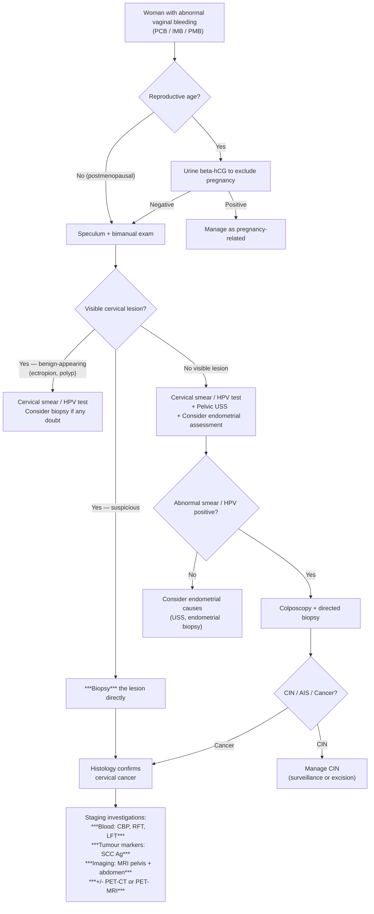

## Differential Diagnosis of Cervical Cancer

The differential diagnosis (DDx) of cervical cancer is really the differential of its **presenting symptoms and signs**. The most common presentations you need to differentiate are:

1. **Abnormal vaginal bleeding** (postcoital, intermenstrual, postmenopausal)
2. **A visible cervical lesion** on speculum examination
3. **Abnormal vaginal discharge**

The clinical reasoning here is: you see a patient with one or more of these features — what could it be *other than* cervical cancer? And how do you systematically work through it?

---

### Organising Framework

***Per-vaginal bleeding — separate answer into benign / malignant. Cancer is not the commonest cause → many many more benign causes.*** [1]

***Classify based on anatomy → start from bottom, and move upwards: Vagina → cervix → endometrium → ovaries.*** [1]

This anatomical approach is the safest way to avoid missing diagnoses in an exam or clinical setting. Let's build the DDx systematically.

---

### A. Differential Diagnosis by Anatomical Site

#### 1. Cervical Causes (Most Directly Relevant)

| Condition | Key Differentiating Features | Why It Mimics Cervical Cancer |
|---|---|---|
| **Cervical ectropion (erosion)** | Very common, especially in young women on OCP or pregnant; columnar epithelium everts onto ectocervix, appears red and velvety on speculum; bleeds on contact | Causes PCB and looks red/friable on speculum — but it is a *physiological* finding, not neoplastic. The columnar epithelium is simply more delicate than squamous |
| **Cervical polyp** | Pedunculated, smooth, red/purple mass protruding from os; benign endocervical glandular overgrowth; easy to see on speculum | Causes PCB and IMB; visible lesion at cervix — but smooth, not irregular/necrotic. Almost always benign (< 1% malignant) |
| **Cervicitis** (Chlamydia, Gonorrhoea, HSV) | Purulent discharge, contact bleeding, mucopurulent endocervical discharge; history of STI risk; cervix may appear inflamed/oedematous | Causes PCB and discharge; cervix looks inflamed — but there is no mass. Swabs and NAAT testing differentiate |
| **Cervical intraepithelial neoplasia (CIN)** | Pre-invasive; usually detected on screening (abnormal Pap/HPV), not visible to naked eye (requires colposcopy with acetic acid/Lugol's iodine to visualise) | Doesn't usually cause symptoms — but it is the *precursor* to cervical cancer. The distinction between CIN 3 and microinvasive cancer requires histology |
| **Nabothian cysts** | Retention cysts of endocervical glands covered by squamous metaplasia; smooth, rounded, translucent/yellowish bumps on cervix | May look like a cervical lesion on speculum but clearly cystic, smooth, non-friable — entirely benign |
| **Cervical fibroid (leiomyoma)** | Smooth, firm, round mass at cervix; rare location for fibroids | Pelvic mass at the cervix — but smooth, regular, without ulceration or necrosis |

#### 2. Vaginal Causes

| Condition | Key Differentiating Features |
|---|---|
| **Vaginal cancer** (primary — rare) | Usually SCC in elderly women; may present with PV bleeding and visible vaginal mass; distinguished by location (vaginal wall, not cervix) |
| **Vaginal atrophy** (atrophic vaginitis) | Postmenopausal; thin, pale, friable vaginal epithelium due to oestrogen deficiency; causes PMB, dyspareunia, discharge; no discrete mass |
| **Vaginal trauma** | History of intercourse, foreign body, or assault; visible laceration |
| **Vaginal infections** (Candida, BV, Trichomonas) | Discharge predominates; no mass; characteristic discharge features |

#### 3. Uterine / Endometrial Causes

| Condition | Key Differentiating Features |
|---|---|
| **Endometrial cancer** | ***Most common cause of PMB that you must exclude***; typically postmenopausal bleeding in obese women with metabolic syndrome; no visible cervical lesion (bleeding comes from above); diagnosed by endometrial biopsy/hysteroscopy |
| **Endometrial polyp** | IMB, PMB; diagnosed on ultrasound/hysteroscopy; cervix looks normal |
| **Endometrial hyperplasia** | Irregular/heavy bleeding in perimenopausal women; associated with unopposed oestrogen; diagnosed on biopsy |
| **Dysfunctional uterine bleeding / Anovulatory bleeding** | ***Most common cause of endometrial bleeding is irregular ovulation causing irregular periods*** [1]; reproductive age; no structural lesion |
| **Uterine fibroids (leiomyoma)** | Heavy menstrual bleeding (menorrhagia), not typically PCB; enlarged, irregular uterus on palpation; diagnosed on ultrasound |
| **Adenomyosis** | Heavy, painful periods (dysmenorrhoea + menorrhagia); diffusely enlarged, tender uterus; MRI is best imaging |

#### 4. Ovarian / Tubal Causes

| Condition | Key Differentiating Features |
|---|---|
| **Ovarian cancer** | Rarely causes PV bleeding (more commonly ascites, bloating, pelvic mass); CA-125 elevated in epithelial ovarian cancer |
| **Ruptured ovarian cyst / ectopic pregnancy** | Acute presentation with pain ± bleeding; positive β-hCG in ectopic; haemodynamic instability if ruptured |

#### 5. Pregnancy-Related Causes

***Don't forget about pregnancy → especially for teenage girls*** [5]

| Condition | Key Differentiating Features |
|---|---|
| **Threatened / incomplete miscarriage** | Positive pregnancy test; PV bleeding with or without pain; products of conception may be visible at os |
| **Ectopic pregnancy** | Positive β-hCG, unilateral pelvic pain, PV bleeding; potentially life-threatening |
| **Gestational trophoblastic disease** | Very high β-hCG; "snowstorm" on ultrasound; vaginal bleeding in early pregnancy |

<Callout title="Always Do a Pregnancy Test" type="error">
In any woman of reproductive age with abnormal vaginal bleeding, ***always exclude pregnancy first*** with a urine or serum β-hCG before proceeding with further investigation. Missing an ectopic pregnancy can be fatal.
</Callout>

#### 6. Non-Gynaecological Causes

| Condition | Key Features |
|---|---|
| **Urethral / bladder pathology** | Haematuria mistaken for PV bleeding; urinalysis differentiates; bladder cancer presents with painless haematuria [6] |
| **Rectal / anal pathology** | Haemorrhoids, colorectal cancer — rectal bleeding misinterpreted as vaginal; rectal exam and proctoscopy differentiate |
| **Coagulopathy** | Anticoagulant use, ITP, von Willebrand disease — may exacerbate or cause PV bleeding; check coagulation profile |

---

### B. Differential Diagnosis of a Cervical Mass / Lesion

When you see something abnormal on the cervix during speculum exam, the DDx of the **visible lesion** is narrower:

| Benign | Malignant / Pre-malignant |
|---|---|
| Cervical ectropion | **Cervical cancer** (SCC, adenocarcinoma) |
| Cervical polyp | CIN (requires colposcopy to see) |
| Nabothian cyst | Cervical lymphoma (very rare) |
| Cervical fibroid | Cervical sarcoma (very rare) |
| Condylomata acuminata (genital warts — HPV 6/11) | Metastasis to cervix from other primary (extremely rare) |
| Endometriosis of cervix (rare) | |

---

### C. Clinical Approach — Diagnostic Algorithm for Abnormal Vaginal Bleeding Leading to Cervical Cancer Diagnosis

<Callout title="Key Principle — Biopsy Any Suspicious Cervical Lesion">
***Biopsy a must for suspicious lesions*** [3][7]. A Pap smear is a **screening** test, not a diagnostic one. If you see a visible suspicious lesion on the cervix (irregular, friable, ulcerated, necrotic), you must **biopsy it directly** — do NOT rely on cytology alone. Cytology can miss invasive cancer because the surface cells may be necrotic and the smear may be inadequate.
</Callout>

---

### D. Key Distinguishing Features — Cervical Cancer vs. Common Mimics

| Feature | Cervical Cancer | Cervical Ectropion | Cervical Polyp | Endometrial Cancer |
|---|---|---|---|---|
| **Age** | ***Median 55*** [3] | Young, reproductive age | Any age (perimenopausal) | Postmenopausal (60–70s) |
| **Bleeding pattern** | ***Postcoital bleeding*** [3] | PCB (light) | IMB, PCB | PMB (not PCB) |
| **Speculum appearance** | Irregular, friable mass; ulcerated/necrotic; bleeds on touch | Smooth, red area around os | Smooth, pedunculated, red/purple | Cervix usually normal; blood from os |
| **Discharge** | Foul-smelling, blood-stained | Mucoid | Minimal | Watery/blood-stained from uterus |
| **Risk factors** | HPV, smoking, immunosuppression | OCP, pregnancy | None specific | Obesity, diabetes, unopposed oestrogen, tamoxifen |
| **Diagnosis** | Biopsy of lesion | Clinical + Pap smear | Polypectomy + histology | Endometrial biopsy / hysteroscopy |

---

### E. Tumour Markers in the Differential

***Tumour markers for cervical cancer → SCC marker. CA-125 is for ovarian cancer, and adenocarcinoma in general → but in CA cervix, the most common cell type is squamous cell carcinoma (80%), so the only situation you would take CA-125 is when a biopsy has been taken, and the pathology for CA cervix comes back as adenocarcinoma.*** [7]

| Tumour Marker | Associated Cancer | When Relevant in Cervical Cancer DDx |
|---|---|---|
| **SCC antigen** | Squamous cell carcinomas (cervix, lung, oesophagus, H&N) | Primary tumour marker for cervical SCC; used for monitoring, not screening [7][8] |
| **CA-125** | Ovarian cancer, adenocarcinomas | Only relevant in cervical **adenocarcinoma** (not SCC) [7] |
| **β-hCG** | Pregnancy, GTD, germ cell tumours | Exclude pregnancy/GTD in reproductive age women [8] |
| **CEA** | Colorectal, GI cancers | Not relevant in cervical cancer DDx unless considering GI primary [8] |
| **CA 19-9** | Pancreatic, biliary, GI cancers | Not relevant for cervical cancer |

---

### F. Why Certain Conditions Are Important Differentials in Hong Kong Context

- **Cervical ectropion**: extremely common in young HK women on OCP — the most frequent benign cause of PCB. Don't over-investigate, but always perform a smear and ensure screening is up to date
- **Endometrial cancer**: the most common gynaecological malignancy in Hong Kong (more common than cervical cancer). Always consider in PMB. The key distinguishing feature: cervix looks normal, bleeding comes from above
- **Cervicitis from Chlamydia/Gonorrhoea**: STI rates are rising in HK, especially among young adults. A mucopurulent cervical discharge with contact bleeding can mimic early cervical cancer — do NAAT swabs

---

<Callout title="High Yield Summary — DDx of Cervical Cancer">

**Approach**: Anatomical — vagina → cervix → endometrium → ovaries. Separate benign vs. malignant.

**Most important benign mimics of PCB**: cervical ectropion (most common), cervical polyp, cervicitis.

**Most important malignant DDx**: endometrial cancer (PMB with normal cervix), vaginal cancer (rare).

**Always exclude pregnancy** in reproductive-age women.

**Key rule**: ***If there is a visible suspicious cervical lesion → BIOPSY. Do not rely on Pap smear alone.***

**Tumour markers**: SCC antigen for SCC-type cervical cancer; CA-125 only if adenocarcinoma confirmed on histology.

**Imaging**: ***MRI is the best imaging modality for cervical cancer*** (local spread assessment); PET-MRI if available.
</Callout>

---

<ActiveRecallQuiz
  title="Active Recall — Differential Diagnosis of Cervical Cancer"
  items={[
    {
      question: "Describe the systematic anatomical framework for generating a differential diagnosis for per-vaginal bleeding.",
      markscheme: "Classify by anatomy from bottom upwards: vagina (atrophy, trauma, vaginal cancer), cervix (ectropion, polyp, cervicitis, CIN, cervical cancer), endometrium (polyp, hyperplasia, endometrial cancer, anovulatory bleeding, fibroids), ovaries (ovarian tumours). Separate benign from malignant. Always exclude pregnancy in reproductive age.",
    },
    {
      question: "A 28-year-old woman on the OCP presents with postcoital bleeding. Speculum shows a smooth red area around the cervical os that bleeds on touch. What is the most likely diagnosis and why?",
      markscheme: "Cervical ectropion. OCP causes oestrogen-driven eversion of endocervical columnar epithelium onto the ectocervix. This columnar epithelium is delicate and friable, bleeding on contact. It is physiological, not neoplastic. Key differentiating feature from cancer: smooth and uniform appearance without irregularity, ulceration, or necrosis. Still need to ensure cervical screening is up to date.",
    },
    {
      question: "Why should you biopsy a suspicious cervical lesion directly rather than relying on a Pap smear result?",
      markscheme: "Pap smear is a screening test, not a diagnostic test. In the presence of a visible suspicious lesion, the surface may be necrotic and the smear inadequate or falsely negative. Direct biopsy provides tissue for histological diagnosis, which is the gold standard. A normal Pap smear does NOT exclude cervical cancer if there is a clinically suspicious lesion.",
    },
    {
      question: "What tumour marker is used for cervical cancer and in what specific circumstance would you use CA-125 instead?",
      markscheme: "SCC antigen is the primary tumour marker for cervical cancer (since 70-80% are squamous cell carcinoma). CA-125 is only used when biopsy confirms cervical adenocarcinoma (not SCC), as CA-125 is a marker for adenocarcinomas and ovarian cancer.",
    },
    {
      question: "Name three key clinical features that distinguish endometrial cancer from cervical cancer in a woman presenting with postmenopausal bleeding.",
      markscheme: "1. In endometrial cancer the cervix appears normal on speculum (bleeding comes from above through the os), whereas in cervical cancer there is a visible cervical lesion. 2. Endometrial cancer risk factors are obesity, diabetes, unopposed oestrogen, tamoxifen (metabolic), while cervical cancer risk factors are HPV-related. 3. Endometrial cancer typically presents with PMB without PCB, while cervical cancer classically presents with PCB.",
    },
  ]}
/>

---

## References

[1] Lecture slides: Block C - Abnormal vaginal bleeding_ gynaecological cancer.pdf (p1)
[3] Lecture slides: GC 112. Abnormal vaginal bleeding Gynaecological cancer.pdf (p11, slides 21–22)
[5] Lecture slides: Block C - Pelvic mass_ ovarian cancer and cysts; uterine fibroid; pelvic imaging.pdf (p17)
[6] Senior notes: Ryan Ho Urogenital.pdf (p153)
[7] Lecture slides: Block C - Abnormal vaginal bleeding_ gynaecological cancer.pdf (p21)
[8] Senior notes: Maksim Medicine Notes.pdf (p337)
