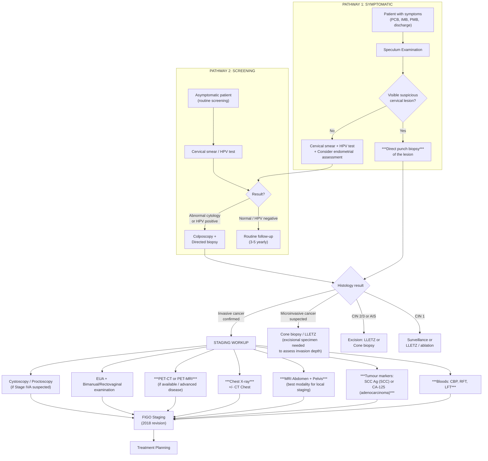

## Diagnosis of Cervical Cancer — Criteria, Algorithm, and Investigations

### Diagnostic Principles — Two Distinct Pathways

Before diving in, understand that there are **two fundamentally different clinical scenarios** that lead to the diagnosis of cervical cancer:

1. **Symptomatic patient** (e.g., postcoital bleeding, visible lesion on speculum) → **direct biopsy** of the lesion
2. **Asymptomatic patient** detected through **screening** (abnormal Pap smear / HPV test) → **colposcopy + directed biopsy**

The endpoint is the same: **histopathological confirmation on biopsy**. There is no blood test, imaging study, or tumour marker that *diagnoses* cervical cancer. The diagnosis is **always histological**.

<Callout title="Fundamental Rule">
***Biopsy a must for suspicious lesions*** [3][7]. ***For diagnosis — take a biopsy*** [3]. No matter what the smear, imaging, or tumour marker says, the definitive diagnosis of cervical cancer requires **tissue**.
</Callout>

---

### A. Pathological Diagnosis — Two Complementary Modalities

***Two aspects of pathological diagnosis*** [9]:
1. ***Looking at the abnormal cells → obtained by cervical smear (cytology)*** [9]
2. ***Looking at the abnormal architecture / invasion → obtained by cervical biopsy (histopathology)*** [9]

This distinction is critical:

| | **Cytology (Cervical Smear / Pap Smear)** | **Histopathology (Biopsy)** |
|---|---|---|
| **What it examines** | Individual cells scraped from the cervix | Tissue architecture — how cells are organised, whether basement membrane is intact/breached |
| **What it can tell you** | Whether cells look abnormal (dyskaryosis / intraepithelial lesion) | Whether there is CIN, AIS, or **invasive cancer** (tumour invading through basement membrane into stroma) |
| **Limitation** | Cannot determine invasion — you can't see tissue architecture from loose cells | Requires a procedure (biopsy, cone, LLETZ) |
| **Classification system** | ***Bethesda System*** [9] | ***WHO Classification*** [9] |
| **Role** | **Screening** (population-level detection of abnormalities) | **Diagnosis** (definitive confirmation of disease) |

#### The Bethesda System for Cervical Cytology (***For cytology, we follow the Bethesda System*** [9])

| Bethesda Category | Meaning | Next Step |
|---|---|---|
| **NILM** (Negative for Intraepithelial Lesion or Malignancy) | Normal | Routine screening |
| **ASC-US** (Atypical Squamous Cells of Undetermined Significance) | Mildly abnormal cells, unclear significance; most common abnormal result | HPV triage (if HPV+, colposcopy; if HPV−, repeat in 12 months) |
| **ASC-H** (Atypical Squamous Cells, cannot exclude HSIL) | More suspicious than ASC-US; ~40% have CIN 2/3 on biopsy | Colposcopy |
| **LSIL** (Low-grade Squamous Intraepithelial Lesion) | Corresponds to CIN 1 / HPV cytopathic effect (koilocytosis) | HPV triage or colposcopy |
| **HSIL** (High-grade Squamous Intraepithelial Lesion) | Corresponds to CIN 2/3; significant risk of underlying invasive cancer | Colposcopy (urgent) |
| **SCC** | Squamous cell carcinoma on cytology | Urgent referral — biopsy to confirm |
| **AGC** (Atypical Glandular Cells) | Abnormal glandular cells — concerning for AIS or adenocarcinoma; harder to detect | Colposcopy + endocervical curettage ± endometrial sampling |
| **AIS** (Adenocarcinoma in situ) | Glandular pre-cancer | Excisional procedure (cone biopsy) |

#### WHO Histopathological Classification (***For histopathology, we follow the WHO classification*** [9])

- CIN 1 / CIN 2 / CIN 3 (squamous pre-invasive)
- AIS (glandular pre-invasive)
- Invasive SCC / Adenocarcinoma / Adenosquamous / Neuroendocrine / Others
- HPV-associated vs. HPV-independent (WHO 2020 classification)

---

### B. Diagnostic Criteria

Cervical cancer does not have a rigid "diagnostic criteria" checklist like, say, rheumatoid arthritis. Instead, the diagnosis rests on:

| Criterion | Detail |
|---|---|
| **1. Histological confirmation** (mandatory) | Biopsy showing invasive carcinoma — tumour cells breaching the basement membrane and invading cervical stroma |
| **2. Specifiable histological type** | SCC, adenocarcinoma, adenosquamous, neuroendocrine, etc. (per WHO classification) |
| **3. HPV status** (increasingly important) | p16 immunohistochemistry as surrogate for HPV-driven carcinogenesis; HPV genotyping if available |
| **4. FIGO Stage** (clinical + imaging + pathological) | Determined by clinical exam, imaging (MRI, PET-CT), and surgical/pathological findings (2018 FIGO) |

The **minimum requirement for diagnosis** = biopsy-proven invasive cervical carcinoma.

For **microinvasive disease** (Stage IA), the diagnosis specifically requires:
- **Excisional biopsy** (cone biopsy / LLETZ), NOT punch biopsy — because you need to assess depth and width of invasion and confirm clear margins
- Punch biopsy cannot measure depth of invasion accurately

<Callout title="Punch Biopsy vs. Excisional Biopsy" type="error">
A common error: a punch biopsy showing "invasive squamous cell carcinoma" does NOT tell you the stage. To determine whether the cancer is truly microinvasive (Stage IA1 ≤ 3mm; IA2 3–5mm), you need an **excisional specimen** (cone/LLETZ) to measure the maximum depth and horizontal extent of stromal invasion. Punch biopsies only confirm the *presence* of invasion, not its *extent*.
</Callout>

---

### C. Investigation Modalities — Systematic Approach

***Investigations are divided into two purposes*** [3]:
1. ***For diagnosis — Take a biopsy***
2. ***For plan of management — Blood tests (CBP, RFT, LFT), tumour markers, imaging (CT / MRI / PET-CT) to assess renal tract / extent of spread / lymph node involvement***

Let's go through each systematically.

---

#### C1. Investigations for Diagnosis

##### 1. Speculum Examination

The very first step. Allows direct visualisation of the cervix.

| Finding | Interpretation |
|---|---|
| Exophytic/cauliflower-like mass | Likely invasive cancer — biopsy directly |
| Ulcerative/necrotic lesion | Likely invasive cancer — biopsy directly |
| Barrel-shaped, expanded cervix | Endophytic (endocervical) tumour — may need endocervical curettage |
| Smooth red area around os | Likely ectropion — but still do smear/HPV test |
| Normal-appearing cervix | Cancer not excluded — may be microinvasive or endocervical; proceed with smear/HPV |

***Common gynaecological examination: cervical smear / Pap smear → if positive, refer to colposcopy → magnifying cervix to have a look, then take a cervical biopsy*** [10]

***Image showing the magnified cervix seen on colposcopy → looking at cervical os; if cervical os is circle, then nulliparous woman; if cervical os shape is a line, suggestive of parous woman*** [10]

##### 2. Cervical Smear (Pap Smear) / HPV Test

- **Pap smear**: cells collected from the TZ using a spatula and cytobrush; processed as liquid-based cytology (LBC) — reported using the Bethesda System
- **HPV test**: PCR-based detection of high-risk HPV DNA/RNA from the same sample
- In Hong Kong, the screening programme is transitioning to **primary HPV testing** (HPV test first → if positive, cytology triage)
- Important: **a Pap smear is a screening test** — if there is a visible suspicious lesion, you go straight to biopsy, not smear

##### 3. Colposcopy + Directed Biopsy

Colposcopy ("colpo" = vagina/cervix, "scopy" = looking) — a magnified examination of the cervix using a colposcope (binocular magnifying device, 6–40× magnification).

**Procedure**:
1. Speculum inserted
2. Cervix visualised under magnification
3. **Acetic acid (3–5%)** applied → abnormal epithelium turns **acetowhite** (because acetic acid coagulates nuclear proteins; dysplastic cells have higher nuclear-to-cytoplasmic ratio, so more protein → more whitening)
4. **Lugol's iodine (Schiller's test)** applied → normal squamous epithelium stains **dark brown/mahogany** (contains glycogen which binds iodine); dysplastic/columnar epithelium remains **unstained (Schiller-positive)** (dysplastic cells lack glycogen)
5. **Directed punch biopsies** taken from the most abnormal-appearing areas
6. **Endocervical curettage (ECC)** performed if the TZ is not fully visualised or if there is suspicion of endocervical disease

| Colposcopic Finding | Interpretation |
|---|---|
| Acetowhite epithelium (thin, flat) | Suggests low-grade dysplasia (CIN 1) |
| Dense acetowhite, coarse mosaic/punctation | Suggests high-grade dysplasia (CIN 2/3) |
| Atypical vessels, irregular surface, ulceration, exophytic mass | Suggests **invasive cancer** |
| Lugol's non-staining (Schiller-positive) area | Abnormal epithelium (dysplastic or columnar — not specific) |

##### 4. Biopsy Types

| Type | When Used | What It Tells You |
|---|---|---|
| **Punch biopsy** (colposcopy-directed) | Visible lesion or colposcopic abnormality | Confirms presence of CIN or invasive cancer; cannot accurately measure depth of invasion |
| **LLETZ / LEEP** (Large Loop Excision of the Transformation Zone) | Diagnostic AND therapeutic for CIN; also used as excisional biopsy for suspected microinvasion | Provides the entire TZ as a specimen; allows assessment of depth, margins, and LVSI |
| **Cone biopsy** (cold-knife conization) | Suspected microinvasive disease, adenocarcinoma/AIS (because glandular lesions extend higher into canal), discrepancy between cytology and colposcopy | Provides a cone-shaped specimen of cervix including endocervical canal; gold standard for assessing microinvasion |
| **EUA + biopsy** (Examination Under Anaesthesia) | Large/advanced lesions; assessing parametrial involvement for staging | Allows thorough bimanual and rectovaginal examination + generous biopsy of tumour |

---

#### C2. Investigations for Staging and Management Planning

Once the diagnosis is confirmed histologically, the next step is staging — determining how far the cancer has spread. This dictates treatment.

##### 1. Blood Tests

***Blood test: CBP, RFT, LFT*** [3]

| Test | Rationale / Key Findings |
|---|---|
| **CBP (Complete Blood Picture)** | Anaemia from chronic PV bleeding (iron deficiency pattern: microcytic, hypochromic); thrombocytopenia if bone marrow infiltration (very late); leucocytosis if infection/necrosis |
| **RFT (Renal Function Tests)** — urea, creatinine, electrolytes | **Critical**: cervical cancer commonly causes **ureteric obstruction → hydronephrosis → renal impairment**. Elevated creatinine = possible bilateral ureteric obstruction → Stage IIIB. Must be assessed before any nephrotoxic chemotherapy (e.g., cisplatin) |
| **LFT (Liver Function Tests)** | Elevated ALP/GGT → possible liver metastases or bone metastases. Elevated bilirubin/transaminases → liver parenchymal involvement |
| **Coagulation profile** | Baseline before surgery; DIC screen in advanced disease |
| **Iron studies** | To confirm iron deficiency if anaemic |

##### 2. Tumour Markers

***Tumour markers for cervical cancer → SCC marker*** [7]

***CA-125 is for ovarian cancer, and adenocarcinoma in general → but in CA cervix, the most common cell type is squamous cell carcinoma (80%), so the only situation you would take CA-125 is when a biopsy has been taken, and the pathology for CA cervix comes back as adenocarcinoma*** [7]

| Marker | When to Use | Interpretation |
|---|---|---|
| **SCC antigen (Squamous Cell Carcinoma antigen)** | All cervical SCC (the majority) | Elevated in ~60% of SCC; useful for **monitoring treatment response and detecting recurrence**, not for screening or primary diagnosis. Level correlates with tumour volume and stage |
| **CA-125** | Cervical **adenocarcinoma** only (after histology confirmed) | Elevated in adenocarcinoma; useful for monitoring; not indicated in SCC |
| **CEA** | Occasionally in adenocarcinoma | Less commonly used |

<Callout title="Tumour Markers Are Not Diagnostic" type="error">
Tumour markers (SCC Ag, CA-125) are **never** used to diagnose cervical cancer. They are used for: (1) baseline pre-treatment, (2) monitoring treatment response, (3) detecting recurrence during follow-up. A normal tumour marker does NOT exclude cancer.
</Callout>

##### 3. Imaging — The Core of Staging

***What is the best imaging modality for cervical cancer?*** [7]

***Similar to rectal cancer, important for cervical cancer to know extent of local spread → has implications on whether surgery can be offered*** [7]

***So MRI is the best modality for cervical cancer, as apart from local invasion it is also pretty good at detecting metastatic lesions / lymph node involvement*** [7]

***What is done in HKU: MRI abdomen + pelvis done first, along with chest X-ray. PET-MR if you have the money*** [7]

| Imaging Modality | Role | Key Findings |
|---|---|---|
| ***MRI Pelvis + Abdomen*** (BEST modality) | **Primary staging modality** — gold standard for assessing local extent | **T2-weighted**: tumour appears as intermediate-high signal mass replacing the normal low-signal cervical stroma. Assesses: (1) tumour size, (2) **parametrial invasion** (disruption of the dark stromal ring = parametrial involvement → Stage IIB), (3) vaginal extension, (4) bladder/rectal invasion, (5) pelvic sidewall involvement, (6) lymphadenopathy (pelvic and para-aortic), (7) hydronephrosis. **DWI (Diffusion-Weighted Imaging)**: tumour shows restricted diffusion (high cellularity) — enhances tumour delineation |
| **Chest X-ray** | Baseline assessment for lung metastases | Cannonball metastases, pleural effusion, lymphangitis carcinomatosa [11] |
| **CT Chest/Abdomen/Pelvis** | Supplement to MRI — better for detecting distant metastases (lung, liver, bone, distant lymph nodes) | Lymphadenopathy (> 1cm short axis = suspicious); hydronephrosis; liver/lung metastases. Less accurate than MRI for local staging (poor soft tissue contrast in pelvis) |
| ***PET-CT or PET-MRI*** | Best for detecting **lymph node metastases and distant disease** | 18F-FDG-avid lesions [12]; superior to CT alone for detecting involved lymph nodes (sensitivity ~75–95% vs. ~50% for CT); excellent for detecting occult distant metastases; increasingly used for treatment planning (radiotherapy field design). ***PET-MR combines the local staging superiority of MRI with the metabolic/distant staging of PET*** [7] |
| **Ultrasound (Transvaginal / Transrectal)** | Limited role; occasionally used to assess tumour size, parametrial invasion; operator-dependent | Hypoechoic cervical mass; assessing blood flow with Doppler |
| **IVU (Intravenous Urography)** | Historically used to assess ureteric obstruction; now largely replaced by CT/MRI | Hydronephrosis, ureteric deviation/obstruction |

##### Why MRI is Superior for Cervical Cancer (From First Principles)

The key staging question in cervical cancer is: **has the tumour invaded the parametrium?** This is because parametrial invasion (Stage IIB) is the watershed between surgical and non-surgical management.

- The **parametrium** is the connective tissue surrounding the cervix (cardinal and uterosacral ligaments), containing the uterine artery, ureter, and lymphatic channels
- On MRI T2-weighted images, the **normal cervical stroma** appears as a **dark (low-signal) ring** around the cervix
- An **intact dark stromal ring** = parametrium NOT invaded = potentially resectable
- A **disrupted dark stromal ring** with tumour signal extending beyond = parametrial invasion = Stage IIB = primary chemoradiotherapy (not surgery)
- CT cannot reliably distinguish tumour from normal cervical stroma (poor soft tissue contrast in the pelvis)
- This is exactly analogous to why MRI is best for rectal cancer (assessing mesorectal fascia involvement)

##### 4. Additional Investigations for Staging

| Investigation | When | Purpose |
|---|---|---|
| **Cystoscopy** | If anterior extension suspected (Stage IVA) | Confirm bladder mucosal invasion — must see **bullous oedema** or **tumour on the bladder mucosa** with **biopsy confirmation**. Bullous oedema alone does not equal Stage IVA |
| **Proctoscopy / Sigmoidoscopy** | If posterior extension suspected (Stage IVA) | Confirm rectal mucosal invasion — requires biopsy confirmation |
| **EUA (Examination Under Anaesthesia)** | Part of clinical staging, especially for advanced disease | Thorough bimanual + rectovaginal examination to assess parametrial/pelvic sidewall involvement, vaginal extension. Done under anaesthesia for proper muscle relaxation and patient comfort |
| **Bone scan / Bone MRI** | If bone pain or elevated ALP | Assess for bone metastases |
| **Brain MRI** | If neurological symptoms | Assess for brain metastases (rare) |

##### 5. Histopathological Assessment of the Biopsy Specimen

The pathology report on the biopsy/excision specimen provides critical information:

| Parameter | Clinical Significance |
|---|---|
| **Histological type** | SCC vs. adenocarcinoma vs. others — determines tumour marker choice (SCC Ag vs. CA-125), and has prognostic implications |
| **Grade** (well/moderately/poorly differentiated) | Higher grade = more aggressive behaviour |
| **Depth of stromal invasion** (in mm) | Determines Stage IA1 vs. IA2 vs. IB (on excisional specimen only) |
| **Horizontal extent** | Contributes to staging of microinvasive disease |
| **Lymphovascular space invasion (LVSI)** | Present = higher risk of lymph node metastasis; influences decision for lymphadenectomy |
| **Margin status** | Positive margins on cone/LLETZ = need for re-excision or further surgery |
| **p16 immunostaining** | Surrogate for HPV-driven carcinogenesis (diffuse strong block-positive p16 = HPV-associated); HPV-independent tumours are p16-negative and have worse prognosis |

---

### D. Complete Diagnostic Algorithm — From Presentation to Staging

---

### E. FIGO 2018 Staging — How Investigations Map to Stage

| Stage | How It Is Determined |
|---|---|
| **IA1 / IA2** | **Excisional biopsy** (cone/LLETZ) — microscopic measurement of invasion depth (≤ 3mm = IA1; > 3–5mm = IA2) |
| **IB1 / IB2 / IB3** | **Clinical exam + MRI** — tumour size (≤ 2cm / > 2–4cm / > 4cm) |
| **IIA** | **MRI + Clinical exam** — upper 2/3 vaginal involvement, no parametrial invasion |
| **IIB** | **MRI** (disrupted stromal ring) + **EUA** (parametrial thickening/nodularity on rectovaginal exam) |
| **IIIA** | **Clinical exam** — lower 1/3 vaginal involvement |
| **IIIB** | **MRI/CT** — hydronephrosis or non-functioning kidney; pelvic sidewall involvement on EUA |
| **IIIC1 / IIIC2** | **PET-CT/MRI or surgical pathology** — pelvic (IIIC1) or para-aortic (IIIC2) lymph node involvement |
| **IVA** | **Cystoscopy/proctoscopy with biopsy** — confirmed bladder/rectal mucosal invasion |
| **IVB** | **CT/PET-CT** — distant metastases (lung, liver, bone, supraclavicular nodes) |

<Callout title="2018 FIGO — Game Changer">
The 2018 FIGO revision for cervical cancer was a major update: it now allows **imaging and pathological findings** (especially lymph node status on PET-CT or surgical assessment) to formally upstage the disease (Stage IIIC). Previously, cervical cancer staging was purely clinical. This reflects the prognostic importance of nodal disease and modern imaging capabilities.
</Callout>

---

### F. Summary Table — All Investigations at a Glance

| Category | Investigation | Purpose | Key Findings |
|---|---|---|---|
| **Diagnostic** | Speculum exam | Visualise cervix | Mass, ulcer, bleeding, normal |
| | Pap smear / HPV test | Screen for abnormalities | Bethesda classification; HPV+ or − |
| | Colposcopy + biopsy | Magnified cervix exam + tissue | Acetowhite, mosaic, atypical vessels; CIN/cancer on histology |
| | Cone biopsy / LLETZ | Excisional diagnosis | Depth of invasion, margins, LVSI |
| **Bloods** | ***CBP*** | Anaemia assessment | Microcytic anaemia (iron deficiency from chronic bleeding) |
| | ***RFT*** | Renal function (ureteric obstruction?) | Elevated creatinine → hydronephrosis → Stage IIIB |
| | ***LFT*** | Liver metastases? | Elevated ALP, GGT |
| **Tumour markers** | ***SCC antigen*** | SCC cervical cancer | Monitoring response/recurrence |
| | ***CA-125*** | Cervical adenocarcinoma only | Only if adenocarcinoma on histology |
| **Imaging** | ***MRI pelvis + abdomen*** | Local staging (best) | Tumour size, parametrial invasion, vaginal/bladder/rectal extension, nodes, hydronephrosis |
| | ***CXR*** | Lung metastases | Cannon-ball mets, effusion |
| | ***PET-CT / PET-MRI*** | Nodal + distant staging | FDG-avid nodes, distant metastases |
| | CT C/A/P | Distant staging supplement | Nodes, liver, lung, bone |
| **Endoscopy** | Cystoscopy / Proctoscopy | Stage IVA assessment | Mucosal invasion (biopsy-proven) |
| **Clinical** | EUA | Parametrial/sidewall assessment | Parametrial thickening, fixed pelvis |

---

<Callout title="High Yield Summary — Diagnosis of Cervical Cancer">

1. **Diagnosis is ALWAYS histological** — biopsy is mandatory for any suspicious cervical lesion.
2. **Cytology (Pap smear, Bethesda System)** = screening. **Histopathology (biopsy, WHO)** = diagnosis.
3. **Punch biopsy** confirms cancer; **excisional biopsy** (cone/LLETZ) is needed to assess depth of invasion for microinvasive disease.
4. **Staging workup**: ***CBP, RFT, LFT + SCC antigen (or CA-125 for adenocarcinoma) + MRI pelvis/abdomen (best modality) + CXR ± PET-CT/MRI***
5. **MRI** is best for local staging (parametrial invasion — disrupted dark stromal ring on T2W). **PET-CT/MRI** is best for nodal and distant metastases.
6. **2018 FIGO staging** now incorporates imaging and pathology (especially for nodal disease — Stage IIIC).
7. **RFT is critical** — hydronephrosis from ureteric obstruction is common and upstages to IIIB.
</Callout>

---

<ActiveRecallQuiz
  title="Active Recall — Diagnosis and Investigations for Cervical Cancer"
  items={[
    {
      question: "What are the two complementary pathological modalities used in cervical cancer diagnosis, what does each examine, and which classification system does each follow?",
      markscheme: "Cytology (cervical smear) examines individual cells and follows the Bethesda System — used for screening. Histopathology (biopsy) examines tissue architecture and invasion and follows the WHO classification — used for definitive diagnosis. Cytology cannot determine invasion; only histopathology can.",
    },
    {
      question: "Why is MRI the best imaging modality for cervical cancer staging? What specific finding on T2-weighted MRI indicates parametrial invasion?",
      markscheme: "MRI provides superior soft tissue contrast in the pelvis, allowing assessment of local tumour extent. On T2W MRI, normal cervical stroma appears as a dark (low-signal) ring. An intact dark stromal ring means no parametrial invasion. Disruption of this ring with tumour signal extending beyond it indicates parametrial invasion (Stage IIB), which is the watershed determining surgical vs. non-surgical management.",
    },
    {
      question: "When would you use SCC antigen versus CA-125 as a tumour marker in cervical cancer? What is the role of tumour markers in cervical cancer?",
      markscheme: "SCC antigen is used for squamous cell carcinoma (80% of cervical cancers). CA-125 is used only when biopsy confirms cervical adenocarcinoma. Tumour markers are NOT diagnostic — they are used for baseline pre-treatment, monitoring treatment response, and detecting recurrence during follow-up.",
    },
    {
      question: "Why must a cone biopsy or LLETZ (not just a punch biopsy) be performed when microinvasive cervical cancer is suspected?",
      markscheme: "Punch biopsy only confirms the presence of invasion but cannot accurately measure depth or horizontal extent of stromal invasion. Cone biopsy or LLETZ provides an excisional specimen allowing measurement of invasion depth (IA1 is 3mm or less, IA2 is greater than 3mm to 5mm), margin assessment, and LVSI status — all critical for staging and treatment planning.",
    },
    {
      question: "A woman with confirmed cervical cancer has a creatinine of 350 micromol per L. What is the most likely explanation and how does this affect staging?",
      markscheme: "Cervical cancer has invaded the parametrium and compressed or invaded the ureters bilaterally (the ureter runs through the cardinal ligament very close to the cervix — water under the bridge), causing bilateral hydronephrosis and obstructive renal failure. This upstages the disease to at least Stage IIIB. Must be identified before nephrotoxic chemotherapy (cisplatin).",
    },
    {
      question: "Describe the principle behind acetic acid application during colposcopy and what acetowhite epithelium indicates.",
      markscheme: "Acetic acid (3-5%) coagulates nuclear proteins. Dysplastic cells have a high nuclear-to-cytoplasmic ratio, so there is more nuclear protein to coagulate, causing the epithelium to turn white (acetowhite). The degree of acetowhitening, along with vascular patterns (mosaic, punctation), helps grade the lesion severity and guide biopsy site selection. Acetowhite epithelium indicates abnormal or dysplastic tissue.",
    },
  ]}
/>

---

## References

[3] Lecture slides: GC 112. Abnormal vaginal bleeding Gynaecological cancer.pdf (p13, slide 25)
[7] Lecture slides: Block C - Abnormal vaginal bleeding_ gynaecological cancer.pdf (p21)
[9] Lecture slides: Block C - Abnormal cervical smear_ cervical cancer; cancer screening.pdf (p11)
[10] Lecture slides: Block C - Abnormal vaginal bleeding_ gynaecological cancer.pdf (p10)
[11] Senior notes: Ryan Ho Respiratory.pdf (p151)
[12] Senior notes: Ryan Ho Diagnostic Radiology.pdf (p74)
