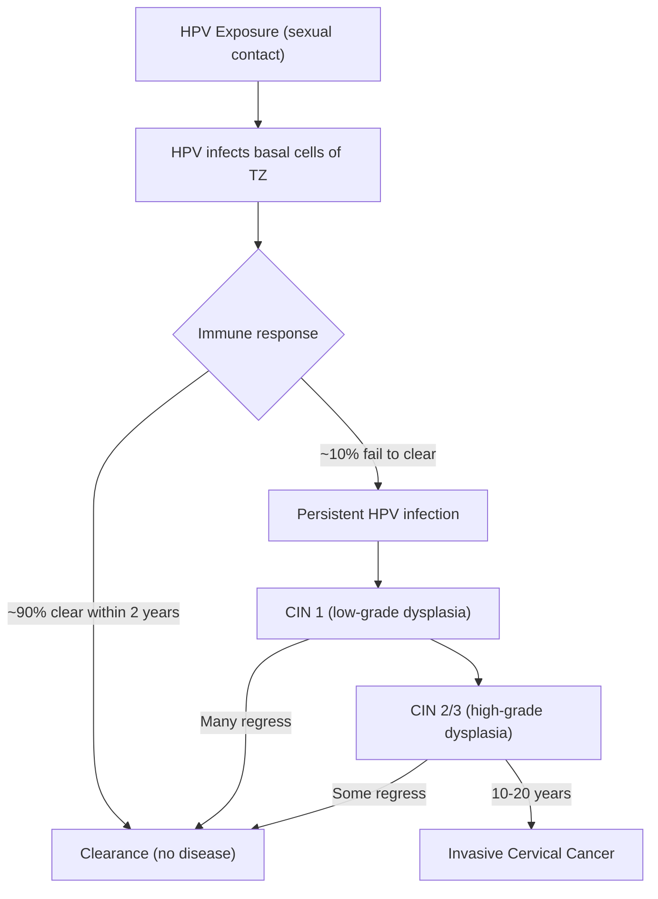

# Cervical Cancer

## 1. Definition

Cervical cancer is a malignant neoplasm arising from the uterine cervix, most commonly at the **squamocolumnar junction (SCJ)** — the transformation zone where the columnar epithelium of the endocervix meets the squamous epithelium of the ectocervix. This is the area of most active metaplasia and therefore highest vulnerability to oncogenic insults.

- "Cervical" → from Latin *cervix* = "neck" (the cervix is the "neck" of the uterus)
- The vast majority (> 99%) of cervical cancers are causally linked to **persistent infection with high-risk Human Papillomavirus (HPV)**

<Callout title="Core Concept — HPV is Necessary but Not Sufficient">
***Most cervical cancer is due to HPV, but the presence of HPV does not mean you will develop cervical cancer. HPV is NECESSARY, but NOT SUFFICIENT.*** [1][2] This is a critical distinction: HPV infection is extremely common in sexually active individuals, but the vast majority clear it. It is **persistent** infection with high-risk strains, combined with cofactors, that drives malignant transformation.
</Callout>

---

## 2. Epidemiology

### Global
- **4th most common cancer in women worldwide** (~660,000 new cases and ~350,000 deaths annually, GLOBOCAN 2022 estimates)
- Disproportionately affects low- and middle-income countries (LMICs), where screening and vaccination coverage are poor — ~90% of deaths occur in LMICs
- Incidence and mortality have been declining in countries with organised screening (e.g., Pap smear, HPV testing) and HPV vaccination programmes

### Hong Kong Context
- Cervical cancer is the **8th most common cancer in women** in Hong Kong (Hong Kong Cancer Registry data)
- Approximately 500+ new cases per year; ~150–170 deaths per year
- ***Median age of presentation: 55*** [3]
- Hong Kong introduced a government-funded **HPV vaccination programme** for girls in 2019/2020 (targeting girls before sexual debut)
- The **Cervical Screening Programme (CSP)** has been running since 2004, recommending screening for women aged 25–64 who have ever been sexually active
- Despite these efforts, uptake of screening remains suboptimal, particularly among older, lower socio-economic groups and new immigrants

### Age Distribution
- **Bimodal peak**: one peak at 35–39 years, another at 60–64 years
- Pre-invasive disease (CIN) detected earlier (25–35 years), reflecting the long latent period from HPV infection → CIN → invasive cancer (typically 10–20 years)

---

## 3. Anatomy and Function of the Cervix

Understanding cervical anatomy is essential because the cancer arises at a very specific anatomical zone.

### Gross Anatomy
- The **cervix** is the inferior, narrow portion of the uterus, projecting into the upper vagina
- It is approximately 2.5–3 cm long and divided into:
  - **Ectocervix (portio vaginalis)**: the part visible on speculum exam, covered by **stratified squamous epithelium** (same as vagina) — tough, multi-layered, designed to withstand mechanical trauma
  - **Endocervical canal**: the passage from the external os to the internal os, lined by **simple columnar (glandular) epithelium** — single-layered, mucus-secreting
  - **External os**: the opening of the cervix into the vagina
  - **Internal os**: the opening of the cervix into the uterine cavity

### The Transformation Zone (TZ) — The Key Area

This is **the most important anatomical concept in cervical cancer**.

- The **squamocolumnar junction (SCJ)** is where the squamous epithelium of the ectocervix meets the columnar epithelium of the endocervix
- The position of the SCJ is **dynamic** — it changes with age, hormonal status, and parity:
  - **At puberty / during pregnancy / with OCP use**: oestrogen causes the endocervical columnar epithelium to evert (ectropion), exposing it on the ectocervix. This exposed columnar epithelium then undergoes **squamous metaplasia** (replacement by squamous epithelium) — a physiological, protective response
  - **Post-menopausal**: the SCJ recedes into the endocervical canal
- The **transformation zone (TZ)** is the area between the original SCJ and the new (current) SCJ — this is the zone of active squamous metaplasia
- **Why does cancer arise here?** Because actively dividing, metaplastic cells are highly susceptible to HPV infection and oncogenic transformation. HPV infects the basal cells of the epithelium, which are most accessible in the TZ where the epithelium is thin and actively remodelling

### Blood Supply
- **Cervical branch of the uterine artery** (from internal iliac artery)
- Venous drainage to the **uterine venous plexus** → internal iliac veins

### Lymphatic Drainage
- This is **critical for staging and prognosis**:
  - **Primary drainage**: parametrial → obturator → internal iliac → external iliac nodes
  - **Secondary**: common iliac → para-aortic nodes
  - The pattern of lymph node involvement determines FIGO staging

### Nerve Supply
- Sensory innervation from the **inferior hypogastric plexus (S2–S4)**
- The cervix has relatively few pain fibres (which is why early cervical cancer is often painless and biopsies of the ectocervix can be done without anaesthesia)

### Function
- Passage for menstrual blood, sperm, and the fetus during delivery
- Production of cervical mucus (by endocervical glands) — forms a barrier to infection and modulates sperm transport
- Structural support for the uterus (maintained by the cardinal and uterosacral ligaments — involvement of these is key in parametrial invasion/staging)

---

## 4. Risk Factors

The risk factors for cervical cancer can be logically divided into two categories [1][2][4]:

### A. Factors that Increase HPV Acquisition (exposure to HPV)

| Risk Factor | Mechanism |
|---|---|
| ***Human Papillomavirus (HPV) infection*** | The **necessary cause** — virtually all cervical cancers are HPV-driven. High-risk types (HPV 16, 18, 31, 33, 45, 52, 58) are oncogenic |
| ***Early onset of sexual activity*** | Adolescent cervix has a large, exposed transformation zone with active metaplasia — these immature metaplastic cells are highly susceptible to HPV infection |
| ***Multiple sexual partners*** | Greater cumulative exposure to HPV; male partner's sexual history is also relevant |
| ***Oral contraceptive (OC) pill use*** | Long-term OCP use (> 5 years) is an independent cofactor: (1) may promote cervical ectropion, exposing more columnar epithelium to HPV; (2) hormonal effects may enhance HPV gene expression; (3) may also reflect less barrier contraception use |
| High-risk male partner | A male partner with many previous sexual partners carries higher HPV load |

### B. Factors that Impair HPV Clearance (persistence of HPV)

| Risk Factor | Mechanism |
|---|---|
| ***Immunosuppression*** | HIV/AIDS, post-transplant immunosuppression, chronic steroid use → impaired cell-mediated immunity → failure to clear HPV → persistent infection → higher risk and faster progression to cancer |
| ***Smoking*** | Tobacco carcinogens (nicotine, cotinine) concentrate in cervical mucus → direct mutagenic effect on cervical epithelium; also impairs local immune response (reduces Langerhans cells in cervical epithelium) |
| ***Lower socio-economic class*** | Reduced access to screening, vaccination, healthcare; possibly higher rates of smoking, poor nutrition, and co-infections |

### C. Other Factors
- **Non-use of barrier contraception** (condoms reduce but do not eliminate HPV transmission — HPV can infect skin not covered by condoms)
- **High parity** (≥ 5 full-term pregnancies) — possibly due to repeated cervical trauma and hormonal changes during pregnancy maintaining the ectropion
- **Co-infection with other STIs** (e.g., Chlamydia trachomatis, HSV-2) — may cause chronic cervical inflammation, facilitating HPV persistence
- **Nutritional deficiencies** (folate, vitamin C) — may impair epithelial integrity and immune function

<Callout title="Exam Framework for Risk Factors" type="idea">
***Think of it in two buckets:***
1. ***Anything that leads you to catching HPV will increase risk*** (early sex, multiple partners, OC pills)
2. ***Anything that lowers your immunity, preventing you from clearing HPV, will increase risk*** (smoking, lower socio-economic class, immunosuppression) [1][2]
</Callout>

---

## 5. Etiology and Pathophysiology

### 5.1 HPV Biology — The Central Cause

***HPV is very common — basically if you have ever been sexually active, you have likely been exposed.*** [1][2]

- **Human Papillomavirus (HPV)** is a small, non-enveloped, double-stranded DNA virus of the *Papillomaviridae* family
- > 200 HPV genotypes exist; ~40 infect the anogenital tract
- Classified by oncogenic potential:
  - **High-risk (oncogenic)**: HPV 16, 18, 31, 33, 45, 52, 58 (HPV 16 and 18 account for ~70% of all cervical cancers globally; in HK, HPV 52 and 58 are also particularly prevalent)
  - **Low-risk (non-oncogenic)**: HPV 6, 11 (cause genital warts/condylomata, not cancer)

### 5.2 Natural History of HPV Infection

Key points:
- ***The majority of people will clear HPV — the problem comes for those who are unable to clear HPV, causing persistent HPV*** [1][2]
- The progression from HPV infection → CIN → invasive cancer typically takes **10–20 years** (this long window is what makes screening so effective)
- Not all CIN progresses: CIN 1 regresses spontaneously in ~60%; CIN 2 regresses in ~40%; CIN 3 has ~1% per year risk of progressing to invasive cancer if untreated

### 5.3 Molecular Pathophysiology — How HPV Causes Cancer

HPV infects the **basal cells** of the cervical epithelium (accessed through micro-abrasions, especially in the thin, metaplastic TZ epithelium).

The two key viral oncoproteins are:

#### **E6 Oncoprotein** (targets p53)
- E6 binds to p53 (a tumour suppressor — the "guardian of the genome") via the E6AP ubiquitin ligase complex
- This targets p53 for **ubiquitin-mediated proteasomal degradation**
- Result: loss of p53 function → **loss of apoptosis** (damaged cells survive instead of dying) → **loss of cell cycle arrest** at G1/S checkpoint → accumulation of DNA mutations

#### **E7 Oncoprotein** (targets pRb)
- E7 binds to and inactivates **retinoblastoma protein (pRb)**
- pRb normally sequesters E2F transcription factor, preventing cell cycle progression
- When pRb is inactivated → E2F is released → **uncontrolled cell proliferation** (cells enter S phase without proper checkpoints)
- E7 also inactivates p21 and p27 (CDK inhibitors), further driving cell cycle

#### **Integration of HPV DNA into host genome**
- In persistent infection, HPV DNA may **integrate** into the host cell genome
- This disrupts the viral E2 gene (which normally represses E6/E7 expression)
- Loss of E2 → **uncontrolled, constitutive overexpression of E6 and E7** → accelerated oncogenesis
- HPV integration is a hallmark of progression from pre-invasive to invasive disease

#### **Additional mechanisms**:
- HPV E5 protein: enhances EGFR signalling, promotes immune evasion
- HPV evades immune detection by downregulating MHC class I expression, reducing antigen presentation
- Genomic instability accumulates over time → acquisition of further somatic mutations → invasive cancer

<Callout title="The Two-Hit Model of HPV Oncogenesis">
Think of it simply:
- **E6 knocks out p53** → cells can't die (loss of apoptosis)
- **E7 knocks out Rb** → cells can't stop dividing (loss of cell cycle control)
- Together: cells that should die don't, and cells that should stop dividing don't → uncontrolled proliferation with accumulated mutations → cancer
</Callout>

### 5.4 HPV Vaccination — Why It Still Works Even After Sexual Debut

***The HPV vaccination still works even if you have had sexual intercourse — although you cannot remove HPV from already-infected cells, it ensures that the new generations of cells cannot be infected. Then it relies on your body to shed off those infected cells with time, ensuring that you are protected for any future sexual encounter.*** [1][2]

- Current vaccines in use (as of 2025):
  - **Gardasil 9 (9-valent)**: HPV 6, 11, 16, 18, 31, 33, 45, 52, 58 — covers ~90% of cervical cancers
  - Works by generating neutralising antibodies against L1 capsid protein (virus-like particles, VLPs — contain no viral DNA, so cannot cause infection)
- In Hong Kong, the government programme vaccinates girls (and increasingly boys) before sexual debut, but "catch-up" vaccination is recommended up to age 26 (and can be given up to 45 in some guidelines)

### 5.5 Why the Transformation Zone?

To reiterate: the TZ is where active squamous metaplasia occurs. The basal cells here are:
1. Actively dividing (higher mitotic rate = more opportunities for HPV to insert itself)
2. More accessible (thinner epithelium, micro-abrasions during intercourse)
3. Expressing receptors that HPV exploits for entry (heparan sulfate proteoglycans, α6-integrin)

This is why almost all cervical cancers originate in the TZ.

---

## 6. Classification

### 6.1 Histological Classification (WHO 2020)

| Type | Frequency | Key Features | HPV Association |
|---|---|---|---|
| **Squamous Cell Carcinoma (SCC)** | **~70–75%** | Arises from squamous epithelium of ectocervix/TZ; preceded by CIN (squamous intraepithelial lesion); subtypes: keratinising, non-keratinising, basaloid, verrucous | Almost all HPV-related (HPV 16 most common) |
| **Adenocarcinoma** | **~20–25%** (increasing) | Arises from glandular (columnar) epithelium of endocervix; preceded by AIS (adenocarcinoma in situ); harder to detect on Pap smear (endocervical location) | Majority HPV-related (HPV 18, 45 most common); but a small subset (~10-15% of adenocarcinomas) are HPV-independent |
| **Adenosquamous carcinoma** | ~3–5% | Mixed glandular and squamous differentiation | HPV-related |
| **Neuroendocrine / Small cell carcinoma** | ~1–2% | Very aggressive, high-grade; similar to small cell lung cancer | HPV-related |
| **Other rare types** | < 1% | Clear cell (associated with in-utero DES exposure — now very rare), serous, undifferentiated | Variable |

<Callout title="Clinical Pearl — Rising Adenocarcinoma">
The proportion of adenocarcinoma is increasing, likely because:
1. Screening (Pap smear) is better at detecting squamous lesions at the ectocervix than glandular lesions hidden in the endocervical canal
2. Successful screening has reduced SCC incidence, so the relative proportion of adenocarcinoma rises
3. HPV testing may help address this gap, as it can detect oncogenic HPV regardless of lesion location
</Callout>

### 6.2 WHO 2020 — HPV-Associated vs. HPV-Independent Classification

This is a newer, clinically important classification:

- **HPV-associated cervical carcinomas** (~85–90%): driven by HPV; express p16 (a surrogate marker for HPV E7-mediated Rb pathway disruption — paradoxically, p16 is *overexpressed* because loss of Rb removes negative feedback on p16); better prognosis
- **HPV-independent cervical carcinomas** (~10–15%): typically adenocarcinomas (gastric-type, clear cell, mesonephric); p16 negative; TP53 mutations common; generally worse prognosis; not preventable by HPV vaccination

### 6.3 Pre-invasive Disease — Cervical Intraepithelial Neoplasia (CIN)

Pre-invasive lesions are classified as:

| Terminology | Histological Equivalent | Bethesda (Cytology) | Natural History |
|---|---|---|---|
| **CIN 1** | Dysplasia confined to lower 1/3 of epithelium | LSIL (Low-grade Squamous Intraepithelial Lesion) | ~60% regress spontaneously; ~10% progress to CIN 3 |
| **CIN 2** | Dysplasia in lower 2/3 of epithelium | HSIL (High-grade Squamous Intraepithelial Lesion) | ~40% regress; ~20% progress to CIN 3 |
| **CIN 3 / Carcinoma in situ** | Full-thickness dysplasia (but basement membrane intact — NOT yet invasive) | HSIL | ~1% per year progress to invasive cancer if untreated |
| **AIS** | Adenocarcinoma in situ — glandular equivalent of CIN 3 | AGC / AIS | Precursor of invasive adenocarcinoma |

The key distinction: **CIN/AIS = pre-invasive** (basement membrane intact); **invasive cancer = basement membrane breached** (can now invade stroma, lymphatics, blood vessels).

### 6.4 FIGO Staging (2018 Revision)

Cervical cancer is one of the few cancers that is **clinically staged** by FIGO, although the 2018 revision now allows incorporation of imaging and pathological findings.

| Stage | Description |
|---|---|
| **IA** | Microscopic invasion only (diagnosed by microscopy); IA1: stromal invasion ≤ 3mm depth; IA2: invasion > 3mm but ≤ 5mm depth |
| **IB** | Clinically visible or microscopic lesion > stage IA; IB1: ≤ 2cm; IB2: > 2cm but ≤ 4cm; IB3: > 4cm |
| **IIA** | Extends beyond cervix to upper 2/3 vagina, no parametrial involvement; IIA1: ≤ 4cm; IIA2: > 4cm |
| **IIB** | **Parametrial involvement** (cardinal/uterosacral ligaments invaded — this is a critical cutoff; parametrial involvement precludes primary surgery in most protocols) |
| **IIIA** | Extends to lower 1/3 vagina |
| **IIIB** | Extends to pelvic sidewall AND/OR causes hydronephrosis/non-functioning kidney |
| **IIIC** | Pelvic (IIIC1) or para-aortic (IIIC2) lymph node involvement (new in 2018 — now allows imaging/pathology to upstage) |
| **IVA** | Invasion of bladder or rectal mucosa (confirmed by biopsy) |
| **IVB** | Distant metastasis (lung, liver, bone, supraclavicular nodes) |

<Callout title="Key Staging Points for Exams">
- **Stage IIB** (parametrial involvement) is the critical watershed: stages ≤ IIA are generally treated with primary surgery ± radiotherapy; stages ≥ IIB are primarily treated with concurrent chemoradiotherapy (CCRT)
- **Stage IIIB** includes hydronephrosis — always check renal function and imaging in cervical cancer
- The 2018 FIGO revision is significant because it now allows imaging (MRI, CT, PET-CT) and surgical/pathological findings (e.g., lymph node status) to be incorporated into staging
</Callout>

---

## 7. Clinical Features

### 7.1 Symptoms

The presentation depends heavily on stage. ***Early disease — not much*** [3]. This is because early/pre-invasive disease is confined to the epithelium, which has no blood vessels or nerves of its own.

#### A. Early Disease

| Symptom | Pathophysiological Basis |
|---|---|
| **Asymptomatic** (most common in early stage) | CIN and microinvasive cancer are confined to the epithelium/superficial stroma — no nerves stimulated, no significant vessels disrupted. This is why **screening** is so crucial |
| ***Postcoital bleeding (PCB)*** — **the classic symptom** [3] | The tumour at the TZ is friable (fragile, neovascular tissue with abnormal blood vessels). Mechanical trauma during intercourse disrupts these fragile vessels → bleeding. PCB is often the earliest symptom of invasive cervical cancer |
| **Intermenstrual bleeding (IMB)** | Same mechanism — friable tumour surface bleeds spontaneously between periods |
| **Postmenopausal bleeding (PMB)** | In postmenopausal women, any bleeding is abnormal and must be investigated; cervical cancer is one cause |
| **Abnormal vaginal discharge** | Tumour necrosis and secondary infection produce a watery, blood-stained, or foul-smelling discharge. The necrotic tumour surface is colonised by bacteria, producing a characteristic offensive odour |

<Callout title="High Yield — Postcoital Bleeding" type="idea">
***Postcoital bleeding is the hallmark symptom of cervical cancer.*** [3] While most PCB is caused by benign conditions (cervical ectropion, polyps, cervicitis), it must always be investigated with speculum examination and cervical assessment. In a woman with risk factors, PCB = cervical cancer until proven otherwise.
</Callout>

#### B. Late / Advanced Disease

| Symptom | Pathophysiological Basis |
|---|---|
| ***Back pain*** [3] | Tumour invades the parametrium, pelvic sidewall, or metastasises to para-aortic lymph nodes → compression/invasion of lumbosacral nerve plexus or vertebral metastases |
| ***Leg oedema*** (unilateral or bilateral) [3] | Tumour or enlarged lymph nodes compress or invade the iliac veins or lymphatics → obstructed venous/lymphatic return from the lower limb → oedema. Unilateral leg swelling in a woman with cervical cancer = think pelvic sidewall disease |
| **Loin pain / renal failure** | Tumour grows laterally into parametrium → compresses or invades the ureters (which run through the cardinal ligament, very close to the cervix — "water under the bridge") → hydronephrosis → renal failure. This is common and can be the presenting feature |
| **Haematuria** | Stage IVA — tumour invades the bladder mucosa |
| **Rectal bleeding / tenesmus** | Stage IVA — tumour invades the rectal mucosa |
| **Pelvic pain** | Invasion of nerves within the parametrium, obturator nerve, or sacral plexus |
| **Urinary symptoms** (frequency, urgency) | Tumour compresses or invades the bladder base; or vesicovaginal fistula forms |
| **Fistulae** (vesicovaginal, rectovaginal) | Advanced tumour erodes through into bladder or rectum — devastating complication causing continuous urinary or faecal incontinence; can also result from radiation therapy |
| **Constitutional symptoms** (weight loss, fatigue, anorexia) | Advanced/metastatic disease — cancer cachexia from systemic inflammatory mediators (TNF-α, IL-6) |
| **Leg DVT / PE** | Hypercoagulability of malignancy (Trousseau syndrome) + venous compression by tumour/lymphadenopathy |

### 7.2 Signs

#### A. On General Examination

| Sign | Pathophysiological Basis |
|---|---|
| **Pallor / anaemia** | Chronic vaginal bleeding → iron deficiency anaemia |
| **Cachexia / weight loss** | Advanced disease, cancer cachexia |
| **Unilateral leg oedema** | Lymphatic/venous obstruction by pelvic tumour or nodal disease |
| **Supraclavicular lymphadenopathy** (Virchow's node — left) | Distant lymphatic metastasis via the thoracic duct — indicates Stage IVB |
| **Inguinal lymphadenopathy** | Spread to inguinal nodes (less common; more typical if lower vagina involved) |

#### B. On Speculum Examination

| Sign | Pathophysiological Basis |
|---|---|
| **Visible cervical mass** | Exophytic (cauliflower-like, protruding into vagina) or endophytic (barrel-shaped, expanding the cervix from within) or ulcerative (necrotic crater) growth at the cervix |
| **Friable, contact bleeding** | Tumour neovascularity — vessels are structurally abnormal and bleed easily on touch |
| **Necrotic, foul-smelling tissue** | Central tumour necrosis (outgrows its blood supply) with secondary bacterial infection |
| **Normal-appearing cervix** (in early/microinvasive disease or endocervical tumours) | The tumour may be too small to see, or may be hidden within the endocervical canal — emphasises the importance of cytology/HPV testing |

#### C. On Bimanual / Rectovaginal Examination

| Sign | Pathophysiological Basis |
|---|---|
| **Enlarged, irregular, hard cervix** | Tumour mass replacing normal cervical tissue |
| **Parametrial thickening / nodularity** | Tumour invasion of the cardinal and uterosacral ligaments — assessed by rectovaginal exam (critical for staging; "frozen pelvis" = completely fixed, bilateral parametrial involvement) |
| **Fixed uterus / loss of mobility** | Tumour has infiltrated surrounding structures, tethering the uterus |
| **Pelvic sidewall fixation** | Stage IIIB — tumour extends to the bony pelvis, causing complete fixation |
| **Rectovaginal septum involvement** | Tumour invading posteriorly — best assessed by rectal examination |

<Callout title="Clinical Approach — Always Do a Speculum" type="error">
A common mistake is failing to perform a speculum examination in a woman with abnormal vaginal bleeding. **Every woman with postcoital, intermenstrual, or postmenopausal bleeding needs a speculum exam to visualise the cervix.** You cannot diagnose cervical cancer without looking at the cervix. A Pap smear alone is NOT sufficient to rule out cervical cancer if there is a visible lesion — if you see a suspicious lesion, BIOPSY it directly.
</Callout>

---

## 8. Pathophysiology of Clinical Features — Connecting the Dots

Let's tie together why each symptom/sign occurs, from the underlying biology:

### Early Disease Pathway
1. HPV infects TZ basal cells → E6/E7 → CIN 1 → CIN 2/3 → microinvasive cancer
2. At this point, the disease is **epithelial** or minimally stromal — no symptoms
3. As the tumour grows and develops its own blood supply (angiogenesis driven by VEGF), the abnormal vessels are fragile → **postcoital bleeding** (first symptom)
4. Tumour necrosis begins → **discharge**

### Advanced Disease Pathway
1. Tumour invades deeper into cervical stroma → **parametrium** (cardinal and uterosacral ligaments) → Stage IIB
2. Parametrial invasion compresses **ureters** ("water under the bridge" — ureter crosses under the uterine artery at the level of the cervix) → **hydronephrosis** → renal impairment → Stage IIIB
3. Lateral extension to **pelvic sidewall** → compresses **iliac vessels** (venous oedema) and **sacral/obturator nerves** (pain, neuropathy) → **leg oedema and back/pelvic pain**
4. Anterior invasion into **bladder** → **haematuria, fistula** → Stage IVA
5. Posterior invasion into **rectum** → **rectal bleeding, fistula** → Stage IVA
6. **Lymphatic spread**: parametrial → obturator → internal/external iliac → common iliac → para-aortic → mediastinal → supraclavicular
7. **Haematogenous spread** (less common, late): lung > liver > bone

---

## 9. Relevant Etiology — Focus on Hong Kong

### HPV Genotype Distribution in Hong Kong
- While globally HPV 16 and 18 dominate, in Hong Kong and East Asia, **HPV 52 and 58** are more prevalent than in Western populations
- This is clinically significant because the older bivalent (Cervarix) and quadrivalent (Gardasil) vaccines did not cover HPV 52/58; the **9-valent Gardasil 9** does cover these and is therefore preferred in Hong Kong

### Screening in Hong Kong
- The **Cervical Screening Programme (CSP)** recommends:
  - Women aged **25–64** who have ever been sexually active
  - First Pap smear, repeat at 1 year, then every 3 years if normal
  - From 2024, Hong Kong has been transitioning to **primary HPV testing** as the recommended screening modality (in line with WHO 2021 guidelines), with cytology as triage for HPV-positive results
- HPV self-sampling is being explored to improve screening uptake among hard-to-reach populations

### Cervical Cancer Prevention in Hong Kong
1. **Primary prevention**: HPV vaccination (Gardasil 9) — government-funded for schoolgirls; recommended for boys as well
2. **Secondary prevention**: Cervical screening (Pap smear / HPV testing) — early detection of CIN, treatment before progression to cancer
3. ***Could it be prevented? Yes → vaccination*** [4] — but for those already infected, screening remains essential

---

<Callout title="High Yield Summary">

**Definition**: Malignant neoplasm of the cervix, arising at the transformation zone (SCJ), causally linked to persistent high-risk HPV infection.

**Epidemiology**: 4th most common female cancer globally; median age 55 in HK; declining with screening and vaccination.

**Risk Factors — Two Buckets**:
1. ***HPV acquisition***: HPV infection, early sex, multiple partners, OCP use
2. ***Impaired HPV clearance***: smoking, immunosuppression, low socioeconomic status
- ***HPV is NECESSARY but NOT SUFFICIENT***

**Key Pathophysiology**: HPV E6 degrades p53 (loss of apoptosis); E7 inactivates Rb (uncontrolled proliferation). HPV integration → constitutive E6/E7 expression → CIN → invasive cancer over 10–20 years.

**Histology**: SCC (~70–75%) > Adenocarcinoma (~20–25%) > Others. Adenocarcinoma rising in proportion.

**Classification**: CIN 1/2/3 → invasive. FIGO staging 2018 (incorporates imaging/pathology). Stage IIB (parametrial involvement) = watershed for treatment.

**Clinical Features**:
- ***Early: asymptomatic or postcoital bleeding***
- ***Late: back pain, leg oedema***, hydronephrosis, fistulae, constitutional symptoms
- Always perform speculum examination in abnormal vaginal bleeding

**HPV Vaccination**: Works even after sexual debut (protects new cells; body sheds infected cells over time). Gardasil 9 preferred in HK (covers HPV 52, 58).

</Callout>

---

<ActiveRecallQuiz
  title="Active Recall — Cervical Cancer: Definition, Epidemiology, Risk Factors, Etiology, Pathophysiology, Classification and Clinical Features"
  items={[
    {
      question: "What are the two key HPV oncoproteins and their respective tumour suppressor targets? Explain the downstream effect of each.",
      markscheme: "E6 targets p53 via ubiquitin-mediated degradation leading to loss of apoptosis and cell cycle arrest. E7 inactivates Rb (retinoblastoma protein) releasing E2F leading to uncontrolled cell cycle progression and proliferation. Together they cause immortalisation and genomic instability.",
    },
    {
      question: "Why does cervical cancer arise at the transformation zone? Explain the anatomical and cellular basis.",
      markscheme: "The TZ is where squamous metaplasia actively occurs, with actively dividing basal cells that are: (1) highly susceptible to HPV infection, (2) more accessible due to thin epithelium and micro-abrasions, (3) express HPV entry receptors. Active cell division provides more opportunities for viral integration and oncogenesis.",
    },
    {
      question: "Classify the risk factors for cervical cancer into two logical groups and give at least two examples for each.",
      markscheme: "Group 1 - Factors increasing HPV acquisition: early sex, multiple partners, OCP use. Group 2 - Factors impairing HPV clearance: smoking (carcinogens in cervical mucus plus reduced Langerhans cells), immunosuppression (HIV, transplant), lower socioeconomic class. HPV is necessary but not sufficient.",
    },
    {
      question: "A 60-year-old woman with cervical cancer presents with unilateral leg oedema and back pain. What stage is this likely to be and explain the pathophysiological basis of each symptom.",
      markscheme: "Likely Stage IIIB or above. Leg oedema: tumour or lymphadenopathy compresses iliac veins or lymphatics causing obstructed venous and lymphatic return. Back pain: tumour invades parametrium and pelvic sidewall compressing lumbosacral nerve plexus, or para-aortic nodal involvement, or vertebral metastases.",
    },
    {
      question: "Why does HPV vaccination still work even if the patient has already been sexually active and potentially exposed to HPV?",
      markscheme: "Vaccination cannot remove HPV from already-infected cells, but it generates neutralising antibodies that prevent new generations of cells from being infected. The body then sheds already-infected cells over time through natural epithelial turnover, ensuring protection for future sexual encounters.",
    },
    {
      question: "What is the most important presenting symptom of cervical cancer and why does it occur? What key examination must always be performed?",
      markscheme: "Postcoital bleeding (PCB). Occurs because the tumour at the transformation zone is friable with abnormal neovascularisation; mechanical trauma during intercourse disrupts fragile tumour vessels causing bleeding. A speculum examination must always be performed to visualise the cervix in any woman with abnormal vaginal bleeding.",
    },
  ]}
/>

---

## References

[1] Lecture slides: Block C - Abnormal vaginal bleeding_ gynaecological cancer.pdf (p17)
[2] Lecture slides: Block C - O&G Theme Case 2.docx.pdf (p8)
[3] Lecture slides: GC 112. Abnormal vaginal bleeding Gynaecological cancer.pdf (p11, slides 21–22)
[4] Lecture slides: Block C - O&G Theme Case 2.docx.pdf (p8, Q6)
