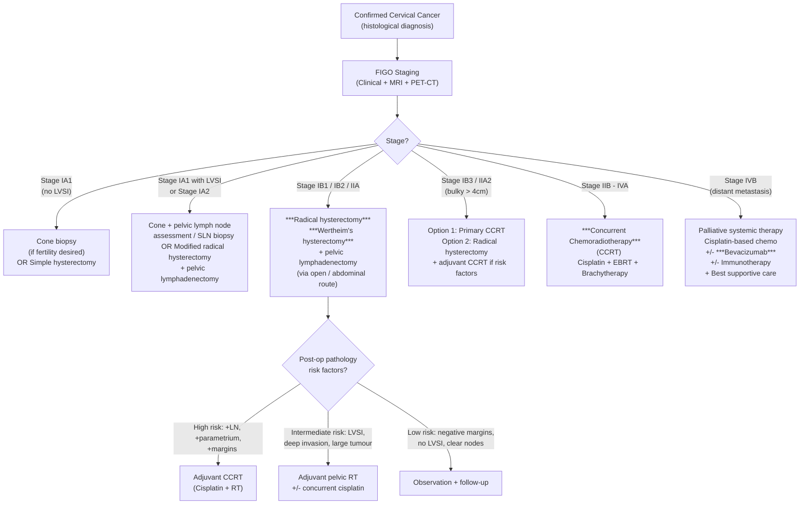

## Management of Cervical Cancer — Algorithm, Treatment Modalities, Indications and Contraindications

### Guiding Principles

Before we get into the specifics, let's establish the overarching logic of cervical cancer management. Every treatment decision flows from **one central question**: how far has the cancer spread?

***Treatment modalities in cancer: Surgery, Radiotherapy, Chemotherapy, Targeted therapy / immunotherapy*** [13]

The management of cervical cancer is then dictated by **stage**, which determines the feasibility of each modality:

***For cervical cancer*** [13][14]:
- ***Surgery — for early disease (e.g., Stage 1)***
- ***Radiotherapy — for early disease if surgery not suitable; for late disease (Stage 2 or above)***
- ***Chemotherapy — in combination with radiotherapy (chemo-irradiation)***
- ***For recurrence — targeted therapy: Bevacizumab, used in combination with chemo***

***Surgery only suitable for early disease (Stage 1 disease). Beyond cervix, or tumour size beyond 4cm, cannot do surgery → will choose radiotherapy.*** [14]

<Callout title="The Stage IIB Watershed — The Single Most Important Concept">
Stage IIB (parametrial invasion) is the critical dividing line:
- **≤ Stage IIA** → Primary **surgery** is the preferred approach (curative resection possible)
- **≥ Stage IIB** → Primary **concurrent chemoradiotherapy (CCRT)** is standard (surgery cannot achieve clear margins when parametrium is involved, and dual modality — surgery + radiotherapy — increases morbidity without improving survival)

This is why MRI assessment of parametrial invasion is so pivotal to management.
</Callout>

---

### A. Management Algorithm — Overview by Stage

---

### B. Detailed Treatment Modalities

---

#### B1. Surgery

Surgery is the **preferred modality for early-stage cervical cancer** because it allows:
1. ***Preservation of ovarian function*** — ***ovaries are not removed, since ovarian spread in usual type of HPV-associated cervical cancer is rare*** [14][15]
2. ***Avoidance of long-term morbidities of radiotherapy*** — ***since surgery is curative for early disease, do not require adjuvant radiotherapy*** [14][15]
3. Complete pathological assessment (lymph node status, margins, LVSI, depth of invasion)

##### Types of Surgery by Stage

| Stage | Surgical Procedure | What's Removed | Rationale |
|---|---|---|---|
| **IA1 (no LVSI)** | ***Cone biopsy*** (if fertility desired) or ***Simple (extrafascial) hysterectomy*** [14][15] | Cone: cone-shaped portion of cervix including TZ. Simple hysterectomy: uterus + cervix only (no parametrium, no vaginal cuff, no nodes) | ***Very very early (microscopic < 3mm deep)*** [15] — risk of LN metastasis < 1%, risk of parametrial involvement < 1% → radical surgery is unnecessary. Cone biopsy is sufficient if margins clear and no LVSI, allowing future fertility |
| **IA1 (with LVSI) / IA2** | Cone + pelvic lymph node assessment (SLN biopsy or full lymphadenectomy) OR Modified radical hysterectomy (Type B) + pelvic lymphadenectomy | Uterus + cervix + medial parametrium + pelvic LN | LVSI increases LN metastasis risk to ~5–8%; IA2 has ~5% LN risk. Need to assess nodes. Modified radical approach removes limited parametrium |
| **IB1 / IB2 / IIA1** | ***Wertheim's hysterectomy (radical hysterectomy + systematic pelvic lymphadenectomy)*** [14][15] | ***Uterus, upper vagina, parametria, and pelvic lymph nodes*** [15] | ***What makes a hysterectomy radical? → simple hysterectomy + removal of upper vagina, parametria and pelvic lymph nodes*** [14]. The parametrium must be removed because the risk of microscopic parametrial involvement is significant at this stage. Pelvic lymphadenectomy provides staging and therapeutic benefit |
| **IB3 / IIA2 (bulky ≥ 4cm)** | Radical hysterectomy possible but often followed by adjuvant CCRT → "double treatment" with increased morbidity. Many centres prefer **primary CCRT** for bulky tumours | — | Bulky tumours have higher rates of positive margins and LN metastasis at surgery → high likelihood of needing adjuvant radiotherapy anyway → better to avoid surgery + RT combination |
| **Fertility-sparing surgery** | **Radical trachelectomy** + pelvic lymphadenectomy ± cerclage | Removes cervix + parametrium but **preserves the uterine body** | For young women with Stage IA2–IB1 (≤ 2cm) who desire future fertility. The uterine body is preserved and a cerclage is placed to support future pregnancies. Must have negative nodes and negative margins. Pregnancy outcomes are reasonable but higher risk of preterm delivery |

##### Route of Surgery — An Important Update

***Trans-abdominal route / open surgery*** [14]

***It used to be via robot, so we are evolving backwards, WHY? → There was a very large multi-centred randomised trial comparing open route vs. laparoscopic / robotic route for hysterectomy — results showed laparoscopic / robotic surgery have worse outcomes*** [14]

This refers to the **LACC Trial (Ramirez et al., NEJM 2018)** — a landmark study that changed practice globally:

- Compared open radical hysterectomy vs. minimally invasive (laparoscopic/robotic) radical hysterectomy for early cervical cancer
- Found that minimally invasive surgery had **worse disease-free survival (DFS)** and **worse overall survival (OS)**
- The difference was striking and unexpected

***Postulation is that after the uterus is removed, it has to be removed out of the small ports, so it will touch the abdominal cavity → along with high pressure gas in laparoscopic surgery, this will spread the tumour cells all over the abdomen (has not been proven yet)*** [14]

- Another theory: the use of a uterine manipulator during laparoscopy may push tumour cells into the peritoneal cavity or through the uterine vessels
- **Current standard**: open abdominal radical hysterectomy is the recommended route for cervical cancer

<Callout title="LACC Trial — Exam Favourite" type="idea">
If asked "why is open surgery preferred over laparoscopic/robotic for cervical cancer?", reference the LACC Trial: minimally invasive radical hysterectomy showed worse oncological outcomes (inferior DFS and OS). Possible explanations include tumour spillage during specimen extraction through small ports, CO2 pneumoperitoneum dispersing tumour cells, and uterine manipulator use.
</Callout>

##### Complications of Radical Hysterectomy

| Complication | Mechanism |
|---|---|
| **Ureteric injury / fistula** | Ureter runs through the cardinal ligament ("water under the bridge") — at risk during parametrial dissection |
| **Bladder dysfunction** (neurogenic bladder) | Parasympathetic nerve fibres (S2–S4) to the bladder run through the cardinal and uterosacral ligaments — may be damaged during radical dissection → urinary retention, overflow incontinence |
| **Lymphoedema** (lower limbs) | Pelvic lymphadenectomy disrupts lymphatic drainage |
| **Lymphocyst** | Lymphatic fluid accumulates in the retroperitoneal space after lymphadenectomy |
| **Haemorrhage** | Injury to internal iliac vessels or branches |
| **DVT / PE** | Pelvic surgery + malignancy = high thrombotic risk |
| **Sexual dysfunction** | Vaginal shortening (upper vaginal cuff removed); nerve injury |

---

#### B2. Radiotherapy

Radiotherapy is the backbone of treatment for **locally advanced cervical cancer (Stage IIB and beyond)** and serves as an alternative to surgery for early disease if surgery is contraindicated.

***Radiotherapy — for early disease if surgery not suitable; for late disease (Stage 2 or above)*** [13]

##### Types of Radiotherapy

| Type | Description | Role in Cervical Cancer |
|---|---|---|
| **External Beam Radiotherapy (EBRT)** | High-energy X-rays delivered from outside the body to the pelvis (and para-aortic region if nodes involved). Typically 45–50.4 Gy in 25–28 fractions over 5–6 weeks | Treats the primary tumour, parametrium, pelvic sidewall, and regional lymph nodes. The "wide field" approach covering the entire pelvis |
| **Brachytherapy** ("brachy" = short/close) | Radioactive source placed **directly inside** the uterine cavity and vaginal fornices (intracavitary) or within the tumour itself (interstitial). Delivers very high dose to the tumour with rapid dose fall-off to spare adjacent normal tissues | Essential component — delivers the "boost" dose to the cervix/tumour. Without brachytherapy, local control rates are significantly inferior. The combination of EBRT + brachytherapy is standard |

##### Why Brachytherapy Is Essential

The cervix is ideally suited for brachytherapy because:
1. It is a hollow organ — you can insert applicators directly into the uterine canal and vaginal fornices
2. The inverse square law means radiation dose drops off rapidly with distance — so the bladder and rectum (which are close by) receive relatively low doses compared to the tumour
3. Studies consistently show that brachytherapy improves local control and overall survival compared to EBRT alone

##### Indications for Radiotherapy

| Indication | Details |
|---|---|
| **Primary treatment for Stage IIB–IVA** | CCRT (cisplatin + EBRT + brachytherapy) is standard |
| **Alternative to surgery for Stage IB–IIA** | If patient is medically unfit for surgery (comorbidities, advanced age), or declines surgery. Cure rates are equivalent to surgery for early-stage disease |
| **Adjuvant after surgery** | If high-risk features found on post-operative pathology (see below) |
| **Palliative** | Symptom control in Stage IVB (pain, bleeding, obstruction) |

##### Side Effects of Radiotherapy

| Acute (during / shortly after treatment) | Late (months to years later) | Mechanism |
|---|---|---|
| Radiation cystitis (frequency, dysuria, haematuria) | Radiation fibrosis of bladder → contracted bladder, chronic haematuria | Radiation damages rapidly dividing urothelium (acute) → then causes vascular damage and fibrosis (late) |
| Radiation proctitis (diarrhoea, tenesmus, rectal bleeding) | Radiation proctitis (chronic), rectal stricture, fistula | Same principle — rectal mucosa is radiosensitive |
| Radiation enteritis (nausea, diarrhoea) | Small bowel obstruction (adhesions, strictures) | Small bowel loops in the pelvis are irradiated |
| Skin erythema (perineum) | Skin fibrosis | Epithelial damage |
| Fatigue, bone marrow suppression | — | Pelvic bone marrow irradiated |
| Vaginal mucositis | Vaginal stenosis, dryness, dyspareunia | Vaginal epithelial damage → fibrosis. Patients advised to use vaginal dilators post-RT |
| — | Premature ovarian failure | Ovaries are exquisitely radiosensitive; even low doses cause permanent ovarian failure in young women |
| — | Secondary malignancy (rare) | Radiation-induced mutagenesis in surrounding normal tissues |
| — | Vesicovaginal / rectovaginal fistula | Radiation necrosis of tissue between organs |

<Callout title="Long-Term Morbidities of Radiotherapy">
This is precisely why ***surgery is preferred for early disease — it avoids long-term morbidities of radiotherapy*** [14][15]. Radiation-induced complications (fibrosis, fistulae, stenosis, bowel obstruction, premature menopause) can be devastating and lifelong. For early-stage disease where surgery can be curative, avoiding radiation preserves quality of life.
</Callout>

---

#### B3. Chemotherapy

***Chemotherapy — in combination with radiotherapy (chemo-irradiation)*** [13]

Chemotherapy in cervical cancer is used in three main contexts:

##### 1. Concurrent Chemoradiotherapy (CCRT) — The Standard for Locally Advanced Disease

***Sometimes have concept of chemo-irradiation → chemo acts as a radiation sensitiser (low chemo dose, much less side effects)*** [14]

| Aspect | Details |
|---|---|
| **Regimen** | **Weekly cisplatin (40 mg/m²)** given concurrently during EBRT |
| **Mechanism** | Cisplatin is a **radiosensitiser** — it enhances the cytotoxic effect of radiation by: (1) inhibiting DNA repair after radiation-induced damage, (2) generating free radicals that augment radiation-induced oxidative stress, (3) synchronising cells into the radiosensitive G2/M phase of the cell cycle |
| **Dose** | Much lower than systemic chemotherapy doses → "low chemo dose, much less side effects" compared to full-dose chemo |
| **Evidence** | Multiple landmark trials (GOG-120, Rose 1999) demonstrated that CCRT with cisplatin improves OS by ~30–50% compared to radiotherapy alone for locally advanced cervical cancer. This was a paradigm shift |
| **Indication** | Stage IIB–IVA (primary CCRT); adjuvant after surgery with high-risk features |

**Recent update — INTERLACE Trial (2024)**: Addition of **induction chemotherapy** (carboplatin + paclitaxel × 6 cycles) *before* CCRT improves overall survival in locally advanced cervical cancer. This is evolving standard of care.

##### 2. Systemic Chemotherapy — For Recurrent / Metastatic Disease

***With systemic disease which has spread beyond the radiation field, will need further treatment via systemic treatment → chemotherapy, combined with targeted therapy (bevacizumab)*** [14]

| Regimen | Details |
|---|---|
| **First-line** | **Cisplatin + paclitaxel** (or carboplatin + paclitaxel if cisplatin not tolerated) **+ bevacizumab** ± pembrolizumab |
| **Second-line** | Various options: topotecan, gemcitabine, vinorelbine; or immunotherapy (pembrolizumab if PD-L1+) |

##### 3. Neoadjuvant Chemotherapy (NACT) — Limited Role

- Historically used to shrink bulky tumours before surgery
- Current evidence does NOT support NACT followed by surgery as superior to primary CCRT
- Not standard of care; CCRT remains preferred for locally advanced disease

---

#### B4. Targeted Therapy and Immunotherapy

***For recurrence — targeted therapy: Bevacizumab. Used in combination with chemo*** [13]

| Agent | Mechanism | Indication | Key Trial |
|---|---|---|---|
| **Bevacizumab** ("bev-a-CIZ-u-mab") | Monoclonal antibody against **VEGF** (Vascular Endothelial Growth Factor) → inhibits tumour angiogenesis → starves tumour of blood supply | Recurrent / metastatic cervical cancer, combined with cisplatin + paclitaxel | GOG-240: adding bevacizumab to chemotherapy improved OS from 13.3 to 17.0 months |
| **Pembrolizumab** | Anti-**PD-1** immune checkpoint inhibitor → restores T-cell-mediated anti-tumour immunity | Recurrent/metastatic cervical cancer with **PD-L1 positive** tumours (CPS ≥ 1); now also in first-line with chemo + bevacizumab | KEYNOTE-826: adding pembrolizumab to chemo ± bevacizumab improved OS in PD-L1+ cervical cancer |
| **Tisotumab vedotin** | Antibody-drug conjugate targeting **tissue factor (TF)** expressed on cervical cancer cells; delivers cytotoxic payload directly to tumour cells | Second-line recurrent/metastatic cervical cancer | innovaTV 204: significant response rates in previously treated disease |

<Callout title="Evolving Landscape — Immunotherapy in Cervical Cancer">
Pembrolizumab (anti-PD-1) is now part of **first-line treatment** for recurrent/metastatic cervical cancer (KEYNOTE-826). This makes PD-L1 testing (Combined Positive Score, CPS) an important part of the workup for advanced/recurrent disease.

HPV-associated cancers have high mutational burden and neoantigen load, making them good candidates for immune checkpoint inhibitors.
</Callout>

---

#### B5. Adjuvant Therapy After Surgery — When and Why

After radical hysterectomy, the post-operative pathology may reveal features that increase the risk of recurrence. The decision for adjuvant treatment is based on two categories of risk factors:

##### High-Risk Factors (Peters Criteria) — Require Adjuvant **CCRT**

| Factor | Why It's High Risk |
|---|---|
| **Positive lymph nodes** | Indicates tumour has already spread beyond the cervix through lymphatics |
| **Positive surgical margins** | Residual tumour left behind → local recurrence |
| **Parametrial involvement** | Should not be found after surgery (would have been treated with CCRT primarily) but if present → local recurrence risk |

→ Adjuvant treatment: **Concurrent cisplatin + pelvic EBRT** (GOG-109/Intergroup 0107 trial)

##### Intermediate-Risk Factors (Sedlis Criteria) — Consider Adjuvant **Pelvic RT**

These are combinations of factors that together confer increased risk:

| Factor | Why It Matters |
|---|---|
| **LVSI** | Lymphovascular space invasion = tumour cells in lymphatic/blood vessels = micrometastatic potential |
| **Deep stromal invasion** (outer 1/3 of cervix) | Deeper invasion = closer to parametrium and lymphatics |
| **Large tumour size** (> 4cm) | Larger tumour = higher recurrence rate |

→ The **Sedlis criteria** define combinations of these three factors that warrant adjuvant pelvic RT (GOG-92 trial)
→ Adding concurrent cisplatin to RT in intermediate-risk is increasingly practiced (extrapolated from high-risk data)

##### Low-Risk (no adverse features)

→ **Observation and follow-up** only. No adjuvant treatment needed.

---

### C. Management by Stage — Comprehensive Summary Table

| FIGO Stage | Primary Treatment | Notes |
|---|---|---|
| **IA1 (no LVSI)** | ***Cone biopsy*** (fertility desired, margins clear) OR ***Simple hysterectomy*** [15] | LN risk < 1% → no lymphadenectomy needed |
| **IA1 (LVSI+) / IA2** | Cone + SLN / lymphadenectomy OR Modified radical hysterectomy + pelvic LN dissection | LVSI increases LN risk to ~5–8% |
| **IB1 / IB2** | ***Radical hysterectomy (Wertheim's)*** + pelvic lymphadenectomy [15] OR Primary RT/CCRT if unfit for surgery | Surgery preferred (preserves ovarian function, avoids RT morbidity) |
| **IB3 / IIA2 (bulky)** | **Primary CCRT** (preferred) OR Radical hysterectomy + likely adjuvant CCRT | ***Beyond 4cm → cannot do surgery → will choose radiotherapy*** [14]; if surgery done, high probability of needing adjuvant RT → "double treatment" |
| **IIB – IVA** | ***Concurrent chemoradiotherapy (CCRT)***: weekly cisplatin + EBRT + brachytherapy [13][14] | Standard of care since late 1990s; cure rates ~50–65% for Stage IIB–III |
| **IVB (distant mets)** | **Palliative systemic therapy**: cisplatin/carboplatin + paclitaxel + ***bevacizumab*** ± pembrolizumab [13][14] | Goal: prolong survival, maintain quality of life. Palliative RT for symptom control (bleeding, pain) |
| **Recurrence** | Depends on prior treatment and site of recurrence: (1) Central pelvic recurrence after RT → **pelvic exenteration** (radical salvage surgery); (2) Distant recurrence → systemic chemo ± bevacizumab ± immunotherapy | Pelvic exenteration = removal of uterus + vagina + bladder and/or rectum — a morbid but potentially curative operation for isolated central recurrence |

---

### D. Special Scenarios

#### Fertility-Sparing Management

| Stage | Option | Requirements |
|---|---|---|
| IA1 (no LVSI) | Cone biopsy alone | Clear margins, no LVSI, reliable follow-up |
| IA2 / IB1 (≤ 2cm) | **Radical trachelectomy** + pelvic lymphadenectomy | Tumour ≤ 2cm, no LVSI on imaging, negative nodes, squamous or usual-type adenocarcinoma, adequate cervical length remaining |

#### Cervical Cancer in Pregnancy

- Rare but devastating situation
- Management depends on gestational age and stage:
  - **Early stage + advanced gestation**: may delay treatment until fetal viability (> 32–34 weeks) → caesarean delivery → then definitive treatment
  - **Advanced stage + early gestation**: requires discussion about termination to allow definitive treatment
  - Must involve multidisciplinary team (gynaecological oncologist, neonatologist, maternal-fetal medicine)

#### The Elderly / Medically Unfit Patient

- Surgery may be contraindicated due to comorbidities
- **Primary radiotherapy (EBRT + brachytherapy)** achieves equivalent cure rates to surgery for early-stage disease
- Concurrent cisplatin may be omitted if renal function is poor or patient is too frail

---

### E. Prognostic Factors

***Prognostic factors in cervical cancer*** [15]:
- ***Stage*** — the single most important prognostic factor
- ***Lymph node metastasis*** — most powerful predictor within a given stage
- ***Histology*** — adenocarcinoma and neuroendocrine types have worse prognosis than SCC stage-for-stage

Additional prognostic factors:
- Tumour size
- Depth of stromal invasion
- LVSI
- Surgical margins
- HPV status (HPV-independent tumours have worse prognosis)
- Response to treatment (rapid response to CCRT = better outcome)

| Stage | Approximate 5-Year Survival |
|---|---|
| IA | > 95% |
| IB | 80–90% |
| IIA | 70–80% |
| IIB | 60–70% |
| IIIA–IIIB | 30–50% |
| IIIC (node positive) | 40–60% |
| IVA | 15–25% |
| IVB | < 15% |

---

### F. Follow-Up After Treatment

| Aspect | Protocol |
|---|---|
| **Schedule** | Every 3 months for first 2 years, every 6 months for years 3–5, then annually |
| **Assessment** | History (symptoms of recurrence: bleeding, pain, leg oedema), speculum exam, bimanual/rectovaginal exam, vault cytology |
| **Tumour markers** | SCC Ag (for SCC) — rising levels may indicate recurrence before clinical detection |
| **Imaging** | CT/PET-CT as indicated by symptoms or rising markers; not routine in asymptomatic patients (varies by centre) |
| **Surveillance for RT complications** | Renal function (ongoing hydronephrosis?), bladder/bowel symptoms, vaginal health, bone density (premature menopause) |

---

<Callout title="High Yield Summary — Management of Cervical Cancer">

**Core principle**: Stage determines treatment.

**Surgery** (early disease — Stage I):
- IA1 no LVSI: cone biopsy or simple hysterectomy
- IA2 / IB1–IB2: ***Wertheim's radical hysterectomy + pelvic lymphadenectomy*** (open abdominal route — LACC trial)
- Advantages: preserves ovarian function, avoids RT morbidity

**Radiotherapy** (early if unfit; late = standard):
- EBRT + brachytherapy (brachytherapy is essential for adequate local control)
- Side effects: cystitis, proctitis, vaginal stenosis, premature menopause, fistulae

**CCRT** (Stage IIB–IVA):
- ***Weekly cisplatin + EBRT + brachytherapy*** — cisplatin is a radiosensitiser
- ~30–50% survival improvement over RT alone

**Recurrent / Metastatic** (Stage IVB):
- Cisplatin + paclitaxel + ***bevacizumab*** ± pembrolizumab
- Central pelvic recurrence after RT → pelvic exenteration

**Adjuvant after surgery**:
- High risk (positive nodes/margins/parametrium) → CCRT
- Intermediate risk (LVSI + deep invasion + large tumour) → Pelvic RT ± cisplatin

**Prognostic factors**: ***Stage > Lymph node status > Histology***

</Callout>

---

<ActiveRecallQuiz
  title="Active Recall — Management of Cervical Cancer"
  items={[
    {
      question: "What is Wertheim's hysterectomy and what does it involve? For which stages is it indicated?",
      markscheme: "Wertheim's hysterectomy is radical hysterectomy plus systematic pelvic lymphadenectomy. It involves removal of the uterus, upper vagina, parametria, and pelvic lymph nodes. It is indicated for Stage IB1, IB2, and IIA1 cervical cancer. Performed via open abdominal route (not laparoscopic) based on LACC trial evidence.",
    },
    {
      question: "Why is open surgery now preferred over minimally invasive surgery for radical hysterectomy in cervical cancer? What is the proposed explanation?",
      markscheme: "The LACC trial (2018) showed that minimally invasive (laparoscopic or robotic) radical hysterectomy had worse disease-free survival and overall survival compared to open surgery. Proposed explanations include: tumour spillage during specimen extraction through small ports touching the abdominal cavity, high-pressure CO2 pneumoperitoneum dispersing tumour cells throughout the abdomen, and uterine manipulator use pushing tumour cells into vasculature.",
    },
    {
      question: "Explain the role of cisplatin in concurrent chemoradiotherapy for cervical cancer. Why is it given at a low dose?",
      markscheme: "Cisplatin acts as a radiosensitiser, not as primary cytotoxic therapy. It enhances radiation effect by: inhibiting DNA repair after radiation damage, generating free radicals that augment radiation-induced oxidative stress, and synchronising cells into radiosensitive G2/M phase. Given at low weekly dose (40 mg per m squared) because the goal is radiosensitisation not systemic cytotoxicity, resulting in much less side effects than full-dose chemotherapy.",
    },
    {
      question: "A patient with Stage IA1 cervical cancer with no LVSI desires future fertility. What is the appropriate management and why?",
      markscheme: "Cone biopsy alone is sufficient, provided margins are clear, there is no LVSI, and the patient can be reliably followed up. This is appropriate because Stage IA1 without LVSI has less than 1% risk of lymph node metastasis and less than 1% risk of parametrial involvement, so radical surgery and lymphadenectomy are unnecessary. The uterus is preserved for future fertility.",
    },
    {
      question: "What targeted therapy is used in recurrent or metastatic cervical cancer and what is its mechanism?",
      markscheme: "Bevacizumab, a monoclonal antibody against VEGF (vascular endothelial growth factor). It inhibits tumour angiogenesis by blocking VEGF, starving the tumour of its blood supply. Used in combination with cisplatin plus paclitaxel. GOG-240 trial showed improvement in overall survival from 13.3 to 17.0 months. Pembrolizumab (anti-PD-1) is also now used in PD-L1 positive tumours (KEYNOTE-826).",
    },
    {
      question: "What are the three prognostic factors mentioned in the lecture for cervical cancer, and which is the most important?",
      markscheme: "Stage (most important), lymph node metastasis (most powerful predictor within a given stage), and histology (adenocarcinoma and neuroendocrine have worse prognosis than SCC stage-for-stage).",
    },
  ]}
/>

---

## References

[13] Lecture slides: GC 112. Abnormal vaginal bleeding Gynaecological cancer.pdf (p16, slides 31–32)
[14] Lecture slides: Block C - Abnormal vaginal bleeding_ gynaecological cancer.pdf (p28–29)
[15] Lecture slides: GC 112. Abnormal vaginal bleeding Gynaecological cancer.pdf (p17, slides 33–34)
