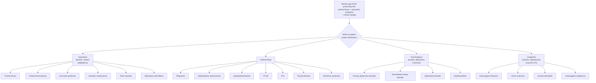
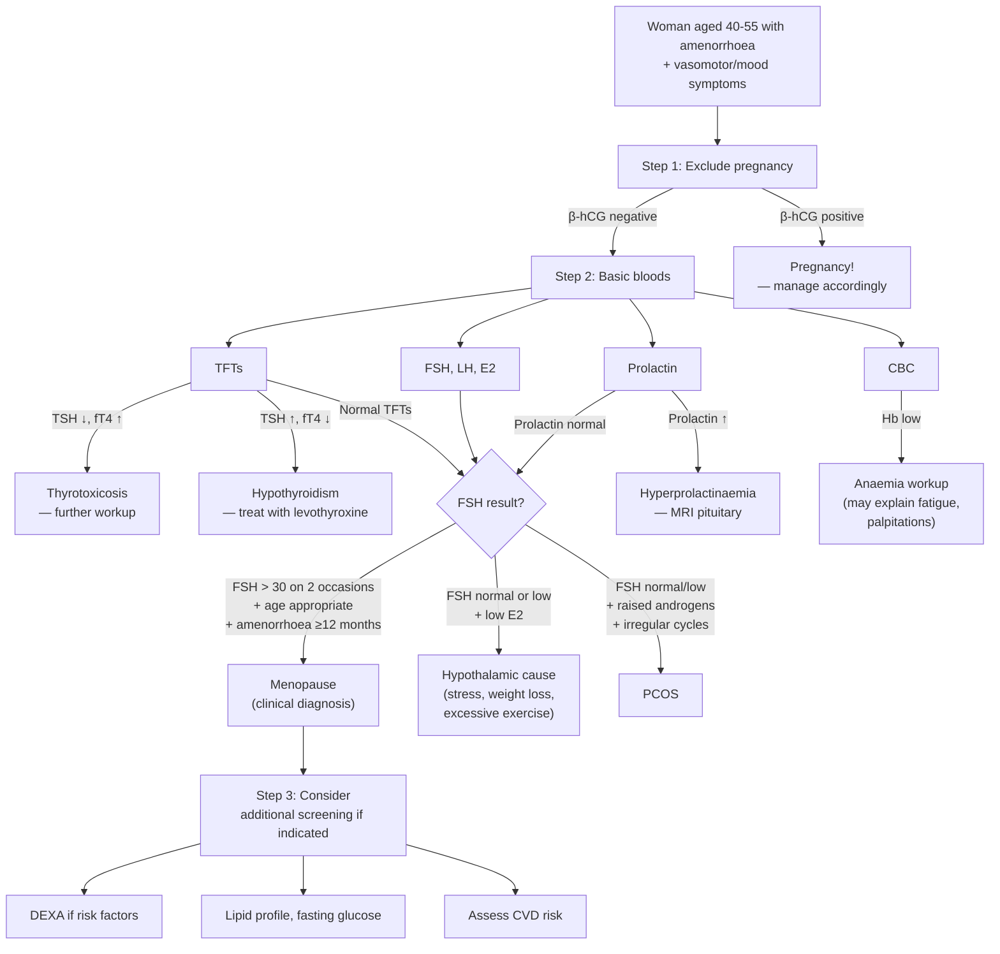

## Differential Diagnosis of Climacteric Symptoms

### Why a Differential Diagnosis Matters

Here's the clinical reality: a 50-year-old woman walks into your clinic saying "I'm having hot flushes, I can't sleep, I feel anxious, and my periods have stopped." Your reflex is "menopause." But a good clinician asks: *what else could mimic this picture?*

Climacteric symptoms are a **clinical syndrome** — they are not pathognomonic of menopause. Several conditions share overlapping features (vasomotor instability, mood disturbance, menstrual irregularity, palpitations, weight changes). Missing a thyrotoxic storm because you assumed "it's just the menopause" would be a serious error.

The lecture slides specifically highlight this:

***D/dx: thyrotoxicosis, anxiety symptoms*** [3]

Let's work through the differential diagnosis systematically, organised by the symptom cluster that most closely overlaps.

---

### Organising Framework

I find it most useful to think about the differential by asking: *which symptom cluster is dominant?* Then consider mimics of each.

---

### 1. Differential Diagnosis of Vasomotor Symptoms

These are the conditions that can present with flushing, sweating, palpitations, and heat intolerance — mimicking menopausal hot flushes.

#### a. ***Thyrotoxicosis*** [3]

This is the **#1 differential** the lecture slides want you to know.

| Feature | Menopause | Thyrotoxicosis |
|---|---|---|
| Heat intolerance | Episodic flushes (2–4 min), then resolves | **Constant**, not episodic |
| Sweating | With flushes, often nocturnal | Generalised, persistent |
| Weight | May gain (central adiposity) | ***Weight loss despite good appetite*** [5] |
| Appetite | Normal or mildly decreased | Increased |
| Bowel habit | Normal or constipation (age-related) | ***Diarrhoea*** [5] |
| Heart rate | Episodic tachycardia with flushes | ***Persistent tachycardia, may have AF*** [5] |
| Tremor | Usually absent | Fine resting tremor |
| Eyes | Normal | Lid retraction, lid lag (± Graves' ophthalmopathy) |
| Menstruation | Oligomenorrhoea → amenorrhoea | ***Amenorrhoea or oligomenorrhoea*** [5] (thyroid hormone excess suppresses GnRH pulsatility) |
| Skin | Dry, thin (oestrogen-deprived) | ***Warm, moist, shiny*** [5] |
| Mood | Fluctuating, depressed | ***Agitated, irritable*** [5] |

**Why the confusion?** Both conditions cause sympathetic-like activation (sweating, palpitations, heat intolerance) and can cause amenorrhoea. However, thyrotoxicosis produces **constant** hypermetabolism, whereas menopausal flushes are **episodic** (sudden onset, last 2–4 minutes, then resolve).

**Investigation to distinguish**: TFT (TSH ↓, free T4/T3 ↑ in thyrotoxicosis; TSH normal in menopause).

<Callout title="Exam Pearl" type="error">
Never diagnose menopause without at least checking TFTs. Thyrotoxicosis in a middle-aged woman is extremely common (Graves' disease peaks in women aged 40–60) and presents with overlapping symptoms. The lecture slides *specifically* flag this as a differential.
</Callout>

#### b. Phaeochromocytoma

A rare but dangerous mimic. Produces **episodic** (paroxysmal) symptoms — which makes it closer to menopausal flushes in character than thyrotoxicosis.

***D/dx of episodic sweating and/or flushing: oestrogen/testosterone deficiency (e.g. menopause, castration), carcinoid syndrome, phaeochromocytoma (sweat but do not flush), thyrotoxicosis, systemic mastocytosis, allergy*** [6]

| Feature | Menopause | Phaeochromocytoma |
|---|---|---|
| Flushing | Yes (vasodilation) | ***Pallor*** — not flushing (catecholamine-induced vasoconstriction) [6]. The classic teaching: **"phaeochromocytoma sweats but does NOT flush"** |
| Hypertension | Modest postmenopausal ↑ | Severe paroxysmal or sustained HTN (hallmark) |
| Headache | Not typical | Severe, pounding (hypertensive) |
| Palpitations | Episodic with flushes | Severe, with tremor |
| Anxiety/fear | Chronic, mood-related | Acute, intense sense of impending doom during attacks |

**Key distinguishing feature**: The ***5 Ps — Pressure (HTN), Pain (headache), Palpitation, Perspiration, Pallor*** [6]. The **pallor** (not flushing) is the clinical giveaway.

**Why pallor?** Catecholamines (noradrenaline/adrenaline) cause α1-mediated peripheral vasoconstriction → skin is pale and cool (the opposite of menopausal vasodilation/flushing).

**Investigation**: 24-hour urine fractionated metanephrines or plasma fractionated metanephrines [6].

#### c. Carcinoid Syndrome

Serotonin-producing neuroendocrine tumours (usually GI, with hepatic metastases allowing serotonin to bypass hepatic first-pass metabolism).

| Feature | Menopause | Carcinoid |
|---|---|---|
| Flushing | Upper body, episodic | ***Flushing*** (similar distribution, but may be more prolonged and cyanotic) |
| Diarrhoea | Not typical | ***Secretory diarrhoea*** (serotonin stimulates intestinal motility) |
| Wheeze | No | ***Bronchoconstriction*** (serotonin/histamine) |
| Cardiac | Palpitations | Right-sided valvular disease (carcinoid heart — tricuspid regurgitation, pulmonary stenosis) |

**Investigation**: 24-hour urine 5-HIAA (5-hydroxyindoleacetic acid, the serotonin metabolite).

#### d. Systemic Mastocytosis

Mast cell proliferation → episodic histamine release → flushing, urticaria, pruritus, hypotension, GI symptoms. Distinguished by urticaria pigmentosa (brown macules on skin with positive Darier sign — wheal on stroking).

**Investigation**: Serum tryptase.

#### e. Panic Disorder / Anxiety Disorders

***Anxiety symptoms*** are specifically listed as a differential in the lecture slides [3].

| Feature | Menopausal flushes | Panic attacks |
|---|---|---|
| Trigger | Spontaneous (often warmth, stress) | ***Unpredictable, or triggered by situations*** [8] |
| Duration | 2–4 minutes | 10–30 minutes typically |
| Core experience | Warmth/heat, sweating | ***Intense fear, sense of losing control, fear of dying*** [8] |
| Palpitations | Yes | ***Yes — prominent*** [8] |
| Paraesthesiae | Unusual | ***Common*** (hyperventilation → respiratory alkalosis → ↓ ionised Ca²⁺) [8] |
| Derealization | No | ***May occur*** [8] |
| Chest pain | Uncommon | ***Common*** [8] |
| Anticipatory anxiety | Minimal | ***Persistent concern about further attacks*** [8] |

**Why the overlap?** Both involve sympathetic activation. But panic disorder has a prominent **cognitive** component (catastrophic thoughts, fear of dying) that menopausal flushes lack. Also, menopausal flushes are characterised by objective peripheral warmth and visible flushing, which panic attacks generally lack.

**Important nuance**: ***Bio-psycho-social factors*** [1] — the perimenopause can *precipitate* panic attacks or worsen pre-existing anxiety. Both diagnoses can coexist.

#### f. Drug-Induced Flushing

Several medications cause flushing that mimics menopausal vasomotor symptoms:
- **Niacin** (nicotinic acid) — prostaglandin-mediated vasodilation
- **Calcium channel blockers** — vasodilation
- **Nitrates** — vasodilation
- **Tamoxifen/Aromatase inhibitors** — anti-oestrogenic effect
- **GnRH agonists** — iatrogenic medical menopause (this is *expected*, not a mimic)
- **Opioid withdrawal**

---

### 2. Differential Diagnosis of Amenorrhoea in the Perimenopausal Age Group

When a 45–55-year-old woman presents with amenorrhoea, menopause is the most likely cause — but you must exclude other pathology.

<Callout title="Golden Rule">
***Always exclude pregnancy first*** — even in a 50-year-old woman. It is the #1 cause of secondary amenorrhoea at any age, and missing it is indefensible.
</Callout>

**Systematic approach to secondary amenorrhoea** (from the HPO axis top-down) [5][7]:

| Level | Cause | Key Features | How to Distinguish |
|---|---|---|---|
| **Physiological** | ***Pregnancy*** | Amenorrhoea + nausea + breast tenderness | β-hCG (urine or serum) |
| **Physiological** | ***Menopause*** | Age 45–55, vasomotor symptoms, gradual onset | FSH > 30 IU/L on two occasions ≥ 4–6 weeks apart (supportive, not diagnostic; ***↑FSH should NOT be taken as diagnostic because it rises some years before menopause*** [3]) |
| **Hypothalamic** | ***Functional hypothalamic amenorrhoea*** | Stress, excessive exercise, low BMI, eating disorders | Low/normal FSH, low LH, low E2; diagnosis of exclusion |
| **Hypothalamic** | ***Kallmann syndrome*** | Primary amenorrhoea with anosmia (unlikely first presentation at this age) | MRI brain, olfactory testing |
| **Pituitary** | ***Hyperprolactinaemia*** [5][7] | ***Galactorrhoea, visual field defects*** if macroadenoma; causes: prolactinoma, drugs (antipsychotics, metoclopramide, domperidone), hypothyroidism, stalk effect | Serum prolactin, MRI pituitary |
| **Pituitary** | ***Hypopituitarism*** | ***G > F > A > T axis failure order*** [7]; fatigue, ↓ libido, ↓ body hair | Pituitary profile (FSH, LH, TSH, ACTH, cortisol, IGF-1, prolactin), MRI pituitary |
| **Thyroid** | ***Hypothyroidism*** [5] | ***Cold intolerance, weight gain, constipation, bradycardia, menorrhagia*** (can cause amenorrhoea too, but menorrhagia more classic) | TSH ↑, fT4 ↓ |
| **Thyroid** | ***Hyperthyroidism*** | Heat intolerance, weight loss, tremor, oligomenorrhoea/amenorrhoea | TSH ↓, fT4/fT3 ↑ |
| **Ovarian** | ***PCOS*** | Oligomenorrhoea, hyperandrogenism (acne, hirsutism), obesity, insulin resistance | Rotterdam criteria (2 of 3: oligo/anovulation, hyperandrogenism, polycystic ovaries on USS) |
| **Ovarian** | ***Premature ovarian insufficiency (POI)*** | Menopause-like picture but age < 40 | FSH > 25 IU/L on 2 occasions ≥ 4 weeks apart in a woman < 40 with amenorrhoea ≥ 4 months |
| **Adrenal** | ***Cushing's syndrome*** [7] | ***Moon face, buffalo hump, striae, proximal myopathy, oligo/amenorrhoea*** | 24h urine cortisol, overnight dexamethasone suppression test |
| **Adrenal** | ***Congenital adrenal hyperplasia (late-onset)*** | Hyperandrogenism, virilisation, primary amenorrhoea in severe forms | 17-hydroxyprogesterone |
| **Uterine** | ***Asherman syndrome*** [5] | Amenorrhoea following uterine instrumentation (D&C, endometrial ablation); **normal hormones** | Hysteroscopy (gold standard) showing intrauterine adhesions |

---

### 3. Differential Diagnosis of Psychological Symptoms

When a perimenopausal woman presents primarily with low mood, anxiety, or insomnia, consider:

| Diagnosis | Key Distinguishing Feature |
|---|---|
| **Climacteric mood changes** | Temporally linked to vasomotor symptoms and menstrual irregularity; mood fluctuates (not persistently low); responds to HRT |
| ***Major depressive disorder*** [9] | Persistent low mood ≥ 2 weeks meeting diagnostic criteria; anhedonia as core feature; does not necessarily correlate with menopausal transition; may need antidepressants |
| ***Generalised anxiety disorder (GAD)*** [8][10] | ***Free-floating anxiety that is persistent, NOT restricted to particular circumstances*** [10]; somatic symptoms (muscle tension, GI upset); would NOT be episodic like menopausal flushes |
| ***Adjustment disorder*** [9] | ***Onset ≤ 3 months of identifiable stressor; does not meet full criteria for depressive or anxiety disorder*** [9] — common in perimenopause given life changes |
| **Hypothyroidism** | Fatigue, weight gain, cognitive slowing — overlaps with depressive-type climacteric symptoms; check TFTs |
| **Obstructive sleep apnoea** | Sleep disturbance with daytime somnolence; weight gain around menopause may precipitate; partner reports snoring/apnoeas |

<Callout title="Clinical Tip" type="idea">
The perimenopause is a time of **increased vulnerability** to first-episode or recurrent depression — risk is approximately 2–4× higher than premenopause. Both hormonal and psychosocial factors contribute. If a woman meets criteria for major depressive disorder, treat it as such (antidepressants ± psychotherapy). HRT alone is insufficient for true clinical depression, though it may augment antidepressant response.
</Callout>

---

### 4. Differential Diagnosis of Urogenital Symptoms

| Diagnosis | Key Distinguishing Feature |
|---|---|
| **GSM (menopausal urogenital atrophy)** | Progressive; vaginal pH > 5; pale thin mucosa on exam; responds to topical oestrogen |
| **Vulvovaginal candidiasis** | Pruritus + thick white discharge; KOH prep shows hyphae/pseudohyphae; pH ≤ 4.5 |
| **Bacterial vaginosis** | Thin grey-white discharge, fishy odour; clue cells on wet mount; pH > 4.5 |
| **Lichen sclerosus** | White, crinkled "cigarette paper" skin; labial fusion; intense pruritus; biopsy diagnostic; risk of vulvar SCC |
| **Contact dermatitis** | Linked to soap, detergent, lubricant exposure; pruritic, erythematous; history-dependent |
| **Vulvar/vaginal malignancy** | Postmenopausal bleeding, mass, ulceration; biopsy essential |
| **Overactive bladder (OAB)** | Urgency/frequency without atrophy signs; may coexist with GSM but also occurs independently |
| **UTI** | Dysuria + frequency but with pyuria/bacteriuria on MSU; GSM increases UTI risk, so they coexist |

---

### 5. Differential Diagnosis Summary Table — Organised by Mimicked Feature

| Climacteric Feature Mimicked | Differential Diagnoses | Key Discriminator |
|---|---|---|
| **Hot flushes / sweating** | ***Thyrotoxicosis*** [3], phaeochromocytoma, carcinoid, mastocytosis, panic disorder, drugs | TFTs, 24h urine metanephrines, 5-HIAA, tryptase, psychiatric assessment |
| **Amenorrhoea** | ***Pregnancy***, hypothalamic amenorrhoea, PCOS, hyperprolactinaemia, thyroid disease, POI, Asherman, Cushing's | β-hCG, FSH/LH/E2, prolactin, TFTs, USS pelvis, cortisol |
| **Mood disturbance** | MDD, GAD, adjustment disorder, hypothyroidism, OSA | Psychiatric criteria, TFTs, sleep study |
| **Palpitations** | AF, SVT, phaeochromocytoma, thyrotoxicosis, anaemia, anxiety | ECG, Holter, TFTs, CBC, metanephrines |
| **Vaginal dryness / dyspareunia** | Candidiasis, BV, lichen sclerosus, contact dermatitis, malignancy | Vaginal pH, swabs, biopsy if indicated |
| **Recurrent UTI / urinary symptoms** | True UTI, OAB, interstitial cystitis, urethral diverticulum | MSU culture, urodynamics |
| **Osteoporosis** | Secondary causes: hyperparathyroidism, Cushing's, myeloma, hyperthyroidism, CKD, drugs (steroids, PPIs) | Ca/PO4, PTH, cortisol, SPEP, TFTs, RFTs, DEXA |

---

### Clinical Approach to Differentiating — A Practical Algorithm

When you see a woman aged 40–55 presenting with a combination of amenorrhoea, vasomotor symptoms, and mood changes:

<Callout title="Must-Know for Exams">
The lecture slides emphasise two specific differentials for climacteric symptoms: ***thyrotoxicosis and anxiety symptoms*** [3]. These are the ones most likely to appear in an OSCE or SAQ. Always check TFTs and always consider psychiatric comorbidity.
</Callout>

---

### Special Consideration: Premature Ovarian Insufficiency (POI) vs. Natural Menopause

POI (menopause < 40) is **pathological** and demands investigation for an underlying cause, unlike natural menopause:

| Feature | Natural Menopause | POI |
|---|---|---|
| Age | 45–55 (mean 51) | < 40 |
| FSH | ↑↑ | ↑↑ (same hormonal picture) |
| Karyotype | Not indicated | **Must check** — Turner syndrome (45,X), Fragile X premutation |
| Autoimmune screen | Not routine | Indicated — anti-adrenal Ab, anti-TPO Ab (associated autoimmune conditions) |
| Bone density | Screen based on risk factors | **Early DEXA mandatory** (longer duration of oestrogen deficiency) |
| HRT | Symptom-dependent | **Essential** — continue until at least age 51 to replace "missing" physiological oestrogen |

---

<Callout title="High Yield Summary">

**Key differentials to remember (exam-tested):**

1. ***Thyrotoxicosis*** — #1 differential for vasomotor symptoms; constant hypermetabolism vs. episodic flushes; ALWAYS check TFTs [3]
2. ***Pregnancy*** — #1 differential for amenorrhoea at ANY age; ALWAYS do β-hCG before anything else
3. ***Anxiety/panic disorder*** — overlapping palpitations, sweating, insomnia; look for cognitive component (catastrophic thinking, fear of dying) vs. pure warmth/flushing in menopause [3]
4. ***Phaeochromocytoma*** — episodic sweating but PALLOR (not flushing) + severe HTN; "sweats but does not flush" [6]
5. ***Hyperprolactinaemia*** — amenorrhoea + galactorrhoea; check prolactin [5]
6. ***PCOS*** — irregular periods + hyperandrogenism; but usually presents younger
7. ***Secondary causes of osteoporosis*** — always consider if Z-score ≤ –2.0

**The diagnostic approach**: β-hCG → TFTs → FSH/LH/E2 → prolactin → consider further investigations based on findings.

**Menopause remains a clinical diagnosis** (retrospective: 12 months amenorrhoea in a woman of appropriate age). ***↑FSH should NOT be taken as diagnostic because it rises some years before menopause*** [3].

</Callout>

---

<ActiveRecallQuiz
  title="Active Recall - Differential Diagnosis of Climacteric Symptoms"
  items={[
    {
      question: "Name the two specific differential diagnoses highlighted in the lecture slides for climacteric symptoms.",
      markscheme: "Thyrotoxicosis and anxiety symptoms. Both share overlapping features with vasomotor and psychological climacteric symptoms."
    },
    {
      question: "How do you clinically distinguish menopausal hot flushes from phaeochromocytoma episodes?",
      markscheme: "Phaeochromocytoma causes sweating but PALLOR (catecholamine-induced vasoconstriction), not flushing (vasodilation). It also features severe paroxysmal hypertension and headache. Menopausal flushes cause visible erythema and warmth from peripheral vasodilation. The 5Ps: Pressure, Pain, Palpitation, Perspiration, Pallor."
    },
    {
      question: "A 48-year-old woman presents with 4 months of amenorrhoea, heat intolerance, weight loss, and palpitations. What investigation must you do before attributing this to menopause and why?",
      markscheme: "Must do TFTs (TSH, fT4) to exclude thyrotoxicosis. Weight loss despite good appetite, persistent (not episodic) heat intolerance, and continuous tachycardia point toward hyperthyroidism rather than menopause. Also check beta-hCG to exclude pregnancy."
    },
    {
      question: "Why should elevated FSH alone NOT be used to diagnose menopause?",
      markscheme: "FSH rises years before menopause due to declining inhibin B from a reducing follicular pool. It fluctuates during perimenopause and may be transiently elevated while the woman is still menstruating. Menopause is a clinical, retrospective diagnosis (12 months amenorrhoea), not a biochemical one."
    },
    {
      question: "A 52-year-old woman presents with secondary amenorrhoea. List the first four investigations you would order and justify each.",
      markscheme: "1. Beta-hCG: exclude pregnancy (mandatory at any age). 2. TFTs: exclude hypo- or hyperthyroidism. 3. FSH and E2: assess gonadal status (high FSH + low E2 = ovarian failure/menopause). 4. Prolactin: exclude hyperprolactinaemia (prolactinoma, drugs). Additional: consider pelvic USS if PCOS suspected."
    },
    {
      question: "What distinguishes generalised anxiety disorder from the psychological symptoms of the climacteric?",
      markscheme: "GAD features free-floating, persistent anxiety not restricted to particular circumstances, with prominent somatic features (muscle tension, GI upset). Climacteric psychological symptoms are temporally linked to the menopausal transition, fluctuate with vasomotor episodes, and include hot-flush-related sleep disturbance. The climacteric picture is multifactorial (bio-psycho-social), may improve with HRT, and does not typically meet full GAD diagnostic criteria."
    }
  ]}
/>

## References

[1] Lecture slides: Block C - Climacteric symptoms_ menopause and related illness; amenorrhoea.pdf (p18–19)
[2] Lecture slides: GC 114. Climacteric symptoms menopause and related illness; amenorrhoea.pdf (p39–40)
[3] Senior notes: Adrian Lui Gynecology Notes.pdf (p32)
[4] Senior notes: Ryan Ho Endocrine.pdf (p47–48)
[5] Senior notes: Maksim Medicine Notes.pdf (p79, p90, p107)
[6] Senior notes: Ryan Ho Endocrine.pdf (p66)
[7] Senior notes: Ryan Ho Endocrine.pdf (p110–112)
[8] Senior notes: Ryan Ho Psychiatry.pdf (p179)
[9] Senior notes: Ryan Ho Psychiatry.pdf (p140)
[10] Senior notes: Ryan Ho Psychiatry.pdf (p170, p173)
