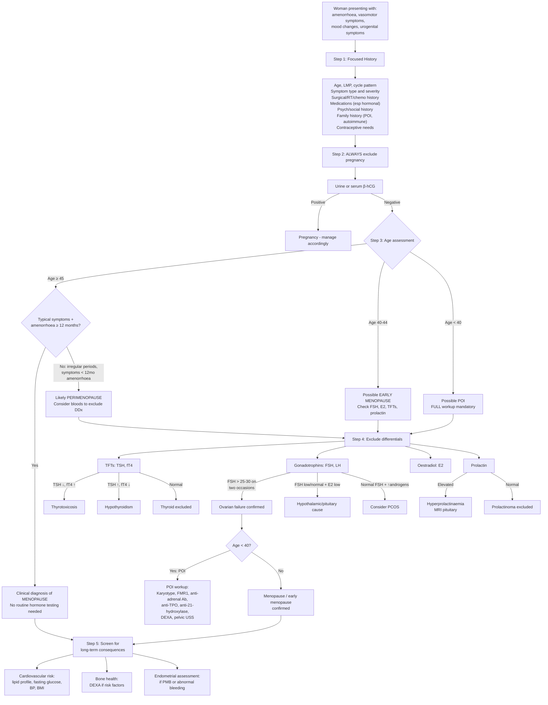

## Diagnostic Criteria, Algorithm and Investigations for Climacteric Symptoms and Menopause

### Overarching Principle: Menopause is a Clinical Diagnosis

Before diving into investigations, let's establish the most important concept:

***Menopause is the permanent cessation of ovarian function and fertility — a specific event (the final menstrual period) — diagnosed retrospectively after cessation of menses for 12 months in a previously cycling woman*** [1].

This means there is **no single blood test that "diagnoses" menopause**. It is a **clinical, retrospective diagnosis**. The role of investigations is primarily to:

1. **Exclude differentials** (especially pregnancy, thyroid disease, hyperprolactinaemia).
2. **Confirm the diagnosis** in ambiguous cases (e.g., prior hysterectomy, premature presentation).
3. **Screen for long-term consequences** (osteoporosis, cardiovascular risk).
4. **Investigate underlying aetiology** when menopause occurs prematurely (POI).

---

### 1. Diagnostic Criteria

#### 1a. Natural Menopause

There is no formal "diagnostic criteria" in the way we have for, say, rheumatoid arthritis. Instead, the diagnosis rests on:

| Criterion | Detail |
|---|---|
| **Age** | Typically 45–55 years (median 51) |
| **Amenorrhoea duration** | ***≥ 12 consecutive months*** without menstruation [1][3] |
| **No other pathological or physiological cause** | Must exclude pregnancy, thyroid disease, hyperprolactinaemia, PCOS, Asherman syndrome, etc. [3] |
| **Clinical context** | Symptoms consistent with oestrogen deficiency (vasomotor, urogenital, psychological — though not required for diagnosis) |

<Callout title="Critical Exam Point" type="error">
***↑FSH should NOT be taken as diagnostic because it rises some years before menopause*** [3]. A single elevated FSH in a 48-year-old with irregular periods does NOT mean she is menopausal — she may still ovulate and even conceive. FSH fluctuates wildly in perimenopause. Do not use FSH to "diagnose" menopause in women aged 45+ with typical symptoms.
</Callout>

**When IS hormone testing useful for diagnosing menopause?**

According to NICE guidelines (NG23, updated 2024) and current clinical practice:

| Scenario | Do You Need FSH? | Rationale |
|---|---|---|
| **Woman ≥ 45 with typical symptoms + ≥ 12 months amenorrhoea** | **No** — clinical diagnosis | Classical presentation; testing adds no value and may confuse |
| **Woman aged 40–45 with menopausal symptoms** | **Consider FSH** | Earlier than expected; FSH helps support the diagnosis (FSH > 30 IU/L on two occasions ≥ 4–6 weeks apart suggests ovarian failure) |
| **Woman < 40 with suspected POI** | **Yes — essential** | POI is pathological; requires biochemical confirmation (FSH > 25 IU/L on two occasions ≥ 4 weeks apart) + further aetiological workup |
| **Woman with prior hysterectomy (uterus removed but ovaries retained)** | **Consider FSH** | No menstrual periods to use as a clinical marker; need biochemical evidence of ovarian failure |
| **Woman on hormonal contraception** | **Cannot rely on FSH** | Exogenous hormones suppress/alter FSH; need to stop hormonal method and reassess (or measure FSH in the pill-free interval of CHC — though this is unreliable) |

#### 1b. Premature Ovarian Insufficiency (POI)

POI has specific diagnostic criteria because it is a pathological condition requiring investigation:

| Criterion | Detail |
|---|---|
| **Age** | < 40 years |
| **Amenorrhoea/oligomenorrhoea** | ≥ 4 months |
| **Elevated FSH** | **> 25 IU/L on two occasions ≥ 4 weeks apart** (ESHRE 2024 guideline) |

Why two occasions? Because FSH fluctuates in the perimenopausal window — a single elevated reading could be a transient peak during an anovulatory cycle. Repeating it 4 weeks later confirms persistent ovarian failure rather than a temporary fluctuation.

#### 1c. Perimenopause

There are no universally accepted formal "diagnostic criteria" for perimenopause. The STRAW+10 staging system provides a framework (discussed in Part 1). In practice:

- **Early perimenopause**: menstrual cycle variability ≥ 7 days difference in consecutive cycle lengths (e.g., one cycle 24 days, next cycle 35 days).
- **Late perimenopause**: ≥ 2 skipped cycles with ≥ 60 days of amenorrhoea between periods.
- Supportive: vasomotor symptoms + FSH > 25 IU/L (if measured), but clinical features are usually sufficient.

---

### 2. Diagnostic Algorithm

Here is a comprehensive diagnostic algorithm for a woman presenting with suspected climacteric symptoms:

---

### 3. Investigation Modalities — Detailed Interpretation

Let me walk through each investigation systematically: what it measures, why we order it, and how to interpret the results.

#### 3a. First-Line Investigations (for all women presenting with suspected menopause)

##### i. β-hCG (Urine or Serum)

| Parameter | Detail |
|---|---|
| **What it measures** | Human chorionic gonadotrophin, produced by trophoblastic cells after implantation |
| **Why** | ***Always exclude pregnancy first*** — amenorrhoea in a reproductive-age woman is pregnancy until proven otherwise |
| **Interpretation** | Positive = pregnant (even perimenopausal women can conceive). Negative = proceed to further evaluation |
| **Pitfall** | Very early pregnancy may have negative urine hCG; if clinical suspicion high, repeat or use serum quantitative hCG |

##### ii. Thyroid Function Tests (TFTs)

| Parameter | Detail |
|---|---|
| **What it measures** | TSH (pituitary feedback marker), free T4, ± free T3 |
| **Why** | ***D/dx: thyrotoxicosis*** [3] — the #1 differential for vasomotor symptoms. Hypothyroidism can also cause amenorrhoea, fatigue, weight gain, and mood disturbance |
| **Interpretation** | |

| Pattern | Diagnosis | Relevance to Menopause DDx |
|---|---|---|
| TSH ↓, fT4 ↑ (± fT3 ↑) | **Hyperthyroidism** | Mimics vasomotor symptoms; causes amenorrhoea via suppression of GnRH pulsatility |
| TSH ↑, fT4 ↓ | **Primary hypothyroidism** | Mimics psychological symptoms (fatigue, depression, poor concentration); can cause menorrhagia OR amenorrhoea; ↑TRH can cause secondary hyperprolactinaemia [7] |
| Normal | Thyroid disease excluded | Proceed |

**Why does hypothyroidism cause amenorrhoea?** Two mechanisms: (1) ↑TRH → ↑prolactin → suppresses GnRH → hypogonadotropic hypogonadism [7]; (2) Altered SHBG and peripheral oestrogen metabolism.

##### iii. Gonadotrophins — FSH and LH

| Parameter | Detail |
|---|---|
| **What it measures** | FSH and LH from anterior pituitary gonadotroph cells |
| **Why** | To confirm ovarian failure (hypergonadotropic hypogonadism) and distinguish from hypothalamic/pituitary causes (hypogonadotropic hypogonadism) |
| **When to order** | Women < 45 with suspected menopause; women < 40 with suspected POI; post-hysterectomy; ambiguous clinical picture |
| **When NOT needed** | Women ≥ 45 with classic symptoms and ≥ 12 months amenorrhoea [3] |

**Interpretation:**

| FSH Level | LH Level | E2 Level | Interpretation |
|---|---|---|---|
| **↑↑ (> 30–40 IU/L)** | ↑ | ↓↓ | ***Hypergonadotropic hypogonadism*** = ovarian failure (menopause/POI). The ovary has failed → no negative feedback → FSH/LH rise |
| **Normal or ↓** | Normal or ↓ | ↓ | ***Hypogonadotropic hypogonadism*** = hypothalamic or pituitary cause (functional hypothalamic amenorrhoea, hyperprolactinaemia, Sheehan syndrome, etc.) |
| **Normal** | ↑ (LH:FSH > 2–3:1) | Normal or ↑ | Suggests **PCOS** (high LH drives theca cell androgen production; FSH relatively suppressed) |
| **Variable / fluctuating** | Variable | Variable | **Perimenopause** — hormones are in flux; a single measurement is unreliable |

<Callout title="Why FSH Rises Before LH">
Inhibin B (from granulosa cells) selectively suppresses FSH but NOT LH. As follicle numbers decline, inhibin B falls first → FSH rises first (loss of selective brake). LH only rises significantly later when oestradiol drops enough to remove negative feedback at the hypothalamic-pituitary level. This is why FSH is the earlier and more dramatic change.
</Callout>

**Practical tip**: For POI diagnosis, repeat FSH ≥ 4 weeks apart because perimenopause involves wild fluctuations. A single elevated FSH is not definitive.

##### iv. Oestradiol (E2)

| Parameter | Detail |
|---|---|
| **What it measures** | The primary ovarian oestrogen (17β-oestradiol) |
| **Why** | Confirms oestrogen deficiency in conjunction with FSH; helps distinguish perimenopause (fluctuating E2) from postmenopause (persistently low E2) |
| **Interpretation** | Postmenopausal E2 typically < 70–110 pmol/L (< 20–30 pg/mL). Perimenopausal E2 is erratic — may be normal, high, or low in any given cycle |

##### v. Prolactin

| Parameter | Detail |
|---|---|
| **What it measures** | Serum prolactin level |
| **Why** | ***Hyperprolactinaemia causes secondary amenorrhoea, anovulation, and climacteric symptoms*** [5][7] — it is a treatable cause that must be excluded |
| **Interpretation** (from senior notes) [5][7]: |

| Level (mU/L) | Interpretation |
|---|---|
| ***< 500*** | ***Normal*** [5] |
| ***500–1000*** | ***Stress, drugs*** [5] |
| ***1000–5000*** | ***Drugs, microprolactinoma, disconnection prolactinoma*** [7] |
| ***> 5000*** | ***Highly suggestive of macroprolactinoma*** [5][7] |
| ***> 100,000*** | ***Potential for high-dose hook effect (false negative)*** [7] — order serial dilutions |

**What is the hook effect?** At very high prolactin concentrations, the analyte saturates both the capture and detection antibodies in a sandwich immunoassay, preventing "sandwich" formation → paradoxically low/normal reading. Solution: run the assay at serial dilutions.

If prolactin elevated → **MRI pituitary** to look for adenoma [5].

#### 3b. Second-Line Investigations — For Specific Clinical Scenarios

##### vi. Pelvic Ultrasound (Transvaginal USS)

| Parameter | Detail |
|---|---|
| **Why** | Assess endometrial thickness (if abnormal bleeding); ovarian morphology (polycystic ovaries in PCOS); antral follicle count (marker of ovarian reserve) |
| **Key findings** | |

| Finding | Interpretation |
|---|---|
| Thin endometrium (< 4–5 mm in postmenopausal woman) | Atrophic endometrium — consistent with oestrogen deficiency; reassuring if postmenopausal bleeding (PMB) |
| Thickened endometrium (> 4 mm in PMB) | Concerning for endometrial pathology (hyperplasia, polyp, carcinoma) — requires endometrial sampling |
| Polycystic ovarian morphology (≥ 12 follicles per ovary or ovarian volume > 10 mL) | Suggestive of PCOS (but can be normal variant) |
| Small, atrophic ovaries with few/no antral follicles | Consistent with menopause/POI |

##### vii. Endometrial Biopsy / Hysteroscopy

| Parameter | Detail |
|---|---|
| **When** | Postmenopausal bleeding (PMB); abnormal perimenopausal bleeding not responding to treatment; endometrial thickness > 4 mm on USS in context of PMB |
| **Why** | To exclude endometrial cancer/hyperplasia. **Any postmenopausal bleeding is endometrial cancer until proven otherwise** |
| **Methods** | Pipelle biopsy (outpatient, blind — adequate for screening); hysteroscopy + directed biopsy (gold standard — visualises cavity) |

<Callout title="Postmenopausal Bleeding Rule" type="error">
***Any bleeding that occurs ≥ 12 months after the final menstrual period = postmenopausal bleeding (PMB) and MUST be investigated to exclude endometrial cancer.*** This is regardless of amount, duration, or whether the woman is on HRT (though breakthrough bleeding on HRT is common in the first 3–6 months). Do not dismiss PMB as "just hormones."
</Callout>

##### viii. DEXA Scan (Dual-Energy X-ray Absorptiometry)

| Parameter | Detail |
|---|---|
| **What it measures** | Bone mineral density (BMD) at lumbar spine and hip (the two most common fracture sites) [4][11] |
| **Why** | ***Oestrogen deficiency leads to bone loss. Postmenopausal osteoporosis as an important risk factor for fracture*** [1] |
| **When to order** | Postmenopausal women with risk factors for osteoporosis; all women with POI; women ≥ 65 (universal screening in some guidelines); before/during HRT to monitor response |
| **Interpretation** [4][11]: |

| Score | Definition | Clinical Meaning |
|---|---|---|
| ***T-score ≥ –1.0*** | ***Normal*** [11] | No treatment needed beyond lifestyle |
| ***T-score –1.0 to –2.5*** | ***Osteopenia*** [11] | Intermediate risk; consider FRAX score to assess fracture probability |
| ***T-score ≤ –2.5*** | ***Osteoporosis*** [11] | Treatment indicated |
| ***T-score ≤ –2.5 + fragility fracture*** | ***Severe (established) osteoporosis*** [11] | Aggressive treatment mandatory |

**T-score vs Z-score** [11]:
- ***T-score***: compares to peak bone mass of a 30-year-old woman of same sex and ethnicity. Used in **postmenopausal women and men ≥ 50**.
- ***Z-score***: compares to age-matched population. Used in **premenopausal women and men < 50**. If ***Z-score ≤ –2.0 → suspect secondary cause*** [11].
- ***FRAX score***: 10-year fracture risk calculator incorporating BMD + clinical risk factors. ***Limitation: only validated for > 40 or postmenopausal women*** [11].

##### ix. Cardiovascular Risk Assessment

| Investigation | Rationale |
|---|---|
| **Fasting lipid profile** | ***Oestrogen probably protective to vasculature and has favourable effect on lipid profile*** [1] — after menopause, LDL ↑, HDL ↓, TG ↑ |
| **Fasting glucose / HbA1c** | Insulin resistance increases postmenopause; screen for diabetes |
| **Blood pressure** | Modest rise in BP postmenopause |
| **BMI / waist circumference** | Central adiposity increases cardiovascular risk |

#### 3c. Third-Line Investigations — For POI Workup

When menopause occurs < 40, a directed aetiological search is essential:

| Investigation | What You're Looking For | Rationale |
|---|---|---|
| **Karyotype** | Turner syndrome (45,X) or mosaicism (45,X/46,XX) | Turner is the commonest genetic cause of POI; also check for Y chromosome material (→ gonadectomy if present due to gonadoblastoma risk) |
| **FMR1 gene (Fragile X premutation)** | CGG repeat expansion (55–200 repeats) | Fragile X premutation is associated with POI in ~6% of sporadic cases and ~13% of familial cases. Also has implications for genetic counselling (offspring risk of full Fragile X syndrome) |
| **Anti-adrenal antibodies (anti-21-hydroxylase Ab)** | Autoimmune adrenalitis | POI may be part of autoimmune polyendocrine syndrome (APS); if positive, screen for Addison's disease (morning cortisol, short Synacthen test) |
| **Anti-TPO antibodies** | Autoimmune thyroiditis | Commonly coexists with autoimmune POI (APS type 2) |
| **Anti-ovarian antibodies** | Autoimmune oophoritis | Poor sensitivity/specificity; not widely used clinically but may support autoimmune aetiology |
| **Morning cortisol ± short Synacthen test** | Adrenal insufficiency | If anti-adrenal Ab positive or clinical suspicion of Addison's |
| **Pelvic USS** | Ovarian size, follicle count | Small atrophic ovaries = consistent with POI; if follicles present, may indicate intermittent ovarian function (POI is not always permanent in early stages) |
| **DEXA scan** | BMD | Mandatory in POI — longer duration of oestrogen deficiency → greater bone loss risk |
| **Calcium, phosphate, vitamin D** | Metabolic bone health | Baseline before starting treatment |

#### 3d. Other Investigations in Specific Contexts

| Investigation | Context | Key Finding |
|---|---|---|
| **Anti-Müllerian Hormone (AMH)** | Ovarian reserve assessment (mainly fertility context) | Very low/undetectable = depleted follicular pool. Note: NOT used to diagnose menopause per se, but useful for fertility counselling in POI and perimenopause |
| **Vaginal pH** | Urogenital symptoms | pH > 5.0 consistent with vaginal atrophy (loss of Lactobacillus); pH < 4.5 suggests adequate oestrogenisation |
| **Vaginal maturation index** | Research/specialist use | Ratio of parabasal:intermediate:superficial cells on vaginal cytology. Oestrogen deficiency → ↑ parabasal cells (immature). Rarely used clinically now |
| **Bone turnover markers (CTX, P1NP)** | Monitoring treatment response | CTX (C-terminal telopeptide) = bone resorption marker; P1NP (procollagen type I N-terminal propeptide) = bone formation marker. ↓ CTX with anti-resorptive therapy confirms drug response. Not used for diagnosis |
| **ECG** | Palpitations as predominant symptom | Rule out arrhythmia (AF, SVT) |
| **Mammogram** | Pre-HRT screening; ongoing surveillance | Baseline before starting HRT; then regular screening per local protocol (HK: biennial mammogram for women 44–69 in targeted screening) |

---

### 4. Symptom Severity Assessment Tools

While not strictly "investigations," clinicians use validated questionnaires to quantify symptom burden and monitor treatment response:

| Tool | What It Measures |
|---|---|
| **Kupperman Menopausal Index (KMI)** | Weighted score of 11 menopausal symptoms (hot flushes, paraesthesia, insomnia, nervousness, etc.) |
| **Menopause Rating Scale (MRS)** | 11-item self-administered questionnaire covering somatic, psychological, and urogenital domains |
| **Greene Climacteric Scale** | 21-item scale assessing psychological (anxiety, depression), somatic, and vasomotor symptoms |
| **FSFI (Female Sexual Function Index)** | 19-item questionnaire for sexual function (desire, arousal, lubrication, orgasm, satisfaction, pain) |
| **PHQ-9 / GAD-7** | Screening for depression and anxiety respectively — important given the ***bio-psycho-social*** nature of climacteric mood symptoms [1][2] |

---

### 5. Putting It All Together — Investigation Checklist by Clinical Scenario

| Scenario | Minimum Investigations |
|---|---|
| **Woman ≥ 45 with typical symptoms + amenorrhoea ≥ 12 months** | β-hCG (exclude pregnancy), TFTs (exclude thyroid disease). **No FSH needed.** Consider lipid profile, fasting glucose, DEXA if risk factors |
| **Woman 40–44 with menopausal symptoms** | β-hCG, TFTs, FSH (× 2, ≥ 4–6 weeks apart), E2, prolactin. Consider pelvic USS |
| **Woman < 40 with amenorrhoea ≥ 4 months** | Full POI workup: β-hCG, FSH (× 2, ≥ 4 weeks apart), E2, TFTs, prolactin, karyotype, FMR1, autoimmune screen (anti-adrenal Ab, anti-TPO), DEXA, pelvic USS |
| **Woman with prior hysterectomy (ovaries retained)** | FSH, E2 (no menstrual marker available), TFTs |
| **Postmenopausal bleeding (PMB)** | Transvaginal USS (endometrial thickness) → if > 4 mm or clinical concern: endometrial biopsy/hysteroscopy. Also exclude cervical pathology |
| **Pre-HRT assessment** | Mammogram, BP, lipid profile, cervical screening status, personal/family history of breast cancer and VTE |

---

<Callout title="High Yield Summary">

**Menopause diagnosis:**
- **Clinical and retrospective**: ≥ 12 months amenorrhoea in a woman of appropriate age with no other cause
- ***FSH should NOT be taken as diagnostic*** [3] in women ≥ 45 with classic presentation
- FSH IS needed when: age < 45, suspected POI (< 40), post-hysterectomy, ambiguous clinical picture

**POI diagnostic criteria:**
- Age < 40 + amenorrhoea ≥ 4 months + **FSH > 25 IU/L on two occasions ≥ 4 weeks apart**

**Hormonal profile of menopause:**
- ↑↑ FSH (> 30–40), ↑ LH, ↓↓ E2, ↓ inhibin B — hypergonadotropic hypogonadism

**Key investigations to exclude differentials:**
- β-hCG (pregnancy), TFTs (thyroid disease), prolactin (hyperprolactinaemia)

**DEXA interpretation** [11]:
- Normal: T ≥ –1.0
- Osteopenia: T –1.0 to –2.5
- Osteoporosis: T ≤ –2.5
- Severe: T ≤ –2.5 + fragility fracture
- Z-score ≤ –2.0 → suspect secondary cause

**PMB rule**: Any bleeding ≥ 12 months post-FMP → investigate for endometrial cancer (USS ± biopsy)

</Callout>

---

<ActiveRecallQuiz
  title="Active Recall - Diagnosis and Investigations of Menopause"
  items={[
    {
      question: "In which clinical scenarios is FSH measurement necessary to support a diagnosis of menopause, and in which is it not needed?",
      markscheme: "NOT needed: women aged 45 or older with typical symptoms and at least 12 months amenorrhoea (clinical diagnosis). NEEDED: women aged 40-44 with menopausal symptoms (early menopause), women under 40 with suspected POI, women post-hysterectomy with ovaries retained (no menstrual marker), women on hormonal contraception where clinical picture is unclear."
    },
    {
      question: "State the diagnostic criteria for premature ovarian insufficiency and explain why FSH must be measured on two separate occasions.",
      markscheme: "POI criteria: age under 40, amenorrhoea at least 4 months, FSH greater than 25 IU/L on two occasions at least 4 weeks apart. Two occasions needed because FSH fluctuates wildly during perimenopause; a single elevated reading could be a transient peak during an anovulatory cycle rather than permanent ovarian failure."
    },
    {
      question: "A 38-year-old woman is diagnosed with POI. List four investigations you would order beyond FSH and E2, and justify each.",
      markscheme: "1. Karyotype: to detect Turner syndrome (45,X) or Y chromosome material (gonadoblastoma risk). 2. FMR1 gene testing: Fragile X premutation associated with POI, implications for genetic counselling. 3. Anti-adrenal antibodies (anti-21-hydroxylase): autoimmune POI may be part of autoimmune polyendocrine syndrome; if positive, screen for Addison disease. 4. Anti-TPO antibodies: autoimmune thyroiditis commonly coexists. Also acceptable: DEXA (early bone loss screening), pelvic USS (ovarian morphology)."
    },
    {
      question: "Explain the DEXA T-score versus Z-score: when is each used, and what does a Z-score of minus 2.5 in a 35-year-old woman with POI suggest?",
      markscheme: "T-score compares BMD to peak bone mass of a 30-year-old (same sex/ethnicity); used in postmenopausal women and men over 50. Z-score compares to age-matched population; used in premenopausal women and men under 50. Z-score of minus 2.5 in a 35-year-old suggests bone density significantly below age-matched peers, raising suspicion of a secondary cause of osteoporosis beyond oestrogen deficiency alone (e.g., autoimmune, malabsorption, medications)."
    },
    {
      question: "A 55-year-old postmenopausal woman on HRT for 2 years presents with vaginal bleeding. What is your approach?",
      markscheme: "Any postmenopausal bleeding must be investigated to exclude endometrial cancer. Step 1: Transvaginal ultrasound to measure endometrial thickness. If endometrial thickness greater than 4 mm (or if bleeding persists/is recurrent regardless of thickness): Step 2: Endometrial sampling via Pipelle biopsy or hysteroscopy with directed biopsy. Also perform speculum and cervical examination to exclude cervical pathology. Note: breakthrough bleeding in the first 3-6 months of HRT can be normal, but persistent or new bleeding after this period warrants investigation."
    }
  ]}
/>

## References

[1] Lecture slides: Block C - Climacteric symptoms_ menopause and related illness; amenorrhoea.pdf (p18–19)
[2] Lecture slides: GC 114. Climacteric symptoms menopause and related illness; amenorrhoea.pdf (p3, p38)
[3] Senior notes: Adrian Lui Gynecology Notes.pdf (p31–32)
[4] Senior notes: Ryan Ho Endocrine.pdf (p48–49)
[5] Senior notes: Maksim Medicine Notes.pdf (p107)
[7] Senior notes: Ryan Ho Endocrine.pdf (p110)
[11] Senior notes: Maksim Medicine Notes.pdf (p109)
