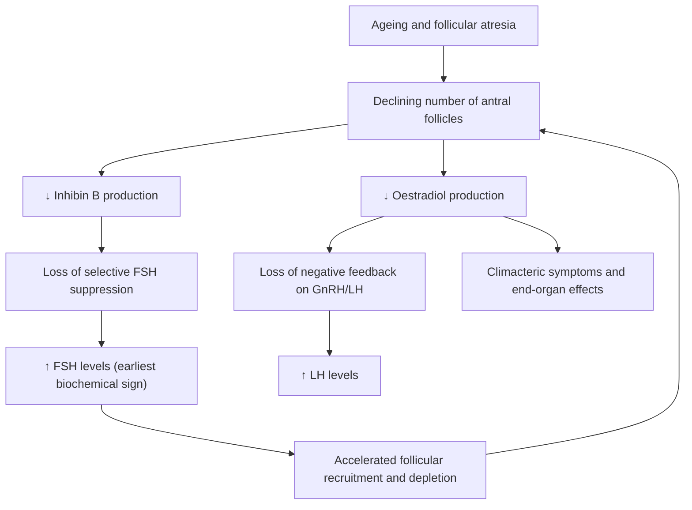

# Climacteric Symptoms and Menopause

## 1. Definition and Terminology

Let's start with the language — getting terminology right is essential because examiners love to test whether you can distinguish these closely related but distinct terms.

***Climacteric***: ***the years of waning ovarian function which marks the transition from the reproductive to the non-reproductive state*** [1]. Think of it like "the menopause era" — it's a gradual process, not a single event. The word comes from the Greek *klimakter* (κλιμακτήρ) = "rung of a ladder" or "critical period," reflecting the idea of a physiological step-change.

***Menopause***: ***the permanent cessation of ovarian function and fertility — a specific event (the final menstrual period) — diagnosed retrospectively after cessation of menses for 12 months in a previously cycling woman*** [1][2]. This is crucial: menopause is a **point in time**, not a period. You can only say "that was menopause" *after* 12 months of amenorrhoea have elapsed. The word: "meno-" (Greek *mēn* = month/menstruation) + "pause" (Greek *pausis* = cessation).

***Perimenopause***: ***the period beginning with the first clinical, biological and endocrinological features of the approaching menopause, and ending 12 months after the final menstrual period*** [1]. This is the window where women are most symptomatic — cycles become irregular, hormone levels fluctuate wildly, and vasomotor symptoms peak.

**Premature menopause (Premature Ovarian Insufficiency, POI)**: menopause occurring before age 40. This is pathological and warrants investigation — it is NOT a normal variant.

**Early menopause**: menopause occurring between ages 40–45.

**Postmenopause**: the period commencing 12 months after the final menstrual period and lasting the rest of life.

<Callout title="Key Distinction for Exams">
Menopause = a single retrospective event (the last period).
Climacteric = the entire transitional era (years).
Perimenopause = the symptomatic transition window.
Don't confuse these — they are tested separately.
</Callout>

---

## 2. Epidemiology

### Age of Onset
- **Average age of natural menopause**: ~51 years (range 45–55) worldwide.
- In **Hong Kong**: the average age is approximately **51 years**, consistent with global data [3].
- The **perimenopause** typically begins in the **mid-to-late 40s** (average onset ~47 years) and lasts approximately 4–8 years.

### Prevalence of Symptoms
- Up to **75–80%** of perimenopausal women experience vasomotor symptoms (hot flushes).
- Of those, approximately **25%** find them severe enough to seek medical attention.
- Vasomotor symptoms last a median of **7.4 years** (the SWAN study); in women who start having flushes in early perimenopause, symptoms may persist for > 10 years.
- There is ethnic variation: East Asian women (including Hong Kong Chinese) tend to report **fewer and less severe** vasomotor symptoms compared to Caucasian women, though they may report more musculoskeletal and psychological symptoms. This may relate to higher phytoestrogen (soy isoflavone) intake in Asian diets, as well as cultural differences in symptom reporting.

### Hong Kong-Specific Points
- Hong Kong has a rapidly ageing population: the proportion of women over 50 is increasing, making climacteric health a growing public health concern.
- Osteoporosis prevalence in HK women: ***60–69y: 1:6; 70–79y: 1:5; ≥80y: 1:4*** [4] — driven substantially by postmenopausal oestrogen deficiency.
- Cardiovascular disease becomes the leading cause of mortality in postmenopausal HK women.

---

## 3. Risk Factors for Earlier Menopause

Understanding what accelerates ovarian ageing or depletes follicular reserve:

| Risk Factor | Mechanism |
|---|---|
| **Smoking** | Polycyclic aromatic hydrocarbons are directly toxic to ovarian follicles → accelerates follicular atresia. Shifts menopause 1–2 years earlier. |
| **Family history** | Genetic factors account for ~50% of variation in menopausal age (e.g., genes regulating DNA repair, follicular growth). |
| **Nulliparity** | Ovulation without "rest" from pregnancy/lactation → more cumulative follicular depletion (though this effect is modest). |
| **Prior ovarian surgery** | Direct removal/destruction of ovarian tissue → reduced follicular pool (e.g., cystectomy for endometrioma). |
| **Chemotherapy/radiotherapy** | Alkylating agents (cyclophosphamide) are directly gonadotoxic → dose-dependent follicular destruction. Pelvic RT causes similar damage. |
| **Autoimmune oophoritis** | Autoimmune destruction of ovarian follicles; associated with other autoimmune conditions (Addison's, hypothyroidism). |
| **Chromosomal abnormalities** | e.g., Turner syndrome (45,X), Fragile X premutations → accelerated follicular loss. |
| **Low BMI/eating disorders** | Functional hypothalamic suppression; while this causes amenorrhoea rather than true menopause, prolonged hypo-oestrogenism mimics menopausal effects. |
| **Ethnicity** | Hispanic and African-American women tend to reach menopause slightly earlier; Asian women slightly later on average. |

---

## 4. Anatomy and Physiology — The Hypothalamic-Pituitary-Ovarian (HPO) Axis

### The Normal Menstrual Cycle (Recap)

To understand menopause, you must understand what *stops* working.

1. **Hypothalamus** → pulsatile release of **GnRH** (gonadotropin-releasing hormone) into the hypophyseal portal system.
2. **Anterior pituitary** → in response, gonadotrophs secrete **FSH** (follicle-stimulating hormone) and **LH** (luteinising hormone).
3. **Ovary** → FSH recruits a cohort of antral follicles each cycle. The dominant follicle produces **oestradiol (E2)** from granulosa cells (via aromatisation of androgens produced by theca cells under LH stimulation).
4. **Negative feedback**: rising E2 → suppresses FSH and LH (keeps other follicles from growing).
5. **Positive feedback**: at a critical E2 threshold sustained for ~36 hours → triggers the **LH surge** → **ovulation**.
6. **Corpus luteum** forms post-ovulation → produces **progesterone** (+ oestradiol) → prepares endometrium for implantation.
7. If no implantation → corpus luteum regresses → progesterone and oestradiol drop → endometrial shedding (menstruation) → loss of negative feedback → FSH rises → next cycle begins.

### Key Ovarian Hormones and Their Target Actions

| Hormone | Source | Key Actions |
|---|---|---|
| **Oestradiol (E2)** | Granulosa cells of dominant follicle; corpus luteum | Endometrial proliferation, breast duct development, vaginal/urethral mucosal maintenance, bone formation (↓RANKL, ↑OPG), cardioprotective lipid profile (↑HDL, ↓LDL), CNS thermoregulation, skin collagen maintenance |
| **Progesterone** | Corpus luteum; placenta | Endometrial secretory transformation, thermogenic (↑basal body temp), anti-oestrogenic effect on endometrium (prevents hyperplasia) |
| **Inhibin B** | Granulosa cells (early follicular phase) | Selective FSH suppression (fine-tunes follicle recruitment) |
| **Anti-Müllerian Hormone (AMH)** | Pre-antral and small antral follicles | Marker of ovarian reserve; modulates follicle recruitment |
| **Androgens (testosterone, androstenedione)** | Theca cells; adrenals | Libido, body hair, aromatised to oestrogens peripherally |

### Follicular Dynamics and Ageing

- At birth: ~1–2 million primordial follicles.
- At puberty: ~300,000–400,000.
- Over reproductive life: ~400 are ovulated; the vast majority undergo **atresia** (apoptotic follicular death).
- The rate of atresia **accelerates** after age ~37.5 (when follicle count drops below ~25,000) — this is when fertility declines sharply.
- By menopause: essentially **no functional follicles remain** (< 1,000).

---

## 5. Etiology and Pathophysiology of Menopause

### Why Does Menopause Happen? (First Principles)

Menopause is fundamentally about **follicular depletion**. The ovary simply runs out of responsive follicles. Here's the cascade:

Let's break this down step by step:

1. **Declining follicular pool** → fewer granulosa cells → ***↓ inhibin B and ↓ oestradiol*** production.
2. **↓ Inhibin B** → loss of selective negative feedback on FSH → ***↑ FSH*** (this is the **earliest hormonal change**, occurring years before menopause while cycles may still be regular).
3. **↑ FSH** attempts to "rescue" the ovary by recruiting more follicles, but paradoxically this accelerates depletion — a vicious cycle.
4. Initially, ↑ FSH may even cause **higher-than-normal oestradiol levels** in some cycles (hyper-stimulation of remaining follicles) → this explains the erratic, sometimes heavy periods in perimenopause.
5. Eventually, so few follicles remain that even high FSH cannot sustain follicular development → ***oestradiol levels fall permanently***.
6. **No ovulation** → **no corpus luteum** → ***no progesterone*** → anovulatory cycles with erratic bleeding → eventually amenorrhoea.
7. **Loss of negative feedback** on hypothalamus/pituitary → ***persistently elevated FSH and LH*** (hypergonadotropic hypogonadism).

<Callout title="The Endocrine Profile of Menopause">
**Post-menopausal hormonal picture**:
- **↑↑ FSH** (> 30–40 IU/L — most reliable marker)
- **↑ LH** (but less dramatically than FSH)
- **↓↓ Oestradiol** (< 70–110 pmol/L)
- **↓ Inhibin B** (unmeasurably low)
- **↓ AMH** (undetectable)
- **↓ Progesterone** (no corpus luteum)

Note: Postmenopausal women still produce some oestrogen — but it is **oestrone (E1)**, not oestradiol. Oestrone is produced by **peripheral aromatisation** of adrenal androgens (androstenedione) in **adipose tissue**. This is why obese postmenopausal women have higher oestrogen levels (and higher risk of endometrial hyperplasia/cancer but potentially fewer vasomotor symptoms).
</Callout>

### Types of Menopause by Etiology

| Type | Cause | Notes |
|---|---|---|
| **Natural menopause** | Age-related follicular depletion | Average age 51; diagnosis is clinical and retrospective |
| **Premature Ovarian Insufficiency (POI)** | Menopause < age 40 | Causes: idiopathic (most), genetic (Turner, Fragile X), autoimmune (anti-ovarian Ab), iatrogenic (chemo, RT, surgery), infections (mumps oophoritis) |
| **Surgical menopause** | Bilateral oophorectomy (± hysterectomy) | Abrupt onset; symptoms often more severe because of sudden oestrogen withdrawal (no gradual adaptation) |
| **Iatrogenic menopause** | Chemotherapy, pelvic radiotherapy | May be temporary or permanent depending on age and dose |
| **Medical/chemical menopause** | GnRH agonists (e.g., leuprolide for endometriosis, fibroids) | Reversible upon cessation |

### Pathophysiology of Specific Climacteric Symptoms

Now let's connect each symptom group to the underlying hormonal changes — this is how you should think about it on ward rounds.

#### 5a. Vasomotor Symptoms (Hot Flushes, Night Sweats)

***Vasomotor symptoms: hot flushes, sweating, palpitation, dizziness*** [1][2]

**Pathophysiology:**
- The thermoregulatory centre is in the **hypothalamic preoptic area**.
- Normally, there is a "thermoneutral zone" — a range of core body temperatures within which neither sweating nor shivering is triggered.
- Oestrogen modulates this thermoneutral zone (via effects on neurotransmitters: **noradrenaline**, **serotonin**, and **neurokinin B/kisspeptin** pathways).
- In oestrogen deficiency, the thermoneutral zone **narrows** dramatically.
- Even tiny elevations in core temperature (< 0.5°C) now trigger a full **heat dissipation response**: peripheral vasodilation (the "flush" — sudden warmth and redness in face, neck, chest), sweating, and tachycardia/palpitation.
- This is followed by a reflex drop in core temperature → **chills**.

**Why dizziness?** Sudden peripheral vasodilation → transient drop in blood pressure → orthostatic-type dizziness.

**Why palpitations?** Sympathetic activation as part of the thermoregulatory response → tachycardia.

**Key neuroscience update (2024–2026)**: The **KNDy neuron** system (kisspeptin/neurokinin B/dynorphin) in the hypothalamic arcuate nucleus is now recognised as a central driver of vasomotor symptoms. Oestrogen normally inhibits NKB release. Without oestrogen → ↑NKB → triggers thermoregulatory dysfunction. This is the basis for the **neurokinin-3 (NK3) receptor antagonist fezolinetant** — the first non-hormonal drug specifically approved for vasomotor symptoms (FDA 2023).

#### 5b. Psychological Symptoms

***Psychological symptoms: loss of energy and drive, loss of concentration, irritability, anxiety, depression, mood fluctuations, sleep disturbances*** [1][2]

***Can be multifactorial: Bio-psycho-social factors!*** [1][2]

**Pathophysiology — the "Bio" component:**
- Oestrogen modulates **serotonergic**, **dopaminergic**, and **noradrenergic** neurotransmission.
- Oestrogen enhances serotonin synthesis (↑ tryptophan hydroxylase), decreases serotonin reuptake, and upregulates 5-HT₂A receptors → net effect is **enhanced serotonergic tone**.
- Oestrogen withdrawal → ↓ serotonin → depressed mood, anxiety, irritability.
- Oestrogen also has neuroprotective and neurotrophic effects (via BDNF) → withdrawal impairs cognition and concentration.
- **Fluctuation** in oestrogen (as opposed to stable low levels) is particularly destabilising to mood — this is why perimenopause is worse than postmenopause for mood symptoms.
- **Sleep disturbances** are partly secondary to nocturnal hot flushes (night sweats cause repeated awakenings) and partly due to direct effects of oestrogen/progesterone withdrawal on sleep architecture (oestrogen promotes REM sleep; progesterone has sedative/GABAergic properties).

**The "Psycho-Social" component:**
- Life stage: children leaving home ("empty nest"), ageing parents, career changes.
- Body image: changes in weight, skin, hair.
- Relationship changes.
- Cultural attitudes toward ageing and menopause.

<Callout title="Exam Pearl" type="idea">
When a perimenopausal woman presents with depression, always consider *both* the hormonal contribution *and* psychosocial factors. The lecture slides emphasise this is ***multifactorial: bio-psycho-social factors***. Don't reduce it to "just hormones."
</Callout>

#### 5c. Sexual Dysfunction

***Sexual dysfunction: dyspareunia — atrophic change; decreased libido. Can be multifactorial.*** [1][2]

**Pathophysiology:**
- **Dyspareunia** (painful intercourse):
  - Oestrogen maintains the vaginal epithelium — it keeps it thick (stratified squamous, well-glycogenated), well-vascularised, elastic, and lubricated.
  - Oestrogen deficiency → vaginal atrophy: the epithelium thins, loses rugae, becomes pale/dry, and the pH rises (from acidic ~3.5–4.5 to > 5.0 because Lactobacillus species decrease as glycogen decreases).
  - Thin, dry, inelastic vaginal mucosa → **friction and micro-trauma** during intercourse → pain.
  - Reduced blood flow → ↓ transudate lubrication.
- **Decreased libido**:
  - Multifactorial: reduced ovarian testosterone production (ovary contributes ~25% of circulating testosterone; the rest is adrenal); dyspareunia itself causes avoidance; psychological factors (mood, body image, relationship quality); fatigue from sleep disturbance.
  - Note: after menopause, the ovarian stroma can still produce some androgens under LH stimulation, so testosterone does not drop as dramatically as oestradiol.

#### 5d. Urogenital Atrophy (Genitourinary Syndrome of Menopause — GSM)

***Urogenital atrophy*** [1]:

| ***Vaginal*** | ***Urinary*** |
|---|---|
| ***Dryness*** | ***Urgency*** |
| ***Burning*** | ***Frequency*** |
| ***Pruritus*** | ***Dysuria*** |
| ***Dyspareunia*** | ***Urinary tract infection*** |
| ***Prolapse*** | ***Incontinence*** |
| | ***Voiding difficulties*** |

**Pathophysiology:**
The vagina, urethra, bladder trigone, and pelvic floor all share an **embryological origin from the urogenital sinus** and are richly populated with **oestrogen receptors (ERα and ERβ)**.

- **Vaginal symptoms** (dryness, burning, pruritus, dyspareunia):
  - Oestrogen withdrawal → thinning of vaginal epithelium → loss of glycogen → ↓ Lactobacillus → ↑ pH → vulnerability to non-Lactobacillus organisms → chronic inflammation and irritation.
  - Loss of collagen and elastic fibres in the vaginal wall → loss of elasticity.
  - Reduced vascularity → ↓ transudate → dryness.

- **Urinary symptoms** (urgency, frequency, dysuria, recurrent UTI, incontinence):
  - Urethral and bladder trigone atrophy → ↓ urethral closure pressure → **stress incontinence**.
  - Altered urethral and bladder epithelium → ↑ susceptibility to bacterial adhesion → **recurrent UTIs**.
  - Urgency and frequency: thinned urothelium + changes in detrusor muscle → **overactive bladder symptoms**.
  - Dysuria: may mimic UTI even without infection (atrophic urethritis).

- ***Prolapse*** : loss of collagen and pelvic floor tone due to oestrogen deficiency + prior childbirth → uterovaginal prolapse (cystocele, rectocele, uterine descent).

<Callout title="GSM vs Vasomotor Symptoms" type="error">
A common mistake: unlike vasomotor symptoms which often improve over years, **urogenital atrophy is progressive and does NOT improve without treatment**. It gets worse with time. This is important for counselling patients.
</Callout>

#### 5e. Longer-Term Health Conditions

***Cardiovascular disease: incidence increases after menopause. Oestrogen is probably protective to the vasculature and has a favourable effect on lipid profile.*** [1]

**Pathophysiology of postmenopausal cardiovascular risk:**
- **Lipid profile**: Oestrogen → ↑ HDL (by ↑ hepatic apoA-I synthesis and ↓ hepatic lipase activity), ↓ LDL (by ↑ hepatic LDL receptor expression), ↓ Lp(a). Oestrogen withdrawal reverses all of this → atherogenic profile.
- **Vascular endothelium**: Oestrogen → ↑ NO (via eNOS upregulation) → vasodilation and anti-atherosclerotic effect. Withdrawal → endothelial dysfunction.
- **Insulin sensitivity**: Oestrogen improves insulin sensitivity. Menopause → ↑ insulin resistance → metabolic syndrome.
- **Coagulation**: Complex effects — oestrogen is both pro-coagulant (↑ factors VII, X, fibrinogen) and anti-coagulant (↑ protein C, ↑ fibrinolysis). Net effect of withdrawal is debatable but overall cardiovascular risk rises.
- **Central fat deposition**: Oestrogen favours gluteofemoral (subcutaneous) fat distribution. Menopause → shift to central (visceral) adiposity → ↑ cardiometabolic risk.
- **Blood pressure**: modest rise in BP postmenopause.

**Result**: Cardiovascular disease (ischaemic heart disease, stroke) becomes the **leading cause of death in postmenopausal women** — surpassing breast cancer.

---

***Postmenopausal osteoporosis: oestrogen deficiency leads to bone loss. Postmenopausal osteoporosis is an important risk factor for fracture.*** [1]

**Pathophysiology** (detailed — linking to Ryan Ho Endocrine notes [4]):

Oestrogen is the key regulator of bone remodelling:
- ***Oestrogen acts to ↑ bone formation and ↓ bone resorption by:*** [4]
  - ***↓ osteoblast apoptosis by ↓ TGF-β secretion*** [4]
  - ***↓ osteoblast-induced osteoclastogenesis by ↓ cytokine secretion and ↓ RANKL expression*** [4]
  - ***↑ osteoclast apoptosis by ↑ TNF-α secretion*** [4]

In oestrogen deficiency (the RANKL/OPG system):
- ***RANKL expressed by osteoblasts stimulates osteoclast differentiation by binding to RANK on osteoclast precursors*** [4]
- ***Osteoprotegerin (OPG) secreted by osteoblasts acts as a competitive inhibitor of RANK-RANKL interaction*** [4]
- ***17β-estradiol → ↓ RANKL and ↓ OPG*** → net effect favours bone formation [4]
- Oestrogen withdrawal → ↑ RANKL:OPG ratio → ↑ osteoclast differentiation, number, and survival → **net bone resorption >> formation**
- ***↑ number of remodelling units*** [4] → more sites of active resorption
- Trabecular bone (20% of mass but 80% of turnover) is disproportionately affected → vertebral fractures predominate early

**Timeline**: 
- ***Type 1 (postmenopausal) osteoporosis: occurs ≤ 15–20y post-menopause, hormonal-related*** [4]
- ***Type 2 (age-related) osteoporosis: occurs in M+F > 75y, ageing-related*** [4]
- Bone loss is most rapid in the first **5–7 years** postmenopause (up to 3–5% per year of trabecular bone loss), then slows to ~1%/year.

**Clinical consequence**: 
- ***Fragility fractures: vertebral collapse, hip fracture, distal forearm fracture*** [4][5]
- ***Vertebral collapse: acute mechanical LBP ± radiation with height loss and kyphosis*** [4]
- DEXA screening recommended for postmenopausal women with risk factors; **T-score ≤ –2.5 = osteoporosis** [5]

#### 5f. Other Longer-Term Effects

| System | Effect | Mechanism |
|---|---|---|
| **Skin** | Thinning, dryness, wrinkling, bruising | Oestrogen maintains dermal collagen (type I and III) and hyaluronic acid. Withdrawal → ↓ collagen by ~2%/year for first 5 years → thin, less elastic skin |
| **Hair** | Thinning of scalp hair, increase in facial hair | Relative androgen excess (adrenal androgens unopposed by declining oestrogen) → androgenic hair pattern |
| **Joints** | Arthralgia, stiffness | Oestrogen has anti-inflammatory effects on synovium; also maintains cartilage proteoglycans |
| **Cognition** | Subjective memory complaints | Oestrogen effects on hippocampal cholinergic neurons; however, HRT has not been shown to prevent dementia (WHI) |
| **Body composition** | ↑ total body fat, ↑ central adiposity, ↓ lean muscle mass | Loss of oestrogen's partitioning effect on fat storage; sarcopenia accelerated |

---

## 6. Classification / Staging

### The STRAW+10 Staging System (Stages of Reproductive Ageing Workshop)

This is the internationally accepted classification (updated 2012) for staging reproductive ageing. It defines the menopause transition using menstrual cycle criteria and supportive biomarkers.

| Stage | Name | Menstrual Criteria | FSH | Other Features |
|---|---|---|---|---|
| –5 | Early reproductive | Regular cycles | Normal | Peak fertility |
| –4 | Peak reproductive | Regular cycles | Normal | Peak fertility |
| –3b | Late reproductive | Regular cycles, subtle ↓ cycle length | Normal–↑ | ↓ AMH, ↓ antral follicle count |
| –2 | Early menopausal transition | ↑ variability (≥7 days change in cycle length) | ↑ variable | Vasomotor symptoms begin |
| –1 | Late menopausal transition | ≥2 skipped cycles, ≥60 days amenorrhoea | ↑↑ (> 25 IU/L) | Most symptomatic phase |
| 0 | **Final Menstrual Period (FMP)** | — | — | Retrospective diagnosis |
| +1a | Early postmenopause (first 2y) | Amenorrhoea | ↑↑↑ | Rapid bone loss begins |
| +1b | Early postmenopause (next 3–6y) | Amenorrhoea | Stabilising high | Continued bone loss |
| +2 | Late postmenopause | Amenorrhoea | ↑ stable | Urogenital atrophy predominates |

---

## 7. Clinical Features — Symptoms and Signs

Let me organise the clinical features systematically by time course (as they would present to a clinician), with pathophysiological explanations inline.

### 7a. Symptoms

#### Acute/Subacute (Perimenopausal and Early Postmenopausal)

| Symptom | Pathophysiological Basis |
|---|---|
| ***Hot flushes*** | Oestrogen withdrawal narrows hypothalamic thermoneutral zone → inappropriate heat-dissipation response (vasodilation, sweating) to minor core temperature fluctuations (via KNDy neurons/NK3 pathway) |
| ***Night sweats*** | Same as hot flushes occurring during sleep → disrupt sleep architecture |
| ***Palpitations*** | Sympathetic activation during vasomotor episodes; also ↓ oestrogen effect on cardiac ion channels (some studies suggest oestrogen withdrawal ↑ supraventricular ectopics) |
| ***Dizziness*** | Transient peripheral vasodilation during flushes → ↓ BP → orthostatic sensation |
| **Menstrual irregularity** | Anovulatory cycles (insufficient follicle maturation → no LH surge → no ovulation → no progesterone → erratic endometrial shedding); variable cycle length, oligomenorrhoea, eventually amenorrhoea |
| ***Irritability, mood swings, anxiety*** | Fluctuating oestrogen → unstable serotonergic/noradrenergic neurotransmission |
| ***Depression*** | ↓ Oestrogen → ↓ serotonin synthesis + psychosocial stressors of life stage |
| ***Loss of energy and drive*** | Multifactorial: ↓ oestrogen neurotrophic effects, poor sleep, mood disturbance |
| ***Loss of concentration*** | Oestrogen supports hippocampal and prefrontal cortical cholinergic function → withdrawal impairs attention and working memory |
| ***Sleep disturbance*** | Nocturnal vasomotor episodes; loss of progesterone (GABAergic/sedative); ↓ oestrogen effect on sleep-regulating centres |
| ***Decreased libido*** | ↓ Testosterone (ovarian contribution declines), ↓ oestrogen-mediated genital sensitivity, dyspareunia-related avoidance, psychological factors |
| ***Dyspareunia*** | Vaginal atrophy → thinning/dryness → friction → pain during intercourse |

#### Intermediate (Months to Years Postmenopause)

| Symptom | Pathophysiological Basis |
|---|---|
| ***Vaginal dryness, burning, pruritus*** | Atrophy of oestrogen-dependent vaginal epithelium → loss of glycogen → ↓ Lactobacillus → ↑ pH → inflammation |
| ***Urinary urgency, frequency*** | Oestrogen receptor–rich bladder trigone and urethra atrophy → altered detrusor sensitivity → overactive bladder symptoms |
| ***Dysuria*** | Urethral mucosal atrophy mimics UTI (atrophic urethritis); also ↑ true UTI risk |
| ***Recurrent UTIs*** | ↑ Vaginal pH → loss of protective Lactobacillus → colonisation by uropathogens (E. coli); thinned urethral mucosa ↓ barrier function |
| ***Stress urinary incontinence*** | ↓ Urethral closure pressure from urethral mucosal and submucosal atrophy + pelvic floor weakening |
| ***Skin dryness, thinning*** | ↓ Dermal collagen and hyaluronic acid |
| **Joint pains/stiffness** | Loss of oestrogen's anti-inflammatory effects on synovium and cartilage |

#### Late/Long-Term (Years to Decades Postmenopause)

| Symptom/Condition | Pathophysiological Basis |
|---|---|
| ***Fragility fractures*** (vertebral, hip, distal radius) | Postmenopausal osteoporosis: ↑ RANKL:OPG → ↑ osteoclast activity → net bone loss → ↓ BMD |
| ***Height loss, kyphosis*** | Vertebral compression fractures from weakened trabecular bone |
| **Cardiovascular events** (MI, stroke) | Loss of oestrogen's vasculoprotective effects (endothelial NO, lipid profile, insulin sensitivity) |
| ***Pelvic organ prolapse*** | Progressive loss of pelvic floor collagen + connective tissue weakening |
| **Cognitive decline** (uncertain) | Oestrogen effects on hippocampal neurons; however, causation vs. association remains debated |

### 7b. Signs

| Sign | What You're Looking For | Pathophysiological Basis |
|---|---|---|
| **Flushing** | Visible erythema of face, neck, upper chest during a hot flush | Peripheral vasodilation (cutaneous arteriolar dilation) mediated by thermoregulatory centre |
| **Diaphoresis** | Sweating during/after a flush | Eccrine gland activation as heat-dissipation mechanism |
| **Tachycardia** | ↑ HR during a vasomotor episode | Sympathetic activation |
| **Vaginal atrophy on examination** | Pale, thin, dry vaginal mucosa; loss of rugae; petechiae; narrowing of introitus | Oestrogen deficiency → epithelial thinning, ↓ vascularity |
| **↑ Vaginal pH** (> 5.0) | Measured with pH paper on speculum exam | ↓ Glycogen → ↓ Lactobacillus → ↓ lactic acid production |
| **Cervical changes** | Cervix may appear flush with vaginal vault; os may be stenotic | Atrophy |
| **Dry vulvar skin** | Thin, pale, possibly labial fusion in severe cases | Vulvar skin oestrogen-dependent; atrophy without oestrogen |
| **Urethral caruncle** | Small, red, fleshy protrusion at urethral meatus | Prolapse of urethral mucosa due to oestrogen-dependent mucosal atrophy |
| **Signs of osteoporosis** | Thoracic kyphosis ("dowager's hump"), loss of height, tenderness over vertebral fracture site | Vertebral compression fractures |
| **Central obesity** | ↑ Waist circumference, waist-to-hip ratio | Shift from peripheral to central fat distribution without oestrogen |

---

## 8. Additional Relevant Associations

### Premature Ovarian Insufficiency (POI) — A Special Category

Since POI causes the same pathophysiology as menopause but at a younger age (< 40), the consequences are **more severe and prolonged**:
- Greater cumulative bone loss → higher lifetime fracture risk.
- Greater cardiovascular risk accumulation.
- Infertility at a reproductively active age → psychological distress.
- HRT is **essential** (not optional) and should be continued at least until the average age of menopause (51).

---

<Callout title="High Yield Summary">

**Definitions (must know for exams):**
- ***Climacteric*** = years of waning ovarian function (the transitional era)
- ***Menopause*** = permanent cessation of ovarian function; the last menstrual period, diagnosed retrospectively after 12 months amenorrhoea
- ***Perimenopause*** = from first signs of approaching menopause to 12 months after FMP
- ***POI*** = menopause before age 40

**Pathophysiology (the central cascade):**
Follicular depletion → ↓ inhibin B → ↑ FSH (earliest change) → ↓ oestradiol → loss of negative feedback → ↑↑ FSH/LH → hypergonadotropic hypogonadism

**The Four Pillars of Climacteric Symptoms:**
1. **Vasomotor** (hot flushes, sweats, palpitations, dizziness) — narrowed thermoneutral zone via KNDy neurons
2. **Psychological** (mood changes, insomnia, poor concentration) — ↓ serotonin/noradrenaline; ***bio-psycho-social***
3. **Urogenital** (vaginal dryness, recurrent UTI, incontinence) — progressive, does NOT self-resolve
4. **Sexual** (dyspareunia, ↓ libido) — multifactorial

**Long-term Consequences:**
- **Osteoporosis** (↑ RANKL:OPG → ↑ bone resorption; most rapid in first 5–7 years)
- **Cardiovascular disease** (loss of oestrogen's vasculoprotective and lipid effects → #1 killer postmenopause)

**Postmenopausal oestrogen source:** Oestrone (E1) from peripheral aromatisation of adrenal androgens in adipose tissue (NOT oestradiol from ovary)

**Postmenopausal hormone profile:** ↑↑ FSH, ↑ LH, ↓↓ E2, ↓ inhibin B, undetectable AMH

</Callout>

---

<ActiveRecallQuiz
  title="Active Recall - Climacteric Symptoms and Menopause"
  items={[
    {
      question: "What is the earliest biochemical marker of the menopausal transition, and why does it rise?",
      markscheme: "FSH is the earliest marker to rise. It increases because declining follicle numbers produce less inhibin B, which normally selectively suppresses FSH via negative feedback on the anterior pituitary."
    },
    {
      question: "Explain the pathophysiology of hot flushes in menopause. What is the KNDy neuron system?",
      markscheme: "Oestrogen withdrawal narrows the hypothalamic thermoneutral zone. Minor core temperature rises trigger inappropriate heat dissipation (vasodilation, sweating, tachycardia). The KNDy neurons (kisspeptin/neurokinin B/dynorphin) in the arcuate nucleus are key mediators — oestrogen normally inhibits NKB release; without it, NKB drives thermoregulatory dysfunction."
    },
    {
      question: "Why does urogenital atrophy worsen progressively, unlike vasomotor symptoms which often improve with time?",
      markscheme: "Urogenital tissues (vagina, urethra, bladder trigone) are oestrogen-dependent and undergo progressive atrophy without oestrogen replacement. There is no adaptive mechanism. In contrast, vasomotor symptoms partially adapt as the hypothalamic thermoregulatory centre recalibrates over years."
    },
    {
      question: "Describe how oestrogen deficiency leads to postmenopausal osteoporosis, referencing the RANKL-OPG system.",
      markscheme: "Oestrogen normally suppresses RANKL expression and promotes OPG production by osteoblasts. Without oestrogen, RANKL:OPG ratio increases, leading to increased osteoclast differentiation, activity, and survival. Osteoclast apoptosis also decreases (loss of TNF-alpha). Number of remodelling units increases. Net effect: bone resorption far exceeds formation, especially in trabecular bone."
    },
    {
      question: "Differentiate menopause, climacteric, and perimenopause with precise definitions.",
      markscheme: "Menopause: permanent cessation of ovarian function, a single event (final menstrual period), diagnosed retrospectively after 12 months amenorrhoea. Climacteric: the years of waning ovarian function, a transitional era from reproductive to non-reproductive state. Perimenopause: begins with first clinical/biological/endocrinological signs of approaching menopause and ends 12 months after the final menstrual period."
    },
    {
      question: "A postmenopausal obese woman has fewer vasomotor symptoms but higher endometrial cancer risk. Why?",
      markscheme: "Adipose tissue contains aromatase which converts adrenal androgens (androstenedione) to oestrone (E1). More adipose tissue means more peripheral oestrogen production. This partially compensates for ovarian failure, reducing vasomotor symptoms, but provides unopposed oestrogen stimulation to the endometrium (no progesterone post-menopause), increasing endometrial hyperplasia and cancer risk."
    }
  ]}
/>

---

## References

[1] Lecture slides: Block C - Climacteric symptoms_ menopause and related illness; amenorrhoea.pdf (p16–19)
[2] Lecture slides: GC 114. Climacteric symptoms menopause and related illness; amenorrhoea.pdf (p32, p39–40)
[3] Senior notes: Adrian Lui Gynecology Notes.pdf
[4] Senior notes: Ryan Ho Endocrine.pdf (p47–48, p110–112)
[5] Senior notes: Maksim Medicine Notes.pdf (p109)
