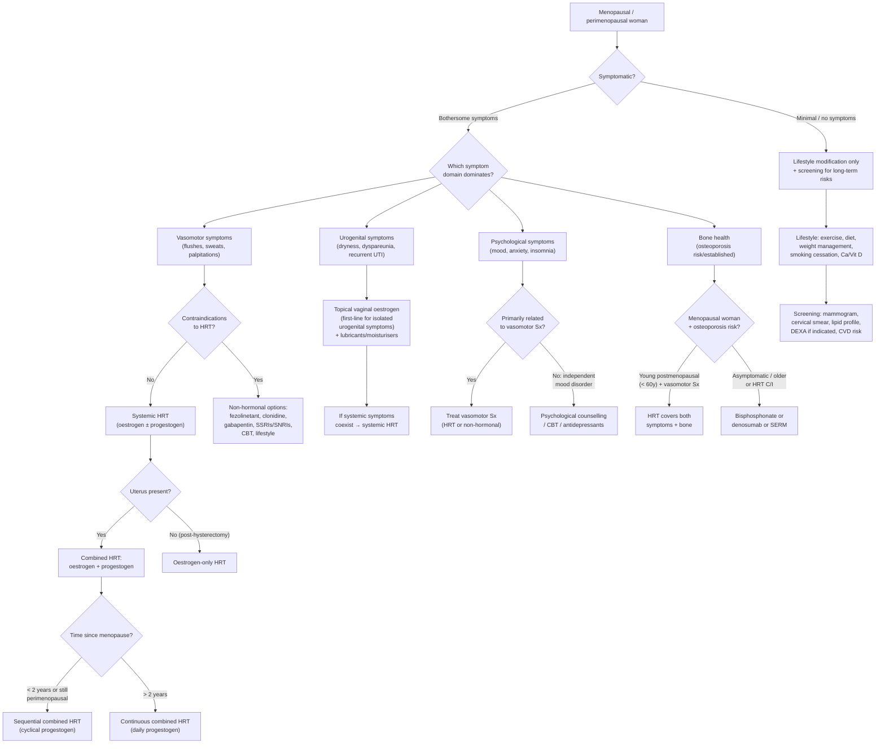

## Management of Climacteric Symptoms and Menopause

### Overarching Management Principles

Before jumping into specific treatments, let's establish the framework that should guide every clinical decision:

***Principles*** [3]:
1. ***Holistic bio-psycho-social approach for general health of a postmenopausal woman*** [3]
2. ***Physiological!: most do not require active treatment*** [3]
3. ***Important to deal with menopausal symptoms if any (important as ≥ 1/3 of most women's lifespan spent in postmenopausal years)*** [3]

Think of management as addressing three layers simultaneously:
- **Symptom relief** — vasomotor, psychological, urogenital, sexual
- **Prevention of long-term consequences** — osteoporosis, cardiovascular disease
- **General health promotion** — lifestyle, screening, psychosocial support

The key mantra for HRT is: ***lowest dose for shortest possible duration for symptom relief*** [3] — with the exception of POI, where HRT is replacement therapy, not treatment.

---

### Management Algorithm

---

### 1. Lifestyle Modification (For ALL Women)

***Lifestyle modifications*** are the foundation — applicable to every menopausal woman regardless of whether she takes HRT [1][3].

| Modification | Rationale / Mechanism |
|---|---|
| ***Air conditioning*** [1] | Keeps ambient temperature low → reduces the trigger for hot flushes (core temp less likely to exceed the narrowed thermoneutral zone) |
| ***Dressing in layers*** [1] | Allows rapid removal of clothing during a flush → facilitates heat dissipation and reduces discomfort |
| ***Avoiding alcohol and spicy food*** [1] | Both are vasodilators → lower the threshold for triggering flushes by widening peripheral vessels and raising skin temperature |
| ***Reducing obesity*** [1] | Adipose tissue is insulating → obese women have MORE severe flushes (they cannot dissipate heat efficiently despite higher peripheral oestrone from aromatisation). Also reduces cardiovascular and metabolic risk |
| ***Reducing stress*** [1] | Stress activates the sympathoadrenal axis → amplifies vasomotor and psychological symptoms |
| ***Cessation of smoking*** [3][12] | Smoking accelerates oestrogen metabolism (induces hepatic CYP1A2) → worsens oestrogen deficiency effects. Also independent CVD and osteoporosis risk factor |
| ***Weight-bearing exercise*** [3][12] | Mechanical loading stimulates osteoblasts → maintains BMD. Also improves mood (endorphins, serotonin), sleep quality, cardiovascular fitness, and metabolic health |
| ***Healthy diet, adequate Ca and vitamin D*** [3][12] | ***Ca (1200 mg/day) and vitamin D (800–1000 IU/day)*** for postmenopausal women to prevent secondary hyperparathyroidism and support bone mineralisation [12][4] |
| ***Sun exposure*** [4] | Cutaneous vitamin D synthesis (UVB converts 7-dehydrocholesterol → cholecalciferol). Important especially in institutionalised elderly |

---

### 2. Hormone Replacement Therapy (HRT) — The Cornerstone

#### 2a. What Is HRT?

HRT replaces the oestrogen (± progesterone) that the ovary no longer produces. It is the **most effective treatment for vasomotor symptoms** — nothing else comes close for moderate-to-severe hot flushes.

***Effective for treatment of severe climacteric symptoms and improves QoL*** [1]

***Can prevent or delay bone loss, and reduces both vertebral and non-vertebral fractures*** [1]

#### 2b. Indications

| Indication | Explanation |
|---|---|
| ***Premature menopause (< 40y): for bone and cardiac protection (no extra lifetime risk)*** [3] | POI patients have lost oestrogen decades early — HRT is **physiological replacement**, not pharmacological treatment. Continue until at least age 51 (average natural menopause). There is no increased lifetime risk because you are simply restoring what should have been there |
| ***Symptomatic menopausal patient: only for vasomotor symptoms ± mild mood disorder*** [3] | The primary indication for HRT in natural menopause. Must have bothersome symptoms — not for asymptomatic women |
| ***(Menopausal women with established osteoporosis)*** [3] | HRT is effective for osteoporosis but ***no longer indicated for osteoporosis ALONE*** [4] — use dedicated anti-resorptive agents unless vasomotor symptoms coexist, making HRT a dual-purpose choice |
| ***(Hypopituitarism and other endocrine diseases)*** [3] | Gonadotropin deficiency → hypogonadism → same principle as POI: replacement |
| ***Atrophic symptoms — topical oestrogen*** [1] | For isolated urogenital symptoms, topical (local) oestrogen is first-line — systemic HRT not needed unless systemic symptoms coexist |

***Timing: need not await amenorrhoea before starting HRT*** [3] — you can start in the perimenopause if symptoms are bothersome.

#### 2c. Choosing the Right Regimen

The fundamental rule: ***unopposed oestrogen is dangerous in women without hysterectomy as it can ↑ risk of CA endometrium*** [13]. Oestrogen stimulates endometrial proliferation; without progesterone to induce secretory transformation and shedding, the endometrium undergoes hyperplasia → increased risk of endometrial carcinoma.

| Clinical Scenario | Regimen | Rationale |
|---|---|---|
| ***Uterus present, < 2 years since menopause or perimenopausal*** | **Sequential (cyclical) combined HRT**: continuous oestrogen + cyclical progestogen for 12–14 days/month | Cyclical progestogen causes a predictable withdrawal bleed — mimics the normal cycle. Used early because continuous combined regimens cause erratic breakthrough bleeding if started too soon |
| ***Uterus present, > 2 years since menopause*** | **Continuous combined HRT**: continuous oestrogen + continuous progestogen daily | Aims for amenorrhoea (no withdrawal bleed). The endometrium is kept atrophic by constant progestogen. Breakthrough bleeding may occur in first 3–6 months but should settle |
| ***No uterus (post-hysterectomy)*** | **Oestrogen-only HRT** | No endometrium to protect → progestogen unnecessary (and carries its own risks: breast cancer, mood effects) |
| ***Isolated urogenital symptoms*** | **Topical vaginal oestrogen** (cream, pessary, ring) | Acts locally on vaginal/urethral epithelium; minimal systemic absorption → does NOT require progestogen even with uterus intact. Can be used alongside systemic HRT if needed |

#### 2d. Routes of Administration

***Understand the different routes of administering hormone replacement therapy*** [2]

##### Oestrogen Routes

| Route | Examples | Advantages | Disadvantages |
|---|---|---|---|
| **Oral** | Conjugated equine oestrogens (Premarin), oestradiol valerate, micronised 17β-oestradiol | Convenient, widely available, well-studied | First-pass hepatic metabolism → ↑ hepatic production of clotting factors (↑ VTE risk), ↑ SHBG, ↑ TG, ↑ CRP. Not ideal for women with VTE risk, migraine, hypertriglyceridaemia |
| **Transdermal (patch/gel)** | Oestradiol patches (25–100 μg), oestradiol gel | Bypasses first-pass effect → **lower VTE risk** (key advantage), stable serum levels, no effect on TG/SHBG/clotting factors | Skin irritation (patches), variable absorption (gel), less convenient |
| **Vaginal (topical)** | Oestriol cream, oestradiol vaginal tablet (Vagifem), oestradiol ring (Estring) | Targeted local effect, minimal systemic absorption, does not need progestogen cover, very safe long-term | Does NOT treat systemic symptoms (vasomotor, bone) |

<Callout title="Transdermal vs Oral — Exam Favourite">
The transdermal route is preferred when there is **increased VTE risk** (obesity, smoker, personal/family history of VTE, migraine with aura, hypertriglyceridaemia) because it avoids first-pass hepatic metabolism and therefore does NOT increase clotting factor production. The oral route increases hepatic synthesis of Factor VII, fibrinogen, and CRP → pro-thrombotic.
</Callout>

##### Progestogen Routes

***Progestogen types*** [1]:
- ***Oral*** [1]: medroxyprogesterone acetate (MPA), norethisterone, dydrogesterone, micronised progesterone (Utrogestan)
- ***Mirena® — levonorgestrel-releasing intrauterine system*** [1]: provides endometrial protection locally while minimising systemic progestogen exposure. Particularly useful for women who get progestogenic side effects (mood changes, bloating, breast tenderness) on oral progestogens

| Progestogen Type | Notes |
|---|---|
| **Micronised progesterone (Utrogestan)** | Closest to natural progesterone; better side-effect profile (less breast tenderness, better lipid profile, may be sedating → take at night → helps insomnia); associated with lower breast cancer risk than synthetic progestogens |
| **MPA** | The progestogen used in the WHI trial; associated with higher breast cancer risk than micronised progesterone |
| **LNG-IUS (Mirena)** | Local endometrial effect; minimal systemic absorption; can also serve as contraception in perimenopausal women; licensed for endometrial protection in HRT for 5 years |

#### 2e. Contraindications to HRT

***HRT Contraindications*** [1]:

| Contraindication | Rationale |
|---|---|
| ***Severe liver disease*** [1] | Oestrogen is hepatically metabolised; impaired clearance → accumulation; oral oestrogen ↑ hepatic protein synthesis → worsens portal hypertension/coagulopathy |
| ***Cerebrovascular disease*** [1] | HRT (especially oral) associated with slight ↑ stroke risk; avoid in active CVD |
| ***Deep vein thrombosis and embolism*** [1] | Oral oestrogen ↑ clotting factors → ↑ VTE risk. Note: **transdermal** route has minimal/no VTE risk and may be considered with specialist guidance in women with past VTE |
| ***Oestrogen-dependent tumours e.g. breast, uterus*** [1] | Oestrogen stimulates proliferation of ER+ cancer cells → risk of recurrence/progression |
| ***Undiagnosed uterine bleeding*** [1] | Must exclude endometrial carcinoma before starting HRT — you could mask or worsen malignant bleeding |

**Additional relative contraindications / cautions** (not explicitly on lecture slides but clinically important):
- Active or recent arterial thromboembolic disease (MI, stroke)
- Untreated endometrial hyperplasia
- Known thrombophilia (Factor V Leiden, protein C/S deficiency) — consider transdermal route
- Migraine with aura — use transdermal route or avoid systemic HRT
- Gallbladder disease — oral oestrogen ↑ cholesterol saturation of bile → ↑ gallstone risk
- SLE with antiphospholipid antibodies

#### 2f. Risks and Benefits — The Evidence (WHI and Beyond)

Understanding the WHI (Women's Health Initiative, 2002) and subsequent analyses is essential because it shaped — and initially distorted — clinical practice regarding HRT.

| Outcome | Effect of Combined HRT | Effect of Oestrogen-Only HRT | Clinical Interpretation |
|---|---|---|---|
| **Vasomotor symptoms** | ↓↓↓ (most effective treatment) | ↓↓↓ | Primary indication |
| **Fractures** | ↓ (~34% reduction in hip fracture) | ↓ (~39% reduction in hip fracture) | Proven bone protection; ***can prevent or delay bone loss, and reduces both vertebral and non-vertebral fractures*** [1] |
| **Breast cancer** | ***Slight ↑ risk*** [4] (RR ~1.26 for combined E+P after > 5 years) | No increase (possibly slight decrease) | Risk is attributable to the **progestogen** component, especially synthetic progestogens. Micronised progesterone may carry lower risk |
| **Endometrial cancer** | Neutral (progestogen protects) | ***↑ risk if unopposed*** → must add progestogen if uterus intact [4][13] | This is why combined HRT exists |
| **VTE** | ↑ (~2× risk, especially in first year) | ↑ (less than combined) | ***Venothrombolic disease (rare in Asians)*** [4]. Risk is primarily with **oral** route; transdermal carries negligible additional risk |
| **Stroke** | Slight ↑ (oral route) | Slight ↑ | Risk is small in absolute terms; lower with transdermal route |
| **Coronary heart disease** | ↑ if started > 10 years after menopause; neutral or ↓ if started < 10 years | ↓ if started < 10 years | **"Timing hypothesis"**: oestrogen is cardioprotective if started in the "window of opportunity" (< 60 years old or < 10 years post-menopause) while arteries are still healthy. Starting late, when atherosclerosis is established, may destabilise plaques |
| **Colorectal cancer** | ↓ (~37% reduction) | Neutral | Unexpected benefit |
| **Dementia** | ↑ if started > 65; no benefit if started early | Uncertain | Another reason not to start HRT in older women |

<Callout title="The Timing Hypothesis — Critical Concept">
The WHI initially alarmed everyone because it studied older women (mean age 63) who started HRT many years after menopause. The **increased cardiovascular risk applied to this older population**. Subsequent re-analyses and the Danish Osteoporosis Prevention Study showed that HRT started **within 10 years of menopause (or age < 60)** is associated with **reduced cardiovascular risk**. This is because healthy endothelium responds to oestrogen with ↑ NO and vasodilation, but atherosclerotic arteries respond to oestrogen with inflammation and plaque instability.
</Callout>

#### 2g. Follow-Up on HRT

***Follow-up*** [1][3]:

| Timepoint | What to Do |
|---|---|
| ***1st visit*** [3] | ***Baseline investigations: confirm menopause (FSH/LH/E2 if clinical features atypical), BP/P, urinalysis, lipid profile, LFT, bone biochemistry, TSH, mammography*** [3]. Choose suitable regimen |
| ***2nd visit in 2–4 months*** [3] | ***Assess patient's acceptance and compliance, symptom control, side effects*** [3] |
| ***Subsequent F/U every 6–12 months*** [3] | ***Routine PE: body weight, BP, urinalysis, general/thyroid/cardiac/chest/abdominal/breast/pelvic exam*** [3]. ***Routine investigations: cervical smear (Q3y), mammogram ± lipid profile, LFT, fasting glucose (Q2y), BMD if indicated*** [3] |
| ***Annual review*** [1] | ***Annual monitoring for the continual need*** [1] — reassess whether symptoms still warrant HRT |

***Side effects (usually transient)***: ***breast tenderness, fluid retention, bloating, nausea, headache, irregular bleeding*** [1][3]

***Bleeding pattern monitoring*** [3]:
- ***Breakthrough bleeding in first 6 months of treatment requires no immediate intervention*** [3]
- ***For combined cyclical regimen: if bleeding is not around time of progestin withdrawal or persistently irregular → endometrial biopsy*** [3]
- ***For continuous combined regimen: if bleeding occurs after achievement of amenorrhoea → endometrial biopsy*** [3]
- ***Report unscheduled bleeding promptly if it occurs after 3 months*** [1]

***Stopping HRT: no universal rule*** [3]:
- ***Principle = lowest dose for shortest possible duration for symptom relief*** [3]
- ***Exception: POI*** [3] — continue until at least age 51
- ***Cessation: tapering vs abrupt stop (no proven difference in clinical outcome); symptom recurrence*** [1] may occur in ~50% of women

---

### 3. Non-Hormonal Treatments

***Non-hormonal treatments*** [1] — used when HRT is contraindicated, declined by the patient, or as adjuncts:

#### 3a. For Vasomotor Symptoms

| Treatment | Mechanism | Evidence / Notes |
|---|---|---|
| ***Clonidine*** [1] | Central α₂-adrenergic agonist → reduces central sympathetic outflow and modulates thermoregulatory centre | Modest efficacy (~1–2 fewer flushes/day vs placebo). Side effects: dry mouth, drowsiness, postural hypotension. Historically one of the first non-hormonal options |
| ***Gabapentin*** [1] | Modulates voltage-gated Ca²⁺ channels → unclear exact mechanism for vasomotor relief, possibly stabilises thermoregulatory centre via GABAergic effects | Reduces flushes by ~50%. Side effects: dizziness, somnolence, peripheral oedema. Also helps with sleep |
| **Fezolinetant** (NK3 receptor antagonist) | Blocks neurokinin-3 receptors on KNDy neurons in the hypothalamic arcuate nucleus → directly targets the thermoregulatory dysfunction | FDA-approved 2023; reduces flushes by ~60%. The first mechanism-specific non-hormonal treatment. Well-tolerated; monitoring of LFTs recommended (rare hepatotoxicity). Not yet widely available in HK but rapidly entering international formularies |
| **SSRIs / SNRIs** (e.g., paroxetine, venlafaxine, escitalopram) | Serotonin modulates thermoregulation; ↑ serotonergic tone may widen thermoneutral zone | Paroxetine (Brisdelle) is FDA-approved specifically for menopausal vasomotor symptoms. ↓ flushes by ~40–65%. Also helpful if concurrent depression/anxiety. Note: paroxetine should be avoided in women on tamoxifen (inhibits CYP2D6 → ↓ active metabolite endoxifen) |
| ***Relaxation, lifestyle modifications*** [1] | Stress reduction → ↓ sympathetic activation → ↓ flush frequency. CBT has evidence for reducing the *distress* caused by flushes more than their frequency | Recommend as adjuncts |

#### 3b. For Psychological Symptoms

| Treatment | Details |
|---|---|
| ***Psychological counselling / therapy*** [1] | CBT is evidence-based for menopausal mood and anxiety symptoms; addresses the ***bio-psycho-social*** component |
| ***Antidepressants*** [1] | SSRIs (sertraline, escitalopram) or SNRIs (venlafaxine, duloxetine) for true clinical depression. HRT alone is NOT sufficient for major depressive disorder |
| **HRT** | ***HRT may improve mild depressive symptoms*** [3] — especially when mood disturbance is secondary to sleep disruption from night sweats. Not a primary antidepressant |

#### 3c. For Vaginal Atrophy / Urogenital Symptoms

| Treatment | Details |
|---|---|
| ***Lubricants*** [1] | Water-based or silicone-based lubricants during intercourse → immediate relief of friction-related dyspareunia. Does not treat underlying atrophy |
| ***Moisturisers*** [1] | Applied regularly (2–3×/week) to vaginal mucosa → improve hydration and reduce dryness independent of intercourse. E.g., Replens. Does not treat underlying atrophy |
| **Topical vaginal oestrogen** | ***First-line for urogenital atrophy*** [1]. Restores vaginal epithelial thickness, ↓ pH, restores Lactobacillus, improves vascularity and lubrication. Options: oestriol cream, oestradiol vaginal tablet (Vagifem — 10 μg), oestradiol ring (Estring). Minimal systemic absorption → safe long-term; can be used even in breast cancer survivors (with oncologist agreement for ultra-low-dose preparations) |
| **Ospemifene** (oral SERM) | Oestrogenic effect on vaginal epithelium; used for dyspareunia due to GSM. Not widely used in HK |

***Topical oestrogen for postmenopausal women: ↓ 75% incidence of cystitis in RCTs*** [14] — this is highly effective for reducing recurrent UTIs in postmenopausal women by restoring the vaginal microbiome and urethral mucosal integrity.

---

### 4. Management of Osteoporosis in the Menopausal Context

***Prevention and treatment of osteoporosis: not based on DXA alone, consider clinical risk factors*** [3]

#### 4a. Treatment Approach by Patient Profile

| Patient Profile | Preferred Agent | Rationale |
|---|---|---|
| ***Young, postmenopausal < 65y, no Hx of hip fracture → SERM vs HRT based on symptoms*** [3] | If vasomotor symptoms present → **HRT** (dual benefit). If asymptomatic → **SERM (raloxifene)** or **bisphosphonate** | HRT not indicated for bone alone; SERMs avoid VTE/breast risk differently |
| ***Postmenopausal > 65y → bisphosphonate, denosumab*** [3] | **Oral bisphosphonate** (alendronate 70 mg weekly) first-line; **denosumab** if intolerant | ***Hip fracture becomes more important at older age; start late to avoid risks of low bone turnover*** [3] |
| **Severe osteoporosis (T ≤ –3.5, fracture, or ↓ BMD on treatment)** | **Anabolic agents**: teriparatide, romosozumab | Build new bone before switching to anti-resorptive maintenance |

#### 4b. Pharmacological Options

##### i. Bisphosphonates

***Bisphosphonates: e.g., alendronate, risedronate, etidronate, ibandronate*** [3]

The name: "bis-phosphonate" = two phosphonate groups → structurally similar to pyrophosphate (PPi), a natural bone mineral component.

**Mechanism** [4]: ***Pyrophosphate derivative → binds onto bone surface → "ingested" by osteoclasts → competitive inhibitor of farnesyl pyrophosphate synthase (FPPS) in mevalonate pathway → specific inhibition of bone resorption + induction of osteoclast apoptosis*** [4]

| Parameter | Detail |
|---|---|
| **Effect** | ***↓ fracture risk by 50% in both vertebral and non-vertebral fractures (including hip)*** [4] |
| **Route** | Oral weekly (alendronate 70 mg, risedronate 35 mg) or IV (zoledronate 5 mg annually, ibandronate 3 mg Q3 months) |
| ***Side effects*** [3] | ***Upper GI upset (most common)*** → must take on empty stomach with full glass of water and remain upright for ≥ 30 minutes to reduce oesophageal irritation. ***Atypical femoral fractures*** (stress fractures of subtrochanteric femur with long-term use > 5 years). ***Osteonecrosis of the jaw*** (rare, mainly with IV bisphosphonates and dental procedures) [3] |
| ***Contraindication*** [3] | ***Deranged renal function*** (eGFR < 30–35 mL/min) — bisphosphonates are renally excreted and nephrotoxic at low GFR |

##### ii. SERMs (Selective Oestrogen Receptor Modulators)

***SERMs: e.g., raloxifene*** [3]

"SERM" = Selective Estrogen Receptor Modulator — these drugs act as oestrogen agonists in some tissues and antagonists in others.

| Parameter | Detail |
|---|---|
| ***MoA*** | ***Targeted agonist activity in bones without effect on breast/endometrium*** [3] |
| ***Bone effect*** | ***↓ vertebral but NOT non-vertebral fracture*** [3] — weaker than bisphosphonates |
| ***Other effects*** | ***↓ risk of breast cancer and endometrial cancer; beneficial effect on lipid profile*** [3] |
| ***Indications*** | ***NOT for menopausal symptoms (no effect) — asymptomatic women with fear of breast cancer who wish to prevent osteoporosis, especially those with risk factors for breast cancer*** [3] |
| ***Key limitation*** | ***Little/NO effect on acute menopausal symptoms, may even worsen vasomotor side effects*** [3] — raloxifene can CAUSE hot flushes |
| ***Side effects*** | ***VTE risk (same as oestrogen HRT), leg cramps, exacerbation of vasomotor symptoms*** [3] |

##### iii. Denosumab

**Denosumab** (Prolia): "de-" = against, "nosu-" = from "RANKL" (loosely), "-mab" = monoclonal antibody.

| Parameter | Detail |
|---|---|
| **MoA** | Fully human monoclonal antibody against RANKL → mimics OPG → prevents RANK-RANKL interaction → ↓ osteoclast differentiation, activity, and survival |
| **Route** | SC injection 60 mg every 6 months |
| **Effect** | ↓ vertebral, non-vertebral, and hip fracture risk |
| **Advantages** | ***Can be used if not tolerating bisphosphonate, poor compliance, or CKD*** [4] (no renal dose adjustment needed) |
| **Risks** | Rebound vertebral fractures if discontinued abruptly (must transition to bisphosphonate upon cessation); hypocalcaemia (ensure adequate Ca/vit D before starting); ONJ (rare); atypical femoral fracture (rare) |

##### iv. Anabolic Agents

| Agent | MoA | Notes |
|---|---|---|
| **Teriparatide** (recombinant PTH 1-34) | Intermittent PTH → preferentially stimulates osteoblasts → ↑ bone formation | SC daily injection × 2 years max. Used for severe osteoporosis. Followed by anti-resorptive to maintain gains |
| **Romosozumab** (anti-sclerostin antibody) | Sclerostin (produced by osteocytes) normally inhibits Wnt signalling → inhibits bone formation. Blocking sclerostin → ↑ bone formation AND ↓ bone resorption | SC monthly × 12 months. Dual action. CV safety concern (avoid in recent MI/stroke). Approved 2019 [4] |

##### v. HRT for Osteoporosis

***HRT: mainly in early menopause*** [4]

***Mechanism: ↓ bone resorption, ↓ urinary Ca excretion, ↓ stromal cell cytokine production → ↓ osteoclastogenesis*** [4]

***Additional advantage: ↓ menopausal symptoms*** [4]

***Disadvantage: ↑ risk of CA endometrium → must add progestogen if uterus intact; slight ↑ risk of CA breast and CA cervix; venothrombolic disease (rare in Asians)*** [4]

***NO longer indicated for osteoporosis ALONE; can be used if vasomotor symptoms*** [4]

---

### 5. Cardiovascular Risk Management

***Cardiovascular health*** [3]:
- ***Healthy lifestyle: diet, exercise, avoid smoking*** [3]
- ***Control of predisposing factors: e.g., hypertension, DM, lipids, obesity*** [3]

HRT is **NOT indicated for primary cardiovascular prevention** (despite oestrogen's favourable lipid effects). The timing hypothesis suggests benefit only in the early postmenopausal window, but this is not sufficient evidence to use HRT solely for cardiovascular protection.

---

### 6. Special Population: Premature Ovarian Insufficiency (POI)

***Primary ovarian insufficiency (premature menopause)*** [3]:

| Principle | Detail |
|---|---|
| **HRT is mandatory, not optional** | This is replacement of oestrogen that should physiologically be present — NOT "treatment" |
| **Duration** | Continue until at least age 51 (average natural menopause). ***No extra lifetime risk*** [3] because total oestrogen exposure matches normal women |
| **Regimen** | HRT or COCP (young women may prefer the pill for social reasons and contraceptive benefit) |
| **Bone protection** | Start early — these women have decades of oestrogen deficiency → high cumulative fracture risk |
| **Fertility** | 5–10% of POI women have intermittent ovarian function and can spontaneously conceive. Counsel about contraception if pregnancy not desired. Refer to reproductive medicine for fertility options (donor oocyte IVF) |
| **Psychological support** | Diagnosis of POI at a young age carries significant emotional impact — grief over lost fertility, premature ageing concerns. Formal psychological support should be offered |

---

### 7. Management Summary by Symptom Domain

| Symptom Domain | First-Line | Second-Line / Adjuncts |
|---|---|---|
| ***Vasomotor*** | **Systemic HRT** (if no C/I) | ***Clonidine, gabapentin***, SSRIs/SNRIs, fezolinetant, ***relaxation, lifestyle*** [1] |
| ***Urogenital*** | ***Topical vaginal oestrogen + lubricants/moisturisers*** [1] | Ospemifene; systemic HRT if systemic symptoms coexist |
| ***Psychological*** | ***Psychological counselling/therapy; antidepressants*** [1] | HRT for mild mood symptoms secondary to vasomotor Sx [3] |
| ***Sexual*** | Treat underlying cause (vaginal oestrogen for dyspareunia; psychosexual counselling for desire issues) | Testosterone (off-label, low-dose transdermal) for persistent ↓ libido unresponsive to oestrogen therapy |
| ***Osteoporosis*** | Lifestyle + Ca/Vit D. Pharmacotherapy if T ≤ –2.5 or high FRAX | ***HRT if < 65 + symptomatic; bisphosphonate/denosumab if > 65 or C/I to HRT; SERM if breast cancer concern*** [3] |
| ***CVD risk*** | Lifestyle modification, control risk factors | **Not HRT for CVD prevention alone** |

---

<Callout title="High Yield Summary">

**HRT Core Rules:**
1. ***Most effective treatment for vasomotor symptoms; improves QoL*** [1]
2. ***Lowest dose for shortest possible duration*** [3] (exception: POI → until age 51)
3. **Uterus present** → must add progestogen (otherwise → endometrial cancer risk)
4. **No uterus** → oestrogen only
5. **< 2y post-menopause** → sequential combined (withdrawal bleed)
6. **> 2y post-menopause** → continuous combined (aim for amenorrhoea)
7. **Transdermal route** → preferred if ↑ VTE risk (avoids first-pass hepatic effect)

**Contraindications to HRT** [1]: ***severe liver disease, cerebrovascular disease, DVT/PE, oestrogen-dependent tumours (breast, uterus), undiagnosed uterine bleeding***

**Non-hormonal options** [1]: ***clonidine, gabapentin, relaxation, lifestyle*** for vasomotor; ***psychological counselling, antidepressants*** for mood; ***lubricants, moisturisers*** for vaginal atrophy

**Osteoporosis management** [3]:
- Young symptomatic → HRT (dual benefit)
- Asymptomatic with breast cancer concern → SERM (raloxifene)
- Older (> 65) → bisphosphonate or denosumab
- Severe → anabolic agent (teriparatide, romosozumab)

**POI** → HRT is mandatory replacement, not optional treatment; continue until at least age 51

</Callout>

---

<ActiveRecallQuiz
  title="Active Recall - Management of Climacteric Symptoms and Menopause"
  items={[
    {
      question: "A 52-year-old woman with an intact uterus, 3 years postmenopausal, has severe hot flushes. What HRT regimen would you prescribe and why?",
      markscheme: "Continuous combined HRT: continuous oestrogen plus continuous progestogen daily. Continuous combined regimen is chosen because she is more than 2 years postmenopausal. Progestogen is mandatory because her uterus is intact (to prevent endometrial hyperplasia/cancer from unopposed oestrogen). Aim is amenorrhoea."
    },
    {
      question: "List the five contraindications to HRT stated in the lecture slides.",
      markscheme: "1. Severe liver disease. 2. Cerebrovascular disease. 3. Deep vein thrombosis and pulmonary embolism. 4. Oestrogen-dependent tumours (e.g. breast, uterus). 5. Undiagnosed uterine bleeding."
    },
    {
      question: "Explain why the transdermal route of oestrogen is preferred over oral in a woman with a history of DVT.",
      markscheme: "Oral oestrogen undergoes first-pass hepatic metabolism, stimulating hepatic production of clotting factors (Factor VII, fibrinogen, CRP) leading to increased VTE risk. Transdermal oestrogen bypasses the liver, enters the systemic circulation directly, and does not significantly increase clotting factor production. Studies show negligible additional VTE risk with transdermal route."
    },
    {
      question: "A 38-year-old woman is diagnosed with POI. How does HRT management differ from a 52-year-old woman with natural menopause?",
      markscheme: "In POI, HRT is physiological replacement, not treatment. It must continue until at least age 51 (average age of natural menopause) because the patient is missing oestrogen that should naturally be present. There is no extra lifetime risk from HRT in POI. The priority is bone and cardiovascular protection from decades of premature oestrogen deficiency, in addition to symptom relief. Fertility counselling and psychological support are also important."
    },
    {
      question: "Compare raloxifene and bisphosphonates for osteoporosis management in a postmenopausal woman: fracture reduction, vasomotor effects, and breast cancer risk.",
      markscheme: "Raloxifene: reduces vertebral fractures only (NOT non-vertebral or hip); may WORSEN vasomotor symptoms; REDUCES breast cancer risk. Bisphosphonates: reduce both vertebral AND non-vertebral fractures including hip (50% risk reduction); no effect on vasomotor symptoms; no effect on breast cancer risk. Both carry VTE risk. Bisphosphonates are generally preferred for stronger fracture protection; raloxifene for women with breast cancer concerns who are asymptomatic."
    },
    {
      question: "Name three non-hormonal pharmacological options for menopausal vasomotor symptoms and briefly state the mechanism of each.",
      markscheme: "1. Clonidine: central alpha-2 adrenergic agonist, reduces central sympathetic outflow modulating the thermoregulatory centre. 2. Gabapentin: modulates voltage-gated calcium channels, stabilises thermoregulatory centre via GABAergic effects. 3. Fezolinetant: neurokinin-3 receptor antagonist, blocks NKB signalling on KNDy neurons in hypothalamic arcuate nucleus, directly targeting the thermoregulatory dysfunction. Also acceptable: SSRIs/SNRIs (increase serotonergic tone, widen thermoneutral zone)."
    }
  ]}
/>

## References

[1] Lecture slides: Block C - Climacteric symptoms_ menopause and related illness; amenorrhoea.pdf (p23, p27)
[2] Lecture slides: GC 114. Climacteric symptoms menopause and related illness; amenorrhoea.pdf (p3)
[3] Senior notes: Adrian Lui Gynecology Notes.pdf (p31–33, p36, p38)
[4] Senior notes: Ryan Ho Endocrine.pdf (p50–51)
[12] Senior notes: Maksim Medicine Notes.pdf (p109)
[13] Senior notes: Ryan Ho Endocrine.pdf (p113)
[14] Senior notes: Ryan Ho Urogenital.pdf (p126)
