## Differential Diagnosis of Dysmenorrhea

When a woman presents with painful menstruation, the clinical task is twofold: (1) **Is this primary or secondary dysmenorrhea?** and (2) **If secondary, what is the underlying cause?** But more broadly, you must also consider non-gynaecological causes of cyclical or chronic pelvic pain that can masquerade as or coexist with dysmenorrhea. Think of dysmenorrhea not just as a diagnosis but as a **symptom** — and approach it the way you would any pelvic pain, with a systematic differential.

### Organising Framework for the Differential Diagnosis

The best way to build a differential for dysmenorrhea is to categorise by **organ system** (gynaecological vs. non-gynaecological) and then within gynaecological causes, by whether the pathology involves the **uterus, ovaries/adnexae, or pelvic peritoneum/other structures**. This mirrors how you examine the patient and how imaging is interpreted.

***Don't forget about pregnancy → especially for teenage girls*** — a pregnancy test should be performed in any woman of reproductive age presenting with pelvic pain [1][4].

```mermaid
graph TD
    A["Dysmenorrhea / Cyclical Pelvic Pain"] --> B["Gynaecological Causes"]
    A --> C["Non-Gynaecological Causes"]
    
    B --> D["Uterine"]
    B --> E["Ovarian / Adnexal"]
    B --> F["Pelvic Peritoneum / Other"]
    
    D --> D1["Primary dysmenorrhea"]
    D --> D2["Adenomyosis"]
    D --> D3["Uterine fibroids"]
    D --> D4["Endometrial polyps"]
    D --> D5["Cervical stenosis"]
    D --> D6["Uterine anomalies"]
    D --> D7["Cu-IUD related"]
    
    E --> E1["Endometriosis"]
    E --> E2["Ovarian cysts"]
    E --> E3["Ovarian torsion"]
    E --> E4["Mittelschmerz"]
    
    F --> F1["PID / Endometritis"]
    F --> F2["Adhesions"]
    F --> F3["Ectopic pregnancy"]
    
    C --> G["Gastrointestinal"]
    C --> H["Urological"]
    C --> I["Musculoskeletal"]
    C --> J["Psychogenic"]
    
    G --> G1["IBS"]
    G --> G2["IBD"]
    G --> G3["Appendicitis"]
    
    H --> H1["Interstitial cystitis"]
    H --> H2["Ureteric colic"]
    H --> H3["UTI"]
    
    I --> I1["Myofascial pelvic pain"]
    
    J --> J1["Somatoform / Central sensitisation"]
```

---

### A. Gynaecological Causes

#### 1. Primary Dysmenorrhea (Diagnosis of Exclusion)

- As discussed in the previous section, this is pain caused by **excessive prostaglandin production** in the absence of pelvic pathology
- It is placed first in the differential because it is the **most common cause** overall, but it remains a **diagnosis of exclusion** — you must rule out secondary causes, especially when there are red flags
- **Key features that point towards primary**: onset 1–2 years post-menarche, pain coinciding with menses onset (not preceding it by days), duration 48–72h, responds to NSAIDs/COCP, normal pelvic examination

#### 2. Endometriosis

- ***The most common cause of secondary dysmenorrhea*** [1]
- Ectopic endometrial-like tissue (most commonly on the ovaries, uterosacral ligaments, peritoneum of the pouch of Douglas, and rectovaginal septum) undergoes cyclical hormonal stimulation → local bleeding, inflammation, adhesion formation
- **Why does it cause dysmenorrhea?** The ectopic tissue produces prostaglandins locally + peritoneal inflammation irritates nociceptors + adhesions distort pelvic anatomy and tether organs, pulling with movement and uterine contraction
- **Distinguishing features**: pain typically **starts before menstruation** (often 1–2 days before flow) and may persist into the post-menstrual period; ***deep dyspareunia, dyschezia*** (painful defecation, especially during menses — suggesting rectovaginal involvement), ***dysuria during menses*** (bladder involvement), ***subfertility***
- **Examination**: ***tender nodularity in the pouch of Douglas*** on rectovaginal examination; fixed retroverted uterus (adhesions)
- Endometriomas ("chocolate cysts") on the ovary may present as an ***ovarian/pelvic mass*** [1][2]

#### 3. Adenomyosis

- Endometrial glands and stroma infiltrate the myometrium → the muscle hypertrophies around these foci → the uterus becomes globally enlarged and contracts abnormally
- **Why does it cause dysmenorrhea?** The ectopic endometrial tissue within the myometrium bleeds cyclically → local inflammation + disrupted myometrial architecture → abnormal, painful contractions; also ↑ local prostaglandin and cytokine production
- **Distinguishing features**: ***progressively worsening dysmenorrhea and menorrhagia*** in a ***multiparous woman, typically > 35 years***; uterus is ***uniformly enlarged, globular, and tender ("boggy")*** on examination [2]
- Often coexists with endometriosis (up to 70% overlap in some series)

#### 4. Uterine Fibroids (Leiomyomata)

- ***Benign smooth muscle tumours of the myometrium; the most common pelvic tumour in women*** [2]
- **Why do they cause dysmenorrhea?** Depends on type:
  - ***Submucosal fibroids***: distort the endometrial cavity → ↑ surface area for bleeding → menorrhagia; the uterus contracts forcefully to try to expel the fibroid (like expulsive labour contractions) → severe crampy pain
  - ***Intramural fibroids***: compress surrounding myometrium and vasculature → ischaemia → pain; may also distort cavity
  - ***Pedunculated submucous fibroids*** may prolapse through the cervix → intense cramping as the uterus attempts expulsion
  - Red degeneration (haemorrhagic infarction, classically in pregnancy) causes acute pain
- **Distinguishing features**: ***menorrhagia (most common symptom)***, ***pressure symptoms*** (urinary frequency, constipation, abdominal distension), ***irregularly enlarged, firm, non-tender uterus with palpable discrete lumps*** on examination [2]
- ***Fibroids are oestrogen- and progesterone-dependent → grow during reproductive years, may shrink after menopause*** [2]
- ***Uterine fibroid, ovarian mass and cancer are important differential diagnoses of pelvic mass*** [2][5]

#### 5. Pelvic Inflammatory Disease (PID)

- Ascending infection from the lower genital tract (commonly *Chlamydia trachomatis*, *Neisseria gonorrhoeae*) → endometritis → salpingitis → ± tubo-ovarian abscess
- **Why does it cause dysmenorrhea?** Chronic endometritis causes ongoing endometrial inflammation → altered prostaglandin production and pain signalling; pelvic adhesions from prior acute PID can cause chronic pelvic pain that worsens with menses (because uterine contractions pull on adhesions)
- **Distinguishing features**: ***lower abdominal pain (usually bilateral and lower than appendicitis), exacerbated by coitus (dyspareunia), abnormal vaginal discharge, fever, cervical motion tenderness (chandelier sign), adnexal tenderness*** [4][6]
- Acute PID is more of an emergency presentation; chronic/subclinical PID contributes to chronic dysmenorrhea

#### 6. Ovarian Cysts and Masses

- ***Ovarian cysts may present as pelvic mass ± pain*** [2]
- Functional cysts (follicular, corpus luteum) can cause cyclical pain if they:
  - **Rupture**: sudden onset lower abdominal pain, often with strenuous physical activity; may cause haemoperitoneum → peritoneal irritation [6]
  - **Undergo torsion**: acute onset pain, often with waves of nausea and vomiting ± fever (if necrosis) [6]
  - **Bleed internally** (haemorrhagic cyst): acute unilateral pain
- Endometriomas: cyclical pain due to hormonally responsive tissue within the cyst → strongly associated with endometriosis [2]
- Mature cystic teratomas (dermoid cysts): usually asymptomatic but can torse or rupture (chemical peritonitis if contents spill) [6]
- **Key point**: ovarian cyst complications (rupture, torsion, haemorrhage) tend to cause **acute** pelvic pain rather than cyclical dysmenorrhea, but should always be in the differential, especially in acute presentations [4]

#### 7. Endometrial Polyps

- Localised hyperplasia of endometrial glands and stroma that protrude into the uterine cavity
- **Why do they cause pain?** The uterus may contract to try to expel the polyp (similar mechanism to submucous fibroids). They also cause irregular and heavy bleeding.
- **Distinguishing features**: intermenstrual bleeding, menorrhagia, postmenopausal bleeding; often incidental finding on ultrasound

#### 8. Cervical Stenosis

- Narrowing of the cervical canal — congenital or acquired (post-cone biopsy, LLETZ, radiation, menopause-related atrophy)
- **Why does it cause pain?** Obstructed outflow of menstrual blood → ↑ intrauterine pressure → the uterus must contract more forcefully to expel menstrual debris → ischaemic pain. In severe cases → **haematometra** (blood accumulation in the uterus)
- **Distinguishing features**: scanty menstrual flow, severe cramping, history of cervical procedures

#### 9. Uterine Anomalies (Müllerian Anomalies)

- Congenital malformations (e.g., unicornuate uterus with a non-communicating rudimentary horn, bicornuate uterus, septate uterus, obstructed hemivagina)
- **Why does it cause pain?** Obstructed outflow from one horn or compartment → blood accumulates → distension → severe pain. May present as "primary dysmenorrhea" in adolescents that doesn't respond to standard treatment
- **Distinguishing features**: severe dysmenorrhea from menarche, non-responsive to NSAIDs/COCP, ± pelvic mass (haematometra/haematocolpos), history of associated renal anomalies (Müllerian and renal development are linked embryologically)

#### 10. Intrauterine Device (Copper IUD)

- **Why does it cause pain?** Foreign body reaction in the endometrium → local inflammatory response → ↑ prostaglandin production → worsened uterine contractility and pain
- **Distinguishing features**: temporal relationship — dysmenorrhea (and often menorrhagia) begins or worsens after IUD insertion, typically most pronounced in the first 3–6 months
- Note: the **levonorgestrel-releasing IUS (Mirena)** actually *reduces* dysmenorrhea (by causing endometrial atrophy → ↓ prostaglandin production)

#### 11. Ectopic Pregnancy

- Must always be considered in a **woman of reproductive age** presenting with pelvic pain ± vaginal bleeding [4][6]
- **Why does it cause pain?** An implanted embryo outside the uterine cavity (most commonly in the fallopian tube) grows → distends the tube → pain. If it ruptures → haemoperitoneum → acute abdomen, haemodynamic instability
- **Distinguishing features**: missed or late period, positive pregnancy test, unilateral adnexal pain, cervical excitation tenderness, ± vaginal spotting, ± shoulder tip pain (diaphragmatic irritation from haemoperitoneum)
- ***Always perform a pregnancy test in any woman of reproductive age with acute pelvic pain*** [4]

#### 12. Mittelschmerz ("Middle Pain")

- Mid-cycle lower abdominal/pelvic pain occurring at ovulation (~day 14)
- **Why does it cause pain?** Follicular rupture during ovulation → release of follicular fluid (which may contain blood) onto the peritoneum → mild peritoneal irritation [6]
- **Distinguishing features**: occurs **mid-cycle** (not with menses), unilateral, mild and self-limiting (hours to 1–2 days), alternates sides month-to-month

---

### B. Non-Gynaecological Causes

These are important because they can mimic or coexist with dysmenorrhea and are easily missed if you have "tunnel vision" on gynaecological causes.

#### 1. Gastrointestinal

| Condition | Why It Mimics Dysmenorrhea | Distinguishing Features |
|---|---|---|
| ***Irritable bowel syndrome (IBS)*** | IBS symptoms (crampy abdominal pain, bloating, altered bowel habit) frequently **worsen during menstruation** due to prostaglandin effects on GI smooth muscle. ***IBS is associated with dysmenorrhea*** [3]. Shared pathophysiology: visceral hypersensitivity, central sensitisation. | Pain associated with defecation (improves or worsens with bowel movements); altered bowel habit (diarrhoea, constipation, or mixed); bloating prominent; meets Rome IV criteria |
| ***Inflammatory bowel disease (IBD)*** — Crohn's, UC | Chronic pelvic/abdominal pain may flare cyclically; bowel endometriosis can mimic IBD | Bloody diarrhoea (UC), right iliac fossa pain (Crohn's), weight loss, extra-intestinal manifestations, raised inflammatory markers |
| ***Appendicitis*** | Acute right iliac fossa pain can overlap with right-sided ovarian pathology or dysmenorrhea | Migratory pain (periumbilical → RIF), anorexia, fever, RIF tenderness with guarding, elevated WCC/CRP; acute onset, not cyclical [4][6] |

<Callout title="IBS and Dysmenorrhea — A Common Overlap" type="idea">
Up to 50% of women with IBS report worsening of GI symptoms during menstruation, and women with dysmenorrhea have higher rates of IBS. This makes clinical sense: prostaglandins released during menstruation stimulate smooth muscle contraction throughout the body, including the bowel. Additionally, both conditions involve **visceral hypersensitivity** — a lowered threshold for pain perception in hollow viscera. Always ask about bowel symptoms in a woman presenting with dysmenorrhea, and ask about menstrual pain in a woman presenting with IBS [3].
</Callout>

#### 2. Urological

| Condition | Why It Mimics Dysmenorrhea | Distinguishing Features |
|---|---|---|
| ***Interstitial cystitis / Painful bladder syndrome*** | Chronic suprapubic/pelvic pain that may worsen with menses (hormonal influence on bladder mucosa); coexists with dysmenorrhea and IBS in many women | Pain related to bladder filling, relieved by voiding; urinary frequency and urgency (often > 8×/day); absence of infection on MSU; diagnosis of exclusion [7] |
| ***UTI / Cystitis*** | Suprapubic pain, dysuria | Storage LUTS (frequency, urgency, dysuria), turbid/bloody urine, positive urine dipstick/culture [7] |
| ***Ureteric colic*** | Acute loin-to-groin pain can overlap with pelvic pain | Colicky pain that waxes and wanes (20–60 min episodes), loin tenderness, haematuria, history of renal stones [7] |

#### 3. Musculoskeletal

| Condition | Why It Mimics Dysmenorrhea | Distinguishing Features |
|---|---|---|
| **Myofascial pelvic pain / Pelvic floor dysfunction** | Trigger points in pelvic floor muscles can cause chronic pelvic pain that may worsen with menses (hormonal effects on muscle tone) | Tender trigger points on pelvic floor examination; pain reproduced by palpation of specific muscles; not temporally linked to menstrual flow per se |
| **Musculoskeletal back pain** | Lower back pain can be confused with the back component of dysmenorrhea | Not cyclical, related to movement/posture, no suprapubic component, no menstrual timing |

#### 4. Psychogenic / Functional

| Condition | Why It Mimics Dysmenorrhea | Distinguishing Features |
|---|---|---|
| ***Somatoform/somatic symptom disorder*** | Chronic pelvic pain without identifiable cause; ≥1 somatic symptom a/w distress and/or functional impairment; excessive thoughts/anxiety about symptoms [8] | Multiple somatic symptoms across organ systems, persistent (≥6 months), excessive health-related anxiety, functional impairment disproportionate to findings; diagnosis of exclusion after thorough workup |
| **Central sensitisation / Chronic pelvic pain syndrome** | After prolonged nociceptive input (e.g., from chronic endometriosis), the CNS can undergo central sensitisation → pain persists even after the original cause is treated | Pain persists despite adequate treatment of identifiable cause; widespread tenderness; often coexists with fibromyalgia, IBS, chronic fatigue |

<Callout title="Don't Forget These Non-Gynaecological Mimics" type="error">
A common exam and clinical mistake is to attribute all pelvic pain in a menstruating woman to dysmenorrhea without considering the GI, urological, and musculoskeletal differentials. Appendicitis, ectopic pregnancy, and ovarian torsion are **surgical emergencies** that present with acute pelvic pain. Always ask about bowel symptoms, urinary symptoms, and pregnancy in your history. Always do a pregnancy test.
</Callout>

---

### C. Approach to Differentiating Primary vs. Secondary Dysmenorrhea and Narrowing the Differential

***History and physical examination usually help to suggest a diagnosis*** [5].

The following table summarises the key historical and examination features that help narrow the differential:

| Feature | Favours Primary | Favours Secondary | Specific Cause Suggested |
|---|---|---|---|
| **Age of onset** | Adolescent (1–2y post-menarche) | > 25 years or new-onset in previously pain-free woman | — |
| **Temporal pattern** | Pain starts with menses, lasts ≤ 3 days | Pain starts days before menses, persists after | Pre-menstrual onset → endometriosis |
| **Progression** | Stable or improving | Progressive worsening | Endometriosis, adenomyosis, growing fibroid |
| **Menstrual flow** | Normal | Heavy (menorrhagia) | Fibroids, adenomyosis, polyps, Cu-IUD |
| **Dyspareunia** | Absent | Deep dyspareunia | Endometriosis, adenomyosis |
| **Dyschezia** | Absent | Painful defecation during menses | Rectovaginal endometriosis |
| **Subfertility** | Absent | Present | Endometriosis, PID (tubal damage) |
| **Vaginal discharge** | Absent | Abnormal/purulent discharge | PID |
| **Fever** | Absent | Present | PID, tubo-ovarian abscess, torsion with necrosis |
| **Pelvic exam** | Normal | Abnormal | See below |
| **Response to NSAIDs/COCP** | Good (80%) | Poor | Consider secondary cause if non-responsive |
| **Pregnancy test** | Negative | Positive | Ectopic pregnancy |

**Examination findings pointing to specific diagnoses:**

| Examination Finding | Suggested Diagnosis |
|---|---|
| ***Normal pelvic examination*** | Primary dysmenorrhea |
| ***Uniformly enlarged, globular, boggy, tender uterus*** | Adenomyosis [2] |
| ***Irregularly enlarged, firm uterus with discrete lumps*** | Uterine fibroids [2] |
| ***Tender nodularity in pouch of Douglas*** | Endometriosis |
| ***Fixed, retroverted uterus*** | Endometriosis (adhesions) |
| ***Cervical motion tenderness + adnexal tenderness*** | PID or ectopic pregnancy |
| ***Adnexal mass*** | Ovarian cyst, endometrioma, ectopic pregnancy, tubo-ovarian abscess [2] |
| ***Absent/scanty menstrual flow with severe pain*** | Cervical stenosis, outflow obstruction |

---

### D. Summary Table: Complete Differential Diagnosis of Dysmenorrhea

| Category | Condition | Key Differentiating Feature |
|---|---|---|
| **Primary** | Primary dysmenorrhea | Normal pelvic exam, onset in adolescence, responds to NSAIDs/COCP |
| **Secondary — Uterine** | Adenomyosis | Multiparous, > 35y, boggy tender uterus, menorrhagia |
| | Uterine fibroids | Irregular firm uterus, menorrhagia, pressure symptoms |
| | Endometrial polyps | Intermenstrual/irregular bleeding |
| | Cervical stenosis | Scanty flow, severe cramping, Hx of cervical procedure |
| | Cu-IUD | Temporal relationship with IUD insertion |
| | Uterine anomalies | Severe from menarche, non-responsive, associated renal anomalies |
| **Secondary — Ovarian/Adnexal** | Endometriosis | Pre-menstrual pain, dyspareunia, dyschezia, subfertility, nodularity in POD |
| | Ovarian cyst complications | Acute onset, unilateral, ± nausea/vomiting (torsion) |
| | Mittelschmerz | Mid-cycle, unilateral, self-limiting |
| **Secondary — Pelvic** | PID | Bilateral pain, discharge, fever, cervical motion tenderness |
| | Adhesions | History of surgery/PID/endometriosis, chronic pain |
| | Ectopic pregnancy | Positive pregnancy test, missed period, adnexal pain, spotting |
| **Non-gynae — GI** | IBS | Bowel symptoms, Rome IV criteria, worsens with menses |
| | IBD | Bloody diarrhoea, weight loss, raised CRP |
| | Appendicitis | Acute, migratory RIF pain, fever, peritonism |
| **Non-gynae — Urological** | Interstitial cystitis | Bladder pain related to filling, frequency, no infection |
| | UTI | Dysuria, frequency, urgency, positive MSU |
| | Ureteric colic | Colicky loin-to-groin pain, haematuria |
| **Non-gynae — Other** | Myofascial pelvic pain | Trigger points, not cyclical |
| | Somatoform disorder | Multiple unexplained symptoms, excessive health anxiety |

---

<Callout title="High Yield Summary">

**Most common cause of dysmenorrhea overall**: Primary dysmenorrhea (diagnosis of exclusion — normal pelvic exam required).

**Most common cause of secondary dysmenorrhea**: Endometriosis.

**Top gynaecological differentials for secondary dysmenorrhea**: Endometriosis, adenomyosis, uterine fibroids, PID, ovarian cysts.

**Non-gynaecological mimics to never forget**: IBS (very common overlap), interstitial cystitis, appendicitis, ectopic pregnancy (always do a pregnancy test!).

**Red flags for secondary cause**: Late onset, progressive worsening, pre-menstrual pain onset, menorrhagia, dyspareunia, dyschezia, subfertility, abnormal exam, failure of NSAIDs/COCP.

**Emergency differentials in acute pelvic pain**: Ectopic pregnancy (ruptured), ovarian torsion, ruptured ovarian cyst, PID/tubo-ovarian abscess, appendicitis — these are **time-critical** and must be excluded before attributing pain to dysmenorrhea.

**Classify pelvic mass differentials into**: gynaecological (uterine vs. ovarian) and non-gynaecological (GI, urological, retroperitoneal) [1][2][5].

</Callout>

---

<ActiveRecallQuiz
  title="Active Recall - Differential Diagnosis of Dysmenorrhea"
  items={[
    {
      question: "Name the 5 most important gynaecological causes of secondary dysmenorrhea and give one distinguishing feature for each.",
      markscheme: "1. Endometriosis - pre-menstrual onset of pain, deep dyspareunia, dyschezia, subfertility, tender nodularity in POD. 2. Adenomyosis - uniformly enlarged boggy tender uterus, menorrhagia, multiparous woman over 35. 3. Uterine fibroids - irregularly enlarged firm uterus, menorrhagia, pressure symptoms. 4. PID - bilateral pain, abnormal vaginal discharge, cervical motion tenderness, fever. 5. Ovarian cysts/endometriomas - adnexal mass on exam or USS, acute pain if rupture or torsion."
    },
    {
      question: "A 16-year-old girl presents with acute severe lower abdominal pain. What is the single most important investigation to perform before attributing this to dysmenorrhea, and why?",
      markscheme: "Urine pregnancy test. Must exclude ectopic pregnancy as it is a life-threatening emergency. Any woman of reproductive age with acute pelvic pain must have pregnancy excluded regardless of reported sexual history."
    },
    {
      question: "Explain why IBS symptoms commonly worsen during menstruation and what pathophysiological mechanism is shared between IBS and primary dysmenorrhea.",
      markscheme: "Prostaglandins (PGF2-alpha and PGE2) released from the shedding endometrium enter the systemic circulation and stimulate smooth muscle contraction in the GI tract, worsening IBS symptoms. Both conditions share visceral hypersensitivity (lowered threshold for pain perception in hollow viscera) and central sensitisation as common pathophysiological mechanisms."
    },
    {
      question: "How would you distinguish endometriosis from adenomyosis on pelvic examination?",
      markscheme: "Endometriosis: tender nodularity in the pouch of Douglas on rectovaginal examination, uterus may be fixed and retroverted due to adhesions but is normal size. Adenomyosis: uterus is uniformly enlarged, globular, boggy and tender, but no discrete nodules in the POD. Adenomyosis causes symmetrical enlargement whereas fibroids cause irregular enlargement."
    },
    {
      question: "Name 4 emergency (time-critical) differential diagnoses in a woman presenting with acute pelvic pain that must be excluded before considering dysmenorrhea.",
      markscheme: "1. Ruptured ectopic pregnancy. 2. Ovarian torsion. 3. Ruptured ovarian cyst with haemoperitoneum. 4. Acute appendicitis. Others acceptable: tubo-ovarian abscess, ruptured PID."
    },
    {
      question: "A woman with dysmenorrhea fails to respond to NSAIDs and the combined oral contraceptive pill. What does this suggest and what are your next steps?",
      markscheme: "Failure to respond to first-line therapy suggests secondary dysmenorrhea rather than primary. Next steps: detailed history for red flags (progressive worsening, dyspareunia, dyschezia, menorrhagia, subfertility), bimanual pelvic examination looking for abnormalities (enlarged uterus, adnexal mass, POD nodularity), pregnancy test, and pelvic ultrasound as first-line imaging. Consider referral to gynaecology. If USS is normal but suspicion for endometriosis remains, diagnostic laparoscopy may be indicated."
    }
  ]}
/>

## References

[1] Lecture slides: GC 114. Climacteric symptoms menopause and related illness; amenorrhoea.pdf
[2] Lecture slides: Block C - Pelvic mass_ ovarian cancer and cysts; uterine fibroid; pelvic imaging.pdf; GC 118. Pelvic mass ovarian cancer and cysts; uterine fibroid; pelvic imaging.pdf
[3] Senior notes: Ryan Ho GI.pdf (Section 3.2.1 — Irritable Bowel Syndrome, association with dysmenorrhea)
[4] Lecture slides: Block C - Gyanecological Emergency Notes to Students.pdf
[5] Lecture slides: GC 118. Pelvic mass ovarian cancer and cysts; uterine fibroid; pelvic imaging.pdf (Summary slide)
[6] Senior notes: Ryan Ho GI.pdf (Section on differential diagnoses in adult females — PID, ovarian cyst complications, ectopic pregnancy, Mittelschmerz)
[7] Senior notes: Ryan Ho Urogenital.pdf (Section 6.1 — Approach to Dysuria; interstitial cystitis)
[8] Senior notes: Ryan Ho Psychiatry.pdf (Section 8.4 — Somatoform Disorders)
