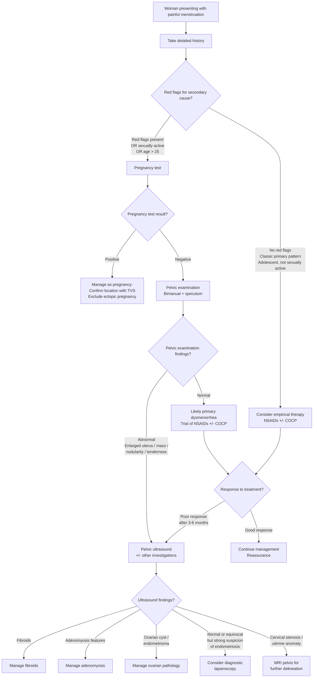

## Diagnostic Criteria, Algorithm, and Investigations for Dysmenorrhea

### Diagnostic Criteria

Dysmenorrhea does not have formal "diagnostic criteria" in the way that, say, rheumatoid arthritis or SLE does with scored classification systems. Instead, the diagnosis is made **clinically** based on the pattern of symptoms and the presence or absence of underlying pathology. Let's break this down for primary and secondary dysmenorrhea.

#### Primary Dysmenorrhea — A Clinical Diagnosis of Exclusion

There is no single diagnostic test for primary dysmenorrhea. The diagnosis is made when **all of the following are present**:

1. **Cyclical, crampy lower abdominal/suprapubic pain** temporally related to menstruation (begins within hours of onset of menstrual flow, or up to 1 day before; duration ≤ 72 hours)
2. **Onset within 1–2 years of menarche** (once ovulatory cycles are established)
3. **No red flag features** suggesting secondary cause (no progressive worsening, no menorrhagia beyond normal, no dyspareunia, no dyschezia, no subfertility, no abnormal discharge, no intermenstrual bleeding)
4. ***Normal pelvic examination*** — this is the single most important clinical finding. Normal-sized uterus, no adnexal masses, no cervical motion tenderness, no nodularity in the pouch of Douglas
5. **Reasonable response to empirical therapy** with NSAIDs and/or combined oral contraceptive pill (COCP) — approximately 80% of women with primary dysmenorrhea respond to first-line treatment

<Callout title="When Is Pelvic Examination Not Mandatory?">
In an **adolescent who is not sexually active**, presenting with a classic history of primary dysmenorrhea and no red flags, some guidelines permit a trial of empirical therapy (NSAIDs ± COCP) **without** a pelvic examination initially, provided there is close follow-up. However, if symptoms do not respond to treatment or if there are any atypical features, pelvic examination (and further investigation) becomes essential. In a sexually active woman, pelvic examination and pregnancy test are always indicated.
</Callout>

#### Secondary Dysmenorrhea — Diagnosis Depends on the Underlying Cause

Secondary dysmenorrhea is suspected when the clinical picture does not fit primary dysmenorrhea, specifically when any of the following are present:

- Onset of dysmenorrhea **after age 25** or **new-onset in a woman who previously had pain-free periods**
- ***If a lady has a baseline of no dysmenorrhea, and suddenly develops dysmenorrhea → considered secondary*** [1]
- ***Secondary dysmenorrhea: remember to ask for associated symptoms of menorrhagia / subfertility, associated pelvic mass → think adenomyosis*** [1]
- Progressive worsening of pain over time
- Pain beginning > 1–2 days before menstruation or persisting after menses ends
- Abnormal pelvic examination findings
- Failure to respond to NSAIDs and/or COCP
- ***If arising from the first ever period, then considered primary / early onset, normal for that lady → need to think of structural abnormalities (e.g., septate uterus, menstrual blood confined into a cavity)*** [1]

The specific diagnostic criteria for each secondary cause are those of the underlying condition (e.g., endometriosis staging criteria, fibroid classification). The investigation strategy below is designed to identify these causes.

---

### Diagnostic Algorithm

The clinical approach to dysmenorrhea follows a stepwise algorithm: **history → examination → selective investigation → empirical therapy vs. targeted investigation**. The key decision points are: (1) Is there a possibility of pregnancy? (2) Are there red flag features suggesting secondary cause? (3) Does the patient respond to empirical first-line treatment?

<Callout title="Critical First Step" type="error">
***Always perform a pregnancy test in any woman of reproductive age presenting with pelvic pain*** — ectopic pregnancy is a life-threatening emergency that presents with pain ± vaginal bleeding. Even if the history sounds like dysmenorrhea, never skip this step in a sexually active woman or a woman of uncertain sexual history [4].
</Callout>

---

### Investigation Modalities

Investigations for dysmenorrhea are selected based on clinical findings. **Primary dysmenorrhea requires no investigations if the history is classic, examination is normal, and the patient responds to empirical therapy.** Investigations are directed at identifying secondary causes.

#### 1. Baseline Blood Tests

| Test | Rationale | Key Findings & Interpretation |
|---|---|---|
| **Full blood count (CBC)** | ***Anaemia related to menorrhagia*** [1] — if a woman has heavy periods alongside dysmenorrhea (fibroids, adenomyosis), she may develop iron deficiency anaemia | ↓ Hb, ↓ MCV (microcytic), ↓ ferritin = iron deficiency anaemia from chronic blood loss. Why microcytic? Iron is needed for haem synthesis → less haemoglobin per red cell → cells are smaller |
| **Iron studies (ferritin, serum iron, TIBC)** | To confirm iron deficiency if anaemia is present | ↓ Ferritin (most sensitive early marker of iron depletion), ↓ serum iron, ↑ TIBC (the body upregulates transferrin production to try to capture more iron) |
| **CRP / ESR** | If PID is suspected (fever, discharge, cervical motion tenderness) | ↑ CRP/ESR suggests active infection/inflammation. However, these are non-specific |
| **Urine pregnancy test (β-hCG)** | To exclude pregnancy, especially ectopic pregnancy — this is **mandatory** in any reproductive-age woman with acute pelvic pain | Positive → manage as pregnancy (confirm intrauterine vs. ectopic with TVS). Negative → proceed with other workup |
| **STI screening (endocervical/vaginal swabs)** | If PID is suspected: *Chlamydia trachomatis* NAAT, *Neisseria gonorrhoeae* NAAT, high vaginal swab for *Trichomonas*, *Gardnerella* | Positive NAAT for Chlamydia/Gonorrhoea confirms sexually transmitted aetiology of PID → treat with appropriate antibiotics and contact trace |

#### 2. Hormonal Investigations

These are **not routinely required** for dysmenorrhea but are indicated in specific scenarios:

| Test | When Indicated | Key Findings & Interpretation |
|---|---|---|
| ***FSH, LH, E2, PRL, TFT, testosterone*** [9] | When dysmenorrhea is associated with **amenorrhoea, oligomenorrhoea, or features of hyperandrogenism** (suggesting PCOS, premature ovarian insufficiency, thyroid disease, or hyperprolactinaemia) | ↑ LH:FSH ratio ( > 2:1) + ↑ testosterone → PCOS. ↑ FSH + ↓ E2 → premature ovarian insufficiency. ↑ PRL → prolactinoma (can cause amenorrhoea/oligomenorrhoea). ↑/↓ TSH → thyroid disease |
| ***Androgens (SHBG, 17-OH progesterone)*** [9] | If PCOS or congenital adrenal hyperplasia suspected | ↓ SHBG (insulin resistance in PCOS drives hepatic SHBG production down → more free androgens). ↑ 17-OHP → congenital adrenal hyperplasia (21-hydroxylase deficiency) |
| **CA-125** | Sometimes measured when an ovarian mass is found, to help differentise benign vs. malignant; also mildly elevated in endometriosis and adenomyosis | **Not diagnostic for endometriosis** — sensitivity is poor and specificity is low. May be ↑ in endometriosis (typically < 200 U/mL), ovarian cancer (often > 200), PID, fibroids, pregnancy, menses itself. **Not a screening tool** — only useful in the context of a pelvic mass to guide further management [2] |

<Callout title="CA-125 in Dysmenorrhea" type="error">
CA-125 is frequently over-ordered. It is **not** a screening test for endometriosis, and it can be elevated during normal menstruation. In the context of dysmenorrhea, its main utility is when an **ovarian mass** is identified on ultrasound and you need to assess malignancy risk (using the Risk of Malignancy Index — RMI). A mildly elevated CA-125 in a young woman with dysmenorrhea is more likely to reflect endometriosis, menstruation, or even the investigation itself rather than cancer [2].
</Callout>

#### 3. Pelvic Ultrasound (First-Line Imaging)

***Pelvic ultrasound is commonly performed*** [5] and is the **first-line imaging investigation** for suspected secondary dysmenorrhea.

**Two approaches:**

| Modality | Description | Advantages | Limitations |
|---|---|---|---|
| **Transvaginal ultrasound (TVS)** | High-frequency probe inserted into the vagina, providing high-resolution images of the uterus, ovaries, and pouch of Douglas | ***Best resolution for pelvic organs*** — superior for detecting fibroids, adenomyosis, ovarian cysts, endometriomas, and assessing endometrial thickness. Can assess uterine anomalies. Doppler flow can assess vascularity of masses | Requires patient consent (may not be appropriate for adolescents who are not sexually active); limited field of view for large masses |
| **Transabdominal ultrasound (TAS)** | Probe placed on the abdomen with a full bladder as an acoustic window | Non-invasive, appropriate for adolescents and those who decline TVS; good overview of large pelvic masses | Lower resolution for pelvic organs compared to TVS |

**Key ultrasound findings and their interpretation:**

| Condition | Ultrasound Findings | Why It Looks This Way |
|---|---|---|
| **Uterine fibroids** | ***Well-circumscribed hypoechoic round masses*** within the myometrium with ***whorled appearance***. May show calcification (echogenic foci with posterior acoustic shadowing). Classified by location relative to endometrium and serosa. ***Fibroids have a pseudo-capsule surrounding it*** [1] — appears as a clear boundary on USS | Smooth muscle cells arranged in whorls → hypoechoic. Pseudo-capsule of compressed myometrium creates a distinct border. Calcification occurs in degenerated long-standing fibroids. Submucosal fibroids distort the endometrial stripe |
| **Adenomyosis** | ***Diffusely enlarged, globular uterus*** with heterogeneous myometrial echotexture ("Venetian blind" appearance = linear striations). ***Myometrial cysts (small anechoic areas)*** within the myometrium. ***Poorly defined endo-myometrial junction*** (junctional zone > 12 mm on MRI). ***Adenomyosis does not have a pseudo-capsule*** [1] → no distinct boundary between adenomyotic tissue and normal myometrium | Ectopic endometrial glands/stroma scattered through the myometrium disrupt the normal homogeneous muscle texture. Myometrial cysts represent dilated ectopic endometrial glands filled with old blood. Unlike fibroids, there is no compressed capsule — the disease infiltrates diffusely |
| **Endometrioma ("chocolate cyst")** | ***Homogeneous low-level internal echoes*** ("ground glass" appearance) within a well-defined ovarian cyst. No internal vascularity on Doppler. May have dependent layering | Old blood (haemolysed RBCs and haemosiderin) creates a dense, homogeneous fluid that produces the characteristic ground-glass echogenicity. "Chocolate" colour grossly due to degraded haemoglobin |
| **Simple ovarian cyst** | Anechoic (completely black), thin smooth wall, no internal septae, no solid component, posterior acoustic enhancement | Simple fluid (transudate) transmits sound waves uniformly → anechoic. No solid tissue → benign features |
| **Complex ovarian cyst / mass** | Internal septae, solid components, irregular walls, papillary projections, vascularity on Doppler | Solid components and papillary projections suggest neoplastic tissue. Increased vascularity suggests active growth. Features raise concern for malignancy → further workup with CA-125, RMI, +/- MRI, +/- refer to gynaecological oncology [2] |
| **PID / Tubo-ovarian abscess** | Thickened, fluid-filled fallopian tubes (hydrosalpinx/pyosalpinx — "cogwheel sign" on cross-section). Complex adnexal mass with thick walls. Free fluid in pouch of Douglas | Inflamed, pus-filled tubes lose their normal thin wall and become distended. Complex mass represents walled-off abscess with inflammatory debris |
| **Uterine anomaly** | ***3D USS*** can delineate the external uterine contour and the cavity shape — e.g., septate uterus shows a single external contour with a divided cavity; bicornuate shows a fundal indentation with two cavities | The fusion (or failure thereof) of the Müllerian ducts during embryological development determines the type of anomaly. 3D USS is superior to 2D for classification |
| **Cervical stenosis / Haematometra** | Distended uterine cavity filled with echogenic material (old blood), with a narrow or absent cervical canal | Obstructed outflow → menstrual blood accumulates → uterine cavity distends |

#### 4. Advanced Imaging

| Modality | When Indicated | Key Findings |
|---|---|---|
| **MRI pelvis** | ***Gold standard for adenomyosis*** — when USS is equivocal. Also excellent for deep infiltrating endometriosis, uterine anomaly delineation, and fibroid mapping (pre-surgical planning). ***3D USG pelvis / MRI*** indicated for suspected anomalies [9] | **Adenomyosis on MRI**: junctional zone thickness > 12 mm (the junctional zone is the innermost layer of myometrium, appears as a dark band on T2-weighted MRI — in adenomyosis, this zone is thickened and irregular). ***Adenomyosis cannot be enucleated like fibroids*** [1] because there is no capsule — MRI shows the diffuse, ill-defined nature of the disease. **Deep endometriosis on MRI**: nodular lesions in the rectovaginal septum, uterosacral ligaments, or bladder wall — T1 hyperintense (blood products), T2 hypointense (fibrosis). **Fibroids on MRI**: well-circumscribed T2-hypointense masses (densely packed smooth muscle has low water content) |
| **CT pelvis** | **Not first-line** for gynaecological pathology due to poor soft tissue contrast (compared to MRI) and radiation exposure. May be done in emergency settings to exclude other causes of acute abdomen (e.g., appendicitis, perforation) | Incidental finding of uterine enlargement, calcified fibroids, or ovarian masses. CT is inferior to USS/MRI for characterising gynaecological pathology |
| **Hysterosalpingography (HSG)** | When subfertility is a concern alongside dysmenorrhea — assesses **tubal patency** and **cavity contour** | Tubal blockage (suggests PID/adhesions). Filling defects in the cavity (submucous fibroid, polyp). Abnormal cavity shape (uterine anomaly) |

#### 5. Endoscopic / Surgical Investigation

| Modality | When Indicated | Key Findings |
|---|---|---|
| ***Diagnostic laparoscopy*** | ***Gold standard for diagnosis of endometriosis*** — indicated when there is strong clinical suspicion but USS/MRI is negative or equivocal, and/or when medical therapy has failed. Also allows for concurrent therapeutic intervention (excision/ablation of endometriotic lesions, adhesiolysis) [9] | **Endometriotic implants**: powder-burn (dark brown/black) lesions, red flame-like lesions (early active), white scarred lesions (old, fibrotic), peritoneal windows. **Endometriomas**: "chocolate cysts" on the ovary. **Adhesions**: filmy or dense, distorting anatomy. **Staging**: revised American Society for Reproductive Medicine (rASRM) classification (Stage I–IV based on implant location, depth, adhesion extent) |
| **Hysteroscopy** | When intrauterine pathology is suspected — submucous fibroids, endometrial polyps, uterine septum, cervical stenosis. Can be diagnostic and therapeutic. | Direct visualisation of the uterine cavity: submucous fibroids appear as smooth, well-circumscribed protrusions into the cavity; polyps appear as smooth, glistening, pedunculated growths; septum appears as a midline fibrous band |
| **Endometrial biopsy / Pipelle sampling** | When abnormal uterine bleeding coexists with dysmenorrhea, especially in women > 40 years or with risk factors for endometrial hyperplasia/cancer | Histology: normal secretory endometrium (primary dysmenorrhea); chronic endometritis (PID — plasma cells in the stroma); endometrial hyperplasia or malignancy (in older women with AUB) |

#### 6. Other Investigations

| Investigation | When Indicated | Key Findings |
|---|---|---|
| **Urine microscopy, culture, and sensitivity (MSU)** | If urinary symptoms coexist (dysuria, frequency) — to exclude UTI | Pyuria + bacteriuria → UTI. Sterile pyuria → consider Chlamydia urethritis or interstitial cystitis |
| **Stool studies** | If GI symptoms are prominent (to differentiate IBS from IBD) | Faecal calprotectin > 50 μg/g suggests intestinal inflammation (IBD rather than IBS) |
| ***Karyotype*** [9] | If **primary amenorrhoea** coexists with apparent dysmenorrhea/haematometra — to exclude chromosomal abnormalities (e.g., Turner syndrome mosaicism) | 45,X or mosaic → Turner syndrome. 46,XY → androgen insensitivity syndrome or Swyer syndrome (won't typically have dysmenorrhea as there is no functioning endometrium) |
| ***Autoimmune screening*** [9] | If premature ovarian insufficiency is suspected (oligomenorrhoea/amenorrhoea + dysmenorrhea in young woman) | Anti-adrenal, anti-ovarian, anti-thyroid antibodies — autoimmune oophoritis as a cause of POI |

---

### Putting It All Together: Investigation Strategy by Clinical Scenario

| Clinical Scenario | Investigation Strategy |
|---|---|
| **Classic primary dysmenorrhea in adolescent** | Pregnancy test (if sexually active). **No further investigations needed** if history and exam are classic. Trial of NSAIDs ± COCP. Investigate only if non-responsive after 3–6 months |
| **Suspected endometriosis** | Pregnancy test → Pelvic USS (TVS) → look for endometriomas, adenomyosis, other pelvic pathology. If USS is normal but clinical suspicion remains → MRI pelvis. If still equivocal or medical therapy fails → ***diagnostic laparoscopy*** (gold standard) |
| **Suspected fibroids** | Pelvic USS (TVS ± TAS) — sufficient for diagnosis in most cases. CBC (for anaemia from menorrhagia). MRI if surgical planning needed (fibroid mapping) or if differentiation from adenomyosis or sarcoma is required |
| **Suspected adenomyosis** | Pelvic USS (TVS) — look for features described above. If equivocal → MRI pelvis (gold standard). Note: ***definitive diagnosis is histological*** (from hysterectomy specimen), but clinical + imaging diagnosis is usually sufficient to guide management |
| **Suspected PID** | Pregnancy test, endocervical swabs (Chlamydia/Gonorrhoea NAAT), high vaginal swab, CBC, CRP. Pelvic USS if tubo-ovarian abscess suspected. ***Laparoscopy*** if diagnosis uncertain |
| **Associated subfertility** | Hormonal profile (FSH, LH, E2, PRL, TFT, testosterone, AMH). Pelvic USS. HSG or HyCoSy (tubal patency). Diagnostic laparoscopy if endometriosis suspected |
| **Adolescent with severe dysmenorrhea from menarche, non-responsive to treatment** | ***Think structural anomalies*** [1]. Pelvic USS (TAS if not sexually active). ***3D USS or MRI*** to delineate Müllerian anatomy [9]. ± Examination under anaesthesia if vaginal anomaly suspected |

---

<Callout title="High Yield Summary">

**Primary dysmenorrhea is a clinical diagnosis of exclusion** — classic history + normal pelvic exam + response to NSAIDs/COCP. No investigations required in straightforward cases.

**Mandatory investigation**: Pregnancy test in any reproductive-age woman with pelvic pain.

**First-line imaging**: Pelvic ultrasound (TVS preferred for resolution; TAS for adolescents/those declining TVS). ***Pelvic ultrasound is commonly performed*** [5].

**Gold standard for adenomyosis**: MRI pelvis (junctional zone > 12 mm). ***Adenomyosis has no pseudo-capsule, unlike fibroids*** [1] — this is why it cannot be enucleated and appears ill-defined on imaging.

**Gold standard for endometriosis**: Diagnostic laparoscopy with direct visualisation and biopsy. USS/MRI may be normal in superficial peritoneal disease.

**Trigger for investigation**: Red flags for secondary cause, failure to respond to 3–6 months of empirical therapy, associated menorrhagia/subfertility/pelvic mass.

**Key USS findings**: Fibroids = well-circumscribed hypoechoic masses with pseudo-capsule; Adenomyosis = diffusely enlarged globular uterus with heterogeneous myometrium and myometrial cysts, no pseudo-capsule; Endometrioma = ground-glass ovarian cyst.

**Hormonal workup** (FSH, LH, E2, PRL, TFT, testosterone) is indicated when dysmenorrhea coexists with amenorrhoea/oligomenorrhoea, not for isolated dysmenorrhea.

</Callout>

---

<ActiveRecallQuiz
  title="Active Recall - Diagnostic Criteria, Algorithm, and Investigations for Dysmenorrhea"
  items={[
    {
      question: "What are the criteria for making a clinical diagnosis of primary dysmenorrhea?",
      markscheme: "Cyclical crampy suprapubic pain starting with or just before menses lasting up to 72 hours; onset within 1-2 years of menarche; no red flag features for secondary cause; normal pelvic examination; good response to empirical therapy with NSAIDs and/or COCP. It is a diagnosis of exclusion."
    },
    {
      question: "What is the first investigation you must perform in any reproductive-age woman presenting with pelvic pain, and why?",
      markscheme: "Urine pregnancy test (beta-hCG). To exclude pregnancy, especially ectopic pregnancy, which is a life-threatening emergency. Must be done regardless of reported sexual history or whether the pain sounds like dysmenorrhea."
    },
    {
      question: "Describe the key ultrasound differences between uterine fibroids and adenomyosis.",
      markscheme: "Fibroids: well-circumscribed hypoechoic masses with a pseudo-capsule (compressed surrounding myometrium creates a distinct boundary), whorled appearance, may show calcification. Adenomyosis: diffusely enlarged globular uterus with heterogeneous myometrial echotexture (Venetian blind linear striations), myometrial cysts, poorly defined endo-myometrial junction, NO pseudo-capsule. This is why fibroids can be enucleated (shelled out) surgically but adenomyosis cannot."
    },
    {
      question: "What is the gold standard investigation for diagnosing endometriosis, and when is it indicated?",
      markscheme: "Diagnostic laparoscopy with direct visualisation and biopsy of lesions. Indicated when there is strong clinical suspicion of endometriosis but USS and/or MRI are normal or equivocal, or when medical therapy (NSAIDs, COCP, progestogens) has failed after 3-6 months. It also allows concurrent therapeutic intervention (excision, ablation, adhesiolysis)."
    },
    {
      question: "A 14-year-old girl who has never been sexually active presents with severe dysmenorrhea since menarche that does not respond to NSAIDs. What diagnoses should you consider and what imaging should you request?",
      markscheme: "Consider structural or Mullerian anomalies such as septate uterus, unicornuate uterus with non-communicating rudimentary horn, obstructed hemivagina, or transverse vaginal septum causing outflow obstruction. First-line imaging is transabdominal ultrasound (TVS not appropriate if not sexually active). If further delineation needed, 3D USS or MRI pelvis to define the Mullerian anatomy. May also consider examination under anaesthesia if vaginal anomaly is suspected."
    },
    {
      question: "When is CA-125 useful in the workup of dysmenorrhea, and what are its major limitations?",
      markscheme: "CA-125 is useful when an ovarian mass is identified on USS to help assess malignancy risk as part of the Risk of Malignancy Index (RMI). Major limitations: it is NOT a screening test for endometriosis; it has poor sensitivity and specificity; it can be elevated in many benign conditions including endometriosis, adenomyosis, fibroids, PID, pregnancy, and even during normal menstruation. A mildly elevated CA-125 in a young woman is more likely benign than malignant."
    }
  ]}
/>

## References

[1] Lecture slides: Block C - Pelvic mass_ ovarian cancer and cysts; uterine fibroid; pelvic imaging.pdf
[2] Lecture slides: GC 118. Pelvic mass ovarian cancer and cysts; uterine fibroid; pelvic imaging.pdf
[4] Lecture slides: Block C - Gyanecological Emergency Notes to Students.pdf
[5] Lecture slides: GC 118. Pelvic mass ovarian cancer and cysts; uterine fibroid; pelvic imaging.pdf (Summary slide)
[9] Lecture slides: GC 114. Climacteric symptoms menopause and related illness; amenorrhoea.pdf
