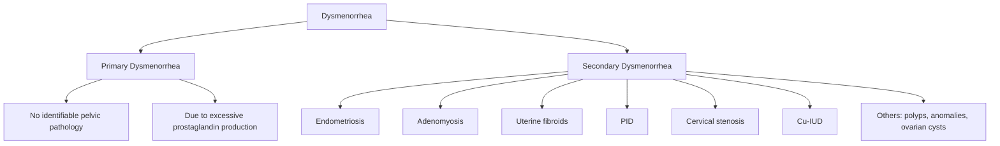

# Dysmenorrhea

## Definition

**Dysmenorrhea** — from the Greek roots: *"dys"* = difficult/painful, *"meno"* = month (referring to menses), *"rrhea"* = flow. So literally, "difficult monthly flow." It refers to **painful menstruation** — specifically, crampy lower abdominal/pelvic pain occurring just before or during menstruation that is severe enough to interfere with daily activities.

It is classified into two types:

- ***Primary dysmenorrhea***: painful menses in the **absence of identifiable pelvic pathology** [1][2]
- ***Secondary dysmenorrhea***: painful menses caused by an **underlying pelvic pathology** (e.g., endometriosis, adenomyosis, fibroids) [1][2]

<Callout title="Why Does This Distinction Matter?">
Primary and secondary dysmenorrhea have fundamentally different pathophysiology, onset patterns, and management. Primary is a diagnosis of exclusion — you must rule out secondary causes, especially in women presenting with new-onset or worsening dysmenorrhea, or those who don't respond to first-line treatment.
</Callout>

---

## Epidemiology

- ***Dysmenorrhea is the most common gynaecological complaint*** and the leading cause of recurrent short-term school/work absenteeism in young women [1]
- **Prevalence**: estimates vary from **45–95%** of menstruating women depending on the population and definition used
  - In Hong Kong, studies have found prevalence rates of approximately **50–80%** among adolescents and young women
  - Of these, approximately **10–20%** describe it as **severe** (significantly limiting activities)
- **Primary dysmenorrhea**: typically begins **within 1–2 years of menarche** (once ovulatory cycles are established) and peaks in the **late teens to early 20s**, with a tendency to improve with age and after childbirth [1]
- **Secondary dysmenorrhea**: can begin at any age but more commonly presents in women **> 25 years** or in those with a history of initially pain-free periods that progressively worsen [1]

### Risk Factors

**For primary dysmenorrhea:**
- ***Younger age (< 30 years)*** — ovulatory cycles with high prostaglandin production
- ***Earlier menarche (< 12 years)*** — longer cumulative exposure to prostaglandin-mediated pain cycles
- ***Heavy menstrual flow (menorrhagia)*** — more endometrial tissue shed → more prostaglandin released
- ***Nulliparity*** — the cervical os is relatively stenotic; after vaginal delivery, the os dilates, reducing resistance to menstrual flow (and hence less uterine contractility needed)
- ***Family history*** — genetic component to prostaglandin sensitivity/production
- ***Smoking*** — nicotine causes vasoconstriction → uterine ischaemia → worsens pain
- ***Obesity*** — adipose tissue as an endocrine organ alters prostaglandin/oestrogen metabolism
- ***Psychological factors*** — anxiety, depression, stress correlate with increased pain perception (central sensitisation)
- ***Low physical activity*** — exercise ↑ endorphins which are natural analgesics

**For secondary dysmenorrhea** — essentially the risk factors for the underlying condition:
- ***Endometriosis*** (most common cause of secondary dysmenorrhea) — nulliparity, family history, early menarche, short cycles
- ***Adenomyosis*** — multiparous women, prior uterine surgery
- ***Uterine fibroids (leiomyomata)*** — increasing age, African ethnicity, nulliparity, obesity [2]
- ***Pelvic inflammatory disease (PID)*** — multiple sexual partners, STIs (Chlamydia, Gonorrhoea)
- ***Intrauterine device (copper IUD)*** — a well-known cause of worsened dysmenorrhea
- ***Endometrial polyps, cervical stenosis, uterine anomalies***

<Callout title="High Yield" type="idea">
The classic exam question: "A 16-year-old girl with painful periods starting 18 months after menarche" → think **primary dysmenorrhea**. "A 35-year-old multiparous woman with progressively worsening painful, heavy periods" → think **secondary dysmenorrhea** (adenomyosis or endometriosis).
</Callout>

---

## Anatomy and Function

Understanding dysmenorrhea requires a solid grasp of uterine anatomy and the menstrual cycle physiology.

### Uterine Anatomy

- The **uterus** is a muscular, pear-shaped pelvic organ situated between the bladder (anterior) and rectum (posterior), supported by the pelvic floor and ligaments (broad, round, uterosacral, cardinal)
- **Three layers of the uterine wall**:
  1. **Endometrium** (inner mucosal lining) — undergoes cyclical proliferation and shedding; two zones:
     - *Functional layer (stratum functionalis)*: shed during menstruation
     - *Basal layer (stratum basalis)*: regenerates the functional layer
  2. **Myometrium** (middle muscular layer) — thick smooth muscle responsible for uterine contractions
     - Three indistinct sublayers: inner longitudinal, middle circular (thickest, contains most blood vessels — the "stratum vasculare"), outer longitudinal
     - ***The myometrium is the effector organ in dysmenorrhea*** — excessive/dysregulated contractions cause ischaemic pain
  3. **Perimetrium/Serosa** (outer peritoneal covering)

- ***Uterine blood supply***: primarily from the **uterine arteries** (branches of the internal iliac arteries) with contributions from the ovarian arteries
  - The arcuate arteries run circumferentially within the myometrium → give off **radial arteries** → which become **spiral arteries** in the endometrium
  - ***Spiral arteries*** are unique: they are sensitive to hormonal changes and constrict/dilate with the menstrual cycle. During menstruation, they constrict → ischaemia → necrosis of the functional endometrium → shedding

- ***Uterine innervation***:
  - Sympathetic and parasympathetic supply via the **inferior hypogastric plexus (pelvic plexus)** and **uterovaginal plexus**
  - Sensory (pain) fibres from the uterine body travel with sympathetic fibres via the **hypogastric nerves** to **T10–L1** spinal segments → this is why dysmenorrhea pain is felt in the lower abdomen and can radiate to the back and thighs
  - The cervix and lower uterine segment send pain fibres via the **pelvic splanchnic nerves** (S2–S4)

### The Normal Menstrual Cycle (Relevant to Dysmenorrhea)

1. **Proliferative phase** (follicular phase): Oestrogen from the developing follicle stimulates endometrial proliferation and growth of spiral arteries
2. **Secretory phase** (luteal phase): Post-ovulation, the corpus luteum produces **progesterone** → endometrial glands become secretory, stroma becomes oedematous, spiral arteries coil tightly
3. **Menstruation**: If no implantation → corpus luteum regresses → **progesterone withdrawal** → this is the critical event:
   - ***Progesterone withdrawal triggers the release of prostaglandins (PGF2α and PGE2) from the endometrial cells***
   - ***Prostaglandins cause myometrial contractions and vasoconstriction of spiral arteries → ischaemia → pain*** [1]

<Callout title="Key Concept: The Prostaglandin Cascade">
Progesterone withdrawal → phospholipase A2 activation → release of arachidonic acid from cell membrane phospholipids → cyclooxygenase (COX) enzymes convert arachidonic acid → prostaglandins (PGF2α, PGE2). PGF2α is a potent myometrial contractor and vasoconstrictor. This is the entire pathophysiological basis of primary dysmenorrhea — and also why NSAIDs (which inhibit COX) are first-line treatment.
</Callout>

---

## Etiology and Pathophysiology

### A. Primary Dysmenorrhea

***Primary dysmenorrhea is caused by excessive prostaglandin production by the endometrium during menstruation, leading to abnormally strong and prolonged uterine contractions and ischaemia.*** [1]

**Step-by-step pathophysiology:**

1. **Progesterone withdrawal** at the end of the luteal phase (corpus luteum regression if no pregnancy)
2. This leads to **destabilization of endometrial cell membranes** → activation of **phospholipase A2**
3. Phospholipase A2 cleaves **arachidonic acid** from membrane phospholipids
4. Arachidonic acid is metabolized by:
   - **Cyclooxygenase (COX-1 and COX-2)** → **Prostaglandins** (PGF2α, PGE2) and **Thromboxane A2**
   - **Lipoxygenase** → **Leukotrienes** (also contribute to pain and inflammation)
5. ***PGF2α is the key mediator***:
   - **Potent stimulator of myometrial smooth muscle contraction** → dysrhythmic, tonic contractions with elevated baseline uterine tone
   - **Vasoconstriction of spiral arteries** → endometrial ischaemia
   - The combination of high intrauterine pressure (sometimes exceeding arterial pressure, > 150–180 mmHg in severe cases) and vasoconstriction creates **tissue ischaemia** → pain
6. ***PGE2*** contributes to:
   - **Pain sensitization** — lowers the threshold of nociceptors
   - **Vasodilation** in some vascular beds → contributes to associated symptoms like headache and flushing
7. ***Vasopressin*** may also play a role:
   - Levels are elevated in women with dysmenorrhea
   - Acts as an additional uterine muscle stimulant and vasoconstrictor
   - May contribute to the "ischaemic" component of pain

**Why only ovulatory cycles?**
- Anovulatory cycles do not produce a corpus luteum → no significant progesterone → no progesterone withdrawal → less organized secretory endometrium → less prostaglandin production
- This is why primary dysmenorrhea typically begins **1–2 years after menarche** (when ovulatory cycles become established) and why the **combined oral contraceptive pill (COCP)** — which suppresses ovulation — is an effective treatment

**Supporting evidence:**
- Women with primary dysmenorrhea have been shown to have **2–7× higher endometrial prostaglandin levels** compared to pain-free women
- Menstrual fluid prostaglandin levels correlate with pain severity
- NSAIDs (prostaglandin synthesis inhibitors) relieve dysmenorrhea in ~80% of women

**Other contributing factors:**
- ***Leukotrienes*** (via the lipoxygenase pathway) — also contribute to myometrial contraction and may explain why ~20% of women do not respond to NSAIDs alone
- ***Psychological/central factors***: Central sensitization, catastrophising, and anxiety can amplify pain perception. There is overlap with other functional pain syndromes (e.g., ***IBS, fibromyalgia, chronic fatigue syndrome — note the association with dysmenorrhea mentioned in the IBS section***) [3]
- ***Cervical stenosis*** — a narrower cervical os may impede menstrual outflow → higher intrauterine pressure needed to expel menstrual debris → more pain (this partly explains why pain often improves after vaginal delivery)

### B. Secondary Dysmenorrhea

Secondary dysmenorrhea has a structural/pathological cause. The pathophysiology depends on the specific etiology:

| Etiology | Pathophysiology | Key Features |
|---|---|---|
| ***Endometriosis*** | Ectopic endometrial tissue (outside uterus) responds to cyclic hormones → bleeds → causes local inflammation, adhesions, fibrosis. Peritoneal irritation → pain. Also ↑ prostaglandin production locally. | Most common cause of secondary dysmenorrhea. Pain often **starts before menses** and continues throughout. **Deep dyspareunia**, **dyschezia** (painful defecation, if rectovaginal involvement), **subfertility** |
| ***Adenomyosis*** | Endometrial glands and stroma invade the myometrium → ectopic tissue bleeds cyclically within the muscle → local inflammation, muscular hypertrophy. Enlarged, boggy uterus contracts abnormally. Also ↑ local prostaglandin/cytokine production. | Classically in **multiparous women > 35 years**. **Heavy, painful periods**. Uterus is ***uniformly enlarged, globular, and tender ("boggy")*** on examination [2] |
| ***Uterine fibroids (leiomyomata)*** [2] | Benign smooth muscle tumours of the myometrium. ***Submucous fibroids*** distort the endometrial cavity → ↑ surface area → heavier bleeding; may also interfere with myometrial contraction (the uterus "tries" to expel the fibroid like a foreign body) → pain. ***Intramural fibroids*** may compress surrounding myometrium → altered contraction patterns. Fibroids that undergo **red degeneration** (haemorrhagic infarction, classically in pregnancy) cause acute pain. | ***May be asymptomatic. When symptomatic: menorrhagia (most common symptom), dysmenorrhea, pressure symptoms (urinary frequency, constipation), subfertility.*** [2] |
| ***Pelvic inflammatory disease (PID)*** | Ascending infection (commonly *Chlamydia trachomatis*, *Neisseria gonorrhoeae*) → endometritis, salpingitis, tubo-ovarian abscess → chronic inflammation, adhesions → chronic pelvic pain including dysmenorrhea | Dysmenorrhea + **abnormal vaginal discharge**, **fever**, **cervical motion tenderness**, **adnexal tenderness** |
| ***Copper intrauterine device (Cu-IUD)*** | Foreign body reaction → local inflammation → ↑prostaglandin production within the endometrium | Dysmenorrhea and menorrhagia typically worsen in the first 3–6 months after insertion |
| ***Endometrial polyps*** | Polyps protrude into the uterine cavity → irregular bleeding, and the uterus may contract to try to expel them | Intermenstrual bleeding, menorrhagia, postmenopausal bleeding |
| ***Cervical stenosis*** | Congenital or acquired (post-surgical, e.g., cone biopsy, LLETZ) narrowing of the cervical canal → obstructed menstrual outflow → ↑intrauterine pressure → pain | Scanty menstrual flow, severe cramping, possible haematometra |
| ***Uterine anomalies*** (e.g., bicornuate, septate uterus) | Obstructed outflow from one horn or abnormal myometrial architecture → dysmenorrhea | May present with primary dysmenorrhea but is technically a structural cause |
| ***Ovarian cysts/masses*** [2] | Functional cysts (follicular, corpus luteum) may cause cyclical pain if they bleed or undergo torsion. Endometriomas ("chocolate cysts") → cyclical pain due to bleeding within the cyst. | ***Ovarian cysts may present as pelvic mass ± pain. Endometriomas are strongly associated with endometriosis*** [2] |

<Callout title="Hong Kong Context" type="idea">
In Hong Kong, the most important secondary causes to consider are **endometriosis** (common, often underdiagnosed, contributes to the significant subfertility burden), **adenomyosis** (increasing recognition with better imaging), and **uterine fibroids** (very common in Chinese women, with prevalence up to 20–40% in reproductive age). Copper IUD use is less prevalent in HK compared to some other regions (the levonorgestrel-releasing intrauterine system/Mirena is more commonly used and actually *treats* dysmenorrhea). PID is seen in sexually active young women, particularly in the context of STIs.
</Callout>

---

## Classification

### By Etiology (Most Clinically Used)

### By Severity (Andersch & Milsom Grading, sometimes used in research)

| Grade | Description |
|---|---|
| **Grade 0** | Menstruation is not painful, daily activity unaffected |
| **Grade 1 (Mild)** | Menstruation is painful but seldom inhibits activity; analgesics rarely required |
| **Grade 2 (Moderate)** | Daily activity affected; analgesics required and provide relief; absent from work/school rarely |
| **Grade 3 (Severe)** | Activity clearly inhibited; analgesics provide poor relief; associated vegetative symptoms (nausea, vomiting, diarrhoea, headache); absenteeism from work/school |

---

## Clinical Features

### A. Primary Dysmenorrhea

#### Symptoms

| Symptom | Pathophysiological Basis |
|---|---|
| ***Crampy, spasmodic lower abdominal/suprapubic pain*** | PGF2α causes rhythmic myometrial contractions → intermittent ischaemia → visceral pain referred to T10–L1 dermatomes (lower abdomen/suprapubic area). Pain is "colicky" because contractions are rhythmic, not constant. |
| ***Pain begins with (or just before) onset of menstruation, lasting 1–3 days*** | Prostaglandin release is maximal in the first 48 hours of menstruation as the endometrium sheds; levels then decline. |
| ***Radiation to the lower back and medial thighs*** | Referred pain via the hypogastric plexus and presacral nerves to L2–L3 dermatomes (back) and via obturator nerve distribution (medial thigh). |
| ***Nausea and vomiting*** | Prostaglandins (esp. PGE2) enter the systemic circulation → stimulate the chemoreceptor trigger zone (CTZ) and smooth muscle of the GI tract → nausea/vomiting. |
| ***Diarrhoea and loose stools*** | PGF2α and PGE2 stimulate smooth muscle contraction throughout the GI tract → ↑ intestinal motility → diarrhoea. (This is also why IBS symptoms often worsen during menses.) |
| ***Headache*** | Systemic prostaglandin release → vasodilation of cerebral vessels → headache. Also possible prostaglandin-mediated central sensitization. |
| ***Fatigue, malaise, dizziness*** | Systemic effects of prostaglandins and vasopressin; also related to blood loss, sleep disturbance from pain, and stress. |
| ***Bloating*** | Prostaglandin-mediated changes in GI motility and fluid retention from hormonal fluctuations in the late luteal phase. |

**Temporal pattern of primary dysmenorrhea:**
- Onset: **typically 1–2 years after menarche** (once ovulatory cycles are established)
- Pain begins **within hours of onset of menstrual bleeding** (or up to 1 day before)
- Duration: usually **48–72 hours** (corresponding to peak prostaglandin levels)
- ***Tends to improve with age and after childbirth*** (cervical dilatation, altered prostaglandin production)

#### Signs

| Sign | Pathophysiological Basis |
|---|---|
| **Lower abdominal tenderness (suprapubic)** | Reflects myometrial hypercontractility and visceral pain; tenderness is generally mild and diffuse, not localized |
| ***Normal bimanual pelvic examination*** | **This is the key finding** — by definition, primary dysmenorrhea has no identifiable pelvic pathology. The uterus is normal size, anteverted/anteflexed (typically), non-tender or only mildly tender, and adnexae are clear. |
| **No cervical motion tenderness (chandelier sign negative)** | Absence of pelvic infection or peritoneal irritation |
| **No adnexal masses or tenderness** | No ovarian pathology |

<Callout title="Exam Pearl" type="error">
A common mistake is to diagnose primary dysmenorrhea without performing a pelvic examination. Primary dysmenorrhea is a **diagnosis of exclusion** — you must confirm normal pelvic findings. If there are abnormal findings (enlarged uterus, adnexal mass, cervical motion tenderness, nodularity in the pouch of Douglas), you are dealing with **secondary dysmenorrhea** and must investigate further.
</Callout>

### B. Secondary Dysmenorrhea

The clinical features depend on the underlying cause. However, there are features that should raise suspicion for secondary dysmenorrhea over primary:

#### "Red Flags" Suggesting Secondary Dysmenorrhea

| Feature | Why It Suggests Secondary Cause |
|---|---|
| ***Onset after age 25*** or **new-onset dysmenorrhea in a woman who previously had painless periods** | Primary dysmenorrhea begins in adolescence; late onset suggests new pathology developing |
| ***Progressive worsening of pain over time*** | Primary dysmenorrhea tends to stay stable or improve; progressive worsening suggests evolving pathology (e.g., enlarging endometrioma, growing fibroid, worsening adenomyosis) |
| ***Pain starting > 1–2 days before menstruation and/or persisting beyond day 3*** | Primary dysmenorrhea pain is closely temporally linked to menstrual flow (prostaglandin release); pain that precedes flow by several days suggests endometriosis (pre-menstrual peritoneal inflammation) |
| ***Heavy menstrual bleeding (menorrhagia) or irregular bleeding*** | Suggests fibroids, adenomyosis, or endometrial polyps |
| ***Deep dyspareunia*** (pain with deep penetration during intercourse) | Suggests endometriosis (especially involving the uterosacral ligaments or pouch of Douglas) or adenomyosis |
| ***Dyschezia*** (painful defecation, especially during menses) | Suggests endometriosis involving the rectovaginal septum or bowel |
| ***Dysuria during menses*** | Suggests bladder endometriosis |
| ***Subfertility*** | Endometriosis is a leading cause of subfertility |
| ***Abnormal vaginal discharge*** | Suggests PID |
| ***Failure to respond to NSAIDs and/or COCP*** | Most women with primary dysmenorrhea respond to first-line therapy; non-response should prompt investigation for secondary causes |

#### Cause-Specific Clinical Features

**Endometriosis:**
- Symptoms: ***Cyclical pelvic pain (often pre-menstrual onset), deep dyspareunia, dyschezia, dysuria, subfertility***, chronic pelvic pain
- Signs: ***Tender nodularity in the pouch of Douglas*** (felt on rectovaginal examination), ***fixed retroverted uterus*** (due to adhesions), ***visible blue/brown lesions on the posterior vaginal fornix or cervix*** (occasionally)
- Pathophysiology: Ectopic endometrial-like tissue implants respond to oestrogen → cyclical proliferation, bleeding → local inflammation, fibrosis, adhesion formation, and nociceptor activation. Also ↑ local prostaglandin, cytokine, and growth factor production.

***Adenomyosis:*** [2]
- Symptoms: ***Dysmenorrhea (progressively worsening), menorrhagia***, chronic pelvic pain
- Signs: ***Uniformly enlarged, globular, "boggy" tender uterus*** (typically 2–3× normal size, rarely > 12 weeks' size), often symmetrically enlarged (vs. the irregular enlargement of fibroids)
- Pathophysiology: Endometrial glands and stroma within the myometrium → cyclic bleeding into the muscle → smooth muscle hypertrophy and hyperplasia around the ectopic foci → altered contractility, ↑ prostaglandin production locally

***Uterine fibroids:*** [2]
- Symptoms: ***Menorrhagia (most common symptom)***, dysmenorrhea (esp. with submucous fibroids), ***pressure symptoms*** (urinary frequency if anterior, constipation if posterior, ureteric obstruction if lateral), ***abdominal distension*** with large fibroids
- Signs: ***Irregularly enlarged, firm, non-tender uterus with palpable discrete lumps (fibroids)***; may be palpable abdominally if large (> 12 weeks' size)
- ***Fibroids are oestrogen- and progesterone-dependent → grow during reproductive years, may shrink after menopause*** [2]
- ***Types by location: subserosal, intramural, submucosal (most symptomatic for bleeding/pain), pedunculated, cervical*** [2]
- Pathophysiology of pain: submucosal fibroids distort the cavity → ↑ surface area → ↑ bleeding; also, the uterus contracts to try to expel the fibroid (similar to labour contractions → colicky pain). Intramural fibroids may compress vessels → ischaemia.

***Pelvic inflammatory disease (PID):***
- Symptoms: Lower abdominal pain (may be constant, not just menstrual), abnormal vaginal discharge (purulent, foul-smelling), intermenstrual or post-coital bleeding, dyspareunia, fever
- Signs: **Cervical motion tenderness (chandelier sign positive)**, adnexal tenderness ± mass (tubo-ovarian abscess), fever, mucopurulent cervicitis
- Pathophysiology: Ascending infection → endometritis → salpingitis → chronic inflammation and adhesions → chronic pelvic pain and dysmenorrhea

---

## Summary of Key Differentiating Features: Primary vs. Secondary Dysmenorrhea

| Feature | Primary | Secondary |
|---|---|---|
| **Age of onset** | 1–2 years after menarche (teens) | Usually > 25 years or later onset |
| **Temporal pattern** | Starts with/just before menses, lasts 1–3 days | May begin days before menses, persist after menses ends |
| **Progression** | Stable or improving over time | Progressive worsening |
| **Pelvic examination** | Normal | Abnormal findings (enlarged uterus, nodularity, masses, tenderness) |
| **Associated features** | GI symptoms (nausea, diarrhoea), headache | Menorrhagia, dyspareunia, dyschezia, subfertility, discharge |
| **Response to NSAIDs/COCP** | Usually good (~80%) | Variable; poor response should prompt investigation |
| **Menstrual flow** | Normal | Often heavy or irregular |

---

<Callout title="High Yield Summary">

**Definition**: Dysmenorrhea = painful menstruation. Primary = no pelvic pathology; Secondary = underlying cause present.

**Epidemiology**: Most common gynaecological complaint; affects 45–95% of menstruating women. Primary peaks in teens-20s; secondary more common > 25 years.

**Pathophysiology of Primary Dysmenorrhea**: Progesterone withdrawal → phospholipase A2 → arachidonic acid → COX → PGF2α + PGE2 → myometrial hypercontractility + spiral artery vasoconstriction → uterine ischaemia → pain. Only occurs in ovulatory cycles.

**Key Risk Factors**: Young age, early menarche, heavy flow, nulliparity, smoking, family history, low physical activity.

**Key Clinical Features of Primary**: Crampy suprapubic pain beginning with menses (lasts 48–72h), ± nausea/vomiting/diarrhoea/headache, normal pelvic exam.

**Red Flags for Secondary**: Late onset, progressive worsening, pain before/after menses, menorrhagia, dyspareunia, dyschezia, subfertility, abnormal pelvic exam, failure to respond to NSAIDs/COCP.

**Top 3 Secondary Causes in HK**: (1) Endometriosis, (2) Adenomyosis, (3) Uterine fibroids.

**Associations**: Dysmenorrhea is associated with IBS, fibromyalgia, and other functional pain syndromes (shared prostaglandin/central sensitization pathways).

</Callout>

---

<ActiveRecallQuiz
  title="Active Recall - Dysmenorrhea (Definition to Clinical Features)"
  items={[
    {
      question: "What is the key biochemical mediator responsible for primary dysmenorrhea, and describe the pathway from progesterone withdrawal to pain?",
      markscheme: "PGF2-alpha is the key mediator. Progesterone withdrawal leads to membrane destabilisation, phospholipase A2 activation, arachidonic acid release, COX-mediated conversion to PGF2-alpha, which causes myometrial hypercontractility and spiral artery vasoconstriction leading to uterine ischaemia and pain."
    },
    {
      question: "Why does primary dysmenorrhea only occur in ovulatory cycles and typically begin 1-2 years after menarche?",
      markscheme: "Ovulation produces a corpus luteum which secretes progesterone. Withdrawal of progesterone at the end of the luteal phase triggers prostaglandin release from the secretory endometrium. Anovulatory cycles lack this progesterone surge and withdrawal. Menarche is initially followed by anovulatory cycles; ovulatory cycles establish 1-2 years later."
    },
    {
      question: "Name 4 red flag features that suggest secondary rather than primary dysmenorrhea.",
      markscheme: "Any 4 of: onset after age 25, progressive worsening, pain starting more than 1-2 days before menses or persisting beyond day 3, menorrhagia or irregular bleeding, deep dyspareunia, dyschezia, subfertility, abnormal vaginal discharge, abnormal pelvic examination findings, failure to respond to NSAIDs or COCP."
    },
    {
      question: "Explain why women with primary dysmenorrhea commonly experience diarrhoea and nausea during menstruation.",
      markscheme: "Prostaglandins (PGF2-alpha and PGE2) released from the shedding endometrium enter the systemic circulation. They stimulate smooth muscle contraction throughout the GI tract causing increased intestinal motility and diarrhoea. PGE2 also stimulates the chemoreceptor trigger zone causing nausea and vomiting."
    },
    {
      question: "Compare the typical pelvic examination findings in primary dysmenorrhea versus secondary dysmenorrhea caused by adenomyosis.",
      markscheme: "Primary dysmenorrhea: normal bimanual pelvic examination with normal-sized, non-tender uterus and clear adnexae. Adenomyosis: uniformly enlarged, globular, boggy, and tender uterus (typically 2-3x normal size), symmetrically enlarged."
    },
    {
      question: "A 28-year-old nulliparous woman presents with worsening dysmenorrhea over 3 years, deep dyspareunia, and subfertility. What is the most likely diagnosis and what specific sign might you find on rectovaginal examination?",
      markscheme: "Most likely diagnosis is endometriosis. On rectovaginal examination, you may find tender nodularity in the pouch of Douglas (uterosacral ligament nodules). The uterus may also be fixed and retroverted due to adhesions."
    }
  ]}
/>

## References

[1] Lecture slides: GC 114. Climacteric symptoms menopause and related illness; amenorrhoea.pdf
[2] Lecture slides: Block C - Pelvic mass_ ovarian cancer and cysts; uterine fibroid; pelvic imaging.pdf; GC 118. Pelvic mass ovarian cancer and cysts; uterine fibroid; pelvic imaging.pdf
[3] Senior notes: Ryan Ho GI.pdf (Section 3.2.1 — Irritable Bowel Syndrome, association with dysmenorrhea)
