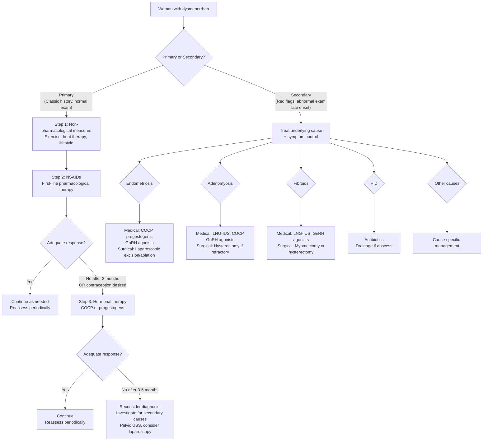

## Management of Dysmenorrhea

The management of dysmenorrhea is fundamentally guided by whether you are dealing with **primary** or **secondary** dysmenorrhea. For primary, the approach is stepwise: lifestyle → NSAIDs → hormonal therapy → consider secondary causes if refractory. For secondary, you treat the **underlying cause** alongside symptom control. Let me walk you through this systematically.

### Management Algorithm

---

### A. Management of Primary Dysmenorrhea

#### Step 1: Non-Pharmacological Measures

These are often underestimated but have genuine physiological rationale. They should be offered to all women as first-line or adjunctive measures.

| Measure | Mechanism / Rationale | Evidence |
|---|---|---|
| **Regular exercise** | Aerobic exercise ↑ endorphin release (endogenous opioids that raise pain threshold); ↑ pelvic blood flow → ↓ ischaemia; ↓ stress and anxiety (which amplify pain perception via central sensitisation) | Multiple RCTs show moderate benefit; recommended by ACOG and NICE |
| **Local heat application** (heating pad, hot water bottle to lower abdomen) | Heat causes smooth muscle relaxation and vasodilation → ↓ myometrial spasm and ↓ ischaemia. Heat also activates thermoreceptors that compete with nociceptive signals at the spinal cord level (gate control theory of pain) | RCTs show topical heat (40°C) is as effective as ibuprofen for pain relief |
| **Dietary modification** | Low-fat, plant-based diets may ↓ circulating oestrogen → ↓ endometrial prostaglandin production. Omega-3 fatty acids (fish oil) compete with arachidonic acid as COX substrate → ↓ pro-inflammatory prostaglandin synthesis (produces less potent PGE3 instead of PGE2) | Modest evidence; can be recommended as adjunctive |
| **Stress management and psychological support** | Anxiety and stress → central sensitisation and ↓ pain threshold. Cognitive behavioural therapy (CBT) and relaxation techniques can modify pain perception | Evidence limited but rationale is sound; particularly useful in those with comorbid anxiety/depression |
| **Acupuncture and TENS** | Transcutaneous electrical nerve stimulation (TENS): electrical impulses stimulate large-diameter Aβ fibres → inhibit pain transmission by small C-fibres at the dorsal horn (gate control theory). Acupuncture may work via endorphin release | Some evidence for TENS; acupuncture evidence is mixed |
| **Smoking cessation** | Nicotine causes vasoconstriction → ↑ uterine ischaemia → ↑ pain. Smoking also associated with higher circulating prostaglandin levels | Epidemiological data supports this; should be advised |

#### Step 2: NSAIDs — First-Line Pharmacological Therapy

**NSAIDs** ("Non-Steroidal Anti-Inflammatory Drugs") are the **cornerstone** of primary dysmenorrhea treatment. The name tells you the mechanism: they reduce inflammation without being steroids.

**Why do NSAIDs work in dysmenorrhea?**
- NSAIDs inhibit **cyclooxygenase (COX)** enzymes → ↓ conversion of arachidonic acid to prostaglandins (PGF2α and PGE2)
- This directly addresses the core pathophysiology: ↓ prostaglandin production → ↓ myometrial contractility → ↓ uterine ischaemia → ↓ pain
- Also ↓ the systemic effects of prostaglandins (nausea, diarrhoea, headache)
- Effective in **~80% of women** with primary dysmenorrhea

| Drug | Dose | Notes |
|---|---|---|
| **Ibuprofen** | 400–600 mg TDS (max 2400 mg/day) | Most commonly used; good evidence base; available OTC |
| **Naproxen** | 250–500 mg BD (max 1250 mg/day on day 1, then 1000 mg/day) | Longer half-life → less frequent dosing; good for women who forget midday dose |
| **Mefenamic acid** (Ponstan) | 500 mg TDS | A fenamate — has additional direct anti-prostaglandin receptor activity (blocks prostaglandin action at the receptor level in addition to inhibiting synthesis). Popular choice in HK/UK for dysmenorrhea |
| **Diclofenac** | 50 mg TDS or 75 mg BD | Effective; available in suppository form for those with nausea/vomiting |
| **Celecoxib** (COX-2 selective) | 200 mg BD | Selective COX-2 inhibitor → ↓ GI side effects compared to non-selective NSAIDs; similar efficacy for dysmenorrhea [10] |

**Practical prescribing tips:**
- ***Start NSAIDs at onset of menses (or 1–2 days before if cycle is predictable)*** — prostaglandin production peaks in the first 48h of menstruation, so early dosing prevents the prostaglandin cascade from ramping up
- Continue for 2–3 days (duration of pain)
- Take with food to ↓ GI irritation
- If one NSAID doesn't work, try a different one — there is inter-individual variation in response (possibly due to varying contributions of leukotrienes vs. prostaglandins)
- If no improvement after trying **2–3 different NSAIDs** over **3 menstrual cycles** each, consider hormonal therapy

**Contraindications to NSAIDs:**

| Contraindication | Why |
|---|---|
| **Active peptic ulcer disease / GI bleeding** | NSAIDs inhibit COX-1 → ↓ protective prostaglandins in gastric mucosa (PGE2 maintains mucosal blood flow, stimulates mucus/bicarbonate secretion) → ↑ risk of ulceration and bleeding |
| **Renal impairment** | Prostaglandins (via COX-1) maintain afferent arteriolar vasodilation in the kidney → NSAIDs → afferent vasoconstriction → ↓ GFR → can precipitate AKI, especially in those with pre-existing renal disease or dehydration |
| **Severe asthma (aspirin-exacerbated respiratory disease)** | COX inhibition shunts arachidonic acid metabolism towards the lipoxygenase pathway → ↑ leukotriene production → bronchospasm |
| **Coagulopathy / anticoagulant therapy** | NSAIDs ↓ thromboxane A2 (via COX-1 in platelets) → ↓ platelet aggregation → ↑ bleeding risk |
| **Third trimester of pregnancy** | Prostaglandins maintain patency of the ductus arteriosus; NSAIDs → premature closure → fetal pulmonary hypertension |
| **Cardiovascular disease (for COX-2 selective)** | COX-2 selective inhibitors ↓ endothelial prostacyclin (PGI2, which is vasodilatory and anti-thrombotic) without affecting platelet thromboxane → ↑ relative prothrombotic state → ↑ cardiovascular events |

<Callout title="Why Mefenamic Acid Is Particularly Good for Dysmenorrhea" type="idea">
Mefenamic acid belongs to the fenamate class. Unlike other NSAIDs which only inhibit prostaglandin synthesis (via COX), fenamates also **antagonise prostaglandin receptors directly**. This dual action means they block both the production AND the action of prostaglandins. This is why mefenamic acid is often considered the NSAID of choice for dysmenorrhea specifically, though head-to-head trials show similar efficacy to ibuprofen and naproxen.
</Callout>

#### Step 3: Hormonal Therapy

Hormonal therapy is indicated as **second-line** when NSAIDs are insufficient, contraindicated, or when the patient also desires **contraception**. The fundamental principle is: ***suppress ovulation and/or reduce endometrial proliferation → ↓ prostaglandin production → ↓ pain***.

##### A. Combined Oral Contraceptive Pill (COCP)

- **Mechanism**: Exogenous oestrogen + progestogen → suppresses the HPO axis (↓ GnRH → ↓ FSH/LH → ↓ follicular development → **anovulation**) → thin, atrophic endometrium → much less endometrial tissue to shed → much less prostaglandin production → ↓ pain
- ***Combined COC pills*** are a key option for management [11]
- **Efficacy**: reduces dysmenorrhea in ~90% of women
- **Regimen**: standard cyclical (21 days active + 7 days pill-free) or **extended/continuous** use (skipping placebo pills → fewer/no withdrawal bleeds → fewer pain episodes). Continuous regimens are increasingly preferred for dysmenorrhea
- **Additional benefits**: regulation of menstrual cycle, ↓ menorrhagia, ↓ acne, ↓ risk of ovarian and endometrial cancer
- ***Contraindications*** [11]:
  - ***Uncontrolled CV risk factors*** (hypertension, hyperlipidaemia)
  - ***Active smoking*** (especially if > 35 years old — ↑ risk of VTE and arterial events because oestrogen is prothrombotic and smoking adds endothelial damage)
  - ***History of VTE or thrombophilia***
  - ***Oestrogen-dependent tumours*** (breast cancer, endometrial cancer) [12]
  - ***Migraine with aura*** (↑ risk of ischaemic stroke — oestrogen promotes a prothrombotic state + migraine with aura independently ↑ stroke risk; the combination is synergistic)
  - ***Severe liver disease*** [12]
  - ***Cerebrovascular disease*** [12]
  - ***Undiagnosed uterine bleeding*** [12]
  - ***Concomitant use of tranexamic acid*** [11] (both are prothrombotic → combined use ↑ risk of thromboembolism)

<Callout title="COCP + Tranexamic Acid" type="error">
***Concomitant use of COCP and tranexamic acid is contraindicated*** [11]. Both increase thrombotic risk: COCP through oestrogen-mediated ↑ hepatic synthesis of clotting factors (especially factors II, VII, X, and fibrinogen), and tranexamic acid by inhibiting plasminogen activation (↓ fibrinolysis). Together, they tip the haemostatic balance dangerously towards thrombosis.
</Callout>

##### B. Progestogen-Only Methods

These are particularly useful when **oestrogen is contraindicated** (e.g., smokers > 35, migraine with aura, history of VTE).

| Method | Mechanism | Notes |
|---|---|---|
| **Levonorgestrel-releasing intrauterine system (LNG-IUS / Mirena)** | Releases levonorgestrel locally → **endometrial atrophy** (thin, inactive endometrium) → much less tissue to shed → ↓ prostaglandin production → ↓ pain. Also ↑ cervical mucus viscosity (contraceptive effect). Does NOT reliably suppress ovulation at standard dose. | ***Highly effective for dysmenorrhea AND menorrhagia***. First-line for secondary dysmenorrhea associated with adenomyosis and heavy bleeding. Duration: 5 years. Common initial side effect: irregular spotting for 3–6 months (as endometrium adjusts) |
| **Oral progestogen-only pill (POP)** | Continuous progestogen → endometrial atrophy ± ovulation suppression (depends on type — desogestrel POP suppresses ovulation in ~97%) | Less effective than LNG-IUS for dysmenorrhea. Options: desogestrel 75 μg daily (continuous), norethisterone |
| **Depot medroxyprogesterone acetate (DMPA / Depo-Provera)** | IM injection every 12 weeks → high systemic progestogen → suppresses ovulation AND causes endometrial atrophy → amenorrhoea in many women → no menses = no dysmenorrhea | Very effective. Side effects: weight gain, irregular bleeding initially, delayed return of fertility (up to 12 months), ↓ BMD with prolonged use (usually reversible) |
| **Subdermal implant (etonogestrel / Implanon)** | Continuous progestogen release → suppresses ovulation in most cycles + endometrial atrophy | Duration: 3 years. Irregular bleeding is common. Effective for dysmenorrhea |

##### C. GnRH Agonists

- **Examples**: goserelin (Zoladex), leuprolide (Lupron), nafarelin
- **Mechanism**: "GnRH" = gonadotropin-releasing hormone. A GnRH agonist initially stimulates the pituitary (flare effect) but with continuous administration → **downregulation and desensitisation of GnRH receptors** → ↓ FSH/LH → ↓ oestrogen to menopausal levels ("medical oophorectomy" or "pseudo-menopause") → **endometrial atrophy and anovulation** → ↓ pain
- **Indications**: ***severe endometriosis*** (pre-operative or as definitive medical therapy), ***severe adenomyosis***, ***pre-operative fibroid shrinkage*** (↓ oestrogen → fibroids shrink by 30–50% within 3 months because fibroids are oestrogen-dependent [1])
- **Duration**: usually limited to **6 months** without add-back therapy because of oestrogen-deficiency side effects
- **Side effects** (all due to hypoestrogenism — essentially menopausal symptoms):
  - ***Vasomotor symptoms*** (hot flushes, night sweats)
  - ***Vaginal dryness, atrophy***
  - ***Mood changes, depression***
  - ***Bone mineral density loss*** (oestrogen is critical for bone remodelling — deficiency → ↑ RANKL:OPG ratio → ↑ osteoclast activity → bone resorption > formation) [13]
- **Add-back therapy**: low-dose oestrogen + progestogen (or tibolone) given alongside GnRH agonist to mitigate bone loss and vasomotor symptoms while maintaining therapeutic efficacy. This allows longer treatment duration (up to 2 years)

##### D. GnRH Antagonists (Newer Agents)

- **Examples**: elagolix, relugolix, linzagolix
- **Mechanism**: directly block GnRH receptors at the pituitary → immediate ↓ FSH/LH (no initial flare effect, unlike agonists) → dose-dependent suppression of oestrogen
- **Advantage**: oral administration (vs. injection for most agonists), dose-dependent partial suppression allows maintaining some oestrogen → fewer menopausal side effects and less bone density loss at lower doses
- **Indications**: endometriosis-associated pain, uterine fibroids (elagolix is FDA-approved for both; relugolix + E2/norethindrone is approved for fibroids)

##### E. Other Hormonal Options

| Agent | Mechanism | Use in Dysmenorrhea |
|---|---|---|
| **Danazol** | Synthetic androgen derivative → suppresses HPO axis + direct inhibition of endometrial growth | Historically used for endometriosis. Now largely replaced by GnRH agonists due to significant androgenic side effects (hirsutism, acne, voice deepening, weight gain, hepatotoxicity) |
| **Dienogest** | Progestogen with specific anti-endometriotic activity → ↓ endometrial implant growth, ↓ angiogenesis, ↓ inflammation | Approved for endometriosis treatment. Dose: 2 mg daily. Fewer androgenic side effects than danazol |
| **Aromatase inhibitors (letrozole, anastrozole)** | Block aromatase enzyme → ↓ peripheral oestrogen production (adipose tissue, endometriotic implants themselves produce oestrogen via aromatase) | Used in refractory endometriosis (off-label). Must be combined with progestogen or GnRH agonist to prevent ovarian hyperstimulation (↓ oestrogen → ↓ negative feedback → ↑ FSH) |

#### Step 4: Surgical and Interventional Options (for Refractory Primary or Secondary Dysmenorrhea)

| Procedure | Indication | Description |
|---|---|---|
| **Laparoscopic excision / ablation of endometriosis** | Confirmed endometriosis unresponsive to medical therapy; subfertility | Direct removal or thermal/laser destruction of endometriotic implants + adhesiolysis. Excision is preferred over ablation for deep infiltrating disease. Also allows staging (rASRM I–IV) |
| **Presacral neurectomy (PSN)** | Refractory midline pelvic pain (works best for midline pain; less effective for lateral pain) | Surgical interruption of the superior hypogastric plexus (presacral nerve) → interrupts afferent pain pathways from the uterus (T10–L1). Usually done laparoscopically as adjunct to endometriosis surgery. Risk: constipation, urinary dysfunction |
| **Laparoscopic uterosacral nerve ablation (LUNA)** | Previously used for chronic pelvic pain / dysmenorrhea | Ablation of the uterosacral ligaments at their uterine insertion → disrupts afferent nerve fibres. **No longer recommended** — RCTs show no benefit over diagnostic laparoscopy alone |
| **Myomectomy** | ***Fibroids causing symptoms (menorrhagia, dysmenorrhea, pressure symptoms) in women wishing to preserve fertility*** [1] | Removal of fibroids while preserving the uterus. Approach depends on fibroid location: hysteroscopic (submucous), laparoscopic or open (intramural/subserosal). ***Fibroids have a pseudo-capsule*** [1] → can be "shelled out" (enucleated) along this plane |
| **Uterine artery embolisation (UAE)** | Alternative to myomectomy/hysterectomy for symptomatic fibroids; not first-line if fertility desired | Interventional radiology: particles injected into uterine arteries → ischaemia of fibroids → shrinkage. Uterine tissue is more resistant to ischaemia than fibroid tissue due to collateral supply. Side effects: post-embolisation syndrome (pain, fever), potential effect on fertility (controversial) |
| **Hysterectomy** | ***Definitive treatment for refractory dysmenorrhea when fertility is no longer desired*** — especially for adenomyosis (***adenomyosis cannot be enucleated like fibroids*** [1] because there is no pseudo-capsule), large/multiple fibroids, or failed medical therapy | Total hysterectomy (with or without bilateral salpingo-oophorectomy). For adenomyosis, hysterectomy is the only definitive cure because the disease is diffusely infiltrative. For endometriosis, hysterectomy alone is not curative (ectopic implants remain) — BSO may be added to remove oestrogen source, but this induces surgical menopause |

<Callout title="Adenomyosis vs. Fibroids — Why Surgery Differs" type="idea">
***Fibroids have a pseudo-capsule surrounding them*** [1] — this is compressed normal myometrium at the periphery of the tumour that creates a clear surgical plane. The surgeon can identify this plane and "shell out" (enucleate) the fibroid, preserving the uterus. ***Adenomyosis does not have a pseudo-capsule*** [1] — the ectopic endometrial glands are diffusely infiltrative within the myometrium with no clear boundary. You cannot simply cut it out without removing the entire uterus. This is why **hysterectomy is the definitive treatment for adenomyosis**, while **myomectomy is the fertility-preserving option for fibroids**.
</Callout>

---

### B. Management of Secondary Dysmenorrhea — Cause-Specific

#### 1. Endometriosis

| Approach | Options | Notes |
|---|---|---|
| **Medical — first-line** | NSAIDs (symptom control) + hormonal suppression: ***COCP*** (continuous preferred), ***progestogens*** (LNG-IUS, dienogest, DMPA), ***GnRH agonists*** (with add-back for > 6 months) | Goal: suppress oestrogenic stimulation of ectopic endometrial tissue → atrophy → ↓ pain. No single agent is superior; choice depends on side-effect profile, fertility desire, and patient preference |
| **Surgical** | Laparoscopic excision/ablation of implants + adhesiolysis ± cystectomy for endometriomas | Indicated when medical therapy fails or subfertility is the primary concern. Excision superior to ablation for deep disease. Recurrence rate ~40% at 5 years after surgery |
| **Combined** | Post-operative hormonal therapy to ↓ recurrence | COCP or progestogens after surgery significantly ↓ pain recurrence and endometrioma recurrence |
| **Definitive** | TAH + BSO + excision of all visible disease | For severe, refractory cases when fertility is complete. BSO removes the main oestrogen source. Must counsel about surgical menopause → may need HRT |

#### 2. Adenomyosis

| Approach | Options | Notes |
|---|---|---|
| **Medical — first-line** | ***LNG-IUS (Mirena)*** — highly effective for both dysmenorrhea and menorrhagia in adenomyosis; causes local endometrial (and ectopic endometrial) atrophy. COCP, progestogens, GnRH agonists also used | LNG-IUS is preferred because local progestogen delivery directly suppresses ectopic endometrial glands within the myometrium |
| **Surgical — definitive** | ***Hysterectomy*** | Only cure — because adenomyosis is diffuse with no capsule. Fertility-sparing options (adenomyomectomy) exist but are technically challenging with high recurrence |

#### 3. Uterine Fibroids

***Management will depend on the age, symptom, condition and wish of the patient*** [2].

| Approach | Options | Notes |
|---|---|---|
| **Expectant** | Observation with serial USS | Appropriate for ***asymptomatic fibroids*** [1] — most fibroids are asymptomatic and do not require treatment. Fibroids shrink after menopause (loss of oestrogen drive) |
| **Medical** | ***LNG-IUS*** (↓ menorrhagia/dysmenorrhea); ***tranexamic acid*** (↓ menstrual blood loss — but ***contraindicated with COCP*** [11]); ***GnRH agonists*** (pre-operative shrinkage); ***GnRH antagonists*** (relugolix combination); iron supplementation for ***anaemia related to menorrhagia*** [1] | Medical therapy does not eliminate fibroids; it manages symptoms. GnRH agonists used for 3–6 months pre-operatively to shrink fibroids and correct anaemia before surgery |
| **Surgical — fertility-preserving** | ***Myomectomy*** (hysteroscopic for submucous; laparoscopic/open for intramural/subserosal) | Enucleation along the pseudo-capsule plane. Risk of recurrence (~15–30% require further surgery). Risk of uterine rupture in subsequent pregnancy if deep myometrial entry |
| **Surgical — definitive** | ***Hysterectomy*** | When fertility is complete and symptoms are severe/refractory |
| **Interventional** | ***UAE***, MRI-guided focused ultrasound (MRgFUS) | Minimally invasive alternatives. UAE effective for symptom control but may affect fertility |

#### 4. PID

| Approach | Options | Notes |
|---|---|---|
| **Antibiotics** | Empirical broad-spectrum: ceftriaxone 500 mg IM stat + doxycycline 100 mg BD × 14 days + metronidazole 400 mg BD × 14 days | Must cover *Chlamydia*, *Gonorrhoea*, and anaerobes. Contact tracing and partner treatment essential |
| **Drainage** | USS-guided aspiration or surgical drainage | For tubo-ovarian abscess |
| **Long-term** | STI screening, contraception counselling, fertility assessment if future pregnancy desired | Tubal damage from PID → subfertility, ectopic pregnancy risk |

#### 5. Copper IUD

- If dysmenorrhea is clearly temporally related to Cu-IUD insertion and is intolerable:
  - **Switch to LNG-IUS (Mirena)** — provides contraception AND reduces dysmenorrhea/menorrhagia
  - Or remove and use alternative contraception

---

### Adjunctive Therapies (Applicable to Both Primary and Secondary)

| Agent | Mechanism | Evidence / Notes |
|---|---|---|
| **Paracetamol (acetaminophen)** | Central COX inhibition and modulation of descending serotonergic pathways → ↑ pain threshold. Does NOT significantly inhibit peripheral prostaglandin production → less effective than NSAIDs for dysmenorrhea | Can be used as adjunct or in those who cannot tolerate NSAIDs. Less effective than NSAIDs as monotherapy for dysmenorrhea |
| **Antispasmodics (hyoscine butylbromide / Buscopan)** | Antimuscarinic → ↓ smooth muscle spasm (including myometrium) | Some evidence of benefit as adjunct; not first-line |
| **Vitamin B1 (thiamine), Vitamin E, Magnesium** | Various proposed mechanisms: Mg → smooth muscle relaxation; Vitamin B1 → modulation of prostaglandin synthesis; Vitamin E → antioxidant, ↓ prostaglandin production | Limited but positive evidence from small RCTs; can be suggested as supplements |
| **Psychological therapies (CBT, mindfulness)** | Modulate central pain processing, ↓ catastrophising, ↓ anxiety | Important adjunct, especially in chronic pelvic pain and when pain persists despite adequate treatment of identifiable causes |

---

### Summary Table: Management by Line of Therapy

| Line | Primary Dysmenorrhea | Secondary Dysmenorrhea |
|---|---|---|
| **First-line** | Non-pharmacological measures + NSAIDs | Treat underlying cause + NSAIDs for symptom control |
| **Second-line** | Hormonal therapy (COCP, progestogens) | Hormonal suppression (LNG-IUS, COCP, GnRH agonists — cause-dependent) |
| **Third-line** | Investigate for secondary cause; consider laparoscopy | Surgical intervention (laparoscopic excision for endometriosis, myomectomy for fibroids) |
| **Definitive** | Rarely needed for primary | Hysterectomy ± BSO (when fertility complete and medical/conservative surgery fails) |

---

### Indications for Referral to Gynaecology

- Failure of first- and second-line therapy after adequate trial (3–6 months)
- Suspected secondary cause requiring further investigation (pelvic mass, subfertility, abnormal examination)
- Desire for surgical management
- Adolescent with severe dysmenorrhea from menarche non-responsive to treatment → suspect structural anomaly

---

<Callout title="High Yield Summary">

**First-line for primary dysmenorrhea**: NSAIDs (ibuprofen, naproxen, or mefenamic acid). Start at onset of menses. Effective in ~80%. Mefenamic acid has dual action (COX inhibition + prostaglandin receptor blockade).

**Second-line**: Hormonal therapy — ***COCP*** (suppresses ovulation → thin endometrium → ↓ prostaglandins) [11]. ***Contraindications include uncontrolled CV risk factors, active smoking, and concomitant tranexamic acid use*** [11][12].

**LNG-IUS (Mirena)**: Highly effective for both primary and secondary dysmenorrhea (especially adenomyosis), provides contraception, causes local endometrial atrophy.

**GnRH agonists**: Create "medical menopause" — reserved for severe endometriosis/adenomyosis. Limited to 6 months without add-back therapy due to bone loss.

**Surgical key points**: ***Fibroids can be enucleated (myomectomy) because they have a pseudo-capsule. Adenomyosis cannot be enucleated because it has no pseudo-capsule*** [1] → hysterectomy is the only definitive cure.

**Non-response to NSAIDs + COCP after 3–6 months** → reconsider diagnosis, investigate for secondary causes.

***Management depends on age, symptoms, condition, and wish of the patient*** [2].

</Callout>

---

<ActiveRecallQuiz
  title="Active Recall - Management of Dysmenorrhea"
  items={[
    {
      question: "Explain the mechanism by which NSAIDs treat primary dysmenorrhea. Why is mefenamic acid sometimes preferred?",
      markscheme: "NSAIDs inhibit cyclooxygenase (COX) enzymes, reducing conversion of arachidonic acid to prostaglandins (PGF2-alpha and PGE2). This decreases myometrial contractility and spiral artery vasoconstriction, reducing uterine ischaemia and pain. Mefenamic acid is a fenamate with dual action: it inhibits COX (reducing prostaglandin synthesis) AND directly antagonises prostaglandin receptors (blocking prostaglandin action). This dual mechanism may provide superior pain relief."
    },
    {
      question: "A 22-year-old smoker with dysmenorrhea requests hormonal therapy. She also takes tranexamic acid for heavy periods. What are the contraindications to prescribing a COCP in this patient?",
      markscheme: "Two contraindications: (1) Active smoking - oestrogen in COCP is prothrombotic and smoking causes endothelial damage; the combination significantly increases risk of VTE and arterial events, especially if over 35. (2) Concomitant tranexamic acid use - both COCP (increases clotting factors) and tranexamic acid (inhibits fibrinolysis) are prothrombotic; combined use greatly increases thromboembolism risk. Alternative: progestogen-only methods such as LNG-IUS, desogestrel POP, or DMPA."
    },
    {
      question: "Why can fibroids be treated with myomectomy but adenomyosis usually requires hysterectomy for definitive surgical cure?",
      markscheme: "Fibroids have a pseudo-capsule (compressed normal myometrium surrounding the tumour) that creates a clear surgical plane, allowing the fibroid to be shelled out (enucleated) while preserving the uterus. Adenomyosis has NO pseudo-capsule - the ectopic endometrial glands and stroma are diffusely infiltrative throughout the myometrium with no clear boundary. Therefore, the disease cannot be selectively excised without removing the entire uterus."
    },
    {
      question: "Explain the mechanism of GnRH agonists and why they must be limited to 6 months without add-back therapy.",
      markscheme: "GnRH agonists initially stimulate the pituitary (flare effect) but continuous administration causes downregulation and desensitisation of GnRH receptors, leading to decreased FSH/LH secretion and hypo-oestrogenic state (medical menopause). This causes endometrial atrophy and anovulation. Limited to 6 months because the hypo-oestrogenic state causes significant bone mineral density loss (oestrogen normally suppresses RANKL expression by osteoblasts; without oestrogen, RANKL increases leading to excessive osteoclast activity and bone resorption), plus vasomotor symptoms, vaginal atrophy, and mood changes. Add-back therapy with low-dose oestrogen plus progestogen mitigates these effects."
    },
    {
      question: "What non-pharmacological measure for dysmenorrhea has been shown to be as effective as ibuprofen in RCTs, and what is its mechanism?",
      markscheme: "Local heat application (heating pad at approximately 40 degrees Celsius to the lower abdomen). Mechanism: heat causes smooth muscle relaxation and local vasodilation, reducing myometrial spasm and ischaemia. Additionally, heat activates cutaneous thermoreceptors that compete with nociceptive pain signals at the dorsal horn of the spinal cord via the gate control theory of pain."
    },
    {
      question: "Outline the stepwise management approach for a woman with primary dysmenorrhea who has failed NSAIDs.",
      markscheme: "Step 1 (already tried): NSAIDs - try 2-3 different NSAIDs over 3 cycles each before declaring failure. Step 2: Add or switch to hormonal therapy - COCP (first choice if no contraindications; continuous regimen preferred) or progestogens (LNG-IUS, POP, DMPA). Step 3: If still no response after 3-6 months of combined NSAID plus hormonal therapy, reconsider diagnosis - investigate for secondary causes with pelvic USS and consider referral to gynaecology for possible diagnostic laparoscopy."
    }
  ]}
/>

## References

[1] Lecture slides: Block C - Pelvic mass_ ovarian cancer and cysts; uterine fibroid; pelvic imaging.pdf
[2] Lecture slides: GC 118. Pelvic mass ovarian cancer and cysts; uterine fibroid; pelvic imaging.pdf
[10] Senior notes: Ryan Ho Rheumatology.pdf (Section on NSAIDs/COX-2 inhibitors in spondyloarthritis — principles of NSAID use)
[11] Lecture slides: Block C - O&G Theme Case 2.docx.pdf (COC pills, contraindications including concomitant tranexamic acid)
[12] Lecture slides: Block C - Climacteric symptoms_ menopause and related illness; amenorrhoea.pdf (HRT contraindications — severe liver disease, cerebrovascular disease, DVT/embolism, oestrogen-dependent tumours, undiagnosed uterine bleeding)
[13] Senior notes: Ryan Ho Endocrine.pdf (Section 2.4 — Osteoporosis, oestrogen and bone remodelling, RANKL/OPG system)
