## Complications of Endometriosis

### Overview

Endometriosis is a chronic, progressive, oestrogen-dependent inflammatory disease. Its complications arise from three fundamental pathological processes:

1. **Chronic inflammation** → fibrosis, adhesion formation, organ damage
2. **Cyclic haemorrhage** → cyst formation, rupture, haemoperitoneum
3. **Invasive growth** → deep infiltration into adjacent organs (bowel, bladder, ureter), and rare malignant transformation

The complications can be organised into:
- **Reproductive complications** (infertility, pregnancy-related)
- **Endometrioma-related complications** (rupture, haemorrhage, torsion, malignant transformation)
- **Organ-specific complications from deep infiltrating endometriosis** (bowel, urinary tract, thoracic)
- **Chronic pain and psychosocial complications**
- **Treatment-related complications** (surgical, medical)
- **Malignant transformation**

---

### A. Reproductive Complications

#### 1. Infertility

***Infertility affects approximately 25% of women with endometriosis*** [1][7][8] and is the second most common presentation after pain.

The pathophysiology of infertility has been detailed previously but, summarised as a complication, the mechanisms are:

| Mechanism | How It Causes Infertility |
|---|---|
| ***Pelvic adhesions → distortion of anatomy → impaired oocyte transport*** [1] | Adhesions between the ovary, fallopian tube, and pelvic sidewall prevent the fimbria from capturing the released oocyte |
| Tubal damage and occlusion | Endometriotic implants on or within the tubes → inflammation → fibrosis → luminal obstruction |
| Ovarian reserve depletion | Endometriomas destroy normal ovarian cortex; repeated cystectomies further deplete follicles → reduced AMH, reduced antral follicle count |
| Hostile peritoneal environment | Increased peritoneal cytokines (IL-1, IL-6, TNF-α), activated macrophages → toxic to sperm, impair sperm motility, impair fertilisation |
| Defective endometrial receptivity | Altered expression of implantation markers (αvβ3 integrin, HOXA10), progesterone resistance → failed implantation |
| Impaired oocyte quality | Follicles adjacent to endometriomas produce oocytes with reduced fertilisation potential and poorer embryo development |

**Impact**: Even after surgical treatment, only ***30% achieve live birth or ongoing pregnancy*** (vs. 18% with diagnostic laparoscopy alone) [13]. Many patients ultimately require IVF/ICSI.

---

#### 2. Adverse Pregnancy Outcomes

Women with endometriosis who do conceive have higher rates of certain pregnancy complications:

| Complication | Mechanism | Evidence |
|---|---|---|
| **Ectopic pregnancy** | Tubal damage from adhesions/inflammation → impaired tubal transport → embryo implants in the tube | Risk approximately 2–3× increased |
| **Miscarriage** | Defective endometrial receptivity, progesterone resistance, increased uterine contractility, altered immune milieu | Modest increase in risk (OR ~1.5) |
| **Preterm birth** | Chronic pelvic inflammation, uterine irritability, concurrent adenomyosis (which itself increases preterm risk) | OR ~1.5–2.0 |
| **Placenta praevia** | Possibly due to altered endometrial vascularity and implantation in non-optimal uterine locations | OR ~1.5–3.0 |
| **Small for gestational age (SGA)** | Impaired placentation from altered endometrial biology | Modest increase |
| **Pre-eclampsia** | Shared inflammatory and vascular pathology; altered spiral artery remodelling | Controversial; some meta-analyses show modest increase |
| **Caesarean section rate** | Higher rates partly due to adhesions (altered pelvic anatomy), partly due to obstetrician awareness, and higher rates of placenta praevia | Significantly increased |

<Callout title="Clinical Pearl">
***Symptoms tend to improve during pregnancy due to decidualisation of ectopic endometrial epithelium*** [1]. This is because the sustained high progesterone of pregnancy causes the ectopic endometrial tissue to undergo decidualisation (transformation into pregnancy-type tissue) → atrophy and quiescence. However, this is a temporary reprieve — symptoms typically recur after delivery and cessation of breastfeeding.
</Callout>

---

### B. Endometrioma-Related Complications

***Ovarian mass is present in 20% of endometriosis cases due to endometriotic cyst formation, and may be detected incidentally or associated with ovarian cyst complications (rupture, haemorrhage, RARELY torsion)*** [1].

#### 1. Rupture of Endometrioma

- **Mechanism**: The endometrioma wall is a pseudocapsule of fibrotic and inflamed tissue. As the cyst enlarges with accumulated old blood, the wall can become thin and rupture spontaneously or after trauma (including intercourse or straining).
- **Presentation**: Acute onset of severe lower abdominal pain, signs of peritonism (guarding, rebound tenderness), tachycardia. The thick "chocolate" fluid irritates the peritoneum intensely due to its high haemosiderin and inflammatory content.
- **Differential diagnosis**: Must be differentiated from ruptured ectopic pregnancy, ruptured corpus luteum cyst, and ovarian torsion — all acute gynaecological emergencies. **Pregnancy test** is critical.
- **Management**: Often requires emergency laparoscopy for washout + cystectomy or oophorectomy. Peritoneal lavage is important as the chocolate fluid causes intense chemical peritonitis and can promote further adhesion formation.

#### 2. Haemorrhage into Endometrioma

- **Mechanism**: Acute bleeding from the vascularised pseudocapsule INTO the cyst → rapid expansion → stretching of the ovarian capsule → pain
- **Presentation**: Sudden worsening of chronic pelvic pain; enlarging adnexal mass on serial imaging
- **Management**: Usually conservative (analgesia, observation) unless haemodynamically significant

#### 3. Torsion of Endometrioma

- ***RARELY occurs with endometriomas*** [1] — because endometriomas are typically **fixed by surrounding adhesions** (adhesions tether the ovary, preventing it from twisting on its pedicle). This is in contrast to dermoid cysts and paraovarian cysts, which are mobile and therefore more prone to torsion.
- **When it does occur**: Acute severe unilateral pelvic pain, nausea/vomiting, absent Doppler flow on TVUS → surgical emergency requiring laparoscopic detorsion ± cystectomy/oophorectomy.

<Callout title="Why Do Endometriomas Rarely Tort?" type="idea">
Torsion requires an ovary to be mobile on a vascular pedicle, with enough momentum to rotate. Endometriomas are surrounded by dense inflammatory adhesions that fix the ovary to the pelvic sidewall, broad ligament, or Pouch of Douglas. This fixation paradoxically protects against torsion while simultaneously causing other problems (pain, anatomical distortion). In contrast, dermoid cysts are smooth-surfaced and non-adherent, so they swing freely and are at much higher risk.
</Callout>

---

### C. Malignant Transformation

***Ovarian endometriomas are associated with a 1% (premenopausal) and 1–2.5% (postmenopausal) risk for malignant transformation (mainly endometrioid and clear cell types)*** [1].

***However, there is no evidence for decreased risk with prophylactic surgical removal*** [1].

#### The Endometriosis–Ovarian Cancer Link

| Cancer Type | Association with Endometriosis | Notes |
|---|---|---|
| ***Endometrioid ovarian carcinoma*** [14] | ***Associated with endometriosis in up to 42%*** of cases [14]; ***often identified at an earlier stage → associated with better prognosis*** [14] | Endometrioid carcinoma ("endometrioid" = resembles endometrial tissue) can arise directly from endometriotic implants on the ovary through a metaplasia → dysplasia → carcinoma sequence |
| ***Clear cell ovarian carcinoma*** [14] | ***Most common ovarian cancer type associated with endometriosis*** [14]; ***more common in East Asians, especially Japanese*** [14]; ***often identified at an earlier stage → associated with better prognosis (but poorer prognosis if discovered late)*** [14] | The iron-rich, oxidative environment within an endometrioma (haemosiderin, reactive oxygen species) is thought to drive DNA damage → malignant transformation into clear cell carcinoma |
| ***Uterine endometrial stromal sarcoma*** [15] | ***Can be found in association with endometriosis*** [15] | Rare; arises from endometrial stroma; can occur at ectopic endometriotic sites |

**Mechanism of malignant transformation — the oxidative stress hypothesis**:
1. Endometriomas contain trapped haemolysed blood → **free iron** (from haemoglobin breakdown) generates **reactive oxygen species (ROS)** via the Fenton reaction (Fe²⁺ + H₂O₂ → Fe³⁺ + OH⁻ + OH•)
2. ROS cause **oxidative DNA damage** in the endometriotic epithelium
3. Accumulation of mutations (ARID1A loss-of-function mutations are particularly common in endometriosis-associated clear cell and endometrioid ovarian cancers, occurring in ~50% of cases)
4. Progressive dysplasia → carcinoma in situ → invasive carcinoma

**Risk factors for malignant transformation**:
- Larger endometrioma size (> 9 cm)
- Postmenopausal status (oestrogen from HRT may drive transformation)
- Prolonged duration of endometriosis
- Rapid growth or change in imaging characteristics (new solid components, papillary projections, loss of ground-glass pattern)

<Callout title="When to Suspect Malignant Transformation in an Endometrioma">
Be suspicious of malignant transformation if:
1. An endometrioma **changes in character** on serial imaging — development of solid mural nodules, papillary projections, or loss of the homogeneous ground-glass pattern
2. **Rapid increase in size**, especially in a postmenopausal woman
3. **New ascites** in a woman with known endometrioma
4. **Rising CA125** (though CA125 is already mildly elevated in endometriosis, a significant rise should prompt concern)
5. **New symptoms**: weight loss, abdominal distension, early satiety

These features warrant urgent surgical evaluation with intraoperative frozen section.
</Callout>

---

### D. Organ-Specific Complications from Deep Infiltrating Endometriosis (DIE)

Deep infiltrating endometriosis (defined as endometriotic implants penetrating > 5 mm below the peritoneal surface) causes complications through direct **invasion** of adjacent organs.

#### 1. Bowel Complications

| Complication | Mechanism | Presentation |
|---|---|---|
| **Cyclical rectal bleeding** | Endometriotic implants penetrate through the muscularis into the bowel mucosa → cyclic mucosal bleeding during menstruation | Haematochezia timed with menses |
| **Bowel stenosis / stricture** | Chronic inflammation and fibrosis of the muscularis propria → progressive luminal narrowing | Constipation, incomplete evacuation, obstructive symptoms; may mimic colorectal carcinoma on imaging |
| **Bowel obstruction** | Severe stricture or extrinsic compression from adhesions → partial or complete obstruction | Colicky abdominal pain, distension, vomiting, absolute constipation; surgical emergency |
| **Dyschezia** | ***Especially with posterior POD or rectovaginal septum endometriosis*** [1] → pain on defaecation due to mechanical stimulation of implants | Cyclical painful defaecation |

#### 2. Urinary Tract Complications

| Complication | Mechanism | Presentation |
|---|---|---|
| **Bladder endometriosis** | Implants on or within the detrusor muscle → cyclic swelling, bleeding, inflammation | ***Frequency and urgency, pain at micturition*** [1]; cyclical haematuria if mucosa is invaded |
| **Ureteric endometriosis** | Extrinsic compression (from parametrial/uterosacral disease) or intrinsic invasion of the ureteric wall → progressive ureteric obstruction | ***Colicky flank pain, gross haematuria*** [1]; may be **silent** → progressive hydronephrosis → loss of renal function |
| **Hydroureter / Hydronephrosis** | Ureteric obstruction (as above) → back-pressure dilation of ureter and renal pelvis | May be asymptomatic until renal function is significantly impaired; bilateral disease can cause renal failure |

<Callout title="Silent Ureteric Obstruction — A Dangerous Complication" type="error">
Ureteric endometriosis is particularly insidious because it can cause **progressive, painless hydronephrosis** leading to irreversible renal damage. The ureter has minimal sensory innervation compared to the renal pelvis, so obstruction may not cause pain until very late. This is why **renal ultrasound should be performed in all patients with suspected severe or deep infiltrating endometriosis** to screen for hydronephrosis.
</Callout>

#### 3. Thoracic Complications (Thoracic Endometriosis Syndrome)

***Thoracic endometriosis may cause chest pain, scapular pain, neck pain, pneumothorax, haemothorax, and haemoptysis*** [1].

| Manifestation | Mechanism | Frequency within Thoracic Endometriosis |
|---|---|---|
| **Catamenial pneumothorax** | Endometriotic implants on the diaphragm create fenestrations → air enters the pleural space during menstruation; OR implants on the visceral pleura rupture → air leak | ~73% of cases (most common) |
| **Catamenial haemothorax** | Implants on the pleura bleed cyclically → blood accumulates in the pleural space | ~14% |
| **Catamenial haemoptysis** | Parenchymal lung endometriosis → cyclic bleeding into airways | ~7% |
| **Pulmonary nodules** | Parenchymal implants form discrete nodules | ~6% |

- Characteristically **right-sided** (> 90% of catamenial pneumothorax occur on the right) — thought to be because retrograde peritoneal fluid preferentially flows to the right paracolic gutter and reaches the right hemidiaphragm via clockwise peritoneal circulation
- Diagnosis requires **high index of suspicion** — any young woman with recurrent right-sided pneumothorax timed with menstruation should be evaluated for thoracic endometriosis

---

### E. Adhesion-Related Complications

Adhesions are one of the most significant sequelae of endometriosis, arising from the chronic inflammatory and fibrotic process:

| Complication | Mechanism |
|---|---|
| **Chronic pelvic pain** | Adhesions tether pelvic organs → traction pain with movement, intercourse, defaecation, bladder filling |
| **"Frozen pelvis"** | Extensive dense adhesions obliterate the Pouch of Douglas and fix the uterus, ovaries, tubes, and bowel into an immobile mass |
| **Bowel obstruction** | Adhesive bands across bowel loops → partial or complete small bowel obstruction |
| **Infertility** | Distortion of tubo-ovarian anatomy → impaired oocyte capture |
| **Surgical difficulty** | Adhesions make subsequent pelvic surgery more difficult and increase the risk of inadvertent bowel, bladder, or ureteric injury |

---

### F. Chronic Pain and Psychosocial Complications

Endometriosis-related chronic pelvic pain has profound impacts beyond the physical:

| Complication | Mechanism / Explanation |
|---|---|
| **Central sensitisation** | Chronic peripheral nociceptive input from endometriotic implants → spinal cord "wind-up" → amplification of pain signals → hyperalgesia and allodynia. Pain may persist even after surgical removal of disease because the central nervous system has been reprogrammed. |
| **Depression and anxiety** | Chronic pain, infertility, disruption of sexual and social life → psychological morbidity. Prevalence of depression in endometriosis: ~30–50% |
| **Sexual dysfunction** | Deep dyspareunia → avoidance of intercourse → relationship strain |
| **Impaired quality of life** | Missed work/school, social isolation, fatigue, reduced physical activity |
| **Opioid dependence** | Chronic pain management with opioids → tolerance → dependence. This is increasingly recognised as a significant iatrogenic complication |
| **Comorbid pain syndromes** | Central sensitisation drives development of IBS, interstitial cystitis/bladder pain syndrome, fibromyalgia, migraine — these comorbidities are significantly more common in endometriosis patients |

---

### G. Treatment-Related Complications

#### Surgical Complications

| Complication | Context | Mechanism |
|---|---|---|
| **Damage to ovarian reserve** | Ovarian cystectomy for endometriomas | Stripping the cyst wall inevitably removes some healthy ovarian cortex → reduced AMH, reduced AFC → premature ovarian insufficiency (especially with bilateral or repeated surgery) |
| **Bowel injury / anastomotic leak** | DIE surgery with bowel resection | Complex surgery in a fibrotic, distorted pelvis increases risk of inadvertent bowel perforation; anastomotic leak is a life-threatening complication requiring emergency re-operation |
| **Ureteric injury** | DIE surgery near parametrium/uterosacral ligaments | Ureters may be encased in endometriotic tissue → risk of transection or thermal injury during excision |
| **Bladder injury** | Excision of vesicouterine endometriosis | Full-thickness excision of bladder wall may cause fistula |
| **Adhesion reformation** | Any pelvic surgery | Surgical trauma → inflammation → new adhesion formation (paradoxically, surgery for adhesions can create new adhesions) |
| ***Recurrence after conservative surgery*** [13] | Conservative surgery | ***58% re-operation rate over 7 years*** [13] — disease regrows from residual microscopic implants under continued oestrogen stimulation |

#### Medical Treatment Complications

| Treatment | Complication | Mechanism |
|---|---|---|
| **GnRH agonists (without add-back)** | Bone density loss (osteoporosis), vasomotor symptoms, vaginal atrophy, mood disturbance, cognitive changes | Prolonged hypo-oestrogenaemia → accelerated bone resorption, loss of oestrogen's protective effects on bone, cardiovascular system, and CNS |
| **Depot medroxyprogesterone acetate** | Bone density loss, weight gain, delayed return of fertility | Prolonged progesterone dominance suppresses oestrogen; effect on bone is reversible but slow |
| **NSAIDs (long-term)** | Peptic ulcer disease, GI bleeding, renal impairment, cardiovascular risk | COX inhibition → reduced mucosal prostaglandin protection (GI); reduced renal prostaglandin-mediated vasodilation (renal) |
| **COCP** | VTE, mood changes, migraine | Exogenous oestrogen increases hepatic synthesis of clotting factors; progestogenic effects on mood |

---

### H. Rare but Important Complications

| Complication | Mechanism | Notes |
|---|---|---|
| **Scar endometriosis** | ***Iatrogenic implantation after surgery, e.g., Caesarean section*** [1] | Cyclically painful nodule in surgical scar; may bleed. Requires wide local excision. |
| **Spontaneous haemoperitoneum in pregnancy (SHiP)** | Decidualised endometriotic implants on the uterine surface or peritoneum can rupture in late pregnancy → massive intra-abdominal bleeding | Rare but life-threatening; presents as acute abdominal pain ± haemodynamic instability in the third trimester |
| **Catamenial appendicitis** | Endometriotic implants on the appendix → cyclic inflammation mimicking appendicitis | Rare; appendicectomy specimen reveals endometriosis histologically |

---

### Summary: Complications by Category

```mermaid
flowchart TD
    A["ENDOMETRIOSIS\nCOMPLICATIONS"] --> B["Reproductive"]
    A --> C["Endometrioma-Related"]
    A --> D["Organ-Specific DIE"]
    A --> E["Adhesion-Related"]
    A --> F["Chronic Pain / Psychosocial"]
    A --> G["Treatment-Related"]
    A --> H["Malignant Transformation"]
    
    B --> B1["Infertility (25%)"]
    B --> B2["Ectopic pregnancy"]
    B --> B3["Miscarriage, preterm birth"]
    B --> B4["Placenta praevia"]
    
    C --> C1["Rupture → chemical peritonitis"]
    C --> C2["Haemorrhage"]
    C --> C3["Torsion (RARE)"]
    
    D --> D1["Bowel: stricture, obstruction,\ncyclical rectal bleeding"]
    D --> D2["Ureter: hydronephrosis,\nrenal failure"]
    D --> D3["Bladder: cyclical haematuria"]
    D --> D4["Thoracic: catamenial\npneumothorax"]
    
    E --> E1["Frozen pelvis"]
    E --> E2["Bowel obstruction"]
    E --> E3["Infertility"]
    
    F --> F1["Central sensitisation"]
    F --> F2["Depression, anxiety"]
    F --> F3["Sexual dysfunction"]
    
    G --> G1["Surgical: ovarian reserve loss,\nbowel/ureteric injury, recurrence"]
    G --> G2["Medical: bone loss from GnRH agonist,\nGI bleeding from NSAIDs"]
    
    H --> H1["Endometrioid CA ovary"]
    H --> H2["Clear cell CA ovary"]
    H --> H3["Endometrial stromal sarcoma"]
```

---

<Callout title="High Yield Summary">

**Complications of Endometriosis — Key Exam Points:**

1. ***Infertility affects ~25% of patients*** [1][7][8] — via adhesions distorting anatomy, tubal damage, hostile peritoneal environment, impaired oocyte quality, and defective endometrial receptivity
2. ***Endometriomas may be associated with ovarian cyst complications: rupture, haemorrhage, RARELY torsion*** [1] — torsion is rare because adhesions fix the ovary
3. ***Malignant transformation: 1% premenopausal, 1–2.5% postmenopausal → mainly endometrioid and clear cell ovarian carcinoma*** [1] — ***but no evidence that prophylactic removal reduces risk*** [1]
4. ***Clear cell ovarian carcinoma is the most common type associated with endometriosis*** [14]; ***endometrioid carcinoma is associated with endometriosis in up to 42% of cases*** [14]
5. **Ureteric endometriosis** can cause **silent hydronephrosis** → screen with renal ultrasound in severe/DIE cases
6. **Thoracic endometriosis**: catamenial pneumothorax (classically right-sided), haemothorax, haemoptysis
7. **Central sensitisation**: explains why pain may persist after complete surgical excision — the CNS has been reprogrammed
8. ***Conservative surgery has 58% re-operation rate at 7 years*** [13] — post-operative hormonal suppression with Mirena is essential to reduce recurrence
9. **Repeated ovarian cystectomy** → progressive loss of ovarian reserve → risk of premature ovarian insufficiency
10. **Psychosocial impact** is enormous: 30–50% depression prevalence, sexual dysfunction, relationship strain, impaired work productivity — must be addressed as part of holistic management

</Callout>

---

<ActiveRecallQuiz
  title="Active Recall - Complications of Endometriosis"
  items={[
    {
      question: "Explain why ovarian endometriomas RARELY undergo torsion, in contrast to other ovarian cysts like dermoid cysts.",
      markscheme: "Endometriomas are surrounded by dense inflammatory adhesions that fix the ovary to surrounding structures (pelvic sidewall, broad ligament, Pouch of Douglas). This tethering prevents the ovary from rotating on its vascular pedicle. In contrast, dermoid cysts are smooth-surfaced, non-adherent, and mobile on a pedicle, making them much more prone to torsion. The adhesions that cause fixation paradoxically protect against torsion while simultaneously contributing to other complications (pain, infertility, frozen pelvis)."
    },
    {
      question: "Name the two types of ovarian carcinoma most associated with endometriosis. Which is the most common? What is the proposed mechanism of malignant transformation?",
      markscheme: "Two types: (1) Clear cell carcinoma — the most common type associated with endometriosis, more common in East Asians/Japanese. (2) Endometrioid carcinoma — associated with endometriosis in up to 42% of cases. Mechanism: oxidative stress hypothesis — trapped haemolysed blood in endometriomas releases free iron → Fenton reaction generates reactive oxygen species → oxidative DNA damage → accumulation of mutations (especially ARID1A loss-of-function) → progressive dysplasia → carcinoma. Risk: 1% premenopausal, 1-2.5% postmenopausal."
    },
    {
      question: "Why can ureteric endometriosis lead to silent loss of renal function, and how should clinicians screen for this?",
      markscheme: "Ureteric endometriosis causes progressive ureteric obstruction via extrinsic compression from parametrial disease or intrinsic invasion of the ureteric wall. The ureter has minimal sensory innervation compared to the renal pelvis, so obstruction may not cause pain. Progressive hydroureter and hydronephrosis develop silently, leading to parenchymal damage and irreversible loss of renal function. Screening: renal ultrasound should be performed in all patients with suspected severe or deep infiltrating endometriosis to detect hydronephrosis early."
    },
    {
      question: "A 26-year-old woman has had three laparoscopic surgeries for recurrent endometriosis over 5 years. Her AMH is now 0.4 ng/mL. Explain the complication and its mechanism.",
      markscheme: "She has developed iatrogenic premature ovarian insufficiency (reduced ovarian reserve) due to repeated ovarian cystectomies. Each cystectomy strips the endometrioma pseudocapsule from the ovarian cortex, inevitably removing some adjacent healthy ovarian tissue containing primordial follicles. With three surgeries, cumulative loss of ovarian cortex has significantly depleted her follicular pool. AMH of 0.4 ng/mL indicates severely diminished ovarian reserve. This highlights the need to balance disease treatment against ovarian reserve preservation, and in some cases, proceeding directly to IVF without repeated surgery is preferable."
    },
    {
      question: "List three psychosocial complications of endometriosis and explain the pathophysiological basis for each.",
      markscheme: "(1) Depression and anxiety: chronic pain, infertility, disruption of sexual and social functioning → sustained psychological distress. Pro-inflammatory cytokines (IL-6, TNF-alpha) from chronic inflammation also have direct neuromodulatory effects promoting depression. (2) Sexual dysfunction: deep dyspareunia from DIE in uterosacral ligaments/rectovaginal septum → fear and avoidance of intercourse → relationship strain → reduced sexual satisfaction. (3) Central sensitisation and comorbid pain syndromes: chronic nociceptive input → spinal cord wind-up → development of hyperalgesia, allodynia, and comorbid conditions (IBS, interstitial cystitis, fibromyalgia, migraine). Pain persists independently of peripheral disease."
    }
  ]}
/>

## References

[1] Senior notes: Adrian Lui Gynecology Notes.pdf (Section 2.3.2 Endometriosis — Clinical features, natural history, p45–46)
[7] Lecture slides: GC 117. I want to have a baby male and female infertility.pdf (p8–9)
[8] Lecture slides: Block C - I want to have a baby_ male and female infertility.pdf (p3)
[13] Senior notes: Adrian Lui Gynecology Notes.pdf (Section 2.3.2 Endometriosis — Surgical Treatment, p49)
[14] Senior notes: Adrian Lui Gynecology Notes.pdf (Section on Epithelial ovarian tumours — endometrioid and clear cell carcinoma, p83)
[15] Senior notes: Adrian Lui Gynecology Notes.pdf (Section 4.3.5 Uterine Sarcoma — stromal sarcomas, p105)
