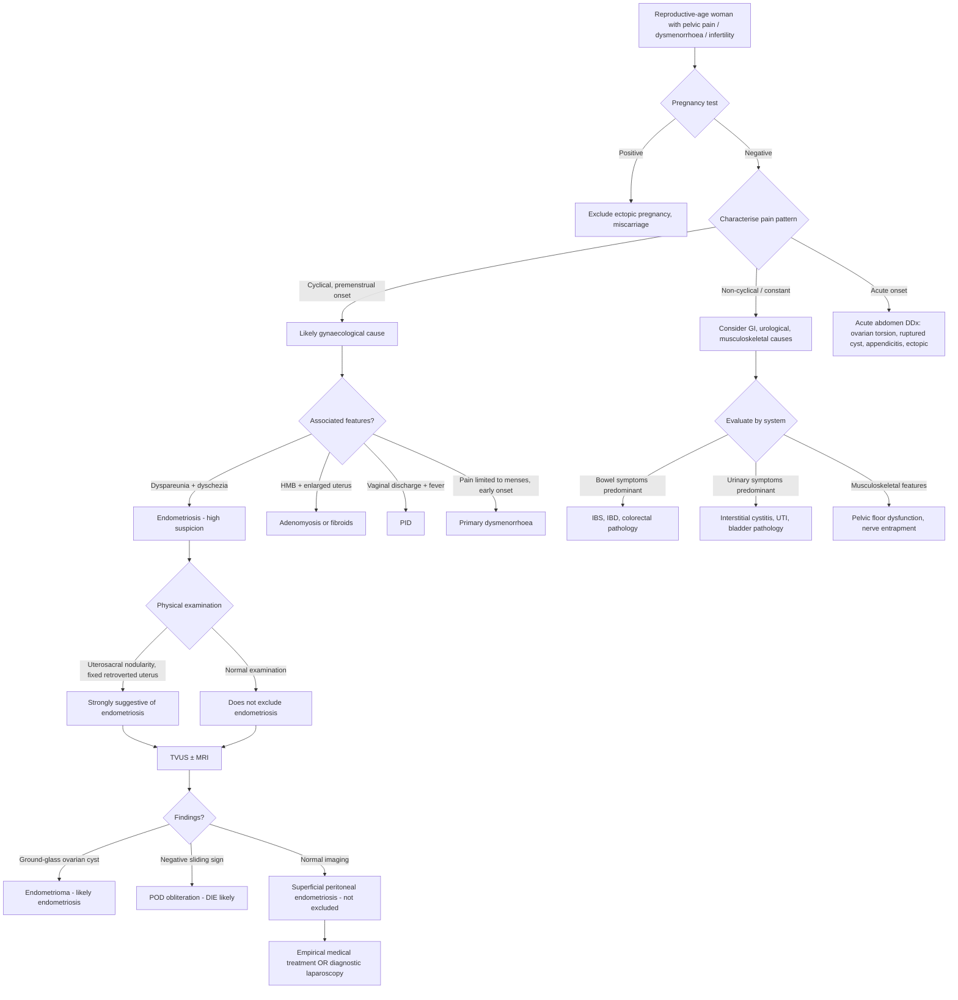

## Differential Diagnosis of Endometriosis

### The Core Problem: Why is DDx Important?

Endometriosis is a clinical chameleon. Its symptoms — pelvic pain, dysmenorrhoea, dyspareunia, infertility, bowel/bladder symptoms — are **non-specific** and overlap with a wide range of gynaecological, gastrointestinal, urological, and musculoskeletal conditions. The average diagnostic delay of 7–10 years exists precisely because clinicians (and patients) often attribute symptoms to "normal period pain" or other more common diagnoses. A systematic approach to the differential diagnosis is therefore essential.

The key principle when approaching the DDx of endometriosis is to **think by presenting complaint**, because endometriosis can masquerade as many different conditions depending on which organ system is predominantly affected.

---

### Organising Framework for the Differential Diagnosis

The DDx of endometriosis is best organised around the **three cardinal presentations**:

1. **Chronic pelvic pain / dysmenorrhoea** (the most common presentation)
2. **Pelvic mass** (endometrioma presenting as an adnexal mass)
3. **Infertility** (endometriosis as a cause of subfertility)

We will address each systematically.

---

### A. Differential Diagnosis of Chronic Pelvic Pain / Dysmenorrhoea

This is the most common clinical scenario: a reproductive-age woman presenting with pelvic pain, often cyclical, with or without dyspareunia and bowel/bladder symptoms.

#### Gynaecological Causes

| Condition | Key Distinguishing Features | Why It Can Mimic Endometriosis |
|---|---|---|
| ***Primary dysmenorrhoea*** [1] | Onset within 6 months–2 years of menarche; pain limited to menses (starts day 0–2, resolves by 12–72 hours); NO pain between periods; responds well to NSAIDs/COCP; ***no demonstrable disease accounting for symptoms*** [1]; due to ***prostaglandin release (esp PGF2α) → uterine contractions → intrauterine pressure > systolic BP → arterial ischaemia → "uterine angina"*** [1] | Both cause cyclical pelvic pain. However, primary dysmenorrhoea classically starts early after menarche, is limited to menses, and improves after first childbirth. Endometriosis pain typically starts BEFORE menses, persists AFTER, and worsens progressively over years. |
| ***Adenomyosis*** [2] | ***Diffusely enlarged, globular, boggy uterus*** [2]; ***heavy menstrual bleeding (60%)*** [2]; ***dysmenorrhoea limited to menses (25%)*** [2]; ***generally NOT associated with dyspareunia*** [2]; peak age 35–50 years; ***pathogenetically distinct from endometriosis although it commonly co-occurs*** [2] | Both cause dysmenorrhoea and infertility. Key differences: adenomyosis → enlarged uterus, HMB predominates; endometriosis → normal-sized uterus, dyspareunia predominates. TVUS shows junctional zone thickening in adenomyosis vs. endometriomas/peritoneal deposits in endometriosis. |
| ***PID (Pelvic Inflammatory Disease)*** [3] | ***Bilateral lower abdominal pain***, ***deep dyspareunia***, ***abnormal vaginal or cervical discharge***, ***cervical excitation and adnexal tenderness***, ***fever (> 38.3°C)*** [3]; sexually active with risk factors for STIs; acute/subacute onset | Both cause pelvic pain and dyspareunia. PID is typically acute/subacute with fever, discharge, and raised inflammatory markers. Endometriosis is chronic and cyclical without fever or discharge. However, chronic PID can mimic chronic endometriosis. |
| ***Leiomyomas (Fibroids)*** [1] | ***More common for > 35 years***, ***usually associated with heavy flow with clots*** [1]; ***enlarged, irregularly-shaped, non-tender uterus*** [1]; pain is usually related to mass effect, degeneration, or torsion of pedunculated fibroid rather than cyclical | Both can cause pelvic pain and infertility. Fibroids → irregular uterine enlargement; endometriosis → uterosacral nodularity. ***Uterine enlargement in fibroids is irregular and focal*** [2] while adenomyosis is diffuse. |
| ***Ovarian cyst complications*** [3] | ***Sudden onset of severe pain*** [3]; torsion causes acute colicky pain with nausea/vomiting; rupture causes acute peritonism with free fluid; haemorrhage causes acute pain with adnexal mass | Endometriomas themselves can undergo these acute complications. Other functional cysts can mimic endometriosis-related adnexal pain. The key is the acuity — acute onset suggests complication, chronic cyclical pain suggests endometriosis. |
| ***Tubal ectopic pregnancy*** [3] | ***ALWAYS excluded by pregnancy test*** [3]; ***LMP classically 6–8 weeks ago (amenorrhoea)***; ***pain starts unilaterally***; ***± signs of haemoperitoneum and shock: syncope episodes, shoulder tip pain*** [3] | Ectopic pregnancy can cause acute pelvic pain mimicking an acute complication of endometriosis. Pregnancy test is the critical discriminator. |
| Adhesions | History of previous pelvic/abdominal surgery or PID; constant traction-type pain, not necessarily cyclical; no specific imaging findings | Adhesions cause chronic pelvic pain by tethering of organs. Endometriosis itself causes adhesions, so the two frequently coexist. |
| Developmental anomalies | Outflow tract obstruction (e.g., imperforate hymen, transverse vaginal septum) → obstructed menstruation → severe cyclical pain; typically presents soon after menarche with primary amenorrhoea + cyclical pain | Obstructive anomalies actually CAUSE endometriosis (by forcing retrograde menstruation). Must be excluded in young girls with early-onset severe dysmenorrhoea and no menses. |

<Callout title="Exam Favourite: Primary vs. Secondary Dysmenorrhoea" type="idea">
***Endometriosis is the most common cause of secondary dysmenorrhoea*** [1]. The key distinguishing features are:
- **Primary**: onset within 6 months–2 years of menarche, pain limited to menses, responds to NSAIDs/COCP, no demonstrable pathology
- **Secondary (endometriosis)**: onset later (or progressive worsening), pain starts BEFORE menses and continues AFTER, associated dyspareunia/dyschezia/infertility, may NOT fully respond to NSAIDs
- ***Features suggestive of secondary cause: onset < 6 months or > 2 years from menarche; or late onset with history of freedom from dysmenorrhoea; pain during non-menstrual phase of cycle; associating symptoms: dyspareunia, vaginal discharge, AUB*** [1]
</Callout>

#### Gastrointestinal Causes

| Condition | Key Distinguishing Features | Why It Can Mimic Endometriosis |
|---|---|---|
| **Irritable Bowel Syndrome (IBS)** | Chronic abdominal pain with altered bowel habit (constipation/diarrhoea/alternating); relieved by defaecation; no alarm features; Rome IV criteria; no structural abnormality | IBS and endometriosis have HUGE symptom overlap — bloating, abdominal cramps, dyschezia, altered bowel habit. Up to 50–80% of endometriosis patients meet IBS criteria. Key difference: IBS is not cyclical with menses. Many patients carry BOTH diagnoses. |
| **Inflammatory Bowel Disease (IBD)** — Crohn's disease | RLQ pain, diarrhoea (may be bloody), weight loss, perianal disease; raised inflammatory markers; endoscopic/histological confirmation | Crohn's affecting the terminal ileum/caecum can cause RLQ pain mimicking endometriosis. Rectal endometriosis can mimic Crohn's proctitis. Key: IBD is not cyclical; systemic features (fever, weight loss, extra-intestinal manifestations) are suggestive. |
| ***Acute appendicitis*** [4] | ***Periumbilical pain migrating to RLQ***; ***low-grade fever, vomiting, anorexia***; ***McBurney's point tenderness, Rovsing's sign, psoas sign, obturator sign*** [4] | Acute presentation of right-sided endometriosis or right ovarian endometrioma can mimic appendicitis. Appendicitis is acute and progressive; endometriosis is chronic and cyclical. |
| ***Diverticulitis*** [4] | LLQ pain (sigmoid diverticulitis); fever; raised WCC/CRP; CT shows pericolic inflammation | Left-sided pelvic endometriosis can mimic sigmoid diverticulitis, especially in older women. |

#### Urological Causes

| Condition | Key Distinguishing Features | Why It Can Mimic Endometriosis |
|---|---|---|
| **Interstitial Cystitis / Bladder Pain Syndrome** | Chronic suprapubic pain, urgency, frequency; pain relieved by voiding; negative urine cultures; cystoscopy may show Hunner's lesions | Bladder endometriosis causes identical symptoms. Key: interstitial cystitis is NOT cyclical. Bladder endometriosis worsens with menses. The two can coexist (viscero-visceral cross-talk). |
| ***UTI*** [3] | ***Urinary symptoms should be present***; ***rarely associated with peritoneal signs*** [3]; dysuria, frequency, positive urine culture | Recurrent UTI-like symptoms in a young woman without positive cultures should raise suspicion for bladder endometriosis. |
| ***Ureteric colic*** | Colicky flank pain, haematuria, unilateral; CT KUB shows stone | Ureteric endometriosis can cause identical symptoms including hydronephrosis. Key: cyclical pattern and absence of stone on imaging. |

#### Musculoskeletal / Other Causes

| Condition | Key Distinguishing Features |
|---|---|
| **Myofascial pelvic pain / pelvic floor dysfunction** | Tender trigger points in pelvic floor muscles on digital examination; often secondary to chronic endometriosis (central sensitisation) |
| **Nerve entrapment (e.g., pudendal neuralgia)** | Burning/shooting pain in pudendal nerve distribution; worsened by sitting; positive Tinel's sign at ischial spine |
| **Psychological / central pain syndromes** | Fibromyalgia, chronic fatigue syndrome — comorbid with endometriosis in up to 30% of cases; reflects central sensitisation |

---

### B. Differential Diagnosis of Pelvic Mass (Endometrioma)

When endometriosis presents as an adnexal mass (endometrioma), the DDx is that of ***any pelvic mass*** [5].

***The differential diagnosis for a pelvic mass should be classified according to gynaecological and non-gynaecological causes*** [5]. ***Non-gynaecological causes are separated into gastrointestinal, urological, and retroperitoneal*** [5].

<Callout title="Don't Forget!" type="error">
***Don't forget about pregnancy → especially for teenage girls*** [5]. ***Pseudocyst related to previous surgeries*** [5] must also be considered. ALWAYS do a pregnancy test before any investigation of a pelvic mass.
</Callout>

#### Gynaecological Causes of Adnexal Mass

| Category | Conditions | Key Features Distinguishing from Endometrioma |
|---|---|---|
| **Functional ovarian cysts** | Follicular cyst, corpus luteum cyst | Usually < 6 cm, thin-walled, anechoic on USS (not ground-glass), resolve spontaneously within 2–3 cycles |
| **Benign ovarian neoplasms** | Mature cystic teratoma (dermoid), serous cystadenoma, mucinous cystadenoma | Dermoid: echogenic foci with shadowing (fat, hair, teeth). Serous: thin-walled, unilocular, anechoic. Mucinous: multilocular with fine septations. |
| ***Ovarian malignancy*** [6] | Epithelial ovarian cancer (serous, mucinous, endometrioid, clear cell) | Complex mass with solid components, thick septa, papillary projections, ascites, elevated CA125 (but CA125 is also elevated in endometriosis!). ***CA125 > 35 U/mL as cutoff but low specificity in pre-menopausal women (pregnant, menstruation, benign ovarian tumors, endometriosis, cirrhosis, pancreatitis)*** [6]. |
| **Hydrosalpinx / Tubo-ovarian abscess** | Hydrosalpinx (dilated, fluid-filled tube), TOA (complex adnexal mass with debris/septations) | Hydrosalpinx: tubular shape ("incomplete septation" or "cogwheel" sign). TOA: fever, leucocytosis, associated PID features. |
| **Ectopic pregnancy** | Adnexal mass + positive β-hCG + empty uterus | Always exclude with pregnancy test |
| **Paraovarian cyst** | Arises from mesosalpinx (broad ligament remnants), separate from ovary on USS | Typically unilocular, anechoic; ovary visualised separately |

#### Non-Gynaecological Causes of Pelvic Mass

| Category | Conditions |
|---|---|
| **Gastrointestinal** | Appendiceal mass/abscess, diverticular abscess, colorectal carcinoma, Crohn's inflammatory mass |
| **Urological** | Pelvic kidney, distended bladder, bladder tumour |
| **Retroperitoneal** | Lymphoma, sarcoma, nerve sheath tumour |
| ***Pregnancy*** [5] | ***Especially in teenage girls*** [5] — gravid uterus |
| ***Pseudocyst*** [5] | ***Related to previous surgeries*** [5] |

<Callout title="Endometrioma vs. Ovarian Malignancy — The Critical Distinction">
Both endometriomas and ovarian cancer can present as a pelvic mass with elevated CA125. Key differences:

**Endometrioma:**
- Young reproductive-age woman
- Cyclical pain
- USS: homogeneous ground-glass echoes, no solid components, no papillary projections
- CA125 mildly elevated (usually < 200 U/mL)
- No ascites

**Ovarian cancer:**
- Typically postmenopausal (but can occur in young women)
- Non-cyclical, progressive symptoms
- USS: complex mass with solid components, thick irregular septa, papillary projections, ascites
- CA125 often markedly elevated
- Weight loss, abdominal distension

Remember: endometriomas carry a small (1–2.5%) risk of malignant transformation (to endometrioid or clear cell carcinoma), so persistent or enlarging endometriomas warrant surveillance.
</Callout>

---

### C. Differential Diagnosis of Infertility (Endometriosis as a Cause)

***The five important causes of infertility*** are [7][8]:

1. ***Ovulatory dysfunction / anovulation***
2. ***Tubal problems***
3. ***Endometriosis***
4. ***Male factors***
5. ***Unexplained***

***Endometriosis accounts for approximately 25% of female factor infertility*** [7][8].

When a woman presents with infertility, endometriosis must be differentiated from these other causes:

| Cause | Proportion | Key Differentiating Features |
|---|---|---|
| ***Ovulatory dysfunction*** [7][8] | ***15%*** | Irregular/absent periods, anovulatory cycles; confirmed by day 21 progesterone < 30 nmol/L; causes include PCOS (most common), hyperprolactinaemia, thyroid disease, hypothalamic amenorrhoea |
| ***Tubal problems*** [7][8] | ***20%*** | History of PID, ectopic pregnancy, pelvic surgery; confirmed by HSG or laparoscopy showing tubal occlusion; may coexist with endometriosis (which itself causes tubal damage) |
| ***Endometriosis*** [7][8] | ***25%*** | Cyclical pain, dyspareunia, dyschezia; may be asymptomatic; confirmed by laparoscopy |
| ***Male factors*** [7][8] | ***30%*** | ***Abnormal semen due to production defects (e.g., idiopathic, endocrine, trauma, genetic)***; ***no sperm due to obstructive defects (e.g., absent vas, vasectomy)***; ***coital factors*** [7][8]; semen analysis is the key investigation |
| ***Unexplained*** [7][8] | By exclusion | ***By exclusion in the presence of ovulation, patent tubes, and normal semen*** [7][8] |

<Callout title="Important Clinical Point" type="idea">
Infertility evaluation is a **couple-based** assessment. Even when endometriosis is found in the female partner, male factors must be concurrently evaluated (semen analysis) because **30% of infertility involves male factors** [7][8], and combined male + female factors are common.
</Callout>

---

### D. Differential Diagnosis by Specific Symptom Presentation

This summary table maps each presenting symptom to the relevant DDx:

| Presenting Symptom | Endometriosis Mechanism | Key DDx to Exclude |
|---|---|---|
| **Cyclical dysmenorrhoea** | Ectopic implant bleeding + prostaglandin release | Primary dysmenorrhoea, adenomyosis, fibroids |
| **Chronic pelvic pain** | Adhesions, central sensitisation, neurotropism | IBS, IBD, interstitial cystitis, pelvic floor dysfunction, adhesions |
| **Deep dyspareunia** | DIE in uterosacral ligaments / rectovaginal septum | PID, ovarian cyst, retroverted uterus (non-pathological) |
| **Dyschezia** | Rectovaginal / rectal endometriosis | IBS, IBD (Crohn's proctitis), rectal carcinoma |
| **Cyclical rectal bleeding** | Transmural bowel endometriosis | IBD, colorectal carcinoma, haemorrhoids |
| **Cyclical haematuria** | Bladder endometriosis | UTI, bladder carcinoma, renal stone |
| **Catamenial pneumothorax** | Diaphragmatic/pleural endometriosis | Spontaneous pneumothorax, LAM (lymphangioleiomyomatosis) |
| **Adnexal mass** | Endometrioma | Functional cyst, dermoid, cystadenoma, ovarian cancer, ectopic pregnancy |
| **Infertility** | Multifactorial (see above) | Anovulation, tubal factor, male factor, unexplained |
| **Scar nodule** | Iatrogenic implantation at surgical sites | Incisional hernia, suture granuloma, desmoid tumour, metastatic deposit |

---

### Clinical Approach to Differential Diagnosis — Decision Algorithm

The following mermaid diagram illustrates the clinical thought process when a reproductive-age woman presents with suspected endometriosis symptoms:

---

### Key Distinguishing Features: Endometriosis vs. Its Main Mimics

| Feature | Endometriosis | Primary Dysmenorrhoea | Adenomyosis | PID | IBS |
|---|---|---|---|---|---|
| **Age at onset** | 25–35 years | Within 2 years of menarche | 35–50 years | Any sexually active age | Any age |
| **Pain timing** | Premenstrual → menstrual → postmenstrual | Menstrual only (day 0–3) | Menstrual only | Constant / subacute | Not cyclical |
| **Dyspareunia** | **Deep**, common | Uncommon | Generally absent | Deep (acute PID) | Uncommon |
| **Discharge** | None | None | None | Purulent | None |
| **Fever** | Absent | Absent | Absent | Present | Absent |
| **Uterine size** | Normal | Normal | Diffusely enlarged, boggy | Normal/tender | Normal |
| **Examination** | Uterosacral nodularity, fixed uterus | Normal | Globular tender uterus | Cervical excitation, adnexal tenderness | Normal |
| **NSAID response** | Partial | Usually excellent | Partial | No (needs antibiotics) | Variable |
| **Infertility** | Yes (25%) | No | Controversial | Yes (tubal damage) | No |

---

<Callout title="High Yield Summary">

**Differential Diagnosis of Endometriosis — Key Exam Points:**

1. **Think by presenting complaint**: chronic pelvic pain → DDx includes primary dysmenorrhoea, adenomyosis, PID, IBS, interstitial cystitis; pelvic mass → DDx includes functional cysts, dermoid, ovarian cancer; infertility → DDx includes anovulation, tubal factor, male factor, unexplained
2. ***Endometriosis is the most common cause of secondary dysmenorrhoea*** [1]
3. ***Primary vs. secondary dysmenorrhoea*** [1]: primary = no pathology, onset near menarche, pain limited to menses, responds to NSAIDs; secondary = demonstrable cause, pain extends beyond menses, progressive
4. ***Adenomyosis is pathogenetically distinct from endometriosis but commonly co-occurs*** [2]; adenomyosis → enlarged boggy uterus + HMB; endometriosis → normal uterus + dyspareunia
5. ***Always exclude pregnancy (especially ectopic) with a pregnancy test*** [3][5]
6. ***CA125 has low specificity in pre-menopausal women*** [6] — elevated in endometriosis, pregnancy, menstruation, PID, cirrhosis → cannot reliably distinguish endometrioma from ovarian cancer
7. ***Five causes of infertility: ovulatory dysfunction, tubal problems, endometriosis (25%), male factors (30%), unexplained*** [7][8]
8. **Cyclical pattern is the key discriminator** — endometriosis symptoms are cyclical (tied to menses); most DDx conditions are not cyclical (IBS, interstitial cystitis, adhesions)
9. **Symptom overlap with IBS is enormous** — up to 50–80% of endometriosis patients meet IBS criteria; always consider endometriosis in a young woman "diagnosed" with IBS

</Callout>

---

<ActiveRecallQuiz
  title="Active Recall - Differential Diagnosis of Endometriosis"
  items={[
    {
      question: "A 22-year-old woman presents with cyclical pelvic pain starting 2 days before menses, deep dyspareunia, and dyschezia. Her periods have been regular since age 12 but the pain has worsened progressively over the past 3 years. What is the most likely diagnosis, and name three key features that distinguish this from primary dysmenorrhoea?",
      markscheme: "Most likely diagnosis: Endometriosis (secondary dysmenorrhoea). Three distinguishing features from primary dysmenorrhoea: (1) Pain starts BEFORE menses (premenstrual) and extends beyond menses, not limited to menstrual days; (2) Associated symptoms of deep dyspareunia and dyschezia suggest extra-uterine pathology; (3) Progressive worsening over years rather than stable pattern. Primary dysmenorrhoea is limited to menses, onset near menarche, no extra-uterine symptoms, and responds well to NSAIDs."
    },
    {
      question: "List the five important causes of female infertility as given in the lecture slides, with their approximate proportions.",
      markscheme: "1. Ovulatory dysfunction/anovulation (15%), 2. Tubal problems (20%), 3. Endometriosis (25%), 4. Male factors (30%), 5. Unexplained (by exclusion in the presence of ovulation, patent tubes, and normal semen)."
    },
    {
      question: "A 35-year-old woman with suspected endometriosis has a 6 cm adnexal mass on ultrasound showing homogeneous low-level internal echoes. Her CA125 is 85 U/mL. Name three other conditions that can elevate CA125 in a pre-menopausal woman and explain why CA125 alone cannot distinguish endometrioma from ovarian cancer.",
      markscheme: "Three conditions elevating CA125 in pre-menopausal women: (1) Pregnancy, (2) Menstruation, (3) PID/peritonitis, (also acceptable: cirrhosis, pancreatitis, benign ovarian tumours). CA125 cannot distinguish because it is secreted by any inflamed or proliferating mesothelial/coelomic epithelium, not exclusively by malignancy. In pre-menopausal women, the specificity is low because multiple benign conditions elevate it. Need to integrate with imaging features (solid components, papillary projections, ascites suggest malignancy vs. ground-glass echoes suggest endometrioma) and clinical context."
    },
    {
      question: "Explain why IBS and endometriosis have such significant symptom overlap and how you would clinically differentiate them.",
      markscheme: "Overlap occurs because: (1) Endometriotic implants on rectosigmoid/rectovaginal septum cause bowel symptoms (bloating, cramping, dyschezia, altered bowel habit) identical to IBS; (2) Viscero-visceral cross-talk means pelvic inflammation can sensitise bowel nerves; (3) Central sensitisation amplifies both pelvic and GI pain. Differentiation: endometriosis symptoms are CYCLICAL (worse with menses), associated with dysmenorrhoea and dyspareunia, and examination may reveal uterosacral nodularity. IBS symptoms are NOT cyclical, no gynecological associations, normal pelvic examination. However, 50-80% of endometriosis patients meet IBS criteria, so both can coexist."
    },
    {
      question: "A pelvic mass is found in a 16-year-old girl presenting with lower abdominal pain. Name two critical diagnoses that must be excluded first, and classify the differential diagnosis of a pelvic mass into gynaecological and non-gynaecological categories with examples.",
      markscheme: "Two critical diagnoses to exclude: (1) Pregnancy (especially ectopic pregnancy - do pregnancy test), (2) Ovarian torsion (acute surgical emergency). Classification: Gynaecological - functional cysts, endometrioma, dermoid cyst, cystadenoma, ovarian malignancy, tubo-ovarian abscess, ectopic pregnancy, paraovarian cyst. Non-gynaecological - GI (appendiceal mass, diverticular abscess, colorectal cancer), urological (pelvic kidney, distended bladder), retroperitoneal (lymphoma, sarcoma), pseudocyst from previous surgery."
    }
  ]}
/>

## References

[1] Senior notes: Adrian Lui Gynecology Notes.pdf (Section 2.3.1 Approach to Dysmenorrhoea, p43–44)
[2] Senior notes: Adrian Lui Gynecology Notes.pdf (Section 2.3.3 Adenomyosis, p50–51)
[3] Senior notes: Adrian Lui Gynecology Notes.pdf (Section on PID diagnosis and DDx, p66)
[4] Senior notes: Maksim Surgery Notes.pdf (Section 4.6 Acute appendicitis, p89)
[5] Lecture slides: Block C - Pelvic mass_ ovarian cancer and cysts; uterine fibroid; pelvic imaging.pdf (p17)
[6] Senior notes: Adrian Lui Gynecology Notes.pdf (Section on ovarian cancer evaluation, p84)
[7] Lecture slides: GC 117. I want to have a baby male and female infertility.pdf (p8–9)
[8] Lecture slides: Block C - I want to have a baby_ male and female infertility.pdf (p3)
