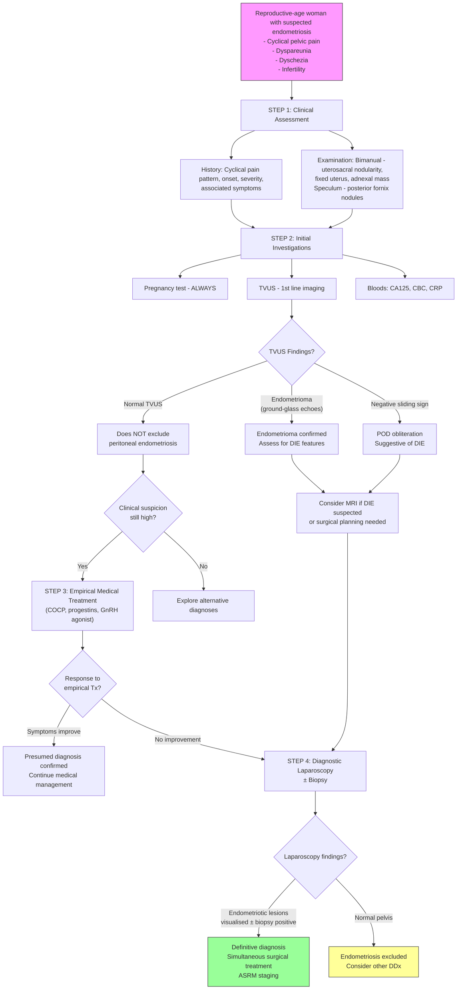

## Diagnostic Criteria and Investigations for Endometriosis

### The Diagnostic Challenge — Why Is Endometriosis So Hard to Diagnose?

Before diving into specific investigations, it is crucial to understand **why** endometriosis has an average diagnostic delay of 7–10 years:

1. **Symptoms are non-specific** — overlap with primary dysmenorrhoea, IBS, PID, interstitial cystitis
2. **Physical examination is often normal** — especially in superficial peritoneal disease
3. **No single blood test is diagnostic** — CA125 has poor sensitivity and specificity
4. **Standard imaging misses superficial disease** — TVUS and MRI are excellent for endometriomas and deep infiltrating endometriosis (DIE), but have **poor sensitivity (~11%) for peritoneal implants** [1]
5. **The gold standard (laparoscopy) is invasive** — requires general anaesthesia and carries surgical risks, so is not used as a first-line screening tool

This means the diagnostic approach follows a **stepwise escalation**: clinical suspicion → non-invasive investigations → empirical treatment → invasive confirmation only when needed.

---

### Diagnostic Criteria

Unlike many conditions, endometriosis does **not** have a single universally accepted set of diagnostic criteria (like the Jones criteria for rheumatic fever or the McDonald criteria for MS). Instead, diagnosis operates at two levels:

#### 1. Presumed (Clinical) Diagnosis

***A presumed diagnosis of endometriosis can be made based on symptoms and signs + imaging + response to empirical treatment*** [1].

This is the approach used in the majority of cases in clinical practice. The rationale is that if a woman has typical symptoms (cyclical pelvic pain, dyspareunia, dyschezia), supportive imaging (endometrioma on TVUS, or negative sliding sign), and responds to empirical hormonal treatment (e.g., COCP, progestins, GnRH agonists), then the clinical diagnosis is sufficiently secure to continue management without laparoscopy.

The 2022 ESHRE (European Society of Human Reproduction and Embryology) guideline and the 2024 NICE guideline both support this approach — **laparoscopy is no longer considered mandatory for diagnosis** in all cases.

#### 2. Definitive (Surgical/Histological) Diagnosis

***Diagnostic laparoscopy ± biopsy remains the gold standard for definitive diagnosis*** [1].

**Indications for diagnostic laparoscopy** [1]:
- ***Persistent pain not responding to medical treatment*** — if empirical treatment fails, you need to confirm the diagnosis and exclude other pathology
- **Infertility workup** — to assess and potentially treat pelvic disease simultaneously (diagnostic AND therapeutic)
- **Diagnostic uncertainty** — when the clinical picture is atypical or imaging is inconclusive
- **Suspected deep infiltrating endometriosis** — to map disease extent for surgical planning
- **Pre-operative planning** — before complex excisional surgery

**At laparoscopy, the diagnosis is made by:**
1. **Visual identification** of endometriotic lesions (red, black/powder-burn, or white lesions on peritoneal surfaces; endometriomas; adhesions)
2. **Histological confirmation** via biopsy — the presence of **endometrial glands AND stroma** in the biopsy specimen confirms the diagnosis

<Callout title="Histology vs. Visual Diagnosis" type="error">
Visual identification at laparoscopy alone has a **false positive rate of ~20-25%** (some lesions that look like endometriosis are not) and a **false negative rate** (some atypical or subtle lesions are missed). Therefore, the ESHRE guideline recommends **biopsy for histological confirmation**, especially when visual findings are atypical. However, a positive visual finding by an experienced surgeon is considered sufficient for clinical management in many settings. A **negative laparoscopy reliably excludes endometriosis** (high negative predictive value).
</Callout>

<Callout title="Key Concept: You Do NOT Need Laparoscopy to Start Treatment">
This is a paradigm shift from older teaching. Current guidelines (ESHRE 2022, NICE 2024) allow **empirical treatment based on clinical suspicion** without surgical confirmation. Laparoscopy is reserved for:
- Treatment failure
- Infertility assessment
- Diagnostic uncertainty
- Surgical planning for complex disease

This avoids unnecessary surgery and reduces diagnostic delay.
</Callout>

---

### Diagnostic Algorithm

The following algorithm outlines the stepwise approach to diagnosing endometriosis, integrating clinical assessment, non-invasive investigations, and invasive confirmation:

---

### Investigation Modalities — Detailed Breakdown

#### 1. Pregnancy Test

- **Always the first investigation** in any reproductive-age woman with pelvic pain or a pelvic mass
- ***ALWAYS exclude pregnancy — especially ectopic pregnancy*** [3][5]
- Urine β-hCG is rapid and sufficient for screening; serum β-hCG for quantification if positive

---

#### 2. Transvaginal Ultrasound (TVUS) — First-Line Imaging

***TVUS is the first-line imaging modality for endometriosis*** [1].

**Why TVUS?**
- Non-invasive, widely available, no radiation, relatively inexpensive
- Excellent for detecting endometriomas and deep infiltrating endometriosis
- Can be performed in the outpatient clinic
- Operator-dependent — expertise matters significantly

**Key TVUS Findings in Endometriosis:**

| Finding | Description | Significance |
|---|---|---|
| ***Endometrioma*** [1][9] | ***Unilocular cyst with homogeneous low-level internal echoes ("ground-glass" appearance)*** [1]; thick wall; no internal vascularity on Doppler; may have wall nodularity | Highly specific for endometrioma. The "ground-glass" appearance is due to thick, old haemolysed blood (haemosiderin). ***Usually separated from uterus; less mobile if adhesions, endometriosis*** [9] |
| ***Negative sliding sign*** [1] | ***Loss of normal sliding movement between the anterior rectosigmoid and the posterior uterus*** during real-time TVUS with gentle pressure | ***Indicates obliteration of the Pouch of Douglas due to endometriosis*** [1]. Normally, the rectum slides freely over the posterior uterus; adhesions from DIE fix these structures together. This is a dynamic assessment unique to ultrasound. |
| **Deep infiltrating endometriotic nodules** | Hypoechoic, irregularly marginated, solid lesions in the rectovaginal septum, uterosacral ligaments, bladder, or bowel wall | Can identify DIE with high specificity when performed by an experienced sonographer. ***Peritoneal deposits appear as hypoechoic, vascular and/or solid mass with irregular spiculated margins*** [1] |
| **"Kissing ovaries"** | Both ovaries adherent to each other behind the uterus in the Pouch of Douglas | Suggests dense adhesions pulling the ovaries into the POD — marker of severe disease |
| **Adenomyosis features** | Asymmetric myometrial thickening, subendometrial echogenic linear striations/cysts, increased vascularity | Adenomyosis frequently coexists with endometriosis; TVUS has moderate sensitivity for adenomyosis |

<Callout title="Critical Limitation of TVUS" type="error">
***TVUS has poor sensitivity (~11%) for superficial peritoneal implants*** [1]. This means a **normal TVUS does NOT exclude endometriosis**. It can only reliably detect endometriomas (> 1–2 cm) and some forms of DIE. Superficial peritoneal disease — which may be the ONLY form present in Stage I–II endometriosis — is invisible on ultrasound.
</Callout>

---

#### 3. Pelvic Examination Findings (Revisited for Diagnostic Context)

***Pelvic examination should specifically assess*** [9][10]:
- ***Lower genital tract***
- ***Uterus***
- ***Adnexal mass — size, tenderness, mobility, arising from pelvis*** [10]
- ***Pouch of Douglas — nodularity, thickening, tenderness in endometriosis*** [10]
- ***Rectal examination*** [10]

The rationale for each:
- **Adnexal mass**: An endometrioma is typically fixed (due to adhesions), tender, and separate from the uterus. A functional cyst is mobile and non-tender.
- **POD assessment**: Palpable uterosacral nodularity or a tender, thickened rectovaginal septum is **highly specific** for DIE and may be the only clinical sign.
- **Rectal examination**: Allows palpation of the anterior rectal wall for nodules (rectovaginal DIE) and assessment of the rectovaginal septum.

---

#### 4. Magnetic Resonance Imaging (MRI)

***MRI has increased specificity and sensitivity compared to TVUS, but is not considered first-line (ESHRE 2022)*** [1].

**When to use MRI:**
- **Suspected DIE** — to map the extent of disease before surgery (especially bowel, bladder, ureteric involvement)
- **Indeterminate adnexal mass** — to characterise when TVUS is inconclusive
- **Surgical planning** — to help surgeons anticipate the need for bowel resection, ureteric stenting, etc.
- **Research / specialist centres** — for comprehensive disease mapping

**Key MRI Findings:**

| Finding | MRI Appearance | Significance |
|---|---|---|
| **Endometrioma** | High signal on T1-weighted images (blood products); **"shading" sign** = loss of signal on T2-weighted images (due to high iron/protein content of old blood) | The T1-high / T2-shading combination is highly specific for endometrioma (distinguishes from other haemorrhagic cysts) |
| **DIE nodules** | Low signal on both T1 and T2 (fibrous tissue) ± foci of high T1 signal (haemorrhagic foci) | Identifies DIE in uterosacral ligaments, rectovaginal septum, bladder, bowel wall |
| **Adenomyosis** | ***Thickening of the junctional zone > 12 mm*** ± foci of high T1/T2 signal density [2] | Confirms coexisting adenomyosis |
| **Adhesions** | Indirect signs — angulation of bowel loops, distortion of anatomy, "tethering" of ovaries | MRI is not excellent at detecting adhesions directly |

---

#### 5. Blood Tests

##### CA125

- **What is it?** Cancer Antigen 125 — a glycoprotein expressed by coelomic epithelium (mesothelium, endometrium, fallopian tube, ovarian surface epithelium)
- **Role in endometriosis**: Mildly elevated in endometriosis (typically 35–200 U/mL); more significantly elevated in advanced disease (Stage III–IV)
- **Limitations**: ***CA125 > 35 U/mL as cutoff but has low specificity in pre-menopausal women — elevated in pregnancy, menstruation, benign ovarian tumours, endometriosis, cirrhosis, pancreatitis*** [6]
- **Clinical utility**: NOT useful as a diagnostic test for endometriosis. May have some role in monitoring treatment response or disease recurrence, but guidelines do not recommend routine CA125 for diagnosis.
- **Why it is elevated**: Endometriotic implants express CA125 on their surface; peritoneal inflammation also increases CA125 release from mesothelial cells.

##### Other Blood Tests

| Test | Role | Interpretation |
|---|---|---|
| **CBC** | Assess for anaemia (if heavy menstrual bleeding coexists — adenomyosis/fibroids) | Iron deficiency anaemia with microcytic indices suggests chronic blood loss |
| **CRP / ESR** | Non-specific inflammatory markers | Usually normal or mildly elevated; significant elevation suggests infection (PID) rather than endometriosis |
| **TSH, Prolactin** | Part of infertility workup | Exclude thyroid dysfunction and hyperprolactinaemia as causes of anovulation |
| **Day 2–5 FSH, LH, E2, AMH** | Ovarian reserve assessment in infertility context | AMH may be reduced if endometriomas have destroyed ovarian cortex (reduced ovarian reserve) |

<Callout title="There Is No Reliable Biomarker for Endometriosis" type="idea">
Despite decades of research, no single blood or urine biomarker has sufficient sensitivity and specificity to diagnose endometriosis non-invasively. CA125, CA19-9, IL-6, and various experimental markers (e.g., microRNAs, cell-free DNA) have all been studied but none are recommended for clinical diagnosis (ESHRE 2022, NICE 2024). This is why the diagnosis still relies on the clinical–imaging–surgical triad.
</Callout>

---

#### 6. Hysterosalpingography (HSG)

- **What is it?** Fluoroscopic X-ray imaging of the uterine cavity and fallopian tubes after injection of radio-opaque contrast through the cervix
- **Role in endometriosis**: Not used to diagnose endometriosis directly, but essential in the **infertility workup** to assess **tubal patency**

***HSG is indicated for women with no comorbidities such as previous PID or ectopic pregnancy and no clinical signs/symptoms of endometriosis*** [11]. It is a ***less invasive and outpatient procedure*** [11] that ***can assess the uterine cavity*** [11].

***Hysterosalpingo-contrast-ultrasonography (HyCoSy) may be an alternative to HSG*** [11].

**Key HSG findings relevant to endometriosis:**
- **Tubal occlusion** (proximal or distal) — suggests tubal damage from adhesions
- **Hydrosalpinx** — dilated, contrast-filled tube without peritoneal spill
- **Irregular uterine cavity** — may suggest adenomyosis or synechiae (but not specific for endometriosis)
- **Localised contrast pooling** — may suggest peritoneal adhesions (indirect sign)

<Callout title="HSG vs. Laparoscopy for Tubal Assessment">
***HSG is less invasive and an outpatient procedure; laparoscopy is an operative procedure requiring general anaesthesia but is more accurate and can assess AND treat disease*** [11].

***Laparoscopy is preferred in women thought to have comorbidities*** [11] (e.g., suspected endometriosis, previous PID, previous ectopic pregnancy) — because at laparoscopy you can simultaneously:
1. Confirm tubal patency (with dye test — chromopertubation)
2. Visualise and biopsy endometriotic lesions
3. Treat disease surgically (excision/ablation of implants, adhesiolysis, cystectomy)
</Callout>

---

#### 7. Diagnostic Laparoscopy ± Biopsy — The Gold Standard

***Diagnostic laparoscopy ± biopsy is the gold standard for definitive diagnosis of endometriosis*** [1].

**Procedure:**
1. Under general anaesthesia, pneumoperitoneum is established (CO₂ insufflation)
2. A laparoscope is inserted through an umbilical port
3. Systematic inspection of the pelvis: peritoneal surfaces, ovaries, tubes, uterosacral ligaments, Pouch of Douglas, bladder peritoneum, bowel surfaces
4. Identification and documentation of lesions
5. Biopsy of suspicious lesions for histological confirmation
6. Staging using the rAFS/ASRM classification
7. **Chromopertubation** (dye test): methylene blue injected through the cervix → observed spilling from the fimbrial ends → confirms tubal patency. This is the gold standard for assessing tubal patency and is routinely performed during diagnostic laparoscopy for infertility.
8. Simultaneous therapeutic intervention if appropriate (excision/ablation of implants, adhesiolysis, ovarian cystectomy)

**Visual appearances at laparoscopy:**

| Lesion Type | Appearance | Clinical Significance |
|---|---|---|
| **Red/flame-like lesions** | Bright red, petechia-like, vascularised | Early, active disease; most metabolically active |
| **Black/powder-burn lesions** | Dark brown/black, puckered | Classic appearance; older, less active; haemosiderin deposits |
| **White lesions** | Pale, scarred, fibrotic | Burnt-out disease; mostly fibrosis |
| **Endometrioma** | Smooth-walled ovarian cyst; dark "chocolate" fluid drains when opened | Ovarian endometriosis |
| **DIE nodules** | Hard, fibrous nodules > 5 mm deep, invading into organs | Most severe form; rectovaginal, uterosacral, bladder, bowel |
| **Adhesions** | Filmy (thin, translucent) or dense (thick, opaque, vascularised) | Indicate chronicity; dense adhesions distort anatomy |
| **Obliterated Pouch of Douglas** | Rectum densely adherent to posterior uterus; no free space | Hallmark of severe disease |

**Histological confirmation — what the pathologist looks for:**
- **Endometrial glands** — columnar epithelium resembling uterine glands
- **Endometrial stroma** — spindle cells surrounding the glands
- **Haemosiderin-laden macrophages** — evidence of old haemorrhage
- At least **two of the three** features should be present for definitive histological diagnosis

---

#### 8. Other Investigation Modalities

| Investigation | Role | When to Use |
|---|---|---|
| **CT Abdomen/Pelvis** | NOT routinely used for endometriosis (poor soft tissue contrast compared to MRI); useful for excluding other pathology (appendicitis, diverticulitis, bowel obstruction) | When alternative diagnoses are suspected; NOT for endometriosis characterisation |
| **Colonoscopy** | Assess for mucosal invasion of bowel endometriosis; also to exclude colorectal carcinoma or IBD | When cyclical rectal bleeding is present and bowel endometriosis is suspected |
| **Cystoscopy** | Assess for bladder mucosal endometriotic implants | Cyclical haematuria; suspected bladder endometriosis |
| **IVP / CT Urogram** | Assess for ureteric involvement (hydronephrosis, ureteric stricture) | Suspected ureteric endometriosis; flank pain; pre-operative planning for DIE surgery |
| **Renal ultrasound** | Screen for hydronephrosis | Should be performed when severe DIE is suspected, as ureteric involvement can be silent and cause progressive renal damage |
| **Chest X-ray / CT Thorax** | Assess for catamenial pneumothorax or pleural endometriosis | Cyclical chest symptoms |

---

### Investigations Specifically in the Context of Infertility Workup

When a woman with suspected endometriosis presents with infertility, the investigation workup must address **all five causes of infertility** [7][8], not just endometriosis:

| Investigation | What It Assesses | Expected Finding in Endometriosis |
|---|---|---|
| **Semen analysis** | Male factor (30% of cases) | Normal (unless concurrent male factor) |
| **Day 21 progesterone** | Ovulation | Usually normal (endometriosis does not typically cause anovulation, unless large endometriomas disrupt ovarian function) |
| **Day 2–5 FSH, LH, E2** | Ovarian reserve | May be abnormal if bilateral endometriomas have destroyed ovarian cortex |
| **AMH** | Ovarian reserve | Often reduced in bilateral endometriomas |
| **TVUS** | Endometriomas, antral follicle count, uterine pathology | Endometrioma with ground-glass echoes; reduced AFC if ovarian reserve compromised |
| ***HSG or HyCoSy*** [11] | Tubal patency | May show tubal occlusion from adhesions |
| ***Diagnostic laparoscopy with chromopertubation*** [11] | Direct visualisation of pelvic disease + tubal patency | Endometriotic lesions, adhesions, tubal occlusion confirmed by failed dye spill |
| **TSH, Prolactin** | Thyroid / hyperprolactinaemia | Usually normal |
| **Karyotype** | Chromosomal abnormalities | ***Not routinely recommended*** [11] |

***The following investigations are NOT routinely recommended in the standard infertility workup*** [11]:
- ***Advanced sperm function testing (e.g., DNA fragmentation testing)***
- ***Postcoital testing***
- ***Thrombophilia testing***
- ***Immunological testing***
- ***Karyotype***
- ***Endometrial biopsy***

---

### Diagnostic Summary Table

| Modality | What It Detects | Sensitivity for Peritoneal Disease | Sensitivity for Endometriomas | Sensitivity for DIE | Invasiveness |
|---|---|---|---|---|---|
| **Clinical examination** | Uterosacral nodularity, fixed uterus, adnexal mass | Low | Moderate | Moderate-High | Non-invasive |
| **TVUS** | Endometriomas, DIE, negative sliding sign | Very low (~11%) | High (> 90%) | Moderate-High (operator-dependent) | Non-invasive |
| **MRI** | Endometriomas, DIE, adenomyosis | Low | High (> 95%) | High (> 90%) | Non-invasive |
| **CA125** | Non-specific inflammation | Very low | Low-Moderate | Low | Non-invasive (blood test) |
| **HSG** | Tubal patency (indirect) | Not applicable | Not applicable | Not applicable | Minimally invasive |
| **Laparoscopy ± biopsy** | All forms of endometriosis | High (gold standard) | High | High | Invasive (GA required) |

---

### The ESHRE 2022 Diagnostic Algorithm (Simplified)

The current ESHRE guideline (2022 update) recommends the following approach:

1. **Suspect endometriosis** based on symptoms (cyclical pain, dyspareunia, dyschezia, infertility) + signs (uterosacral nodularity, adnexal mass)
2. **Perform TVUS** (preferably by an experienced sonographer) — look for endometriomas, DIE, negative sliding sign
3. **Consider MRI** if TVUS is inconclusive or for pre-surgical mapping of DIE
4. **Do NOT use CA125** as a diagnostic test (insufficient accuracy)
5. **Consider empirical medical treatment** if clinical suspicion is high and imaging is supportive or normal — response to treatment supports the diagnosis
6. **Perform diagnostic laparoscopy** only if:
   - Medical treatment fails
   - Surgical treatment is planned
   - Infertility assessment requires direct visualisation
   - Histological confirmation is needed for diagnostic certainty

---

<Callout title="High Yield Summary">

**Diagnosis of Endometriosis — Key Exam Points:**

1. ***Diagnostic laparoscopy ± biopsy is the gold standard*** [1], but it is **no longer mandatory** before starting treatment (ESHRE 2022)
2. ***Presumed diagnosis can be made on clinical grounds + imaging + response to empirical treatment*** [1]
3. ***TVUS is first-line imaging*** — excellent for endometriomas (ground-glass echoes) and DIE (negative sliding sign), but ***poor for peritoneal implants (~11% sensitivity)*** [1]. A **normal TVUS does NOT exclude endometriosis.**
4. **MRI** is second-line — superior for mapping DIE and pre-surgical planning; classic finding is **T1 hyperintensity with T2 shading** in endometriomas
5. ***CA125 has low specificity in pre-menopausal women*** [6] and is NOT recommended for diagnosis
6. ***HSG assesses tubal patency in infertility workup*** [11]; ***laparoscopy with chromopertubation is more accurate and allows simultaneous treatment*** [11]
7. **Histological confirmation** requires at least two of: endometrial glands, endometrial stroma, haemosiderin-laden macrophages
8. ***Pelvic examination should assess the Pouch of Douglas for nodularity, thickening, and tenderness*** [10] — highly specific for DIE
9. At laparoscopy, lesions appear as **red** (early active), **black/powder-burn** (classic), or **white** (fibrotic/burnt-out) — biopsy is recommended for confirmation
10. In infertility workup, **evaluate all five causes simultaneously** — do not assume endometriosis is the sole cause

</Callout>

---

<ActiveRecallQuiz
  title="Active Recall - Diagnosis of Endometriosis"
  items={[
    {
      question: "What is the gold standard investigation for diagnosing endometriosis, and what are the current indications for performing it (rather than using empirical treatment)?",
      markscheme: "Gold standard: Diagnostic laparoscopy with biopsy for histological confirmation. Current indications (ESHRE 2022): (1) Persistent pain not responding to medical treatment, (2) Infertility workup requiring direct visualisation and simultaneous treatment, (3) Diagnostic uncertainty when clinical picture is atypical, (4) Pre-operative planning for complex DIE surgery. Empirical medical treatment can be started without laparoscopy if clinical suspicion is high."
    },
    {
      question: "Describe the classic TVUS appearance of an endometrioma and the 'negative sliding sign'. What do they indicate and what is the main limitation of TVUS in endometriosis?",
      markscheme: "Endometrioma: Unilocular cyst with homogeneous low-level internal echoes (ground-glass appearance) due to thick haemolysed blood; thick wall, no internal vascularity. Negative sliding sign: Loss of normal sliding between anterior rectosigmoid and posterior uterus, indicating obliteration of the Pouch of Douglas by adhesions from DIE. Main limitation: Very poor sensitivity (~11%) for superficial peritoneal implants — a normal TVUS does NOT exclude endometriosis."
    },
    {
      question: "Compare HSG and laparoscopy for assessing tubal patency in the infertility workup. When is each preferred?",
      markscheme: "HSG: Less invasive, outpatient, can assess uterine cavity, no GA needed. Preferred for women with no comorbidities (no history of PID, ectopic, or clinical signs of endometriosis). Laparoscopy: More accurate, operative (requires GA), can assess AND treat endometriosis/adhesions simultaneously, includes chromopertubation for tubal assessment. Preferred for women with suspected comorbidities (endometriosis, previous PID, previous ectopic). HyCoSy is an alternative to HSG."
    },
    {
      question: "A woman with suspected endometriosis has a CA125 of 62 U/mL. Can this confirm the diagnosis? Explain your reasoning and list three other conditions that can elevate CA125 in pre-menopausal women.",
      markscheme: "No, CA125 cannot confirm the diagnosis. CA125 has low specificity in pre-menopausal women. Cutoff is > 35 U/mL but it is elevated in many benign conditions: (1) Pregnancy, (2) Menstruation, (3) PID, also acceptable: cirrhosis, pancreatitis, benign ovarian tumours. CA125 is not recommended as a diagnostic test for endometriosis (ESHRE 2022). It may have limited utility in monitoring treatment response."
    },
    {
      question: "What histological features does the pathologist look for to confirm a diagnosis of endometriosis from a laparoscopic biopsy?",
      markscheme: "Three histological features: (1) Endometrial glands (columnar epithelium resembling uterine glands), (2) Endometrial stroma (spindle cells surrounding the glands), (3) Haemosiderin-laden macrophages (evidence of old haemorrhage). At least two of three should be present for definitive histological diagnosis."
    }
  ]}
/>

## References

[1] Senior notes: Adrian Lui Gynecology Notes.pdf (Section on Endometriosis — Approach to Evaluation and Diagnosis, p46)
[2] Senior notes: Adrian Lui Gynecology Notes.pdf (Section 2.3.3 Adenomyosis, p50)
[3] Senior notes: Adrian Lui Gynecology Notes.pdf (Section on PID DDx, p66)
[5] Lecture slides: Block C - Pelvic mass_ ovarian cancer and cysts; uterine fibroid; pelvic imaging.pdf (p17)
[6] Senior notes: Adrian Lui Gynecology Notes.pdf (Section on ovarian cancer evaluation — CA125, p84)
[7] Lecture slides: GC 117. I want to have a baby male and female infertility.pdf (p8–9)
[8] Lecture slides: Block C - I want to have a baby_ male and female infertility.pdf (p3)
[9] Lecture slides: GC 118. Pelvic mass ovarian cancer and cysts; uterine fibroid; pelvic imaging.pdf (p18, p20)
[10] Lecture slides: Block C - Pelvic mass_ ovarian cancer and cysts; uterine fibroid; pelvic imaging.pdf (p18)
[11] Lecture slides: Block C - I want to have a baby_ male and female infertility.pdf (p13)
