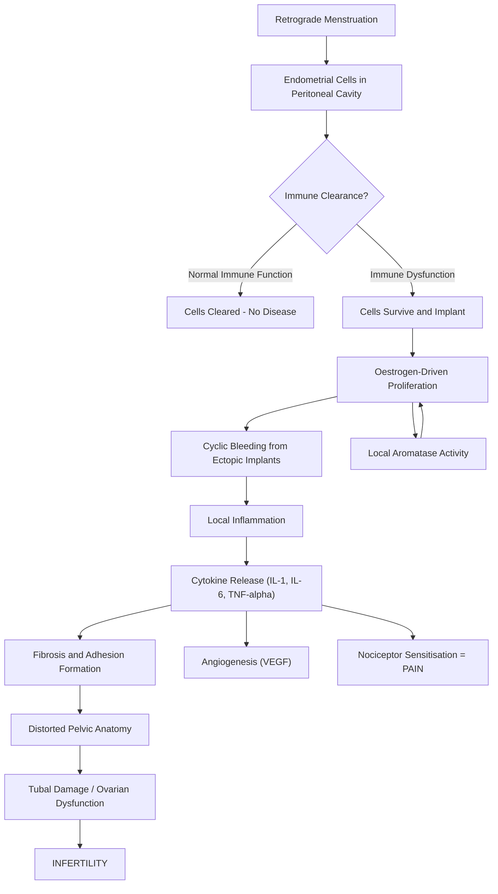

# Endometriosis

## Definition

Endometriosis = **"endo"** (within) + **"metr"** (uterus/womb) + **"osis"** (condition/abnormal state).

***Endometriosis is defined as the presence of endometrial-like tissue (glands and stroma) outside the uterine cavity*** [1]. This ectopic endometrial tissue is hormonally responsive — it proliferates, secretes, and bleeds in response to the cyclic oestrogen and progesterone fluctuations of the menstrual cycle, just like the native endometrium. However, because this tissue is trapped outside the uterus, the shed blood and inflammatory debris have no route of egress, leading to chronic inflammation, fibrosis, adhesion formation, and pain.

It is one of the ***five important causes of female infertility*** [2][3], accounting for approximately ***25% of female factor infertility*** [2][3].

<Callout title="Key Conceptual Point">
Endometriosis is NOT the same as adenomyosis. Adenomyosis is endometrial tissue invading *into* the myometrium (the muscular wall of the uterus itself). Endometriosis is ectopic endometrial-like tissue *outside* the uterus entirely. They can coexist, but they are distinct conditions with different pathophysiology and management.
</Callout>

---

## Epidemiology

### Prevalence
- Affects approximately **10–15% of reproductive-age women** globally [4].
- In women with **chronic pelvic pain**, prevalence rises to **40–60%**.
- In women with **infertility**, prevalence is **25–50%** [2][3].
- Peak incidence: **25–35 years old** (prime reproductive years), because the disease is oestrogen-dependent.

### Demographics
- Rare before menarche and typically regresses after menopause (due to loss of cyclic oestrogen stimulation). However, post-menopausal endometriosis can occur with HRT or from residual disease producing its own oestrogen via local aromatase activity.
- More commonly diagnosed in women of higher socioeconomic status — this is likely a **detection bias** (greater access to healthcare and laparoscopy) rather than a true biological difference.
- **Diagnostic delay** is a major issue globally: average delay from symptom onset to diagnosis is **7–10 years**, because symptoms overlap with "normal" dysmenorrhoea and IBS.

### Hong Kong Context
- Prevalence data from Hong Kong is broadly consistent with global figures (~10%).
- Important to note that in Hong Kong, later age of first pregnancy and lower parity are increasingly common — both of which increase cumulative oestrogen exposure and therefore endometriosis risk.
- The Chinese University of Hong Kong (CUHK) and the University of Hong Kong (HKU) have active research programmes on endometriosis, particularly on biomarkers and fertility outcomes.

---

## Risk Factors

Understanding risk factors requires understanding the core principle: **anything that increases cumulative oestrogen exposure or retrograde menstruation increases risk**.

### Factors that Increase Risk

| Risk Factor | Mechanism / Explanation |
|---|---|
| **Early menarche** (< 11 years) | More total lifetime menstrual cycles → more retrograde menstruation episodes → more ectopic seeding |
| **Late menopause** | Same principle — prolonged oestrogen exposure |
| **Short menstrual cycles** (< 27 days) | More frequent menstruation → more retrograde flow |
| **Heavy menstrual flow** (menorrhagia) | Greater volume of retrograde menstruation → more ectopic implantation |
| **Nulliparity / low parity** | Pregnancy is a "break" from menstruation (9 months amenorrhoea + breastfeeding); fewer pregnancies → more cycles |
| **Late first pregnancy** | More uninterrupted cycles before first pregnancy |
| **Müllerian anomalies** (e.g., obstructive uterine anomalies, cervical stenosis) | Any obstruction to antegrade menstrual flow increases retrograde menstruation |
| **Family history** (first-degree relative) | **6–10× increased risk**; heritable component (polygenic) |
| **Tall, thin body habitus / low BMI** | Paradoxical — lean women have higher SHBG but also altered immune surveillance; exact mechanism debated |
| **Exposure to endocrine disruptors** (e.g., dioxins) | Dioxins are immunomodulatory and oestrogenic, promoting ectopic endometrial survival |

### Factors that Decrease Risk (Protective)

| Protective Factor | Mechanism |
|---|---|
| **Multiparity** | Fewer total menstrual cycles |
| **Prolonged breastfeeding** | Lactational amenorrhoea → fewer cycles |
| **Late menarche** | Fewer lifetime cycles |
| **Combined oral contraceptive pill (COCP) use** | Suppresses ovulation, thins endometrium, reduces menstrual flow |
| **Exercise** | Lowers circulating oestrogen, can cause relative amenorrhoea |

<Callout title="High Yield Exam Point" type="idea">
The risk factor pattern for endometriosis is essentially the SAME as for endometrial cancer and breast cancer — anything that increases cumulative unopposed oestrogen exposure. The key difference is that endometriosis is a *benign* inflammatory condition, not a malignancy (though rare malignant transformation can occur, particularly to endometrioid or clear cell ovarian carcinoma).
</Callout>

---

## Anatomy and Key Anatomical Sites

To understand endometriosis, you must understand the **anatomy of the female pelvis** and why certain sites are preferentially affected.

### Normal Endometrium
The endometrium lines the uterine cavity and consists of:
- **Functional layer** (stratum functionalis): shed during menstruation, regenerated each cycle
- **Basal layer** (stratum basalis): contains stem/progenitor cells, NOT shed during menstruation

The endometrium responds to:
1. **Oestrogen** (proliferative phase) → proliferation of glands and stroma
2. **Progesterone** (secretory phase) → glandular secretion, decidualization of stroma
3. **Progesterone withdrawal** (late luteal phase if no implantation) → spiral arteriole constriction → ischaemic necrosis → shedding (menstruation)

### Common Sites of Endometriosis (in descending order of frequency)

Think about this anatomically: during retrograde menstruation, menstrual debris exits via the fallopian tubes and falls by gravity into the pelvis. The most dependent areas of the pelvis are affected first.

1. **Ovaries** (most common site, ~75%) → forms **endometriomas** ("chocolate cysts") — so-called because they contain thick, dark-brown altered blood (haemosiderin-laden)
2. **Pouch of Douglas** (rectouterine pouch) — the most dependent part of the peritoneal cavity in the upright position
3. **Uterosacral ligaments** — directly behind the uterus
4. **Broad ligament**
5. **Fallopian tubes** — causes tubal damage/occlusion → infertility
6. **Pelvic peritoneum** (including the vesicouterine pouch)
7. **Rectosigmoid colon / rectovaginal septum** — "deep infiltrating endometriosis" (DIE)
8. **Bladder** (detrusor muscle)
9. **Round ligaments**
10. **Pelvic side wall**

### Extra-pelvic Sites (Rare but Important for Exams)
- **Surgical scars** (Caesarean section scars, episiotomy scars, laparoscopy port sites) — due to mechanical transplantation during surgery
- **Umbilicus** (Villar's nodule)
- **Lungs / pleura** → catamenial pneumothorax (pneumothorax occurring cyclically with menstruation; "catamenial" = Greek "katamenios" = monthly)
- **Diaphragm**
- **Appendix, small bowel**
- **Ureters** (can cause hydronephrosis)
- **Nasal mucosa** → catamenial epistaxis (cyclic nosebleeds)
- **Brain** (exceedingly rare)

<Callout title="Anatomical Pearl">
The **Pouch of Douglas** (rectouterine pouch) is the most gravity-dependent part of the female peritoneal cavity. This is why endometriotic implants, pelvic fluid collections, pus (from PID), and blood (from ruptured ectopic pregnancy) all tend to accumulate here. It is palpable on bimanual vaginal examination and visualised on transvaginal ultrasound — making it a critical site for clinical assessment.
</Callout>

### Gross Morphology of Endometriotic Lesions

| Lesion Type | Appearance | Significance |
|---|---|---|
| **Red/flame-like lesions** | Active, vascularised, early implants | Most hormonally active; earliest stage |
| **Black/powder-burn lesions** | Pigmented, contain haemosiderin deposits | Classic "chocolate" lesions; represent older, less active implants |
| **White lesions** | Scarred, fibrotic | Burnt-out, inactive disease; fibrosis predominates |
| **Endometrioma** | Cystic ovarian mass filled with dark "chocolate" fluid | Can grow very large (> 10 cm); risk of rupture, torsion, or malignant transformation |
| **Deep infiltrating endometriosis (DIE)** | Solid nodules penetrating > 5 mm below the peritoneal surface | Most symptomatic form; involves rectovaginal septum, uterosacral ligaments, bowel, bladder |

---

## Aetiology and Pathophysiology

The aetiology of endometriosis is multifactorial and not completely understood. Multiple theories exist, and the current consensus is that **no single theory explains all cases** — multiple mechanisms likely act synergistically.

### Theory 1: Retrograde Menstruation (Sampson's Theory, 1927)

This is the **most widely accepted theory** and explains the majority of pelvic endometriosis.

**Concept:** During menstruation, some menstrual blood containing viable endometrial cells flows backwards ("retrogradely") through the fallopian tubes and into the peritoneal cavity. These cells then implant on peritoneal surfaces, proliferate under oestrogen stimulation, and establish ectopic endometrial tissue.

**Supporting Evidence:**
- Retrograde menstruation is demonstrably common — occurs in **76–90% of women** with patent tubes (seen at laparoscopy during menstruation)
- Endometriosis is more common in women with obstructed outflow tracts (cervical stenosis, imperforate hymen) — confirms that increased retrograde flow → increased disease
- Sites of disease correspond to gravity-dependent areas (Pouch of Douglas)

**Limitations:**
- If 90% of women have retrograde menstruation, why do only 10% develop endometriosis? → This implies **additional factors** are required:
  - Immune surveillance failure (defective clearance of ectopic cells)
  - Enhanced implantation capacity of shed cells
  - Genetic susceptibility
  - Altered peritoneal environment

### Theory 2: Coelomic Metaplasia

**Concept:** The peritoneal mesothelium and the endometrium both derive from the **coelomic epithelium** (embryologically). Under certain stimuli (hormonal, inflammatory, environmental), peritoneal mesothelial cells can undergo **metaplastic transformation** into endometrial-like tissue.

**Supporting Evidence:**
- Explains endometriosis in women without a uterus (post-hysterectomy), in men treated with high-dose oestrogen (for prostate cancer), and in pre-menarchal girls
- Explains extra-pelvic endometriosis (e.g., pleural endometriosis)

**Limitations:**
- Does not explain why disease is concentrated in the pelvis if all peritoneum has the same embryological origin

### Theory 3: Lymphatic and Haematogenous Dissemination

**Concept:** Endometrial cells spread via lymphatic channels or blood vessels to distant sites.

**Supporting Evidence:**
- Explains endometriosis in distant organs (lungs, brain, lymph nodes)
- Endometrial cells have been identified in pelvic lymph nodes

**Limitations:**
- Cannot explain the predominant pelvic distribution

### Theory 4: Iatrogenic Transplantation (Direct Implantation)

**Concept:** Endometrial tissue is mechanically transported to ectopic sites during surgery (Caesarean section, hysterotomy, episiotomy).

**Supporting Evidence:**
- Endometriosis in Caesarean section scars is well-documented
- Laparoscopic port-site endometriosis has been reported

### Theory 5: Stem Cell Theory

**Concept:** Bone marrow-derived stem cells may differentiate into endometrial-like tissue at ectopic sites.

**Supporting Evidence:**
- Bone marrow transplant recipients have developed donor-derived endometriosis
- This is a more recent theory and is an area of active research

### The "Second Hit" — Why Only Some Women Develop Disease

Retrograde menstruation is nearly universal, so **additional factors** must be present for disease to establish. Think of it as a "two-hit" model:

#### 1. Immune Dysfunction
- In healthy women, the peritoneal immune system (macrophages, NK cells, T cells) **clears** retrogradely shed endometrial cells.
- In women with endometriosis, there is:
  - **Reduced NK cell cytotoxicity** → ectopic cells are not killed
  - **Increased pro-inflammatory cytokines** (IL-1, IL-6, IL-8, TNF-α) → paradoxically promote survival, angiogenesis, and proliferation of ectopic cells rather than destroying them
  - **Increased peritoneal fluid macrophages** — but these are "alternatively activated" (M2 phenotype) and promote tissue remodelling rather than clearance
  - **Increased VEGF** (vascular endothelial growth factor) → angiogenesis → blood supply for ectopic implants

#### 2. Altered Endometrial Biology
- Eutopic endometrium (the normal lining) in women with endometriosis is **intrinsically different** from that in healthy women:
  - **Increased expression of matrix metalloproteinases (MMPs)** → enhanced tissue invasion
  - **Increased expression of adhesion molecules** (e.g., integrins) → enhanced implantation on peritoneal surfaces
  - **Resistance to apoptosis** → ectopic cells survive when they shouldn't
  - **Local aromatase expression** → ectopic implants can produce their own oestrogen *in situ*, creating a self-sustaining oestrogen-dependent growth loop independent of ovarian oestrogen

#### 3. Genetic Susceptibility
- Familial clustering is well-recognised
- Multiple susceptibility loci identified by GWAS (genome-wide association studies)
- First-degree relatives have **6–10× increased risk**

### The Pathophysiological Cascade

### Pathophysiology of Pain in Endometriosis

Pain in endometriosis is **not simply due to bleeding from ectopic implants**. The pain mechanisms are complex and multi-layered:

1. **Nociceptive pain**: Direct tissue damage from cyclic haemorrhage, inflammation, and adhesion traction
2. **Inflammatory pain**: Pro-inflammatory cytokines (PGE2, IL-1, TNF-α) directly sensitise peripheral nerve endings
3. **Neuropathic pain**: Endometriotic implants can invade nerves (neurotropism); nerve growth factor (NGF) is upregulated in implants, promoting nerve fibre growth INTO the lesions → this creates a "pain-generating" unit
4. **Central sensitisation**: Chronic peripheral nociceptive input leads to spinal cord "wind-up" → amplification of pain signals → hyperalgesia (increased pain sensitivity) and allodynia (pain from normally non-painful stimuli)
5. **Viscero-visceral cross-talk**: Because the uterus, bladder, and bowel share overlapping sensory innervation (via the hypogastric and pelvic splanchnic nerves), inflammation in one organ can cause referred pain in others — explaining why endometriosis patients often have concurrent IBS-like symptoms, interstitial cystitis-like symptoms, etc.

<Callout title="Why does the pain NOT always correlate with disease severity?">
This is a classic exam question. The answer lies in the mechanisms above: a woman with minimal (Stage I) disease can have **severe pain** if implants are located on or near nerves (e.g., uterosacral ligaments, which are richly innervated), or if she has developed central sensitisation. Conversely, a woman with extensive (Stage IV) disease with large endometriomas may have **minimal pain** if the implants are not near nerves and she has not developed sensitisation. Pain correlates better with the **depth of infiltration** and **nerve involvement** than with the surface area of disease.
</Callout>

### Pathophysiology of Infertility in Endometriosis

***Endometriosis accounts for approximately 25% of female factor infertility*** [2][3]. Multiple mechanisms contribute:

| Mechanism | Explanation |
|---|---|
| **Anatomical distortion** | Adhesions distort tubo-ovarian relationships → impaired ovum pick-up by the fimbriae |
| **Tubal damage** | Endometriotic implants on/in tubes → inflammation → fibrosis → tubal occlusion |
| **Ovarian dysfunction** | Endometriomas destroy normal ovarian cortex → reduced ovarian reserve; altered folliculogenesis |
| **Hostile peritoneal environment** | Increased peritoneal fluid cytokines, macrophages → toxic to sperm, ova, and embryos; impaired sperm motility and sperm-oocyte interaction |
| **Defective implantation** | Eutopic endometrium in women with endometriosis has altered expression of implantation markers (e.g., αvβ3 integrin, HOXA10) → reduced endometrial receptivity |
| **Hormonal abnormalities** | Progesterone resistance in the endometrium → inadequate luteal phase support |
| **Altered oocyte quality** | Oocytes retrieved from follicles adjacent to endometriomas show reduced fertilisation and embryo quality |

---

## Classification

### rAFS/ASRM Revised Classification (1996)

The **American Society for Reproductive Medicine (ASRM)** revised classification (formerly the American Fertility Society, rAFS) is the most widely used staging system. It is a **surgical staging system** based on findings at laparoscopy.

| Stage | Points | Description |
|---|---|---|
| **Stage I: Minimal** | 1–5 | Few superficial implants |
| **Stage II: Mild** | 6–15 | More implants, some deep; no significant adhesions |
| **Stage III: Moderate** | 16–40 | Deep implants; small endometriomas on one/both ovaries; filmy adhesions |
| **Stage IV: Severe** | > 40 | Large endometriomas; dense adhesions; obliteration of Pouch of Douglas; rectovaginal disease |

**Scoring is based on:**
- Size, depth, and location of implants
- Presence and extent of adhesions (filmy vs. dense)
- Presence of endometriomas

<Callout title="Limitations of rAFS/ASRM Classification" type="error">
The ASRM classification has significant limitations:
1. **Does NOT correlate with pain severity** (a Stage I patient can have worse pain than Stage IV)
2. **Poorly predicts fertility outcomes** (a Stage II patient may be more infertile than a Stage III)
3. **Does NOT account for deep infiltrating endometriosis (DIE)** adequately
4. **Inter-observer variability** is high

Despite these limitations, it remains the standard classification because no superior alternative has been universally adopted for staging. However, for surgical planning, the ENZIAN classification (below) is increasingly used.
</Callout>

### ENZIAN Classification (Updated 2021: #Enzian)

The #Enzian (or revised ENZIAN) classification was developed specifically to describe **deep infiltrating endometriosis (DIE)** and complements the rAFS/ASRM system:

- Describes disease in **three compartments**:
  - **A**: Rectovaginal septum / vagina
  - **B**: Uterosacral ligaments → pelvic sidewall
  - **C**: Rectum / sigmoid colon
- Grades severity: 1 (< 1 cm), 2 (1–3 cm), 3 (> 3 cm)
- Additional notation for involvement of:
  - **FA**: Adenomyosis
  - **FB**: Bladder
  - **FU**: Ureter (intrinsic)
  - **FI**: Bowel (other than rectosigmoid)
  - **FO**: Other locations

### Endometriosis Fertility Index (EFI)

- Developed to **predict fertility outcomes** after surgical treatment
- Incorporates both rAFS/ASRM score AND functional assessment (least function score of tubes, fimbriae, ovaries)
- More useful than rAFS stage alone for counselling on natural conception vs. IVF

---

## Clinical Features

### General Principles
- Symptoms are **cyclical** (worse around menstruation) — because ectopic endometrial tissue responds to hormonal cycling
- The **"classic triad"** of endometriosis: **dysmenorrhoea + dyspareunia + infertility**
- Symptoms often begin years before diagnosis (average diagnostic delay: 7–10 years)
- Up to **20–25% of women with endometriosis may be asymptomatic** (incidental finding at surgery)

---

### Symptoms

#### 1. Dysmenorrhoea (Painful Periods) — Most Common Symptom

- **Character**: Secondary dysmenorrhoea (i.e., acquired, not present since menarche; worsening over time). Classically **starts before menstruation** (premenstrual pain) and **continues throughout** and sometimes after menstruation. This distinguishes it from primary dysmenorrhoea which typically starts on day 1 of menses and improves by day 2–3.
- **Pathophysiological basis**: Ectopic endometrial tissue bleeds cyclically → local haemorrhage, prostaglandin release (PGE2, PGF2α) → peritoneal irritation → visceral pain. Over time, fibrosis and adhesions develop → constant traction pain even between periods. Nerve invasion by implants (neurotropism) → neuropathic pain component.
- **Key point**: The severity of dysmenorrhoea does NOT correlate with disease extent (see pain pathophysiology above).

#### 2. Chronic Pelvic Pain (CPP)

- **Character**: Non-cyclical, persistent pelvic pain (present on most days, > 6 months duration)
- **Pathophysiological basis**: Represents progression from purely cyclical to constant pain due to:
  - Adhesion formation → constant traction/distortion
  - Central sensitisation → pain persists even when peripheral stimulus is removed
  - Neuropathic pain from nerve infiltration
- CPP is the feature that most impairs quality of life

#### 3. Deep Dyspareunia (Pain During Deep Intercourse)

- **Character**: Pain with deep penetration, often worse premenstrually
- **Pathophysiological basis**: Deep infiltrating endometriosis affecting the **uterosacral ligaments, rectovaginal septum, or Pouch of Douglas**. During deep penetration, the penis contacts the cervix/posterior fornix → mechanically irritates these diseased structures → pain. Nodularity in these areas is tender to touch.

#### 4. Infertility

- ***Accounts for ~25% of female factor infertility*** [2][3]
- May be the **presenting complaint** in women with otherwise minimal symptoms
- Pathophysiology as detailed above (anatomical, ovarian, peritoneal, endometrial, oocyte factors)

#### 5. Dyschezia (Painful Defaecation)

- **Character**: Pain on opening bowels, classically **cyclical** (worse during menstruation)
- **Pathophysiological basis**: Endometriotic implants on the **rectosigmoid colon or rectovaginal septum**. During defaecation, stool passage stretches the rectal wall → mechanically stimulates tender implants → pain. During menstruation, these implants swell and bleed → increased pain.

#### 6. Dysuria (Painful Urination) and Urinary Symptoms

- **Character**: Cyclical dysuria, frequency, urgency, or haematuria
- **Pathophysiological basis**: Endometriotic implants on the **bladder dome or detrusor muscle**. During menstruation, bladder implants swell and bleed → irritation of the bladder wall → urgency, frequency. If implants penetrate the mucosa → cyclic haematuria (catamenial haematuria).

#### 7. Cyclical Rectal Bleeding

- **Pathophysiological basis**: Endometriotic implants penetrating through the bowel wall into the rectal/sigmoid mucosa → cyclical bleeding per rectum during menstruation.

#### 8. Catamenial Symptoms at Distant Sites (Rare)

- **Catamenial pneumothorax**: Endometriosis on the diaphragm/pleura → cyclical pneumothorax during menstruation
- **Catamenial haemoptysis**: Pulmonary endometriosis → cyclical blood-streaked sputum
- **Catamenial epistaxis**: Nasal mucosal endometriosis → cyclical nosebleeds
- **Cyclical scar pain/bleeding**: Endometriosis in Caesarean section or episiotomy scars → cyclical tenderness, swelling, or bleeding at the scar site

#### 9. Constitutional / Associated Symptoms

- **Fatigue** — chronic inflammatory state; cytokine-mediated (IL-6, TNF-α)
- **Bloating** — pelvic inflammation / adhesions affecting bowel motility; overlap with IBS
- **Nausea** — prostaglandin-mediated; also from bowel involvement
- **Lower back pain** — referred pain from uterosacral ligament disease (innervation via S2–S4)

<Callout title="The Cyclical Pattern is the Clue" type="idea">
In a young woman presenting with ANY cyclical symptom — cyclical pelvic pain, cyclical rectal bleeding, cyclical haematuria, cyclical pneumothorax — always think of endometriosis. The cyclical nature reflects the hormonal responsiveness of the ectopic tissue.
</Callout>

---

### Signs (Physical Examination Findings)

**Important**: Physical examination may be **completely normal** in mild/early endometriosis. Signs are more likely in moderate-to-severe disease, especially deep infiltrating endometriosis. **Examination is best performed during menstruation** when implants are maximal in size and tenderness.

#### Abdominal Examination
- Usually **unremarkable** unless large endometriomas are palpable (rare; would need to be very large, > 8–10 cm)
- Tenderness in lower abdomen (non-specific)
- Surgical scars may have tender, cyclically enlarging nodules (scar endometriosis)

#### Bimanual Vaginal Examination

| Sign | Pathophysiological Basis |
|---|---|
| **Tenderness in the posterior fornix** | Endometriotic implants on uterosacral ligaments / Pouch of Douglas |
| **Nodularity of the uterosacral ligaments** | Palpable deep infiltrating endometriotic nodules — this is a **highly specific** finding |
| **Fixed, retroverted uterus** | Dense adhesions tether the uterus posteriorly to the rectum/rectovaginal septum → uterus cannot be anteverted on examination ("frozen pelvis") |
| **Adnexal mass (tender, fixed)** | Endometrioma — typically fixed due to surrounding adhesions (cf. functional cysts which are mobile) |
| **Restricted uterine mobility** | Adhesions restrict normal uterine movement in all directions |
| **Thickening of the rectovaginal septum** | Palpable nodularity between the posterior vaginal wall and the anterior rectal wall — indicates deep infiltrating endometriosis |

#### Speculum Examination
- **Blue/dark nodules visible on the posterior fornix or cervix** — these are endometriotic implants visible through the vaginal mucosa; classic but uncommon finding
- Otherwise usually normal

#### Rectal Examination
- **Palpable nodules on the anterior rectal wall** — indicates rectovaginal/rectal endometriosis
- Tenderness anteriorly

<Callout title="Clinical Pearl: When to Examine">
If endometriosis is suspected clinically, perform bimanual examination **during menstruation** if possible. This is when implants are most engorged and tender, making nodularity and tenderness easier to detect. This is counterintuitive (patients may be reluctant), but it improves diagnostic sensitivity.
</Callout>

<Callout title="The 'Frozen Pelvis'">
In severe (Stage IV) endometriosis, dense adhesions can completely obliterate the Pouch of Douglas and fix the uterus, ovaries, tubes, and bowel into a single immobile mass — the so-called **"frozen pelvis"**. On bimanual examination, nothing moves. This is analogous to the "frozen pelvis" seen in advanced pelvic malignancy, though the underlying process is inflammatory rather than neoplastic.
</Callout>

---

## Endometrioma ("Chocolate Cyst") — Special Consideration

***Endometrioma is a common type of pelvic mass that must be distinguished from other ovarian cysts*** [4].

- **Definition**: A cystic mass arising from endometriotic tissue within the ovary
- **Pathophysiology**: Ectopic endometrial tissue on the ovarian surface invaginates into the ovarian cortex → cyclical bleeding within this invaginated pocket → accumulation of old, haemolysed blood (dark brown, thick, "chocolate-like" fluid) → progressively enlarging cyst
- **Size**: Typically 2–10 cm, can be bilateral
- **Ultrasound appearance**: ***Homogeneous, low-level internal echoes ("ground glass" appearance)*** — this is the classic transvaginal ultrasound (TVS) finding and is highly suggestive [4]
- **Risk of malignant transformation**: Small but real (< 1%) → endometrioid carcinoma or clear cell carcinoma of the ovary. Risk increases with larger endometriomas and prolonged duration.

---

## Summary of Clinical Features by System

| System | Symptom | Sign | Pathophysiology |
|---|---|---|---|
| **Gynaecological** | Dysmenorrhoea, CPP, dyspareunia, infertility | Uterosacral nodularity, fixed retroverted uterus, adnexal mass | Ectopic implants on pelvic structures, adhesions |
| **GI** | Dyschezia, cyclical rectal bleeding, bloating, nausea | Rectovaginal nodularity, anterior rectal tenderness | Bowel wall infiltration, adhesions |
| **Urological** | Dysuria, cyclical haematuria, frequency | Usually none on exam | Bladder wall implants |
| **Respiratory** | Catamenial pneumothorax, haemoptysis | Reduced breath sounds (if pneumothorax) | Pleural/diaphragmatic implants |
| **Scar** | Cyclical scar pain/swelling | Tender nodule in scar | Iatrogenic implantation |

---

<Callout title="High Yield Summary">

**Endometriosis — Key Points for Exams:**

1. **Definition**: Endometrial-like tissue (glands + stroma) outside the uterine cavity
2. **Prevalence**: 10–15% of reproductive-age women; 25–50% of infertile women
3. ***Endometriosis accounts for ~25% of female factor infertility*** and is one of the ***five important causes of infertility*** (ovulatory dysfunction, tubal problems, endometriosis, male factors, unexplained)
4. **Pathophysiology**: Sampson's retrograde menstruation theory (most accepted) + immune dysfunction + altered endometrial biology + genetic susceptibility
5. **Pain does NOT correlate with disease stage** — depth of infiltration and nerve involvement matter more
6. **Classic triad**: Dysmenorrhoea + dyspareunia + infertility
7. **Cyclical symptoms are the hallmark** — any cyclical symptom in a reproductive-age woman should raise suspicion
8. **Examination**: Uterosacral nodularity and a fixed retroverted uterus are highly suggestive signs
9. **Most common site**: Ovaries → endometriomas ("chocolate cysts") with "ground glass" appearance on ultrasound
10. **ASRM Classification**: Stages I–IV (surgical staging); poorly correlates with symptoms or fertility
11. **Distinguish from adenomyosis**: Endometriosis = ectopic endometrium OUTSIDE the uterus; adenomyosis = endometrium invading INTO the myometrium

</Callout>

---

<ActiveRecallQuiz
  title="Active Recall - Endometriosis (Definition, Epidemiology, Aetiology, Classification, Clinical Features)"
  items={[
    {
      question: "Name the five important causes of female infertility as listed in the lecture slides.",
      markscheme: "1. Ovulatory dysfunction/anovulation, 2. Tubal problems, 3. Endometriosis, 4. Male factors, 5. Unexplained. Endometriosis accounts for approximately 25% of female factor infertility."
    },
    {
      question: "Explain why retrograde menstruation alone is insufficient to cause endometriosis, and describe the 'second hit' factors required.",
      markscheme: "Retrograde menstruation occurs in 76-90% of women but only 10-15% develop endometriosis. Additional factors needed: (1) Immune dysfunction - reduced NK cell cytotoxicity, altered macrophage function (M2 phenotype), increased pro-inflammatory cytokines that paradoxically promote survival rather than clearance; (2) Altered endometrial biology - increased MMPs, adhesion molecules, apoptosis resistance, local aromatase expression; (3) Genetic susceptibility - 6-10x risk in first-degree relatives."
    },
    {
      question: "A 28-year-old woman presents with cyclical rectal bleeding during menstruation. What is the likely diagnosis and the pathophysiological explanation?",
      markscheme: "Endometriosis with deep infiltrating disease involving the rectosigmoid colon. Endometriotic implants penetrate through the bowel wall into the rectal mucosa. During menstruation, these implants undergo hormonal-driven bleeding, causing cyclical rectal bleeding (catamenial rectal bleeding)."
    },
    {
      question: "Explain why pain severity does not correlate with the rAFS/ASRM stage of endometriosis.",
      markscheme: "Pain depends on: (1) Depth of infiltration rather than surface area, (2) Proximity to and invasion of nerves (neurotropism, NGF upregulation), (3) Development of central sensitisation and neuropathic pain, (4) Viscero-visceral cross-talk. A Stage I lesion on a uterosacral ligament near S2-S4 nerve roots may cause more pain than a Stage IV with large but superficial disease or silent endometriomas."
    },
    {
      question: "Describe the characteristic ultrasound finding of an endometrioma and explain why it appears this way.",
      markscheme: "Homogeneous, low-level internal echoes described as 'ground glass' appearance on transvaginal ultrasound. This is because the cyst contains thick, old, haemolysed blood (haemosiderin-laden 'chocolate' fluid) from repeated cyclical bleeding of ectopic endometrial tissue within the ovary. The uniform particulate matter creates the characteristic ground glass echogenicity."
    },
    {
      question: "What are the key physical examination findings suggestive of endometriosis, and when is the best time to perform the examination?",
      markscheme: "Key findings: (1) Tenderness and nodularity of uterosacral ligaments on bimanual examination (highly specific), (2) Fixed retroverted uterus (adhesions), (3) Adnexal mass - fixed and tender (endometrioma), (4) Thickened rectovaginal septum, (5) Blue/dark nodules on posterior fornix (speculum). Best examined during menstruation when implants are maximally engorged and tender, improving diagnostic sensitivity."
    }
  ]}
/>

## References

[1] ESHRE Guideline: Endometriosis, 2022 Update
[2] Lecture slides: GC 117. I want to have a baby male and female infertility.pdf (p8–9)
[3] Lecture slides: Block C - I want to have a baby_ male and female infertility.pdf (p3)
[4] Lecture slides: GC 118. Pelvic mass ovarian cancer and cysts; uterine fibroid; pelvic imaging.pdf
