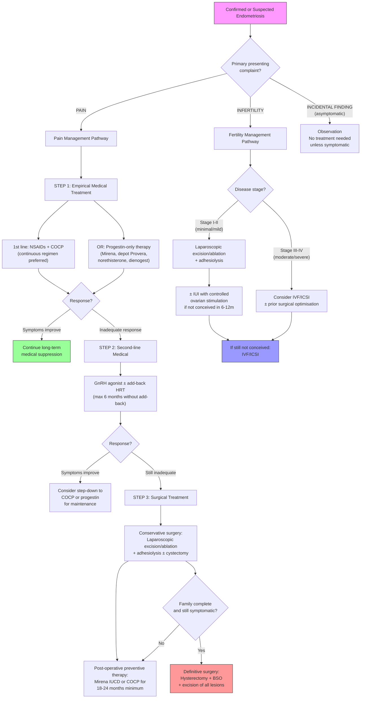

## Management of Endometriosis

### Guiding Principles of Management

Before detailing specific treatments, it is essential to understand the **core principles** that govern management decisions in endometriosis:

1. **Endometriosis is a chronic disease** — there is no permanent cure short of bilateral oophorectomy (and even that doesn't guarantee resolution). Management is about **symptom control, preservation of fertility, and prevention of progression**, not "cure."
2. **Treatment must be individualised** — the approach depends critically on:
   - **Presenting complaint**: pain vs. infertility vs. incidental finding
   - **Patient's reproductive wishes**: wants children now, wants children later, or family complete
   - **Disease severity and location**: superficial peritoneal vs. endometrioma vs. deep infiltrating endometriosis (DIE)
   - **Response to previous treatments**
   - **Patient preference and quality of life impact**
3. **Medical and surgical treatments are complementary**, not mutually exclusive — many patients benefit from a combination
4. ***Symptoms tend to improve during pregnancy due to decidualisation of ectopic endometrial epithelium*** [1] — this is why hormonal treatments that mimic pregnancy-like states (progestins) or suppress oestrogen are effective
5. **Asymptomatic endometriosis found incidentally does not necessarily require treatment** — treat the patient, not the scan

<Callout title="The Two Clinical Scenarios" type="idea">
The management approach fundamentally diverges based on one question: **Does this patient want to conceive?**
- **If YES** → Medical suppressive therapy is contraindicated (it suppresses ovulation). Manage with surgery ± assisted reproduction.
- **If NO (or not now)** → Medical suppressive therapy is the mainstay, with surgery reserved for refractory cases.
</Callout>

---

### Management Algorithm — Overview

---

### A. Medical Treatment — Detailed Breakdown

The fundamental principle behind ALL medical treatments for endometriosis is the same: **suppress oestrogen-driven proliferation and cyclic bleeding of ectopic endometrial tissue**. This is achieved by:
- Suppressing ovulation
- Creating a pseudo-pregnant state (high progesterone → decidualisation → atrophy)
- Creating a pseudo-menopausal state (low oestrogen → atrophy)
- Directly inhibiting endometrial proliferation

**Important**: Medical treatments are **suppressive, not curative** — symptoms recur after discontinuation. They are also **contraceptive** (suppress ovulation), so they are **contraindicated when the patient desires immediate conception**.

---

#### 1. NSAIDs and Analgesics

***NSAIDs and other analgesics are commonly used*** [12].

| Agent | Dose Example | Mechanism | Notes |
|---|---|---|---|
| **Mefenamic acid (Ponstan)** | 250–500 mg TDS PRN | Inhibits cyclooxygenase (COX) → reduces prostaglandin synthesis (PGE2, PGF2α) → reduces inflammation, uterine contractions, and nociceptor sensitisation | Fenamates have a slight advantage as they also **block prostaglandin receptor action** in addition to inhibiting synthesis |
| **Naproxen** | 250–500 mg BD PRN | Same as above | Longer half-life than ibuprofen; good for sustained relief |
| **Ibuprofen** | 400 mg TDS PRN | Same as above | Widely available OTC |
| **Paracetamol** | 500 mg–1 g QID PRN | Central analgesic (exact mechanism debated — likely involves COX-3 inhibition and endocannabinoid pathway modulation) | Less effective than NSAIDs for dysmenorrhoea but useful as adjunct |

**Contraindications to NSAIDs**: peptic ulcer disease, NSAID allergy, renal impairment, aspirin-exacerbated respiratory disease, late pregnancy, concurrent anticoagulant use.

**Key point**: NSAIDs treat **symptoms** (pain) but do NOT suppress disease progression. They are first-line for pain relief but must be combined with hormonal therapy for disease control.

---

#### 2. Combined Oral Contraceptive Pill (COCP) — First Line

***COCP is commonly used as first line*** [12].

**Mechanism**: 
- ***Although endometriosis is an oestrogen-sensitive disease, COCP has a good oestrogen:progesterone balance*** [12]. The progestogenic component dominates the endometrial effect:
  - Suppresses the HPO axis (↓ GnRH pulsatility → ↓ FSH/LH → ↓ ovulation → ↓ endogenous oestrogen fluctuations)
  - Decidualisation and subsequent atrophy of both eutopic and ectopic endometrium
  - Reduces menstrual flow volume → reduces retrograde menstruation
  - The small oestrogen component prevents breakthrough bleeding and maintains bone density

**Efficacy**: ***Known to decrease endometriosis-associated dyspareunia, dysmenorrhoea, and non-menstrual pain*** [12].

**Regimen**: ***Consider continuous regimen to decrease menstruation-related discomfort*** [12]. Continuous use (skipping the pill-free interval) means no withdrawal bleed → no cyclical hormonal fluctuation → less cyclical pain. This is the preferred approach in endometriosis (unlike conventional cyclic use for contraception).

**Advantages**: ***Generally well-tolerated and associated with less side effects than alternatives*** [12]. Also provides contraception, cycle regularity, and may have a protective effect against ovarian and endometrial cancer.

**Contraindications** (WHO MEC Category 4 — absolute):
- History of venous thromboembolism (VTE)
- Active or history of arterial cardiovascular disease (stroke, MI)
- Migraine with aura
- Breast cancer (current)
- Severe liver disease
- Age > 35 years AND smoking ≥ 15 cigarettes/day
- Uncontrolled hypertension

**Side effects**: Nausea, breast tenderness, headache, mood changes, breakthrough bleeding, small increased risk of VTE.

---

#### 3. Progestin-Only Therapy — Alternative First Line

***Progestin-only therapy is an alternative to COCP*** [12].

**Mechanism**:
- Creates a **pseudo-pregnant state** — high progesterone → decidualisation of ectopic endometrium → eventual atrophy
- Suppresses HPO axis (at sufficient doses) → anovulation
- Direct anti-proliferative effect on endometrial tissue
- Anti-inflammatory effects in the pelvic environment

***Examples*** [12]:

| Agent | Route | Dose | Specific Notes |
|---|---|---|---|
| ***Medroxyprogesterone acetate (Provera)*** [12] | ***Oral or depot injection*** | Oral: 10–30 mg/day; Depot: 150 mg IM every 12 weeks | Depot form (Depo-Provera) provides 3-month coverage; causes amenorrhoea in ~50% by 1 year. Disadvantage: irregular bleeding initially, weight gain, delayed return of fertility (up to 12 months after last injection), bone density loss with prolonged use. |
| ***Norethisterone acetate (Primolut N)*** [12] | Oral | 5–15 mg/day continuously | Effective but can cause androgenic side effects (acne, hirsutism). Also used cyclically for AUB (different context). |
| ***Cyproterone acetate*** [12] | Oral | 10–50 mg/day | Anti-androgen + progestogenic; useful if patient also has acne/hirsutism. Risk of hepatotoxicity with prolonged use at high doses. |
| **Dienogest (Visanne)** | Oral | 2 mg/day | Specifically developed for endometriosis; selective progestogenic effect on endometrial tissue with minimal androgenic or oestrogenic effects. Increasingly popular. Well-studied with good long-term safety data. |
| ***Levonorgestrel-releasing IUCD (Mirena)*** [12] | Intrauterine | 52 mg device, releases ~20 mcg/day | Local progestogenic effect on endometrium → profound endometrial atrophy; particularly useful for dysmenorrhoea and as ***post-operative preventive therapy*** [13]. Minimal systemic side effects. Does NOT suppress ovulation reliably (not a treatment for endometriomas). |

**Contraindications to progestins** (fewer than COCP):
- Current breast cancer
- Severe liver disease / liver tumours
- Unexplained vaginal bleeding (must be investigated first)
- Active VTE (relative CI for some formulations)

**Side effects**: Irregular bleeding (especially initially), weight gain, bloating, mood changes, acne (depends on specific progestin), reduced libido, bone density loss (depot preparations with prolonged use).

---

#### 4. GnRH Agonists — Second Line

**What are they?** GnRH agonists (e.g., leuprolide/Lupron, goserelin/Zoladex, nafarelin, triptorelin) are synthetic analogues of GnRH that, paradoxically, suppress the HPO axis when given continuously.

**Mechanism — explained from first principles**:
- **Normal physiology**: GnRH is released from the hypothalamus in a **pulsatile** fashion → stimulates anterior pituitary to release FSH and LH → stimulates ovaries to produce oestrogen and progesterone
- **GnRH agonist effect**: Continuous (non-pulsatile) exposure to a GnRH agonist initially causes a **"flare" effect** (transient increase in FSH/LH for 1–2 weeks → transient increase in oestrogen) → then the pituitary GnRH receptors become **desensitised/downregulated** → FSH/LH secretion drops to near zero → ovaries stop producing oestrogen → **medical menopause**
- This creates a profoundly **hypo-oestrogenic environment** → ectopic endometrial tissue atrophies → symptoms improve

**Clinical use**:
- Second-line therapy when COCP / progestins have failed
- Pre-operative adjunct to reduce disease bulk before surgery
- ***Maximum duration without add-back therapy: 6 months*** — because prolonged hypo-oestrogenaemia causes:
  - **Hot flushes, night sweats** (vasomotor symptoms)
  - **Vaginal dryness, decreased libido**
  - **Accelerated bone density loss** (osteoporosis risk)
  - **Mood disturbance, depression**

**Add-back therapy**: To mitigate hypo-oestrogenic side effects while maintaining efficacy, **low-dose oestrogen + progestin "add-back"** is co-administered. The principle (Barbieri's "oestrogen threshold hypothesis") is that there is a therapeutic window: endometriotic tissue requires higher oestrogen levels to proliferate than bone and cardiovascular tissue require for protection. So adding back a small amount of oestrogen protects bone/cardiovascular health WITHOUT reactivating endometriosis.

- Typical add-back: norethisterone 5 mg/day ± conjugated oestrogen 0.625 mg/day; or tibolone 2.5 mg/day
- With add-back, GnRH agonists can be used for **longer durations** (up to 2 years)

**Contraindications**: Pregnancy, breastfeeding, undiagnosed vaginal bleeding, metabolic bone disease (osteoporosis — already has low bone density).

---

#### 5. GnRH Antagonists — Newer Option

**Examples**: Elagolix (oral), relugolix, linzagolix

**Mechanism**: Directly and competitively block GnRH receptors on the anterior pituitary → immediate suppression of FSH/LH → no initial "flare" effect (unlike agonists) → dose-dependent suppression of oestrogen

**Advantages over GnRH agonists**:
- Oral administration (vs. injection for most agonists)
- No flare effect
- Dose-dependent: can achieve partial oestrogen suppression (rather than full menopause) → fewer hypo-oestrogenic side effects
- Rapid reversibility on discontinuation

**Current status**: Elagolix (Orilissa) is FDA-approved (2018) for endometriosis-related pain. Relugolix combination (relugolix + E2 + norethindrone acetate, Myfembree) approved 2022. Increasingly used but not yet universally available in all regions including Hong Kong.

---

#### 6. Aromatase Inhibitors — Third-Line / Specialist Use

**Examples**: Letrozole, anastrozole

**Mechanism**: 
- Aromatase is the enzyme that converts androgens → oestrogens. It is expressed in:
  - Ovary (main source in premenopausal women)
  - Adipose tissue, skin, brain (main source in postmenopausal women)
  - **Endometriotic implants themselves** (local oestrogen production — the "self-sustaining" loop)
- Aromatase inhibitors block this conversion → reduce both systemic AND local oestrogen levels
- Particularly useful because they target the **local aromatase activity within endometriotic implants** that is resistant to HPO axis suppression

**Clinical use**: Reserved for **refractory cases** not responding to first/second-line hormonal therapies; sometimes used in combination with COCP or progestins (to prevent the reflex increase in gonadotrophins that occurs in premenopausal women when oestrogen is suppressed — the pituitary senses low oestrogen and ramps up FSH/LH → ovarian stimulation → can cause ovarian cysts if aromatase inhibitor is used alone).

**Side effects**: Hot flushes, arthralgia, bone density loss, headache, ovarian cyst formation (if used alone in premenopausal women).

---

#### Summary Table: Medical Treatments

| Agent | Line | Mechanism | Duration | Key Advantages | Key Disadvantages | CI for Fertility? |
|---|---|---|---|---|---|---|
| **NSAIDs** | Adjunct | ↓ Prostaglandin synthesis | PRN | Rapid pain relief | No disease suppression; GI side effects | No |
| ***COCP*** [12] | ***1st*** | Suppress HPO axis, decidualise endometrium | Long-term (continuous) | Well-tolerated, cheap, contraception | VTE risk; CI if migraine with aura | Yes (contraceptive) |
| ***Progestins*** [12] | ***1st (alternative)*** | Decidualisation → atrophy | Long-term | Fewer CI than COCP; Mirena is local | Irregular bleeding, weight gain | Yes (most suppress ovulation) |
| **GnRH agonists** | 2nd | Pituitary downregulation → medical menopause | 6 months (without add-back); longer with add-back | Very effective for pain | Bone loss, menopausal symptoms | Yes |
| **GnRH antagonists** | 2nd (newer) | Pituitary blockade → dose-dependent E2 suppression | Long-term possible | Oral, no flare, dose-titratable | Cost; availability | Yes |
| **Aromatase inhibitors** | 3rd / specialist | Block androgen → oestrogen conversion | Variable | Targets local E2 production | Must combine with COCP/progestin; bone loss | Yes |

---

### B. Surgical Treatment — Detailed Breakdown

Surgery in endometriosis serves two purposes: **diagnostic (confirming the disease)** and **therapeutic (treating the disease)**. The concept of ***"see and treat"*** [13] — performing diagnostic laparoscopy and simultaneously treating any disease found — is the standard approach.

---

#### 1. Conservative Surgery (Fertility-Preserving)

***Conservative surgery is first line for surgical treatment, usually done together with diagnostic laparoscopy ("see and treat")*** [13].

***Involves*** [13]:
- ***Excision or ablation of endometriotic lesions*** — ***no significant difference in outcome between excision and ablation*** [13] for superficial peritoneal disease (though excision is preferred for DIE and for histological confirmation)
- ***Ovarian cystectomy if ovarian endometrioma*** [13] — stripping of the endometrioma wall (pseudocapsule) from the ovarian cortex; preserves remaining ovarian tissue. Preferable to simple drainage (which has near-100% recurrence rate)
- ***Adhesiolysis if adhesions seen intra-operatively*** [13] — restoring normal tubo-ovarian anatomy to improve fertility potential

***Outcomes*** [13]:
- ***Decreased overall pain: 73% vs. 21% compared to diagnostic laparoscopy alone***
- ***Increased live birth or ongoing pregnancy: 30% vs. 18% compared to diagnostic laparoscopy alone***
- ***However, higher rate of recurrent symptoms compared to definitive surgery: 58% vs. 19% re-operation rate over 7 years***

**Excision vs. Ablation — What's the Difference?**

| Technique | Method | Pros | Cons |
|---|---|---|---|
| **Excision** | Cutting out the lesion completely | Provides tissue for histology; removes full depth of disease; preferred for DIE | More technically demanding; risk of damaging underlying structures |
| **Ablation** | Destroying lesion surface with heat (diathermy/laser) | Faster, simpler, less technical skill needed | No histological specimen; may not destroy deep lesions; higher recurrence theoretically |

**Special Considerations for Endometrioma Surgery**:
- **Cystectomy** (stripping the cyst wall) is preferred over **drainage + ablation** — lower recurrence, better fertility outcomes
- However, cystectomy inevitably **destroys some healthy ovarian cortex** → reduces ovarian reserve (lower AMH, lower antral follicle count)
- Must balance: removing disease vs. preserving ovarian reserve — **especially important in women planning IVF**
- General recommendation: cystectomy for endometriomas > 4 cm; smaller ones may be observed or drained + ablated

<Callout title="Endometrioma and Ovarian Reserve" type="error">
Every cystectomy removes some normal ovarian tissue. In women with bilateral endometriomas or repeated surgeries, this can cause **premature ovarian insufficiency**. Always check AMH and antral follicle count before surgery and counsel the patient about the risk to fertility. In some cases, proceeding directly to IVF without surgery may be preferable to preserve ovarian reserve.
</Callout>

---

#### 2. Definitive Surgery

***Definitive surgery can be considered in patients with completed family and failure to respond to conservative treatment*** [13].

***Involves*** [13]:
- ***Hysterectomy + bilateral salpingo-oophorectomy (BSO) + removal of all visible endometriotic lesions***

**Rationale**: Removing both ovaries eliminates the main source of endogenous oestrogen → ectopic endometrial tissue atrophies. Removing the uterus addresses any concurrent adenomyosis and eliminates menstruation permanently. Removing all visible lesions addresses the local aromatase activity that can sustain residual disease even without ovarian oestrogen.

***Outcomes*** [13]:
- ***Associated with less recurrence*** compared to conservative surgery
- ***But will NOT necessarily cure endometriosis-related symptoms*** [13] — because:
  - Central sensitisation may perpetuate pain independently of peripheral disease
  - Residual microscopic disease may persist
  - Exogenous oestrogen (HRT) may reactivate residual disease
  - Local aromatase activity in residual implants can produce oestrogen

**Post-hysterectomy + BSO considerations**:
- Patient will be in **surgical menopause** → needs HRT (oestrogen-only, as uterus has been removed) to prevent menopausal symptoms and osteoporosis
- **HRT after definitive surgery for endometriosis**: generally considered safe, but some authorities recommend **combined oestrogen + progestin** (even without a uterus) to reduce the theoretical risk of oestrogen-stimulated recurrence of residual disease. This is controversial, and practice varies.
- In women under 45, the benefits of HRT clearly outweigh the small risk of recurrence

**Contraindications to definitive surgery**:
- Desire for future fertility (absolute)
- Medical unfitness for major surgery
- Patient preference for conservative management

---

#### 3. Presacral Neurectomy (PSN)

***Presacral neurectomy can decrease endometriosis-associated midline pain, but is associated with significant risks*** [13].

**What is it?** Surgical transection of the superior hypogastric plexus (presacral nerve plexus) — the sympathetic nerve bundle that transmits visceral pain signals from the uterus and central pelvis.

**Rationale**: Interrupts the afferent pain pathway from the uterus → reduces midline (central) pelvic pain.

**Limitations**:
- Only effective for **midline pain** (the hypogastric plexus transmits midline sensation); does NOT help with lateral pelvic pain
- Significant risks: constipation (loss of sympathetic innervation to rectosigmoid), urinary urgency/dysfunction, painless labour in future pregnancies

---

#### 4. Post-Operative Preventive Therapy (Secondary Prevention)

***Post-operative preventive therapy is used as secondary prevention to decrease recurrence of endometriosis-related symptoms*** [13].

***Principle: long-term medical suppression of the HPG axis → decreased symptom recurrence and decreased re-operation*** [13].

***Regimen: usually prefer levonorgestrel-releasing IUCD (Mirena) for ≥ 18–24 months*** [13].

***Outcome: can decrease recurrence of endometriosis-associated dysmenorrhoea, but not for non-menstrual pelvic pain or dyspareunia*** [13].

**Why Mirena?** Because it provides continuous local progestogenic effect on the endometrium → atrophy → reduced menstrual flow → reduced retrograde menstruation → reduced disease recurrence. Minimal systemic side effects compared to oral progestins or GnRH agonists. Can be left in situ for 5 years.

**Alternatives for post-operative suppression**: Continuous COCP, dienogest 2 mg/day, depot medroxyprogesterone acetate.

<Callout title="Without Post-Operative Suppression, Recurrence is Very High">
After conservative laparoscopic surgery alone (without post-operative hormonal suppression), endometriosis recurrence rates are approximately **40–50% at 5 years**. With post-operative Mirena or continuous COCP, recurrence rates drop significantly. This is why long-term hormonal suppression after surgery is standard of care.
</Callout>

---

### C. Treatment for Infertility — Specific Pathway

***The management of endometriosis-related infertility differs fundamentally from pain management because hormonal suppressive therapies are contraceptive and must NOT be used when the patient is trying to conceive*** [13].

***Treatment for infertility*** [13]:

| Clinical Scenario | Management | Rationale |
|---|---|---|
| ***ASRM Stage I/II endometriosis*** [13] | ***Laparoscopic excision/ablation + adhesiolysis*** | Removes disease, restores anatomy → improves natural conception rates. ***Live birth rate: 30% vs. 18% with diagnostic laparoscopy alone*** [13] |
| ***ASRM Stage I/II, not conceived after surgery*** [13] | ***Intrauterine insemination (IUI) with controlled ovarian stimulation (COS)*** | COS with clomifene or gonadotrophins → multiple follicular development → increases chance of ovulation and fertilisation; IUI bypasses cervical factor and places sperm closer to oocyte |
| ***Severe endometriosis (Stage III/IV)*** [13] | ***IVF/ICSI*** | Bypasses all anatomical barriers (tubal damage, adhesions, hostile peritoneal environment); allows direct oocyte retrieval from ovaries; ICSI overcomes any impaired sperm-oocyte interaction |

**Key points on IVF in endometriosis**:
- Endometriosis patients undergoing IVF have slightly **lower success rates** compared to tubal factor infertility (due to reduced oocyte quality, lower ovarian reserve if endometriomas present, and possible implantation defects)
- **Pre-treatment with 3–6 months of GnRH agonist before IVF** has been shown to improve IVF outcomes in endometriosis (suppresses disease activity, improves oocyte quality) — this is a unique situation where GnRH agonist is used IN the fertility pathway
- **Large endometriomas (> 4 cm)** may need cystectomy before IVF to:
  - Improve access to follicles for oocyte retrieval
  - Reduce infection risk (aspirating through an endometrioma can seed bacteria)
  - Improve response to ovarian stimulation

<Callout title="Key Point: Hormonal Suppression Does NOT Improve Natural Fertility" type="error">
This is a common misconception. Medical treatments (COCP, progestins, GnRH agonists) used to suppress endometriosis do NOT improve subsequent natural fertility after discontinuation. The time spent on medical suppression is "lost" reproductive time. Fertility treatment should proceed directly to surgery and/or assisted reproduction — not prolonged medical suppression. The exception is the specific use of GnRH agonist as a pre-treatment before IVF.
</Callout>

---

### D. Multidisciplinary Approach for Complex / Deep Infiltrating Endometriosis

Severe DIE involving bowel, bladder, or ureters requires a **multidisciplinary team (MDT)** approach:

| Specialist | Role |
|---|---|
| **Gynaecologist (endometriosis specialist)** | Overall management, pelvic surgery, ovarian cystectomy |
| **Colorectal surgeon** | Bowel resection (segmental resection, disc excision, or shaving of rectal nodules) |
| **Urologist** | Ureteric reimplantation, ureteric stenting, bladder partial cystectomy |
| **Radiologist** | Pre-operative MRI mapping of disease extent |
| **Pain specialist / anaesthetist** | Management of chronic pain, nerve blocks, central sensitisation |
| **Psychologist / psychiatrist** | Management of chronic pain-related anxiety, depression, relationship issues |
| **Fertility specialist** | IVF/ICSI when applicable |

---

### E. Complementary and Supportive Measures

| Measure | Evidence | Mechanism |
|---|---|---|
| **Physiotherapy / pelvic floor rehabilitation** | Moderate evidence | Addresses secondary pelvic floor muscle dysfunction and myofascial pain |
| **Psychological support / CBT** | Good evidence for chronic pain | Addresses catastrophising, central sensitisation, anxiety, depression |
| **Exercise** | Moderate evidence | Reduces circulating oestrogen, endorphin release, improves mood |
| **Heat therapy** | RCT evidence for dysmenorrhoea | Local vasodilation, muscle relaxation |
| **Dietary modification** | Limited evidence | Anti-inflammatory diet (omega-3 fatty acids); reduce red meat, increase fruit/vegetables |
| **Acupuncture** | Weak/conflicting evidence | May modulate pain perception; used widely in HK/Chinese medicine context |

---

### Summary: Treatment by Clinical Scenario

| Scenario | First Line | Second Line | Third Line |
|---|---|---|---|
| **Pain, wants future fertility** | NSAIDs + COCP (continuous) or progestins | GnRH agonist + add-back (6 months) | Conservative laparoscopic surgery + post-op Mirena |
| **Pain, family complete** | NSAIDs + COCP or progestins | GnRH agonist + add-back | Definitive surgery (TAH + BSO + excision of all lesions) |
| **Endometrioma, wants fertility** | Observe if < 4 cm and asymptomatic | Cystectomy if > 4 cm or symptomatic (balance ovarian reserve) | IVF if ovarian reserve compromised |
| **Stage I/II infertility** | Laparoscopic excision + adhesiolysis | IUI + controlled ovarian stimulation | IVF/ICSI |
| **Stage III/IV infertility** | IVF/ICSI (± pre-treatment GnRH agonist × 3–6 months) | Consider surgery for large endometriomas pre-IVF | — |
| **Incidental asymptomatic** | Observation | — | — |

---

<Callout title="High Yield Summary">

**Management of Endometriosis — Key Exam Points:**

1. **The fundamental question**: Does the patient want to conceive NOW? → If yes, medical hormonal suppression is contraindicated; proceed to surgery ± assisted reproduction. If no, use long-term medical suppression.
2. ***COCP (continuous regimen) is first line for pain*** [12] — suppresses HPO axis, decidualises endometrium, well-tolerated
3. ***Progestin-only therapy (Mirena, depot Provera, dienogest, norethisterone) is an alternative first line*** [12]
4. **GnRH agonists** are second-line — cause medical menopause via pituitary downregulation; limit to 6 months without add-back (bone density loss); add-back HRT allows longer use
5. ***Conservative surgery: excision/ablation + cystectomy + adhesiolysis ("see and treat")*** [13] — ***decreases pain (73% vs. 21%) and increases live birth (30% vs. 18%)*** [13]
6. ***Definitive surgery (TAH + BSO + excision of all lesions): for completed family + failed conservative Tx*** [13] — ***less recurrence but does NOT necessarily cure symptoms*** [13]
7. ***Post-operative preventive therapy: Mirena IUCD for ≥ 18–24 months*** [13] — decreases recurrence of dysmenorrhoea
8. ***Infertility treatment: Stage I/II → laparoscopic surgery ± IUI with COS; Stage III/IV → IVF/ICSI*** [13]
9. **Medical suppression does NOT improve natural fertility** — don't waste reproductive time on hormonal therapy when the goal is conception
10. ***Endometriomas have 1% (premenopausal) and 1–2.5% (postmenopausal) risk of malignant transformation, but there is no evidence for decreased risk with prophylactic surgical removal*** [1]

</Callout>

---

<ActiveRecallQuiz
  title="Active Recall - Management of Endometriosis"
  items={[
    {
      question: "A 28-year-old woman with confirmed Stage II endometriosis presents with worsening dysmenorrhoea and deep dyspareunia. She is in a relationship but does not desire pregnancy for the next 3 years. Outline your stepwise management plan.",
      markscheme: "Step 1: NSAIDs for symptomatic pain relief + First-line hormonal suppression with COCP in continuous regimen (no pill-free interval) OR progestin-only therapy (e.g., dienogest 2mg/day or Mirena IUCD). Step 2: If inadequate response, switch to GnRH agonist with add-back HRT for up to 6 months. Step 3: If still refractory, laparoscopic conservative surgery (excision/ablation of lesions + adhesiolysis) followed by post-operative preventive therapy with Mirena for at least 18-24 months. Definitive surgery (hysterectomy + BSO) is NOT appropriate as she may want future fertility."
    },
    {
      question: "Explain the mechanism of GnRH agonists in endometriosis treatment, including the flare effect and why add-back therapy is needed.",
      markscheme: "GnRH agonists are synthetic analogues given continuously (non-pulsatile). Normal GnRH is pulsatile and stimulates FSH/LH release. Continuous GnRH agonist exposure initially causes a 'flare' (transient increase in FSH/LH and oestrogen for 1-2 weeks) then causes pituitary GnRH receptor downregulation/desensitisation, leading to suppression of FSH/LH to near zero, creating medical menopause with profound hypo-oestrogenaemia. Add-back therapy (low-dose E2 + progestin or tibolone) is needed because prolonged hypo-oestrogenaemia causes bone density loss, vasomotor symptoms, vaginal dryness, and mood disturbance. The oestrogen threshold hypothesis (Barbieri) states that endometriotic tissue requires higher oestrogen levels to proliferate than bone/cardiovascular tissue needs for protection, so small add-back doses protect bone without reactivating disease."
    },
    {
      question: "Compare conservative and definitive surgical approaches for endometriosis. State the indications, what each involves, and key outcome data.",
      markscheme: "Conservative surgery: Indicated as first-line surgical treatment, performed with diagnostic laparoscopy ('see and treat'). Involves excision/ablation of endometriotic lesions, ovarian cystectomy for endometriomas, and adhesiolysis. Outcomes: decreases pain (73% vs 21% compared to diagnostic laparoscopy alone), increases live birth (30% vs 18%). However, 58% re-operation rate over 7 years. Definitive surgery: Indicated for completed family AND failure of conservative treatment. Involves hysterectomy + BSO + removal of all visible lesions. Outcomes: less recurrence (19% re-operation rate) but will not necessarily cure all pain (due to central sensitisation, residual microscopic disease). Patient enters surgical menopause requiring HRT."
    },
    {
      question: "A 32-year-old woman with Stage IV endometriosis and bilateral endometriomas has been trying to conceive for 2 years. What is the recommended fertility treatment approach?",
      markscheme: "For Stage III/IV endometriosis with infertility: IVF/ICSI is the primary recommendation. Additional considerations: (1) Pre-treatment with GnRH agonist for 3-6 months before IVF may improve outcomes by suppressing disease activity and improving oocyte quality. (2) Large endometriomas > 4 cm may need cystectomy before IVF to improve follicular access and reduce infection risk, but this must be balanced against further ovarian reserve damage. (3) Check AMH and antral follicle count before any surgery. (4) Do NOT use prolonged medical hormonal suppression as it wastes reproductive time and does not improve natural fertility. (5) Semen analysis should also be performed to exclude concurrent male factor."
    },
    {
      question: "Why is post-operative hormonal suppression recommended after conservative laparoscopic surgery for endometriosis, and what is the preferred agent?",
      markscheme: "Without post-operative hormonal suppression, endometriosis recurrence rate is approximately 40-50% at 5 years and 58% re-operation rate at 7 years. Post-operative suppression works by maintaining HPG axis suppression, reducing menstrual flow and retrograde menstruation, and promoting atrophy of residual microscopic disease. Preferred agent: Mirena IUCD (levonorgestrel-releasing IUCD) for at least 18-24 months. Mirena provides local progestogenic effect with minimal systemic side effects, can remain in situ for 5 years. Outcome: decreases recurrence of endometriosis-associated dysmenorrhoea but not for non-menstrual pelvic pain or dyspareunia. Alternatives include continuous COCP or dienogest."
    }
  ]}
/>

## References

[1] Senior notes: Adrian Lui Gynecology Notes.pdf (Section 2.3.2 Endometriosis — natural history and malignant transformation, p46)
[7] Lecture slides: GC 117. I want to have a baby male and female infertility.pdf (p8–9)
[8] Lecture slides: Block C - I want to have a baby_ male and female infertility.pdf (p3)
[12] Senior notes: Adrian Lui Gynecology Notes.pdf (Section 2.3.2 Endometriosis — Medical Treatment, p47)
[13] Senior notes: Adrian Lui Gynecology Notes.pdf (Section 2.3.2 Endometriosis — Surgical Treatment and Treatment for Infertility, p49)
