# Gynaecological History Taking

## Master Framework

```mermaid
graph TD
    A["Gynaecological History Taking"] --> B["Demographics & CC"]
    A --> C["HPI: Symptom Analysis"]
    A --> D["Menstrual History"]
    A --> E["Past Gyn & Obs History"]
    A --> F["Sexual & Contraceptive History"]
    A --> G["Systems Review"]
    A --> H["PMHx / PSHx / Drugs / Allergies"]
    A --> I["Family History"]
    A --> J["Social History"]
    A --> K["Red Flags & Escalation"]

    C --> C1["Onset / Duration / Progression"]
    C --> C2["Associated Sx: 痛必媽叉"]
    C --> C3["Relationship to Menstrual Cycle"]
    C --> C4["Functional Impairment"]

    D --> D1["LMP / PMP"]
    D --> D2["Menarche / Menopause"]
    D --> D3["Cycle: Length, Regularity, Duration"]
    D --> D4["Amount of Flow + Clots"]
    D --> D5["Dysmenorrhoea"]
    D --> D6["IMB / PCB / PMB"]

    E --> E1["Previous Gyn Conditions / STDs / PID"]
    E --> E2["Previous Gyn Surgeries"]
    E --> E3["GxPx + Complications"]
    E --> E4["Last Cervical Smear"]
    E --> E5["Contraception"]

    F --> F1["Relationship Status"]
    F --> F2["Last Sexual Intercourse"]
    F --> F3["Partners: Number, Gender"]
    F --> F4["Condom Use"]
    F --> F5["Hx of STDs"]

    G --> G1["Urinary Sx"]
    G --> G2["Bowel Sx"]
    G --> G3["Constitutional Sx"]
    G --> G4["Anaemic Sx"]
    G --> G5["Endocrine Sx"]

    K --> K1["Haemodynamic Instability"]
    K --> K2["Acute Abdomen"]
    K --> K3["Postmenopausal Bleeding"]
    K --> K4["Suspicious Cervical Lesion"]
```

---

## 1. Opening & Demographics

Before diving in, establish rapport. In an OSCE you have limited time — greet the patient, confirm her identity, and set the agenda.

- **Name, Age (DOB), Occupation**
- Occupation matters: heavy-lifting jobs predispose to pelvic organ prolapse [1]; shift-work may affect menstrual regularity.

> **Practical phrasing:** "Hello, my name is Dr ___. Can I confirm your name and date of birth? I understand you've come in with some concerns — could you tell me what's been troubling you?"

---

## 2. Chief Complaint & HPI — Focused Symptom Analysis

The gynaecological chief complaint generally falls into one of these buckets: ***pain (痛), bleeding (必 = 血), mass (媽 = 瘤), or discharge (叉 = 差/discharge)*** [1]. The mnemonic **痛必媽叉** is your anchor for associated symptoms regardless of what the patient presents with.

### 2.1 Symptom Description (OPQRST Framework)

Use the standard approach from Ryan Ho Fundamentals [2]:

| Element | What to Ask | Why It Matters | Cantonese Phrasing |
|---|---|---|---|
| **Onset** | When did it start? Sudden vs gradual? Any precipitating event? | Sudden pain → torsion/rupture/ectopic; Gradual → fibroid growth, endometriosis | 幾時開始？突然定慢慢嚟？ |
| **Precipitation** | What were you doing? Related to menses/coitus/exertion? | Post-coital bleeding → cervical pathology; exertional incontinence → stress UI | 做緊咩嘢嗰陣開始？ |
| **Quality** | Sharp/dull/crampy/dragging? Colour/consistency of discharge or bleeding? | Colicky → torsion; dull ache → endometriosis; sharp → rupture | 痛嘅感覺係點樣？ |
| **Region & Radiation** | Where exactly? One side or both? Radiate to back/shoulder/thigh? | Unilateral → ovarian/ectopic; bilateral → PID; shoulder tip → haemoperitoneum/diaphragmatic irritation | 邊度痛？有冇痛去其他地方？ |
| **Severity** | 0-10 scale; functional limitation; interference with sleep/work | Grades urgency of investigation | 由0到10，你覺得幾痛？ |
| **Time course** | Duration? Frequency? Getting better/worse? Constant vs intermittent? Alleviating/exacerbating factors? | Progressive → malignancy; cyclical → endometriosis; intermittent → torsion with detorsion | 持續咗幾耐？有冇越嚟越差？ |

### 2.2 Relationship to Menstrual Cycle

This is the single most important differentiator in gynaecological history — always ask:
- *"Does the symptom change with your period?"* (同月經有冇關係？)
- Cyclical pain worsening just before/during menses → endometriosis, adenomyosis
- Mid-cycle pain (Mittelschmerz) → ovulation pain
- Premenstrual discharge → candidiasis; peri/post-menstrual → BV/trichomoniasis [3]

### 2.3 Associated Symptoms — 痛必媽叉

***Always screen through all four regardless of the presenting complaint*** [1]:

| Domain | Key Questions | Cantonese | Why |
|---|---|---|---|
| **痛 Pain** | Lower abdominal pain? Dysmenorrhoea? Deep dyspareunia? | 有冇肚痛？經痛？行房時痛？ | PID, endometriosis, torsion, ectopic |
| **必(血) Bleeding** | Heavy periods? Intermenstrual? Post-coital? Postmenopausal? | 月經量多唔多？經期之間有冇出血？行房之後有冇出血？收咗經之後有冇出血？ | Structural vs non-structural AUB; cervical/endometrial pathology |
| **媽(瘤) Mass** | Abdominal swelling or lump? Pressure on bladder/bowel? | 有冇覺得個肚大咗？有冇嘢頂住？ | Fibroid, ovarian cyst, malignancy |
| **叉(差) Discharge** | Vaginal discharge? Colour, odour, itch? | 有冇分泌物？咩色？有冇味？有冇痕？ | Infection, cervicitis, malignancy |

<Callout title="Why 痛必媽叉 Matters" type="idea">
In an OSCE, many students focus only on the presenting complaint and forget to screen the other three domains. This mnemonic ensures you cover all major gynaecological symptom categories — examiners specifically look for this systematic approach. [1]
</Callout>

---

## 3. Menstrual History — The Cornerstone

***This is non-negotiable in any gynaecological history.*** Even if the patient presents with a pelvic mass, her menstrual history provides crucial diagnostic and prognostic information [1][4].

### 3.1 Key Elements

| Element | Details | Cantonese | Clinical Significance |
|---|---|---|---|
| ***LMP*** | First day of last menstrual period | 最後一次月經幾時？ | ***Always rule out pregnancy first***; also needed before any imaging with radiation [5] |
| ***PMP*** | Previous menstrual period | 上一次月經呢？ | Establishes cycle regularity |
| **Menarche** | Age of first period | 幾歲開始嚟月經？ | > 16y without menses = primary amenorrhoea; < 9y = precocious puberty [1] |
| **Cycle length** | Days between day 1 of one period to day 1 of next | 月經週期幾多日？ | Normal 21-42 days; < 21 or > 42 needs investigation |
| **Regularity** | Regular or irregular? | 月經準唔準？ | > 6 months without menses = secondary amenorrhoea; ≤5 periods/12 months = oligomenorrhoea [1] |
| **Duration of flow** | How many days of bleeding? | 每次嚟幾多日？ | Normal 4-7 days |
| ***Amount of flow*** | Number of pads/tampons per day, ***presence of clots***, ***flooding***, need to change at night | 一日用幾多塊衛生巾？有冇血塊？有冇湧出嚟嘅感覺？半夜要唔要起身換？ | Clots, flooding, and nocturnal pad changes are ***indicators of significant blood loss*** [1][6] |
| **Dysmenorrhoea** | Pain with periods? Primary vs secondary pattern | 經痛？幾時開始有？ | Primary = early onset, crampy, midline; Secondary = late onset → adenomyosis, endometriosis [4] |
| **IMB** | Bleeding between periods | 經期之間有冇出血？ | Surface lesions, polyps, anovulation, PID [7] |
| ***PCB*** | Bleeding after intercourse | 行房之後有冇出血？ | ***Think cervical pathology: ectropion, polyp, cervical carcinoma*** [7] |
| ***PMB*** | Bleeding > 12 months after menopause | 收咗經之後有冇出血？ | ***Red flag for endometrial carcinoma — must be investigated*** [1] |
| **Menopause** | Age at menopause; menopausal symptoms | 幾歲收經？有冇潮熱？ | Late menopause (> 55y) → ↑oestrogen exposure → ↑risk breast/endometrial CA [8] |

<Callout title="The LMP Rule" type="error">
Students frequently forget to ask LMP in a gynaecological history. This is a cardinal error — it rules out pregnancy (which changes the entire management plan), it's needed before requesting imaging [5], and it anchors the timeline of many symptoms. **Always ask LMP first.**
</Callout>

### 3.2 Assessing Heavy Menstrual Bleeding (HMB)

When a patient reports heavy periods, quantify systematically [6]:
- **Gross estimation:** "How many pads/tampons do you go through in a day? Do you ever need to double up?" (一日要用幾多塊衛生巾？有冇試過要用兩塊？)
- ***Indicators of significant loss:*** clots (and their size — 有幾大嘅血塊？好似$1銀仔定大過？), flooding sensation, needing to change pads/tampons at night [6]
- **Anaemic symptoms:** headache, palpitations, SOB, dizziness, fatigue, pica (有冇頭暈？心跳？氣促？攰？) [6][7]
- **Pictorial blood loss assessment chart (PBAC)** can be used if available

---

## 4. Past Gynaecological & Obstetric History

### 4.1 Gynaecological History [1]

- **Previous gynaecological conditions:** STDs, PID, endometriosis, pelvic masses, PCOS
  - "Have you ever been diagnosed with any gynaecological conditions?" (有冇婦科病史？)
- **Previous gynaecological surgeries/procedures:** operations on uterus, ovaries, fallopian tubes, cervix
  - E.g. myomectomy, cystectomy, LLETZ/cone biopsy, D&C, hysteroscopy
- ***Last cervical smear (柏氏抹片):*** date and result [1]
  - HK screening guideline: age 25 (or onset of sexual activity) → annual × 2 → then every 3 years until 65 if consecutive normal results [1]
  - "When was your last Pap smear? Do you know the result?" (上一次做柏氏抹片幾時？結果正唔正常？)
- **Last gynaecological exam:** date and findings

### 4.2 Obstetric History [1]

- **Gravidity and Parity:** GxPx (number of pregnancies, number of deliveries ≥24 weeks)
  - Include: term deliveries, preterm deliveries, abortions/miscarriages, living children
  - "How many times have you been pregnant? How many children do you have?" (你懷過幾多次孕？有幾多個仔女？)
- **Complications:** antenatal, intrapartum, postnatal
  - Ask about mode of delivery (NSD vs C-section), instrumental delivery, perineal tears, macrosomic baby — these are risk factors for pelvic organ prolapse and stress incontinence [9]
- **Breastfeeding history** — relevant for breast cancer risk stratification [8]
- **Age at first pregnancy** — late first pregnancy (> 30y) → ↑breast CA risk [8]

<Callout title="Tip: Patients May Not Recall" type="idea">
For past gynaecological/obstetric events, ask about history and duration of hospitalisation as patients may not recall specific diagnoses. [1]
</Callout>

---

## 5. Sexual & Contraceptive History

This is sensitive territory. Prepare the patient before asking [10]:

> **Practical phrasing:** "I need to ask you some questions about your sexual health — these are questions I ask all patients in similar situations, and I ask only because it's important for me to know how to best manage your condition. Everything you tell me is confidential." [10]
>
> (我需要問你一啲關於性健康嘅問題，呢啲係我對所有類似情況嘅病人都會問嘅問題，因為對治療計劃好重要。你講嘅嘢我哋會保密。)

### 5.1 Key Elements — The 5 Ps [10]

| P | What to Ask | Why |
|---|---|---|
| **Present illness** | Duration, associated systemic symptoms, treatment history, previous testing | Frames the sexual history within clinical context |
| **Practice** | Sexual orientation, type of intercourse (oral/anal/vaginal), receptive vs insertive | Determines STD risk profile and screening needs |
| **Past Hx of STDs** | Previous diagnoses, treatment, response | 有冇試過有性接觸傳染嘅病？ — recurrent infections suggest ongoing exposure or resistant organisms |
| **Partners** | Number and gender of partners in last 3-12 months; type of relationship (stable/casual/commercial); partner symptoms/treatment | Contact tracing; multiple partners → higher STD risk |
| **Pregnancy** | LMP, contraception, desire for pregnancy | Some drugs C/I in pregnancy; determines contraceptive counselling needs [10] |

### 5.2 Contraception [1]

- **Method used and duration:** OCP, IUD (copper vs hormonal), barrier, natural, implant, injection, sterilisation
- **Compliance:** especially for OCP — missed pills?
- Why it matters:
  - ***Copper IUCD*** → foreign body reaction → can cause HMB [6]
  - ***Hormonal contraceptives*** → breakthrough/irregular bleeding is a common side effect [7]
  - OCP use is **protective** against ovarian cancer (suppresses ovulation) [11]

### 5.3 Special Consideration: Adolescent Patients [12]

- Adolescents may attend with a parent — the sexual history should ideally be taken privately
- ***Strategy: take the sexual history during the physical examination portion and ask the parent to step out*** [12]

---

## 6. Targeted Systems Review

### 6.1 Gynaecology-Specific Systems

| System | Symptoms to Screen | Why | Cantonese |
|---|---|---|---|
| **Urinary** | Frequency, urgency, incontinence (stress/urge/overflow), dysuria, haematuria, nocturia | Pressure symptoms from pelvic mass; UTI; vesicovaginal fistula; pelvic floor dysfunction [4][9] | 有冇小便頻密？急？漏尿？痛？血尿？ |
| **Bowel** | Constipation, tenesmus, difficulty evacuating (need to splint?), faecal incontinence, rectal bleeding, PR mucus | Pressure symptoms from posterior mass; rectocele; colorectal pathology mimicking gyn disease [4] | 有冇便秘？覺得去唔清？要用手幫先去到？ |
| **Prolapse** | Dragging sensation, feeling of something coming down, introital mass, vaginal looseness, vaginal flatus | Pelvic organ prolapse | 有冇覺得有嘢跌落嚟？有冇嘢凸出嚟？ |

### 6.2 General Systems Review [2]

| System | Key Symptoms | Relevance |
|---|---|---|
| **Constitutional** | Weight loss, loss of appetite, fever, night sweats | Malignancy, infection (PID, TB) |
| **Anaemic** | Headache, palpitations, SOB on exertion, dizziness, fatigue, pica | Chronic blood loss from HMB or malignancy [6][7] |
| **Endocrine** | Heat/cold intolerance, tremor, weight changes, skin changes, galactorrhoea, visual disturbance, headache | Thyroid disease can cause menstrual irregularity [13]; prolactinoma → amenorrhoea + galactorrhoea |
| **Hyperandrogenic** | Hirsutism, acne, male-pattern hair loss, deepening voice | PCOS, Cushing's, androgen-secreting tumours [7] |
| **Bone/metastatic** | Bone pain, SOB, abdominal distension, jaundice | Advanced gynaecological malignancy [11] |
| **Skin** | Vulval itch, rash, ulceration, skin changes | Vulval dermatitis, lichen sclerosis, vulval carcinoma |

---

## 7. Risk Factors, PMHx, Medications, Allergies, FHx, Social History

### 7.1 Past Medical History [1]

Specifically ask about:
- **Chronic lung disease** (chronic cough → ↑intra-abdominal pressure → prolapse/SUI) [9]
- **Heart disease** (relevant for surgical fitness)
- ***Endocrine disorders:*** thyroid disease, PCOS, diabetes [1]
- ***Breast conditions*** (shared risk factors with gyn cancers) [8]
- ***Thromboembolic disorders*** (C/I to oestrogen-containing drugs) [1]
- **Autoimmune diseases** (premature ovarian insufficiency)
- **Psychiatric history** (mood disorders can cause menstrual irregularity; sexual dysfunction)

### 7.2 Past Surgical History [1]

- Previous abdominal/pelvic surgery (adhesions → chronic pelvic pain, bowel obstruction, infertility)
- Previous anaesthetic difficulties
- Specific procedures: appendicectomy, thyroid surgery, breast surgery

### 7.3 Drug History [1]

- **All medications including OTC:** dose, duration, frequency
- Key drugs to ask about:
  - ***Hormonal medications:*** OCP, HRT, tamoxifen (↑endometrial CA risk) [7]
  - **Anticoagulants** (can worsen menorrhagia)
  - **Herbal medicines** (phytoestrogens)
  - **NSAIDs** (can reduce menstrual flow but also cause GI bleeding)
  - **Antipsychotics/dopamine antagonists** (hyperprolactinaemia → amenorrhoea)
  - **Corticosteroids** (may mask signs of inflammation) [14]

### 7.4 Drug and Food Allergies [1][5]

- Essential before any procedure, contrast imaging, or prescription
- "Do you have any allergies to medications or foods?" (你有冇對任何藥物或食物敏感？)

### 7.5 Family History [1]

This is a **high-yield area** in gynaecology:

| Condition | Why It Matters |
|---|---|
| ***Gynaecological cancers:*** ovarian, endometrial, cervical | BRCA mutations, Lynch syndrome → significantly ↑risk [11] |
| ***Breast cancer*** | BRCA1 (40% lifetime risk ovarian CA), BRCA2 (15%) [11]; shared oestrogen-driven pathway [8] |
| **Colorectal/gastric/pancreatic cancer** | Lynch syndrome (hereditary non-polyposis CRC) → ↑endometrial and ovarian CA risk [11] |
| **Endocrine disorders** | Thyroid disease, PCOS — familial clustering |
| **Coagulopathy** | Inherited bleeding disorders → HMB since menarche [6] |
| **Early menopause** | Familial premature ovarian insufficiency |

> **Practical phrasing:** "Is there any history of cancer in your family, particularly breast, ovarian, or bowel cancer? At what age were they diagnosed?" (你屋企人有冇癌症病史，特別係乳癌、卵巢癌或腸癌？幾歲發現？)

### 7.6 Social History [1][2]

- **Smoking** (煙): ever smoked? duration, daily amount, cessation
  - Risk factor for cervical CA, CA ovary, and ↑intra-abdominal pressure (cough → prolapse/SUI) [9][11]
- **Alcohol** (酒): duration, daily amount
  - ↑alcoholic intake before 30y → ↑breast CA risk [8]
- **Illicit drugs:** particularly IV drug use (HIV/HBV/HCV risk)
- **Marital status** and relationship: single, married, divorced, widowed
- **Home and family situation:** social support, financial situation, living conditions
- **Occupation:** of patient and partner; plans for pregnancy and postpartum arrangement [1]
- **Impact on quality of life:** This is often what examiners want to hear — how does this condition affect her daily life, work, and relationships?

---

## 8. Focused Differentiating Questions by Presentation

### 8.1 Abnormal Uterine Bleeding (AUB)

| Diagnosis | Key Differentiating Questions |
|---|---|
| ***Uterine fibroid*** | Regular heavy cycles? Pressure symptoms (urinary frequency, constipation)? Pelvic mass palpable? [4][6] |
| ***Adenomyosis*** | Heavy painful periods? Secondary dysmenorrhoea? Age 30s-40s? [6] |
| **Endometrial polyp** | IMB? PCB? Relatively painless bleeding? |
| ***Endometrial carcinoma*** | PMB? Irregular bleeding? Risk factors: obesity, PCOS, tamoxifen, unopposed oestrogen? [7] |
| **Cervical pathology** | ***PCB? Offensive discharge? Abnormal smear?*** [7] |
| ***Anovulatory bleeding (AUB-O)*** | Prolonged oligomenorrhoea followed by heavy bleeding or spotting? PCOS features? Extremes of reproductive age? [7] |
| **Coagulopathy** | HMB since menarche? Easy bruising? Epistaxis? Family history of bleeding disorders? [6][15] |
| ***Ectopic pregnancy*** | Missed period? +ve pregnancy test? Unilateral pain? Classically 7-8 weeks from LMP? [7] |
| **PID** | Bilateral lower abdominal pain? Deep dyspareunia? Fever? Purulent discharge? Worsens with jarring movement? [16] |

### 8.2 Pelvic Mass [4]

| Diagnosis | Key Differentiating Questions |
|---|---|
| **Pregnancy** | LMP? Sexual history? Amenorrhoea? Breast tenderness? Nausea? |
| ***Fibroid*** | Menorrhagia? Firm irregular mass? Moves with uterus? [4] |
| ***Ovarian cyst (benign)*** | Incidental finding? Unilateral pain? Mobile cystic mass separate from uterus? [4] |
| ***CA ovary*** | Non-specific GI symptoms (bloating, early satiety)? Constitutional symptoms? Abdominal distension (ascites)? FHx? [11] |
| **Endometriotic cyst** | Cyclical pain? Dysmenorrhoea? Dyspareunia? Subfertility? |

### 8.3 Vaginal Discharge [3]

| Diagnosis | Differentiating Features |
|---|---|
| **Bacterial vaginosis** | Thin greyish-white, fishy odour (worse after intercourse/menses), minimal itch — ***NOT an STD*** |
| **Candidiasis** | Thick white "cottage cheese", intense pruritus, vulval erythema, premenstrual — ***NOT an STD*** |
| **Trichomoniasis** | Greenish-yellow purulent, frothy, offensive, peri/post-menstrual, is an STD |
| **Chlamydia/gonorrhoea** | May be asymptomatic; mucopurulent cervical discharge; PID features if ascending |
| **Cervical carcinoma** | Offensive blood-stained discharge; PCB; abnormal smear |

### 8.4 Amenorrhoea [17]

| Type | Key Questions |
|---|---|
| **Primary** | Any secondary sexual characteristics? (breast development, pubic hair) — if absent → hypogonadism. Anosmia? → Kallmann. Cyclical pain without bleeding? → cryptomenorrhoea (outflow obstruction) |
| **Secondary** | Rule out pregnancy first! Severe stress/exercise/dieting? → functional hypothalamic amenorrhoea. Galactorrhoea/visual disturbance/headache? → pituitary. Hot flashes/vaginal dryness? → premature ovarian insufficiency. Hyperandrogenic symptoms? → PCOS. Previous D&C/endometritis? → Asherman syndrome |

---

## 9. Red Flag Findings & Escalation Triggers

<Callout title="Red Flags — Do Not Miss" type="error">

| Red Flag | Implication | Action |
|---|---|---|
| ***Postmenopausal bleeding*** | Endometrial carcinoma until proven otherwise | Urgent transvaginal USS ± endometrial biopsy [1][7] |
| **Haemodynamic instability** with vaginal bleeding | Ruptured ectopic, miscarriage, haemorrhage | Resuscitate; urgent surgical review |
| ***Acute severe pelvic pain*** with haemodynamic compromise | Ruptured ectopic, ovarian torsion, ruptured cyst | Emergency assessment; do NOT delay for imaging |
| **+ve pregnancy test + unilateral pain + vaginal bleeding** | Ectopic pregnancy | Urgent USS; senior review |
| ***Rapidly enlarging pelvic mass*** | Uterine sarcoma (not just fibroid growth) [18] | Urgent imaging + referral |
| **Suspicious cervical lesion** on speculum | Cervical carcinoma | Urgent colposcopy referral |
| ***Constitutional symptoms + pelvic mass + ascites*** | Advanced ovarian carcinoma | Urgent CA-125, imaging, gyn-oncology referral [11] |
| **HMB since menarche + other bleeding symptoms** | Underlying coagulopathy (e.g. vWD) | Haematology workup [6][15] |

</Callout>

---

## 10. Common Pitfalls in Gynaecological History Taking

| Pitfall | Consequence | How to Avoid |
|---|---|---|
| Forgetting to ask **LMP** | Missing pregnancy — changes entire DDx and management | Make it automatic — ask within the first 2 minutes [1][5] |
| Not quantifying menstrual blood loss | Cannot assess severity or need for iron replacement | Use clots, flooding, nocturnal pad changes, pad count [6] |
| Skipping **PCB** and **IMB** | Missing cervical pathology or endometrial lesions | Always ask as part of menstrual history [7] |
| Not asking about **cervical smear** | Missing screening opportunity or known abnormality | Ask date and result [1] |
| Avoiding sexual history | Missing STDs, PID, ectopic pregnancy risk | Use the 5Ps framework with a normalising statement [10] |
| Forgetting **contraception** | Missing iatrogenic causes of bleeding; missing pregnancy risk | Always ask method, duration, compliance [1] |
| Not screening **urinary and bowel symptoms** | Missing pressure symptoms from pelvic masses; missing mimics | These are part of the core gyn review [4] |
| Ignoring **family history of cancers** | Missing hereditary syndromes (BRCA, Lynch) | Ask specifically about breast, ovarian, bowel cancers and age at diagnosis [11] |
| Not asking about **impact on QoL** | Missing the biopsychosocial dimension — examiners specifically look for this | "How has this affected your daily life?" (呢個問題對你日常生活有冇影響？) |

---

## 11. High-Yield Exam-Focused Interpretation Tips

| Question | Why This Question Matters (Examiner's Perspective) |
|---|---|
| "Is the bleeding regular or irregular?" | Distinguishes ***menorrhagia*** (regular = structural causes like fibroids) from ***metrorrhagia*** (irregular = anovulatory/hormonal/malignant causes) [6] |
| "Any bleeding after intercourse?" | ***PCB is the classic presentation of cervical carcinoma*** — if you don't ask, you can't diagnose [7] |
| "Any bleeding since menopause?" | ***PMB = endometrial carcinoma until proven otherwise*** — a must-ask in any postmenopausal woman [1] |
| "Have you been pregnant or could you be pregnant?" | A missed ectopic pregnancy is a life-threatening emergency; pregnancy also affects all pharmacological management [14] |
| "Any family history of ovarian or breast cancer?" | ***BRCA1 carriers have a 40% lifetime risk of ovarian cancer*** [11]; this changes screening and management (risk-reducing salpingo-oophorectomy) |
| "HMB since menarche?" | If yes → ***think coagulopathy*** (especially von Willebrand disease), not just a structural uterine cause [6] |
| "Any cyclical pain that has been getting worse?" | ***Progressive cyclical pain = endometriosis until proven otherwise*** — one of the most commonly delayed diagnoses in gynaecology |
| "Any bloating, early satiety, or change in bowel habit?" | These are the ***non-specific but classic symptoms of ovarian cancer*** — the "silent killer" [11] |

---

## 12. Model Reporting Script

> **"Mrs Wong is a 45-year-old housewife who presented to the gynaecology clinic at Queen Mary Hospital with a 6-month history of progressively heavy menstrual bleeding.**
>
> **Her periods are regular at a 28-day cycle but have increased in duration from 5 to 9 days, with passage of large clots the size of a $5 coin. She reports flooding sensations and needs to change pads 3-4 times at night. She denies intermenstrual bleeding, post-coital bleeding, or abnormal vaginal discharge. She describes a dragging sensation in the lower abdomen and increased urinary frequency over the past 3 months, but denies bowel symptoms. She has associated symptoms of anaemia including fatigue, dizziness, and exertional dyspnoea. She denies any constitutional symptoms. Her LMP was 2 weeks ago and her last cervical smear 2 years ago was normal.**
>
> **Her menarche was at age 12, and she has no history of dysmenorrhoea. She is G2P2, both normal vaginal deliveries at term without complications, and she breastfed both children for 12 months each. She has no history of STDs or PID. She uses condoms for contraception and is not on any hormonal medication.**
>
> **Her past medical history includes well-controlled hypertension on amlodipine 5mg daily. She has no history of thromboembolic disease, thyroid disease, or breast conditions. She has no past surgical history. She has no known drug or food allergies.**
>
> **Her family history is significant for a maternal aunt diagnosed with breast cancer at age 52. There is no family history of ovarian, endometrial, or colorectal cancer, and no known bleeding disorders in the family.**
>
> **Socially, she is a non-smoker and non-drinker. She is married and lives with her husband and two children. She is independent in all activities of daily living but reports that her heavy periods have significantly impacted her quality of life, preventing her from leaving the house during the heaviest days of her period.**
>
> **In summary, Mrs Wong is a 45-year-old lady presenting with progressive menorrhagia with pressure symptoms and symptomatic anaemia in the context of a likely pelvic mass. The most likely diagnosis is uterine fibroids, and I would like to arrange a full blood count with iron studies, a pelvic ultrasound, and review her in clinic with the results."**

---

<Callout title="High Yield Summary">

**Gynaecological History — The Non-Negotiable Framework:**

1. **Always ask LMP** — rules out pregnancy, anchors the timeline, needed before imaging.
2. **痛必媽叉** — Screen all four domains (Pain, Bleeding, Mass, Discharge) regardless of presenting complaint.
3. **Full menstrual history** — Menarche, cycle (length/regularity/duration/amount), dysmenorrhoea, IMB/PCB/PMB, menopause.
4. **Past gyn/obs history** — GxPx, STDs/PID, previous gyn surgeries, cervical smear, contraception.
5. **Sexual history** — Use the 5Ps with a normalising statement; essential for STD risk and contact tracing.
6. **Urinary + bowel symptoms** — Pressure symptoms from pelvic masses; mimics of gyn disease.
7. **Family history** — BRCA, Lynch syndrome; specifically ask breast/ovarian/bowel cancer and age at Dx.
8. **Red flags** — PMB (endometrial CA), PCB (cervical CA), acute pain + haemodynamic instability (ectopic/torsion), constitutional Sx + ascites (CA ovary).
9. **Impact on QoL** — The biopsychosocial dimension; examiners specifically look for this.
10. **Quantify HMB** — Clots (size), flooding, nocturnal pad changes, anaemic symptoms.

</Callout>

---

<ActiveRecallQuiz
  title="Active Recall - History Taking"
  items={[
    {
      question: "What are the four domains of associated symptoms you should always screen in a gynaecological history, and what is the Cantonese mnemonic?",
      markscheme: "Pain, Bleeding, Mass, Discharge — mnemonic is 痛必媽叉 (tung, bit, maa, chaa). Screen all four regardless of the presenting complaint."
    },
    {
      question: "A 58-year-old postmenopausal woman presents with vaginal bleeding. What is the most important diagnosis to exclude and what initial investigation would you arrange?",
      markscheme: "Endometrial carcinoma until proven otherwise. Arrange transvaginal ultrasound to assess endometrial thickness, followed by endometrial biopsy if thickened or clinically suspicious."
    },
    {
      question: "Name three indicators of significant menstrual blood loss that you should specifically ask about during history taking.",
      markscheme: "Presence of blood clots (and their size), flooding sensation, and need to change pads or tampons at night. Also ask about pad/tampon count per day and anaemic symptoms."
    },
    {
      question: "A 19-year-old presents with heavy menstrual bleeding since menarche. What diagnosis should you consider that is different from the typical structural causes, and what additional history would you take?",
      markscheme: "Consider an underlying coagulopathy, especially von Willebrand disease. Ask about easy bruising, prolonged bleeding from cuts, epistaxis, bleeding after dental procedures, and family history of bleeding disorders."
    },
    {
      question: "What is the 5Ps framework for taking a sexual history, and why is each component important?",
      markscheme: "Present illness (clinical context), Practice (orientation, type of intercourse, condom use — determines STD risk), Past history of STDs (recurrence, treatment), Partners (number, gender, contact tracing), Pregnancy (LMP, contraception — some drugs are contraindicated in pregnancy)."
    },
    {
      question: "What are the risk factors for ovarian carcinoma related to the incessant ovulation theory?",
      markscheme: "Early menarche, late menopause, nulliparity, no breastfeeding, no use of OC pills, and PCOS — all increase the total number of ovulatory cycles and thereby the risk of ovarian carcinoma."
    }
  ]}
/>

---

## References

[1] Senior notes: Adrian Lui Gynecology Notes.pdf (Section 1.1: Gynecological History, pp. 4-5)
[2] Senior notes: Ryan Ho Fundamentals.pdf (pp. 4-6: History Taking, Social History, System Review)
[3] Senior notes: Adrian Lui Gynecology Notes.pdf (p. 53: Approach to Vaginal Discharge)
[4] Senior notes: Adrian Lui Gynecology Notes.pdf (pp. 69-70: Approach to Pelvic Mass)
[5] Senior notes: Ryan Ho Diagnostic Radiology.pdf (p. 7: Request card information including LMP)
[6] Senior notes: Adrian Lui Gynecology Notes.pdf (p. 13: Heavy Menstrual Bleeding)
[7] Senior notes: Adrian Lui Gynecology Notes.pdf (pp. 19: Intermenstrual and Irregular Bleeding)
[8] Senior notes: Ryan Ho Urogenital.pdf (p. 192) / Ryan Ho Fundamentals.pdf (p. 371: Risk factors for CA breast)
[9] Senior notes: Adrian Lui Gynecology Notes.pdf (pp. 129, 138: Pelvic Organ Prolapse and Incontinence)
[10] Senior notes: Ryan Ho Urogenital.pdf (p. 242: Approach to STDs — 5Ps, sexual history)
[11] Senior notes: Adrian Lui Gynecology Notes.pdf (p. 82: Carcinoma of Ovary)
[12] Lecture slides: Block C - O&G Theme Case 2.docx.pdf (p. 5: Taking sexual history from adolescent patients)
[13] Senior notes: Ryan Ho Endocrine.pdf (p. 11: Urogenital manifestations of thyroid disease)
[14] Senior notes: Ryan Ho GI.pdf (p. 103: Associating symptoms in abdominal pain — LMP to exclude ectopic)
[15] Senior notes: Ryan Ho Haemtology.pdf (p. 114: Approach to Bleeding Disorders)
[16] Senior notes: Adrian Lui Gynecology Notes.pdf (p. 65: Clinical features of PID)
[17] Senior notes: Adrian Lui Gynecology Notes.pdf (p. 26: Approach to Amenorrhoea)
[18] Senior notes: Adrian Lui Gynecology Notes.pdf (p. 105: Uterine Sarcoma)
