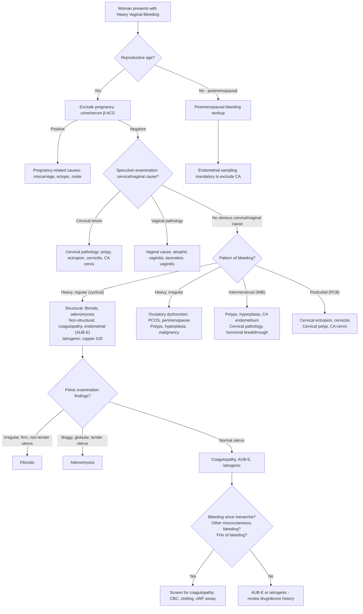

## Differential Diagnosis of Heavy Menstrual Bleeding (HMB)

The approach to the differential diagnosis of HMB requires you to think systematically. The key question at the bedside is: **Is this heavy menstrual bleeding arising from a structural uterine cause, a non-structural/functional cause, or something that is not actually uterine at all?**

Let me walk you through this logically, the way you would think on a clinical attachment.

---

### Step 1: Confirm the Source — Is It Actually Uterine?

Before diving into differential diagnoses for HMB, you must first establish that the bleeding is genuinely from the uterus. This seems obvious but is a surprisingly common pitfall.

> ***Is the bleeding from uterus?*** [1]
> - ***Heavy bleeding usually from uterus*** [1]
> - ***Staining, spotting, light bleeding may be from any genital tract site*** [1]
> - ***Brown implies old blood from light bleeding/spotting from anywhere from upper vagina to uterus*** [1]
> - ***Red can be from any genital tract sources*** [1]
> - ***Non-genital?: any urinary/bowel symptoms? Only seen upon wiping/when going to toilet?*** [1]

Think about it: a woman says she is "bleeding heavily." Where could it come from?
- **Uterine** — most likely in true HMB
- **Cervical** — cervicitis, polyp, ectropion, carcinoma (usually postcoital or intermenstrual, not classically heavy cyclical)
- **Vaginal** — atrophic vaginitis, lacerations, vaginitis, carcinoma
- **Vulvar** — skin lesions, carcinoma (usually visible)
- **Non-genital** — urinary (haematuria mistaken for vaginal bleeding), rectal (haemorrhoids, rectal bleeding)

A **speculum examination** resolves most of this ambiguity by directly visualising the cervix and vaginal walls.

---

### Step 2: Pattern of Bleeding — This Guides Your Differential

This is the most powerful discriminator at the history-taking stage.

> ***Pattern of bleeding?*** [1]
> - ***HMB?: fibroids, adenomyosis, coagulopathy, DUB more common*** [1]
> - ***IMB?: surface pathologies, e.g. polyps, hyperplasia, CA, vaginitis, STDs*** [1]
> - ***PCB?: cervical pathologies (or any lower genital tract friable lesion)*** [1]

> ***Important to distinguish between heavy regular bleeding (i.e. menorrhagia) and irregular or intermenstrual bleeding because they have different d/dx*** [1]

| Bleeding Pattern | What It Implies | Why |
|---|---|---|
| ***Heavy but regular (cyclical)*** | Structural uterine cause or endometrial haemostatic defect | Fibroids/adenomyosis → consistent anatomical distortion causes heavy bleeding with each normal cycle; endometrial causes → local haemostatic imbalance present every cycle |
| ***Heavy and irregular*** | Ovulatory dysfunction, polyps, hyperplasia, malignancy | Anovulation → no predictable progesterone withdrawal → random, disorganised shedding; polyps/malignancy → friable tissue bleeds unpredictably |
| ***Intermenstrual (IMB)*** | Surface lesions of genital tract | Polyps, endometrial hyperplasia/carcinoma, cervical lesions → friable or abnormal tissue bleeds between periods |
| ***Postcoital (PCB)*** | Cervical pathology primarily | Mechanical trauma during intercourse disrupts fragile cervical tissue (ectropion, polyp, carcinoma, cervicitis) |
| ***Postmenopausal (PMB)*** | **Malignancy until proven otherwise** | Atrophic endometrium should not bleed; neoplastic tissue has abnormal vasculature |

---

### Step 3: The Differential Diagnoses — Organised by the PALM-COEIN System

Let me present this as a comprehensive differential with the reasoning for each.

#### A. Structural Causes (PALM) — "Something You Can See or Image"

##### P — Polyp (AUB-P)
- Localised overgrowths of endometrial glands/stroma projecting into cavity
- ***More commonly associated with IMB*** than pure HMB, but can contribute to heavy cyclical bleeding if large or multiple
- Why they bleed: aberrant vasculature with poor contractile ability + surface erosion + interference with orderly endometrial shedding
- Prevalence: found in 10–40% of women investigated for AUB

##### A — Adenomyosis (AUB-A)
- ***Adenomyosis: may be a/w dysmenorrhea, commonly mid-30s to 40s*** [1]
- Ectopic endometrial glands within the myometrium → disrupts myometrial contraction → impaired vascular compression → heavy bleeding
- Also increases uterine surface area and alters local prostaglandin/MMP production
- Classical triad: **HMB + dysmenorrhoea + bulky, tender uterus**
- Important differential from fibroids — adenomyosis gives a **uniformly enlarged, boggy, tender** uterus rather than a nodular, firm one

##### L — Leiomyoma (AUB-L)
- ***Uterine fibroid: commonest structural cause*** [1]
- ***Usually due to submucosal (or intramural) leiomyomas*** [1]
- ***May be a/w pressure symptoms*** [1] — urinary frequency, constipation, pelvic heaviness
- Key point: **location determines bleeding** — submucosal (FIGO types 0–2) > intramural (types 3–4) > subserosal (types 5–7) in likelihood of causing HMB
- An enormous subserosal fibroid may cause zero bleeding, while a 1 cm submucosal fibroid can cause flooding

##### M — Malignancy and Hyperplasia (AUB-M)
- ***Endometrium: polyp, hyperplasia, CA endometrium*** [1]
- Endometrial hyperplasia (with or without atypia) → overgrown, friable endometrium with abnormal vasculature
- Endometrial carcinoma → neovascularisation, tissue necrosis, friable surface → bleeding (often irregular or postmenopausal, but can present as HMB in premenopausal women)
- Cervical carcinoma: more typically IMB/PCB, but advanced disease can cause heavy irregular bleeding
- Must be considered in ***any woman > 40 with new-onset HMB or AUB not responding to treatment***

##### Others (Structural)
- ***Uterine AVM*** [1] — arteriovenous malformation with high-flow shunting → can cause torrential bleeding; rare but important; often iatrogenic (post-curettage, post-C/S)
- ***C/S scar defect (isthmocele)*** [1] — a niche in the uterine scar traps blood → post-menstrual spotting/prolonged bleeding; increasingly recognised with rising C/S rates

---

#### B. Non-Structural Causes (COEIN) — "Nothing Visible on Imaging"

##### C — Coagulopathy (AUB-C)
- ***Coagulopathy: other bleeding symptoms, RFs, FHx*** [1]
- ***Especially if HMB since menarche (not likely if mid-reproductive age)*** [1]
- von Willebrand disease (vWD) is the most common inherited bleeding disorder — ***HMB occurs in 60–90% of women with vWD; 10–15% of women with HMB have vWD*** [4]
- Other coagulopathies: ITP, platelet function disorders, haemophilia carrier status, factor deficiencies [3]
- Acquired: anticoagulant/antiplatelet drugs, liver disease (↓clotting factor synthesis), renal disease (uraemic platelet dysfunction — ***↑NO → inhibit platelet***) [3]
- ***Approach: pattern of bleeding — platelet type (mucocutaneous: petechiae/purpura, epistaxis, menorrhagia) vs coagulation type (deep-seated: haemarthrosis, muscle haematoma, ICH)*** [3][5]

##### O — Ovulatory Dysfunction (AUB-O)
- ***Anovulation: e.g. start and end of reproductive life, PCOS*** [1]
- The old term ***"dysfunctional uterine bleeding (DUB)"*** encompasses this [1]
- ***In anovulatory DUB, there is disruption in HPO axis leading to chronic endometrial lining stimulation by estrogen, and is more common in extreme of reproductive ages*** [1]
- ***In ovulatory DUB, hormonal axis is normal but there is hemostatic and vasoconstrictive dysfunction in the endometrial lining*** [1]
- Causes: PCOS (most common in reproductive age), hypothalamic amenorrhoea, hyperprolactinaemia, thyroid disease, perimenopause, post-menarche
- Bleeding pattern: **irregular, unpredictable, and often prolonged** — this is a key distinguisher from structural causes

##### E — Endometrial (AUB-E)
- ***Imbalance in local hemostasis factors (AUB-E): not a/w structural cause*** [1]
- ***Occur when ↑fibrinolytic, vasodilatory factors (e.g. prostaglandin, tPA) with ↓pro-thrombotic, vasoconstrictory factors (e.g. progesterone)*** [1]
- A diagnosis of exclusion — the endometrium's own haemostatic mechanisms are dysfunctional
- This is the pathophysiological rationale for why **tranexamic acid** (antifibrinolytic) works for HMB — it counteracts ↑tPA

##### I — Iatrogenic (AUB-I)
- ***Copper IUCD due to foreign body reaction*** [1]
- Anticoagulants (warfarin, DOACs, heparin) and antiplatelets (aspirin, clopidogrel, NSAIDs)
- Hormonal contraceptives: ***unscheduled breakthrough bleeding from contraceptives*** [1]
- Tamoxifen: partial oestrogen agonist on endometrium → polyps, hyperplasia
- SSRIs: impair platelet serotonin uptake → ↓aggregation

##### N — Not Yet Classified (AUB-N)
- Chronic endometritis (e.g., PID)
- ***Endometriosis*** [1] — although classically causes dysmenorrhoea, it can contribute to HMB
- Myometrial hypertrophy
- Rare conditions

---

#### C. Conditions That Are NOT Uterine but Mimic HMB

These are important to exclude:

| Source | Differential | Key Distinguishing Feature |
|---|---|---|
| ***Cervical*** | ***Cervicitis, cervical ectropion, cervical polyp, CA cervix*** [1] | Usually IMB or PCB; visible on speculum |
| ***Vaginal*** | ***Atrophic vaginitis, lacerations, vaginitis, vaginal ulcers, CA vagina*** [1] | Visible on speculum; postmenopausal women (atrophic) |
| ***Vulvar*** | ***Vulval skin tags, sebaceous cysts, condyloma, CA vulva*** [1] | Visible on inspection |
| ***Pregnancy-related*** | ***Early: miscarriage, ectopic pregnancy, molar pregnancy*** [1]; ***Late: bloody show, placenta previa, placental abruption*** [1] | Always exclude with β-hCG! |
| ***PID*** | ***Fever, vaginal discharge: indicate PID*** [1] | Cervical excitation tenderness, adnexal tenderness, systemic symptoms |
| Non-genital | Haematuria, rectal bleeding | History of urinary/bowel symptoms; bleeding only with micturition/defecation |

---

#### D. The "Don't Forget" List — Special Situations

##### Pregnancy-Related Bleeding
- ***Always exclude pregnancy*** in any woman of reproductive age with abnormal vaginal bleeding
- ***Early pregnancy: miscarriage (threatened, inevitable, incomplete, complete), ectopic pregnancy, molar pregnancy*** [1]
- ***Late pregnancy: bloody show (normal), placenta praevia, placental abruption*** [1]
- Mechanism: disruption of the pregnancy-endometrial interface or abnormal trophoblastic tissue

##### Thyroid Disease
- ***Thyroid disease: most commonly a/w oligo-amenorrhoea*** [1] — but can also cause HMB
- Hypothyroidism → ↑TRH → ↑prolactin → anovulation → HMB; also affects coagulation factors and endometrial oestrogen/progesterone receptor expression
- Hyperthyroidism → can cause oligomenorrhoea or light periods (though relationship is variable)

##### Hyperprolactinaemia
- ***Hyperprolactinemia*** [1] — prolactin excess → suppresses GnRH pulsatility → anovulation → irregular and/or heavy bleeding
- Causes: prolactinoma, drugs (antipsychotics, metoclopramide), hypothyroidism, stalk effect

---

### Differential Diagnosis Summary Table

| Category | Differential | Typical Bleeding Pattern | Key Clues |
|---|---|---|---|
| **Structural** | Fibroid (submucosal) | Heavy, regular | Irregular/enlarged firm uterus, pressure symptoms |
| | Adenomyosis | Heavy, regular + dysmenorrhoea | Boggy tender uterus, age 30s–40s |
| | Endometrial polyp | IMB ± HMB | Post-menstrual spotting |
| | Endometrial hyperplasia/CA | Irregular, heavy, or PMB | Age > 40, obesity, PCOS, tamoxifen |
| | Uterine AVM | Torrential, unpredictable | Post-procedure, Doppler shows high-flow |
| | C/S scar defect | Post-menstrual spotting | Previous C/S history |
| **Non-structural** | Ovulatory dysfunction | Irregular, unpredictable | Extremes of reproductive life, PCOS |
| | Coagulopathy (vWD, ITP) | Heavy since menarche | Other mucocutaneous bleeding, FHx |
| | Endometrial haemostatic defect | Heavy, regular (no structural cause) | Diagnosis of exclusion |
| | Iatrogenic (Cu IUD, anticoagulants) | Related to intervention timing | Drug/device history |
| | Thyroid disease | Variable | Other thyroid symptoms |
| **Cervical** | Cervicitis, polyp, ectropion, CA | PCB, IMB | Speculum findings |
| **Vaginal** | Atrophic vaginitis, lacerations | Spotting, light bleeding | Visible on speculum |
| **Pregnancy** | Miscarriage, ectopic, molar | Irregular, ± pain | Positive β-hCG |
| **Non-genital** | Haematuria, rectal bleeding | Not menstrual pattern | Urinary/bowel symptoms |

---

### Diagnostic Approach — Mermaid Flowchart

---

### How to Use Age to Narrow the Differential

This is a practical bedside trick — the most likely diagnoses shift with age:

| Age | Most Likely Differentials | Why |
|---|---|---|
| **Adolescent (< 20)** | Anovulation (immature HPO axis), coagulopathy (esp. vWD), pregnancy | HPO axis takes 2–3 years to mature post-menarche → anovulatory cycles common; vWD often first manifests at menarche; always exclude pregnancy |
| **Early reproductive (20–35)** | Pregnancy complications, polyps, PID/endometritis, iatrogenic (Cu IUD, hormonal), endometriosis, ovulatory dysfunction (PCOS) | Active reproductive period → pregnancy always considered; PCOS peaks; Cu IUD commonly inserted |
| **Late reproductive (35–45)** | Fibroids, adenomyosis, polyps, ovulatory dysfunction (early perimenopause), endometrial hyperplasia | Fibroids grow under oestrogen influence and accumulate with age; adenomyosis typically presents in 30s–40s; anovulatory cycles begin |
| **Perimenopausal (45–menopause)** | Anovulation, fibroids, polyps, ***endometrial hyperplasia/malignancy*** | Ovarian reserve declines → frequent anovulation → unopposed oestrogen; must exclude malignancy |
| **Postmenopausal** | ***Endometrial carcinoma***, atrophic endometritis/vaginitis, polyps, HRT-related | Any PMB = cancer until proven otherwise |

---

### Distinguishing Key Differentials — Clinical Reasoning

#### Fibroids vs Adenomyosis
These two are the most commonly confused because both cause HMB and a bulky uterus:

| Feature | Fibroids | Adenomyosis |
|---|---|---|
| Uterine contour | Irregular, nodular | Uniformly enlarged, globular |
| Consistency | Firm, hard | Boggy, soft |
| Tenderness | Usually non-tender | ***Tender, especially perimenstrually*** |
| Dysmenorrhoea | Can occur but not typical | ***Very characteristic*** |
| Age | Any reproductive age (peak 30–50) | ***Mid-30s to 40s*** |
| Imaging | Discrete, well-circumscribed masses on USS | Heterogeneous myometrium, junctional zone thickening on MRI |

#### Ovulatory Dysfunction vs Structural Cause
| Feature | Ovulatory Dysfunction | Structural (Fibroids/Adenomyosis) |
|---|---|---|
| Cycle regularity | ***Irregular*** — variable intervals | ***Regular*** — predictable cycle length |
| Volume per cycle | Variable — can be very heavy or very light | Consistently heavy |
| Age | Extremes of reproductive life, PCOS | Peak reproductive to perimenopausal |
| Examination | Normal uterus | Enlarged uterus |
| Response to progesterone | Excellent — organises the endometrium | Partial at best |

#### Coagulopathy vs Endometrial Cause
| Feature | Coagulopathy | Endometrial (AUB-E) |
|---|---|---|
| Onset | ***Since menarche*** | Acquired, any age |
| Other bleeding | Easy bruising, epistaxis, gum bleeding, postpartum, post-surgical | No systemic bleeding |
| Family history | Often positive (vWD = AD) | Negative |
| Clotting tests | Abnormal (↑aPTT in vWD; ↓platelets in ITP) | Normal |
| Response to tranexamic acid | Partial | Good |

<Callout title="Coagulopathy Screening — When to Think About It" type="idea">
The ACOG screening criteria suggest screening for coagulopathy if:
- ***HMB since menarche***
- Postpartum haemorrhage
- Surgery-related bleeding
- Bleeding with dental work
- ≥ 2 bruising symptoms (> 5 cm without trauma)
- Frequent epistaxis (> 1/month)
- Family history of bleeding disorder

***Standard evaluation: CBC ± PBS for platelet count and morphology, clotting profile including PT and aPTT (± TT). Additional: platelet function tests and vWF function assay for positive bleeding history with negative initial testing; specific clotting factor assays and mixing tests if suspecting haemophilia.*** [3][5]
</Callout>

---

### The "Must-Not-Miss" Differentials

<Callout title="Red Flag Differentials — Do Not Miss" type="error">

1. **Endometrial carcinoma** — any woman > 40 with new AUB or AUB not responding to treatment. Any postmenopausal bleeding. Risk factors: obesity, PCOS, tamoxifen, nulliparity, Lynch syndrome.

2. **Pregnancy complications** — always check β-hCG. Ectopic pregnancy can be life-threatening.

3. **Cervical carcinoma** — especially with PCB/IMB. Check smear history. Examine cervix.

4. **Coagulopathy (especially vWD)** — underdiagnosed. Think about it in adolescents with HMB since menarche.

5. **PID/endometritis** — can cause AUB with pain and discharge. May progress to tubo-ovarian abscess.
</Callout>

---

<Callout title="High Yield Summary">

**Step 1**: Confirm bleeding is uterine (not cervical, vaginal, vulvar, or non-genital). Speculum examination is essential.

**Step 2**: Exclude pregnancy in ALL reproductive-age women (β-hCG).

**Step 3**: Determine the bleeding pattern — heavy regular (structural: fibroids, adenomyosis; or AUB-E/coagulopathy) vs heavy irregular (ovulatory dysfunction, polyps, hyperplasia/malignancy) vs IMB (surface lesions) vs PCB (cervical pathology).

**Key differentials for regular HMB**: Fibroids (commonest structural cause, especially submucosal), adenomyosis (dysmenorrhoea + boggy tender uterus), coagulopathy (especially vWD — 10–15% of HMB), endometrial haemostatic defect (AUB-E: ↑tPA, ↑PGE₂), copper IUD.

**Key differentials for irregular HMB**: Anovulation (PCOS, perimenopause, adolescence), endometrial hyperplasia/carcinoma, polyps.

**Must-not-miss**: Endometrial carcinoma (> 40, risk factors), pregnancy, cervical carcinoma, coagulopathy (menarche onset), PID.

**Age-based thinking**: Adolescents → anovulation + coagulopathy; reproductive → fibroids + pregnancy; perimenopausal → anovulation + exclude malignancy; postmenopausal → carcinoma until proven otherwise.

</Callout>

---

<ActiveRecallQuiz
  title="Active Recall - Differential Diagnosis of HMB"
  items={[
    {
      question: "A 15-year-old girl presents with HMB since menarche, easy bruising, and frequent epistaxis. What is the most likely non-structural cause and how would you screen for it?",
      markscheme: "Most likely: von Willebrand disease (vWD) — the most common inherited bleeding disorder. HMB since menarche with mucocutaneous bleeding symptoms is classic. Screening: CBC with platelet count, clotting profile (PT, aPTT — isolated prolonged aPTT in vWD), vWF antigen (vWF:Ag), vWF activity (vWF:Act/Ristocetin cofactor assay), factor VIII activity. aPTT may be normal in mild cases."
    },
    {
      question: "Name the commonest structural cause of HMB and explain which subtype is most likely responsible. Why does location matter more than size?",
      markscheme: "Uterine fibroids (leiomyomas) are the commonest structural cause. Submucosal fibroids (FIGO types 0, 1, 2) are most likely to cause HMB because they distort the endometrial cavity, increase endometrial surface area, cause venous ectasia in the overlying endometrium, alter local prostaglandin ratios and fibrinolysis, and impair orderly endometrial shedding. A large subserosal fibroid projects outward and does not affect the cavity, so may cause pressure symptoms but not HMB."
    },
    {
      question: "A 47-year-old obese woman with PCOS presents with increasingly heavy and irregular periods. What is the most important diagnosis to exclude and why?",
      markscheme: "Must exclude endometrial hyperplasia with atypia and endometrial carcinoma. Why: age > 40, obesity (peripheral aromatisation of androgens to oestrogen in adipose tissue → unopposed oestrogen), PCOS (chronic anovulation → no progesterone to oppose oestrogen), and irregular pattern all point to risk of endometrial malignancy. Endometrial sampling (e.g., pipelle biopsy) is mandatory."
    },
    {
      question: "How do you differentiate between ovulatory dysfunction and a structural cause of HMB using history alone?",
      markscheme: "Ovulatory dysfunction produces irregular, unpredictable bleeding (variable cycle lengths, variable volume) because anovulation means no regular progesterone withdrawal for synchronised shedding. Structural causes (fibroids, adenomyosis) typically produce regular but heavy cyclical bleeding — the anatomy is constant, so each normal ovulatory cycle produces predictably heavy flow. Additional clues: anovulation common at extremes of reproductive life and in PCOS; structural causes associated with examination findings (enlarged uterus)."
    },
    {
      question: "List the PALM-COEIN differential for a woman with heavy regular menstrual bleeding with associated dysmenorrhoea and a bulky tender uterus on examination.",
      markscheme: "The findings suggest adenomyosis (AUB-A): heavy regular HMB + dysmenorrhoea + uniformly enlarged, boggy, tender uterus is the classic triad. PALM-COEIN differential for regular HMB: Structural — fibroid (AUB-L, but would be firm, irregular, non-tender), adenomyosis (AUB-A, fits best), polyp (AUB-P, usually IMB). Non-structural — coagulopathy (AUB-C), endometrial (AUB-E), iatrogenic (AUB-I, e.g. Cu IUD). The examination findings strongly favour adenomyosis."
    }
  ]}
/>

---

## References

[1] Lecture slides: Adrian Lui Gynecology Notes.pdf (p11, p13)
[3] Senior notes: Ryan Ho Haemtology.pdf (p113–114, p117, p128, p137–138, p161)
[4] Senior notes: Ryan Ho Haemtology.pdf (p128 — vWD clinical features and HMB association)
[5] Senior notes: Ryan Ho Fundamentals.pdf (p404 — approach to bleeding disorders)
[6] Senior notes: Maksim Medicine Notes.pdf (p153, p160–161 — IDA causes including menorrhagia, platelet/clotting disorders)
