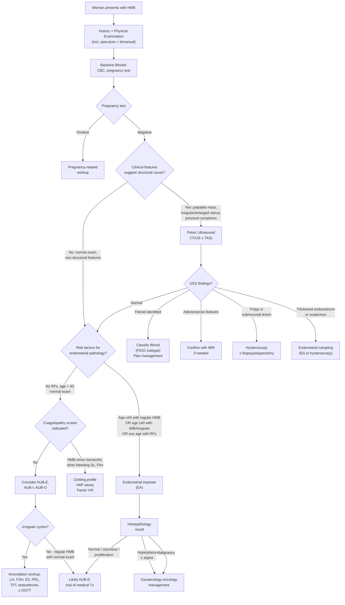

## Diagnostic Criteria, Diagnostic Algorithm, and Investigations for HMB

### Diagnostic Criteria for HMB

HMB does not have traditional "diagnostic criteria" in the way that, say, rheumatic fever has Jones criteria. Instead, the diagnosis rests on **two pillars**:

1. **Clinical (patient-centred) criterion**: ***Excessive menstrual blood loss that interferes with the woman's physical, social, emotional, and/or material quality of life*** [1]. If the patient says her periods are heavy and they impair her life, that is HMB.

2. **Objective assessment tools** (supportive, not mandatory):
   - **Pictorial Blood Assessment Chart (PBAC)**: score ≥ 100 correlates with MBL > 80 mL (sensitivity ~80%, specificity ~80%)
   - **Alkaline haematin method**: research gold standard for quantifying MBL (> 80 mL = HMB), but impractical for clinical use

In practice, you diagnose HMB based on history and then your job shifts to **identifying the underlying cause** using the PALM-COEIN framework, and **assessing the consequences** (iron deficiency anaemia).

<Callout title="When Is HMB Diagnosed?">
There is no blood test or imaging study that "diagnoses" HMB. The diagnosis is clinical — the woman reports heavy periods with QoL impact. The investigations are directed at finding the CAUSE and assessing CONSEQUENCES, not at confirming the diagnosis itself.
</Callout>

---

### Indications for Investigation — Who Needs What?

Not every woman with HMB needs extensive investigation. The decision tree depends on age, risk factors, clinical findings, and response to empirical treatment.

> ***The goal of investigation is to:***
> 1. ***Exclude pregnancy***
> 2. ***Assess consequences (anaemia)***
> 3. ***Identify structural causes***
> 4. ***Exclude malignancy/hyperplasia***
> 5. ***Identify non-structural causes (coagulopathy, thyroid, anovulation)***

---

### The Diagnostic Algorithm

---

### Investigations — Detailed Breakdown

I will organise these by category, explaining what each test is looking for, why you order it, and how to interpret the findings.

---

#### A. Bedside and First-Line Blood Tests

##### 1. Pregnancy Test (urine or serum β-hCG)

- **Why**: ***To exclude pregnancy → must be done (or document no unprotected sex) before EA*** [1]
- **Rationale from first principles**: any reproductive-age woman with abnormal vaginal bleeding could be pregnant. Threatened miscarriage, incomplete miscarriage, ectopic pregnancy, and gestational trophoblastic disease all present with vaginal bleeding. Performing endometrial sampling on a pregnant patient would be harmful.
- **Interpretation**: positive → redirect to pregnancy-related workup; negative → proceed with HMB investigation

##### 2. Complete Blood Count (CBC)

- ***CBC: Hb, platelets*** [1]
- **Why**: to assess the **consequence** of HMB (anaemia) and screen for haematological causes
- **Key findings and interpretation**:

| Finding | Interpretation | Pathophysiological Basis |
|---|---|---|
| ↓Hb with ↓MCV, ↓MCH (microcytic hypochromic anaemia) | ***Iron deficiency anaemia*** [6] — the most common consequence of chronic HMB | Chronic blood loss → iron stores depleted → insufficient iron for haemoglobin synthesis → small, pale red cells |
| ↓Hb with normal MCV | Could be early IDA (iron stores depleted but MCV not yet dropped), or mixed deficiency, or anaemia of chronic disease | Iron depletion precedes changes in MCV; see staged progression below |
| ***Reactive thrombocytosis*** (↑platelet count) | ***↑EPO stimulates platelet precursors*** [6] — common in IDA | Thrombopoietin and EPO share structural homology; EPO stimulates megakaryocyte progenitors |
| ↓Platelet count | Suggests ITP, DIC, or bone marrow pathology as underlying cause of HMB | Reduced platelet count → impaired primary haemostasis → mucocutaneous bleeding including HMB |
| ↑WBC | Consider PID/endometritis, or haematological malignancy | Infection → neutrophilia; malignancy → abnormal differential |

##### 3. Peripheral Blood Smear (PBS)

- **Why**: provides morphological information that CBC numbers alone cannot
- **Key findings**:
  - ***Pencil cells, anisopoikilocytosis*** [6] → iron deficiency
  - Target cells → thalassaemia trait (co-existing with IDA common in Hong Kong Chinese population)
  - Schistocytes → consider DIC, TTP (rare but serious)
  - ***Rule out platelet clumping*** (EDTA-induced pseudothrombocytopenia) [3]

---

#### B. Iron Studies

> ***Fe profile: for Fe def anaemia*** [1]

***Understanding iron studies from first principles*** is essential. Let me walk you through the stages of iron deficiency [7]:

| Stage | Serum Iron | TIBC | Transferrin Saturation | Serum Ferritin | Hb / MCV | Clinical State |
|---|---|---|---|---|---|---|
| ***1. Depletion of iron stores*** | Normal | Normal | Normal | ***LOW*** | Normal | Asymptomatic; stores exhausted but functional iron sufficient |
| ***2. Functional iron deficiency*** | ***↓*** | ***↑*** | ***↓ (< 16%)*** | ***↓*** | Normal | Iron-restricted erythropoiesis begins; BM staining ↓ |
| ***3. Iron deficiency anaemia*** | ***↓*** | ***↑*** | ***↓ (< 16%)*** | ***↓*** | ***Hb < 12, MCV < 80*** | Frank anaemia with microcytosis |

**Interpretation of individual markers** [7]:

| Marker | What It Measures | Key Points |
|---|---|---|
| ***Serum ferritin*** | Body iron stores (intracellular storage iron) | ***Most sensitive and specific marker*** [7]; ***Low serum ferritin is diagnostic of iron deficiency*** [7]; BUT it is an acute phase reactant — falsely elevated in inflammation, liver disease, malignancy |
| Serum iron | Circulating iron bound to transferrin | ***CANNOT be used alone*** [7] — fluctuates with diurnal variation, meals, inflammation |
| TIBC | Total binding capacity of transferrin in plasma | ↑ in IDA (body tries to maximise iron capture), ↓ in inflammation |
| ***Transferrin saturation (TSAT)*** | Serum iron / TIBC × 100% | ***CANNOT be used alone*** [7]; < 16% suggests iron-restricted erythropoiesis |

**Clinical decision cut-offs for serum ferritin** [7]:
- ***Adults: < 34 pmol/L (15 μg/L) = diagnostic of iron deficiency***
- ***Hospitalised elderly: < 100 pmol/L (45 μg/L)***
- ***Community-based elderly: < 49 pmol/L (22 μg/L)***
- Disease-specific thresholds exist (e.g., renal dialysis patients)

<Callout title="Ferritin Pitfall" type="error">
A "normal" ferritin does NOT exclude iron deficiency in the presence of concurrent inflammation, infection, liver disease, or malignancy. In these settings, ferritin can be falsely elevated because it is an acute phase reactant. Use TSAT and clinical context alongside ferritin. Some guidelines use a higher cut-off (e.g., < 100 μg/L) in the context of chronic disease or CKD.
</Callout>

---

#### C. Coagulation Screen

> ***± Clotting profile: if HMB since menarche, or FHx +ve*** [1]

Not routine for all women with HMB — only when clinical suspicion exists.

**When to order** [1][5]:
- ***HMB since menarche*** — this is the single most important screening question
- Family history of bleeding disorder
- Other mucocutaneous bleeding symptoms (easy bruising, epistaxis, gum bleeding, post-surgical/dental bleeding)
- Suspected coagulopathy on clinical grounds

**What to order and interpretation** [3][5]:

| Test | What It Assesses | Expected in vWD | Expected in ITP | Expected in Haemophilia Carrier |
|---|---|---|---|---|
| ***PT (and INR)*** | Extrinsic pathway (factor VII) + common pathway | Normal | Normal | Normal |
| ***aPTT*** | Intrinsic pathway (factors VIII, IX, XI, XII) + common pathway | ***Isolated ↑aPTT*** (but can be normal in mild disease) [4] | Normal | May be mildly ↑ |
| Platelet count | Quantitative platelet assessment | Normal (except type 2B → ↓) | ***↓↓↓*** | Normal |
| ***Fibrinogen, D-dimer*** | DIC screen | Normal | Normal | Normal |

**If initial screen abnormal or high clinical suspicion despite normal screen** [5]:
- ***vWF antigen (vWF:Ag)***: < 30% (< 30 IU/dL) consistent with vWD [4]
- ***vWF activity (vWF:Act / Ristocetin cofactor assay, vWF:RiCof)***: measures functional binding to platelet GPIb [4]
- ***Factor VIII activity***: moderately ↓ in types 1, 2A, 2B, 2M; significantly ↓ in types 2N, 3 [4]
- ***vWF Act:Ag ratio***: < 0.5–0.7 indicates qualitative defect (type 2) [4]
- Further: multimer analysis, RIPA for subtype differentiation [4]

<Callout title="vWD Testing Pitfall" type="error">
***aPTT can be normal in vWD*** due to: (1) mild deficiency, (2) stress-induced ↑vWF/F8 during phlebotomy, inflammation, infection, malignancy, (3) hormonal factors — vWF levels rise during the menstrual cycle and with OCP/pregnancy [4]. A normal aPTT does NOT exclude vWD. If clinical suspicion is high, proceed directly to vWF-specific assays.
</Callout>

---

#### D. Thyroid Function Tests (TFT)

> ***± TFT: only when clinically symptomatic (uncommon)*** [1]

- **Why not routine?** Because thyroid disease is an uncommon cause of HMB in isolation. However, when thyroid symptoms are present (fatigue, weight changes, cold/heat intolerance, tremor, constipation, etc.), TFTs should be checked.
- **Interpretation**: ↑TSH + ↓fT4 = hypothyroidism → can cause HMB through anovulation (↑TRH → ↑prolactin → GnRH suppression) and altered endometrial physiology

---

#### E. Hormonal Profile (When Anovulation Suspected)

> ***± Further workup on anovulation: hormonal profile: LH, FSH, E2; endocrine profile: TFT, PRL; PCOS: (US), testosterone, OGTT*** [1]

Indicated when the bleeding pattern is **irregular** (suggesting ovulatory dysfunction):

| Test | What It Tells You | Key Findings |
|---|---|---|
| **LH, FSH** | Hypothalamic-pituitary function | ↑LH:FSH ratio (> 2:1) in PCOS; ↑FSH in perimenopause/ovarian failure; ↓ both in hypothalamic cause |
| **Oestradiol (E2)** | Ovarian function | ↓ in ovarian failure/menopause; variable in PCOS |
| **Prolactin (PRL)** | Hyperprolactinaemia screen | ↑ in prolactinoma, drug-induced, hypothyroidism; causes anovulation via GnRH suppression |
| **Testosterone** | Hyperandrogenism screen | ↑ in PCOS (mild-moderate); significantly ↑ consider adrenal/ovarian androgen-secreting tumour |
| **OGTT** | Insulin resistance/diabetes in PCOS | PCOS is associated with insulin resistance → screen with 75g OGTT |
| **TFT** | As above | Hypothyroidism can cause anovulation |

---

#### F. Imaging Studies

##### 1. Pelvic Ultrasound (USS)

This is the **first-line imaging modality** for structural assessment.

> ***Pelvic US when suspect structural pathology*** [1]
> - ***Suspicious of fibroids: uterus palpable abdominally, Hx/PE suggestive of pelvic mass, examination inconclusive or difficult*** [1]
> - ***Suspicious of adenomyosis: TVUS for significant dysmenorrhoea, bulky tender uterus on PE*** [1]
> - ***Transvaginal for small fibroid (< 12w)*** [1]
> - ***Trans-abdominal for large fibroids (> 12w)*** [1]

**Two approaches**:

| Modality | When to Use | Advantages | Limitations |
|---|---|---|---|
| ***Transvaginal USS (TVUS)*** | First-line; better resolution for endometrium, small fibroids, adenomyosis | High resolution for endometrial thickness, cavity assessment, adnexal structures | Cannot visualise very large uteri that extend beyond probe range |
| ***Transabdominal USS (TAS)*** | Large uteri (> 12-week size), overview assessment | Wider field of view | Lower resolution for endometrial detail |

**Key findings and interpretation**:

| USS Finding | Diagnosis | Description |
|---|---|---|
| ***Single or multiple well-circumscribed hypoechoic mass*** [1] | Fibroid (leiomyoma) | Well-defined, rounded, usually hypoechoic with posterior acoustic shadowing; ***pseudocapsule visible from surrounding compressed myometrium*** [1] |
| ***Heterogeneous echoes*** | Complicated fibroid | ***E.g., complicated by bleeding (uncommon)*** [1]; may also represent degeneration (red, hyaline, cystic) |
| ***Cystic areas within fibroid*** | Cystic degeneration | ***E.g., cystic degeneration*** [1] |
| Asymmetric myometrial thickening, heterogeneous myometrium, myometrial cysts, indistinct endo-myometrial junction | Adenomyosis | Sub-endometrial cysts (ectopic glands), "Venetian blind" shadowing, globular uterus |
| Echogenic focal mass within endometrial cavity ± feeder vessel | Endometrial polyp | Best seen with saline infusion sonography (SIS) which distends the cavity |
| ***Thickened endometrium*** | Endometrial hyperplasia or carcinoma | Post-menopausal: ***should be ≤ 4 mm*** [1]; pre-menopausal: interpret in context of cycle phase |
| High-velocity, low-resistance flow on Doppler | Uterine AVM | Tangle of vessels with arteriovenous shunting; colour Doppler shows characteristic "aliasing" |
| Myometrial niche at C/S scar | Isthmocele (C/S scar defect) | Triangular hypoechoic defect at previous scar site |

**Endometrial thickness assessment** [1]:
- ***Post-menopausal women: endometrial thickness ≤ 4 mm → NPV 99.4–100% for endometrial carcinoma*** [1]
- ***At 4 mm cut-off: sensitivity 96%, specificity 53%*** [1]
- ***At 5 mm cut-off: sensitivity 96%, specificity 61%*** [1]
- Pre-menopausal women: endometrial thickness varies with the menstrual cycle (thinnest during menstruation ~1–4 mm, thickest in late secretory phase ~8–16 mm), so a single measurement is less useful

##### 2. MRI Pelvis

> ***MRI: for complex OTs, planning for UAE or suspicious for sarcoma*** [1]

- **When**: second-line imaging when USS is inconclusive, when surgical planning requires precise mapping (e.g., multiple fibroids, laparoscopic myomectomy planning), when differentiating adenomyosis from fibroids, or when uterine sarcoma is suspected
- **Advantages**: superior soft tissue contrast; best for adenomyosis diagnosis (junctional zone thickening > 12 mm is diagnostic); precise fibroid mapping
- **Key findings**:
  - Fibroids: well-circumscribed, low T2 signal masses (dense smooth muscle)
  - Adenomyosis: ***junctional zone thickening > 12 mm***, T2 low-signal thickening with bright T2 foci (ectopic glands)
  - Sarcoma: irregular margins, high T2 signal, necrosis, rapid growth, no calcification (contrast fibroids which have regular margins, low T2 signal, may calcify)

##### 3. Saline Infusion Sonohysterography (SIS) / Sonohysterogram

- Saline instilled into the uterine cavity during TVUS → outlines intracavitary lesions
- ***Alternative but NOT available in HK*** [1]
- Excellent for differentiating submucosal fibroids from polyps and for assessing degree of intracavitary protrusion

---

#### G. Endometrial Sampling

This is the critical investigation for **excluding endometrial hyperplasia and malignancy**.

##### 1. Endometrial Aspirate (EA) — Office-Based Procedure

> ***Endometrial aspirate/sampling (EA): a simple out-patient procedure*** [1]

**What it is**: a thin suction curette (e.g., Pipelle device) is passed through the cervical os into the uterine cavity to aspirate a sample of endometrial tissue for histopathological examination.

***Indications*** [1]:
- ***Presence of RFs for endometrial pathology: e.g., obesity, PCOS, on tamoxifen, failed treatment*** [1]
- ***Age ≥ 40y with persistent IMB or irregular bleeding*** [1]
- ***Age ≥ 45y with regular heavy period*** [1]
- ***Abnormal Pap smear: AGC-endometrial (1st line), other AGC (with colposcopy), benign endometrial cells (if ≥ 45y + symptomatic or post-menopausal)*** [1]
- ***Monitoring in previous endometrial pathology or surveillance in high-risk (e.g., HNPCC/Lynch syndrome)*** [1]

**Procedure** [1]:
- ***To be done during speculum exam***
- ***Insertion of endometrial suction curette to aspirate endometrial tissue***
- ***Send for histopathology***
- Can be completed in ~5 minutes without anaesthesia
- ***Must exclude pregnancy before EA*** [1]

**Interpretation of histopathology**:

| Result | Interpretation | Action |
|---|---|---|
| Proliferative endometrium | Normal — consistent with follicular phase | Reassuring; no further action for endometrial pathology |
| Secretory endometrium | Normal — confirms ovulation occurred | Reassuring |
| Disordered proliferative endometrium | Suggests anovulation/hormonal imbalance | Supports AUB-O; medical management |
| ***Endometrial hyperplasia without atypia*** | Low malignant potential (~1–3% over 20 years) | Progestogen therapy; follow-up EA in 3–6 months |
| ***Atypical hyperplasia / EIN*** | ***High malignant potential (~25–30% progression)*** | Refer gynaecology-oncology; consider hysterectomy |
| ***Endometrial carcinoma*** | Malignancy confirmed | Staging investigations + gynaecology-oncology management |
| Insufficient sample | Non-diagnostic — cavity not adequately sampled | Consider hysteroscopy + targeted biopsy |
| Chronic endometritis | Plasma cells in stroma → consider PID | Antibiotic treatment; investigate for STI |

**Limitations**:
- "Blind" procedure — may miss focal lesions (polyps, small submucosal fibroids)
- Sensitivity for endometrial cancer is ~90–99% (high but not perfect)
- Insufficient sample rate ~5–15%

##### 2. Hysteroscopy ± Endometrial Biopsy

> ***Hysteroscopy ± endometrial biopsy: diagnostic and therapeutic*** [1]

**What it is**: direct visualisation of the uterine cavity using a small-calibre endoscope (typically 3 mm for diagnostic, 5–9 mm for operative) passed through the cervix.

***Indications — superior to EA but limited availability*** [1]:
- ***Suspected endometrial polyp or submucosal fibroids*** [1]
- ***Irregular bleeding while on hormonal therapy for > 3 months*** [1]
- ***Endometrial aspirate failed or inconclusive*** [1]
- ***Diagnostic hysteroscopy: to aid planning and assess suitability for definitive hysteroscopic myomectomy (> 50% protrusion into cavity)*** [1]

**Advantages over EA**:
- Direct visualisation → can identify focal lesions (polyps, submucosal fibroids) that EA misses
- ***Targeted biopsy at suspicious endometrial sites*** [1]
- Therapeutic: ***removal of lesion, e.g., polyp*** [1], or submucosal fibroid resection

**Setting** [1]:
- ***Under GA or LA (out-patient procedure)***

**Key findings**:

| Hysteroscopic Finding | Diagnosis | Significance |
|---|---|---|
| Smooth, pedunculated or sessile mass within cavity | Endometrial polyp | Can be removed during same procedure (polypectomy) |
| Rounded mass distorting cavity, covered by endometrium | Submucosal fibroid | Assess % intracavitary protrusion → determines if hysteroscopic myomectomy is feasible |
| Generalised thickened, friable, vascular endometrium | Endometrial hyperplasia | Biopsy for histopathology |
| Irregular, necrotic, bleeding mass | Suspicious for malignancy | Urgent biopsy → histology |
| Pale, thin, atrophic endometrium with petechial haemorrhages | Atrophic endometrium (PMB) | Reassuring if biopsy confirms |

---

#### H. Cervical Assessment

> ***Note any cervical pathology and perform a cervical smear if (1) due for screening (2) look suspicious but no obvious lesion*** [1]

- **Cervical cytology (Pap smear / liquid-based cytology)**: should be performed if due for screening or if cervical abnormality noted on speculum
- In Hong Kong, cervical screening is recommended every 3 years for women aged 25–64 who have ever been sexually active (transitioning to HPV-based primary screening)
- If AGC (atypical glandular cells) found on Pap → consider EA + colposcopy [1]

---

#### I. Summary Table: When to Order What

| Investigation | When to Order | What You're Looking For |
|---|---|---|
| ***Pregnancy test*** | ***ALL reproductive-age women*** | Exclude pregnancy-related bleeding |
| ***CBC*** | ***ALL women with HMB*** | Anaemia (Hb, MCV), thrombocytopenia |
| ***Iron profile*** | When anaemia detected or suspected | Confirm iron deficiency; stage of depletion |
| ***Clotting profile*** | ***HMB since menarche, FHx +ve, other bleeding symptoms*** | Coagulopathy (↑aPTT in vWD, ↓platelets in ITP) |
| ***vWF assay + FVIII*** | Suspected vWD (above features) | vWD subtypes |
| ***TFT*** | ***Only when clinically symptomatic*** | Hypo-/hyperthyroidism |
| ***Hormonal profile*** | Irregular cycles suggesting anovulation | PCOS, hyperprolactinaemia, ovarian failure |
| ***Pelvic USS (TVUS ± TAS)*** | Structural pathology suspected on exam | Fibroids, adenomyosis, polyps, endometrial thickness |
| ***EA (Pipelle)*** | ***Age ≥ 45 with regular HMB; age ≥ 40 with IMB/irregular; RFs for endometrial pathology; failed treatment*** | Endometrial hyperplasia / malignancy |
| ***Hysteroscopy ± biopsy*** | ***Suspected polyp/submucosal fibroid; EA failed/inconclusive; irregular bleeding on hormonal Tx > 3m*** | Direct visualisation + targeted biopsy/treatment |
| ***MRI pelvis*** | ***Complex surgical planning, UAE planning, suspicious for sarcoma*** | Fibroid mapping, adenomyosis confirmation, sarcoma exclusion |
| ***Cervical smear*** | Due for screening or suspicious cervix | Cervical dysplasia / malignancy |

---

### Age-Based Investigation Thresholds — A Practical Summary

This is a critical exam point. The age thresholds determine when endometrial sampling is indicated:

> ***Age ≥ 45y with regular heavy period → EA indicated*** [1]
> ***Age ≥ 40y with persistent IMB or irregular bleeding → EA indicated*** [1]
> ***Any age with RFs for endometrial pathology (obesity, PCOS, tamoxifen, failed treatment) → EA indicated*** [1]
> ***All cases of postmenopausal bleeding → EA mandatory*** [1]

<Callout title="Endometrial Sampling Indications — Exam Favourite" type="idea">
The logic behind the age cut-offs: as women age, the probability of endometrial hyperplasia/carcinoma increases. By age 45, even regular heavy periods warrant endometrial sampling because perimenopausal anovulation → unopposed oestrogen → hyperplasia risk. By age 40, irregular/intermenstrual bleeding raises more concern for endometrial pathology. At any age, additional risk factors (obesity, PCOS, tamoxifen, failed treatment) lower the threshold for sampling.
</Callout>

---

### Postmenopausal Bleeding — Special Investigation Protocol

Since PMB is covered as a differential and shares investigation principles, here is the protocol for completeness [1]:

> ***PMB: any uterine bleeding > 1y after last natural menstrual period*** [1]
> ***Must r/o CA endometrium*** [1]

1. ***Cervical cytology if no regular screening*** [1]
2. ***Endometrial aspirate: mandatory in all cases of PMB*** [1]
   - ***NOT routinely performed in asymptomatic patients with incidental finding of thickened endometrium unless > 11 mm and associated with other USS findings or RFs*** [1]
3. ***TVUS for endometrial thickness: should be ≤ 4 mm in post-menopausal women*** [1]
4. ***Hysteroscopy ± endometrial biopsy: if on tamoxifen, endometrial thickness > 4 mm, recurrent/refractory symptoms despite treatment for atrophic changes*** [1]

---

<Callout title="High Yield Summary">

**Diagnosis of HMB is clinical** — based on patient-reported excessive menstrual blood loss interfering with quality of life. There are no lab/imaging criteria for "diagnosing" HMB itself. Investigations find the CAUSE and assess CONSEQUENCES.

**Baseline for ALL**: Pregnancy test + CBC (Hb, platelets). This is non-negotiable.

**Iron profile**: Ferritin is the single most sensitive and specific marker for iron deficiency. Low ferritin = diagnostic. But it is an acute phase reactant — can be falsely normal/elevated in inflammation. Use TSAT alongside in ambiguous cases.

**Coagulation screen**: Only if HMB since menarche, FHx positive, or other mucocutaneous bleeding. vWD is the key target — aPTT can be NORMAL in mild disease; if suspicion is high, go directly to vWF:Ag, vWF:Act, FVIII.

**Pelvic USS (TVUS ± TAS)**: First-line for structural causes. Fibroids = well-circumscribed hypoechoic mass with pseudocapsule. Adenomyosis = heterogeneous myometrium, myometrial cysts, globular uterus. Endometrial thickness ≤ 4 mm in postmenopausal women has NPV 99.4–100% for CA.

**Endometrial aspirate (EA)**: Simple office procedure. Indications: age ≥ 45 with regular HMB, age ≥ 40 with IMB/irregular bleeding, any age with RFs (obesity, PCOS, tamoxifen, failed Tx), ALL PMB.

**Hysteroscopy**: Superior to EA but limited availability. Indicated when EA fails/inconclusive, suspected polyp/submucosal fibroid, or persistent bleeding on hormonal Tx > 3 months. Allows targeted biopsy and therapeutic intervention.

**MRI**: Second-line. For complex surgical planning, UAE planning, sarcoma suspicion, adenomyosis confirmation.

</Callout>

---

<ActiveRecallQuiz
  title="Active Recall - Diagnosis and Investigation of HMB"
  items={[
    {
      question: "List the indications for endometrial aspirate in a woman presenting with AUB. What are the age thresholds?",
      markscheme: "EA indications: (1) age 45 or older with regular heavy periods, (2) age 40 or older with persistent intermenstrual or irregular bleeding, (3) any age with risk factors for endometrial pathology (obesity, PCOS, tamoxifen use, failed medical treatment), (4) all cases of postmenopausal bleeding, (5) abnormal Pap smear showing AGC-endometrial (age 45+ if benign endometrial cells), (6) surveillance in high-risk patients (e.g., Lynch syndrome)."
    },
    {
      question: "A woman with HMB has a serum ferritin of 40 microg/L but also has active rheumatoid arthritis with CRP 60 mg/L. Can you confidently exclude iron deficiency? Explain.",
      markscheme: "No. Ferritin is an acute phase reactant and is elevated in inflammation, infection, liver disease, and malignancy. In the setting of active RA with elevated CRP, the ferritin level may be falsely elevated, masking underlying iron deficiency. A truly iron-replete patient would typically have ferritin well above 40. Should check TSAT (low if less than 16% suggests iron deficiency despite normal ferritin), serum iron, TIBC, and consider soluble transferrin receptor or bone marrow iron staining."
    },
    {
      question: "When is hysteroscopy indicated over endometrial aspirate in the investigation of HMB? Give at least three indications.",
      markscheme: "(1) Suspected endometrial polyp or submucosal fibroid (hysteroscopy allows direct visualisation and therapeutic removal), (2) Endometrial aspirate failed or inconclusive (insufficient sample), (3) Irregular bleeding while on hormonal therapy for more than 3 months, (4) Planning for hysteroscopic myomectomy (to assess degree of intracavitary protrusion - more than 50% needed for feasibility). Hysteroscopy is superior to EA because it allows targeted biopsy of suspicious areas rather than blind sampling."
    },
    {
      question: "What is the endometrial thickness cut-off on TVUS for postmenopausal women, and what is its diagnostic performance for excluding endometrial carcinoma?",
      markscheme: "Endometrial thickness should be 4 mm or less in postmenopausal women. At the 4 mm cut-off: sensitivity 96%, specificity 53%, NPV 99.4-100% for endometrial carcinoma. High sensitivity means very few cancers are missed (good rule-out test), but low specificity means many false positives (thickened endometrium does not necessarily mean cancer)."
    },
    {
      question: "A 16-year-old girl presents with HMB since menarche 2 years ago with no structural abnormality on USS. Her aPTT is normal. Can you exclude von Willebrand disease? What further tests would you order?",
      markscheme: "No, a normal aPTT does NOT exclude vWD. aPTT can be normal in mild vWD (type 1 with mildly reduced levels), stress-induced elevation of vWF/FVIII during phlebotomy, and hormonal fluctuations. Further tests: vWF antigen (vWF:Ag), vWF activity (vWF:RiCof or collagen binding assay), Factor VIII activity. If vWF:Act:Ag ratio less than 0.5-0.7, suspect type 2 (qualitative defect). May need repeat testing as levels fluctuate."
    },
    {
      question: "On pelvic USS, you see a well-circumscribed hypoechoic mass with posterior acoustic shadowing and a visible pseudocapsule. What is the diagnosis? What USS feature would make you concerned for a uterine sarcoma instead?",
      markscheme: "Diagnosis: uterine fibroid (leiomyoma). Features concerning for sarcoma: irregular margins (not well-circumscribed), heterogeneous echogenicity with areas of necrosis, rapid growth (especially postmenopausal), absence of calcification, increased vascularity on Doppler, and high T2 signal on MRI. MRI is indicated if sarcoma is suspected."
    }
  ]}
/>

---

## References

[1] Lecture slides: Adrian Lui Gynecology Notes.pdf (p13–14, p20, p22, p91, p97)
[3] Senior notes: Ryan Ho Haemtology.pdf (p113–114 — approach to bleeding disorders, platelet clumping)
[4] Senior notes: Ryan Ho Haemtology.pdf (p128 — vWD pathogenesis, clinical features, laboratory features)
[5] Senior notes: Ryan Ho Fundamentals.pdf (p404 — approach to bleeding disorders, standard evaluation)
[6] Senior notes: Maksim Medicine Notes.pdf (p153 — IDA causes, laboratory findings, management)
[7] Senior notes: Ryan Ho Chemical Path.pdf (p53 — iron deficiency stages, ferritin interpretation, clinical cut-offs)
