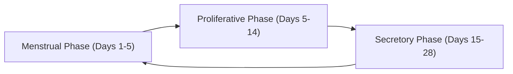

# Heavy Menstrual Bleeding (HMB)

## 1. Definition

Heavy Menstrual Bleeding (HMB) — let's break the name down:
- **"Menstrual"** = relating to *menses* (Latin: month) — the cyclical shedding of the endometrium
- **"Heavy"** = exceeding a clinically significant threshold of blood loss
- **"Bleeding"** = haemorrhage from the uterine cavity

***HMB is defined as excessive menstrual blood loss (MBL) that interferes with a woman's physical, social, emotional, and/or material quality of life.*** [1]

This is the modern **NICE (2018/2024) and FIGO (2011, updated 2018)** definition. It deliberately moves away from the old quantitative cut-off of **> 80 mL per cycle** (which was based on the alkaline haematin method and was impractical in clinical practice). The key philosophical shift is that **the woman herself decides what is "heavy"** — if it impacts her quality of life, it warrants investigation and treatment.

<Callout title="Why 80 mL historically?">
The 80 mL threshold was derived from population studies showing that women losing > 80 mL/cycle were at significantly increased risk of iron deficiency anaemia (IDA). However, many women losing < 80 mL still report significant impact on quality of life, and some losing > 80 mL are asymptomatic. Hence the shift to a subjective, patient-centred definition.
</Callout>

### Terminology Clarification

| Old Term | Modern Preferred Term | Notes |
|---|---|---|
| Menorrhagia | Heavy menstrual bleeding (HMB) | "Menorrhagia" still widely used clinically but FIGO discourages it |
| Metrorrhagia | Intermenstrual bleeding (IMB) | Bleeding between periods |
| Menometrorrhagia | HMB + IMB | Heavy and irregular |
| Polymenorrhoea | Frequent menstrual bleeding | Cycle < 21 days |
| Oligomenorrhoea | Infrequent menstrual bleeding | Cycle > 35 days |
| Dysfunctional uterine bleeding (DUB) | Abnormal uterine bleeding (AUB) — ovulatory dysfunction subtype | "DUB" is outdated; replaced by the PALM-COEIN system |

> ***FIGO now uses the umbrella term "Abnormal Uterine Bleeding" (AUB) and classifies causes using the PALM-COEIN system.*** HMB is one presentation pattern within AUB. [1]

### Normal Menstruation — What Are We Comparing Against?

To understand what is "abnormal," you must know normal:

| Parameter | Normal Range |
|---|---|
| ***Cycle length*** | ***24–38 days*** (FIGO 2018) |
| ***Duration of flow*** | ***≤ 8 days*** |
| ***Volume of blood loss*** | ***5–80 mL per cycle (average ~30–40 mL)*** |
| Regularity | Variation of ≤ 7–9 days cycle-to-cycle |

---

## 2. Epidemiology

### Prevalence
- HMB affects approximately **10–30% of women of reproductive age** worldwide [2]
- In **Hong Kong**, it is one of the most common gynaecological complaints presenting to outpatient clinics
- Prevalence peaks in the **perimenopausal period (40–50 years)** — why? Because anovulatory cycles become more frequent as ovarian reserve declines, leading to unopposed oestrogen stimulation of the endometrium
- Also common at the **extremes of reproductive life**: shortly after menarche (immature HPO axis → anovulation) and approaching menopause

### Impact
- Leading cause of **iron deficiency anaemia** in premenopausal women [3]
- Accounts for a significant proportion of **hysterectomies** — historically up to 60% of hysterectomies were performed for HMB
- Substantial economic burden: lost work days, cost of sanitary products, medical consultations

### Hong Kong–Specific Considerations
- High prevalence of **uterine fibroids** (leiomyomas) in Chinese women — a major structural cause of HMB
- Endometrial cancer screening awareness is increasing but cervical screening uptake is still suboptimal
- ***Adenomyosis*** is increasingly recognised with improved MRI and transvaginal ultrasound availability

---

## 3. Risk Factors

Think of these by category:

### Reproductive / Gynaecological
- **Extremes of reproductive age** (adolescence and perimenopause) — anovulatory cycles
- **Uterine fibroids** — especially ***submucosal fibroids*** (distort the endometrial cavity → increased surface area + impaired haemostatic mechanisms)
- **Adenomyosis** — ectopic endometrial glands within the myometrium → uterine enlargement, impaired contractility
- **Endometrial polyps** — focal overgrowths of endometrial tissue
- **Pelvic inflammatory disease (PID)** — chronic endometritis
- **Intrauterine contraceptive device (IUCD/copper IUD)** — increases menstrual blood loss by 20–50% (mechanism: local inflammatory reaction, increased prostaglandin production → vasodilation and impaired haemostasis)
- **Nulliparity** is sometimes cited, though parity effects are complex

### Systemic / Medical
- **Coagulation disorders**: ***von Willebrand disease (vWD)*** is present in **10–15% of women with HMB** [3], inherited platelet function disorders, haemophilia carrier status
- **Hypothyroidism** — thyroid hormone influences endometrial physiology and coagulation factor levels
- **Liver disease** — impaired clotting factor synthesis and oestrogen metabolism
- **Chronic kidney disease** — uraemic platelet dysfunction
- **Obesity** — peripheral aromatisation of androgens to oestrogen in adipose tissue → relative oestrogen excess → endometrial hyperplasia

### Iatrogenic
- **Anticoagulant therapy** (warfarin, DOACs, heparin)
- **Antiplatelet agents** (aspirin, clopidogrel)
- **Copper IUD** (as above)
- **Tamoxifen** — acts as partial oestrogen agonist on endometrium → polyps, hyperplasia, and rarely carcinoma
- **Hormonal contraceptive issues** — breakthrough bleeding with progestogen-only methods

---

## 4. Anatomy and Physiology of Normal Menstruation

Understanding HMB requires a solid grasp of uterine anatomy and the physiology of menstruation. Let me walk you through this from first principles.

### 4.1 Uterine Anatomy

The uterus is a hollow, thick-walled muscular organ:

- **Endometrium** (inner mucosal layer):
  - **Functionalis** — the superficial 2/3 that is shed during menstruation. It is the hormonally responsive layer.
  - **Basalis** — the deep 1/3 that is NOT shed; it serves as the regenerative reservoir for the functionalis after menstruation.
- **Myometrium** (muscular layer): three layers of smooth muscle — critical for:
  - Uterine contractions during menstruation (helps expel menstrual debris and compress blood vessels)
  - Postpartum haemostasis ("living ligature" concept)
- **Serosa/Perimetrium** (outermost layer)

### 4.2 Uterine Blood Supply

- **Uterine arteries** (branches of internal iliac arteries) → **arcuate arteries** (run circumferentially in the outer myometrium) → **radial arteries** (penetrate inward through the myometrium) → branch into:
  - ***Straight arteries (arteriolae rectae)*** — supply the basalis (do NOT undergo cyclical changes)
  - ***Spiral arteries (arteriolae spirales)*** — supply the functionalis and are THE key players in menstruation

The **spiral arteries** are unique:
- They are exquisitely responsive to ovarian hormones (oestrogen and progesterone)
- During the secretory phase, they become increasingly coiled under the influence of progesterone
- When progesterone is withdrawn (corpus luteum regression), spiral arteries undergo intense **vasoconstriction** → tissue ischaemia → necrosis of the functionalis → shedding = menstruation

### 4.3 The Menstrual Cycle — Endometrial Perspective

#### Proliferative Phase (Oestrogen-driven)
- Rising oestrogen from developing ovarian follicles stimulates endometrial **regeneration and proliferation**
- Endometrium thickens from ~1 mm to ~3–5 mm
- Glands are straight and tubular
- Spiral arteries elongate

#### Secretory Phase (Progesterone-driven)
- Post-ovulation, the corpus luteum produces progesterone
- Progesterone transforms the proliferated endometrium into a **secretory** state (ready for implantation)
- Glands become tortuous and secrete glycogen-rich fluid
- Spiral arteries become maximally coiled
- Stroma becomes oedematous ("decidualisation" in preparation for implantation)

#### Menstrual Phase (Hormone Withdrawal)
- If no implantation → corpus luteum regresses → **progesterone withdrawal**
- This triggers:
  1. ***Spiral artery vasoconstriction*** → ischaemia → tissue necrosis
  2. ***Release of prostaglandins (PGF₂α and PGE₂)*** from the ischaemic endometrium → promote vasoconstriction initially, then vasodilation and myometrial contractions
  3. ***Release of matrix metalloproteinases (MMPs)*** → enzymatic breakdown of extracellular matrix → detachment of functionalis
  4. ***Activation of fibrinolytic system*** — local tissue plasminogen activator (tPA) prevents clot formation within the uterine cavity (this is why menstrual blood normally does not clot; when flow is very heavy, the fibrinolytic capacity is overwhelmed → passage of clots)

#### Haemostatic Mechanisms During Menstruation
Normal menstruation is a finely controlled process of **tissue breakdown + haemostasis**:
- **Vasoconstriction** of spiral arteries (initial haemostasis)
- **Platelet plug formation** at the torn vessel ends
- **Fibrin deposition** — limited, as local fibrinolysis keeps the cavity fluid
- **Endometrial regeneration** from the basalis begins even during menstruation, sealing off exposed vessels
- **Myometrial contraction** compresses intramural blood vessels

<Callout title="Key Concept: Why Does HMB Occur?">
HMB results from disruption of any of these haemostatic mechanisms:
1. **Increased endometrial surface area** (e.g., fibroids, polyps)
2. **Impaired myometrial contraction** (e.g., adenomyosis, fibroids distorting myometrium)
3. **Abnormal endometrial haemostasis** (e.g., increased local fibrinolysis, altered prostaglandin ratios — ↑PGE₂:PGF₂α ratio → more vasodilation)
4. **Abnormal hormone-driven endometrial growth** (e.g., anovulation → unopposed oestrogen → thick, fragile endometrium that sheds irregularly)
5. **Systemic coagulopathy** (e.g., vWD, anticoagulant use)
</Callout>

---

## 5. Aetiology (with Pathophysiology)

### The PALM-COEIN Classification (FIGO 2011, updated 2018)

This is **THE** classification system for causes of AUB in reproductive-age women. It is both an acronym and a mnemonic.

> ***The PALM-COEIN system divides causes into Structural (PALM) and Non-structural (COEIN).*** [1]

| Letter | Category | Structural? |
|---|---|---|
| **P** | **P**olyp | Structural |
| **A** | **A**denomyosis | Structural |
| **L** | **L**eiomyoma (fibroid) | Structural |
| **M** | **M**alignancy & hyperplasia | Structural |
| **C** | **C**oagulopathy | Non-structural |
| **O** | **O**vulatory dysfunction | Non-structural |
| **E** | **E**ndometrial | Non-structural |
| **I** | **I**atrogenic | Non-structural |
| **N** | **N**ot yet classified | Non-structural |

Let's go through each one systematically.

---

### 5.1 P — Polyp (AUB-P)

**Definition**: Localised overgrowths of endometrial glands and stroma, forming a polypoid mass projecting into the uterine cavity.

**Pathophysiology**:
- Polyps are **oestrogen-sensitive** — they arise from monoclonal proliferation of endometrial stromal cells
- They increase the **endometrial surface area** → more tissue to bleed from
- They have **aberrant vasculature** (thick-walled vessels with poor contractile ability) → impaired local haemostasis
- Large polyps may undergo surface **erosion and ulceration** → irregular bleeding/spotting
- Polyps may **interfere with normal endometrial shedding** — acting as a physical "plug" that prevents complete shedding, leading to prolonged/irregular bleeding

**Epidemiology**:
- Found in **10–40%** of women with AUB
- Prevalence increases with age, peaking in the 5th decade
- Risk factors: obesity, tamoxifen use, oestrogen exposure, hypertension

**Clinical pattern**: Often causes ***intermenstrual bleeding (IMB)*** or ***postmenstrual spotting*** rather than classically heavy cyclical bleeding, but can contribute to HMB.

---

### 5.2 A — Adenomyosis (AUB-A)

**Definition**: Presence of **endometrial glands and stroma within the myometrium** (at least 2.5 mm deep from the endomyometrial junction, or > one low-power field).

Breaking down the word: "adeno" = gland, "myo" = muscle, "-osis" = condition → *a condition of glands within muscle*.

**Pathophysiology** — why does adenomyosis cause HMB?
1. **Uterine enlargement** → increased endometrial surface area
2. **Impaired myometrial contractility** — islands of ectopic endometrial tissue within the myometrium disrupt the orderly contraction of smooth muscle fibres → cannot compress intramural blood vessels effectively → prolonged/heavy bleeding
3. **Altered local haemostatic environment** — ectopic endometrial tissue produces increased local prostaglandins, MMPs, and angiogenic factors
4. **Increased vascularity** — angiogenesis around ectopic foci
5. ***Dysmenorrhoea*** is very characteristic — because the ectopic tissue within the myometrium undergoes cyclical swelling under hormonal influence, causing pain

**Epidemiology**:
- Historically diagnosed only on hysterectomy specimens (prevalence 20–35%)
- With improved imaging (MRI, high-resolution TVUSS), increasingly diagnosed non-invasively
- More common in women aged 40–50, multiparous women, and those with prior uterine surgery (C-section, curettage)

---

### 5.3 L — Leiomyoma / Fibroid (AUB-L)

**Definition**: ***Benign monoclonal neoplasms of uterine smooth muscle cells*** (myocytes), surrounded by a pseudocapsule of compressed myometrium.

Breaking down the word: "leio" = smooth, "myo" = muscle, "-oma" = tumour → *tumour of smooth muscle*.

**Epidemiology**:
- ***Most common pelvic tumour in women*** [1]
- Lifetime incidence: up to **70–80%** by age 50 (higher in Black/African women)
- In Hong Kong/Chinese populations: very common, frequently encountered in O&G clinics
- Risk factors: early menarche, nulliparity, obesity, family history, Black ethnicity
- Protective: combined oral contraceptive pill (COCP), smoking (anti-oestrogenic effect)

**Pathophysiology — why do fibroids cause HMB?**

The key is ***location***, not just size:

***FIGO Leiomyoma Sub-classification System*** [1]:

| Type | Location | Description |
|---|---|---|
| 0 | Submucosal - pedunculated intracavitary | Entirely within cavity on a stalk |
| 1 | Submucosal | ≥ 50% intracavitary |
| 2 | Submucosal | < 50% intracavitary (≥ 50% intramural) |
| 3 | Intramural | Contacts endometrium; 100% intramural |
| 4 | Intramural | Does not contact endometrium |
| 5 | Subserosal | ≥ 50% intramural |
| 6 | Subserosal | < 50% intramural |
| 7 | Subserosal - pedunculated | Entirely subserosal on a stalk |
| 8 | Other | Cervical, parasitic, broad ligament |

> ***Submucosal fibroids (Types 0, 1, 2) are the most likely to cause HMB.*** Even a small submucosal fibroid can cause significant HMB, while a large subserosal fibroid may cause no bleeding at all.

**Mechanisms by which fibroids cause HMB:**
1. ***Increased endometrial surface area*** — submucosal fibroids distort and expand the cavity
2. ***Impaired myometrial contractility*** — intramural fibroids interfere with the "living ligature" mechanism
3. ***Venous ectasia*** — fibroids compress venous drainage → congestion of the overlying endometrium → fragile, engorged vessels that bleed easily
4. ***Altered local vasoactive mediators*** — endometrium overlying fibroids has increased VEGF, altered prostaglandin ratios (↑PGE₂, ↓PGF₂α), and increased fibrinolytic activity
5. ***Ulceration*** of overlying endometrium in submucosal fibroids → direct bleeding source

---

### 5.4 M — Malignancy and Hyperplasia (AUB-M)

**Endometrial hyperplasia** and **endometrial carcinoma** must ALWAYS be considered in the differential, especially in:
- ***Women > 40 years with HMB*** [1]
- Perimenopausal/postmenopausal women
- Women with risk factors for unopposed oestrogen exposure: obesity, PCOS, tamoxifen, nulliparity, late menopause, oestrogen-only HRT

**Pathophysiology**:
- Chronic unopposed oestrogen stimulation → endometrial proliferation without progesterone-induced differentiation → **endometrial hyperplasia** (with or without atypia)
- Hyperplasia without atypia: ~1–3% progression to carcinoma over 20 years
- ***Atypical hyperplasia: ~25–30% progression to endometrial carcinoma*** [1]
- Endometrial carcinoma: abnormal neovascularisation, friable tissue → HMB or IMB or postmenopausal bleeding (PMB)

**Classification of endometrial hyperplasia (WHO 2014/2020)**:
- **Hyperplasia without atypia** — low risk of progression
- **Atypical hyperplasia / Endometrioid Intraepithelial Neoplasia (EIN)** — high risk of progression; often coexists with or harbours early carcinoma

**Other malignancies to consider**:
- Cervical carcinoma (typically presents with IMB, postcoital bleeding)
- Uterine sarcoma (rare; leiomyosarcoma)
- Gestational trophoblastic disease

<Callout title="Red Flags for Malignancy in HMB" type="error">
Always exclude malignancy in:
- Age > 40 with new-onset HMB
- Any postmenopausal bleeding
- HMB not responding to medical treatment
- Irregular, non-cyclical bleeding pattern
- Risk factors: obesity, PCOS, tamoxifen, family history (Lynch syndrome)
</Callout>

---

### 5.5 C — Coagulopathy (AUB-C)

**Definition**: Systemic disorders of haemostasis that manifest as HMB.

This is a frequently **underdiagnosed** cause. Studies suggest that **10–20% of women presenting with HMB have an underlying bleeding disorder** [3].

**Key conditions:**

#### Von Willebrand Disease (vWD) — Most Common
- ***Most common hereditary bleeding disorder*** [3]
- Population incidence ~1:100, but clinically significant ~1:20,000
- ***HMB occurs in 60–90% of women with vWD*** [3]
- vWF mediates platelet adhesion (GPIb to subendothelial collagen) and serves as carrier protein for factor VIII
- Deficiency → impaired platelet adhesion + ↓factor VIII → mucocutaneous bleeding pattern
- ***Some studies show 10–15% of women with HMB have underlying vWD*** [3]
- Types: Type 1 (quantitative ↓, AD, most common ~70%), Type 2 (qualitative defects, AD), Type 3 (severe quantitative ↓, AR, rare)

#### Other Coagulopathies
- **Platelet function disorders** (Bernard-Soulier syndrome, Glanzmann thrombasthenia, storage pool disorders) [3]
- **Haemophilia carriers** — female carriers of haemophilia A/B can have factor levels as low as 30–50%, enough to cause HMB
- **Immune thrombocytopenia (ITP)** — autoimmune platelet destruction → ↓platelet count → mucocutaneous bleeding including HMB [3]
- **Liver disease** — ↓synthesis of clotting factors + impaired oestrogen metabolism
- **Chronic kidney disease** — uraemic platelet dysfunction (↑NO → inhibits platelets; anaemia → altered blood rheology → ↓platelet-endothelium contact) [3]

**When to suspect a coagulopathy** (ACOG screening tool):
- HMB since **menarche**
- History of **postpartum haemorrhage**
- Surgery-related bleeding
- **Bleeding associated with dental work**
- ≥ 2 bruising symptoms (> 5 cm, without trauma)
- Frequent **epistaxis** (> 1/month)
- **Family history** of bleeding disorder
- Personal history of easy bleeding from minor cuts

---

### 5.6 O — Ovulatory Dysfunction (AUB-O)

**Definition**: HMB occurring in the context of disordered ovulation (anovulation or oligo-ovulation).

This is the modern replacement for the old term **"dysfunctional uterine bleeding (DUB)"**.

**Pathophysiology** — this is critical to understand:
- In a normal ovulatory cycle, oestrogen drives proliferation and then progesterone from the corpus luteum stabilises and organises the endometrium, producing a **synchronised, orderly shedding**
- In **anovulation**: no corpus luteum → **no progesterone** → **unopposed oestrogen**
- Result:
  1. Endometrium keeps proliferating under oestrogen → becomes **thick, fragile, and disorganised**
  2. Without progesterone-induced organisation, the endometrium has **unstable vasculature** and **inadequate structural support**
  3. Eventually, the endometrium outgrows its blood supply or random areas undergo focal breakdown → **irregular, unpredictable, and often heavy bleeding**
  4. The bleeding is often **prolonged** because there is no coordinated progesterone withdrawal to produce a synchronised shed

**Causes of anovulation** (focus on Hong Kong):
- **PCOS** — most common cause in reproductive-age women; hyperandrogenism + oligo-anovulation + polycystic ovarian morphology
- **Hypothalamic-pituitary dysfunction**: stress, excessive exercise, eating disorders, hyperprolactinaemia
- **Thyroid disorders**: hypothyroidism (→ ↑TRH → ↑prolactin → anovulation; also altered coagulation factor levels), hyperthyroidism
- **Perimenopause**: declining ovarian reserve → irregular folliculogenesis → anovulatory cycles
- **Adolescence**: immature HPO axis → anovulation in first 2–3 years post-menarche

**Clinical pattern**: ***Irregular*** timing and flow — distinguishes it from structural causes which tend to cause ***regular but heavy*** cycles.

---

### 5.7 E — Endometrial (AUB-E)

**Definition**: HMB occurring in the context of a primary disorder of the endometrial haemostatic mechanisms, in the **absence of structural or systemic causes**.

This is essentially a **diagnosis of exclusion** — the endometrium itself has disordered local regulation of haemostasis.

**Pathophysiology**:
- Increased local **fibrinolysis** (↑tissue plasminogen activator, tPA) → clots that form at spiral artery stumps are prematurely dissolved
- Altered **prostaglandin ratio**: ↑PGE₂ (vasodilator) and ↓PGF₂α (vasoconstrictor) → net vasodilation → increased blood loss
- Increased production of **matrix metalloproteinases (MMPs)** → excessive tissue breakdown
- Deficient **endothelin-1** (potent vasoconstrictor) production
- Reduced **endometrial repair mechanisms**

This is why ***tranexamic acid*** (an antifibrinolytic) is so effective for HMB — it counteracts the increased local fibrinolysis.

---

### 5.8 I — Iatrogenic (AUB-I)

**Definition**: HMB caused by medical interventions.

**Key causes:**
- ***Copper IUD*** — increases menstrual blood loss by 20–50% through local inflammatory reaction → ↑prostaglandin production → vasodilation + impaired haemostasis
- **Anticoagulants**: warfarin, DOACs (rivaroxaban, apixaban, dabigatran), heparin
- **Antiplatelet agents**: aspirin, clopidogrel
- **Hormonal breakthrough bleeding**: progestogen-only contraceptives, DMPA (depot medroxyprogesterone acetate), subdermal implants, hormonal IUS during the first 3–6 months
- **Tamoxifen**: partial oestrogen agonist on endometrium → polyps, hyperplasia
- **SSRIs**: may affect platelet function (platelets take up serotonin via SERT; SSRIs block this → impaired platelet aggregation)
- **Corticosteroids**: affect vascular integrity
- **Chemotherapy**: bone marrow suppression → thrombocytopenia

---

### 5.9 N — Not Yet Classified (AUB-N)

Conditions that don't fit neatly into the above categories:
- **Chronic endometritis** (e.g., from PID — particularly *Chlamydia trachomatis*)
- **Arteriovenous malformations (AVMs)** of the uterus
- **Isthmocele** (caesarean section scar defect) — pooling of blood in the niche → post-menstrual spotting
- **Myometrial hypertrophy**
- Rare conditions

---

## 6. Classification

### 6.1 FIGO PALM-COEIN (as above)

### 6.2 By Bleeding Pattern

| Pattern | Description | Common Causes |
|---|---|---|
| ***Heavy cyclical (regular)*** | Heavy but predictable periods | Fibroids, adenomyosis, coagulopathy, endometrial causes |
| ***Heavy irregular*** | Unpredictable heavy bleeding | Ovulatory dysfunction, polyps, malignancy |
| ***Intermenstrual*** | Between periods | Polyps, cervical pathology, hormonal contraception |
| ***Postcoital*** | After intercourse | Cervical ectropion, cervical polyp, cervical carcinoma, cervicitis |
| ***Postmenopausal*** | After 12 months amenorrhoea | **Endometrial carcinoma until proven otherwise** |

### 6.3 By Age Group

| Age Group | Most Common Causes |
|---|---|
| Adolescent (< 20) | Anovulation (immature HPO axis), coagulopathy (esp. vWD), pregnancy complications |
| Reproductive age (20–40) | Fibroids, polyps, adenomyosis, hormonal contraception, pregnancy-related |
| Perimenopausal (40–menopause) | Anovulation, fibroids, polyps, ***endometrial hyperplasia/malignancy*** |
| Postmenopausal | ***Endometrial atrophy, endometrial carcinoma***, polyps, HRT-related |

---

## 7. Clinical Features

### 7.1 Symptoms

#### A. Primary Complaint: Pattern and Volume of Bleeding

| Symptom | Pathophysiological Basis |
|---|---|
| ***Prolonged menstrual bleeding (> 8 days)*** | Delayed endometrial repair; anovulatory cycles produce disorganised endometrium that sheds irregularly |
| ***Passage of clots*** | Normal menstrual blood does not clot due to local fibrinolysis (tPA); when blood loss exceeds fibrinolytic capacity, clots form → indicates heavy flow |
| ***Flooding*** (soaking through protection) | Flow rate exceeds absorption capacity; suggests significant volume loss |
| ***Need to use double protection*** (pad + tampon simultaneously) | Suggestive of HMB; frequently used as a clinical marker |
| ***Menstrual "accidents"*** (staining clothing/bedsheets) | Unpredictable heavy flow overwhelms protection |
| ***Restriction of daily activities due to periods*** | Direct criterion in the modern definition of HMB |

#### B. Symptoms Suggestive of Aetiology

| Symptom | What It Suggests | Pathophysiological Basis |
|---|---|---|
| ***Dysmenorrhoea (painful periods)*** | Adenomyosis, fibroids, endometriosis | Adenomyosis: ectopic endometrial tissue within myometrium swells cyclically → pain; Fibroids: distortion + ischaemia; Prostaglandin excess → myometrial hypercontractility |
| ***Intermenstrual bleeding*** | Polyps, cervical pathology, malignancy | Polyps: surface erosion; Malignancy: friable neovascularisation |
| ***Postcoital bleeding*** | Cervical pathology (ectropion, polyp, carcinoma, cervicitis) | Fragile cervical epithelium/vessels disrupted by trauma |
| ***Pelvic pressure/heaviness*** | Large fibroids, adenomyosis | Mass effect of enlarged uterus on pelvic floor |
| ***Urinary frequency*** | Anterior uterine fibroid | Fibroid compresses bladder anteriorly |
| ***Constipation*** | Posterior fibroid | Fibroid compresses rectum |
| ***Abdominal distension*** | Large fibroids | Physical enlargement of uterus |
| ***Dyspareunia (deep)*** | Adenomyosis, endometriosis, fibroids | Tender, enlarged, or fixed uterus |
| ***Irregular cycle*** | Ovulatory dysfunction (PCOS, perimenopause) | Anovulation → no regular progesterone withdrawal |
| ***Galactorrhoea*** | Hyperprolactinaemia | Prolactin excess → anovulation + stimulates breast secretion |
| ***Hirsutism, acne*** | PCOS | Hyperandrogenism |
| ***Easy bruising, epistaxis, bleeding gums*** | Coagulopathy (vWD, ITP, platelet disorders) | Systemic haemostatic defect → mucocutaneous bleeding pattern |
| ***Weight gain, cold intolerance, constipation*** | Hypothyroidism | Thyroid hormone deficiency affects endometrial physiology and coagulation |
| ***Hot flushes, night sweats*** | Perimenopause | Declining oestrogen → vasomotor instability |

#### C. Symptoms of Consequences

| Symptom | Pathophysiological Basis |
|---|---|
| ***Fatigue, weakness, exercise intolerance*** | Iron deficiency anaemia from chronic blood loss → ↓haemoglobin → ↓oxygen-carrying capacity |
| ***Breathlessness on exertion*** | Compensatory ↑cardiac output in anaemia fails to meet oxygen demands during activity |
| ***Palpitations*** | Hyperdynamic circulation (↑stroke volume, ↑heart rate) to compensate for anaemia |
| ***Pica / pagophagia*** (craving ice) | Iron deficiency — mechanism not fully understood but specific to IDA |
| ***Dizziness, lightheadedness*** | Reduced cerebral oxygenation in severe anaemia |
| ***Reduced quality of life, anxiety, depression*** | Direct impact of heavy bleeding on daily functioning, social embarrassment |
| ***Subfertility*** | Submucosal fibroids distorting cavity, anovulation, endometrial polyps |

### 7.2 Signs

#### A. General Examination

| Sign | Pathophysiological Basis |
|---|---|
| ***Pallor*** (conjunctival, palmar crease, nail bed) | Iron deficiency anaemia → ↓haemoglobin → ↓red colour of blood → pale mucous membranes |
| ***Koilonychia*** (spoon-shaped nails) | Severe iron deficiency → impaired nail matrix keratinisation |
| ***Glossitis*** (smooth, red tongue) | Iron deficiency → atrophy of tongue papillae (rapidly dividing cells sensitive to iron deficiency) |
| ***Angular cheilitis*** (cracks at mouth corners) | Iron deficiency → epithelial thinning and secondary infection |
| ***Tachycardia*** | Compensatory response to anaemia — ↑heart rate to maintain cardiac output |
| ***Flow murmur*** (systolic ejection murmur) | Hyperdynamic, low-viscosity blood flow across normal valves in anaemia |
| ***Peripheral oedema*** (severe cases) | High-output cardiac failure in severe/prolonged anaemia |
| ***Obesity*** | Risk factor for HMB (peripheral aromatisation → oestrogen excess); also associated with PCOS |
| ***Hirsutism, acne*** | Hyperandrogenism → consider PCOS |
| ***Bruising, petechiae, purpura*** | Coagulopathy — platelet-type bleeding pattern |
| ***Thyroid enlargement*** | Thyroid disease contributing to HMB |

#### B. Abdominal Examination

| Sign | Pathophysiological Basis |
|---|---|
| ***Palpable pelvic/abdominal mass arising from pelvis*** | Large fibroid uterus (if > 12-week size, palpable abdominally) |
| ***Mass does not go below pubic symphysis*** ("can't get below it") | Arises from pelvis — classical for uterine or ovarian mass |
| ***Firm, irregular mass*** | Fibroids — multiple, firm, well-defined nodules |
| ***Tender suprapubic area*** | Adenomyosis, endometritis, PID |

#### C. Pelvic Examination (Bimanual and Speculum)

| Sign | Pathophysiological Basis |
|---|---|
| ***Uniformly enlarged, "boggy", globular, tender uterus*** | ***Adenomyosis*** — diffuse infiltration of myometrium with ectopic endometrial tissue → symmetrical uterine enlargement with tenderness |
| ***Irregularly enlarged, firm, non-tender uterus*** | ***Fibroids*** — asymmetric nodular enlargement |
| ***Cervical polyp visible on speculum*** | Endocervical polyp prolapsing through os |
| ***Cervical mass/lesion*** | Cervical carcinoma, cervical ectropion |
| ***Cervical excitation tenderness*** | PID → peritoneal inflammation → pain on cervical motion |
| ***Adnexal mass/tenderness*** | Ovarian pathology, tubo-ovarian abscess (PID) |
| ***Blood in the vaginal fornices*** | Active uterine bleeding |
| ***Uterine enlargement not explained by fibroids*** | Adenomyosis, pregnancy (always exclude!) |

<Callout title="ALWAYS Exclude Pregnancy" type="error">
In ANY woman of reproductive age presenting with abnormal vaginal bleeding, pregnancy MUST be excluded first. This means:
- Urine or serum β-hCG
- Consider ectopic pregnancy, threatened/incomplete miscarriage, gestational trophoblastic disease
Even if the patient says she cannot be pregnant — test anyway.
</Callout>

---

## 8. Assessment Tools

### Pictorial Blood Assessment Chart (PBAC)

A semi-objective tool where women record the number and degree of soaking of pads/tampons and passage of clots:
- ***Score ≥ 100 correlates with MBL > 80 mL*** (sensitivity ~80%, specificity ~80%)
- Useful for clinical trials and monitoring treatment response
- Not routinely used in practice but worth knowing

---

## 9. History-Taking Framework for HMB

A structured approach:

1. **Menstrual history**: age of menarche, cycle regularity, duration of flow, volume (pads/day, clots, flooding, double protection), LMP
2. **Associated symptoms**: dysmenorrhoea, IMB, postcoital bleeding, pelvic pain/pressure, urinary/bowel symptoms
3. **Reproductive history**: parity, pregnancies, desire for future fertility (crucial for management planning)
4. **Contraceptive history**: current and past methods, especially IUD
5. **Smear history**: last cervical screening, any abnormal results
6. **Systemic bleeding history**: easy bruising, epistaxis, bleeding after dental work, family history of bleeding disorders
7. **Medical history**: thyroid disease, liver/renal disease, PCOS, obesity
8. **Drug history**: anticoagulants, antiplatelets, hormonal therapy, SSRIs
9. **Family history**: fibroids, endometrial/ovarian/breast cancer, bleeding disorders
10. **Social history**: impact on quality of life, work, relationships, sexual function
11. **Red flags**: postmenopausal bleeding, intermenstrual bleeding > 40 years, weight loss, suspicious cervical appearance

---

<Callout title="High Yield Summary">

**Definition**: HMB = excessive menstrual blood loss that interferes with physical, social, emotional, and/or material quality of life (NICE/FIGO — patient-centred, subjective definition). Old quantitative threshold was > 80 mL/cycle.

**Normal menstruation**: Cycle 24–38 days, flow ≤ 8 days, volume 5–80 mL. Controlled by spiral artery vasoconstriction, prostaglandin balance, local fibrinolysis, myometrial contraction, and endometrial regeneration.

**PALM-COEIN Classification**: **P**olyp, **A**denomyosis, **L**eiomyoma, **M**alignancy/hyperplasia (structural) | **C**oagulopathy, **O**vulatory dysfunction, **E**ndometrial, **I**atrogenic, **N**ot classified (non-structural).

**Key pathophysiology of HMB**: ↑endometrial surface area (fibroids, polyps), impaired myometrial contraction (adenomyosis, fibroids), altered local haemostasis (↑fibrinolysis, ↑PGE₂, ↓PGF₂α), unopposed oestrogen (anovulation → thick fragile endometrium), systemic coagulopathy (vWD in 10–15% of HMB).

**Submucosal fibroids** (FIGO types 0–2) are the fibroids most likely to cause HMB — location matters more than size.

**vWD** is present in 10–15% of women with HMB — screen if HMB since menarche + mucocutaneous bleeding symptoms.

**Always exclude pregnancy** in reproductive-age women and **malignancy** in women > 40 or with risk factors.

**Adenomyosis**: "boggy", globularly enlarged, tender uterus on examination. **Fibroids**: irregularly enlarged, firm, non-tender uterus.

</Callout>

---

<ActiveRecallQuiz
  title="Active Recall - HMB: Definition, Epidemiology, Aetiology, Pathophysiology, Clinical Features"
  items={[
    {
      question: "Define HMB according to the modern NICE/FIGO definition. Why was the old 80 mL threshold abandoned?",
      markscheme: "HMB = excessive menstrual blood loss interfering with physical, social, emotional, and/or material quality of life. The 80 mL threshold was impractical to measure clinically (alkaline haematin method) and did not correlate well with patient-reported impact — some women with < 80 mL are significantly affected while some with > 80 mL are not."
    },
    {
      question: "List the PALM-COEIN classification for causes of abnormal uterine bleeding. Which are structural and which are non-structural?",
      markscheme: "Structural (PALM): Polyp, Adenomyosis, Leiomyoma, Malignancy/hyperplasia. Non-structural (COEIN): Coagulopathy, Ovulatory dysfunction, Endometrial, Iatrogenic, Not yet classified."
    },
    {
      question: "Explain why submucosal fibroids cause HMB but subserosal fibroids typically do not, using pathophysiological reasoning.",
      markscheme: "Submucosal fibroids (FIGO types 0-2) distort the endometrial cavity, increasing endometrial surface area. They cause venous ectasia in the overlying endometrium, alter local prostaglandin ratios (increased PGE2/decreased PGF2a), increase local fibrinolysis, and disrupt orderly endometrial shedding. They may also impair myometrial contraction. Subserosal fibroids project outward from the uterus and do not affect the cavity or endometrial haemostatic mechanisms."
    },
    {
      question: "What proportion of women with HMB may have an underlying coagulopathy, and which is the most common inherited bleeding disorder? Name two screening questions for coagulopathy.",
      markscheme: "10-20% of women with HMB have an underlying coagulopathy. vWD is the most common inherited bleeding disorder (present in 10-15% of women with HMB). Screening questions: (1) HMB since menarche, (2) history of postpartum haemorrhage, (3) bleeding with dental procedures, (4) easy bruising > 5 cm without trauma, (5) family history of bleeding disorder (any two)."
    },
    {
      question: "Describe the pathophysiology of HMB in anovulatory cycles. Why is the bleeding often prolonged and irregular rather than just heavy?",
      markscheme: "In anovulation, there is no corpus luteum formation, so no progesterone is produced. The endometrium is exposed to unopposed oestrogen, causing continuous proliferation without secretory transformation. The endometrium becomes thick, fragile, and disorganised with unstable vasculature. Without progesterone withdrawal to trigger synchronised shedding, random areas of the endometrium undergo focal necrosis and breakdown at different times, resulting in prolonged, irregular, and unpredictable bleeding."
    },
    {
      question: "On bimanual examination, how would you differentiate between a fibroid uterus and adenomyosis?",
      markscheme: "Fibroids: uterus is irregularly enlarged, firm, non-tender, with palpable discrete nodules. Adenomyosis: uterus is uniformly/symmetrically enlarged (globular), has a boggy consistency, and is characteristically tender — especially during menstruation. Adenomyosis typically does not exceed 12-week size."
    }
  ]}
/>

---

## References

[1] Lecture slides: Adrian Lui Gynecology Notes.pdf; Block C - O&G Theme Case 2.docx.pdf
[2] Senior notes: Maksim Medicine Notes.pdf (p170 — myeloproliferative neoplasms/erythrocytosis, for systemic causes context)
[3] Senior notes: Ryan Ho Haemtology.pdf (p17, p113–114, p117, p122–128, p137–138 — iron deficiency anaemia, bleeding disorders approach, vWD, haemophilia, DIC)
