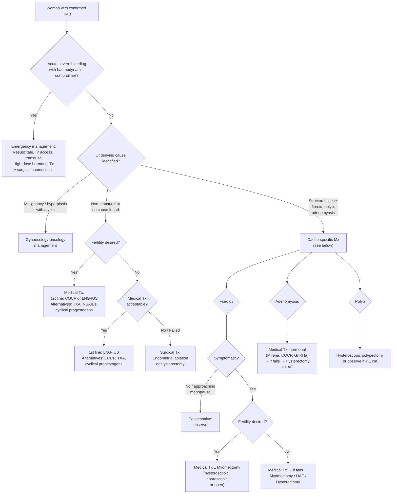

## Management of Heavy Menstrual Bleeding (HMB)

### Guiding Principles

Before diving into specific treatments, let me lay out the core management principles. Think of HMB management as answering four questions in sequence:

1. **Is there an underlying cause that needs specific treatment?** (e.g., polyp → remove it; malignancy → oncological management; coagulopathy → haematological treatment; thyroid disease → correct it)
2. **What does the patient want?** — particularly regarding **fertility preservation** vs completed family
3. **How severe is the HMB?** — is there haemodynamic compromise requiring emergency management, or is this a chronic outpatient problem?
4. **Are there contraindications** to specific treatments (e.g., oestrogen in VTE risk)?

> ***Management of underlying cause as appropriate*** [1]
> ***Polyp can be observed (1/4 chance to spontaneously resolve if < 1 cm)*** [1]

---

### Management Algorithm — Overview

---

### Section A: Medical Treatment of HMB

Medical treatment is the **first-line approach** for most women with HMB, regardless of cause (unless surgery is specifically indicated). I will go through each option with its mechanism, efficacy, dosing, side effects, and contraindications.

---

#### 1. Non-Hormonal Treatments

##### a. Tranexamic Acid (Transamin)

> ***Tranexamic acid: oral Transamin 1g TDS up to 4 days, max 4g daily*** [1]

**Name breakdown**: "trans" = across, "examic" = from tranexamic acid, a synthetic lysine analogue. Think of it as blocking ("trans-locking") the fibrinolytic system.

**Mechanism of Action (from first principles)**:
- During menstruation, the endometrium produces **tissue plasminogen activator (tPA)**, which converts plasminogen → plasmin → dissolves fibrin clots
- In HMB, there is ***↑fibrinolytic, vasodilatory factors (e.g., prostaglandin, tPA)*** [1] → clots at spiral artery stumps are prematurely dissolved → bleeding continues
- Tranexamic acid is a **lysine analogue** that binds to the lysine-binding sites on plasminogen → blocks plasminogen from binding to fibrin → **inhibits fibrinolysis** → clots are preserved → reduced blood loss
- It does NOT cause systemic hypercoagulability at therapeutic doses — it works locally at the site of clot formation

**Efficacy**: reduces menstrual blood loss by **~40–50%**

**Dosing**: ***1g TDS (three times daily) during menstruation only (up to 4 days, max 4g/day)*** [1]

**Advantages**:
- Non-hormonal → no hormonal side effects, does not affect fertility
- Taken only during menses (not continuously)
- Can be combined with hormonal treatments or NSAIDs

**Contraindications**:
- Active thromboembolic disease (DVT, PE, stroke)
- History of convulsions (rare risk of seizure at high doses)
- Subarachnoid haemorrhage (risk of cerebral vasospasm)
- Severe renal impairment (dose adjustment needed — renally excreted)

**Side effects**: GI (nausea, diarrhoea, abdominal pain) — generally well tolerated

<Callout title="Why Tranexamic Acid Works for HMB">
The endometrium in HMB has increased local tPA activity → premature clot lysis at spiral artery stumps → continued bleeding. Tranexamic acid blocks this enhanced fibrinolysis. It is the pharmacological answer to the "AUB-E" pathophysiology. This is why it is effective across multiple causes of HMB, not just endometrial causes — any bleeding benefits from clot stabilisation.
</Callout>

##### b. NSAIDs — Mefenamic Acid (Ponstan)

> ***± Mefenamic acid: oral Ponstan 250–500 mg TDS*** [1]
> ***Note: do NOT appear to ↓blood loss in fibroids but can ↓painful menses*** [1]

**Mechanism of Action**:
- NSAIDs inhibit **cyclooxygenase (COX)** enzymes → ↓prostaglandin synthesis
- In normal endometrium, HMB is associated with ↑PGE₂ (vasodilator) relative to PGF₂α (vasoconstrictor)
- By reducing overall prostaglandin production, NSAIDs:
  - ↓PGE₂ → ↓vasodilation → ↓blood loss
  - ↓PGF₂α too, but net effect is reduced blood loss (~20–30% reduction)
  - Also ↓myometrial contractions mediated by prostaglandins → **↓dysmenorrhoea**

**Dosing**: Mefenamic acid (Ponstan) 250–500 mg TDS during menstruation

**Efficacy**: ~20–30% reduction in MBL — less effective than tranexamic acid or hormonal treatments

**Key limitations**: ***Does NOT appear to reduce blood loss in fibroid-related HMB*** [1] — why? Because fibroid-related HMB is primarily structural (increased surface area, venous ectasia, impaired myometrial contraction) rather than prostaglandin-mediated

**Advantages**:
- Also treats dysmenorrhoea (dual benefit in HMB + pain)
- Non-hormonal
- Can be combined with tranexamic acid

**Contraindications**:
- Active peptic ulcer disease
- Renal impairment
- Aspirin-sensitive asthma
- Pregnancy (especially 3rd trimester — risk of premature closure of ductus arteriosus)
- Known hypersensitivity

---

#### 2. Hormonal Treatments

##### a. Combined Oral Contraceptive Pill (COCP)

> ***Combined OC pills: 1st line treatment unless C/I*** [1]
> ***Combined OC pills (COCP): 1st line unless C/I*** [1]

**Mechanism of Action** (from first principles):
- The COCP contains synthetic **oestrogen (ethinylestradiol)** + **progestogen (e.g., levonorgestrel, desogestrel, drospirenone)**
- ***MoA: provide exogenous ovarian hormones → suppress HPG axis → provide manual control over menstrual cycles*** [1]
- Suppresses endogenous FSH/LH → prevents follicular development and ovulation
- Creates a **thin, stable, decidualised endometrium** → less tissue to shed → lighter withdrawal bleed
- The progestogen component provides progesterone-like effects: stromal decidualisation, ↓endometrial proliferation, ↓local tPA and PGE₂

**Efficacy**: ***a/w 30% reduction in average monthly blood loss*** [1]

**Forms** [1]:
- ***Cyclic (monthly withdrawal bleed)***
- ***Extended (one bleed every 3 months)***
- ***Continuous (no scheduled breaks)***
- ***Unscheduled breakthrough bleeding may be more common in extended/continuous regimen*** [1]

**Advantages** [1]:
- ***Make bleeding more regular, lighter (i.e., cycle + flow control)***
- ***↓Dysmenorrhoea***
- ***Effective contraceptive***
- ***↓Ovarian cyst, benign breast lesions, PID, ovarian/endometrial CA***

**Side effects** [1]:
- ***Minor: N/V, dizziness, breast tenderness, fluid retention, weight gain***
- ***Breakthrough bleeding***
- ***CVS risk: ↑risk of MI, stroke, thromboembolism***
- ***Minimal ↑risk in breast and cervical CA***

**Contraindications** [1]:
- ***Full breastfeeding: oestrogen affects milk production***
- ***Thromboembolic risk: Hx of VTE, major surgery, prolonged immobilisation, first 21 days postpartum***
- Age > 35 and smoking (> 15 cigarettes/day) — ↑risk of arterial events
- History of oestrogen-dependent cancer (breast cancer)
- Uncontrolled hypertension
- Migraine with aura (↑stroke risk)
- Active liver disease
- The **UK MEC (Medical Eligibility Criteria)** categorises these as Category 3 (relative) or 4 (absolute) contraindications

##### b. Levonorgestrel-Releasing Intrauterine System (LNG-IUS / Mirena)

> ***Levonorgestrel-releasing IUCD: alternative to COC pills*** [1]
> ***Mirena IUCD if fibroids < 3 cm with no cavity distortion*** [1]

**Name breakdown**: "Levonorgestrel" = a synthetic progestogen; "Intrauterine System" = device placed inside the uterus

**Mechanism of Action**:
- Releases **levonorgestrel 20 μg/day** locally into the uterine cavity
- Creates a **profoundly decidualised, atrophic endometrium** — very thin, with few glands and minimal vascularity
- ↓Local oestrogen receptor expression → endometrium becomes insensitive to circulating oestrogen
- ↓Local prostaglandin production and fibrinolytic activity
- Does NOT reliably suppress ovulation (only ~50% of cycles are anovulatory) — its action is primarily local

**Efficacy**: reduces MBL by **~90–95%** — the **most effective medical treatment for HMB**. Comparable to endometrial ablation and approaches hysterectomy in satisfaction rates.

**Duration**: licensed for 5 years (8 years for contraception in some formulations, but 5 years for HMB indication)

**Advantages**:
- Highest efficacy of all medical treatments
- Long-acting (set and forget for 5 years)
- Effective contraception simultaneously
- Can be used in women with contraindications to oestrogen
- Reduces dysmenorrhoea
- Reduces risk of endometrial hyperplasia (can be used therapeutically for hyperplasia without atypia)

**Limitations/Side effects**:
- Initial irregular bleeding/spotting for first 3–6 months (counsel patients — this improves)
- Hormonal side effects (less systemic than COCP as action is mainly local): breast tenderness, mood changes, acne
- Functional ovarian cysts (~10%)
- Expulsion risk (~5%)

**Contraindications**:
- ***Fibroids > 3 cm or with cavity distortion*** [1] — the device may not sit properly, higher expulsion risk, and large submucosal fibroids physically prevent insertion
- Active PID or cervicitis (insert after treatment)
- Unexplained uterine bleeding (must exclude malignancy first)
- Cervical or endometrial cancer
- Pregnancy

> ***Mirena if fibroids < 3 cm with no cavity distortion*** [1] — this is a practical and commonly tested point

##### c. Cyclical Oral Progestogens

> ***High-dose progestogen: when C/I to COC pills*** [1]
> ***Cyclical oral progestogens: e.g., Primolut N (norethisterone) 5 mg TDS on day 5–26 of each cycle*** [1]

**Mechanism of Action**:
- Provides exogenous progesterone → opposes endometrial proliferation → creates a decidualised, stable endometrium
- Withdrawal of progestogen at end of each treatment period → orderly, synchronised shedding → lighter, more predictable bleed
- Also suppresses HPG axis at higher doses → anovulation

**Dosing**: ***Norethisterone (Primolut N) 5 mg TDS, days 5–26 of each cycle*** [1]
- Note: short-course luteal-phase-only progestogens (days 15–26) are LESS effective than long-course (days 5–26)

**Efficacy**: ~80–87% reduction in MBL with long-course regimen

**Indications**: When COCP is contraindicated (e.g., VTE risk) or LNG-IUS is not suitable

**Side effects**: bloating, breast tenderness, mood changes, acne, weight gain, irregular bleeding

**Contraindications**: Active liver disease, history of liver tumours, pregnancy, undiagnosed vaginal bleeding

**Important note**: At high doses, norethisterone is partially converted to ethinylestradiol in the liver → retains some oestrogenic (and therefore thrombogenic) activity → not entirely "oestrogen-free" at doses > 5 mg/day

##### d. Injectable/Depot Progestogens

- **Depot medroxyprogesterone acetate (DMPA / Depot Provera)**: 150 mg IM every 12 weeks
- Suppresses HPG axis → anovulation; causes endometrial atrophy
- Effective at reducing HMB but **return of fertility can be delayed** (up to 12–18 months after last injection)
- Side effects: irregular bleeding initially (then amenorrhoea in ~50% by 1 year), weight gain, ↓bone mineral density with prolonged use (reversible)
- Used in adenomyosis management [1]

##### e. GnRH Agonists (and Antagonists)

> ***GnRH agonists or antagonists: usually for pre-operative ↓size before hysteroscopic resection*** [1]

**Name breakdown**: GnRH = gonadotrophin-releasing hormone; "agonist" = initially stimulates, then desensitises

**Mechanism of Action**:
- GnRH agonists (e.g., leuprolide, goserelin, triptorelin) → initially cause a **"flare" effect** (↑FSH/LH) → then **downregulate** GnRH receptors on the anterior pituitary → profound ↓FSH/LH → **medical menopause**
- ↓Oestrogen → endometrial atrophy, ↓fibroid size (by ~30–50%), amenorrhoea
- GnRH antagonists (e.g., elagolix, relugolix, linzagolix) → immediately suppress FSH/LH without flare

> ***MoA: desensitisation → medically induce menopause → ↓size of fibroid, ↓menstrual-related symptoms*** [1]

**Efficacy**: very effective at inducing amenorrhoea and ↓fibroid volume

**Limitations** [1]:
- ***Rapid relapse following discontinuation***
- ***Significant climacteric symptoms with menopause-related side effects (e.g., bone density)***
- ***Therefore NOT for long-term use*** [1] — typically limited to **3–6 months**
- Can be extended with **"add-back" HRT** (low-dose oestrogen + progestogen) to mitigate menopausal symptoms and bone loss

**Side effects** [1]: ***Irregular bleeding, URTI symptoms***, hot flushes, vaginal dryness, ↓bone mineral density, mood changes

**Indications**: primarily ***pre-operative*** — to shrink fibroids before surgery (myomectomy or hysterectomy), improve haemoglobin pre-operatively, or bridge to menopause

##### f. Progesterone Receptor Modulators (SPRMs)

> ***Progesterone receptor modulators: e.g., ulipristal acetate, mifepristone*** [1]
> ***MoA: modulate progestogen receptor in myoma tissues → ↓size of fibroids*** [1]
> ***S/E: risk of endometrial changes (mimic endometrial hyperplasia but ?long-term consequences), liver toxicity (in ulipristal)*** [1]
> ***NOT available for use in HK*** [1]

**Note**: Ulipristal acetate (Esmya) was widely used in Europe but was restricted in 2020 due to rare but serious liver injury. It has been largely withdrawn. ***Not available in HK*** [1].

---

#### 3. Iron Supplementation

Iron replacement is a **critical adjunct** — remember, HMB is the leading cause of IDA in premenopausal women.

> ***Iron supplement: FeSO₄ 300 mg BD × 12 weeks*** [1]
> ***2nd line: ferrum hausmann chewable tablet BD or 3 mL droplet QD × 12 weeks*** [1]
> ***3rd line: IV iron*** [1]

**For fibroid-related HMB**: ***Iron supplementation: FeSO₄ 300 mg TDS PO × 6 months (if Hb < 10 g/dL)*** [1]

**Dosing rationale** [6][8]:
- FeSO₄ 300 mg contains ~65 mg elemental iron per tablet
- ***Expect Hb ↑1 g/dL every 7–10 days*** [6]
- ***Give with vitamin C (promotes reduction of Fe³⁺ → Fe²⁺ → enhances absorption) and without food (2h before, 4h after)*** [6]

**Side effects** [6]: ***N/V, constipation, epigastric discomfort, metallic taste, black stool***
- If intolerant: ***switch to elixir form*** or ***take with meals (note ↓absorption)*** [6]

**IV iron indications** [8]:
- ***Those who tolerate oral iron poorly, with severe ongoing blood loss, or malabsorption***
- Options: ferric carboxymaltose (Ferinject), iron sucrose, ferric gluconate
- ***Advantage: effective, rapid correction, ensure good compliance, no GI side effects*** [8]

**Transfusion**: ***If angina, heart failure, cerebral hypoxia, or Hb < 7 g/dL*** [8]

---

### Section B: Surgical Treatment of HMB

Surgery is indicated when:
- Medical treatment has failed or is contraindicated
- The patient has completed childbearing
- Structural pathology requires surgical intervention
- Malignancy is present

---

#### 1. Hysteroscopic Procedures

##### a. Hysteroscopic Polypectomy
- Removal of endometrial polyps under direct visualisation
- Diagnostic and therapeutic in one procedure
- ***Polyp can be observed (1/4 chance to spontaneously resolve if < 1 cm)*** [1]

##### b. Hysteroscopic Myomectomy (Transcervical Resection of Fibroid, TCRF)

> ***Diagnostic hysteroscopy: to aid planning and assess suitability for definitive hysteroscopic myomectomy (> 50% protrusion into cavity)*** [1]

- Indicated for **submucosal fibroids (FIGO types 0, 1, and selected type 2)** with > 50% intracavitary protrusion
- Resectoscope inserted transcervically → fibroid shaved using electrocautery loop
- Preserves fertility
- Pre-operative GnRH agonist may be used to shrink fibroid and ↓endometrial thickness → easier resection

##### c. Endometrial Ablation/Resection

- **Principle**: destruction of the endometrium (functionalis AND basalis) → ↓or eliminates menstrual bleeding
- Methods: thermal balloon (Thermachoice), radiofrequency (NovaSure), microwave, rollerball, resectoscope
- **Efficacy**: ~80–90% have significant reduction in bleeding; ~30–40% achieve amenorrhoea
- **Indications**:
  - HMB refractory to medical treatment
  - **Completed childbearing** — pregnancy after ablation is dangerous (↑risk of placenta accreta, uterine rupture)
  - Uterine cavity not significantly distorted (normal cavity or small intramural fibroids)
- **Contraindications**:
  - Desire for future fertility
  - Suspected or confirmed endometrial malignancy
  - Active PID
  - Previous classical caesarean section or myomectomy with uterine cavity entry (thinned myometrium → perforation risk)
  - Large cavity (> 12 cm) — reduces efficacy
- **Post-procedure contraception**: required because ablation is NOT a reliable contraceptive

---

#### 2. Myomectomy (Open or Laparoscopic)

> ***Myomectomy: laparoscopic, trans-abdominal, hysteroscopic (± endometrial ablation)*** [1]

**Principle**: surgical removal of fibroids while preserving the uterus — fertility-sparing.

| Approach | Indication | Notes |
|---|---|---|
| ***Hysteroscopic*** | Submucosal fibroids (types 0, 1, 2 with > 50% protrusion) | Transcervical, no abdominal incision |
| ***Laparoscopic*** | Subserosal or intramural fibroids, limited number/size | Minimally invasive, faster recovery |
| ***Open (laparotomy)*** | Large or numerous fibroids, previous multiple surgeries | Best for very large or multiple fibroids |

**Risks**: haemorrhage (fibroids are vascular), adhesion formation, uterine rupture in subsequent pregnancy (risk depends on depth of myometrial entry — typically ~1% if myometrium was not breached through to cavity), recurrence (~15–30% over 5 years)

---

#### 3. Hysterectomy

> ***Hysterectomy: vaginal, abdominal, laparoscopic*** [1]

**The only definitive cure for HMB** — eliminates the source entirely.

***Indications*** [1]:
- ***Acute haemorrhage not responding to other therapies***
- ***Completed childbearing or no fertility wish***
- ***↑Risk for CA cervix, endometrium, ovaries: e.g., CIN, endometrial hyperplasia***
- ***Patient preference***
- Failed medical and conservative surgical treatments

**Routes**:

| Route | When Preferred | Advantages | Limitations |
|---|---|---|---|
| ***Vaginal*** | Mobile uterus ≤ 12 weeks, no significant adhesions, benign pathology | Least invasive, fastest recovery, lowest complication rate, no abdominal incision | Limited exposure for large/complex cases |
| ***Laparoscopic (TLH / LAVH)*** | Moderate uterine size, need for oophorectomy, adhesions, endometriosis | Minimally invasive, good visualisation | Longer operating time, requires skilled surgeon |
| ***Abdominal (TAH)*** | Large uterus (> 12–14 weeks), suspected malignancy, multiple previous surgeries | Best exposure, can handle any size | Larger incision, longer recovery |
| Robotic-assisted | Similar to laparoscopic | Enhanced dexterity | Cost, availability |

**Extent**:
- **Total hysterectomy**: removal of uterine body + cervix (standard)
- **Subtotal/supracervical hysterectomy**: removal of uterine body, cervix preserved — faster procedure, preserves pelvic floor support, but requires continued cervical screening
- ± **Bilateral salpingo-oophorectomy (BSO)**: consider if perimenopausal, family history of ovarian/breast cancer, or BRCA carrier. Otherwise, ovarian conservation is recommended in premenopausal women (sudden surgical menopause → cardiovascular and osteoporosis risk)

**Complications**: haemorrhage, infection, injury to bladder/ureter/bowel, VTE, vaginal vault prolapse (long-term), early menopause (if ovaries removed)

---

#### 4. Uterine Artery Embolisation (UAE)

> ***Uterine artery embolization (UAE)*** [1]
> ***Transcatheter embolisation: embolic agents used to block specific blood vessels*** [9]
> ***Examples: Gelfoam, PVA particles, coil, glue*** [9]
> ***Uterine fibroid embolisation*** [9]

**Principle**: interventional radiology procedure — catheter inserted via femoral artery → selectively catheterise both uterine arteries → inject embolic particles (PVA particles, microspheres) → occlude blood supply to fibroids → **ischaemic necrosis** of fibroids → shrinkage + symptom improvement

**Mechanism (from first principles)**:
- Fibroids derive their blood supply primarily from the uterine arteries
- Normal myometrium has dual supply (uterine + ovarian arteries) and can recruit collaterals
- Fibroids have a **single end-artery supply** without collateral network → selectively vulnerable to embolisation
- Post-embolisation: fibroid undergoes coagulative necrosis → shrinks by 40–60% over 3–6 months

**Efficacy**: ~85–90% symptomatic improvement; ~70% reduction in fibroid volume

**Advantages**: minimally invasive, uterus-preserving, no general anaesthesia needed, short hospital stay

**Complications**:
- **Post-embolisation syndrome** (most common): pain + fever + nausea/malaise lasting 1–2 weeks (inflammatory response to fibroid necrosis)
- Fibroid passage (necrotic fibroid expelled vaginally — especially submucosal types)
- Amenorrhoea/premature ovarian failure (~3% in women > 45; uterine artery embolisation may affect ovarian blood supply via utero-ovarian anastomoses)
- Rarely: uterine infection, uterine necrosis requiring hysterectomy

**Contraindications**:
- Pregnancy or desire for future pregnancy (relative — UAE is associated with ↑miscarriage, preterm labour, abnormal placentation; myomectomy preferred for fertility)
- Suspected malignancy (uterine sarcoma)
- Active pelvic infection
- Severe contrast allergy
- Coagulopathy

**For adenomyosis** [1]:
> ***UAE: reserved for failure or C/I to medical + surgical therapy*** [1]
> ***Effect: ~2/3 had long-term ↓symptom severity, but high rate of additional intervention for persistent or recurrent symptoms*** [1]

---

#### 5. Other Uterus-Conserving Procedures

> ***High-intensity focused ultrasound (HIFU)*** [1]

- Non-invasive: focused ultrasound waves cause thermal ablation of fibroid tissue
- MRI-guided (MRgFUS) or USS-guided
- ***Investigational / limited availability*** [1]
- Advantages: completely non-invasive
- Limitations: limited to certain fibroid types/locations, variable long-term durability

---

### Section C: Cause-Specific Management Summaries

#### Fibroids (AUB-L)

> ***Conservative management: if asymptomatic (esp for those approaching menopause)*** [1]
> ***Medical treatment: considered if heavy menstrual bleeding*** [1]
> - ***Non-hormonal treatment: Transamin ± Ponstan*** [1]
> - ***Hormonal treatment: a/w little efficacy except for some flow control*** [1]
> ***Surgical treatment: if symptomatic, rapid growth, post-menopausal growth, unexplained subfertility with significant submucosal element*** [1]

| Approach | Modality | Notes |
|---|---|---|
| ***Conservative*** | Observation | ***If asymptomatic, especially approaching menopause*** (fibroids shrink post-menopause as oestrogen declines) |
| ***Non-hormonal medical*** | ***Transamin ± Ponstan*** | Note: Ponstan does NOT reduce blood loss in fibroids specifically |
| ***Hormonal medical*** | ***Mirena (if fibroids < 3 cm, no cavity distortion)***; COCP; ***Cyclical Primolut N***; GnRH agonists (pre-op) | ***Hormonal treatment a/w little efficacy except for some flow control*** in fibroids |
| ***Iron*** | ***FeSO₄ 300 mg TDS × 6 months if Hb < 10*** | Correct anaemia |
| ***Pre-op shrinkage*** | ***GnRH agonists*** | 3–6 months pre-op to ↓fibroid size 30–50%, improve Hb |
| ***Surgical*** | Hysteroscopic myomectomy (submucosal); laparoscopic/open myomectomy (intramural/subserosal); hysterectomy | Choice depends on fertility wish, fibroid location/size |
| ***Interventional*** | ***UAE***; ***HIFU*** | Uterus-preserving alternatives |

***Surgical indications for fibroids*** [1]:
> ***Indications: NOT dependent on anatomical factor***
> - ***Symptomatic: but warn patient that urinary frequency may not improve as it may be due to DUI [detrusor underactivity/instability]***
> - ***Rapid growth or post-menopausal growth → worrisome of malignancy***
> - ***Unexplained subfertility with significant submucosal component***

#### Adenomyosis (AUB-A)

> ***Medical treatment: hormonal treatment generally similar to endometriosis (unlike fibroids, where they are generally ineffective)*** [1]

| Approach | Modality | Notes |
|---|---|---|
| Medical | ***Mirena (LNG-IUS)***, ***Depot Provera***, COCP, GnRH agonists, aromatase inhibitors | Hormonal treatments more effective than in fibroids |
| ***Hysterectomy*** | ***Definitive treatment: only way to excise as there is no surgical plane for simple enucleation (even in adenomyoma)*** [1] | Subtotal hysterectomy as cervix and ovaries not affected |
| ***UAE*** | ***Reserved for failure or C/I to medical + surgical therapy*** [1] | ~2/3 benefit long-term but high re-intervention rate |
| Ablative | ***RFA, HIFU (investigational)*** [1] | Limited evidence |

> ***Asymptomatic adenomyosis incidentally found does not require any Tx*** [1]

#### Anovulatory HMB (AUB-O)

> ***Combined OC pills: 1st line treatment unless C/I*** [1]
> ***High-dose progestogen: when C/I to COC pills*** [1]

The principle here is to **provide the progesterone that is missing** → convert the thick, fragile, unopposed-oestrogen-stimulated endometrium into an organised, stable endometrium → produce regular, lighter withdrawal bleeds.

- If PCOS: address insulin resistance (metformin, lifestyle), manage hyperandrogenism, weight loss
- If hypothyroidism: levothyroxine
- If hyperprolactinaemia: cabergoline/bromocriptine

#### Coagulopathy (AUB-C)

Refer to haematology for condition-specific management. Key adjuncts for HMB in coagulopathies:
- **Tranexamic acid** — effective across all coagulopathies as adjunct
- **DDAVP** — for vWD (type 1, 2A, 2M) and mild haemophilia A: ***↑factor VIII and vWF release from storage pools in endothelium and platelets*** [4]
- **vWF concentrates** — for major bleeding or DDAVP-inadequate cases [4]
- **Hormonal treatments** — COCP or LNG-IUS to reduce menstrual blood loss
- **Antifibrinolytic agents**: ***alone or with DDAVP/vWF in mucosal bleeds*** [4]

#### Endometrial Hyperplasia / Malignancy (AUB-M)

- **Hyperplasia without atypia**: high-dose cyclical or continuous progestogens (e.g., medroxyprogesterone acetate 10–20 mg/day for 14 days/cycle, or LNG-IUS) → repeat EA at 3–6 months to confirm regression
- **Atypical hyperplasia/EIN**: strong consideration for **hysterectomy** (25–30% coexist with or progress to carcinoma); fertility-sparing option with high-dose progestogens + close surveillance is possible in young women desiring fertility but carries risk
- **Endometrial carcinoma**: surgical staging (hysterectomy + BSO ± lymph node assessment) → adjuvant therapy as indicated

---

### Section D: Emergency Management of Acute HMB

When a woman presents with **acute, heavy menstrual bleeding with haemodynamic compromise**:

1. **ABCs + Resuscitate**:
   - Large-bore IV access (≥ 16G)
   - Bloods: CBC, clotting, crossmatch, β-hCG
   - IV fluid resuscitation (crystalloid) → blood transfusion if Hb < 7 or symptomatic anaemia
   - Tranexamic acid 1g IV

2. **High-dose hormonal therapy to stop bleeding**:
   - **High-dose oestrogen**: conjugated equine oestrogen (Premarin) 25 mg IV every 4–6 hours (up to 24 hours) — stabilises the endometrium by promoting rapid proliferation and clotting factor synthesis
   - OR **High-dose oral progestogen**: norethisterone 5 mg TDS or medroxyprogesterone 10 mg TDS
   - OR **Monophasic COCP**: one pill every 6–8 hours until bleeding slows, then taper

3. **If bleeding uncontrolled**:
   - Intrauterine balloon tamponade (e.g., Foley catheter with 30 mL balloon)
   - Emergency hysteroscopy + targeted haemostasis
   - UAE for acute haemorrhage
   - ***Hysterectomy: acute haemorrhage not responding to other therapies*** [1]

---

### Summary: Stepwise Management Approach

| Step | What | Details |
|---|---|---|
| 1 | Treat underlying cause | Polyp → polypectomy; thyroid → levothyroxine; coagulopathy → haematology |
| 2 | Iron supplementation | ***FeSO₄ 300 mg BD × 12 weeks*** (or TDS × 6 months if Hb < 10) |
| 3 | 1st line medical | ***COCP (if no C/I)*** or ***LNG-IUS (Mirena)*** |
| 4 | Adjuncts / alternatives | Tranexamic acid ± mefenamic acid; cyclical progestogens if C/I to COCP |
| 5 | 2nd line / failed medical | Endometrial ablation (if family complete); GnRH agonist (bridge) |
| 6 | Surgical | Myomectomy (fibroids); hysterectomy (definitive) |
| 7 | Interventional | UAE, HIFU |

---

<Callout title="High Yield Summary">

**First-line medical treatment for HMB without structural cause**: ***COCP (1st line unless C/I)*** or ***LNG-IUS (Mirena)*** — Mirena is the single most effective medical treatment (~90–95% ↓MBL).

**Non-hormonal options**: ***Tranexamic acid 1g TDS during menses (↓MBL ~40–50%)***; ***mefenamic acid (↓MBL ~20–30% + treats dysmenorrhoea) but does NOT work for fibroid-related HMB***.

**Mirena requirements for fibroids**: ***only if fibroids < 3 cm with no cavity distortion***.

**Hormonal treatments have little efficacy for fibroid-specific HMB** (unlike adenomyosis where they are more effective) — medical treatment mainly provides flow control while definitive surgical management is planned.

**GnRH agonists**: pre-operative shrinkage only (3–6 months max due to menopausal side effects and bone loss). Not for long-term use.

**Surgical indications for fibroids**: symptomatic, rapid/postmenopausal growth, unexplained subfertility with submucosal element — NOT based on size alone.

**Hysterectomy is the only definitive cure** — indicated for completed family, failed medical/conservative Tx, acute uncontrolled haemorrhage, malignancy.

**Adenomyosis: hysterectomy is definitive** — no surgical plane for excision. Hormonal Tx (Mirena, Depot Provera) more effective than for fibroids.

**Iron supplementation**: FeSO₄ 300 mg BD × 12 weeks (1st line); ferrum hausmann (2nd line); IV iron (3rd line). Expect Hb ↑1 g/dL every 7–10 days.

**UAE**: minimally invasive alternative for fibroids (not ideal if fertility desired) and adenomyosis (reserve for failed medical/surgical); ~85–90% symptomatic improvement.

</Callout>

---

<ActiveRecallQuiz
  title="Active Recall - Management of HMB"
  items={[
    {
      question: "A 38-year-old woman with HMB but no structural cause, desires fertility, and has no contraindications to oestrogen. What is the first-line medical treatment and how does it work?",
      markscheme: "First-line: combined oral contraceptive pill (COCP). Mechanism: provides exogenous oestrogen + progestogen, suppresses HPG axis, creates thin stable decidualised endometrium with less tissue to shed. Reduces MBL by approximately 30%. Also provides cycle control, reduces dysmenorrhoea, and is an effective contraceptive. Alternative: LNG-IUS (Mirena) which is more effective (90-95% reduction) but provides contraception rather than facilitating pregnancy."
    },
    {
      question: "Explain the mechanism of action of tranexamic acid in HMB. Why is it effective across multiple aetiologies of HMB?",
      markscheme: "Tranexamic acid is a synthetic lysine analogue that binds to lysine-binding sites on plasminogen, preventing plasminogen from binding to fibrin. This inhibits fibrinolysis — the breakdown of blood clots by plasmin. In HMB, there is increased local tissue plasminogen activator (tPA) production in the endometrium, leading to premature dissolution of clots at spiral artery stumps. By stabilising these clots, tranexamic acid reduces menstrual blood loss by 40-50%. It is effective across multiple aetiologies because regardless of the cause, all menstrual bleeding involves clot formation at damaged vessels, and stabilising these clots reduces blood loss universally."
    },
    {
      question: "Why is mefenamic acid ineffective at reducing blood loss specifically in fibroid-related HMB, even though it works for other causes?",
      markscheme: "Mefenamic acid (Ponstan) works by inhibiting COX enzymes, reducing prostaglandin synthesis. In non-structural HMB, excessive PGE2 (vasodilator) relative to PGF2-alpha (vasoconstrictor) contributes to increased blood loss, and reducing this imbalance helps. However, fibroid-related HMB is primarily structural — caused by increased endometrial surface area, venous ectasia from fibroid compression, impaired myometrial contraction, and altered local haemostatic environment — not primarily prostaglandin-mediated. Therefore, NSAIDs address the wrong mechanism. Mefenamic acid can still be useful for fibroid-associated dysmenorrhoea (pain)."
    },
    {
      question: "A 45-year-old woman has multiple symptomatic fibroids (largest 8 cm intramural). She has completed her family. She is anaemic with Hb 8 g/dL. Outline the management plan including pre-operative optimisation.",
      markscheme: "1. Iron supplementation: FeSO4 300mg TDS (Hb < 10) to correct anaemia pre-operatively. Consider IV iron if intolerant to oral or rapid correction needed. 2. Pre-operative GnRH agonist for 3-6 months: to shrink fibroids by 30-50%, improve Hb, reduce intra-operative blood loss, and potentially allow minimally invasive approach. 3. Definitive surgery: hysterectomy (preferred as family complete) — route depends on uterine size and complexity (vaginal if mobile and not too large, laparoscopic if moderate, abdominal if very large). Consider BSO based on age and risk factors. If fertility were desired: myomectomy (laparoscopic or open depending on size/number). 4. Adjunctive tranexamic acid for symptom control while awaiting surgery."
    },
    {
      question: "Under what conditions can a Mirena IUS be used in a woman with uterine fibroids? What happens if the fibroid is too large or distorts the cavity?",
      markscheme: "Mirena can be used if fibroids are less than 3 cm with no cavity distortion. If fibroids are larger or distort the cavity: (1) the device may not sit properly in the distorted cavity, (2) higher risk of expulsion, (3) may not achieve adequate endometrial contact for local progestogen delivery, and (4) large submucosal fibroids may physically prevent insertion through the cervix. In such cases, alternative medical treatment (COCP, cyclical progestogens) or surgical management should be considered."
    },
    {
      question: "Compare hysterectomy and UAE as treatments for symptomatic fibroids. Give at least two advantages and two disadvantages of each.",
      markscheme: "Hysterectomy: Advantages — definitive cure (100% resolution of fibroid-related symptoms), allows histological examination to exclude sarcoma. Disadvantages — major surgery with general anaesthesia, longer recovery (4-6 weeks), loss of fertility, surgical complications (haemorrhage, infection, injury to bladder/ureter/bowel). UAE: Advantages — minimally invasive (percutaneous), short hospital stay (usually overnight), no general anaesthesia, uterus preserved. Disadvantages — not definitive (fibroid may regrow, 15-30% re-intervention rate at 5 years), post-embolisation syndrome (pain, fever), risk of premature ovarian failure (especially age > 45), not recommended if future fertility desired, cannot obtain histology to exclude sarcoma."
    }
  ]}
/>

---

## References

[1] Lecture slides: Adrian Lui Gynecology Notes.pdf (p13, p15, p20, p51, p91–92)
[4] Senior notes: Ryan Ho Haemtology.pdf (p128–129 — vWD management, DDAVP, vWF concentrates, antifibrinolytics)
[6] Senior notes: Maksim Medicine Notes.pdf (p153 — IDA laboratory findings, iron supplementation)
[8] Senior notes: Ryan Ho Haemtology.pdf (p19 — IDA management, oral iron, IV iron, transfusion indications)
[9] Senior notes: Ryan Ho Diagnostic Radiology.pdf (p85 — transcatheter embolisation, UAE, uterine fibroid embolisation)
