## Complications of Intermenstrual and Irregular Bleeding

Complications can arise from three sources: **(A)** the abnormal bleeding itself, **(B)** the underlying cause of the bleeding, and **(C)** the treatments used to manage the bleeding. We will systematically address all three, explaining the pathophysiology of each complication from first principles.

---

### A. Complications of the Bleeding Itself

#### 1. Iron Deficiency Anaemia

This is the single most common complication of chronic IMB/irregular bleeding.

***Anaemic symptoms: headache, palpitation, SOB, dizziness, fatigue, pica*** [1]

**Why does chronic uterine bleeding cause iron deficiency anaemia?**
- Each mL of blood lost contains ~0.5mg of iron (bound to haemoglobin)
- Normal menstrual blood loss is 30–40mL/cycle (~15–20mg iron/cycle)
- With abnormal bleeding, losses may be 80–200mL+/cycle or continuous intermenstrual losses → iron losses far exceed dietary absorption (~1–2mg/day)
- The body's iron stores (ferritin in hepatocytes and macrophages) are progressively depleted
- Once stores are exhausted → iron supply to the bone marrow falls → inadequate haemoglobin synthesis → microcytic, hypochromic red blood cells → anaemia

**Symptom pathophysiology:**

| Symptom | Mechanism |
|---|---|
| **Fatigue, weakness** | Reduced O₂ delivery to tissues (less Hb to carry O₂); iron is also a cofactor in mitochondrial electron transport chain enzymes → cellular energy production is impaired even before frank anaemia |
| **Palpitations, tachycardia** | Compensatory ↑cardiac output to maintain tissue O₂ delivery despite reduced O₂-carrying capacity |
| **Dyspnoea (SOB)** | ↑respiratory rate/effort to maximise O₂ loading in lungs (compensating for reduced O₂ transport) |
| **Dizziness** | Reduced cerebral O₂ delivery |
| **Headache** | Cerebral vasodilation in response to hypoxia → stretching of pain-sensitive meningeal vessels |
| ***Pica*** [1] | Craving non-food substances (ice/pagophagia, starch, clay). Mechanism poorly understood — possibly related to altered dopamine receptors in CNS (iron is a cofactor for tyrosine hydroxylase, the rate-limiting enzyme in dopamine synthesis) |
| **Pallor** | Reduced haemoglobin → less red colouration of skin/mucous membranes (especially conjunctivae, palmar creases, nail beds) |
| **Koilonychia** | Spoon-shaped nails — iron deficiency impairs nail matrix keratinisation |
| **Angular cheilitis, glossitis** | Iron is required for epithelial cell turnover → deficiency → atrophy of rapidly dividing mucosal cells |

**Severity:** Can range from mild (compensated, asymptomatic with low ferritin) to severe (Hb < 7g/dL, symptomatic, requiring blood transfusion in acute-on-chronic decompensation). Severe anaemia can precipitate **high-output cardiac failure** in elderly patients or those with underlying cardiac disease.

<Callout title="Important Clinical Point">
Iron deficiency anaemia from chronic AUB is insidious — the body compensates remarkably well over time (rightward shift of the O₂-Hb dissociation curve via ↑2,3-DPG, increased cardiac output, expanded plasma volume). A woman may present with an Hb of 5–6 g/dL and appear deceptively well. Always check the Hb in any woman with chronic abnormal bleeding, even if she "looks fine."
</Callout>

#### 2. Haemodynamic Compromise and Hypovolaemic Shock

This occurs in **acute, heavy bleeding** — most commonly from:
- Ruptured ectopic pregnancy (haemoperitoneum)
- Incomplete miscarriage with retained products
- Acute heavy anovulatory bleeding (endometrium shedding massively after prolonged unopposed oestrogen)
- ***Profuse bleeding if fibroid polyp protrudes through cervix*** [5]

**Why shock?** Rapid blood loss exceeding ~15–20% of circulating blood volume (Class II haemorrhage) → inadequate venous return → reduced cardiac output → inadequate tissue perfusion → organ dysfunction. If uncorrected → Class III/IV haemorrhagic shock → multi-organ failure → death.

**Signs:** Tachycardia, hypotension, cold/clammy peripheries, prolonged capillary refill, oliguria, altered consciousness.

**Why is ectopic pregnancy the most dangerous?** Because bleeding is both external (vaginal) and internal (into the peritoneal cavity from the ruptured tube). The internal bleeding may not be immediately apparent. The patient can lose > 1L into the abdomen before haemodynamic compromise becomes clinically obvious.

#### 3. Psychological and Quality-of-Life Impact

Often underappreciated but very real:
- **Anxiety**: Unpredictable bleeding causes constant worry about soiling clothes, embarrassment, ability to participate in social/work activities
- **Sexual dysfunction**: Fear of bleeding during intercourse → avoidance → relationship strain
- **Depression**: Chronic symptoms, fatigue from anaemia, disruption of daily life
- **Work/school absenteeism**: Significant socioeconomic impact
- **Fear of serious disease**: Many women fear cancer when they experience abnormal bleeding — appropriate counselling is therapeutic

---

### B. Complications of Underlying Causes

The complications here depend on which specific condition is causing the IMB/irregular bleeding. We will focus on the most important and exam-relevant ones.

#### 1. Complications of Anovulation / PCOS

***Excess risk of endometrial hyperplasia / carcinoma: due to chronic unopposed oestrogen exposure*** [3]

This is the most feared long-term complication of chronic anovulation.

**Why?** No ovulation → no corpus luteum → no progesterone → endometrium exposed to unopposed oestrogen continuously:
- Oestrogen drives endometrial proliferation (mitosis in glandular epithelium)
- Progesterone normally induces secretory differentiation AND promotes apoptosis of proliferating cells
- Without this braking mechanism → continuous proliferation → hyperplasia → accumulation of genetic mutations → atypical hyperplasia (EIN) → endometrioid adenocarcinoma (Type 1)
- This is the **"hyperplasia–carcinoma sequence"** — a stepwise progression driven by unopposed oestrogen

**Clinical implication:** Any woman with chronic anovulation (PCOS, hypothalamic amenorrhoea, perimenopause) must have **endometrial protection** — either cyclical progestogen or COCs to induce regular withdrawal bleeds and prevent endometrial build-up. Failure to do this exposes her to a preventable cancer.

***PCOS metabolic complications:*** [3]
- ***~10% of PCOS patients have T2DM, 30% have impaired glucose tolerance*** [3]
- Metabolic syndrome: obesity, insulin resistance, NAFLD, dyslipidaemia, hypertension, sleep apnoea
- Cardiovascular disease: long-term increased risk due to metabolic syndrome constellation
- **Why?** The insulin resistance that drives PCOS also drives the metabolic syndrome — these are manifestations of the same pathophysiology

#### 2. Complications of Uterine Fibroids

***Fibroid-related complications:*** [5]

| Complication | Pathophysiological Mechanism |
|---|---|
| ***Anaemic symptoms in prolonged heavy bleeding*** [5] | Chronic blood loss → iron deficiency (see above) |
| ***Pressure symptoms*** [5] | ***Irregularly enlarged uterus (usually > 12-week size):*** ***abdominal distension and pelvic mass; urinary frequency (anterior fibroid); rarely acute urinary retention (classically a 12-week uterus with cervical fibroid or posterior fibroid pushing onto a retroverted uterus → kinking of urethra); hydronephrosis; tenesmus (posterior fibroid)*** [5] |
| ***Venous compression*** [5] | ***Very large uteri may compress vena cava → increased risk of VTE*** [5]. Mechanisms: direct compression of pelvic veins → venous stasis → Virchow's triad (stasis + endothelial injury + hypercoagulability) → DVT/PE |
| ***Pain (uncommon but important)*** [5] | ***Red degeneration: classically occurs in mid-2nd trimester of pregnancy*** [5] — fibroid outgrows its blood supply during rapid pregnancy-related growth → haemorrhagic infarction → acute pain + fever + uterine tenderness. ***Torsion of pedunculated fibroid → acute pain ± fever*** [5]. ***Fibroid polyp ± prolapse: due to uterine contractions attempting to expel the fibroid polyp*** [5] |
| ***Pregnancy-related complications*** [5] | ***Infertility: association is controversial but appears to be increased in those distorting the cavity*** [5]. ***Miscarriage and preterm labour: due to adverse effect of submucosal fibroids on implantation, placentation, and increase in uterine contractility*** [5]. ***Malpresentation and obstructed labour: distortion of birth canal*** [5]. ***PPH: increased risk by decreased force and coordination of uterine contractions → increased risk of atony*** [5]. ***Red degeneration during pregnancy*** [5]. ***Caesarean section may be difficult when located in lower uterine segment*** [5] |
| **Malignant transformation** | Leiomyosarcoma is extremely rare (< 0.1% of fibroids). ***Rapid growth or postmenopausal growth is worrisome of malignancy*** [11] — postmenopausal fibroids should be shrinking (loss of oestrogen stimulus); if they grow, suspect sarcomatous transformation |

#### 3. Complications of PID

***PID: associated with pelvic pain, fever, vaginal discharge*** [1]

| Complication | Mechanism |
|---|---|
| **Tubo-ovarian abscess** | Extension of salpingitis → collection of pus in fallopian tube (pyosalpinx) and ovary → walled-off abscess. Risk of rupture → generalised peritonitis → sepsis |
| **Infertility** | Salpingitis → tubal inflammation → intraluminal adhesions and fibrosis → tubal occlusion. ~10% risk after single episode, ~20% after two, ~40% after three episodes |
| **Ectopic pregnancy** | Tubal damage from previous PID → impaired tubal transport of ovum/embryo → embryo implants in the damaged tube instead of reaching the uterine cavity |
| **Chronic pelvic pain** | Post-inflammatory pelvic adhesions → distortion of normal anatomy → visceral pain |
| **Fitz-Hugh-Curtis syndrome** | Perihepatitis — inflammation tracks to the liver capsule (especially with chlamydial/gonococcal infection) → perihepatic adhesions ("violin string" adhesions) → right upper quadrant pain mimicking biliary/hepatic pathology |

#### 4. Complications of Ectopic Pregnancy

- **Tubal rupture**: The growing gestational sac erodes through the tubal wall → massive intraperitoneal haemorrhage → haemodynamic shock → death if not treated emergently
- **Tubal damage**: Even with treatment (salpingotomy), the affected tube may be permanently damaged → reduced fertility, increased risk of recurrent ectopic
- **Rh sensitisation**: Feto-maternal haemorrhage in ectopic pregnancy can sensitise Rh-negative mothers → future pregnancies at risk of haemolytic disease of the newborn. This is why ***Anti-D immunoglobulin is given to Rh(D)-negative patients*** [14]

#### 5. Complications of Endometrial Hyperplasia / Carcinoma

- **Progression of hyperplasia without atypia**: Low risk (~1–3%) but possible if untreated → atypical hyperplasia → carcinoma
- **Progression of atypical hyperplasia**: High risk (~30–40%) → endometrial carcinoma. Up to 40% of patients with atypical hyperplasia on biopsy already harbour concurrent carcinoma on hysterectomy specimen
- **Endometrial carcinoma**: Local invasion (myometrium, cervix), lymphatic spread (pelvic/para-aortic lymph nodes), distant metastases (lung, liver, bone). Early stage has excellent prognosis (Stage I five-year survival > 90%); advanced stage much worse

#### 6. Complications of Cervical Carcinoma

- Local invasion: parametrium, bladder (→ haematuria, vesicovaginal fistula), rectum (→ rectovaginal fistula)
- Lymphatic spread: pelvic → para-aortic → distant lymph nodes
- Ureteric obstruction: parametrial tumour compresses ureters → hydronephrosis → renal failure (a common mode of death in advanced cervical carcinoma)
- Lower limb lymphoedema: pelvic lymph node involvement → lymphatic obstruction
- VTE: cancer-associated hypercoagulability + pelvic venous compression

#### 7. Complications of Miscarriage

- **Haemorrhage**: Incomplete miscarriage → retained products prevent uterine contraction → ongoing heavy bleeding → haemodynamic compromise
- **Infection (septic miscarriage)**: Retained necrotic products → ascending infection → endometritis → myometritis → septicaemia. ***Evidence of infection always indicates need for surgical management*** [14]
- **Asherman's syndrome**: Overly aggressive curettage (especially in the setting of infection) damages the basalis layer of the endometrium → intrauterine adhesions (synechiae) → amenorrhoea, infertility, recurrent miscarriage
- **Rh sensitisation**: As above — anti-D required for Rh-negative patients
- **Psychological**: Grief, guilt, anxiety, depression, post-traumatic stress — often underappreciated. Adequate counselling and follow-up are essential

#### 8. Complications of Molar Pregnancy

- **Gestational trophoblastic neoplasia (GTN)**: After evacuation, persistent trophoblastic activity (hCG fails to decline or rises) → can progress to invasive mole, choriocarcinoma, or placental site trophoblastic tumour. **Why hCG monitoring is mandatory**: hCG is produced by trophoblast; persistent/rising hCG after evacuation = persistent trophoblastic disease. Complete mole has ~15–20% risk of GTN; partial mole ~1–5%.
- **Thyrotoxicosis**: Very high hCG levels → structural similarity between hCG and TSH → hCG cross-reacts with TSH receptors on thyroid → thyroid hormone hypersecretion → clinical hyperthyroidism (tremor, tachycardia, weight loss)
- **Hyperemesis**: Markedly elevated hCG stimulates the vomiting centre
- **Pre-eclampsia**: Can occur in the first trimester (which is otherwise very rare and should raise suspicion for molar pregnancy) — mechanism involves abnormal trophoblastic invasion

---

### C. Complications of Treatment

#### 1. Complications of Medical Treatment

| Treatment | Complications | Mechanism |
|---|---|---|
| **COC pills** | VTE (DVT/PE) — most important; headache, breast tenderness, nausea, mood changes, breakthrough bleeding, rare: stroke, MI | Oestrogen increases hepatic synthesis of clotting factors (II, VII, VIII, X, fibrinogen), decreases antithrombin III, increases platelet aggregability → prothrombotic state |
| **Progestogens** | Bloating, mood changes, breast tenderness, acne (androgenic progestogens), weight gain, breakthrough bleeding | Progestogenic and androgenic receptor activation → fluid retention, altered lipid profile, sebaceous gland stimulation |
| **GnRH agonists** | ***Significant climacteric symptoms with menopause-related side effects (e.g. bone density loss) → NOT for long-term use*** [11]; hot flushes, vaginal dryness, mood changes, ***irregular bleeding*** [11] | Profound oestrogen suppression → medical menopause → loss of oestrogen's protective effects on bone (↑osteoclast activity, ↓osteoblast activity → net bone resorption), vasomotor centre, urogenital epithelium |
| **Tranexamic acid** | Theoretical VTE risk (rarely reported); GI upset; visual disturbances (rare) | Inhibition of fibrinolysis theoretically promotes clot persistence; however, evidence for clinically significant VTE risk is very limited |
| **Mefenamic acid** | GI ulceration/bleeding, nephrotoxicity, bronchospasm in aspirin-sensitive patients | COX inhibition → ↓prostaglandin synthesis → ↓protective mucus and bicarbonate secretion in gastric mucosa → mucosal erosion; ↓renal prostaglandin → ↓renal blood flow |

#### 2. Complications of LNG-IUS (Mirena)

***LNG-IUS complications:*** [15]

| Complication | Mechanism / Detail |
|---|---|
| ***Infection: increased risk in first 20 days, but very low risk after 3 weeks → minimised by proper pre-insertion screening + aseptic technique*** [15] | Insertion procedure introduces cervical flora into the sterile uterine cavity. Risk is highest immediately post-insertion; after the cervical mucus plug re-forms, risk drops to baseline |
| ***Uterine perforation: peritonitis, intense pain, bleeding*** [15] | The insertion device can penetrate through the myometrium during insertion (risk: ~1 in 1000). If the IUCD migrates into the peritoneal cavity → peritonitis, injury to adjacent organs (bowel, bladder) |
| ***Expulsion, translocation: require regular follow-up*** [15] | IUCD may be partially or completely expelled from the uterine cavity (risk ~5%). More common with nulliparity, heavy menses, or distorted cavity. Translocation = movement of IUCD into abnormal position |
| **Irregular bleeding/spotting** | Common in first 3–6 months as the endometrium atrophies. Usually self-limiting → counselling essential to prevent premature removal |
| **Oligo-/amenorrhoea** | Long-term progestogenic effect → endometrial atrophy → reduced/absent shedding. This is actually a benefit for many patients (reduced blood loss) but can cause anxiety if not counselled |

#### 3. Complications of Surgical Treatment

**Endometrial aspiration (Pipelle):**
- Very safe; minor complications: cramping, vasovagal reaction, light bleeding, very rarely uterine perforation or infection
- **Failed/inadequate sample**: Not a complication per se, but a limitation — may necessitate hysteroscopy

**Hysteroscopy:**
- Uterine perforation (~0.1%) → may require laparoscopy to assess for intra-abdominal injury
- Infection (rare)
- Fluid overload (if excessive distension media absorbed) → hyponatraemia, pulmonary oedema (more relevant with monopolar resectoscope using glycine; less with bipolar using normal saline)
- Bleeding

**Myomectomy:**
- Haemorrhage (can be significant — myomectomy bed bleeds freely)
- Adhesion formation (especially after open myomectomy) → future infertility, bowel obstruction
- Uterine rupture in subsequent pregnancy (if full-thickness myometrial incision — must deliver by elective Caesarean section)
- Recurrence of fibroids (15–30%)

**Hysterectomy:**

***Complications of hysterectomy (relevant to cervical carcinoma context but applicable generally):*** [16]

| Complication | Detail |
|---|---|
| **Haemorrhage** | Intraoperative or post-operative; uterine and vaginal cuff vessels |
| ***Surgical injury to surrounding tissues*** [16] | ***Bladder, ureter, bowel, vessels*** [16]. Ureter is at particular risk where it crosses under the uterine artery ("water under the bridge") |
| ***Bowel complications*** [16] | ***Constipation, ileus, adhesions, intestinal obstruction, fistula*** [16] |
| ***Wound complications*** | ***Infection, pain, bruises, delayed healing, keloid formation*** [16] |
| **Infection** | Wound infection, pelvic abscess, urinary tract infection (especially with prolonged catheterisation) |
| **VTE** | Pelvic surgery → venous stasis + tissue injury → Virchow's triad → DVT/PE. Prophylaxis essential (LMWH, compression stockings, early mobilisation) |
| ***Bladder dysfunction*** [16] | ***After radical hysterectomy: damage to bladder nerves → routine placement of urinary catheter × 10–14 days followed by bladder training*** [16]. This is unique to radical hysterectomy (Wertheim's) where the parametria (containing the pelvic autonomic nerves) are excised |
| **Vaginal cuff dehiscence** | Rare (~0.3%); more common after laparoscopic or vaginal hysterectomy. Can present with pelvic pain, vaginal bleeding, or evisceration |
| **Early menopause** | If bilateral oophorectomy performed (BSO) → immediate surgical menopause → vasomotor symptoms, osteoporosis risk, cardiovascular risk. If ovaries preserved, menopause may still occur 1–3 years earlier than expected (disrupted ovarian blood supply) |
| **Psychosexual impact** | Loss of uterus → grief, altered body image, loss of fertility → depression, relationship strain. Requires sensitive pre-operative counselling |

**Uterine Artery Embolisation (UAE):**
- Post-embolisation syndrome (pain, fever, malaise, nausea — in ~30–50%): inflammatory response to ischaemic necrosis of fibroid tissue
- Infection/abscess of necrotic fibroid (rare but serious)
- Fibroid expulsion (if submucosal — can cause heavy bleeding, infection)
- Premature ovarian insufficiency (non-target embolisation of ovarian arteries → follicular loss; risk increases with age > 40)
- Amenorrhoea (~5%)

---

### Summary of Complications by Category

```mermaid
flowchart TD
    A["Complications of IMB / Irregular Bleeding"] --> B["From the Bleeding Itself"]
    A --> C["From Underlying Causes"]
    A --> D["From Treatments"]

    B --> B1["Iron deficiency anaemia"]
    B --> B2["Haemodynamic compromise / shock"]
    B --> B3["Psychological / QoL impact"]

    C --> C1["Anovulation/PCOS: endometrial hyperplasia → carcinoma, metabolic syndrome"]
    C --> C2["Fibroids: pressure Sx, pregnancy complications, red degeneration"]
    C --> C3["PID: TOA, infertility, ectopic, chronic pelvic pain"]
    C --> C4["Ectopic: tubal rupture → haemorrhagic shock"]
    C --> C5["Miscarriage: haemorrhage, sepsis, Asherman's"]
    C --> C6["Molar: GTN, thyrotoxicosis"]
    C --> C7["Cervical CA: local invasion, ureteric obstruction"]

    D --> D1["COC: VTE"]
    D --> D2["GnRH agonists: bone density loss"]
    D --> D3["LNG-IUS: perforation, expulsion, infection"]
    D --> D4["Hysteroscopy: perforation, fluid overload"]
    D --> D5["Hysterectomy: surgical injury, bladder dysfunction, VTE"]
    D --> D6["UAE: post-embolisation syndrome, POI"]
```

---

<Callout title="High Yield Summary — Complications">

1. **Iron deficiency anaemia** is the most common complication of chronic AUB. Symptoms include ***headache, palpitation, SOB, dizziness, fatigue, pica*** [1]. Can be severe enough to cause high-output cardiac failure.

2. ***Chronic anovulation → excess risk of endometrial hyperplasia / carcinoma due to unopposed oestrogen*** [3]. This is the most important long-term complication of untreated PCOS/anovulatory bleeding — and it is **preventable** with cyclical progestogen.

3. ***Fibroid complications:*** pressure symptoms (urinary, bowel, VTE from vena cava compression), pregnancy-related (miscarriage, preterm labour, malpresentation, PPH), ***red degeneration in pregnancy, torsion of pedunculated fibroid*** [5].

4. ***PID complications:*** tubo-ovarian abscess, infertility (~10% per episode), ectopic pregnancy, chronic pelvic pain, Fitz-Hugh-Curtis syndrome.

5. **Ectopic pregnancy** → tubal rupture → haemorrhagic shock → death. This is why pregnancy test is mandatory in any reproductive-age woman with AUB.

6. **Incomplete miscarriage** → haemorrhage (retained products prevent contraction) and ***sepsis (infection always indicates need for surgical management)*** [14]. Asherman's syndrome from over-zealous curettage.

7. **Treatment complications:** COCs → VTE (oestrogen-mediated prothrombotic state); GnRH agonists → ***bone density loss, NOT for long-term use*** [11]; LNG-IUS → ***perforation, expulsion, infection (highest in first 20 days)*** [15]; hysterectomy → ***ureteric/bladder injury, bladder dysfunction (especially radical hysterectomy), VTE*** [16].
</Callout>

---

<ActiveRecallQuiz
  title="Active Recall - Complications of IMB and Irregular Bleeding"
  items={[
    {
      question: "Explain the pathophysiological mechanism linking chronic anovulation to endometrial carcinoma.",
      markscheme: "Chronic anovulation -> no corpus luteum -> no progesterone -> endometrium exposed to unopposed oestrogen -> continuous proliferation without progesterone-mediated differentiation and apoptosis -> hyperplasia -> accumulation of mutations -> atypical hyperplasia (EIN) -> endometrioid adenocarcinoma (Type 1). This is the hyperplasia-carcinoma sequence.",
    },
    {
      question: "Name four pregnancy-related complications of uterine fibroids and explain the mechanism of one.",
      markscheme: "Miscarriage, preterm labour, malpresentation/obstructed labour, PPH (also: red degeneration, difficult caesarean section, infertility). PPH mechanism: fibroids distort the myometrium -> impaired force and coordination of uterine contractions -> uterine atony -> failure to compress the placental site vessels -> postpartum haemorrhage.",
    },
    {
      question: "What is red degeneration of a fibroid? When does it classically occur and why?",
      markscheme: "Haemorrhagic infarction of a fibroid. Classically occurs in mid-second trimester of pregnancy. Mechanism: rapid fibroid growth stimulated by high oestrogen/progesterone levels during pregnancy -> fibroid outgrows its blood supply -> ischaemic necrosis with haemorrhage into the fibroid. Presents with acute pain, fever, uterine tenderness. Managed conservatively (analgesia, fluids).",
    },
    {
      question: "A woman with PID is treated with antibiotics. She presents 2 years later with infertility. What is the likely mechanism?",
      markscheme: "PID caused salpingitis (fallopian tube infection) -> tubal inflammation -> intraluminal adhesions and fibrosis -> tubal occlusion (blocked tubes). This prevents the ovum from meeting sperm and reaching the uterine cavity. Risk is ~10% after one episode, ~20% after two, ~40% after three.",
    },
    {
      question: "Name two complications specific to radical hysterectomy that are not typically seen with simple hysterectomy.",
      markscheme: "(1) Bladder dysfunction: radical hysterectomy excises the parametria which contain the pelvic autonomic nerves (parasympathetic S2-4) that innervate the detrusor -> bladder denervation -> urinary retention/voiding dysfunction -> requires catheterisation for 10-14 days + bladder training. (2) Ureteric injury: more extensive dissection of the ureters in radical hysterectomy increases risk of thermal/transection injury. Also: lymphoedema from pelvic lymphadenectomy.",
    },
  ]}
/>

## References

[1] Lecture slides: Adrian Lui Gynecology Notes.pdf (p19 — Intermenstrual and Irregular Bleeding)
[3] Lecture slides: Adrian Lui Gynecology Notes.pdf (p41 — PCOS)
[5] Lecture slides: Adrian Lui Gynecology Notes.pdf (p90 — Uterine fibroids clinical features)
[11] Lecture slides: Adrian Lui Gynecology Notes.pdf (p92 — Fibroid medical and surgical treatment)
[14] Lecture slides: Adrian Lui Gynecology Notes.pdf (p172 — Miscarriage management)
[15] Lecture slides: Adrian Lui Gynecology Notes.pdf (p151 — LNG-IUS / IUCD complications)
[16] Lecture slides: Adrian Lui Gynecology Notes.pdf (p123 — Hysterectomy complications)
