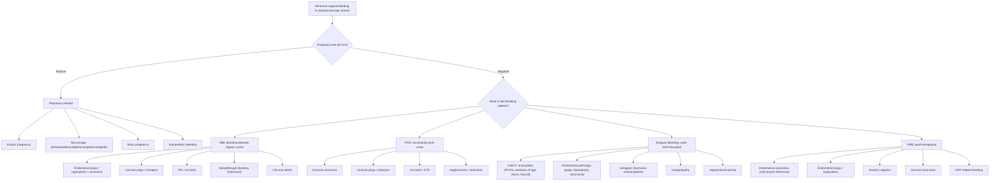

## Differential Diagnosis of Intermenstrual and Irregular Bleeding

The differential diagnosis is best approached by first answering three critical triage questions, then systematically working through structural and non-structural causes. The lecture slides [1][4] provide a clear framework that we will elaborate on.

### Step 0 — Three Triage Questions

Before diving into the differential, you must answer these questions at the bedside:

1. **Is she pregnant?** → Urine β-hCG. This is non-negotiable. A ruptured ectopic pregnancy kills.
2. **Is the bleeding from the genital tract?** → ***Any urinary/bowel symptoms? Only seen upon wiping/when going to toilet?*** [4] — Rule out haematuria (UTI, renal calculus) and rectal bleeding (haemorrhoids, colorectal pathology) misidentified as vaginal bleeding.
3. **What is the pattern of bleeding?** → This is the key discriminator:
   - ***HMB? → fibroids, adenomyosis, coagulopathy, DUB more common*** [4]
   - ***IMB? → surface pathologies, e.g. polyps, hyperplasia, CA, vaginitis, STDs*** [4]
   - ***PCB? → cervical pathologies (or any lower genital tract friable lesion)*** [4]

<Callout title="Approach to Source of Bleeding" type="idea">

***Volume:*** ***heavy bleeding usually from uterus; staining, spotting, light bleeding may be from any genital tract site*** [4].

***Colour:*** ***brown implies old blood from light bleeding/spotting from anywhere from upper vagina to uterus; red can be from any genital tract source*** [4].

***Course:*** ***consistently post-coital → usually cervical pathology; intermenstrual → usually due to surface lesions of genital tract*** [4].
</Callout>

---

### Comprehensive Differential Diagnosis Table

The following table organises differentials by the lecture framework [1][4], expanded with clinical distinguishing features.

#### Structural Causes

| Cause | Key Distinguishing Features | Pathophysiological Basis |
|---|---|---|
| ***Endometrial polyp*** [1] | IMB, often light spotting; may cause HMB if large. Post-reproductive age, tamoxifen use | Pedunculated overgrowth of endometrial glands/stroma with abnormal, fragile thick-walled vessels → bleeds independently of cycle |
| ***Fibroid polyp (submucosal leiomyoma)*** [1] | IMB or HMB; ***irregular bleeding in submucosal fibroids if associated with overlying endometritis, surface of fibroid becomes necrotic or ulcerated*** [5]; ***profuse bleeding if fibroid polyp protrudes through cervix*** [5]; may have pressure symptoms | Increased endometrial surface area over fibroid → increased bleeding; submucosal position distorts overlying vasculature; pedunculated fibroid polyp exposed to trauma |
| ***Endometrial hyperplasia*** [1] | Irregular bleeding, often prolonged/heavy episodes interspersed with amenorrhoea. Risk factors: ***PCOS, tamoxifen, unopposed oestrogen Tx, obesity*** [1] | Unopposed oestrogen → continuous endometrial proliferation → increased gland:stroma ratio → thick, fragile endometrium → irregular shedding |
| ***Endometrial carcinoma*** [1] | Post-menopausal bleeding (PMB) is the classic presentation; in pre-menopausal women → persistent IMB/irregular bleeding unresponsive to medical therapy. Constitutional symptoms late. | Malignant glandular proliferation → neovascularisation with abnormal, friable vessels → bleeds spontaneously; tumour necrosis → bleeding |
| ***PID*** [1] | ***Associated with pelvic pain, fever, vaginal discharge*** [1]. IMB or irregular bleeding; sexually active, young woman | Ascending infection → endometritis → inflamed endometrium with disrupted vasculature and increased prostaglandin/cytokine release → friable surface bleeds irregularly |
| ***Ectopic pregnancy*** [1] | ***Associated with pain, classically occurs 7–8 weeks from LMP*** [1]. Positive β-hCG. Unilateral adnexal tenderness ± mass. Can present with haemodynamic collapse if ruptured. | Trophoblast implanted in tube erodes into tubal vasculature → tubal bleeding (± intraperitoneal). Failing ectopic → declining hCG → corpus luteum regression → progesterone withdrawal → decidualised endometrial shedding → vaginal bleeding |
| ***Miscarriage*** [1] | ***Threatened, inevitable, complete, incomplete*** [1]. Positive β-hCG, uterine-pattern cramping, products may be seen/passed | Placental separation from decidualised endometrium → exposed spiral arteries → bleeding. Incomplete evacuation → uterus cannot contract → ongoing bleeding |
| ***Molar pregnancy*** [1] | Markedly elevated β-hCG (disproportionate to dates), "snowstorm" USS, uterus large for dates, possible hyperemesis, thyrotoxicosis features | Abnormal trophoblastic proliferation → massively elevated hCG → excessive uterine distension; hydropic villi have no functioning fetal vasculature → degeneration → bleeding |
| ***Cervical polyp*** [1] | PCB, IMB spotting; visible on speculum exam — smooth, red, pedunculated mass at os | Endocervical columnar epithelium proliferates → protrudes through os → single-layered fragile epithelium exposed to mechanical trauma |
| ***Cervical ectropion*** [1] | PCB; red, granular area around os on speculum. Common with COC use, pregnancy. | Oestrogen drives SCJ outward → columnar epithelium (single-layered, fragile) exposed on ectocervix → bleeds easily with contact |
| ***Cervical carcinoma*** [1] | ***Classically post-coital*** [1]; may cause IMB, foul-smelling discharge. Irregular, friable mass on speculum. Advanced: pelvic pain, haematuria, leg oedema | Malignant squamous/glandular cells form friable, vascular tumour → contact or spontaneous bleeding. HPV-driven oncogenesis (E6 degrades p53, E7 inactivates Rb) |
| ***Vaginitis and STDs*** [1] | ***Look for associating vaginal symptoms*** [1]: discharge (colour, odour), pruritus, dysuria, dyspareunia. IMB or PCB. | Cervicitis/vaginitis → inflamed mucosa with vasodilation, increased capillary permeability → friable surface bleeds on contact |
| ***Atrophic vaginitis*** [4] | ***Atrophic vaginitis in older women*** [4]. PMB, vaginal dryness, dyspareunia | Post-menopausal oestrogen deficiency → vaginal epithelium thins (loss of glycogen, lactobacilli) → fragile, easily traumatised → contact bleeding |
| ***Vaginal lacerations*** [4] | ***Lacerations in younger, sexually active women*** [4]. Acute onset, history of trauma/intercourse | Physical disruption of vaginal mucosa → torn vessels |
| ***Vulval lesions*** [4] | ***Vulval skin tags, sebaceous cysts, condylomata*** [4]. Localised to vulva, visible on inspection | Surface lesion irritation/trauma → bleeding |

#### Non-Structural Causes

| Cause | Key Distinguishing Features | Pathophysiological Basis |
|---|---|---|
| ***Ovulatory dysfunction (AUB-O)*** [1] | ***Prolonged oligomenorrhoea followed by heavy bleeding or spotting*** [1]. ***Causes: extremes of reproductive age, PCOS, intense exercise, eating disorder, severe stress, hyper- or hypothyroidism*** [1] | No ovulation → no corpus luteum → no progesterone → unopposed oestrogen → unstable proliferative endometrium → random, unpredictable shedding |
| ***Breakthrough bleeding (iatrogenic)*** [1] | ***Unscheduled/breakthrough bleeding in combined or progestogen-type contraceptives*** [1]. Temporal relationship with starting/changing hormonal method or missed pills | Exogenous hormones suppress HPO axis → thin atrophic endometrium → fragile → spotting. Missed pills → transient hormone withdrawal → partial shedding |
| ***Physiological mid-cycle bleeding*** [1] | ***Related to rapid decrease in oestrogen after LH surge with low progesterone level shortly after ovulation*** [1]. Day 14 of cycle, 1–2 days, light spotting. Diagnosis of exclusion. | Transient oestrogen dip between follicular rupture and corpus luteum maturation → brief endometrial instability → minor shedding |
| ***Coagulopathy*** [1] | HMB ± IMB; ***especially if HMB since menarche*** [2]; bleeding from other sites (gums, nose, bruising); family history | Impaired platelet plug formation, fibrin clot formation, or vasoconstriction → defective endometrial haemostasis → prolonged/irregular bleeding |
| ***Thyroid disease*** [4] | ***Thyroid disease*** [4]; weight changes, heat/cold intolerance, tremor/bradycardia. ***Most commonly associated with oligo-amenorrhoea*** [2] but can cause IMB | Hypothyroidism: ↑TRH → ↑prolactin → suppressed GnRH → anovulation. Altered SHBG → oestrogen metabolism changes. Hyperthyroidism: ↑SHBG, altered feedback |
| ***Hyperprolactinaemia*** [4] | ***Hyperprolactinaemia*** [4]; galactorrhoea, oligo-/amenorrhoea, headache/visual field defects if prolactinoma | Prolactin directly inhibits GnRH pulsatility → suppressed FSH/LH → anovulation → irregular/absent bleeding. Can cause breakthrough bleeding before full amenorrhoea |
| ***Copper IUCD*** [2] | HMB > IMB; temporal relationship with IUCD insertion | Foreign body reaction → chronic endometrial inflammation → increased prostaglandin release → vasodilation + increased fibrinolysis → heavier, sometimes irregular bleeding |
| ***C/S scar defect (isthmocele)*** [4] | ***C/S scar defect*** [4]; IMB, especially prolonged brownish spotting after menses; history of prior caesarean section | Niche/defect in lower uterine segment myometrium → menstrual blood pools in the defect during menses → slowly leaks out afterwards → prolonged post-menstrual brownish spotting (old blood) |
| ***Uterine AVM*** [4] | Rare; can present with sudden heavy bleeding, often after uterine surgery/pregnancy | Abnormal arteriovenous connections in myometrium/endometrium → high-flow vascular malformation → bleeding when endometrium sheds or when AVM is disrupted |
| ***Idiopathic (DUB)*** [4] | ***Dysfunctional uterine bleeding: absence of identifiable cause*** [4]. Diagnosis of exclusion | ***Anovulatory DUB: disruption in HPO axis → chronic endometrial lining stimulation by oestrogen, more common at extremes of reproductive age. Ovulatory DUB: hormonal axis is normal but there is haemostatic and vasoconstrictive dysfunction in the endometrial lining.*** [4] |

---

### Differential Diagnosis by Clinical Pattern

This is a practical "pattern recognition" approach — the bleeding pattern steers you toward the right diagnosis.

---

### Age-Based Differential Prioritisation

The priority of differentials shifts with age, because the underlying physiology changes:

| Age Group | Most Likely Causes | Why? |
|---|---|---|
| **Adolescence (< 20)** | ***Anovulatory bleeding (AUB-O)*** [1] — immature HPO axis; coagulopathy (esp. VWD); pregnancy | HPO axis not yet fully mature → inconsistent GnRH pulsatility → anovulation. Coagulopathy often unmasked at menarche |
| **Early reproductive (20–35)** | Pregnancy complications; PID/STDs; cervical ectropion; hormonal contraceptive breakthrough bleeding; PCOS | Sexually active, peak fertility → pregnancy must be excluded. STD exposure. COC/hormonal use common |
| **Late reproductive (35–45)** | Fibroids; endometrial polyps; adenomyosis; anovulatory bleeding (early perimenopause); endometrial hyperplasia | Fibroids most common in 30s–40s. Perimenopausal HPO axis becomes erratic → mixed ovulatory/anovulatory cycles |
| **Perimenopausal (45–55)** | Anovulatory bleeding; endometrial hyperplasia/carcinoma; polyps; fibroids | Declining ovarian reserve → irregular anovulation → unopposed oestrogen → hyperplasia risk rises significantly |
| **Postmenopausal (> 55)** | ***Endometrial carcinoma*** (must exclude first); atrophic vaginitis; endometrial polyp; cervical carcinoma; HRT-related | No endogenous cycles → any bleeding is abnormal. Atrophic endometrium is the most common cause, but carcinoma must be ruled out first |

---

### Key Differential Pairs to Distinguish

These are commonly confused pairs in clinical practice and exams:

#### 1. Endometrial Polyp vs Endometrial Carcinoma

| Feature | Endometrial Polyp | Endometrial Carcinoma |
|---|---|---|
| Bleeding pattern | IMB, often light/spotting | Persistent IMB, PMB, progressive |
| Pain | Usually painless | Late: pelvic pain |
| USS | Focal echogenic lesion, often pedunculated | Thickened, irregular endometrium |
| Definitive Dx | Hysteroscopy + polypectomy + histology | Endometrial biopsy (Pipelle) or hysteroscopy + biopsy |
| Key point | Low malignant potential (~1–3%) but must be sent for histology | Must be excluded in any woman > 40 with AUB or any woman with risk factors |

#### 2. Cervical Ectropion vs Cervical Carcinoma

| Feature | Cervical Ectropion | Cervical Carcinoma |
|---|---|---|
| Appearance | Smooth, uniform, red area around os | Irregular, friable, ulcerated, bleeds on touch |
| Age | Young women, COC users, pregnant | Usually > 30; HPV-related |
| Bleeding | PCB, light | PCB, may be heavier; foul-smelling discharge |
| Action | Benign — reassure (treat if symptomatic) | Urgent colposcopy + biopsy |

#### 3. Anovulatory Bleeding vs Endometrial Pathology

| Feature | Anovulatory Bleeding (AUB-O) | Endometrial Polyp/Hyperplasia |
|---|---|---|
| Pattern | ***Prolonged oligomenorrhoea followed by heavy bleeding or spotting*** [1] | IMB between otherwise regular cycles (polyp); irregular heavy bleeding (hyperplasia) |
| Examination | Often normal pelvis | May have thickened endometrium on USS |
| Age | ***Extremes of reproductive age*** [1] | Any age (polyp); risk increases with age, obesity |
| Response to progestogen | Usually responds well (cyclical progestogen restores order) | Polyp: does not resolve with hormones (needs removal). Hyperplasia: may respond to progestogen but needs biopsy first |

<Callout title="Critical Distinction" type="error">
***Anovulatory bleeding and endometrial pathology can coexist*** — chronic anovulation (e.g. PCOS) causes unopposed oestrogen which can lead to endometrial hyperplasia and carcinoma. Do not assume irregular bleeding in a young woman with PCOS is "just anovulatory" without adequate investigation — ***excess risk of endometrial hyperplasia/carcinoma due to chronic unopposed oestrogen exposure*** [3].
</Callout>

---

### Differentials Specific to PCOS-Like Presentations

When a patient presents with oligomenorrhoea, hyperandrogenism, and polycystic ovarian morphology, you must also consider mimics of PCOS [3]:

| Condition | How to Differentiate |
|---|---|
| ***Non-classic congenital adrenal hyperplasia (NCCAH / late-onset CAH)*** [3] | ***Differentiated by high morning value of 17-hydroxyprogesterone serum level in early follicular phase; exaggerated response to high-dose ACTH stimulation test*** [3]. More common in Mediterranean, Hispanic, Ashkenazi Jewish women |
| ***Androgen-secreting tumour / ovarian hyperthecosis*** [3] | ***Usually associated with severe virilisation (more severe than usual PCOS)*** [3]. Rapid onset. Very high testosterone (often > 150–200 ng/dL). Imaging for adrenal/ovarian mass |
| ***Cushing's syndrome*** | Excluded by normal dexamethasone suppression test. Look for striae, proximal myopathy, moon facies, buffalo hump |
| ***Thyroid disorders*** | TFTs — exclude hypo-/hyperthyroidism |
| ***Hyperprolactinaemia*** | Serum prolactin level. May cause galactorrhoea. If very elevated → MRI pituitary for prolactinoma |

---

### Summary Framework: "The Systematic Sieve"

A useful way to ensure you don't miss anything is to think anatomically from outside in, then add non-structural causes:

| Anatomical Level | Differentials |
|---|---|
| ***Vulva*** [4] | Skin tags, sebaceous cysts, condylomata, carcinoma |
| ***Vagina*** [4] | Atrophic vaginitis, lacerations, vaginitis/ulcers, carcinoma |
| ***Cervix*** [1] | Ectropion, polyp, cervicitis, carcinoma |
| ***Uterus — Endometrium*** [1] | Polyp, hyperplasia, carcinoma, endometritis (PID) |
| ***Uterus — Myometrium*** [4] | Fibroid (submucosal), adenomyosis, AVM, C/S scar defect |
| ***Fallopian tube / Adnexa*** | Ectopic pregnancy, tubo-ovarian abscess |
| ***Ovary*** [4] | Anovulation (PCOS, functional) |
| ***Systemic / Non-structural*** [1][4] | Coagulopathy, thyroid, hyperprolactinaemia, iatrogenic (hormonal), physiological mid-cycle |
| ***Pregnancy-related*** [1] | Ectopic, miscarriage (all types), molar, implantation |

---

<Callout title="High Yield Summary — Differential Diagnosis">

1. **Always exclude pregnancy first** (β-hCG) — ectopic pregnancy is life-threatening.

2. ***Pattern guides the differential:*** ***HMB → fibroids, adenomyosis, coagulopathy, DUB; IMB → surface pathologies (polyps, hyperplasia, CA, vaginitis, STDs); PCB → cervical pathologies*** [4].

3. ***IMB is commonly associated with surface lesions of the genital tract*** [1]; ***irregular bleeding may be due to anovulation, early pregnancy complications, or use of hormonal drugs*** [1].

4. **Age matters:** Anovulatory bleeding dominates at extremes of reproductive life; fibroids/polyps in mid-reproductive years; endometrial carcinoma must be excluded in peri-/postmenopausal women and in younger women with risk factors.

5. ***PCOS mimics*** must be excluded: ***late-onset CAH (17-OHP), androgen-secreting tumour (severe virilisation, very high testosterone), Cushing's, thyroid disorders, hyperprolactinaemia*** [3].

6. ***DUB (dysfunctional uterine bleeding) is a diagnosis of exclusion*** — ***anovulatory DUB (HPO axis disruption, more common at extremes of age) vs ovulatory DUB (normal hormones but endometrial haemostatic/vasoconstrictive dysfunction)*** [4].

7. Think anatomically (vulva → vagina → cervix → endometrium → myometrium → adnexa → systemic) to avoid missing rare but important causes (AVM, C/S scar defect, vulval malignancy).
</Callout>

---

<ActiveRecallQuiz
  title="Active Recall - Differential Diagnosis of IMB and Irregular Bleeding"
  items={[
    {
      question: "Name the three bleeding patterns that guide the differential diagnosis of AUB, and list two key causes for each pattern.",
      markscheme: "HMB: fibroids, coagulopathy (also adenomyosis, DUB). IMB: endometrial polyp, cervical carcinoma (also cervical polyp, hyperplasia, PID). PCB: cervical ectropion, cervical carcinoma (also cervical polyp, cervicitis/STDs).",
    },
    {
      question: "A 22-year-old woman presents with irregular bleeding. Her pregnancy test is negative. What is the most likely diagnosis, and what are two other causes specific to this age group?",
      markscheme: "Most likely: anovulatory bleeding (AUB-O) due to immature HPO axis. Other causes: coagulopathy (esp. von Willebrand disease if HMB since menarche), breakthrough bleeding from hormonal contraceptives, STD/cervicitis.",
    },
    {
      question: "Explain the difference between anovulatory DUB and ovulatory DUB in terms of pathophysiology.",
      markscheme: "Anovulatory DUB: disruption in HPO axis -> no ovulation -> no progesterone -> chronic unopposed oestrogen stimulation -> unstable endometrium -> irregular shedding. More common at extremes of reproductive age. Ovulatory DUB: HPO axis normal, ovulation occurs, but there is local endometrial haemostatic and vasoconstrictive dysfunction -> heavy or prolonged bleeding despite normal hormonal cycling.",
    },
    {
      question: "A woman with PCOS-like features has rapidly progressive virilisation and a total testosterone of 200 ng/dL. What is the most important differential to exclude, and how would you differentiate it from PCOS?",
      markscheme: "Androgen-secreting tumour (ovarian or adrenal). Differentiated from PCOS by: (1) severe/rapid virilisation (voice deepening, clitoromegaly, male-pattern baldness - more severe than typical PCOS); (2) very high testosterone (PCOS seldom exceeds 150 ng/dL); (3) imaging (CT adrenals, USS/MRI ovaries) to identify tumour mass.",
    },
    {
      question: "What is a caesarean section scar defect (isthmocele), and what is the characteristic bleeding pattern it causes?",
      markscheme: "A niche or defect in the myometrium at the site of a previous C-section scar in the lower uterine segment. Characteristic pattern: prolonged brownish post-menstrual spotting (old blood that pooled in the defect during menses slowly leaks out afterwards). History of prior caesarean section is key.",
    },
  ]}
/>

## References

[1] Lecture slides: Adrian Lui Gynecology Notes.pdf (p19 — Intermenstrual and Irregular Bleeding)
[2] Lecture slides: Adrian Lui Gynecology Notes.pdf (p13 — Heavy Menstrual Bleeding)
[3] Lecture slides: Adrian Lui Gynecology Notes.pdf (p41 — PCOS investigations and differentials)
[4] Lecture slides: Adrian Lui Gynecology Notes.pdf (p11 — Differential diagnoses and approach to AUB)
[5] Lecture slides: Adrian Lui Gynecology Notes.pdf (p90 — Uterine fibroids clinical features)
