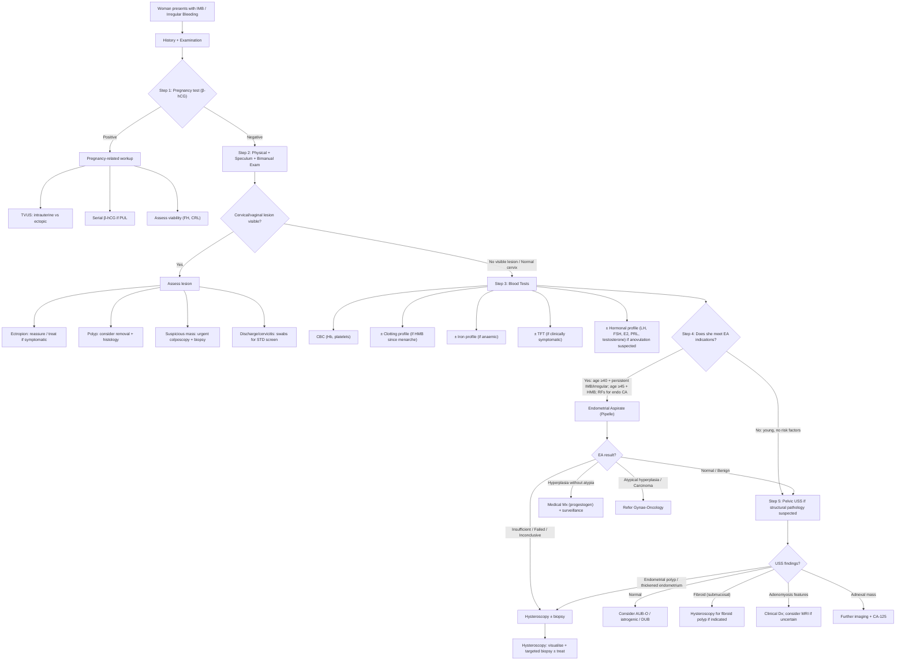

## Diagnostic Criteria, Algorithm, and Investigation Modalities

### Preliminary Concept: Why There Are No "Diagnostic Criteria" for IMB/Irregular Bleeding Per Se

Unlike conditions such as PCOS (Rotterdam criteria) or PID (CDC criteria), **intermenstrual and irregular bleeding is a symptom, not a diagnosis**. There are no formal "diagnostic criteria" for the symptom itself. Instead, the diagnostic process aims to **identify the underlying cause** of the bleeding. What we do have are:

1. **Indications/thresholds for investigation** — who needs endometrial sampling, imaging, etc.
2. **Diagnostic criteria for specific underlying conditions** (e.g. Rotterdam for PCOS, histological criteria for hyperplasia/carcinoma)
3. **A structured diagnostic algorithm** — a stepwise approach to reach the diagnosis

Let's work through all three systematically.

---

### 1. Indications and Thresholds for Investigation

These are the critical "trigger points" from the lecture slides that tell you when to move beyond history and examination to formal investigation. Understanding the **why** behind each threshold is essential.

#### 1.1 Endometrial Aspirate / Sampling (EA)

***Endometrial aspirate (EA): a simple outpatient procedure*** [6]

***Indications — mainly when suspicious for endometrial pathologies:*** [6]

| Indication | Threshold | Why This Threshold? |
|---|---|---|
| ***Presence of risk factors for endometrial pathology*** [6][7] | ***e.g. obesity, PCOS, on tamoxifen, failed treatment*** [6][7] | These patients have chronic unopposed oestrogen → increased risk of hyperplasia/carcinoma regardless of age |
| ***Age ≥ 40 with persistent IMB or irregular bleeding*** [6][7] | Age ≥ 40 | Endometrial carcinoma incidence rises after 40. At this age, the pre-test probability of endometrial pathology is high enough to justify sampling |
| ***Age ≥ 45 with regular heavy period*** [6][7] | Age ≥ 45 | Even in HMB with regular cycles (where fibroids/DUB are more likely), the risk of underlying endometrial pathology is significant enough by age 45 to warrant sampling |
| ***Any AUB if age ≥ 45*** [8] | Age ≥ 45 | Broader threshold — any pattern of abnormal bleeding at this age should prompt endometrial assessment |
| ***Abnormal Pap smear showing AGC-endometrial*** [8] | Any age | Atypical glandular cells of endometrial origin on cytology raise concern for endometrial pathology → direct endometrial sampling needed |
| ***Monitoring previous endometrial pathology or surveillance in high-risk (e.g. Lynch syndrome/HNPCC)*** [8] | As per protocol | These patients have ongoing elevated risk and require periodic endometrial surveillance |

***Process: to be done during speculum exam → insertion of endometrial suction curette (e.g. Pipelle) to aspirate endometrial tissue → send for histopathology*** [6]

<Callout title="Must Know" type="error">
***Pregnancy test must be done (or document no unprotected sex) before EA*** [6]. Performing endometrial aspiration on a pregnant uterus can disrupt a viable pregnancy or miss an ectopic.
</Callout>

**Why is EA so useful?** It is a blind sampling technique — quick, cheap, can be done in clinic without anaesthesia. The Pipelle device has a sensitivity of ~90–99% for endometrial carcinoma (high detection rate for diffuse disease) but is less reliable for focal lesions like polyps (may miss them because it samples randomly). This is why hysteroscopy is superior for focal pathology.

#### 1.2 Hysteroscopy ± Endometrial Biopsy

***Hysteroscopy ± endometrial biopsy: diagnostic and therapeutic*** [6]

***Indication: superior to EA but limited availability*** [6]

| Indication | Why? |
|---|---|
| ***Suspected endometrial polyp or submucosal fibroids*** [6][7] | EA (blind sampling) often misses focal lesions. Hysteroscopy allows direct visualisation → targeted biopsy → and can simultaneously remove polyps/fibroids ("see and treat") |
| ***Irregular bleeding while on hormonal therapy for > 3 months*** [6][7] | Breakthrough bleeding on hormonal Tx usually settles within 3 months. If it persists, structural pathology must be excluded — hysteroscopy is the gold standard |
| ***Endometrial aspirate failed or inconclusive*** [6][7] | Insufficient tissue, inadequate sample, or uncertain histology → need direct visualisation and targeted biopsy |
| ***PMB on tamoxifen*** [9] | Tamoxifen causes a pseudo-thickened endometrium on USS (subendometrial cystic changes give a falsely thick measurement) → USS is unreliable in this setting → hysteroscopy is preferred for direct assessment |
| ***PMB with endometrial thickness > 4mm*** [9] | Thickened endometrium in a postmenopausal woman raises concern for hyperplasia/carcinoma → hysteroscopy allows visualisation + biopsy |

***Setting: under GA or LA (outpatient procedure)*** [6]
***Process: insertion of a 3mm endoscope through cervix into uterus → ± targeted biopsy at suspicious endometrial sites → ± removal of lesion, e.g. polyp*** [6]

#### 1.3 Pelvic Ultrasound

***Pelvic US when suspect structural pathology*** [6][7]

***Indications:*** [6][7]

| Indication | Why? |
|---|---|
| ***Suspicious of fibroids: uterus palpable abdominally, Hx/PE suggestive of pelvic mass, examination inconclusive or difficult*** [6][7] | Fibroids are best characterised by USS — number, size, location (submucosal vs intramural vs subserosal), which guides management |
| ***Suspicious of adenomyosis: TVUS for significant dysmenorrhoea, bulky tender uterus on PE*** [7] | TVUS can show characteristic features of adenomyosis (heterogeneous myometrium, myometrial cysts, asymmetric wall thickening) |
| ***PMB: TVUS to measure endometrial thickness*** [9] | ***Should be ≤ 4mm in postmenopausal women (NPV 99.4–100%)*** [9] — a normal TVUS is very reassuring. If > 4mm → further investigation (hysteroscopy/biopsy) |
| ***Suspected ectopic pregnancy*** | USS (usually TVUS) to look for intrauterine gestational sac; if absent with positive β-hCG → pregnancy of unknown location (PUL) → ectopic until proven otherwise |

---

### 2. Diagnostic Algorithm

The following algorithm integrates the lecture material [1][6][7][8][9] into a stepwise approach:

<Callout title="The Key Principle">
The algorithm follows a **"exclude the dangerous, then characterise the cause"** logic:
1. **Exclude pregnancy** (ectopic can kill)
2. **Examine the cervix** (don't miss cervical carcinoma — it's visible)
3. **Assess for anaemia and systemic causes** (bloods)
4. **Sample the endometrium if indicated** (exclude endometrial carcinoma/hyperplasia)
5. **Image if structural pathology suspected** (characterise fibroids/polyps/adenomyosis)
6. **Hysteroscopy if focal lesion suspected or EA inadequate** (gold standard for endometrial cavity assessment)
</Callout>

---

### 3. Investigation Modalities — Detailed Breakdown

#### 3.1 Bedside Investigations

| Investigation | What You're Looking For | Key Findings/Interpretation |
|---|---|---|
| **Urine pregnancy test (β-hCG)** | Pregnancy (any type) | Positive → pregnancy-related cause. Must be done before EA. Negative → proceed with non-pregnancy workup |
| **Speculum examination** | Cervical/vaginal pathology | ***Note any current uterine bleeding from cervical os*** [6]; ***note any lower genital tract abnormalities: e.g. mass, laceration, discharge*** [6]; ***note any cervical pathology*** [6]; cervical ectropion (smooth red area), polyp (pedunculated), suspicious mass (friable, irregular), discharge |
| ***Cervical smear*** [6] | Cervical dysplasia/malignancy | ***Perform if (1) due for screening (2) looks suspicious but no obvious lesion*** [6]. Liquid-based cytology ± HPV co-testing. Report: NILM, ASC-US, LSIL, HSIL, AGC, squamous cell carcinoma |
| **Bimanual examination** | Uterine size/contour, adnexal masses | ***Adenomyosis: symmetrical enlargement of uterus; uterine fibroid: asymmetrical enlargement of uterus*** [6][7]; ***note any adnexal mass*** [6][7] |

#### 3.2 Blood Tests

***Blood tests*** [6][7]:

| Test | Indication | Key Findings/Interpretation |
|---|---|---|
| ***CBC: Hb, platelets*** [6][7] | All patients with AUB | Low Hb → iron deficiency anaemia from chronic blood loss. Low MCV → microcytic (iron deficiency). Thrombocytopenia → consider coagulopathy/ITP. High platelets → reactive thrombocytosis from chronic bleeding |
| ***Pregnancy test*** [6][7] | All reproductive-age women with AUB | See above — non-negotiable |
| ***± Clotting profile*** [6][7] | ***If HMB since menarche, or FHx positive*** [6][7] | Prolonged PT/APTT → coagulation factor deficiency. Low VWF antigen/activity → von Willebrand disease (most common inherited bleeding disorder). Order VWF panel specifically if suspicious |
| ***± Iron profile*** [6][7] | ***For iron deficiency anaemia*** [6][7] | Low ferritin (most specific early marker), low serum iron, high TIBC, low transferrin saturation → iron deficiency. Ferritin < 30 μg/L is diagnostic in context of AUB |
| ***± TFT*** [6][7] | ***Only when clinically symptomatic (uncommon)*** [6][7] | Elevated TSH + low fT4 → hypothyroidism → anovulation. Suppressed TSH + high fT4 → hyperthyroidism. Note: ***thyroid disease most commonly associated with oligo-amenorrhoea*** [2] rather than IMB |
| ***± Hormonal profile: LH, FSH, E2*** [7] | ***Further workup on anovulation*** [7]; suspected PCOS, premature ovarian insufficiency, hypothalamic amenorrhoea | Normal or slightly elevated LH, normal FSH, normal E2 → normogonadotrophic anovulation (PCOS pattern). ***Increased LH:FSH ratio*** [3] (≥ 2–3:1 suggestive but ***not diagnostic*** [3]). Low FSH/LH/E2 → hypogonadotrophic hypogonadism (hypothalamic cause). High FSH, low E2 → hypergonadotrophic hypogonadism (ovarian failure) |
| ***± Prolactin*** [7] | ***Endocrine profile*** [7]; galactorrhoea, oligo-/amenorrhoea | Elevated prolactin → hyperprolactinaemia (drug-induced, prolactinoma, hypothyroidism). If very elevated (> 200 μg/L → macro-prolactinoma likely → MRI pituitary) |
| ***± Testosterone*** [7] | ***PCOS*** [7]; hirsutism, acne, virilisation | ***Mildly elevated total testosterone (PCOS seldom exceeds 150 ng/dL)*** [3]. If markedly elevated (> 150–200 ng/dL) → ***consider androgen-secreting tumour*** [3]. Also check DHEAS (adrenal source), 17-OH-progesterone (late-onset CAH) |
| ***± 17-OH-progesterone*** | Suspected late-onset CAH (NCCAH) | ***High morning value in early follicular phase*** [3] → suggestive. Confirm with ***high-dose ACTH stimulation test*** [3] |
| ***± OGTT*** | ***PCOS*** [7]; metabolic risk assessment | ***~10% of PCOS patients have T2DM, 30% have impaired glucose tolerance*** [3]. 75g OGTT recommended for all PCOS patients (fasting glucose alone misses ~50% of IGT) |

<Callout title="When to Order What — A Practical Guide">
- **Every patient**: CBC, pregnancy test
- **Suspected anaemia**: Iron profile
- **HMB since menarche / bleeding tendency**: Clotting profile, VWF panel
- **Suspected anovulation / PCOS**: LH, FSH, E2, prolactin, testosterone, TFT, OGTT
- **Virilisation / severe hyperandrogenism**: Testosterone, DHEAS, 17-OHP, dexamethasone suppression test, adrenal/ovarian imaging
- **Thyroid symptoms**: TFT
- **Galactorrhoea**: Prolactin → if elevated, MRI pituitary
</Callout>

#### 3.3 Endometrial Aspirate / Sampling (Pipelle Biopsy)

***Endometrial aspirate/sampling (EA): a simple outpatient procedure*** [6]

**How it works:**
- A thin, flexible plastic catheter (Pipelle de Cornier) is inserted through the cervical os into the uterine cavity
- The inner plunger is withdrawn, creating negative suction pressure → aspirates a strip of endometrial tissue
- The tissue is placed in formalin → sent to histopathology
- Takes ~1–2 minutes; usually performed without anaesthesia (some cramping is expected)
- ***Can be completed in 5 minutes without anaesthesia*** [8]

**What it tells you:**

| Histology Result | Interpretation | Next Step |
|---|---|---|
| Proliferative endometrium | Normal follicular phase pattern; if seen in the luteal phase (Day 21) → anovulation (no progesterone effect) | If anovulation confirmed → treat with cyclical progestogen |
| Secretory endometrium | Normal luteal phase pattern → confirms ovulation | Reassuring — ovulatory cycle. Consider other causes |
| Hyperplasia without atypia | Increased gland:stroma ratio, no cytological atypia. Low malignant potential (~1–3%) | Medical management with progestogen (oral or LNG-IUS). Re-sample in 3–6 months |
| Atypical hyperplasia (EIN) | Cytological atypia present. High malignant potential (~30–40% → carcinoma) | Hysterectomy recommended if family complete. If fertility desired → high-dose progestogen + close surveillance |
| Endometrial carcinoma | Malignant glandular cells | Refer Gynae-Oncology. Staging investigations |
| Insufficient/inadequate tissue | Not enough tissue obtained for diagnosis | ***EA failed or inconclusive → hysteroscopy ± biopsy*** [6][7] |
| Normal in postmenopausal women | Atrophic/inactive endometrium | Reassuring — if PMB, most likely atrophic vaginitis |

**Limitations:**
- **Blind technique** → can miss focal lesions (polyps, small submucosal fibroids)
- Sensitivity for endometrial carcinoma: ~90–99% (very good for diffuse disease)
- Sensitivity for polyps: only ~10–30% (poor — polyps are focal and the catheter may miss them)
- Cannot be done if cervical stenosis (common in postmenopausal women)
- Should not be done if pregnant (pregnancy test first!)

#### 3.4 Hysteroscopy ± Endometrial Biopsy

**The gold standard for endometrial cavity assessment.**

**How it works:**
- A thin rigid or flexible endoscope (typically 3–5mm diameter) is inserted through the cervix into the uterine cavity
- The cavity is distended with saline or CO₂ to allow visualisation
- Direct visualisation of the entire endometrial surface → can identify polyps, submucosal fibroids, hyperplasia, carcinoma, adhesions, septa
- **Targeted biopsy** can be taken from suspicious areas (unlike EA which is blind)
- **Therapeutic**: polyps can be removed, submucosal fibroids resected, adhesions lysed — "see and treat" approach

**Advantages over EA:**
- Directly visualises focal lesions (polyps, fibroids) that EA may miss
- Allows targeted biopsy → higher diagnostic accuracy for focal pathology
- Can treat at the same time (polypectomy, myomectomy)

**Disadvantages:**
- More invasive, requires trained operator
- Limited availability (not available in every clinic)
- May require GA (though outpatient/office hysteroscopy under LA is increasingly common)
- Risk (rare): uterine perforation (~0.1%), infection, fluid overload (if excessive distension media)

#### 3.5 Pelvic Ultrasound

***Pelvic US when suspect structural pathology*** [6][7]

Two approaches:
- **Transabdominal US (TAUS)**: requires full bladder as acoustic window. Good for large fibroids, general pelvic survey. Less resolution for endometrium.
- **Transvaginal US (TVUS)**: probe placed in vagina → closer to uterus → higher resolution. **Preferred** for endometrial assessment, adenomyosis, early pregnancy, adnexal masses.

**Key USS Findings and Their Interpretation:**

| Finding | Interpretation | Clinical Significance |
|---|---|---|
| **Endometrial thickness** | ***Should be ≤ 4mm in postmenopausal women (NPV 99.4–100%)*** [9]; in premenopausal women, varies with cycle (proliferative: 4–8mm; secretory: 8–14mm) | In PMB: ≤ 4mm → very reassuring (carcinoma essentially excluded). > 4mm → needs further investigation (EA or hysteroscopy). ***At 4mm, sensitivity 96%, specificity 53%*** [8] |
| **Thickened, irregular endometrium** | Possible hyperplasia or carcinoma | Needs tissue sampling (EA or hysteroscopy + biopsy) |
| **Focal echogenic lesion in cavity** | Endometrial polyp (often with feeding vessel on Doppler) | Hysteroscopy for removal + histology. EA may miss it |
| **Submucosal fibroid** | Hypoechoic mass distorting endometrial cavity | ***Suspected endometrial polyp or submucosal fibroids → hysteroscopy*** [6][7] |
| **Intramural/subserosal fibroids** | Hypoechoic masses within myometrium / outer surface | USS characterises number, size, location. Guides management decisions |
| **Heterogeneous myometrium, myometrial cysts, asymmetric wall thickening** | Adenomyosis | MRI if USS inconclusive. ***TVUS for significant dysmenorrhoea, bulky tender uterus on PE*** [7] |
| **Empty uterus with positive β-hCG** | Pregnancy of unknown location (PUL) → ectopic until proven otherwise | Serial β-hCG (48-hourly) + repeat TVUS. If β-hCG > discriminatory zone (~1500–2000 IU/L) and no IUP → likely ectopic |
| **Adnexal mass ± free fluid** | Ectopic pregnancy (if β-hCG positive); ovarian pathology; tubo-ovarian abscess | Correlate with clinical picture and β-hCG |
| **"Snowstorm" pattern / multiple cystic spaces in uterus** | Molar pregnancy (hydatidiform mole) | Check β-hCG (markedly elevated). Evacuate mole + histology + hCG surveillance |
| ***Polycystic ovarian morphology: ≥ 20 follicles measuring 2–9mm and/or ovarian volume > 10mL*** [3] | PCOS (one of the Rotterdam criteria) | ***Found in ~25% of all women, so US feature alone cannot form diagnosis*** [3]. Must correlate with clinical/biochemical features |
| **C/S scar niche** | Isthmocele — fluid-filled defect in lower uterine segment | Explains post-menstrual brownish spotting. Sonohysterography or MRI for better characterisation |

**Saline Infusion Sonography (SIS) / Sonohysterography:**
- Saline is infused into the uterine cavity during TVUS → distends the cavity → better delineation of intracavitary lesions (polyps, submucosal fibroids)
- Acts as a "poor man's hysteroscopy" — less invasive than hysteroscopy but better than plain TVUS for focal lesions
- Sensitivity for polyps: ~90% (much better than plain TVUS)

#### 3.6 Cervical Investigations

| Investigation | Indication | Key Points |
|---|---|---|
| **Cervical cytology (Pap smear / LBC)** | ***If (1) due for screening (2) looks suspicious but no obvious lesion*** [6] | Screens for cervical dysplasia (CIN). Abnormal results (ASC-US, LSIL, HSIL, AGC) → colposcopy. Not a diagnostic test for carcinoma — it is a screening test |
| **HPV testing** | Co-testing with cytology in women ≥ 30; primary HPV screening (some programmes) | High-risk HPV types (16, 18) are causative for cervical carcinoma. HPV-negative + normal cytology → very low risk → can extend screening interval |
| **Colposcopy ± biopsy** | Abnormal cervical cytology; suspicious cervical lesion on speculum | Magnified examination of cervix with acetic acid/Lugol's iodine → identifies transformation zone abnormalities → targeted punch biopsy. Diagnostic for CIN grade and carcinoma |
| **STD swabs** | Suspected cervicitis, vaginitis, PID | Endocervical swab for *Chlamydia* (NAAT — most sensitive), *Gonorrhoea* (NAAT + culture for sensitivity), high vaginal swab for *Trichomonas*, bacterial vaginosis, *Candida* |

#### 3.7 Specialised Investigations (Selected Cases)

| Investigation | Indication | What It Shows |
|---|---|---|
| **MRI pelvis** | Inconclusive USS for adenomyosis; staging of endometrial/cervical carcinoma; characterising complex fibroids | Superior soft-tissue resolution. Adenomyosis: junctional zone > 12mm. Endometrial carcinoma: depth of myometrial invasion. Cervical carcinoma: parametrial invasion, lymph node involvement |
| **CT abdomen/pelvis** | Staging of gynaecological malignancy (lymph nodes, distant metastases) | Not first-line for AUB workup |
| **Serum β-hCG (quantitative)** | Pregnancy of unknown location, ectopic pregnancy monitoring, molar pregnancy | Serial β-hCG: normal early pregnancy doubles every 48h. Abnormal rise (< 66% in 48h) → non-viable/ectopic. Very high β-hCG (> 100,000 IU/L) → molar pregnancy |
| **Diagnostic laparoscopy** | Suspected ectopic pregnancy when USS inconclusive and patient haemodynamically stable | Direct visualisation of tubal ectopic. Can treat at same time (salpingectomy/salpingotomy) |

---

### 4. Diagnostic Criteria for Key Underlying Conditions

#### 4.1 PCOS — Rotterdam Criteria (2003, updated 2018)

***Rotterdam criteria: ≥ 2 of the following met*** [3]:
1. ***Oligo- or anovulation*** [3]
2. ***Hyperandrogenism: biochemical or clinical*** [3]
3. ***PCOS features in US defined as ≥ 1 ovary meeting criteria of ≥ 20 follicles measuring 2–9mm and/or increased ovarian volume > 10mL (by 0.5 × length × width × thickness)*** [3]

***AND exclusion of other aetiologies with similar features, e.g. thyroid disorders, hyperprolactinaemia, CAH, Cushing's syndrome, adrenal tumours*** [3]

<Callout title="PCOS Diagnosis Pitfall" type="error">
***Polycystic ovarian morphology on USS is found in ~25% of all women*** [3], so ***US feature alone cannot form diagnosis*** [3]. You need at least ONE other criterion (anovulation OR hyperandrogenism) PLUS exclusion of mimics. Many students make the mistake of diagnosing PCOS based on ultrasound alone.

Similarly, ***many clinicians use LH:FSH ratio ≥ 2–3:1 as diagnostic criteria but this is NOT DIAGNOSTIC*** [3]. It is supportive but not required.
</Callout>

#### 4.2 Endometrial Hyperplasia — WHO 2014 Classification

| Category | Histological Features | Malignant Potential | Management |
|---|---|---|---|
| Hyperplasia without atypia | Increased gland:stroma ratio, irregular gland architecture, no cytological atypia | Low (~1–3%) | Cyclical progestogen or LNG-IUS. Re-biopsy in 3–6 months |
| Atypical hyperplasia / EIN (Endometrial Intraepithelial Neoplasia) | Cytological atypia (nuclear enlargement, irregular nuclei, prominent nucleoli), crowded glands | High (~30–40%) | Hysterectomy if family complete. High-dose progestogen + surveillance if fertility desired |

#### 4.3 Endometrial Carcinoma — FIGO Staging (Surgical)

Diagnosed histologically (EA or hysteroscopy biopsy → confirmed at hysterectomy).

Key staging relevant to diagnosis:
- **Stage I**: Confined to uterine corpus
  - IA: < 50% myometrial invasion
  - IB: ≥ 50% myometrial invasion
- **Stage II**: Cervical stromal invasion
- **Stage III**: Local/regional spread (serosa, adnexa, vagina, lymph nodes)
- **Stage IV**: Distant metastases (bladder/bowel mucosa, distant organs)

Staging requires surgical pathology (total hysterectomy + bilateral salpingo-oophorectomy + lymph node assessment).

#### 4.4 PMB Endometrial Thickness Threshold

***TVUS endometrial thickness: should be ≤ 4mm in postmenopausal women (NPV 99.4–100%)*** [9]

***Performance:*** [8]
- ***At 4mm: sensitivity 96%, specificity 53%*** [8]
- ***At 5mm: sensitivity 96%, specificity 61%*** [8]

**Why 4mm?** The goal is to **rule out** endometrial carcinoma with high confidence. A thin endometrium (≤ 4mm) has a very high NPV — essentially no cancer is lurking behind a thin endometrial stripe. The trade-off is low specificity (many false positives — benign thickened endometrium still needs biopsy), but this is acceptable because missing a cancer is far worse than doing an unnecessary biopsy.

***Note: NOT routinely performed in asymptomatic patients with incidental finding of thickened endometrium unless > 11mm and associated with other US findings or risk factors*** [9]. This is important — don't over-investigate incidental findings in asymptomatic women.

---

### 5. Special Scenarios

#### 5.1 HRT and Breakthrough Bleeding

***Breakthrough bleeding in combined regimens:*** [10]
- ***Those occurring in the first 6 months of treatment require no immediate intervention*** [10]
- ***For combined cyclical regimen: if bleeding is not around time of progestogen withdrawal / persistently irregular → endometrial biopsy*** [10]
- ***For continuous combined regimen: if bleeding occurs after achievement of amenorrhoea → endometrial biopsy*** [10]

**Why?** The first 6 months of HRT allow the endometrium to "settle" into the new hormonal environment. Breakthrough bleeding during this period is usually benign (endometrial adjustment). However:
- In cyclical regimens, bleeding should occur predictably during the progestogen-free/withdrawal period. If it occurs at other times → suspicion of endometrial pathology
- In continuous combined regimens, the goal is endometrial atrophy → amenorrhoea. If bleeding recurs *after* amenorrhoea was established → something has changed (new pathology?) → investigate

#### 5.2 Ectopic Pregnancy Diagnosis

A special algorithm because it is a time-critical, potentially fatal diagnosis:

| Step | Test | Key Decision Point |
|---|---|---|
| 1 | β-hCG positive | Is she pregnant? Yes → |
| 2 | TVUS | IUP visible? If yes → likely intrauterine pregnancy (ectopic coexistence = heterotopic, very rare ~1:30,000 naturally). If no → PUL (pregnancy of unknown location) |
| 3 | Quantitative β-hCG | **Discriminatory zone**: if β-hCG > 1500–2000 IU/L and no IUP on TVUS → likely ectopic. If < discriminatory zone → too early to see on USS → serial β-hCG |
| 4 | Serial β-hCG (48-hourly) | Normal rise: > 66% in 48h → likely viable IUP (repeat USS when β-hCG reaches discriminatory zone). Abnormal rise (< 66%) or plateau/fall → non-viable pregnancy (ectopic or failing IUP). Fall > 50% → likely complete miscarriage |
| 5 | If ectopic confirmed/suspected | Haemodynamically stable: medical (methotrexate) or surgical (laparoscopy). Haemodynamically unstable: emergency laparotomy/laparoscopy |

---

<Callout title="High Yield Summary — Diagnosis">

1. ***Pregnancy test is mandatory in all reproductive-age women with AUB*** — before any endometrial sampling.

2. ***Endometrial aspirate indications:*** age ≥ 40 with persistent IMB/irregular bleeding; age ≥ 45 with HMB; risk factors for endometrial CA (obesity, PCOS, tamoxifen, failed treatment). It is a blind office procedure — good for diffuse disease, poor for focal lesions.

3. ***Hysteroscopy is superior to EA*** for focal lesions (polyps, submucosal fibroids), failed/inconclusive EA, and persistent bleeding on hormonal therapy > 3 months. It allows "see and treat."

4. ***TVUS endometrial thickness ≤ 4mm in postmenopausal women has NPV 99.4–100%*** — essentially excludes carcinoma. > 4mm → needs tissue sampling.

5. ***PCOS diagnosis = Rotterdam criteria (≥ 2 of 3: anovulation, hyperandrogenism, polycystic morphology on USS) PLUS exclusion of mimics.*** USS features alone are not diagnostic (25% of normal women have them). LH:FSH ratio is supportive but not diagnostic.

6. ***Bleeding on HRT:*** first 6 months → observe. After 6 months, unscheduled bleeding → endometrial biopsy. Bleeding after established amenorrhoea on continuous combined HRT → investigate.

7. **Algorithm**: Pregnancy test → Speculum exam → Bloods (CBC, ± clotting, ± iron, ± hormones, ± TFT) → EA if indicated → USS if structural pathology suspected → Hysteroscopy if focal lesion or EA inadequate.
</Callout>

---

<ActiveRecallQuiz
  title="Active Recall - Diagnosis of IMB and Irregular Bleeding"
  items={[
    {
      question: "List the three main indications for performing an endometrial aspirate in a woman with abnormal uterine bleeding.",
      markscheme: "(1) Age ≥40 with persistent IMB or irregular bleeding. (2) Age ≥45 with regular heavy period (or any AUB). (3) Presence of risk factors for endometrial pathology (obesity, PCOS, tamoxifen, failed treatment) regardless of age.",
    },
    {
      question: "When is hysteroscopy preferred over endometrial aspirate, and why?",
      markscheme: "Preferred when: (1) suspected endometrial polyp or submucosal fibroid (EA is blind and misses focal lesions). (2) EA failed or inconclusive (insufficient tissue). (3) Persistent irregular bleeding on hormonal therapy >3 months. Why: hysteroscopy allows direct visualisation of the cavity, targeted biopsy of suspicious areas, and simultaneous treatment (polypectomy).",
    },
    {
      question: "What endometrial thickness threshold on TVUS is used to exclude endometrial carcinoma in postmenopausal women, and what is its negative predictive value?",
      markscheme: "Endometrial thickness ≤4mm. NPV 99.4-100%. At 4mm cut-off: sensitivity 96%, specificity 53%. A thin endometrium essentially excludes carcinoma. If >4mm → needs further investigation (biopsy or hysteroscopy).",
    },
    {
      question: "State the Rotterdam criteria for PCOS diagnosis and name two important caveats about using ultrasound and LH:FSH ratio.",
      markscheme: "Rotterdam: ≥2 of 3 criteria: (1) oligo/anovulation, (2) hyperandrogenism (clinical or biochemical), (3) polycystic ovarian morphology on USS (≥20 follicles 2-9mm and/or volume >10mL). PLUS exclusion of other causes. Caveats: (1) Polycystic morphology found in ~25% of all women, so USS alone cannot diagnose PCOS. (2) LH:FSH ratio ≥2-3:1 is NOT diagnostic — supportive only.",
    },
    {
      question: "A woman on continuous combined HRT achieves amenorrhoea for 8 months then develops vaginal bleeding. What is the next step and why?",
      markscheme: "Endometrial biopsy (EA or hysteroscopy). Rationale: continuous combined HRT aims for endometrial atrophy and amenorrhoea. Bleeding after established amenorrhoea suggests a new endometrial pathology has developed (possibly hyperplasia or carcinoma) and must be investigated. Breakthrough bleeding in the first 6 months can be observed, but bleeding after amenorrhoea is a red flag.",
    },
  ]}
/>

## References

[1] Lecture slides: Adrian Lui Gynecology Notes.pdf (p19 — Intermenstrual and Irregular Bleeding)
[2] Lecture slides: Adrian Lui Gynecology Notes.pdf (p13 — Heavy Menstrual Bleeding)
[3] Lecture slides: Adrian Lui Gynecology Notes.pdf (p41 — PCOS investigations and differentials)
[6] Lecture slides: Adrian Lui Gynecology Notes.pdf (p14 — Physical exam and Investigation for HMB)
[7] Lecture slides: Adrian Lui Gynecology Notes.pdf (p20 — Investigation for IMB/Irregular Bleeding)
[8] Lecture slides: Adrian Lui Gynecology Notes.pdf (p97 — Endometrial hyperplasia evaluation)
[9] Lecture slides: Adrian Lui Gynecology Notes.pdf (p22 — Post-menopausal Bleeding evaluation)
[10] Lecture slides: Adrian Lui Gynecology Notes.pdf (p36 — Algorithm for HRT Administration)
