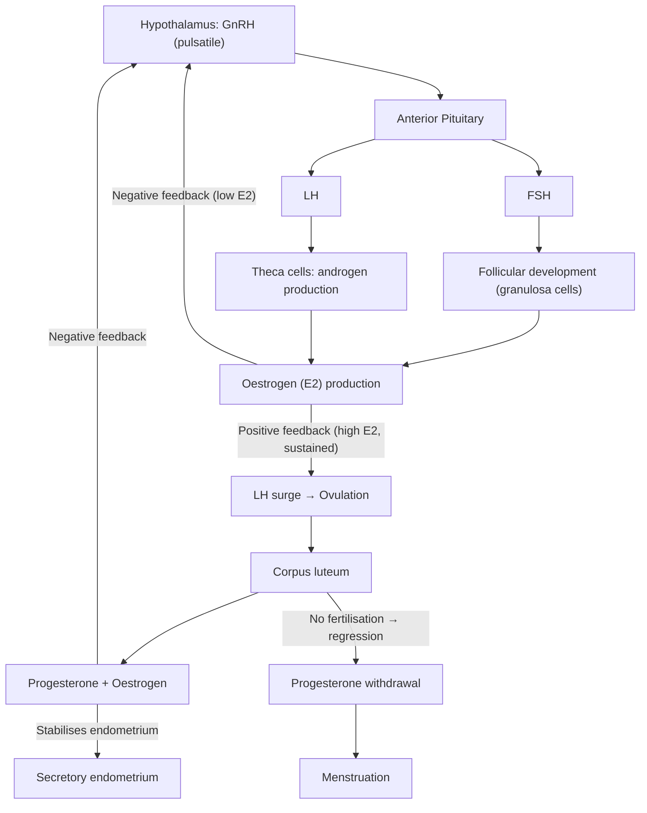
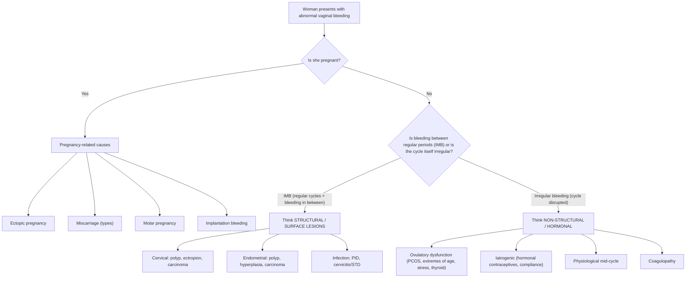

# Intermenstrual and Irregular Bleeding

## 1. Definition

***Intermenstrual bleeding (IMB): bleeding that occurs between well-defined cyclical regular menses*** [1]. This is distinct from heavy menstrual bleeding (HMB), which occurs *during* the expected menses. The key here is that the patient's periods are recognisably regular, but she bleeds *in between* them.

***Irregular bleeding: bleeding associated with a disturbance in normal menses*** [1]. Here the cycle itself is disrupted — the patient cannot identify a clear pattern. This ***may be due to anovulation, early pregnancy complications, or use of hormonal drugs*** [1].

Why does this distinction matter? Because ***they have different differential diagnoses*** [2]. IMB (bleeding between otherwise regular cycles) is ***commonly associated with surface lesions of the genital tract*** [1] — something is physically there (polyp, ectropion, carcinoma) that bleeds when irritated. Irregular bleeding, on the other hand, points more towards systemic/hormonal causes (anovulation, exogenous hormones, pregnancy) where the endometrium itself is unstable.

Let's break the terminology down:
- **Inter-** (Latin: "between") + **menstrual** (Latin *menstrualis*, from *mensis* = month) = bleeding between monthly periods
- **Irregular** = lacking the predictable cyclical pattern

<Callout title="Important Distinction">
Always clarify with the patient: "Are your periods themselves regular, and you bleed in between?" (→ IMB, think structural/surface lesions) vs "Are your periods themselves irregular/unpredictable?" (→ irregular bleeding, think hormonal/anovulatory/pregnancy). This single question narrows your differential dramatically.
</Callout>

---

## 2. Epidemiology and Risk Factors

### Epidemiology
- IMB is extremely common — up to 10–15% of gynaecology referrals relate to abnormal uterine bleeding (AUB), of which IMB forms a significant proportion.
- Irregular/anovulatory bleeding is most common at the ***extremes of reproductive age*** [1] — adolescence (immature HPO axis) and perimenopause (declining ovarian reserve).
- ***PCOS occurs in ~5–10% of reproductive-aged women*** and is the ***most common endocrinopathy in reproductive-age women***, ***accounting for ~75% of all anovulatory disorders causing infertility and ~90% of women with oligomenorrhoea*** [3].
- Cervical cancer (a cause of IMB) is a significant concern in Hong Kong. The age-standardised incidence rate is approximately 5–7 per 100,000 women. The Hong Kong Cervical Screening Programme recommends screening from age 25 for sexually active women.
- Endometrial cancer incidence in Hong Kong has been rising, now the most common gynaecological malignancy, linked to obesity and metabolic syndrome.

### Risk Factors (by Aetiology)

| Category | Risk Factors |
|---|---|
| ***Endometrial carcinoma*** | ***PCOS, tamoxifen use, unopposed oestrogen therapy, obesity*** [1], nulliparity, late menopause, diabetes mellitus, Lynch syndrome |
| Endometrial hyperplasia | Chronic anovulation (any cause), unopposed oestrogen, obesity |
| Cervical carcinoma | HPV infection (types 16, 18), early coitarche, multiple sexual partners, smoking, immunosuppression (HIV), non-attendance at screening |
| Endometrial/cervical polyps | Age > 40, obesity, hypertension, tamoxifen |
| Ectopic pregnancy | Previous ectopic, PID, tubal surgery, IVF, IUCD in situ, smoking |
| ***PCOS*** | ***Obesity, insulin resistance, T1/T2/GDM, history of premature adrenarche, 1st-degree family history of PCOS, use of AEDs especially valproic acid*** [3] |
| PID | Multiple sexual partners, young age, lack of barrier contraception, IUCD insertion |
| Breakthrough bleeding (hormonal) | Combined or progestogen-only contraceptives, poor compliance, drug interactions (e.g. enzyme-inducing drugs) |

---

## 3. Anatomy and Function (Relevant Review)

### 3.1 The Uterus and Endometrium

The uterus is a hollow muscular organ composed of three layers:
1. **Perimetrium** (serosa) — outermost
2. **Myometrium** — thick smooth muscle layer; relevant for fibroids (leiomyomas) and adenomyosis
3. **Endometrium** — the inner mucosal lining, further divided into:
   - **Functionalis** (superficial 2/3): the layer that proliferates, secretes, and sheds during menstruation. This is the dynamic, hormone-responsive layer.
   - **Basalis** (deep 1/3): the regenerative layer that remains after menstruation and regenerates the functionalis. It is supplied by straight arteries (not hormone-responsive).

The functionalis is supplied by **spiral arteries**, which are exquisitely sensitive to progesterone. When progesterone is withdrawn (at the end of the luteal phase), these spiral arteries undergo rhythmic vasoconstriction → ischaemia → necrosis → shedding = menstruation.

**Why does this matter for IMB/irregular bleeding?**
- If there is **no ovulation**, there is **no corpus luteum**, therefore **no progesterone**. The endometrium is exposed to **unopposed oestrogen** only → it proliferates but never undergoes secretory transformation → it becomes thick, fragile, and vascular → it outgrows its blood supply → random, unpredictable shedding = **irregular bleeding** (anovulatory or "breakthrough" bleeding).
- If a **structural lesion** (polyp, fibroid, carcinoma) distorts the endometrial surface, it can erode, ulcerate, or have abnormal vasculature → bleeding between otherwise normal cycles = **IMB**.

### 3.2 The Cervix

The cervix has two types of epithelium:
- **Ectocervix**: stratified squamous epithelium (tough, multi-layered)
- **Endocervix**: columnar epithelium (single-layered, fragile, mucus-secreting)
- **Squamocolumnar junction (SCJ)**: where these two meet; this is the **transformation zone** — the site where metaplasia occurs and where cervical carcinoma and CIN arise.

**Ectropion** (previously called "erosion") occurs when the columnar epithelium extends onto the ectocervix — it appears red and bleeds easily on contact. This is common with oestrogen exposure (pregnancy, COC use). It is **benign** but causes contact/post-coital bleeding and must be distinguished from cervical carcinoma.

### 3.3 The Hypothalamic-Pituitary-Ovarian (HPO) Axis

Understanding the normal menstrual cycle is essential:

**Key points:**
- **Follicular phase** (Day 1–14): FSH drives follicular growth → rising oestrogen → endometrial proliferation
- **Ovulation** (Day 14): LH surge
- **Luteal phase** (Day 14–28): Corpus luteum produces progesterone → endometrial secretory transformation → stable, compact endometrium
- **Menstruation**: Corpus luteum regresses → progesterone withdrawal → spiral artery vasoconstriction → endometrial shedding

***Physiological mid-cycle bleeding*** may be ***related to rapid decrease in oestrogen after LH surge with low progesterone level shortly after ovulation*** [1]. This is a brief, self-limited spotting around Day 14 — the endometrium momentarily loses oestrogen support before progesterone takes over.

### 3.4 The Fallopian Tubes

Relevant for ectopic pregnancy — the most common site is the **ampulla** (70%), followed by isthmus (12%), fimbria (11%), and cornua (2%). The narrow lumen means a growing gestational sac quickly outgrows its blood supply or erodes into tubal vasculature → bleeding (both vaginal and intra-abdominal).

---

## 4. Aetiology and Pathophysiology

The FIGO **PALM-COEIN** classification system is the standard framework for abnormal uterine bleeding. It divides causes into **Structural** (PALM: Polyp, Adenomyosis, Leiomyoma, Malignancy/hyperplasia) and **Non-structural** (COEIN: Coagulopathy, Ovulatory dysfunction, Endometrial, Iatrogenic, Not yet classified).

For IMB and irregular bleeding specifically, the key aetiologies from the lecture slides [1] are:

### 4.1 Structural Causes

#### 4.1.1 Endometrial Pathologies

***Endometrial polyps, fibroid polyps, hyperplasia, and carcinoma*** [1]

**Endometrial Polyps**
- Localised overgrowths of endometrial glands and stroma projecting into the uterine cavity
- Usually pedunculated (on a stalk), ranging from a few mm to several cm
- Contain thick-walled blood vessels that are abnormal and fragile
- **Why do they cause IMB?** The polyp surface is exposed and prone to erosion and microtrauma. Its abnormal vasculature lacks the normal spiral artery architecture and does not respond normally to progesterone withdrawal → irregular, unpredictable bleeding independent of the menstrual cycle
- Risk factors: age > 40, obesity, hypertension, tamoxifen use
- Malignant transformation risk: ~1–3% (higher with advancing age, postmenopausal status)

**Fibroid Polyps (Submucosal Leiomyomas)**
- Fibroids (leiomyomas) are benign smooth muscle tumours of the myometrium
- ***Usually due to submucosal (or intramural) leiomyomas*** [2] — these are the ones that distort the endometrial cavity
- Submucosal fibroids can become pedunculated and protrude into the cavity like a polyp ("fibroid polyp")
- **Why do they cause bleeding?** They increase the endometrial surface area, distort the vasculature overlying the fibroid (vessels are stretched and compressed), and may cause venous ectasia and ulceration of the overlying endometrium. They also interfere with local haemostatic mechanisms (reduced endothelin, increased prostaglandins/tPA)
- ***May be associated with pressure symptoms*** [2] (urinary frequency from bladder compression, constipation from rectal compression, ureteric obstruction)

**Endometrial Hyperplasia**
- Abnormal proliferation of endometrial glands with an increased gland-to-stroma ratio
- Caused by **prolonged unopposed oestrogen** exposure (no progesterone to oppose proliferation)
- Classified (WHO 2014/2020) into:
  - **Hyperplasia without atypia**: low malignant potential (~1–3%)
  - **Atypical hyperplasia (endometrial intraepithelial neoplasia, EIN)**: significant malignant potential (~30–40% progression to carcinoma)
- **Why does unopposed oestrogen cause this?** Oestrogen drives endometrial proliferation (mitosis). Progesterone normally counteracts this by inducing secretory differentiation and apoptosis. Without progesterone (anovulation, PCOS, exogenous oestrogen-only HRT), the endometrium just keeps proliferating → hyperplasia → atypia → carcinoma (the "hyperplasia-carcinoma sequence")

**Endometrial Carcinoma**
- Most common gynaecological malignancy in Hong Kong (rising incidence due to obesity epidemic)
- Predominantly **Type 1** (endometrioid adenocarcinoma, ~80%) — oestrogen-driven, arises from hyperplasia
- **Type 2** (serous, clear cell) — not oestrogen-driven, arises from atrophic endometrium, more aggressive, older patients
- ***Risk factors for endometrial carcinoma: PCOS, tamoxifen, unopposed oestrogen therapy, obesity*** [1]
- **Why does obesity increase risk?** Adipose tissue contains aromatase, which converts adrenal androgens (androstenedione) to oestrone (E1) via peripheral aromatisation → chronic unopposed oestrogen exposure
- **Why does tamoxifen increase risk?** Tamoxifen is a selective oestrogen receptor modulator (SERM) — it is an oestrogen *antagonist* in breast tissue (used for breast cancer) but an oestrogen *agonist* in the endometrium → stimulates endometrial proliferation

<Callout title="High Yield" type="idea">
***The endometrial hyperplasia → carcinoma sequence is driven by unopposed oestrogen.*** Any condition causing anovulation (PCOS, obesity, perimenopause) removes progesterone's protective effect on the endometrium. This is why PCOS patients with oligomenorrhoea need cyclical progestogen to protect the endometrium — even if they don't want contraception.
</Callout>

#### 4.1.2 Pelvic Inflammatory Disease (PID)

***PID: associated with pelvic pain, fever, vaginal discharge*** [1]

- Ascending infection from the lower genital tract (cervix) to the upper genital tract (endometrium → salpinges → peritoneum)
- Causative organisms: *Chlamydia trachomatis* (most common), *Neisseria gonorrhoeae*, anaerobes, *Mycoplasma genitalium*
- **Why does PID cause IMB/irregular bleeding?** Endometritis (infection of the endometrium) disrupts the normal endometrial architecture and vasculature → friable, inflamed endometrium that bleeds irregularly. The inflammatory mediators (prostaglandins, cytokines) also interfere with normal haemostasis and endometrial stability
- Can present acutely (pain, fever, discharge) or chronically (low-grade bleeding, dyspareunia)
- Complications: tubo-ovarian abscess, infertility, ectopic pregnancy, Fitz-Hugh-Curtis syndrome (perihepatitis)

#### 4.1.3 Early Pregnancy Complications

***Early pregnancy complications*** [1]:

***Ectopic pregnancy: associated with pain, classically occurs 7–8 weeks from LMP*** [1]

- "Ecto-" (Greek: "outside") + "topos" (Greek: "place") = pregnancy outside the normal place (uterine cavity)
- Most commonly in the fallopian tube (95%)
- **Why bleeding at 7–8 weeks?** The gestational sac grows in the narrow tube → erodes into tubal vasculature. The trophoblast also produces hCG which initially supports the corpus luteum → but as the ectopic fails, hCG falls → corpus luteum regresses → progesterone drops → decidualised endometrium in the uterus sheds → vaginal bleeding. The *pain* is from tubal distension/rupture.
- **Why does it classically present at 7–8 weeks?** Because this is when the embryo has grown large enough to cause tubal distension. Earlier than 6 weeks, it may be asymptomatic.

***Miscarriages: threatened, inevitable, complete, incomplete*** [1]

| Type | Os | Bleeding | Products | Uterine Size |
|---|---|---|---|---|
| Threatened | Closed | Usually mild | None passed | = dates |
| Inevitable | Open | Heavy | None yet passed | = dates |
| Incomplete | Open | Heavy, ongoing | Some passed | < dates |
| Complete | Closed (closing) | Settling | All passed | < dates |
| Missed | Closed | Minimal/none | Retained, non-viable | < dates |

- **Why does miscarriage cause bleeding?** When the pregnancy fails, the gestational tissue separates from the decidualised endometrium → the spiral arteries that supplied the implantation site are exposed → bleeding. If products remain (incomplete), the uterus cannot contract fully → the bleeding continues (the uterus needs to contract to compress the vessels, like after a full-term delivery).

***Others: molar pregnancy, physiological/implantation bleeding*** [1]

- **Molar pregnancy** (hydatidiform mole): abnormal trophoblastic proliferation with hydropic degeneration of chorionic villi. Complete mole (46,XX, all paternal) or partial mole (69,XXX/XXY, triploid). Causes vaginal bleeding, markedly elevated hCG, "snowstorm" appearance on USS. Risk of gestational trophoblastic neoplasia (GTN).
- **Implantation bleeding**: occurs ~6–12 days after ovulation when the blastocyst implants into the endometrium. The trophoblast erodes into endometrial capillaries → light spotting. Brief, self-limited, often mistaken for a light period.

#### 4.1.4 Cervical Pathologies

***Cervical polyps, ectropion, carcinoma (classically post-coital)*** [1]

**Cervical Polyps**
- Benign proliferations of endocervical columnar epithelium, usually pedunculated
- Protrude through the external os → exposed to mechanical trauma (intercourse, speculum)
- **Why post-coital bleeding?** Direct contact causes surface trauma to the fragile columnar epithelium → bleeding

**Cervical Ectropion**
- Eversion of columnar epithelium onto the ectocervix
- Common in: pregnancy, COC use, adolescence (all high-oestrogen states — oestrogen causes the SCJ to move outward)
- Columnar epithelium is single-layered and fragile (unlike the tough stratified squamous epithelium of the ectocervix) → bleeds easily with contact
- **Benign** but must always be distinguished from cervical carcinoma on speculum examination

**Cervical Carcinoma**
- ***Classically post-coital*** [1] — the tumour is friable and vascular; intercourse causes mechanical disruption → bleeding
- HPV-related (types 16, 18 account for ~70%)
- Squamous cell carcinoma (most common, ~70%) or adenocarcinoma (~25%)
- In Hong Kong, cervical screening (Pap smear/liquid-based cytology ± HPV co-testing) is recommended every 3 years for women aged 25–64 who have ever been sexually active (after 2 consecutive normal annual smears)

<Callout title="Red Flag" type="error">
***Any postmenopausal bleeding (PMB) must be assumed to be endometrial carcinoma until proven otherwise.*** Similarly, persistent IMB or post-coital bleeding (PCB) in a sexually active woman warrants cervical examination and biopsy to exclude cervical carcinoma. Never dismiss these symptoms as "hormonal" without adequate investigation.
</Callout>

#### 4.1.5 Vaginitis and STDs

***Vaginitis and STDs: look for associating vaginal symptoms*** [1]

- Cervicitis/vaginitis from *Chlamydia*, *Gonorrhoea*, *Trichomonas*, bacterial vaginosis, or candidiasis can cause intermenstrual spotting
- **Why bleeding?** Inflamed, friable cervical/vaginal mucosa bleeds on contact or spontaneously
- Associated symptoms: abnormal vaginal discharge (colour, odour), pruritus, dysuria, dyspareunia
- In Hong Kong, chlamydia and gonorrhoea testing is standard for any young woman presenting with IMB

### 4.2 Non-Structural Causes

#### 4.2.1 Ovulatory Dysfunction (AUB-O)

***Ovulatory dysfunction (AUB-O)*** [1]:

***Signs and symptoms: prolonged oligomenorrhoea followed by heavy bleeding or spotting*** [1]

***Causes: extremes of reproductive age, PCOS, intense exercise, eating disorder, severe stress, hyper- or hypothyroidism*** [1]

**Why does anovulation cause irregular bleeding?**

In a normal cycle, ovulation is the pivotal event. After ovulation, the corpus luteum produces progesterone, which:
1. Converts the proliferative endometrium to a secretory endometrium (compact, stable)
2. Stabilises the spiral arteries
3. When withdrawn (at the end of the luteal phase), triggers organised, predictable shedding = menstruation

Without ovulation, there is **no corpus luteum → no progesterone**. The endometrium is exposed to **unopposed oestrogen only**:
- Oestrogen continues to drive proliferation → the endometrium becomes thick, fragile, and disorganised
- Without progesterone-mediated spiral artery stabilisation, the vasculature is unstable
- The endometrium eventually outgrows its blood supply → random focal necrosis → unpredictable, irregular shedding
- This shedding is often incomplete → some areas bleed while others continue to proliferate → ***prolonged oligomenorrhoea followed by heavy bleeding or spotting*** [1]

**PCOS as the paradigm of anovulatory bleeding:**

***PCOS pathogenesis*** [3]:
- ***Altered FSH and LH action: increased serum LH, increased ovarian expression of LH receptors*** [3]
- ***Increased LH-to-FSH ratio → hypersecretion of androgens in theca cells in ovarian follicles*** [3], leading to:
  - ***Impaired follicular development with failed selection of dominant follicles*** [3]
  - ***Decreased progesterone inhibition on GnRH pulse frequency → increased LH pulses → increased PCOS phenotype*** [3] (a vicious cycle)
- ***Decreased FSH action: due to insufficient FSH stimulation, local inhibition of FSH action → impaired follicular development*** [3]
- ***Insulin resistance: compensatory hyperinsulinaemia → increased androgen secretion by stimulating theca cell secretion of androgens AND inhibiting hepatic sex hormone binding globulin (SHBG) production*** [3] → more free androgens

***Impaired folliculogenesis results in appearance of multiple small follicles that fail to develop into dominant follicles → anovulation*** [3]

***Prolonged oligo-/anovulation → oligo-/amenorrhoea with prolonged unopposed oestrogen*** [3]

***PCOS ovulatory dysfunction:*** [3]
- ***Usually presents with normal or slightly delayed menarche with normal cycles → followed by irregular cycles*** [3]
- ***Oligomenorrhoea developed after 30 years is unlikely to be PCOS-related*** [3]
- ***Some may have intermittent breakthrough bleeding and HMB instead*** [3]
- ***Excess risk of endometrial hyperplasia/carcinoma: due to chronic unopposed oestrogen exposure*** [3]

**Other causes of anovulation:**
- **Extremes of reproductive age**: In adolescence, the HPO axis is immature → GnRH pulsatility is not yet established → inconsistent LH surges → anovulation. In perimenopause, the declining follicular pool leads to erratic folliculogenesis → intermittent ovulation/anovulation.
- **Hypothalamic amenorrhoea** (intense exercise, eating disorders, severe stress): Energy deficit/stress → increased CRH and cortisol → suppression of GnRH pulsatility → anovulation. Also decreased leptin (from low body fat) → reduced GnRH drive.
- **Thyroid disorders**: Hypothyroidism → increased TRH → increased prolactin → inhibits GnRH pulsatility. Also decreased SHBG (hypothyroidism) → altered oestrogen/androgen dynamics. Hyperthyroidism → increased SHBG → altered oestrogen metabolism.

#### 4.2.2 Iatrogenic/Hormonal Causes

***Unscheduled/breakthrough bleeding in combined or progestogen-type contraceptives*** [1]

- **Combined oral contraceptives (COCs)**: Breakthrough bleeding is common in the first 3 months of use. The exogenous oestrogen/progestogen suppresses the HPO axis and maintains a thin, atrophic endometrium. If the endometrium becomes too thin, it becomes fragile → random spotting.
- **Progestogen-only methods** (POP, implant, Depo-Provera, LNG-IUS): Progestogen-only methods cause endometrial atrophy and decidualisation with abnormal vascular patterns → unpredictable bleeding. The endometrium is thin but fragile, with abnormal superficial vessels that bleed irregularly.
- **Why does poor compliance cause bleeding?** Missing pills → temporary drop in exogenous hormone levels → partial endometrial shedding → spotting. This is essentially a mini-withdrawal bleed.
- **Drug interactions**: Enzyme-inducing drugs (rifampicin, carbamazepine, phenytoin, some antiretrovirals) accelerate hepatic metabolism of steroid hormones → lower circulating hormone levels → breakthrough bleeding.

#### 4.2.3 Physiological Mid-Cycle Bleeding

***Physiological mid-cycle bleeding: possibly related to rapid decrease in oestrogen after LH surge with low progesterone level shortly after ovulation*** [1]

- Occurs around Day 14 of a 28-day cycle
- Brief (1–2 days), light spotting
- **Why?** Just before ovulation, oestrogen peaks. After the LH surge triggers ovulation, the pre-ovulatory follicle transforms into the corpus luteum. During this transition, there is a transient dip in oestrogen (the follicle has ruptured and is reorganising) before progesterone rises. This brief oestrogen withdrawal can cause a small amount of endometrial shedding.
- Self-limited, benign — diagnosis of exclusion

#### 4.2.4 Coagulopathy

***Coagulopathy*** [1]

- Bleeding disorders can present as menorrhagia and/or IMB
- **Von Willebrand disease** is the most common inherited bleeding disorder (prevalence ~1% of population) and should be considered especially ***if HMB since menarche*** [2]
- Other: platelet disorders, clotting factor deficiencies, anticoagulant therapy (warfarin, DOACs, heparin)
- **Why does coagulopathy cause abnormal bleeding?** Normal endometrial haemostasis during menstruation relies on platelet plugs, fibrin clot formation, and vasoconstriction. If any of these are impaired, bleeding is excessive or prolonged. Coagulopathy can also unmask bleeding from otherwise trivial endometrial or cervical lesions.

---

## 5. Classification

### 5.1 FIGO PALM-COEIN Classification (AUB)

The **PALM-COEIN** system (FIGO 2011, updated 2018) classifies causes of AUB in non-pregnant reproductive-age women:

| Category | Structural (PALM) | Non-Structural (COEIN) |
|---|---|---|
| P | **P**olyp | **C** – **C**oagulopathy |
| A | **A**denomyosis | **O** – **O**vulatory dysfunction |
| L | **L**eiomyoma | **E** – **E**ndometrial (local haemostatic factors) |
| M | **M**alignancy & hyperplasia | **I** – **I**atrogenic |
| | | **N** – **N**ot yet classified |

<Callout title="PALM-COEIN Mnemonic">
**PALM** = things you can see/image (structural) → Polyp, Adenomyosis, Leiomyoma, Malignancy.
**COEIN** = things you can't see (non-structural) → Coagulopathy, Ovulatory dysfunction, Endometrial, Iatrogenic, Not classified.
A patient can have more than one cause — the system allows multiple categories to be ticked.
</Callout>

### 5.2 Clinical Classification of IMB and Irregular Bleeding

From the lecture slides [1], a practical clinical classification:

**Structural causes:**
- Endometrial: polyps, fibroid polyps, hyperplasia, carcinoma
- Cervical: polyps, ectropion, carcinoma
- Infection: PID, vaginitis/STDs
- Pregnancy-related: ectopic, miscarriage, molar, implantation

**Non-structural causes:**
- Ovulatory dysfunction (AUB-O)
- Iatrogenic (hormonal contraceptives, breakthrough bleeding)
- Physiological mid-cycle bleeding
- Coagulopathy

---

## 6. Clinical Features

### 6.1 History Taking

The history is the most important tool. The lecture slides [1] outline a structured approach:

#### 6.1.1 Documentation of Menstrual Irregularity

***Documentation of menstrual irregularity*** [1]:

- ***Amount, pattern, duration*** [1]
  - Quantify the bleeding: How many pads/tampons per day? How soaked? Clots (size)? Flooding?
  - Pattern: Is it spotting? Is it as heavy as a period? Continuous or intermittent?
  - Duration: How many days does it last? Is it getting worse?

- ***Timing: intermenstrual bleeding, post-coital bleeding*** [1]
  - **IMB**: "Do you bleed between your periods?" → Think surface lesions (polyps, ectropion, carcinoma), endometrial pathology
  - **Post-coital bleeding (PCB)**: "Do you bleed after sex?" → Think cervical pathology (ectropion, polyp, carcinoma), cervicitis/STD, vaginal pathology
  - **Post-menopausal bleeding (PMB)**: "Have you gone through menopause and now have bleeding?" → Think endometrial carcinoma (until proven otherwise)

- ***Previous menstrual history: LMP + 2 previous periods*** [1]
  - LMP: essential to exclude pregnancy, date the cycle
  - 2 previous periods: establishes the patient's baseline — were cycles previously regular? What has changed?
  - Menarche age, previous cycle regularity, any prior episodes of abnormal bleeding

#### 6.1.2 Associated Symptoms

***Anaemic symptoms: headache, palpitation, SOB, dizziness, fatigue, pica*** [1]
- These indicate significant chronic blood loss
- **Pica** (craving non-food substances like ice, starch) is a specific feature of iron deficiency anaemia — the mechanism is unclear but may relate to altered dopamine signalling from iron deficiency in the CNS

***Medication use: hormonal and herbal medicine, drug compliance*** [1]
- COCs, POPs, implants, Depo-Provera, LNG-IUS — any hormonal method can cause breakthrough bleeding
- Compliance: missed pills are a very common cause of breakthrough bleeding
- Herbal medicines: some (e.g. dong quai, ginseng) have phytoestrogenic properties
- Anticoagulants (warfarin, DOACs): can unmask or worsen bleeding

***Risk factors for endometrial carcinoma: e.g. PCOS, tamoxifen, unopposed oestrogen therapy, obesity*** [1]
- Must be actively screened for in any woman with abnormal bleeding, especially > 40 years or with risk factors

***Sexual and contraceptive history*** [1]
- Current contraception method (type, compliance)
- Risk of pregnancy (last intercourse, contraceptive use/failure)
- Risk of STDs (number of partners, barrier use, previous STDs)
- Cervical screening history (last Pap smear and result)

#### 6.1.3 Other Important History Points

- **Pain**: 
  - Pelvic pain + fever + discharge → PID
  - Unilateral pain + bleeding at 7–8 weeks → ectopic pregnancy
  - Cramping pain + bleeding → miscarriage
  - Dysmenorrhoea + HMB → adenomyosis / endometriosis
- **Vaginal discharge**: character (colour, odour, consistency) → infection
- **Pressure symptoms**: urinary frequency, constipation → large fibroid
- **Systemic symptoms**: weight changes, heat/cold intolerance → thyroid disease
- **Bleeding from other sites**: gums, nosebleeds, easy bruising, family history → coagulopathy
- **Psychosocial impact**: effect on daily life, work, relationships, sexual function

<Callout title="Structured History Framework">
A useful mnemonic for AUB history: **"PALM-COEIN + PQRST"**
- P: Pattern (regular vs irregular)
- Q: Quantity (pads, clots, flooding)
- R: Related symptoms (pain, discharge, systemic)
- S: Sexual/contraceptive history
- T: Timing (IMB, PCB, PMB) + Timeline (onset, progression, LMP)
</Callout>

### 6.2 Symptoms (with Pathophysiological Basis)

| Symptom | Pathophysiological Basis | Think... |
|---|---|---|
| Bleeding between regular periods (IMB) | Surface lesion eroding/exposing abnormal vessels; endometrial polyp with fragile vessels | Polyp, ectropion, cervical carcinoma, endometrial pathology |
| Post-coital bleeding | Mechanical trauma to fragile cervical/vaginal lesion → bleeding | Cervical ectropion, polyp, carcinoma, cervicitis |
| Irregular, unpredictable bleeding | Anovulation → unopposed oestrogen → unstable, thick endometrium → random shedding | PCOS, perimenopause, hypothalamic amenorrhoea |
| ***Prolonged oligomenorrhoea followed by heavy bleeding*** | Anovulation → prolonged proliferative phase → endometrium outgrows blood supply → massive irregular shedding | ***AUB-O (anovulatory dysfunction)*** [1] |
| Mid-cycle spotting (Day 14) | Transient oestrogen dip after LH surge before progesterone rises | Physiological — diagnosis of exclusion |
| Bleeding on hormonal contraception | Atrophic endometrium too thin/fragile, or missed pills → partial withdrawal bleed | Breakthrough bleeding — reassure if < 3 months, check compliance |
| Bleeding + pelvic pain + fever | Ascending infection → endometritis → inflamed, friable endometrium | PID |
| Bleeding + unilateral pain (7–8 weeks) | Ectopic trophoblast eroding tubal vessels; hCG fall → endometrial shedding | Ectopic pregnancy |
| Bleeding + cramping + open os | Failed pregnancy → placental separation → exposed spiral arteries | Miscarriage (inevitable/incomplete) |
| Bleeding + abnormal discharge | Cervicitis/vaginitis → inflamed, friable mucosa | STD, vaginal infection |
| Heavy periods since menarche | Inherited deficiency in clotting factors/platelets → impaired endometrial haemostasis | Von Willebrand disease, other coagulopathy |

### 6.3 Signs (with Pathophysiological Basis)

Physical examination should include **general examination**, **abdominal examination**, and **pelvic examination** (speculum + bimanual).

| Sign | Finding | Pathophysiological Basis |
|---|---|---|
| **General** | Pallor (conjunctival, palmar crease) | Chronic blood loss → iron deficiency anaemia |
| | Tachycardia | Compensatory response to anaemia (increased cardiac output to maintain O₂ delivery) |
| | Hirsutism, acne, acanthosis nigricans | Hyperandrogenism + insulin resistance → PCOS |
| | BMI > 30 (obesity) | Peripheral aromatisation of androgens → oestrone → unopposed oestrogen → endometrial pathology |
| | Thyroid signs (goitre, tremor, bradycardia) | Thyroid dysfunction → anovulation |
| | Bruising, petechiae | Coagulopathy → impaired haemostasis |
| **Abdominal** | Pelvic mass (suprapubic) | Large uterine fibroid extending above pubic symphysis |
| | Tenderness (lower abdominal) | PID (bilateral), ectopic (unilateral), miscarriage |
| | Peritonism (guarding, rebound) | Ruptured ectopic → haemoperitoneum |
| **Speculum** | Cervical polyp (smooth, red, pedunculated) | Proliferation of endocervical epithelium → protrudes through os |
| | Cervical ectropion (red, granular area around os) | Columnar epithelium everted onto ectocervix (oestrogen effect) |
| | Cervical mass (friable, irregular, bleeds on touch) | Cervical carcinoma → neovascularisation, tumour friability |
| | Products of conception at os | Incomplete/inevitable miscarriage → partially expelled tissue |
| | Abnormal vaginal discharge | Infection → inflammatory exudate |
| | Atrophic vagina | Postmenopausal oestrogen deficiency → thin, dry epithelium |
| **Bimanual** | Bulky, irregularly enlarged uterus | Fibroids (multiple, different sizes) |
| | Bulky, uniformly enlarged, tender uterus | Adenomyosis (diffuse myometrial thickening) |
| | Enlarged, soft uterus (larger than expected for dates) | Molar pregnancy (excessive trophoblastic proliferation → uterine distension) |
| | Cervical excitation tenderness (chandelier sign) | PID → inflammation of adnexa → pain on cervical motion |
| | Adnexal mass/tenderness | Ectopic pregnancy (tubal mass), tubo-ovarian abscess, ovarian pathology |
| | Small, anteverted, mobile, non-tender uterus | Normal finding — suggests non-structural cause (AUB-O, iatrogenic) |

---

## 7. Approach to Clinical Assessment

The first question is always: **Is she pregnant?** A urine pregnancy test (urine hCG) must be performed in any reproductive-age woman with abnormal vaginal bleeding. This is non-negotiable — missing an ectopic pregnancy can be fatal.

The second question: **Is this IMB (bleeding between regular periods) or irregular bleeding (the cycle itself is disrupted)?** This guides your differential.

---

<Callout title="High Yield Summary">

**Key Concepts:**

1. ***IMB = bleeding between well-defined regular menses*** → think surface/structural lesions (cervical polyp, ectropion, carcinoma, endometrial polyp/hyperplasia/carcinoma). ***Irregular bleeding = disturbance of the cycle itself*** → think anovulation, hormonal causes, pregnancy.

2. **Always exclude pregnancy first** (urine β-hCG) in any reproductive-age woman with abnormal bleeding. Ectopic pregnancy is life-threatening.

3. **Anovulatory bleeding** (AUB-O) occurs because no ovulation → no corpus luteum → no progesterone → unopposed oestrogen → thick, unstable endometrium → irregular, unpredictable shedding. ***Presents as prolonged oligomenorrhoea followed by heavy bleeding or spotting.***

4. ***PCOS*** is the most common cause of anovulatory bleeding. ***Pathogenesis involves increased LH:FSH ratio → theca cell androgen excess → impaired folliculogenesis; insulin resistance → hyperinsulinaemia → more androgens, less SHBG.***

5. **Unopposed oestrogen** drives the endometrial **hyperplasia → carcinoma** sequence. Risk factors: ***PCOS, tamoxifen, unopposed oestrogen HRT, obesity.***

6. ***Post-coital bleeding*** should prompt examination to **exclude cervical carcinoma** (and ectropion/polyps). ***Postmenopausal bleeding = endometrial carcinoma until proven otherwise.***

7. ***Breakthrough bleeding*** on hormonal contraceptives is common in the first 3 months and with poor compliance. Always check compliance before investigating further.

8. History framework: ***Amount/pattern/duration, timing (IMB/PCB), LMP + 2 previous periods, anaemic symptoms, medications, risk factors for endometrial CA, sexual/contraceptive history.***

</Callout>

---

<ActiveRecallQuiz
  title="Active Recall - Intermenstrual and Irregular Bleeding"
  items={[
    {
      question: "What is the key clinical distinction between intermenstrual bleeding (IMB) and irregular bleeding, and why does this matter?",
      markscheme: "IMB = bleeding between well-defined regular menses (think structural/surface lesions: polyps, ectropion, carcinoma). Irregular bleeding = disturbance of normal cycle itself (think anovulation, hormonal causes, pregnancy). Different differential diagnoses.",
    },
    {
      question: "Explain the pathophysiology of anovulatory (AUB-O) bleeding. Why does it present as prolonged oligomenorrhoea followed by heavy bleeding?",
      markscheme: "No ovulation -> no corpus luteum -> no progesterone -> unopposed oestrogen -> endometrium proliferates continuously, becomes thick, fragile, disorganised -> outgrows blood supply -> random focal necrosis and irregular shedding. Prolonged oligomenorrhoea (no progesterone-mediated shedding) then heavy bleeding when endometrium finally breaks down.",
    },
    {
      question: "A 25-year-old woman presents with irregular periods, hirsutism, and acne. Her BMI is 32. Name the most likely diagnosis and explain two mechanisms by which insulin resistance contributes to the pathogenesis.",
      markscheme: "PCOS. (1) Hyperinsulinaemia stimulates theca cell androgen production directly. (2) Hyperinsulinaemia inhibits hepatic SHBG production -> increased free androgens. Both increase hyperandrogenism and impair folliculogenesis.",
    },
    {
      question: "Why does tamoxifen increase the risk of endometrial carcinoma despite being an anti-oestrogen drug used for breast cancer?",
      markscheme: "Tamoxifen is a SERM (selective oestrogen receptor modulator) - it is an oestrogen antagonist in breast tissue but an oestrogen agonist in the endometrium. It stimulates endometrial proliferation -> risk of hyperplasia and carcinoma.",
    },
    {
      question: "A woman presents with vaginal bleeding, unilateral pelvic pain, and her LMP was 7 weeks ago. What is the most important diagnosis to exclude and why does it classically present at this gestation?",
      markscheme: "Ectopic pregnancy. Classically presents at 7-8 weeks because the embryo has grown large enough to cause tubal distension or erode into tubal vasculature. Vaginal bleeding occurs because falling hCG leads to corpus luteum regression, progesterone withdrawal, and decidualised endometrial shedding.",
    },
    {
      question: "List four risk factors for endometrial carcinoma and explain the common pathophysiological mechanism linking them.",
      markscheme: "PCOS, obesity, tamoxifen, unopposed oestrogen therapy (also: nulliparity, late menopause, diabetes, Lynch syndrome). Common mechanism: chronic unopposed oestrogen exposure drives endometrial proliferation without progesterone-mediated differentiation and apoptosis -> hyperplasia -> atypia -> carcinoma.",
    },
  ]}
/>

## References

[1] Lecture slides: Adrian Lui Gynecology Notes.pdf (p19 — Intermenstrual and Irregular Bleeding)
[2] Lecture slides: Adrian Lui Gynecology Notes.pdf (p13 — Heavy Menstrual Bleeding)
[3] Lecture slides: Adrian Lui Gynecology Notes.pdf (p40 — Polycystic Ovarian Syndrome)
