## Management of Intermenstrual and Irregular Bleeding

### Overarching Principle

The management of IMB and irregular bleeding follows one cardinal rule: **treat the underlying cause**. The symptom itself is not the disease — it is a signal. Once you have completed the diagnostic workup (pregnancy test → speculum → bloods → EA/USS/hysteroscopy as indicated), management is directed at whatever you find.

That said, there are important **empirical/symptomatic treatments** that can be started while awaiting investigations or when no structural cause is found (i.e. anovulatory/dysfunctional bleeding). The lecture slides [7] give a clear tiered approach.

---

### 1. Management Algorithm

```mermaid
flowchart TD
    A["IMB / Irregular Bleeding: Diagnosis Established"] --> B{"Underlying cause identified?"}

    B -->|"Pregnancy-related"| C["Manage pregnancy complication"]
    C --> C1["Threatened miscarriage: expectant Mx"]
    C --> C2["Incomplete/missed miscarriage: expectant → medical → surgical"]
    C --> C3["Ectopic: MTX or surgical (salpingectomy)"]
    C --> C4["Molar pregnancy: suction evacuation + hCG surveillance"]

    B -->|"Cervical/vaginal pathology"| D["Treat cervical/vaginal cause"]
    D --> D1["Ectropion: observe or cautery/cryotherapy if symptomatic"]
    D --> D2["Cervical polyp: polypectomy + histology"]
    D --> D3["Cervicitis/STD: antibiotics"]
    D --> D4["Cervical carcinoma: refer Gynae-Oncology"]
    D --> D5["Atrophic vaginitis: local oestrogen"]

    B -->|"Endometrial pathology"| E["Treat endometrial cause"]
    E --> E1["Endometrial polyp: observe if small / hysteroscopic polypectomy"]
    E --> E2["Hyperplasia without atypia: progestogen therapy + re-biopsy"]
    E --> E3["Atypical hyperplasia: hysterectomy or high-dose progestogen"]
    E --> E4["Endometrial carcinoma: refer Gynae-Oncology"]

    B -->|"Fibroids / Adenomyosis"| F["See fibroid/adenomyosis Mx"]

    B -->|"PID"| G["Antibiotics (empirical broad-spectrum)"]

    B -->|"No structural cause identified: AUB-O / iatrogenic / DUB"| H["Medical management"]
    H --> H1["1st line: Combined OC pills"]
    H --> H2["2nd line: High-dose progestogen"]
    H --> H3["Alternative: LNG-IUS (Mirena)"]
    H --> H4["Supportive: Iron supplementation"]

    B -->|"Coagulopathy"| I["Haematology referral + specific Mx"]

    B -->|"Thyroid / Hyperprolactinaemia"| J["Treat endocrine cause"]
```

---

### 2. Management of IMB / Irregular Bleeding When No Structural Cause Is Found (AUB-O / DUB)

This is the most common scenario in clinical practice — a young woman with irregular bleeding, negative pregnancy test, normal speculum, and no structural pathology on imaging. The cause is usually **anovulatory dysfunction (AUB-O)**.

***Management of underlying cause as appropriate*** [7]

#### 2.1 First-Line: Combined Oral Contraceptive Pills (COCs)

***Combined OC pills: 1st line treatment unless contraindicated*** [7]

**How COCs work for irregular/anovulatory bleeding:**
- COCs contain both oestrogen (ethinylestradiol, EE) and progestogen (e.g. levonorgestrel, desogestrel, drospirenone)
- The **oestrogen** component stabilises the endometrium (promotes growth and healing of the functionalis layer) and provides a predictable hormonal milieu
- The **progestogen** component opposes oestrogen-driven proliferation, induces secretory transformation, and stabilises the endometrial vasculature (spiral arteries)
- Together, they suppress the HPO axis (suppress GnRH → suppress FSH/LH → suppress folliculogenesis → suppress erratic ovarian hormone production)
- During the pill-free interval (or placebo pills), the withdrawal of both hormones triggers an organised, predictable withdrawal bleed
- **Net effect**: transforms chaotic, unpredictable anovulatory bleeding into regular, predictable, lighter withdrawal bleeds

**Why COCs are first-line:**
- Regulate the cycle
- Reduce bleeding volume
- Provide contraception (many of these patients are reproductively active)
- Protect the endometrium from unopposed oestrogen (the progestogen component prevents hyperplasia)
- Treat associated dysmenorrhoea
- In PCOS: also improve acne and hirsutism (especially with anti-androgenic progestogens like cyproterone acetate or drospirenone)

**Contraindications to COCs (UKMEC Category 4 — absolute contraindications):**

| Contraindication | Why? |
|---|---|
| Active or history of VTE (DVT/PE) | Oestrogen is prothrombotic (↑clotting factors II, VII, VIII, X, ↑fibrinogen, ↓antithrombin III) |
| Ischaemic heart disease / stroke | Oestrogen promotes thrombosis and atherogenesis |
| Migraine with aura | Oestrogen increases risk of ischaemic stroke in migraineurs with aura |
| Breast cancer (current) | Breast cancer is hormone-sensitive; oestrogen promotes tumour growth |
| Active liver disease / hepatic tumour | Oestrogen is hepatically metabolised; liver disease impairs clearance; hepatic adenoma risk |
| Uncontrolled hypertension (≥ 160/100) | Oestrogen → fluid retention, endothelial dysfunction → further ↑BP → ↑cardiovascular risk |
| Smoking ≥ 15 cigarettes/day AND age ≥ 35 | Synergistic cardiovascular risk with oestrogen |
| < 6 weeks postpartum (breastfeeding) | Oestrogen ↓breast milk production; ↑VTE risk in puerperium |
| Major surgery with prolonged immobilisation | ↑VTE risk |

<Callout title="Key Principle" type="error">
The major concern with COCs is **venous thromboembolism (VTE)** and **arterial cardiovascular events**. The oestrogen component is the culprit. When COCs are contraindicated, you must use progestogen-only methods instead.
</Callout>

#### 2.2 Second-Line: High-Dose Progestogen

***High-dose progestogen: when contraindicated to COC pills*** [7]

**Regimens:**
- ***Cyclical oral progestogens: e.g. Primolut N (norethisterone) 5mg TDS on day 5–26 of each cycle*** [11]
- Medroxyprogesterone acetate (MPA) 10mg daily for 10–14 days per cycle (luteal phase supplementation)

**How cyclical progestogen works:**
- In anovulatory cycles, the endometrium is exposed to oestrogen only (no progesterone because no ovulation). The progestogen mimics what the corpus luteum would normally do:
  1. Converts the proliferative endometrium to secretory (compact, stable)
  2. When the progestogen is stopped (e.g. after day 26), withdrawal triggers an organised, predictable bleed — essentially an "artificial period"
  3. Repeated cyclical use prevents the endometrium from becoming dangerously thick → **protects against endometrial hyperplasia**
- **Why "day 5–26"?** This covers most of the cycle, giving the endometrium a prolonged progestogen exposure (mimicking a long luteal phase) to ensure adequate secretory transformation before withdrawal

**When to use:**
- COC contraindicated (VTE risk, migraines with aura, etc.)
- Patient does not need/want contraception (cyclical progestogen at standard doses does NOT reliably inhibit ovulation — it is not a contraceptive unless used in specific POP formulations)
- PCOS patients who need endometrial protection but cannot take COCs

**Side effects:** bloating, mood changes, breast tenderness, acne (androgenic progestogens like norethisterone), weight gain

#### 2.3 Alternative: Levonorgestrel-Releasing Intrauterine System (LNG-IUS / Mirena)

***Levonorgestrel-releasing IUCD: alternative to COC pills*** [7]

**How the LNG-IUS works:**
- Releases 20μg/day of levonorgestrel (LNG) directly into the uterine cavity
- Local progestogenic effect on the endometrium:
  - Profound decidualisation and atrophy of endometrial glands → very thin, inactive endometrium → dramatically reduced bleeding
  - Thickens cervical mucus → barrier to ascending infection and sperm (provides contraception)
  - Does NOT reliably suppress ovulation (unlike COCs) — ~50% of cycles are still ovulatory
- **Why it's excellent for AUB:** The local drug delivery means very high endometrial progestogen concentration with minimal systemic absorption → fewer systemic side effects than oral progestogens, yet powerful endometrial suppression
- Reduces menstrual blood loss by ~90% at 12 months
- Effective for 5 years (Mirena) or 8 years (updated data for contraception; 5 years for HMB indication)
- Also provides highly effective contraception (> 99%)
- ***Can be used if fibroids < 3cm with no cavity distortion*** [11]

**Advantages:**
- "Fit and forget" — excellent compliance (no daily pills to remember)
- Combined endometrial protection + contraception
- Fewer systemic side effects
- Can be used in women with contraindications to oestrogen

**Disadvantages/Considerations:**
- Irregular spotting/bleeding is common in the first 3–6 months (as the endometrium atrophies — counselling is essential)
- Not suitable if uterine cavity is distorted (large submucosal fibroids → may be expelled or malpositioned)
- Requires insertion procedure (minor)
- Small risk of expulsion (~5%), perforation (very rare, ~0.1%), infection (slightly increased risk in first 20 days)

#### 2.4 Supportive: Iron Supplementation

***Iron supplement: FeSO₄ 300mg BD × 12 weeks*** [7]

***2nd line: Ferrum Hausmann chewable tablet BD or 3mL droplet QD × 12 weeks*** [7]

***3rd line: IV iron*** [7]

**Why iron?**
- Chronic abnormal bleeding → iron deficiency anaemia. The body's iron stores (ferritin) are depleted faster than they can be replenished from diet alone
- Oral iron replaces depleted stores. Ferrous sulphate (FeSO₄) 300mg contains ~60mg elemental iron per tablet; BD provides ~120mg elemental iron/day. Only ~10% is absorbed, so ~12mg/day enters the bloodstream
- **Why 12 weeks?** It takes 2–3 months to replenish iron stores after correcting the Hb. Even after Hb normalises, continue iron to refill ferritin

**Ferrous sulphate vs Ferrum Hausmann:**
- FeSO₄ is a ferrous (Fe²⁺) salt — cheap, effective, but causes significant GI side effects (nausea, constipation, black stools, abdominal pain) because free Fe²⁺ is irritating to the GI mucosa
- Ferrum Hausmann (iron polymaltose complex) is a ferric (Fe³⁺) preparation — non-ionic iron complex that releases iron slowly → fewer GI side effects but slightly lower absorption. Used when FeSO₄ is not tolerated
- **IV iron** (e.g. ferric carboxymaltose / Ferinject, iron sucrose): bypasses GI absorption entirely. Used when: oral iron not tolerated, non-compliant, severe anaemia requiring rapid correction, malabsorption, or ongoing losses exceeding oral replacement capacity

---

### 3. Management by Specific Underlying Cause

#### 3.1 Endometrial Polyp

***Polyp can be observed (1/4 chance to spontaneously resolve if < 1cm)*** [7]

- **Small, asymptomatic polyps (< 1cm):** Observation is reasonable. ~25% resolve spontaneously (slough off)
- **Symptomatic polyps or > 1cm:** Hysteroscopic polypectomy — "see and treat." The polyp is visualised and excised under direct vision, then sent for histology (to exclude hyperplasia/malignancy within the polyp)
- **Why histology is essential:** ~1–3% of polyps harbour malignancy (higher in postmenopausal women, those on tamoxifen). You cannot tell benign from malignant by appearance alone

#### 3.2 Uterine Fibroids

***Medical treatment:*** [11]

**Non-hormonal drugs:**
- ***Tranexamic acid: oral Transamin 1g TDS up to 4 days, max 4g daily*** [11]
  - "Trans-" = across, "examic" from "examic acid" — an antifibrinolytic
  - **Mechanism:** Competitively inhibits plasminogen activation → prevents plasmin from breaking down fibrin clots → stabilises clots in the endometrial vasculature → reduces blood loss
  - **Why for fibroids?** Fibroids cause HMB partly through increased local fibrinolysis (↑tPA). Tranexamic acid directly counters this
  - **Contraindication:** Active thromboembolic disease (because you're inhibiting fibrinolysis → theoretically ↑clot risk, though evidence for increased VTE is weak)

- ***Iron supplement: oral ferrous sulphate 300mg TDS × 6 months if Hb < 10g/dL*** [11]

- ***± Mefenamic acid: oral Ponstan 250–500mg TDS*** [11]
  - An NSAID (fenamate class) — inhibits cyclooxygenase → reduces prostaglandin synthesis
  - ***Note: does NOT appear to decrease blood loss in fibroids but can decrease painful menses*** [11]
  - **Why doesn't it reduce bleeding in fibroids?** In AUB-E (dysfunctional bleeding without fibroids), excess prostaglandins (PGE₂, PGI₂) cause vasodilation and increased bleeding, so NSAIDs help. In fibroids, the bleeding is mechanical (increased surface area, distorted vasculature) — prostaglandin inhibition doesn't address this

**Hormonal drugs:**

- ***GnRH agonists or antagonists: usually for pre-operative size reduction before hysteroscopic resection*** [11]
  - **GnRH agonists** (e.g. leuprolide, goserelin): Initially stimulate GnRH receptors → "flare" effect → then continuous exposure desensitises and downregulates the receptors → pituitary becomes unresponsive → profound suppression of FSH/LH → very low oestrogen ("medical menopause")
  - ***MoA: desensitisation → medically induce menopause → decrease size of fibroid, decrease menstrual-related symptoms*** [11]
  - ***Problem: rapid relapse following discontinuation, significant climacteric symptoms with menopause-related side effects (e.g. bone density) → therefore NOT for long-term use*** [11]
  - **Why fibroids shrink:** Fibroids are oestrogen-dependent — remove oestrogen and they shrink (by ~30–50% over 3 months). This makes surgery easier (smaller fibroid, less vascular)
  - **GnRH antagonists** (e.g. relugolix, elagolix): Directly block GnRH receptors without the initial flare → faster onset of suppression. Newer agents (relugolix with add-back oestrogen/progestogen) allow longer-term use by mitigating menopausal side effects while maintaining fibroid suppression

- ***Progesterone receptor modulators: e.g. ulipristal acetate, mifepristone*** [11]
  - ***MoA: modulate progesterone receptor in myoma tissues → decrease size of fibroids*** [11]
  - ***Side effects: risk of endometrial changes (mimic endometrial hyperplasia but uncertain long-term consequences), liver toxicity (ulipristal)*** [11]
  - ***NOT available for use in HK*** [11]

- ***Mirena IUCD if fibroids < 3cm with no cavity distortion*** [11]

***Surgical treatment:*** [11]

***Indications: NOT dependent on anatomical factor*** [11] — i.e., surgical indications are based on symptoms and clinical concern, not fibroid size alone.

- ***Symptomatic*** [11] (but warn patient that urinary frequency may not improve as it may be due to detrusor instability, not fibroid compression)
- ***Rapid growth or postmenopausal growth → worrisome of malignancy*** [11]
- ***Unexplained subfertility with significant submucosal component*** [11]

| Hysterectomy | Myomectomy |
|---|---|
| ***Definitive treatment*** | ***Uterus-conserving*** |
| ***Acute haemorrhage not responding to other therapies*** [11] | Desire to preserve fertility |
| ***Completed childbearing or no fertility wish*** [11] | Still in reproductive years |
| ***Increased risk for CA cervix, endometrium, ovaries (e.g. CIN, endometrial hyperplasia)*** [11] | May recur (15–30% recurrence rate) |
| ***Patient preference*** [11] | Types: ***laparoscopic, trans-abdominal, hysteroscopic (± endometrial ablation)*** [11] |
| Types: ***vaginal, abdominal, laparoscopic*** [11] | |

**Alternative treatments:**

- ***Uterine artery embolisation (UAE)*** [11][12]
  - **How it works:** Interventional radiology procedure — catheter inserted via femoral artery → guided to uterine artery → embolisation particles (PVA particles, gelfoam) injected → block blood supply to fibroids → ischaemic necrosis → shrinkage
  - ***Clinical indication: uterine fibroid embolisation*** [12]
  - Reduces fibroid volume by ~40–60% and improves symptoms in ~80–90% of patients
  - Not recommended if future fertility desired (may affect ovarian reserve and uterine blood supply)
  - Risks: post-embolisation syndrome (pain, fever, malaise), infection, fibroid expulsion, rarely premature ovarian insufficiency

- ***High-intensity focused ultrasound (HIFU)*** [11]
  - Focused ultrasound waves generate heat at a focal point within the fibroid → thermal ablation → coagulative necrosis → fibroid shrinks
  - Non-invasive (no incision, no anaesthesia needed)
  - Limited to certain fibroid locations/sizes

#### 3.3 Adenomyosis

***Management*** [13]:

***Medical treatment: generally similar to endometriosis (unlike fibroids, where hormonal treatments are generally ineffective)*** [13]

- ***Oral contraceptive pills: little data on efficacy but still commonly used*** [13]
- ***Progestogen-only treatment: e.g. Mirena, Depo-Provera*** [13] — Mirena is particularly effective because local progestogen induces decidualisation and atrophy of the ectopic endometrial tissue within the myometrium
- ***Others: GnRH agonists, aromatase inhibitors*** [13]

***Hysterectomy: definitive treatment*** [13]
- ***Only way to excise as there is no surgical plane for simple enucleation (even in adenomyoma)*** [13] — unlike fibroids which have a pseudocapsule allowing shelling out, adenomyosis diffusely infiltrates the myometrium
- ***Extent: subtotal hysterectomy as cervix and ovaries are not affected*** [13]
- ***Route: vaginal, laparoscopic, open, robotic*** [13]

***Uterus-conserving procedures:*** [13]
- ***Uterine artery embolisation (UAE): reserved for failure or contraindication to medical + surgical therapy*** [13]
  - ***Effect: ~2/3 had long-term decreased symptom severity, but there is a high rate of additional intervention for persistent or recurrent symptoms*** [13]
- ***Ablative techniques: e.g. RFA, HIFU (investigational)*** [13]

***Asymptomatic adenomyosis incidentally found does not require any treatment*** [13]

#### 3.4 Endometrial Hyperplasia

| Type | Management | Rationale |
|---|---|---|
| **Hyperplasia without atypia** | Cyclical progestogen (oral MPA 10–20mg/day for 14 days/cycle) or continuous progestogen (LNG-IUS preferred). Re-biopsy at 3–6 months | Low malignant potential (~1–3%). Progestogen induces secretory transformation and apoptosis → reverses the hyperplasia. LNG-IUS superior to oral progestogen for regression rates (~96% vs ~66%) |
| **Atypical hyperplasia (EIN)** | **Family complete:** Hysterectomy (+ BSO recommended as ~40% harbour concurrent carcinoma). **Fertility desired:** High-dose progestogen (MPA 400–600mg/day or LNG-IUS) with endometrial surveillance biopsy every 3 months | High malignant potential (~30–40%). Hysterectomy is definitive. Fertility-sparing management is possible but requires very close surveillance — recurrence is common |

#### 3.5 Endometrial Carcinoma

- Refer to Gynae-Oncology
- Standard treatment: Total hysterectomy + bilateral salpingo-oophorectomy (TH-BSO) ± pelvic/para-aortic lymph node dissection ± adjuvant therapy (radiotherapy ± chemotherapy depending on stage, grade, histological type)
- Fertility-sparing treatment possible in highly selected cases (Grade 1 endometrioid, Stage IA, no myometrial invasion, strong fertility desire): high-dose progestogen + very close surveillance

#### 3.6 Cervical Pathologies

| Pathology | Management |
|---|---|
| **Cervical ectropion** | Asymptomatic: reassure and observe. Symptomatic (persistent PCB, troublesome discharge): **cautery** (silver nitrate or electrocautery) or **cryotherapy** — destroys the exposed columnar epithelium → heals with squamous epithelium (squamous metaplasia) |
| **Cervical polyp** | **Polypectomy** (grasp and twist the stalk at its base in clinic) → send for histology. Simple, usually done during speculum examination |
| **Cervicitis / STD** | Empirical antibiotics: *Chlamydia* → doxycycline 100mg BD × 7 days (or azithromycin 1g single dose). *Gonorrhoea* → ceftriaxone 500mg IM single dose + azithromycin 1g PO. Contact tracing essential |
| **Cervical carcinoma** | Urgent referral to Gynae-Oncology. Staging (FIGO). Treatment depends on stage: early → radical hysterectomy (Wertheim's) or trachelectomy (fertility-sparing) + pelvic lymphadenectomy; advanced → concurrent chemoradiotherapy (cisplatin-based) |

#### 3.7 PID

- Empirical broad-spectrum antibiotics covering *Chlamydia*, *Gonorrhoea*, and anaerobes
- **Outpatient regimen (mild–moderate):** Ceftriaxone 500mg IM single dose + Doxycycline 100mg BD × 14 days + Metronidazole 400mg BD × 14 days
- **Inpatient (severe / tubo-ovarian abscess):** IV cefoxitin + PO doxycycline, or IV clindamycin + IV gentamicin
- Contact tracing and partner treatment mandatory
- IUCD removal if present and clinically appropriate

#### 3.8 Pregnancy-Related Causes

***Miscarriage management*** [14]:

***Threatened miscarriage:***
- ***Expectant management: preferred for all cases*** [14]
- ***Bed rest: commonly recommended but NOT evidence-based (associated with risk of DVT)*** [14]
- ***Avoid sexual intercourse, physical exertion: commonly recommended but NOT evidence-based*** [14]
- ***Progestogen treatment: promising with early evidence*** [14]

***Complete miscarriage:***
- ***Ensure complete passage of products of gestation*** [14]
- ***Routine suction curettage: not recommended*** [14]

***Incomplete and missed miscarriage — approach (NICE guideline):*** [14]
- ***Expectant management × 7–14 days: 1st line due to cost-effectiveness and decreased risk of intervening and accidentally terminating a viable pregnancy*** [14]
- ***Medical management: 2nd choice if expectant management not acceptable*** [14] — ***vaginal misoprostol 800μg single dose*** [14]
- ***Surgical management: 3rd choice*** [14] — ***suction evacuation under LA or GA*** [14]

***Indications for immediate surgical management:*** [14]
- ***Evidence of infection: always indicates need for surgical management*** [14]
- ***Increased risk of haemorrhage, e.g. late 1st trimester*** [14]
- ***Coagulopathies, unable to have blood transfusion*** [14]

***Anti-D immunoglobulin: for Rh(D)-negative patients*** [14]

**Ectopic pregnancy:**
- **Haemodynamically unstable / ruptured:** Emergency surgery (laparoscopy or laparotomy) → salpingectomy (removal of affected tube)
- **Haemodynamically stable, unruptured:**
  - **Surgical:** Laparoscopic salpingectomy (preferred if no desire for future fertility or contralateral tube is healthy) or salpingotomy (if fertility desired and contralateral tube damaged)
  - **Medical:** Methotrexate (MTX) — a folate antagonist that inhibits rapidly dividing trophoblastic cells. Single-dose IM. Criteria: haemodynamically stable, unruptured, β-hCG < 5000 IU/L (some guidelines < 3000), no fetal heartbeat, no significant haemoperitoneum, compliant patient for follow-up
  - **Expectant:** If β-hCG is low and declining spontaneously → may resolve without intervention. Requires very close serial β-hCG monitoring

**Molar pregnancy:**
- Suction evacuation of the mole (NOT medical induction — risk of embolisation of trophoblastic tissue)
- Histological confirmation
- Serial β-hCG monitoring post-evacuation until undetectable (weekly then monthly for 6–12 months depending on complete vs partial mole)
- Contraception during surveillance (pregnancy would confound hCG monitoring)
- If hCG plateaus or rises → gestational trophoblastic neoplasia (GTN) → chemotherapy

#### 3.9 Atrophic Vaginitis (PMB Context)

***Local oestrogen cream: for atrophic vaginitis/endometritis*** [9]

***Regimen: Premarin cream 0.5g QD × 2 weeks then 3×/week for 6 months*** [9]

**How it works:** Topical oestrogen is applied directly to the vaginal mucosa → stimulates proliferation and maturation of vaginal epithelium → restores glycogen content → restores lactobacilli → normalises vaginal pH → mucosa becomes thicker, more resilient, better lubricated → resolves bleeding, dryness, and dyspareunia

**Why local rather than systemic?** Local application achieves therapeutic vaginal concentrations with minimal systemic absorption → avoids the risks associated with systemic HRT (VTE, breast cancer) while effectively treating the vaginal symptoms

#### 3.10 Anovulatory Bleeding (AUB-O) — Specific to PCOS

Beyond the general COC/progestogen/LNG-IUS approach above, PCOS management includes:

- **Endometrial protection** is the priority in PCOS patients not trying to conceive — cyclical progestogen or COC to prevent unopposed oestrogen exposure and hyperplasia
- **Weight loss** (if overweight/obese): Even 5–10% weight loss can restore ovulatory cycles — reduces peripheral aromatisation of androgens, improves insulin sensitivity, reduces SHBG suppression
- **Metformin** (off-label): Improves insulin sensitivity → reduces hyperinsulinaemia → reduces androgen production → may restore ovulatory cycles. Not first-line for bleeding management but useful adjunct in metabolic phenotype
- **Anti-androgens** (if hirsutism/acne predominant): Cyproterone acetate (often combined with EE as co-cyprindiol / Diane-35), spironolactone
- **If fertility desired:** Ovulation induction — letrozole (first-line, aromatase inhibitor) or clomiphene citrate (SERM)

#### 3.11 Breakthrough Bleeding on Hormonal Contraception

- **First 3 months:** Reassure — breakthrough bleeding is common as the endometrium adjusts. Check compliance.
- **After 3 months:**
  - Check **compliance** (most common cause of persistent breakthrough bleeding)
  - Check for **drug interactions** (enzyme-inducing drugs: rifampicin, carbamazepine, phenytoin reduce COC efficacy)
  - Consider **increasing oestrogen dose** (if on low-dose COC) or switching preparation
  - **Exclude other pathology** (STD screen, speculum exam, USS/EA if persistent > 3 months → ***irregular bleeding while on hormonal therapy for > 3 months → hysteroscopy ± endometrial biopsy*** [7])

#### 3.12 HRT-Related Bleeding

***Algorithm for managing bleeding on HRT:*** [10]

| Scenario | Action |
|---|---|
| ***Breakthrough bleeding in first 6 months of HRT*** | ***No immediate intervention required*** [10] |
| ***Combined cyclical regimen: bleeding not around time of progestogen withdrawal / persistently irregular*** | ***Endometrial biopsy*** [10] |
| ***Continuous combined regimen: bleeding after achievement of amenorrhoea*** | ***Endometrial biopsy*** [10] |

---

### 4. Acute Management of Heavy Irregular Bleeding

When a patient presents acutely with torrential irregular bleeding and is haemodynamically compromised, the priority is **resuscitate first, investigate second**:

1. **ABC + IV access** (2 large-bore cannulae)
2. **Bloods:** FBC, group & save ± crossmatch, coagulation screen, β-hCG
3. **Fluid resuscitation / blood transfusion** if needed
4. **Medical haemostasis:**
   - **High-dose oral progestogen:** Norethisterone 5mg TDS (can increase to 5mg QDS acutely) — stabilises the endometrium rapidly
   - **IV conjugated oestrogen** (if available): 25mg IV every 4–6 hours × 24 hours — rapidly promotes endometrial proliferation and healing (used in acute settings when progestogen alone is insufficient)
   - **Tranexamic acid:** 1g IV or PO TDS — stabilises clots
5. **If medical therapy fails:**
   - Intrauterine balloon tamponade (Foley catheter with 30–60mL balloon in uterine cavity)
   - Surgical: uterine curettage, hysteroscopy, or hysterectomy as last resort

---

### 5. Summary Table: Treatment Options at a Glance

| Treatment | Mechanism | Indication | Key Contraindication/Limitation |
|---|---|---|---|
| ***COC pills*** [7] | Suppress HPO axis; stabilise endometrium; regular withdrawal bleed | ***1st line for IMB/irregular bleeding (AUB-O)*** | VTE history, migraine with aura, breast cancer, uncontrolled HTN, smoker ≥ 35 |
| ***High-dose progestogen*** [7] | Oppose oestrogen; induce secretory change; predictable withdrawal bleed | ***When COC contraindicated*** | Not reliable contraception at standard doses |
| ***LNG-IUS (Mirena)*** [7] | Local progestogen → endometrial atrophy | ***Alternative to COC*** | Distorted uterine cavity (large submucosal fibroids) |
| ***Iron (FeSO₄)*** [7] | Replenish iron stores | All patients with iron deficiency anaemia from AUB | GI intolerance → switch to ferrum hausmann → IV iron |
| Tranexamic acid | Antifibrinolytic → stabilise endometrial clots | HMB (especially fibroids) | Active thromboembolism |
| Mefenamic acid | NSAID → ↓prostaglandins → ↓dysmenorrhoea | Painful menses (***does NOT reduce bleeding in fibroids*** [11]) | GI ulcer, renal impairment, aspirin-sensitive asthma |
| GnRH agonists | Downregulate HPO → medical menopause → fibroid shrinkage | ***Pre-operative fibroid size reduction*** [11] | ***NOT for long-term use (bone density loss)*** [11] |
| Hysteroscopic polypectomy | Remove focal endometrial lesion | Symptomatic polyp, polyp > 1cm, histology needed | — |
| Myomectomy | Remove fibroids preserving uterus | Symptomatic fibroids + fertility desire | Recurrence risk (15–30%) |
| Hysterectomy | Definitive removal of uterus | Completed family, failed medical Mx, malignancy concern | Irreversible; major surgery |
| UAE | Embolise uterine arteries → fibroid ischaemia | Symptomatic fibroids, not fit for surgery, no fertility desire | Future fertility concern; post-embolisation syndrome |
| Local oestrogen | Restore vaginal epithelium | Atrophic vaginitis | — |

---

<Callout title="High Yield Summary — Management">

1. ***Management is directed at the underlying cause.*** The symptom (IMB/irregular bleeding) is a signal, not the disease.

2. ***For AUB-O / no structural cause:*** ***1st line = COC pills (unless contraindicated) → 2nd line = high-dose progestogen → alternative = LNG-IUS (Mirena)*** [7].

3. ***Endometrial polyp < 1cm: can observe (1/4 chance of spontaneous resolution)*** [7]. Symptomatic or > 1cm → hysteroscopic polypectomy.

4. ***Fibroids: medical Mx (tranexamic acid, GnRH agonists for pre-op shrinkage, Mirena if < 3cm no cavity distortion) → surgical (myomectomy if fertility desired, hysterectomy if family complete) → alternatives (UAE, HIFU)*** [11].

5. ***Adenomyosis: medical Mx similar to endometriosis (COC, progestogen-only, GnRH agonists). Hysterectomy is definitive as no surgical plane for enucleation. Asymptomatic = no treatment*** [13].

6. ***Miscarriage: expectant (1st line) → medical (misoprostol 800μg vaginal, 2nd line) → surgical (suction evacuation, 3rd line). Infection always warrants surgical Mx*** [14].

7. ***Iron supplementation: FeSO₄ 300mg BD × 12 weeks → Ferrum Hausmann if intolerant → IV iron*** [7].

8. ***HRT bleeding: first 6 months = observe. After that, unscheduled bleeding → endometrial biopsy*** [10].
</Callout>

---

<ActiveRecallQuiz
  title="Active Recall - Management of IMB and Irregular Bleeding"
  items={[
    {
      question: "What is the first-line medical treatment for anovulatory irregular bleeding, and how does it work?",
      markscheme: "Combined oral contraceptive pills (COCs). Mechanism: oestrogen stabilises the endometrium, progestogen induces secretory transformation, together they suppress the HPO axis and provide a predictable hormonal milieu. Withdrawal during pill-free interval triggers organised predictable bleed. Also protects endometrium from unopposed oestrogen (prevents hyperplasia).",
    },
    {
      question: "A woman with anovulatory bleeding has a history of DVT. COCs are contraindicated. What are two alternative treatment options?",
      markscheme: "(1) High-dose cyclical progestogen (e.g. norethisterone 5mg TDS day 5-26) — opposes oestrogen, induces secretory transformation, predictable withdrawal bleed. (2) LNG-IUS (Mirena) — local progestogen causes endometrial atrophy, reduces bleeding by ~90%, avoids systemic oestrogen. Both avoid the thrombotic risk of oestrogen.",
    },
    {
      question: "Why is hysterectomy the definitive treatment for adenomyosis but myomectomy is used for fibroids?",
      markscheme: "Adenomyosis diffusely infiltrates the myometrium with no clear surgical plane — cannot be shelled out or enucleated. Fibroids have a pseudocapsule that creates a clear plane, allowing enucleation (myomectomy) while preserving the uterus.",
    },
    {
      question: "State the stepwise management of incomplete miscarriage according to NICE guidelines, including one absolute indication for surgical management.",
      markscheme: "1st line: Expectant management x 7-14 days. 2nd line: Medical management (vaginal misoprostol 800mcg single dose). 3rd line: Surgical management (suction evacuation under LA or GA). Absolute indication for surgical: evidence of infection.",
    },
    {
      question: "A woman on continuous combined HRT has been amenorrhoeic for 10 months and now develops vaginal bleeding. What should you do and why?",
      markscheme: "Perform endometrial biopsy (EA or hysteroscopy). Rationale: continuous combined HRT aims for endometrial atrophy and amenorrhoea. Bleeding after established amenorrhoea suggests a new endometrial pathology (hyperplasia or carcinoma) has developed. Bleeding in the first 6 months can be observed, but recurrence after amenorrhoea is a red flag requiring investigation.",
    },
    {
      question: "Explain the tiered approach to iron supplementation in a woman with AUB-related iron deficiency anaemia.",
      markscheme: "1st line: Oral ferrous sulphate 300mg BD x 12 weeks (cheap, effective, but GI side effects). 2nd line: Ferrum Hausmann (iron polymaltose complex) chewable tablet BD or 3mL drops QD x 12 weeks (fewer GI side effects, used when FeSO4 not tolerated). 3rd line: IV iron (e.g. ferric carboxymaltose) — bypasses GI tract, used when oral iron fails/not tolerated/severe anaemia needing rapid correction.",
    },
  ]}
/>

## References

[7] Lecture slides: Adrian Lui Gynecology Notes.pdf (p20 — Management of IMB/Irregular Bleeding)
[9] Lecture slides: Adrian Lui Gynecology Notes.pdf (p22 — Post-menopausal Bleeding treatment)
[10] Lecture slides: Adrian Lui Gynecology Notes.pdf (p36 — Algorithm for HRT Administration)
[11] Lecture slides: Adrian Lui Gynecology Notes.pdf (p92 — Fibroid medical and surgical treatment)
[12] Senior notes: Ryan Ho Diagnostic Radiology.pdf (p85 — Transcatheter Embolization indications)
[13] Lecture slides: Adrian Lui Gynecology Notes.pdf (p51 — Adenomyosis management)
[14] Lecture slides: Adrian Lui Gynecology Notes.pdf (p172 — Miscarriage management)
