```mermaid
graph TD
    A["Obstetric History Taking"] --> B["Demographics & Background"]
    A --> C["Chief Complaint / HPI"]
    A --> D["History of Present Pregnancy"]
    A --> E["Past Obstetric History"]
    A --> F["Past Medical / Surgical / Psychiatric Hx"]
    A --> G["Drug History & Allergies"]
    A --> H["Family History"]
    A --> I["Social History"]
    A --> J["Systems Review"]
    A --> K["Risk Factor Summary"]

    B --> B1["Name, Age, Occupation, Marital Status"]

    C --> C1["Nature of presenting symptom"]
    C --> C2["Symptoms of labour: show, ROM, contractions"]
    C --> C3["Fetal movement 胎動"]
    C --> C4["Visit context: booking / routine / problem"]

    D --> D1["EDC / Dating"]
    D --> D2["Order of pregnancy / Chorionicity"]
    D --> D3["Antenatal care & screening"]
    D --> D4["Problems to date"]

    E --> E1["Each prior pregnancy:<br/>Date, outcome, problems, delivery,<br/>puerperium, newborn"]
    E --> E2["Gravidity & Parity shorthand"]

    F --> F1["Pre-existing medical disease"]
    F --> F2["Surgical & anaesthetic Hx"]
    F --> F3["Psychiatric Hx"]

    G --> G1["All drugs incl OTC"]
    G --> G2["Known allergies"]

    H --> H1["DM, HT, thromboembolic disease"]
    H --> H2["Psychiatric conditions"]
    H --> H3["Congenital / inherited conditions"]
    H --> H4["Consanguinity"]

    I --> I1["Smoking, alcohol, illicit drugs"]
    I --> I2["Home, support, financial, housing"]
    I --> I3["Occupation of pt & partner"]

    J --> J1["CVS, Resp, GI, GU, Neuro, Endocrine"]
    J --> J2["Current pregnancy symptoms"]

    K --> K1["Advanced maternal age"]
    K --> K2["GDM / PE risk factors"]
    K --> K3["Genetic / congenital risk"]
```

# Obstetric History Taking

---

---

## 1. Opening & Demographics

Start with rapport and consent: *"Hello, my name is Dr ___. I'm going to ask you some questions about your pregnancy and your health background. Is that okay?"*

| Item | What to ask | Cantonese | Why it matters |
|------|-------------|-----------|----------------|
| Name | Full name, preferred name | 你叫咩名？ | Identification |
| Age / DOB | Date of birth | 你幾時出世？ | ***Advanced maternal age (≥35)*** raises risk of aneuploidy, GDM, pre-eclampsia, stillbirth [1][2] |
| Occupation | Current job, physical demands | 你做咩工作？ | Occupational hazards (radiation, chemicals), heavy lifting, shift work affect pregnancy |
| Marital status | Married / single / partnered | 你結咗婚未？ | Support network, pre-marital counselling context [3] |

---

## 2. Chief Complaint & History of Presenting Illness

### 2A. The Presenting Complaint

Ask the open-ended question first:

> *"What brought you in today?"* / *你今日嚟有咩唔舒服？*

Then systematically explore using the standard HPI framework [4]:

- **Onset**: *When did it start?* 幾時開始？ — Sudden vs gradual onset changes the differential dramatically (e.g. acute placental abruption vs chronic IUGR).
- **Nature / Quality**: *Can you describe it for me?* — Pain (sharp/dull/cramping 陣痛), bleeding (how much 幾多, colour 咩色), discharge (水樣/黏).
- **Timing / Duration**: *How long has it been going on?* 持續幾耐？ / *Is it constant or does it come and go?* 係持續定係一陣一陣？
- **Progression**: *Is it getting better, worse, or staying the same?* 有冇越嚟越差？
- **Severity**: *On a scale of 0–10?* / *Does it stop you from sleeping or doing normal activities?*
- **Exacerbating / Alleviating factors**: *Is there anything that makes it better or worse?*
- **Associated symptoms**: See below for targeted screening.

### 2B. Key Symptom Clusters to Screen

These must be asked regardless of the presenting complaint [1]:

| Symptom cluster | Questions | Cantonese | Clinical relevance |
|-----------------|-----------|-----------|-------------------|
| **Symptoms of labour** | Bloody show 見紅? Rupture of membranes 穿水/穿咗羊膜未? Regular painful contractions 有冇規律陣痛? | 你有冇見紅？有冇覺得有水流出嚟？有冇規律嘅肚痛？ | Differentiates true labour from false; ROM requires prompt assessment for cord prolapse and infection |
| ***Fetal movement 胎動*** | *Active? Frequency? Any change?* 胎動活唔活躍？有冇減少？ | BB郁唔郁得多？有冇覺得郁少咗？ | ***Reduced fetal movement is a red flag for fetal compromise*** — no routine counting required but ≥10/2h lying on side is a benchmark [1] |
| Vaginal bleeding 陰道出血 | Amount, colour (fresh vs dark), associated with pain? | 有冇流血？幾多？鮮紅定暗紅色？ | Antepartum haemorrhage: placenta praevia (painless) vs abruption (painful) vs local cause |
| Symptoms of pre-eclampsia | Headache 頭痛, visual disturbance 視力模糊, epigastric/RUQ pain 上腹痛, sudden swelling 突然腫 | 有冇頭痛？眼前有冇嘢閃？上腹痛唔痛？手面腳有冇突然腫？ | ***Pre-eclampsia screening: BP, urinalysis every AN visit*** [1] |

### 2C. Context of the Current Visit

- **Is this a booking visit, a routine visit, or a problem visit?** [1]
  - Booking visits require meticulous history — this is the time for comprehensive baseline.
  - Routine visits focus on interval changes, growth, BP, urine.
  - Problem visits focus on the acute presenting complaint plus immediate safety questions (fetal movement, bleeding, contractions, ROM).

---

## 3. History of Present Pregnancy

This is the heart of obstetric history and distinguishes it from any other specialty. Go through it systematically [1]:

### 3A. Estimated Date of Confinement (EDC) / Dating

> *"Do you know your due date? How was it calculated?"* / *你知唔知預產期幾時？點樣計出嚟？*

| Method | Detail | Why it matters |
|--------|--------|----------------|
| ***By LMP*** | ***EDC = LMP + 280 days = LMP + 9 months + 7 days (Naegele's rule)*** [1] | Basis assumes: (1) 28-day cycle, (2) ovulation on day 14, (3) not straight after OCP or previous pregnancy. If cycle > 28d, add (cycle length − 28d) |
| ***By dating scan*** | ***Crown-rump length (CRL) up to 13+6 weeks; head circumference 14–20 weeks*** [1] | Accurate if before 20 weeks (variable growth rate afterwards). Early scan is gold standard for dating |

**Establish reliability of LMP** by asking [1]:
- *Were your periods regular before this pregnancy?* 你之前月經準唔準？
- *What was your usual cycle length?* 通常幾多日嚟一次？
- *Were you on the pill before getting pregnant?* 之前有冇食避孕藥？
- *Was there an early ultrasound?* 有冇做過早期超聲波？
- *When was your pregnancy test positive?* 幾時驗到有BB？

### 3B. Order of Pregnancy

- ***Single or multiple pregnancy?*** 係一個定多過一個BB？
- ***If multiple: chorionicity*** — monochorionic twins carry significantly higher risk (TTTS, etc.) [1]

### 3C. Antenatal (AN) Care to Date

> *"Where have you been having your antenatal care?"* / *你喺邊度做產檢？*

| Item | Questions | Why |
|------|-----------|-----|
| Prior care | Private? HA? MCHC 母嬰健康院? Outside HK? | Ensures no gaps in screening; some patients arrive late without booking bloods |
| ***Model of care*** | Exclusive hospital / shared care with MCHC or primary care / primary care only [1] | Determines what has already been done |
| ***Booking investigations*** | Dating, ABO/Rh 血型, rubella Ab 德國麻疹抗體, HBsAg 乙型肝炎, VDRL 梅毒, HIV, Hb/MCV (thalassaemia screening 地中海貧血篩查) [1][2] | These are essential first-trimester screens. Missing any = significant gap |
| Regular visits to date? | BP, fetal growth, urinalysis? | Tracks trajectory and catches developing complications |

### 3D. Later Screening Tests

Ask specifically whether these have been done and what the results were [1]:

| Test | Timing | Cantonese | Detail |
|------|--------|-----------|--------|
| ***Down syndrome screening 唐氏篩查*** | ***1st tri (11–13+6w): nuchal translucency, PAPP-A, free β-hCG*** or ***2nd tri (16–19+6w): AFP, free β-hCG, µE3, inhibin A*** [1] | 你有冇做唐氏篩查？結果點？ | Some may opt for NIPT. Ask which test was done |
| ***GDM screening*** | ***OGTT/spot sugar 口服葡萄糖耐性測試/飲糖水 at booking → 16w (↑risk) or 28–32w (routine)*** [1] | 你有冇飲糖水測試？ | High-risk patients (obesity, FHx DM, previous GDM, previous macrosomia) screened earlier |
| ***Anomaly scan 結構性超聲波*** | ***18–21 weeks*** [1] | 你有冇做結構超聲波？結果正唔正常？ | Ask specifically about fetal structure AND placenta |
| ***GBS screening*** | ***Low vaginal swab + rectal swab at 35–37 weeks*** [1] | 你有冇做B組鏈球菌測試？ | Determines need for intrapartum antibiotics |
| Last USS | Presentation 胎位, viability, placenta location (praevia 前置胎盤), fetal size [1] | 最近一次超聲波點？BB頭向下定向上？胎盤位置？ | Critical for delivery planning |

### 3E. Problems During This Pregnancy

- Any hospitalisations? 有冇因為懷孕入過院？
- ***Was this a planned pregnancy? Natural conception?*** 呢胎係計劃定意外？自然受孕定人工受孕？ [1]
  - Assisted reproduction (IVF/ICSI) changes risk profile (multiple pregnancy, ectopic, ovarian hyperstimulation).

---

## 4. Past Obstetric History

This is arguably the most important section for risk stratification. For **each** prior pregnancy, record [1][3]:

> *"Have you been pregnant before?"* / *你之前有冇懷過孕？*

| Component | What to ask | Cantonese | Why |
|-----------|-------------|-----------|-----|
| **Date & outcome** | Year, gestational age at outcome | 幾時？幾多個星期？ | Establishes pattern (e.g. recurrent mid-trimester loss → cervical incompetence) |
| ***Outcome type*** | Live birth 足月? Preterm 早產? Stillbirth 死產? Miscarriage 小產? Therapeutic abortion 人工流產/墜胎? Ectopic 宮外孕? IUD 宮內死亡? | 之前有無試過懷孕？有無試過人工流產/小產/宮外孕？ [1] | Each outcome carries different implications for current pregnancy |
| ***Pregnancy complications*** | ***Early onset pre-eclampsia 妊娠毒血症, placental abruption 胎盤剝離, unexplained stillbirth, miscarriage, macrosomia 巨嬰, IUGR 胎兒生長受限*** [1][3] | 之前懷孕有冇出過咩問題？ | History of PE → ↑recurrence risk → aspirin prophylaxis |
| ***Delivery*** | ***Method (順產 vaginal / 開刀 C-section), gestational age at delivery, any problems (difficult vaginal delivery, PPH 產後出血, significant perineal trauma 會陰裂傷)*** [1][3] | 順產定開刀？有冇難產？有冇大量出血？有冇撕裂？ | Previous C/S → scar, risk of uterine rupture, placenta accreta in subsequent pregnancies |
| Puerperium | Any complications: postpartum blues/depression, secondary PPH, infection? | 生完之後有冇唔舒服？有冇情緒問題？ | Previous postnatal depression → ↑recurrence risk |
| ***Newborn*** | ***Weight and sex, well-being now, any problems (congenital abnormalities 先天異常)*** [1][3] | BB幾重？男定女？而家點？有冇先天問題？ | Previous congenital anomaly → genetic counselling for current pregnancy |
| **Confidentiality** | ***Ask about confidentiality and to whom it can be disclosed*** [1] | 呢啲資料你想邊個知？ | Some patients have undisclosed terminations. This is a sensitive but essential question |

### Gravidity / Parity Shorthand [1]

- **Gravida (G)**: total number of pregnancies regardless of outcome
- **Parity (P)**: number of ***live births at any gestation OR stillbirths after 24 weeks*** (need to ask gender)
  - Twins count as two
- Alternative notation: number after para = pregnancies that did not result in parity
- Examples:
  - No previous pregnancy, 12w current pregnancy = **G1P0**
  - Delivered twins, then came back at 12w = **G2P2 + 0**
  - 6 previous miscarriages, one born at 25w, currently pregnant = **G8P1 + 6**

<Callout title="Common Pitfall: Gravidity vs Parity" type="error">
Students frequently confuse gravidity and parity. Remember: a twin pregnancy is G1 but P2 (if both liveborn). A miscarriage at 10 weeks does not count towards parity but does count towards gravidity. Always ask about ALL pregnancy outcomes including terminations — patients may not volunteer this information.
</Callout>

---

## 5. Past Medical, Surgical & Psychiatric History

### 5A. Past Medical History

> *"Do you have any medical conditions?"* / *你有冇長期病？*

| Condition | Why | Cantonese |
|-----------|-----|-----------|
| ***DM (pre-existing or GDM)*** | Macrosomia, congenital anomalies (cardiac), pre-eclampsia [1][2] | 你有冇糖尿病？ |
| ***Hypertension*** | Pre-eclampsia risk, chronic HTN superimposed PE [2] | 你有冇血壓高？ |
| ***Thromboembolism*** | Pregnancy is hypercoagulable; VTE risk factors include previous DVT/PE, obesity, immobility, puerperium [5] | 你有冇試過血管栓塞/腳腫？ |
| Thyroid disease | Gestational thyrotoxicosis vs Graves' — must distinguish [6]. Hypothyroidism needs dose adjustment in pregnancy | 你有冇甲狀腺問題？ |
| Epilepsy | Teratogenic medications (valproate, carbamazepine) | 你有冇癲癇？ |
| Autoimmune disease | SLE → antiphospholipid syndrome → recurrent miscarriage, PE [5] | 你有冇免疫系統疾病？ |
| Mental health | Previous postnatal depression, psychosis, anxiety | 你有冇情緒問題？之前有冇睇過精神科？ |

### 5B. Past Surgical History

- **Any surgery?** Especially: C-section (number, type — classical vs lower segment), uterine surgery (myomectomy), cervical procedures (cone biopsy → cervical incompetence)
- **Any anaesthetic difficulties?** 之前麻醉有冇問題？ — Relevant for epidural/GA planning [1]

### 5C. Past Psychiatric History

- ***Clinical presentation, severity, care received*** [1]
- ***↑risk of puerperal psychosis with FHx of psychiatric conditions*** [1]

---

## 6. Drug History & Allergies

> *"Are you taking any medications, including vitamins or supplements?"* / *你有冇食緊任何藥物？包括維他命或補充劑？*

| Item | Why |
|------|-----|
| All drugs including OTC: dose, duration, frequency [1] | Many drugs are teratogenic (e.g. warfarin, ACEi, retinoids, valproate, methotrexate) |
| Folic acid supplementation | Standard 0.4mg/day pre-conception; 5mg if previous NTD or on anti-epileptics |
| Drug and food allergies [1] | Essential before prescribing any medication |

<Callout title="Teratogenic Drugs — Must Ask" type="idea">
Always specifically ask about: ACE inhibitors, warfarin, valproate, carbamazepine, methotrexate, retinoids (isotretinoin), lithium, and statins. If a patient is on any of these, this needs to be flagged immediately for medication review.
</Callout>

---

## 7. Family History

> *"Does anyone in your family have any medical conditions?"* / *你屋企人有冇咩長期病？*

| Item | Why | Cantonese |
|------|-----|-----------|
| ***DM, HT, thromboembolic disease*** [1][2] | ↑risk in current pregnancy | 屋企人有冇糖尿病/血壓高？ |
| ***Psychiatric conditions*** | ***↑risk of puerperal psychosis*** [1] | 屋企人有冇精神科問題？ |
| ***Congenital 先天性疾病 and inherited conditions 遺傳病*** [1] | May indicate need for genetic counselling, carrier testing | 屋企人有冇遺傳病或者先天問題？ |
| ***Consanguinity*** 血緣關係 | ***Uncommon in HK but consider in SE Asian racial groups*** → ↑autosomal recessive conditions [1][2] | 你同你先生有冇血緣關係？ |
| Thalassaemia | Carrier screening crucial — HK has high prevalence | 屋企人有冇地中海貧血？ |
| Chromosomal abnormalities | Previous Down syndrome or other aneuploidy in family | 屋企有冇唐氏綜合症或者其他染色體問題？ |

---

## 8. Social History

> *"I need to ask you a few questions about your lifestyle — these are standard questions we ask everyone."*

| Item | What to ask | Cantonese | Why |
|------|-------------|-----------|-----|
| ***Smoking*** | Ever smoked? Duration? Amount? Quit? | 你有冇食煙？食咗幾耐？一日幾多支？戒咗未？ | IUGR, preterm delivery, placental abruption, SIDS |
| ***Alcohol*** | Any drinking during pregnancy? Amount? | 你有冇飲酒？懷孕期間有冇飲？ | Fetal alcohol spectrum disorder |
| ***Illicit drugs*** | Any recreational drug use? | 你有冇用過毒品？ | Cocaine → abruption; opioids → neonatal abstinence syndrome |
| Marital status / Partner | Married? How long? Partner's health? | 你結咗婚幾耐？你先生身體點？ | Support network |
| ***Home & support*** | Living with whom? Support from home? Financial? Housing? | 你同邊個住？有冇人幫手？ | Social vulnerability assessment; postnatal depression risk |
| ***Occupation*** | Both patient and partner's occupation? Plans for pregnancy leave and postpartum? | 你同你先生做咩工作？有咩產後安排？ | Occupational hazards, physical demands, financial planning |
| STD risk | Sexual history if relevant | — | Screen if indicated (e.g. VDRL positive at booking, new partner) [7] |

---

## 9. Targeted Systems Review

In obstetrics, the systems review focuses on symptoms that could indicate pregnancy-specific complications [4][1]:

| System | Key questions | Red flags |
|--------|---------------|-----------|
| **General** | Fatigue, fever, weight gain trajectory | Excessive or insufficient weight gain |
| **CVS** | Palpitations, SOB on exertion, ankle oedema | New murmur, sudden severe oedema → PE |
| **Resp** | Cough, SOB | Worsening breathlessness out of proportion to pregnancy |
| **GI** | Nausea/vomiting, heartburn, constipation | Intractable vomiting (hyperemesis gravidarum), epigastric pain (PE/HELLP) |
| **GU** | Dysuria, frequency, incontinence | UTI (recurrent → screen for asymptomatic bacteriuria), proteinuria |
| **Neuro** | Headache, visual disturbance | ***Sudden severe headache + visual changes → eclampsia until proven otherwise*** |
| ***Endocrine*** | Heat intolerance, tremor, neck swelling | ***Thyrotoxicosis in pregnancy — gestational thyrotoxicosis vs Graves' disease*** [6] |
| **MSK** | Back pain, pelvic girdle pain, carpal tunnel | Severe pelvic pain → symphysis pubis dysfunction |
| **Psych** | Mood, anxiety, sleep, appetite | ***Antenatal depression/anxiety → risk factor for postnatal depression*** |

---

## 10. Differentiating Questions by Clinical Scenario

### Antepartum Haemorrhage (APH)

| Feature | Placenta Praevia 前置胎盤 | Placental Abruption 胎盤剝離 |
|---------|--------------------------|------------------------------|
| Pain | ***Painless*** | ***Painful*** — constant abdominal pain |
| Bleeding | Bright red, often provoked (e.g. after intercourse) | Dark blood ± concealed |
| Uterus | Soft, non-tender | Woody hard, tender |
| Fetal distress | Less common initially | Common |
| Risk factors | Previous praevia, previous C/S, multiple pregnancy | HTN, cocaine use, trauma, PPROM |

### Pre-eclampsia vs Chronic HTN

| Feature | Pre-eclampsia 妊娠毒血症 | Chronic HTN |
|---------|--------------------------|-------------|
| Onset | ***> 20 weeks gestation (typically)*** | Before pregnancy or < 20 weeks |
| Proteinuria | Present (≥0.3g/24h or PCR ≥30) | May or may not be present |
| End-organ symptoms | Headache, visual disturbance, epigastric pain, ↑LFT, ↓plt | Usually asymptomatic |
| Resolution | Post-delivery | Persists post-delivery |

### Preterm vs Term Labour

- Gestational age at presentation: < 37 weeks = preterm labour
- ***Key history: previous preterm delivery (strongest risk factor), cervical surgery, multiple pregnancy, PPROM***
- Ask about risk factors: infection (UTI, vaginal infection), short cervix on scan, substance use

---

## 11. Red-Flag Findings & Escalation Triggers

The following require **immediate escalation** — do not finish a leisurely history if any of these are present:

| Red flag | Possible diagnosis | Action |
|----------|-------------------|--------|
| ***Reduced / absent fetal movement*** | Fetal compromise, IUFD | Urgent CTG |
| Heavy vaginal bleeding with pain | Placental abruption | Resuscitate, urgent delivery |
| Heavy painless vaginal bleeding | Placenta praevia | Do NOT do vaginal exam; USS first |
| Severe headache + visual disturbance + ↑BP | Eclampsia / severe PE | IV MgSO4, urgent delivery planning |
| Sudden abdominal pain + rigid uterus | Uterine rupture (esp. previous C/S scar) | Emergency laparotomy |
| Leaking fluid + cord visible/palpable | Cord prolapse | All fours / fill bladder, emergency C/S |
| Fever + uterine tenderness + foul discharge + PPROM | Chorioamnionitis | IV antibiotics, expedite delivery |

---

## 12. Common Pitfalls in Obstetric History Taking

<Callout title="Pitfalls to Avoid" type="error">

1. **Forgetting to ask about ALL previous pregnancies** — including terminations. Patients may not volunteer this. Ask sensitively and clarify confidentiality.
2. **Not establishing how EDC was calculated** — an LMP-based EDC in a woman with irregular cycles or recent OCP use is unreliable. Always ask about dating scan.
3. **Confusing gravidity and parity** — practise the shorthand notation until automatic.
4. **Skipping fetal movement** — this is a fundamental safety question that must be asked at every encounter.
5. **Not screening for pre-eclampsia symptoms** — headache, visual changes, epigastric pain, and sudden swelling must be actively asked about at every visit.
6. **Not asking about mental health** — antenatal depression is common and under-detected. It directly impacts postnatal outcomes.
7. **Not asking about previous C-section type** — a classical (vertical) uterine incision carries much higher rupture risk than a lower segment transverse incision.
8. **Assuming the patient has had standard screening** — always verify what has actually been done, especially for late bookers or transfers.

</Callout>

---

## 13. High-Yield Exam Interpretation Tips

| Question | Why it's asked in OSCE |
|----------|----------------------|
| *"What is the EDC and how was it calculated?"* | Tests understanding of Naegele's rule, cycle length adjustment, and the superiority of early USS dating |
| *"What is her gravidity and parity?"* | Tests the most commonly examined obstetric notation — examiners will try to catch you with twins, miscarriages, and terminations |
| *"What screening has been done?"* | Tests knowledge of the standard antenatal screening schedule (booking bloods, Down screening, GDM, anomaly scan, GBS) |
| *"What are the risk factors for pre-eclampsia?"* | High-yield: primiparity, age > 40, BMI > 35, chronic HTN, previous PE, multiple pregnancy, family history, autoimmune disease, renal disease |
| *"Why ask about previous C-section?"* | Scar integrity → risk of uterine rupture in VBAC; placenta accreta spectrum in subsequent pregnancies |
| *"What does reduced fetal movement mean?"* | Potential fetal compromise → must be taken seriously with urgent CTG regardless of how 'well' the patient looks |

---

## 14. Model Reporting Script

> *"Mrs Wong is a 32-year-old G3P1+1 lady, currently at 34 weeks of gestation by dating scan at 12 weeks, who presented today to the labour ward at Queen Mary Hospital with a 2-hour history of painless bright-red vaginal bleeding. She estimates she has soaked through two pads. There is no abdominal pain, no contractions, no rupture of membranes, and fetal movements have been normal today.*
>
> *Regarding this pregnancy, she booked at 10 weeks at TMH and was found to have a low-lying anterior placenta on her anomaly scan at 20 weeks. A repeat scan at 32 weeks confirmed a major placenta praevia covering the internal os. Her booking bloods were unremarkable: blood group O Rh-positive, HBsAg negative, VDRL negative, HIV negative, rubella immune, Hb 11.2 with normal MCV. Down screening was low risk. OGTT at 28 weeks was normal. GBS screening has not yet been done.*
>
> *Her past obstetric history includes one normal vaginal delivery at term 4 years ago — a 3.2kg boy, uncomplicated pregnancy and delivery, no PPH — and one first-trimester miscarriage 2 years ago managed conservatively. No previous Caesarean sections.*
>
> *Past medical history is unremarkable. No previous surgeries. No psychiatric history.*
>
> *She is taking only folic acid 5mg and iron supplementation. No known drug allergies.*
>
> *Family history: mother has type 2 DM. No family history of congenital anomalies, thromboembolic disease, or psychiatric conditions. No consanguinity.*
>
> *Social history: non-smoker, non-drinker, no illicit drug use. She works as a teacher and lives with her husband and son. Good family support.*
>
> *In summary, Mrs Wong is a G3P1+1 at 34 weeks with a known major placenta praevia presenting with a significant painless APH. I am concerned about the need for urgent assessment with CTG, IV access, cross-match, and discussion with the consultant regarding timing and mode of delivery."*

---

<Callout title="High Yield Summary">

**The obstetric history has a unique structure built around the pregnancy itself.** Key elements that are examined repeatedly:

1. **EDC and dating** — Naegele's rule, cycle reliability, early USS superiority
2. **Gravidity and parity** — notation must be precise (G_P_ + _)
3. **Antenatal screening schedule** — booking bloods (ABO/Rh, HBsAg, VDRL, HIV, rubella Ab, Hb/MCV), Down screening (1st tri vs 2nd tri vs NIPT), GDM (OGTT timing depends on risk), anomaly scan (18–21w), GBS (35–37w)
4. **Past obstetric history** — every pregnancy's date, outcome, complications, delivery method, newborn outcome. Ask about confidentiality.
5. **Red flags at any visit** — reduced fetal movement, symptoms of pre-eclampsia (headache, visual disturbance, epigastric pain), APH, ROM
6. **Risk factors** — advanced maternal age, previous PE/GDM/preterm/C-section, medical comorbidities, family history, social factors
7. **Safety netting** — always end with fetal movement advice and when to return urgently

</Callout>

---

<ActiveRecallQuiz
  title="Active Recall - History Taking"
  items={[
    {
      question: "A G3P1+1 woman presents at 34 weeks. What does this notation mean?",
      markscheme: "Third pregnancy (G3), one previous live birth or stillbirth after 24 weeks (P1), one pregnancy that did not result in parity e.g. miscarriage or termination (+1). Twins count as two towards parity."
    },
    {
      question: "What are the components of the standard booking blood investigations in Hong Kong antenatal care?",
      markscheme: "ABO and Rh blood group, rubella antibody, HBsAg, VDRL, HIV, Hb and MCV (for thalassaemia screening). BP and urinalysis are also done at booking."
    },
    {
      question: "How do you calculate EDC using Naegele's rule and when is it unreliable?",
      markscheme: "EDC = LMP + 280 days (or LMP + 9 months + 7 days). Unreliable if irregular cycles, recent OCP use, cycle length not 28 days, or if no early dating scan to confirm. If cycle > 28 days, add (cycle length minus 28) days."
    },
    {
      question: "Name four symptoms of pre-eclampsia that must be actively screened for at every antenatal visit.",
      markscheme: "Headache, visual disturbance (blurring, scotomata, flashing lights), epigastric or right upper quadrant pain, and sudden oedema (face, hands). Also check BP and urinalysis for proteinuria."
    },
    {
      question: "Why is it important to ask about previous Caesarean section in detail including the type of uterine incision?",
      markscheme: "Classical (vertical) uterine incision carries a much higher risk of uterine rupture in subsequent pregnancies compared to lower segment transverse incision. Previous C-section also increases risk of placenta accreta spectrum. Mode of delivery planning (VBAC vs elective repeat C-section) depends on this information."
    },
    {
      question: "A pregnant woman reports reduced fetal movement. What is the significance and what is the recommended benchmark?",
      markscheme: "Reduced fetal movement is a red flag for fetal compromise and potential intrauterine fetal death. No routine counting is required, but a benchmark of at least 10 movements in 2 hours while lying on the side is used. Requires urgent CTG and assessment regardless of how well the patient appears."
    }
  ]}
/>

---

## References

[1] Lecture slides: Adrian Lui Obstetric Notes.pdf (pp. 4–6, 18, 138)
[2] Lecture slides: CFB (OGPAE01-1) Perinatal Medicine, Antenatal Care and Pre-pregnant Counselling (Part I).pdf (p. 4)
[3] Lecture slides: Block C - Can we get married? Pre-marital, pre-pregnancy and prenatal counselling.pdf (p. 15)
[4] Senior notes: Ryan Ho Fundamentals.pdf (pp. 4–7)
[5] Senior notes: Ryan Ho Haemtology.pdf (p. 130)
[6] Senior notes: Maksim Medicine Notes.pdf (p. 95)
[7] Senior notes: Ryan Ho Urogenital.pdf (p. 242)
