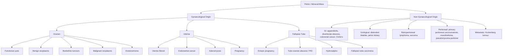
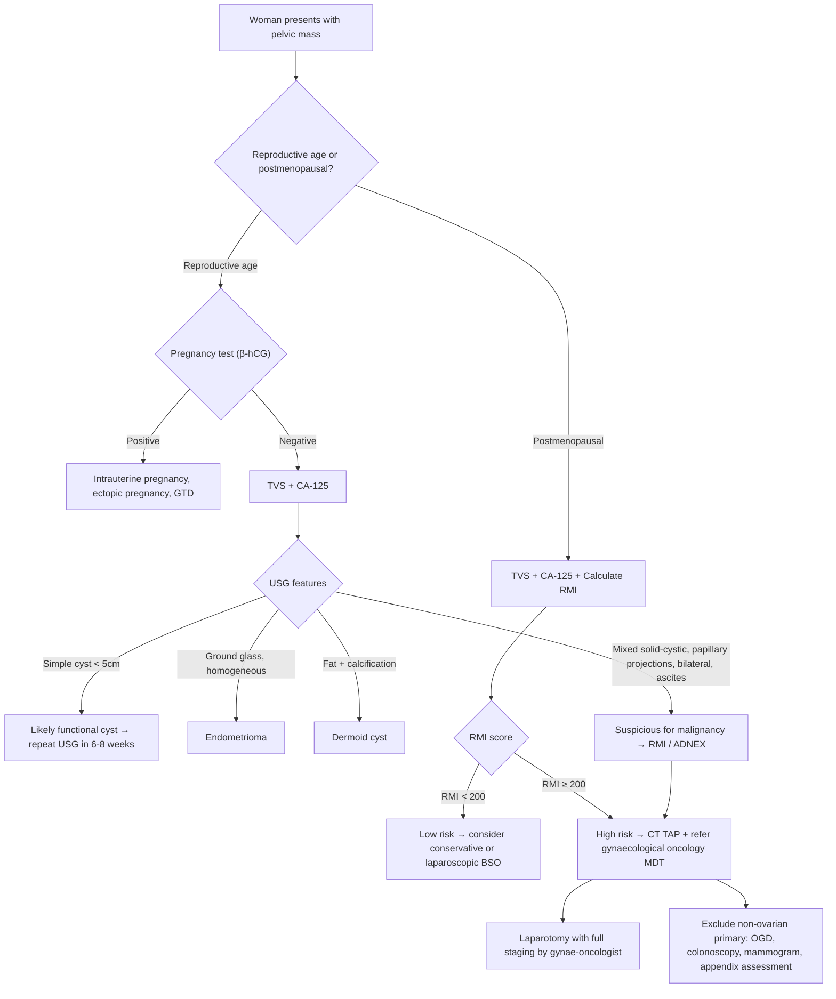

## Differential Diagnosis of Ovarian Cancer

When a patient presents with a **pelvic mass**, **abdominal distension**, **ascites**, or vague lower abdominal/pelvic symptoms, the differential diagnosis is broad. Your job is to systematically think through what structures live in the pelvis and abdomen, what pathologies can arise from each, and how to narrow the list using clinical, biochemical, and radiological clues.

***"Uterine fibroid, ovarian mass and cancer are important differential diagnoses of pelvic mass"*** [7]. ***"History and physical examination usually help to suggest a diagnosis"*** [7].

The key principle: **a pelvic mass in a woman can arise from the ovary, uterus, fallopian tube, bowel, bladder, retroperitoneum, or be a non-gynaecological mimic.** You need to think anatomically and then match the clinical features.

---

### 1. Framework for Differential Diagnosis

The most practical approach is to think by **organ of origin**, then within each organ consider **benign vs. malignant** pathology. The clinical context — particularly **age**, **menopausal status**, **laterality**, **consistency** (cystic vs. solid vs. mixed), and **associated features** (ascites, CA-125, hormonal symptoms) — guides you to the most likely diagnosis.

---

### 2. Differential Diagnosis by Organ of Origin

#### 2.1 Ovarian — Benign Conditions

These are the most important differentials to distinguish from ovarian cancer because they share the same organ of origin.

| Condition | Key Features | How to Distinguish from Ovarian Cancer |
|---|---|---|
| **Functional ovarian cyst** (follicular or corpus luteum) | ***Common in reproductive-age women***. Simple, thin-walled, anechoic on USG. Usually < 5 cm. Resolves spontaneously within 1–3 menstrual cycles. | Age (premenopausal), simple cyst morphology on USG, **resolves on repeat imaging in 6–8 weeks**. No solid component, no ascites. CA-125 normal. ***In the exam scenario with a F/75 and ascites, a functional cyst is very unlikely — postmenopausal ovaries should NOT have functional cysts.*** [6] |
| ***Dermoid cyst (mature cystic teratoma)*** | Most common ovarian tumour overall. Contains mature tissue (hair, teeth, fat). Peak 20–40y. On USG: echogenic areas (fat, calcifications), "tip of the iceberg" sign, Rokitansky nodule. On CT/X-ray: fat + calcification (teeth). | ***Dermoid cyst is in the differential for a pelvic mass in younger women, but USG shows characteristic fat/calcification, not the mixed solid-cystic morphology with ascites seen in ovarian cancer.*** [6] Bilateral in 10%. Risk of torsion. Rarely undergoes malignant transformation (~1–2%, usually squamous cell carcinoma, in older patients). |
| **Endometrioma ("chocolate cyst")** | Endometriosis-derived cyst of the ovary. Homogeneous low-level echoes on USG ("ground glass" appearance). Typically in reproductive-age women with dysmenorrhoea, deep dyspareunia, and infertility. | History of endometriosis symptoms, USG ground-glass appearance, **no solid papillary projections** (unless malignant transformation → clear cell or endometrioid carcinoma). CA-125 can be mildly elevated in endometriosis (a source of false positives for ovarian cancer screening). |
| **Serous/mucinous cystadenoma** | Benign epithelial tumour. Serous: thin-walled, unilocular, anechoic (resembles a simple cyst but larger). Mucinous: can be very large (>20 cm), multilocular with thin septae. | Thin walls, thin septae (< 3 mm), no solid papillary projections, no ascites, normal CA-125. Can be difficult to distinguish from borderline or early malignant tumours — definitive diagnosis is histological. |
| **Fibroma / thecoma** | Solid ovarian tumour. Fibroma: benign, a/w **Meigs syndrome** (ascites + right pleural effusion → mimics ovarian cancer!). Thecoma: oestrogen-producing, endometrial hyperplasia. | Meigs syndrome is an important **mimic** of advanced ovarian cancer — both cause ascites and pleural effusion. However, Meigs syndrome resolves completely after tumour removal. The mass is solid (not mixed cystic-solid). CA-125 can be elevated in Meigs syndrome (peritoneal irritation), further confusing the picture. |

<Callout title="Meigs Syndrome — The Great Mimic" type="error">
Do NOT automatically diagnose advanced ovarian cancer when you see ovarian mass + ascites + pleural effusion. **Meigs syndrome** (ovarian fibroma + ascites + right pleural effusion) is BENIGN and completely curable by removing the fibroma. The ascites and effusion are transudative and resolve postoperatively. Always consider this differential, especially if the mass is **solid** on imaging.
</Callout>

#### 2.2 Ovarian — Borderline and Malignant Conditions

| Condition | Key Features | Distinguishing Points |
|---|---|---|
| **Borderline ovarian tumour** | Epithelial proliferation without stromal invasion. Excellent prognosis (>95% 10y survival for Stage I). Can have peritoneal implants. Mean age 40–50y. USG: papillary projections within a cystic mass, but often less aggressive-appearing than carcinoma. | Younger age than invasive cancer, less ascites, less peritoneal dissemination. **Definitive distinction from invasive carcinoma requires histology.** |
| **Primary ovarian carcinoma** | ***Mixed solid-cystic lesion, bilateral, ascites, omental cake, elevated CA-125*** [6][7]. | This is the index diagnosis. The DDx section focuses on what else could mimic this. |
| ***Krukenberg tumour (metastatic to ovary)*** | **Metastasis to the ovary from another primary** — classically from gastric cancer (signet ring cell adenocarcinoma), but also from colon, breast, and appendix. Bilateral in >80%. Histology: mucin-secreting signet ring cells in ovarian stroma. | ***Crucial DDx***: a bilateral ovarian mass in a woman should always prompt consideration of a GI primary. Look for GI symptoms (dyspepsia, weight loss, change in bowel habit). Do upper and lower GI endoscopy. Appendiceal mucinous tumours can also metastasise to ovaries and must be excluded if mucinous histology is found. |
| **Fallopian tube carcinoma** | Rare primary. Now considered part of the HGSOC spectrum (STIC origin). Presents similarly to ovarian cancer (pelvic mass, ascites). Classic triad: intermittent profuse watery vaginal discharge (hydrops tubae profluens), pelvic pain, pelvic mass. | Clinically almost indistinguishable from ovarian cancer; often grouped together. |
| **Primary peritoneal carcinomatosis** | Serous papillary carcinoma arising from the peritoneum (same Müllerian origin as ovarian surface epithelium). Presents with ascites + peritoneal implants but ovaries may appear **normal or only surface-involved**. | Can occur even after bilateral oophorectomy. Treated the same way as ovarian cancer. Important in BRCA carriers — prophylactic BSO reduces but does NOT eliminate risk of peritoneal cancer. |

#### 2.3 Uterine Conditions

| Condition | Key Features | How to Distinguish |
|---|---|---|
| ***Uterine fibroid (leiomyoma)*** | ***Most common pelvic tumour in women.*** Benign smooth muscle tumour. Can be very large. On pelvic exam: firm, irregular, non-tender midline mass that moves with the cervix. USG: well-defined hypoechoic solid mass **continuous with the myometrium** (key sign). Often multiple. Calcifications common. ***Important DDx of pelvic mass.*** [7] | Fibroids arise from the uterus → mass moves with cervix on bimanual exam. USG clearly shows it arising from the myometrium. No ascites (unless pedunculated subserosal fibroid undergoes torsion/degeneration). CA-125 usually normal (can be slightly raised). ***In the exam vignette: "Uterus cannot be visualised" — this suggests the mass is separate from or replacing the uterus, making fibroid less likely and ovarian cancer more likely.*** [6] |
| **Endometrial cancer** | Postmenopausal bleeding is the hallmark. Mass is intrauterine, not adnexal. USG: thickened endometrium (> 4mm in postmenopausal). | Endometrial cancer presents with vaginal bleeding, not an adnexal mass. However, **synchronous ovarian and endometrial cancer** occurs in ~15–20% of endometrioid ovarian cancers — always check the endometrium. |
| **Adenomyosis** | Diffusely enlarged, boggy, tender uterus. Heavy/painful periods. MRI: ill-defined junctional zone thickening. | Not a discrete mass; diffuse uterine enlargement. Premenopausal. |

#### 2.4 Tubal and Inflammatory Conditions

| Condition | Key Features | How to Distinguish |
|---|---|---|
| **Ectopic pregnancy** | Reproductive-age woman with amenorrhoea, vaginal bleeding, pelvic pain. Positive β-hCG. Adnexal mass (can be complex/haemorrhagic). Can have free fluid (haemoperitoneum). | **Always do a pregnancy test** in any reproductive-age woman with a pelvic mass or acute pelvic pain. β-hCG is the definitive differentiator. |
| **Tubo-ovarian abscess / PID** | Fever, bilateral pelvic pain, purulent vaginal discharge, cervical excitation. Complex adnexal mass on USG. Raised WCC, CRP. | Acute presentation with infectious features. History of multiple sexual partners, STI risk. Responds to antibiotics. |
| **Hydrosalpinx** | Dilated, fluid-filled fallopian tube. Typically sausage-shaped on USG. Often secondary to previous PID or endometriosis. | Tubular morphology on USG (not round like an ovarian mass). No solid component. |

#### 2.5 Non-Gynaecological Conditions

| Condition | Key Features | How to Distinguish |
|---|---|---|
| **Appendiceal pathology** (appendicitis, appendiceal mucocele, appendiceal tumour) | ***Crucial***: appendiceal mucinous tumours are one of the most common causes of **pseudomyxoma peritonei** (gelatinous ascites). Can present as a pelvic mass mimicking ovarian cancer. If mucinous ovarian tumour is found at surgery → **always inspect the appendix** to exclude appendiceal primary. | Right iliac fossa pain (appendicitis), or may be incidental finding. Appendiceal tumours can metastasise to the ovary → the "ovarian mucinous tumour" may actually be secondary. Immunohistochemistry (CK7/CK20 profile) helps determine origin. |
| **Colorectal cancer** | Can present as a pelvic mass (sigmoid or rectal cancer), bowel obstruction symptoms, rectal bleeding, altered bowel habit. Ascites if peritoneal carcinomatosis. ***Metastatic CRC to ovary (Krukenberg)*** is important in the DDx [5]. | PR exam, colonoscopy, CEA, CT imaging shows bowel wall thickening/mass. |
| ***Peritoneal metastases from GI primaries*** | Gastric, pancreatic, colorectal cancers can all cause peritoneal carcinomatosis → ascites + omental cake that can mimic ovarian cancer [5][8]. ***"Ascites suggest peritoneal seedling from GI or gynaecological primary"*** [8]. | Need CT TAP, OGD, colonoscopy to exclude GI primary. Ascitic fluid cytology and cell block immunohistochemistry can help determine the primary site. |
| **Diverticular abscess** | Left iliac fossa pain and mass, fever, raised inflammatory markers. Older patients. | CT shows pericolic abscess with adjacent diverticular disease. |
| **Distended bladder / pelvic kidney** | Can be palpated as a suprapubic/pelvic mass. | Catheterisation resolves a distended bladder. USG easily identifies a pelvic kidney. |
| **Retroperitoneal tumours** (lymphoma, sarcoma) | Para-aortic or pelvic lymphadenopathy from lymphoma. Retroperitoneal sarcoma can present as a large pelvic/abdominal mass. | CT shows mass arising from retroperitoneum, not from the adnexae. Lymphoma: systemic B-symptoms, diffuse lymphadenopathy. |

---

### 3. Key Differentiating Features — Algorithmic Approach

***The Risk of Malignancy Index (RMI)*** is a widely used tool to differentiate benign from malignant ovarian masses, particularly relevant in the UK and Hong Kong practice [7][10]:

***RMI = U × M × CA-125***

Where:
- **U** = Ultrasound score (based on 5 features: multilocular, solid areas, bilateral, ascites, metastases)
  - 0 features = U score 0; 1 feature = U score 1; ≥2 features = U score 3
- **M** = Menopausal status: premenopausal = 1; postmenopausal = 3
- **CA-125** = serum level in U/mL

***If RMI ≥ 200 (some studies use ≥ 250): increased risk of malignancy → refer to gynaecological oncology MDT review*** [7][10].

***Limitation: not all patients with ovarian cancer have an elevated CA-125*** [10] — particularly mucinous, clear cell, and early-stage tumours.

***The ADNEX model*** is an alternative (and more sophisticated) risk prediction model that can ***"reliably distinguish between benign, borderline, stage I invasive, stage II–IV invasive, and secondary metastatic adnexal ovarian tumours"*** [11].

---

### 4. Differentiating Ovarian Masses by Age

Age is one of the most powerful clinical discriminators:

| Age Group | Most Likely Ovarian Pathology | Why |
|---|---|---|
| **Neonates / children** | Functional cysts (maternal hormonal stimulation), germ cell tumours (dysgerminoma, yolk sac tumour, immature teratoma) | Germ cells are most active during development. Functional cysts from transplacental gonadotropin stimulation. |
| **Adolescents / young adults (15–30)** | Functional cysts, dermoid cysts (mature teratoma), germ cell tumours, sex cord–stromal tumours | Dermoid cysts peak incidence. Germ cell tumours are the commonest malignant ovarian tumour in this age group. |
| **Reproductive age (30–45)** | Functional cysts, endometriomas, dermoid cysts, serous/mucinous cystadenomas, borderline tumours | Endometriosis and its complications peak. Borderline tumours often in this age range. |
| ***Peri-/postmenopausal (>50)*** | ***Epithelial ovarian cancer*** (HGSOC), metastatic tumours (Krukenberg), Brenner tumour, fibroma/thecoma | ***Epithelial ovarian cancers are predominantly a disease of postmenopausal women*** [1]. Any new adnexal mass in a postmenopausal woman must be considered malignant until proven otherwise. |

<Callout title="Golden Rule for Postmenopausal Adnexal Mass">
In a postmenopausal woman, functional ovarian cysts should NOT occur (no ovulation). Therefore, **any new adnexal mass in a postmenopausal woman is suspicious for malignancy** and warrants further investigation with CA-125, imaging, and consideration of the RMI/ADNEX model.
</Callout>

---

### 5. Differentiating by Tumour Markers

***CA-125*** is the most important tumour marker for ovarian cancer, but it has significant limitations [9][10]:

| Tumour Marker | Elevated In | Clinical Use / Pitfalls |
|---|---|---|
| ***CA-125*** | ***Malignant: CA ovary (especially serous), primary peritoneal cancer. Benign: endometriosis, ascites, pleural effusion, menses, PID, fibroids, liver disease, pregnancy, heart failure*** [9] | Sensitivity ~80% for advanced serous EOC but only ~50% for Stage I. **Not specific** — elevated in many benign conditions. ***Increase during menses → test done during first half of menstrual cycle*** [9]. Used in RMI calculation. |
| **HE4** (Human Epididymis protein 4) | Ovarian cancer (especially serous and endometrioid). Less likely elevated in endometriosis. | More specific than CA-125 for ovarian cancer; less affected by benign conditions. **ROMA algorithm** (Risk of Ovarian Malignancy Algorithm) combines HE4 + CA-125 + menopausal status. |
| **AFP** | Yolk sac tumour, immature teratoma, HCC, hepatitis, pregnancy [9] | Germ cell tumour marker. If AFP elevated in a young woman with an ovarian mass → think yolk sac tumour. |
| **β-hCG** | Choriocarcinoma, embryonal carcinoma, pregnancy | Always exclude pregnancy first. Non-gestational ovarian choriocarcinoma is rare but produces very high β-hCG. |
| **LDH** | Dysgerminoma, lymphoma | Non-specific but elevated in dysgerminoma. |
| **Inhibin B** | Granulosa cell tumour | Useful marker for sex cord–stromal tumours. |
| **CEA** | CRC, gastric, pancreatic, breast, lung [9] | If CEA is elevated with a mucinous ovarian mass → consider GI primary (appendiceal, colonic) metastasising to the ovary. |
| **CA 19-9** | Pancreatic, biliary, CRC, gastric, ***ovarian (mucinous subtype)*** [9] | Can be elevated in mucinous ovarian tumours but also in many GI primaries. |

<Callout title="CA-125 Pitfalls — Exam Favourite" type="error">
CA-125 is **not diagnostic** of ovarian cancer. Common exam traps:
1. **Endometriosis** can elevate CA-125 → false positive in a premenopausal woman with a pelvic mass.
2. **Early-stage ovarian cancer** (especially mucinous and clear cell) often has **normal CA-125** → false negative.
3. **Non-gynaecological causes** of elevated CA-125: cirrhosis with ascites, peritonitis, heart failure, pleural effusion, pancreatitis.
4. ***"Limitation of this rule → not all patients with ovarian cancer have an elevated CA-125"*** [10].
</Callout>

---

### 6. Differentiating by Imaging Characteristics

***"Pelvic ultrasound is commonly performed"*** [7] as the first-line imaging for a pelvic mass.

| USG Feature | Suggests Benign | Suggests Malignant |
|---|---|---|
| Walls | Thin, smooth | Thick, irregular |
| Content | Anechoic (simple fluid) | ***Mixed solid-cystic*** |
| Septae | Thin (< 3 mm), regular | ***Thick (> 3 mm), irregular*** |
| Papillary projections | Absent | ***Present*** |
| Laterality | Unilateral | ***Bilateral*** |
| Ascites | Absent | ***Present*** |
| Doppler flow | Low resistance, low flow | ***High flow, low resistance index (RI < 0.4)*** |
| Size | < 5 cm (functional cyst) | > 5–10 cm (though benign mucinous can be huge) |

***Specific USG patterns by diagnosis***:

| Diagnosis | USG Appearance |
|---|---|
| **Simple functional cyst** | Thin-walled, anechoic, posterior acoustic enhancement, no septa/solid component |
| **Dermoid cyst** | "Tip of the iceberg" sign, echogenic fat, calcification (teeth/bone), Rokitansky nodule |
| **Endometrioma** | Homogeneous low-level internal echoes ("ground glass"), no solid components |
| **Haemorrhagic cyst** | Complex cystic with reticular (lace-like) internal echoes; resolves on follow-up |
| **Serous cystadenoma** | Unilocular, thin-walled, anechoic (looks like a large simple cyst) |
| **Mucinous cystadenoma** | Multilocular, thin septae, echogenic mucoid content |
| ***Ovarian cancer*** | ***Mixed solid-cystic, thick irregular walls/septae, papillary projections, bilateral, ascites*** [6] |
| **Fibroma** | Solid, hypoechoic, posterior acoustic shadowing |
| **Uterine fibroid** | Arises from myometrium (continuous with uterine wall), well-defined, whorled appearance, may calcify |

---

### 7. Special DDx Considerations in the Hong Kong Context

1. ***Krukenberg tumour***: Gastric cancer is common in East Asia. Any bilateral ovarian mass, especially with GI symptoms, must prompt exclusion of a gastric or colonic primary. ***"Peritoneal mets: ascites, Sister Joseph nodule, IO, Krukenberg's tumour"*** [8].

2. **Tuberculosis**: TB peritonitis can mimic ovarian cancer with ascites, elevated CA-125, peritoneal thickening, and omental cake-like appearance on CT. In Hong Kong, where TB incidence is non-negligible, this is an important DDx. Ascitic fluid analysis (lymphocyte-predominant exudate, elevated ADA) and peritoneal biopsy (caseating granulomas) differentiate TB from malignancy.

3. ***DIC from mucinous tumours***: ***Mucinous tumours (pancreatic, gastric, ovarian) can cause chronic DIC*** (release of pro-coagulation factors, especially tissue factor, from mucin-secreting cells) [12]. This can present with unprovoked VTE as the first manifestation of the underlying malignancy.

---

### 8. Summary Algorithm — Approaching a Pelvic Mass DDx

> ***Management pathway from lecture slides*** [7]: ***Postmenopausal ovarian cyst → Measure CA-125 → TVS + TAS → Calculate RMI → If RMI < 200 and meets low-risk criteria (asymptomatic, simple cyst, < 5 cm, unilocular, unilateral) → conservative management with repeat assessment. If RMI ≥ 200 → CT scan + referral for gynaecological oncology MDT review. High likelihood of ovarian malignancy → laparotomy with full staging procedure by a trained gynaecological oncologist. Low likelihood → pelvic clearance (TAH + BSO + omentectomy + peritoneal cytology) by a suitably trained gynaecologist.***

---

<Callout title="High Yield Summary">

**Differential diagnosis of ovarian cancer** — Think anatomically:

1. **Ovarian benign**: Functional cyst (resolves in 6–8 weeks; should NOT occur postmenopause), dermoid cyst (fat + calcification on imaging), endometrioma (ground glass on USG), serous/mucinous cystadenoma (thin-walled cystic), fibroma (solid; Meigs syndrome mimics advanced ovarian cancer).

2. **Ovarian borderline**: Papillary projections but no stromal invasion. Excellent prognosis. Histological diagnosis.

3. **Ovarian malignant**: Primary EOC (HGSOC most common), germ cell tumours (young women, AFP/β-hCG), sex cord–stromal (granulosa cell tumour → oestrogen → PMB).

4. **Metastatic to ovary**: Krukenberg tumour (gastric, colon, appendix) — bilateral, signet ring cells. Always exclude GI primary with mucinous ovarian masses.

5. **Uterine**: Fibroids (moves with cervix, continuous with myometrium on USG), endometrial cancer (PMB, thickened endometrium).

6. **Tubal**: Ectopic pregnancy (always do β-hCG!), TOA/PID, fallopian tube carcinoma.

7. **Non-gynae**: TB peritonitis (important in HK), appendiceal tumours/pseudomyxoma peritonei, CRC, retroperitoneal tumours, distended bladder.

**Key differentiating tools**: Age, menopausal status, USG morphology, CA-125 (+ HE4), RMI/ADNEX, tumour markers (AFP, β-hCG, inhibin, CEA), CT TAP, endoscopy.

**RMI = U × M × CA-125**. ≥ 200 → refer gynae-oncology MDT.

**Meigs syndrome** (fibroma + ascites + pleural effusion) is a BENIGN mimic of advanced ovarian cancer.

**Postmenopausal adnexal mass = malignant until proven otherwise.**

</Callout>

---

<ActiveRecallQuiz
  title="Active Recall - Differential Diagnosis of Ovarian Cancer"
  items={[
    {
      question: "A 70-year-old postmenopausal woman presents with ascites, a right-sided pleural effusion, and a solid pelvic mass on USG. Name two differential diagnoses and explain how you would distinguish between them.",
      markscheme: "1. Ovarian cancer: mixed solid-cystic mass, bilateral, elevated CA-125, omental cake on CT. 2. Meigs syndrome (ovarian fibroma): solid mass, ascites and pleural effusion are transudative and resolve completely after tumour removal. Fibroma is solid without mixed cystic component. Both can elevate CA-125. CT TAP and histology after surgical excision are definitive."
    },
    {
      question: "What is the RMI (Risk of Malignancy Index)? State its formula, the threshold for concern, and one important limitation.",
      markscheme: "RMI = U (ultrasound score: 0, 1, or 3 based on 5 features) x M (menopausal status: 1 if pre, 3 if post) x CA-125 (U/mL). Threshold: RMI >=200 suggests increased risk of malignancy, refer to gynae-oncology MDT. Key limitation: not all ovarian cancers have elevated CA-125 (especially mucinous, clear cell, and early-stage disease), so a low RMI does not exclude malignancy."
    },
    {
      question: "A 55-year-old woman is found to have bilateral ovarian masses with signet ring cells on histology. What is the diagnosis, what are the most common primary sites, and what investigation should you perform?",
      markscheme: "Krukenberg tumour: metastatic cancer to the ovary, classically with signet ring cells. Most common primaries: gastric cancer (most common), colorectal cancer, appendiceal cancer, breast cancer. Investigations: OGD (to exclude gastric primary), colonoscopy (to exclude CRC), CT TAP for staging, CK7/CK20 immunohistochemistry to determine origin."
    },
    {
      question: "A premenopausal woman with known endometriosis has an adnexal mass and mildly elevated CA-125. Explain why CA-125 is unreliable in this context and state what additional marker may help.",
      markscheme: "CA-125 is elevated in endometriosis due to peritoneal inflammation and mesothelial irritation, causing false positive results. Also elevated during menses, PID, fibroids, and many benign conditions. HE4 (Human Epididymis protein 4) is more specific for ovarian cancer and is less likely to be elevated in endometriosis. The ROMA algorithm (combining CA-125 + HE4 + menopausal status) can improve risk stratification."
    },
    {
      question: "Name three non-gynaecological conditions that can mimic ovarian cancer presentation in Hong Kong, and explain the mechanism for each.",
      markscheme: "1. TB peritonitis: granulomatous inflammation of peritoneum causes ascites (lymphocyte-predominant exudate), elevated CA-125, peritoneal thickening and omental involvement on CT; important in HK due to non-negligible TB incidence. 2. Appendiceal mucinous tumour: can cause pseudomyxoma peritonei (gelatinous ascites from ruptured mucin-secreting tumour) and metastasise to ovaries mimicking primary ovarian mucinous tumour. 3. Colorectal cancer with peritoneal carcinomatosis: causes ascites, omental cake, can metastasise to ovaries (Krukenberg); distinguished by bowel symptoms, CEA elevation, colonoscopy."
    }
  ]}
/>

## References

[1] Lecture slides: GC 112. Abnormal vaginal bleeding Gynaecological cancer.pdf (p19, p37–38; risk factors, oestrogen-secreting tumours)
[5] Senior notes: Ryan Ho GI.pdf (p183; Lynch syndrome extracolonic tumours including ovary, cancer screening)
[6] Senior notes: Ryan Ho Radiology.pdf (p39; Exam question M18 Rotation 3 — F/75 pelvic mass, ascites, mixed solid-cystic lesion = ovarian cancer; DDx including dermoid cyst, functional cyst, uterine fibroma, endometriosis)
[7] Lecture slides: GC 118. Pelvic mass ovarian cancer and cysts; uterine fibroid; pelvic imaging.pdf (p68, p71; postmenopausal ovarian cyst algorithm, RMI, management pathway, summary)
[8] Senior notes: Ryan Ho GI.pdf (p84; Krukenberg tumour, peritoneal metastases, Sister Joseph nodule, ascites from GI primary; p279 liver metastasis ascites from peritoneal seedling)
[9] Senior notes: Maksim Medicine Notes.pdf (p337; tumour markers — CA-125, AFP, CEA, CA 19-9, HCG)
[10] Lecture slides: Block C - Pelvic mass_ ovarian cancer and cysts; uterine fibroid; pelvic imaging.pdf (p40; RMI, limitation of CA-125)
[11] Lecture slides: GC 118. Pelvic mass ovarian cancer and cysts; uterine fibroid; pelvic imaging.pdf (p60; ADNEX model)
[12] Senior notes: Ryan Ho Haemtology.pdf (p137–138; DIC from mucinous tumours including ovarian, chronic DIC)
