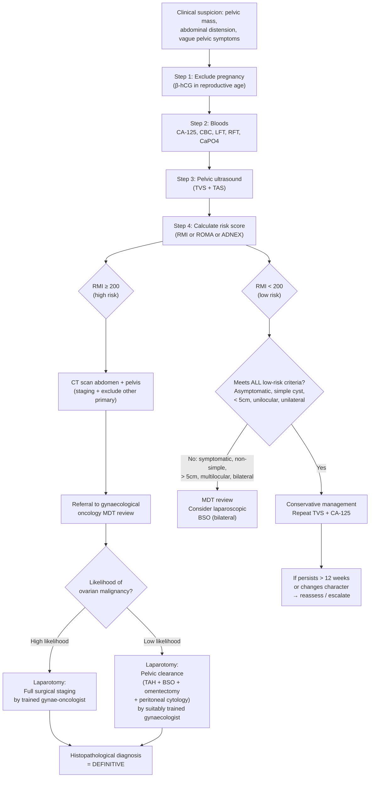

## Diagnosis of Ovarian Cancer — Criteria, Algorithm, and Investigations

### The Core Principle: There Is No Single "Diagnostic Criterion" — Diagnosis Is a Multi-Step Process

Unlike conditions such as rheumatoid arthritis or SLE where you can tick off classification criteria, ovarian cancer does not have a set of "diagnostic criteria" in that sense. Instead, the diagnosis is reached through a **systematic pathway** that integrates:

1. **Clinical suspicion** (symptoms, signs, risk factors)
2. **Biochemical markers** (CA-125, HE4, others depending on suspected subtype)
3. **Imaging** (ultrasound → CT → MRI/PET-CT)
4. **Risk stratification models** (RMI, ROMA, ADNEX)
5. **Histopathological confirmation** (the definitive diagnosis — always requires tissue)

***"Ovarian cancer is the silent killer — so any symptoms generally suggestive of a late disease"*** [7][10]. This means you must have a **low threshold for investigation** in any woman — especially postmenopausal — with persistent vague abdominal/pelvic symptoms.

The definitive diagnosis is **always histological**, obtained either at surgical staging laparotomy or, in cases where primary surgery is not feasible, from image-guided biopsy or ascitic fluid cytology.

---

### 1. Risk Stratification Models — Deciding Who Needs Urgent Referral

These models exist because you cannot take every woman with an adnexal mass straight to laparotomy. You need a way to triage: who can be observed, who needs a gynaecologist, and who needs a **gynaecological oncologist**. This distinction matters because outcomes are significantly better when ovarian cancer surgery is performed by a trained gynae-oncologist.

#### 1.1 Risk of Malignancy Index (RMI)

***RMI is more commonly used in the UK*** and in Hong Kong practice [10].

**Formula**: ***RMI = U × M × CA-125*** [7][10]

| Component | Score | Explanation |
|---|---|---|
| **U = Ultrasound morphology score** | Score 1 point for each: multilocular, solid areas, bilateral, ascites, metastases | 0 features = U score **0**; 1 feature = U score **1**; ≥ 2 features = U score **3** |
| **M = Menopausal status** | Premenopausal = **1**; Postmenopausal = **3** | ***Postmenopausal age scores 3*** because any adnexal mass in a postmenopausal woman is inherently more suspicious [10] |
| **CA-125** | Absolute value in U/mL | Continuous variable, multiplied directly |

***Interpretation***:
- ***RMI < 200: low risk of malignancy*** [7]
- ***RMI ≥ 200 (some studies use ≥ 250): increased risk of malignancy → patient must be referred to gynaecological oncology MDT review*** [7][10]

**Why these components?** Each captures a different dimension of risk:
- **Ultrasound** morphology captures the structural features that distinguish benign from malignant masses (solid components, bilateral involvement, and ascites all correlate with malignancy).
- **Menopausal status** is a powerful prior probability modifier — a functional cyst in a 30-year-old is common and benign; the same-looking cyst in a 65-year-old is abnormal by definition.
- **CA-125** adds biochemical data. While imperfect alone, when combined with the other two components, it significantly improves discrimination.

**Performance**: Sensitivity ~78%, Specificity ~87% at the ≥ 200 threshold. This is acceptable for triage but not for definitive diagnosis.

***"Limitation of this rule → not all patients with ovarian cancer have an elevated CA-125"*** [10]. This is particularly true for:
- **Mucinous carcinoma** (~50% have normal CA-125)
- **Clear cell carcinoma** (variable CA-125 elevation)
- **Early-stage disease** (~50% of Stage I have normal CA-125)
- **Germ cell and sex cord–stromal tumours** (CA-125 is an epithelial marker)

<Callout title="RMI Worked Example" type="idea">
A 65-year-old postmenopausal woman has a bilateral adnexal mass with solid areas and ascites on USG. Her CA-125 is 350 U/mL.

- U score: bilateral (1) + solid areas (1) + ascites (1) = 3 features → U = **3**
- M score: postmenopausal → M = **3**
- CA-125 = **350**
- **RMI = 3 × 3 × 350 = 3150** → ***far exceeds 200 → urgent referral to gynae-oncology MDT***
</Callout>

#### 1.2 ROMA Algorithm (Risk of Ovarian Malignancy Algorithm)

ROMA combines **CA-125 + HE4 + menopausal status** using a logistic regression formula to calculate a predicted probability of malignancy.

- **HE4** (Human Epididymis protein 4) is a glycoprotein overexpressed in ovarian cancer (especially serous and endometrioid subtypes). Its advantage over CA-125: it is **less frequently elevated in benign conditions** (endometriosis, fibroids, PID), so it improves specificity.
- ROMA is particularly useful in **premenopausal women** where CA-125 false positives are more common.
- Thresholds differ by menopausal status: premenopausal ≥ 11.4% = high risk; postmenopausal ≥ 29.9% = high risk (values may vary by assay).

#### 1.3 IOTA / ADNEX Model

***The ADNEX model (Assessment of Different NEoplasias in the adneXa) is a risk prediction model that can reliably distinguish between benign, borderline, stage I invasive, stage II–IV invasive, and secondary metastatic adnexal ovarian tumours*** [11].

The ADNEX model uses **ultrasound-based parameters** (from the IOTA — International Ovarian Tumour Analysis — group):
- Patient age
- Serum CA-125 level
- Maximum lesion diameter
- Proportion of solid tissue
- Number of papillary projections
- More than 10 cyst locules
- Acoustic shadows
- Ascites
- Type of centre (oncology centre or not)

**Why is ADNEX superior to RMI?** It provides **multi-class probabilities** (not just benign vs. malignant) — it separately estimates probabilities for benign, borderline, stage I invasive, stage II–IV invasive, and secondary metastatic, allowing more nuanced management decisions.

---

### 2. The Diagnostic Algorithm

The following algorithm integrates the lecture slide pathway for postmenopausal ovarian cysts [7] with the broader approach for all adnexal masses.

> ***From lecture slides [7]: Postmenopausal ovarian cyst (cystic lesion ≥ 1cm) → Measure CA-125 → TVS + TAS → Calculate RMI. If RMI < 200: low risk — if asymptomatic, simple, < 5cm, unilocular, unilateral → conservative management with repeat assessment (CA-125, TVS + TAS). If symptomatic, non-simple, > 5cm, multilocular, or bilateral → MDT review → consider laparoscopic BSO (usually bilateral). If RMI ≥ 200: increased risk → CT scan (abdomen and pelvis) → referral for gynaecological oncology MDT. High likelihood of malignancy → laparotomy with full staging procedure by a trained gynaecological oncologist. Low likelihood → laparotomy with pelvic clearance (TAH + BSO + omentectomy + peritoneal cytology) by a suitably trained gynaecologist.***

---

### 3. Investigation Modalities — Detailed Breakdown

#### 3.1 Baseline Blood Tests

| Investigation | Rationale | Key Findings / Interpretation |
|---|---|---|
| **CBC** | Assess for anaemia (chronic disease, nutritional), thrombocytosis (paraneoplastic — common in ovarian cancer, correlates with advanced stage), leukocytosis | Normocytic normochromic anaemia of chronic disease. Thrombocytosis (platelet > 400) is a poor prognostic marker — IL-6 from tumour stimulates hepatic thrombopoietin production. |
| **LFT** | Assess for liver metastasis, nutritional status (albumin), biliary obstruction (if omental disease compresses porta hepatis) | ↑ALP, ↑GGT suggests liver mets or biliary compression. ↓Albumin reflects poor nutrition / chronic disease (also leaks into ascitic fluid). |
| **RFT / electrolytes** | Baseline renal function (hydronephrosis from pelvic mass obstructing ureters; pre-chemotherapy baseline), electrolyte derangement | ↑Creatinine may indicate ureteric obstruction. Pre-chemo baseline essential for cisplatin/carboplatin (nephrotoxic). |
| **CaPO4** | ***Hypercalcaemia can occur in ovarian cancer — ectopic PTHrP production, particularly in small cell carcinoma of the ovary*** [13] | ***"Ectopic PTHrP production, eg. CA lung, HCC, CA breast, small cell CA ovary"*** [13]. Also assess bone metastasis. |
| **Coagulation screen** | Baseline (pre-surgery), DIC screening (mucinous tumours are a cause of chronic DIC) | ↑PT, ↑aPTT, ↓fibrinogen, ↑D-dimer → DIC. Even without overt DIC, a hypercoagulable state is common → VTE prophylaxis critical. |
| **β-hCG** | **Exclude pregnancy** in reproductive-age women (always first step!). Also a tumour marker for ovarian germ cell tumours (choriocarcinoma, embryonal carcinoma) [9] | Positive → pregnancy vs. gestational trophoblastic disease vs. germ cell tumour (non-gestational choriocarcinoma). |

#### 3.2 Tumour Markers

This is a critical topic and highly examinable [9].

| Marker | Primary Use in Ovarian Cancer | Normal Range | Pitfalls / Interpretation |
|---|---|---|---|
| ***CA-125*** | ***Most important marker for epithelial ovarian cancer (especially serous). Used for: (1) aid diagnosis, (2) calculate RMI, (3) monitor treatment response, (4) detect recurrence*** [7][9][10] | < 35 U/mL | ***Elevated in benign conditions: endometriosis, ascites, pleural effusion, menses, PID, fibroids, liver disease, pregnancy*** [9]. ***Increase during menses → test done during first half of menstrual cycle*** [9]. Sensitivity ~80% for advanced serous but only ~50% for Stage I. Normal in ~50% of mucinous/clear cell carcinomas. |
| **HE4** | Complementary to CA-125. Better specificity (less affected by endometriosis, fibroids). Used in ROMA algorithm. | Varies by age/menopause | Elevated in ovarian cancer (serous > endometrioid). Less useful for mucinous and germ cell tumours. Combined with CA-125 in ROMA for improved triage. |
| **AFP** | ***Germ cell tumour marker: yolk sac tumour (endodermal sinus tumour), immature teratoma, embryonal carcinoma. Also HCC, hepatitis*** [9] | < 20 mcg/L (***Pregnancy: ≤500 mcg/L***) [9] | If elevated in a young woman with an ovarian mass → strongly suggests germ cell tumour. Must exclude pregnancy. |
| **β-hCG** | ***Germ cell tumours: choriocarcinoma (very high), embryonal carcinoma. Also pregnancy, molar pregnancy*** [9] | Negative in non-pregnant | Non-gestational ovarian choriocarcinoma produces extremely high β-hCG. Dysgerminoma with syncytiotrophoblastic giant cells may produce low levels. |
| **LDH** | Dysgerminoma (elevated), also non-specific for tissue turnover | Varies by lab | Non-specific. Useful as part of the germ cell tumour panel (AFP + β-hCG + LDH). ***AFP, HCG, LDH used for prognostication in germ cell tumours (NSGCT)*** [9]. |
| **Inhibin B / AMH** | ***Sex cord–stromal tumours: granulosa cell tumour (inhibin B), also AMH*** | Varies | Highly specific for granulosa cell tumour. Useful for monitoring recurrence. |
| **CEA** | ***Mucinous tumours (can be elevated). Also CRC, gastric, breast, lung*** [9] | < 3 mcg/L (non-smoker) | If elevated with mucinous ovarian mass → consider GI primary (appendix, colon) metastasising to ovary (Krukenberg). ***Benign conditions rarely > 10 mcg/L*** [9]. |
| **CA 19-9** | ***Mucinous ovarian tumours. Also pancreatic, biliary, CRC, gastric*** [9] | < 37 U/mL | Non-specific. Useful adjunct for mucinous subtype. Not produced by individuals who are Lewis antigen negative (~5–10% of population → false negative). |

<Callout title="Tumour Marker Panel — Choose Based on Clinical Scenario">

- **Postmenopausal woman + adnexal mass**: CA-125 (± HE4) → think epithelial ovarian cancer
- **Young woman (< 30) + adnexal mass**: AFP + β-hCG + LDH + CA-125 → think germ cell tumour
- **Any age + virilisation or postmenopausal bleeding with adnexal mass**: Inhibin B, oestradiol, testosterone → think sex cord–stromal tumour
- **Mucinous mass + GI symptoms**: CEA + CA 19-9 + CA-125 → exclude GI primary

</Callout>

#### 3.3 Imaging — First Line: Pelvic Ultrasound

***"Pelvic ultrasound is commonly performed"*** [7] and is ***"Demonstrate a basic understanding in pelvic ultrasound examination of the common pelvic pathology"*** — a learning objective [2].

**Transvaginal ultrasound (TVS)** is the **gold standard first-line imaging** for evaluating adnexal masses because it provides the highest resolution for pelvic structures (the transducer is close to the adnexae). **Transabdominal scanning (TAS)** is added to assess large masses that extend beyond the TVS field of view, and to survey the upper abdomen for ascites, omental disease, and liver lesions.

***Both TVS and TAS should be performed*** [7].

| USG Feature | What It Tells You | Interpretation |
|---|---|---|
| **Morphology** (cystic/solid/mixed) | Tissue composition of the mass | Pure cystic = likely benign; ***mixed solid-cystic = suspicious*** [6]; solid = could be fibroma, thecoma, or malignant |
| **Wall thickness** | Regularity of tumour capsule | Thin smooth walls = benign; ***thick irregular walls = malignant*** |
| **Septae** | Internal architecture of cystic lesions | Thin (< 3mm) regular septae = likely benign cystadenoma; ***thick (> 3mm) irregular septae = suspicious*** |
| **Papillary projections** | Solid tissue projecting into cyst cavity | ***Present = suspicious for malignancy*** (represent areas of proliferating tumour growing into the cyst) |
| **Laterality** | Unilateral vs. bilateral | ***Bilateral = more suspicious for malignancy*** (or metastatic: Krukenberg) |
| **Ascites** | Free fluid in pelvis / abdomen | ***Ascites with a complex adnexal mass = highly suspicious for ovarian cancer*** |
| **Colour Doppler** | Vascularity and blood flow pattern | ***Low resistance index (RI < 0.4) with high diastolic flow = neovascularisation of malignancy*** (tumour vessels lack smooth muscle → low resistance). Benign masses have high-resistance flow. |
| **Pouch of Douglas** | Most dependent part of peritoneum | ***Deposits/nodularity in the pouch of Douglas = peritoneal carcinomatosis*** [7] |

**Specific USG patterns in common ovarian pathologies:**

| Diagnosis | Classic USG Appearance |
|---|---|
| Simple / functional cyst | Thin-walled, anechoic, posterior acoustic enhancement, no internal echoes |
| Dermoid cyst | Echogenic component (fat/hair), "dermoid plug" (Rokitansky nodule), "tip of the iceberg" sign, ± teeth (strong acoustic shadow) |
| Endometrioma | Homogeneous low-level internal echoes ("ground glass" appearance), no solid projections |
| Haemorrhagic cyst | Complex: reticular/fishnet pattern of fibrin strands; resolves on follow-up in 6–8 weeks |
| Serous cystadenoma | Unilocular, thin-walled, anechoic (large simple cyst) |
| Mucinous cystadenoma | Multilocular with thin septae, mucoid content (low-level echoes in locules, "stained glass" appearance) |
| ***Ovarian cancer*** | ***Mixed solid-cystic, thick irregular septae, papillary projections, bilateral, ascites, low-resistance Doppler flow*** [6] |
| Fibroma | Solid, hypoechoic, may show posterior acoustic shadowing |

> ***Exam question recall [6]: "F/75 complained of increasing abdominal girth. PE found abdominal mass arising from pelvis and ascites. USG abdomen found mixed solid-cystic lesion at pelvis and ascites. Uterus cannot be visualised. → Most likely diagnosis: Ovarian cancer."***

> ***Exam question recall [6]: "PV detect Left adnexal mass. The patient has urinary incontinence, which investigation is most appropriate? → Transvaginal US"*** [14]

<Callout title="TVS vs. TAS — When to Use Which" type="idea">
**TVS** is superior for characterising adnexal masses (higher frequency probe → better resolution for small structures). **TAS** is needed for large masses that extend beyond the pelvis, and for surveying the upper abdomen (ascites, liver, omentum). ***In practice, always do BOTH TVS + TAS*** [7].
</Callout>

#### 3.4 Imaging — Staging: CT Scan of Abdomen and Pelvis

***CT scan is performed when RMI ≥ 200 (or when malignancy is suspected)*** [7] and serves two purposes:
1. **Staging**: assess extent of peritoneal disease, lymph node involvement, distant metastases
2. **Surgical planning**: determine resectability (can optimal cytoreduction be achieved?)

| CT Finding | Significance |
|---|---|
| **Pelvic mass** — solid/cystic components, enhancement pattern | Characterises the tumour. Arterial-phase enhancement of solid components supports malignancy. |
| **Ascites** | Peritoneal carcinomatosis. Volume and distribution help plan surgery. |
| ***Omental cake*** | Tumour-infiltrated omentum — appears as a thickened, nodular sheet of tissue anterior to the bowel. Hallmark of Stage III disease. |
| **Peritoneal implants** | Nodular peritoneal thickening, especially in the pouch of Douglas, paracolic gutters, subdiaphragmatic surfaces, mesentery. |
| **Liver surface deposits** | Liver capsule/surface involvement = Stage IIIC (peritoneal spread). Liver **parenchymal** metastasis = Stage IVB. |
| **Lymphadenopathy** | Pelvic (iliac) and para-aortic nodes. Enlarged nodes (> 1cm short axis) suggest metastasis → Stage IIIA1 if retroperitoneal nodes only. |
| **Pleural effusion** | Needs cytological confirmation to stage as IVA. Seen on CT as fluid in the pleural space. |
| **Hydronephrosis** | Ureteric obstruction by pelvic mass or retroperitoneal nodes. |
| **Bowel involvement** | Thickening, obstruction, mesenteric implants — important for surgical planning. |

**CT also excludes non-ovarian primaries**: look for gastric wall thickening (Krukenberg), colonic mass, appendiceal lesion, pancreatic mass, breast mass (if CT includes chest).

#### 3.5 Imaging — MRI Pelvis

MRI is **not routinely first-line for all ovarian masses** but is used in specific situations:

| Indication | Why MRI? |
|---|---|
| **Indeterminate adnexal mass on USG** | MRI has the best soft tissue contrast resolution for characterising complex adnexal masses — can differentiate endometrioma from haemorrhagic cyst from malignancy when USG is unclear. |
| **Local staging** | Excellent for assessing local invasion (parametrial, bladder, rectum) — analogous to its role in cervical and rectal cancer. ***"MRI is the best modality for... local spread"*** [15] |
| **Young patient / fertility-sparing considerations** | To better characterise the mass and plan surgery when preservation of the contralateral ovary is being considered. |
| **Pregnancy** | No ionising radiation → safe alternative to CT for staging in pregnant women with an ovarian mass. |

**Key MRI features of ovarian cancer**: solid enhancing components (T1 post-gadolinium), restricted diffusion on DWI (high cellularity), ascites, peritoneal enhancement.

#### 3.6 Imaging — PET/CT

***PET/CT is indicated for diagnosis, staging, restaging and monitoring of treatment in ovarian cancer*** [16].

| Role | Explanation |
|---|---|
| **Initial staging** | PET/CT has higher sensitivity than CT alone for detecting peritoneal deposits, lymph node metastases, and extra-abdominal disease. Most useful for detecting occult distant disease that changes management. |
| **Restaging / recurrence** | When CA-125 rises during follow-up but conventional imaging is negative → PET/CT can detect small-volume recurrence. |
| **Monitoring treatment response** | Metabolic response (FDG avidity decrease) may precede anatomical response. |
| **Limitation** | Mucinous tumours may have low FDG avidity. Small peritoneal implants (< 1cm) may be below PET resolution. |

***Radiopharmaceutical: 18F-FDG (most commonly used)*** [16]. FDG is a glucose analogue taken up by metabolically active cells (cancer cells have upregulated GLUT transporters and hexokinase) → trapped intracellularly → detected by PET scanner.

#### 3.7 Ascitic Fluid Analysis

When ascites is present, **paracentesis** provides both diagnostic and symptomatic benefit:

| Test | Purpose | Findings in Ovarian Cancer |
|---|---|---|
| **Cytology** | **The most important test on ascitic fluid** — can confirm malignancy and sometimes suggest histological subtype | Positive for malignant cells (adenocarcinoma). Cell block can be stained for immunohistochemistry (WT1+, PAX8+ → supports Müllerian/ovarian origin). |
| **Protein / albumin / SAAG** | Differentiate exudate vs. transudate; SAAG (Serum-Ascites Albumin Gradient) < 11 g/L = exudate (peritoneal carcinomatosis) vs. > 11 g/L = portal hypertension | Ovarian cancer → **exudative** ascites (SAAG < 11), high protein, high LDH. |
| **Cell count** | Differential: neutrophils (infection) vs. lymphocytes (TB, malignancy) | Malignant ascites: variable, but often mononuclear-predominant. |
| **Glucose, LDH** | Supports exudate vs. transudate; very low glucose suggests infection or malignancy | Low glucose, high LDH in malignant ascites. |
| **ADA (adenosine deaminase)** | **To exclude TB peritonitis** — important DDx in Hong Kong | ADA > 39 U/L highly suggestive of TB peritonitis. Normal in ovarian cancer. |
| **Tumour markers in fluid** | CA-125, CEA in ascitic fluid | Very high CA-125 in ascites from ovarian cancer. High CEA suggests GI primary. |

<Callout title="Ascitic Cytology — Stage Implications" type="error">
If ascitic/peritoneal washing cytology is positive for malignant cells, this is at minimum **Stage IC3** (if tumour is otherwise confined to ovaries) or higher. Do NOT forget to send peritoneal washings at the time of surgery — it changes staging!
</Callout>

#### 3.8 Histopathological Diagnosis — The Gold Standard

**No ovarian cancer treatment should be initiated without histological confirmation** (except in rare emergencies).

| Method | When Used | Notes |
|---|---|---|
| ***Laparotomy with surgical staging*** | ***Gold standard for suspected ovarian malignancy***. Performed when RMI ≥ 200 / high clinical suspicion [7] | Provides tissue for diagnosis AND simultaneously achieves staging and debulking. The preferred approach. |
| **Image-guided core biopsy** (CT or USS-guided) | When primary debulking surgery is not immediately feasible (e.g., too unwell, unresectable disease, need neoadjuvant chemotherapy) | Provides histology and molecular profiling (e.g., BRCA status, HRD status) to guide neoadjuvant treatment. Usually a peritoneal deposit or omental cake is biopsied. |
| **Ascitic fluid cytology** (paracentesis) | When ascites is present and patient is not fit for immediate surgery | Can confirm malignancy. Cell block allows immunohistochemistry. May be sufficient to start neoadjuvant chemo if clinical picture is clear. |
| **Laparoscopic biopsy** | Occasionally used for tissue diagnosis and assessment of resectability | Allows visual assessment of peritoneal disease load and targeted biopsy. Risk of port-site metastasis (tumour implanting at trocar sites) is a concern. |
| **Frozen section** (intraoperative) | Used during surgery when the nature of the mass is uncertain | Allows the surgeon to decide intraoperatively whether to proceed with full staging (if malignant) or conservative surgery (if benign/borderline). Accuracy ~90%, but false negatives occur, especially with mucinous and borderline tumours → final paraffin section is definitive. |

**Key histological features** that the pathologist reports:

| Feature | Clinical Relevance |
|---|---|
| **Histological subtype** | Determines prognosis and treatment (e.g., HGSOC vs. clear cell vs. mucinous — very different biology). |
| **Grade** | Low-grade vs. high-grade (for serous). Grading system differs by subtype. HGSOC is by definition high-grade. |
| **TP53 immunohistochemistry** | Overexpression (diffuse strong) or complete absence (null pattern) = abnormal → supports HGSOC. Wild-type pattern → consider low-grade serous or other subtype. |
| **WT1, PAX8** | Müllerian lineage markers — positive in ovarian serous carcinoma, negative in GI primaries → helps distinguish primary ovarian from metastatic. |
| **Mismatch repair proteins (MLH1, MSH2, MSH6, PMS2)** | Loss of expression → suspect Lynch syndrome → germline testing. Important for endometrioid and clear cell subtypes. |
| **BRCA1/2 status** | Germline or somatic testing — determines eligibility for PARP inhibitors and has prognostic value. All HGSOC patients should have BRCA testing. |
| **HRD (Homologous Recombination Deficiency) score** | Genomic instability score — predicts response to PARP inhibitors even in BRCA-wild type tumours. Increasingly standard in molecular profiling. |

#### 3.9 Additional Investigations to Exclude Other Primaries

***When an ovarian mass is found, especially if bilateral or mucinous, always consider excluding a non-ovarian primary*** [7][8]:

| Investigation | Target Primary | When to Order |
|---|---|---|
| **OGD (upper endoscopy)** | Gastric cancer (Krukenberg tumour) | Bilateral ovarian mass, signet ring histology, GI symptoms, East Asian population |
| **Colonoscopy** | Colorectal cancer | GI symptoms, elevated CEA, mucinous histology, synchronous colon and ovarian masses |
| **Mammogram** | Breast cancer (metastatic to ovary) | History of breast symptoms, bilateral ovarian mass |
| **Appendicectomy / appendix inspection** | Appendiceal mucinous tumour → pseudomyxoma peritonei | **Always inspect the appendix at laparotomy** for any mucinous ovarian tumour — it may be the actual primary |
| **CXR** | Lung mets, pleural effusion, TB | Baseline for all patients |

#### 3.10 Genetic Testing

All patients with **epithelial ovarian cancer** (especially high-grade serous) should be offered **BRCA1/2 germline testing** regardless of family history, because:
1. ~15% of HGSOC harbour germline BRCA mutations (many without a significant family history)
2. BRCA-positive tumours respond to **PARP inhibitors** (olaparib, niraparib, rucaparib)
3. Implications for family members (cascade testing) and cancer screening [4]

Somatic BRCA testing and HRD scoring on the tumour tissue are increasingly performed to identify patients who may benefit from PARP inhibitors even without germline mutations (~7% have somatic BRCA mutations, ~50% overall have some form of HRD).

Consider **Lynch syndrome screening** (MMR IHC on tumour) in endometrioid and clear cell ovarian cancers [5].

---

### 4. Summary — The Diagnostic Workup at a Glance

| Step | Investigation | Purpose |
|---|---|---|
| **1. Exclude pregnancy** | β-hCG | Mandatory in all reproductive-age women |
| **2. Bloods** | CBC, LFT, RFT, CaPO4, coag | Baseline + metastatic workup |
| **3. Tumour markers** | CA-125 (all), ± HE4, ± AFP/β-hCG/LDH (young), ± inhibin (suspected stromal), ± CEA/CA19-9 (mucinous) | Aid diagnosis, risk stratification, monitor response |
| **4. First-line imaging** | ***TVS + TAS*** | Characterise the mass, assess for ascites, provide data for RMI/ADNEX |
| **5. Risk stratification** | ***RMI, ROMA, or ADNEX*** | Triage: observe vs. operate vs. refer gynae-oncology |
| **6. Staging imaging** | ***CT abdomen + pelvis (if RMI ≥ 200)*** | Peritoneal disease, nodes, distant mets, surgical planning |
| **7. Additional imaging** | MRI (indeterminate mass), PET/CT (staging/recurrence) | Problem-solving, detect occult disease |
| **8. Tissue diagnosis** | ***Laparotomy with surgical staging (preferred)*** or image-guided biopsy / ascitic cytology | **Definitive histological diagnosis** |
| **9. Molecular profiling** | BRCA1/2 (germline + somatic), HRD, MMR IHC | Guide targeted therapy (PARP inhibitors), identify hereditary syndromes |
| **10. Exclude other primary** | OGD, colonoscopy, mammogram, appendix inspection | If bilateral, mucinous, or atypical features |

---

<Callout title="High Yield Summary">

**There are no standalone diagnostic criteria for ovarian cancer — diagnosis is a multi-step pathway culminating in histological confirmation.**

**Risk stratification**: RMI = U × M × CA-125 (≥ 200 = high risk → refer gynae-oncology MDT). Limitation: not all ovarian cancers elevate CA-125. ADNEX model gives multi-class probabilities. ROMA (CA-125 + HE4 + menopausal status) improves specificity in premenopausal women.

**First-line imaging**: TVS + TAS (always both). Look for mixed solid-cystic morphology, thick irregular septae, papillary projections, bilateral involvement, ascites, low-resistance Doppler flow.

**Staging imaging**: CT abdomen + pelvis. Look for omental cake, peritoneal implants, lymphadenopathy, pleural effusion, liver deposits.

**Tumour markers by scenario**:
- Postmenopausal + adnexal mass → CA-125 (± HE4)
- Young woman + ovarian mass → AFP + β-hCG + LDH + CA-125
- Virilisation / PMB with mass → inhibin, oestradiol, testosterone
- Mucinous mass → CEA + CA 19-9 (exclude GI primary)

**Definitive diagnosis = histology**: preferably at surgical staging laparotomy. If surgery not feasible → image-guided biopsy or ascitic cytology.

**All epithelial ovarian cancers (especially HGSOC) → BRCA testing + consider HRD scoring.** Endometrioid/clear cell → MMR IHC (Lynch screening).

**Always inspect the appendix** if mucinous tumour is found. Always send peritoneal washings for cytology at surgery.

</Callout>

---

<ActiveRecallQuiz
  title="Active Recall - Diagnosis of Ovarian Cancer"
  items={[
    {
      question: "State the RMI formula, define each component and its scoring, and explain what an RMI of 450 means clinically.",
      markscheme: "RMI = U x M x CA-125. U = ultrasound score (0 features = 0, 1 feature = 1, >=2 features = 3) based on 5 criteria (multilocular, solid areas, bilateral, ascites, metastases). M = menopausal status (pre = 1, post = 3). CA-125 = absolute value in U/mL. RMI 450 exceeds 200 threshold, indicating increased risk of malignancy. Patient should have CT abdomen + pelvis and be referred to gynaecological oncology MDT."
    },
    {
      question: "A 22-year-old woman presents with a unilateral adnexal mass. Which tumour markers should you check and why?",
      markscheme: "AFP (yolk sac tumour, immature teratoma), beta-hCG (choriocarcinoma, embryonal carcinoma, and to exclude pregnancy), LDH (dysgerminoma), and CA-125 (epithelial tumours, though rare at this age). In young women, germ cell tumours are the most common malignant ovarian tumours, hence the AFP/beta-hCG/LDH panel is essential. Also check inhibin if sex cord-stromal tumour is suspected."
    },
    {
      question: "List three key limitations of CA-125 as a diagnostic marker for ovarian cancer.",
      markscheme: "1. Poor sensitivity for early-stage disease (only 50% of Stage I tumours have elevated CA-125). 2. Poor specificity: elevated in many benign conditions including endometriosis, fibroids, PID, ascites, pleural effusion, menses, liver disease, pregnancy. 3. Not elevated in all subtypes: mucinous and clear cell carcinomas frequently have normal CA-125. Also germ cell and sex cord-stromal tumours do not reliably elevate CA-125."
    },
    {
      question: "Describe the postmenopausal ovarian cyst management algorithm from the lecture slides, starting from a cystic lesion found on imaging.",
      markscheme: "Measure CA-125 then perform TVS + TAS. Calculate RMI. If RMI <200 (low risk): assess if meets ALL low-risk criteria (asymptomatic, simple cyst, <5cm, unilocular, unilateral) - if yes, conservative management with repeat assessment; if no (symptomatic, non-simple, >5cm, multilocular, bilateral) - MDT review, consider laparoscopic BSO. If RMI >=200 (high risk): CT abdomen and pelvis, refer to gynae-oncology MDT. High likelihood of malignancy: laparotomy with full staging by trained gynae-oncologist. Low likelihood: pelvic clearance (TAH + BSO + omentectomy + peritoneal cytology) by suitably trained gynaecologist."
    },
    {
      question: "Why should all patients with high-grade serous ovarian cancer undergo BRCA testing, and what is the therapeutic implication?",
      markscheme: "Approximately 15% of HGSOC have germline BRCA1/2 mutations, and an additional 7% have somatic BRCA mutations, often without significant family history. BRCA mutations cause homologous recombination deficiency. Therapeutic implication: PARP inhibitors (olaparib, niraparib, rucaparib) exploit synthetic lethality - when both HR repair (BRCA) and single-strand break repair (PARP) are non-functional, cancer cells accumulate lethal DNA damage and die. Additionally, results guide cascade genetic testing for family members and risk-reducing strategies."
    },
    {
      question: "At laparotomy for a suspected ovarian tumour, the mass appears mucinous. What additional intraoperative step must you perform and why?",
      markscheme: "Must inspect and consider appendicectomy because appendiceal mucinous tumours are the most common cause of pseudomyxoma peritonei and can metastasise to the ovaries, mimicking a primary ovarian mucinous tumour. If the mucinous ovarian mass is actually secondary from an appendiceal primary, this changes the diagnosis, staging, and treatment plan entirely. Also always send peritoneal washings for cytology as it affects staging."
    }
  ]}
/>

## References

[2] Lecture slides: Block C - O&G Theme Case 3.pdf (p1; learning objectives including pelvic ultrasound examination)
[4] Senior notes: Ryan Ho Urogenital.pdf (p213; BRCA1/2 screening, prophylactic surgery, criteria for genetic counselling)
[5] Senior notes: Ryan Ho GI.pdf (p183; Lynch syndrome, MSI testing, IHC for MMR proteins, cancer screening)
[6] Senior notes: Ryan Ho Radiology.pdf (p39–40; exam questions — USG findings in ovarian cancer, adnexal mass investigation, pelvic imaging choice)
[7] Lecture slides: GC 118. Pelvic mass ovarian cancer and cysts; uterine fibroid; pelvic imaging.pdf (p60, p68; ADNEX model, postmenopausal ovarian cyst algorithm, RMI pathway, management flowchart)
[8] Senior notes: Ryan Ho GI.pdf (p84, p279; Krukenberg tumour, peritoneal metastases, liver metastasis workup)
[9] Senior notes: Maksim Medicine Notes.pdf (p337; tumour markers — CA-125, AFP, CEA, CA 19-9, HCG, applications)
[10] Lecture slides: Block C - Pelvic mass_ ovarian cancer and cysts; uterine fibroid; pelvic imaging.pdf (p16, p40; RMI, limitation of CA-125, ovarian cancer as silent killer)
[11] Lecture slides: GC 118. Pelvic mass ovarian cancer and cysts; uterine fibroid; pelvic imaging.pdf (p60; ADNEX model)
[13] Senior notes: Ryan Ho Chemical Path.pdf (p23; ectopic PTHrP production in small cell CA ovary, hypercalcaemia workup)
[14] Senior notes: Ryan Ho Radiology.pdf (p39; exam question — adnexal mass with urinary incontinence → transvaginal US)
[15] Lecture slides: Block C - Abnormal vaginal bleeding_ gynaecological cancer.pdf (p21; MRI for local staging, CA-125 for adenocarcinoma)
[16] Senior notes: Ryan Ho Diagnostic Radiology.pdf (p74; PET/CT clinical indications including ovarian cancer, FDG)
