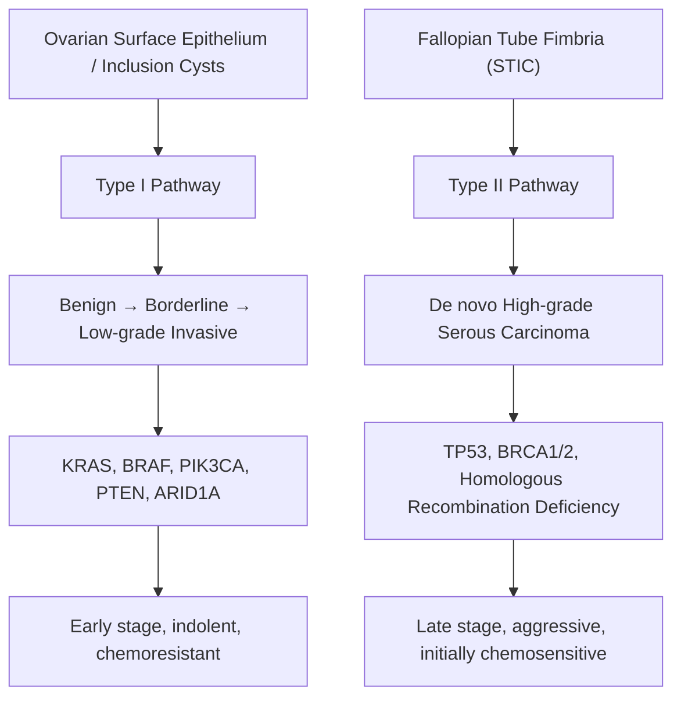

# Ovarian Cancer

## 1. Definition

Ovarian cancer refers to a malignant neoplasm arising from the ovary (or, in modern understanding, frequently from the fallopian tube fimbria). The term encompasses a heterogeneous group of tumours with distinct histologies, molecular profiles, risk factors, and clinical behaviours. The three broad histogenetic categories are **epithelial**, **germ cell**, and **sex cord–stromal** tumours, with epithelial ovarian cancer (EOC) accounting for ~90% of ovarian malignancies in adults [1][2].

> The word "ovarian" comes from Latin *ovarium* (egg-bearing), from *ovum* = egg. "Cancer" derives from Greek *karkinos* = crab — the ancient description of tumour projections resembling crab legs.

<Callout title="Key Concept">
Modern evidence shows that the majority of high-grade serous ovarian cancers (HGSOC) — the most common and lethal subtype — actually originate from the **fimbriae of the fallopian tube** (serous tubal intraepithelial carcinoma, STIC) rather than the ovarian surface epithelium itself. This paradigm shift underpins the rationale for **opportunistic salpingectomy** as a risk-reducing strategy.
</Callout>

---

## 2. Epidemiology

### 2.1 Global Burden
- Ovarian cancer is the **8th most common cancer** in women worldwide and the **8th leading cause of cancer death** in women globally (GLOBOCAN 2022).
- ~313,000 new cases and ~207,000 deaths annually worldwide.
- The 5-year overall survival remains poor (~30–50%) because the majority present at advanced stage (Stage III/IV).

### 2.2 Hong Kong Epidemiology
- ***Ovarian cancer is the 6th most common cancer in Hong Kong females*** with an age-standardised incidence rate of approximately 8–10 per 100,000 women per year [1][3].
- ***It ranks among the top 10 causes of cancer death in HK women.***
- Incidence has been gradually rising over the past two decades, reflecting both true increases (lifestyle westernisation, lower parity) and improved detection.
- Mean age at diagnosis: **50–60 years** for epithelial ovarian cancer; younger for germ cell tumours (10–30 years).

### 2.3 Demographics by Histological Subtype

| Subtype | % of Ovarian Cancers | Typical Age | Key Features |
|---|---|---|---|
| Epithelial (overall) | ~90% | 50–70 | Most common, worst prognosis for HGSOC |
| — High-grade serous (HGSOC) | ~70% of EOC | 55–65 | Most common & most lethal; BRCA-related |
| — Low-grade serous | ~5% | 40–55 | Indolent, chemoresistant |
| — Endometrioid | ~10% | 50–60 | A/w endometriosis, Lynch syndrome |
| — Clear cell | ~5–10% (higher in East Asia) | 45–55 | A/w endometriosis; ***higher proportion in HK/East Asian populations*** |
| — Mucinous | ~3% | 30–50 | Pseudomyxoma if ruptured |
| Germ cell | ~5% | 10–30 | Excellent prognosis, chemo-sensitive |
| Sex cord–stromal | ~5% | Variable | Hormone-secreting (oestrogen, androgens) |

<Callout title="High Yield — Clear Cell Carcinoma in HK" type="idea">
Clear cell carcinoma of the ovary has a notably **higher incidence in East Asian populations** (including Hong Kong and Japan) compared to Western countries, comprising up to 15–25% of EOC in some East Asian series vs. 5% in Western data. It is strongly associated with **endometriosis** and is characteristically **chemoresistant** to standard platinum-taxane regimens.
</Callout>

---

## 3. Risk Factors

The fundamental concept underpinning most ovarian cancer risk factors relates to two main theories:

1. **Incessant ovulation hypothesis** (Fathalla, 1971): Each ovulation causes micro-trauma and repair of the ovarian surface epithelium (OSE), increasing the chance of DNA replication errors → malignant transformation. Therefore, anything that *reduces* the total number of lifetime ovulations is protective.

2. **Gonadotropin hypothesis**: Persistent high levels of gonadotropins (FSH, LH) stimulate the OSE and inclusion cysts, promoting neoplastic change.

3. **Tubal origin hypothesis** (modern): Inflammatory exudate and reactive oxygen species from the fallopian tube reach the ovarian surface, particularly during ovulation when the follicle ruptures and tubal fimbriae are in close contact, causing DNA damage → STIC → HGSOC.

### 3.1 Non-Modifiable Risk Factors

| Risk Factor | Mechanism / Explanation |
|---|---|
| **Age** | Risk increases with age; peak incidence 55–65 for EOC. Cumulative DNA damage and more ovulatory cycles. |
| **Family history** | ***FHx of breast, ovarian, and colorectal cancer*** [1]. 1st-degree relative with ovarian cancer → ~3.6× risk. Two 1st-degree relatives → ~7× risk. |
| ***BRCA1/2 mutation*** | ***BRCA1: lifetime risk of ovarian CA ~44% by age 80; BRCA2: ~17% by age 80*** [4]. BRCA proteins are involved in homologous recombination DNA repair; loss of function → genomic instability → cancer. BRCA1 ovarian cancers tend to be high-grade serous. |
| ***Lynch syndrome*** (hereditary non-polyposis colorectal cancer, HNPCC) | ***Lifetime risk of ovarian cancer ~10–12%*** (up to 24% for some MMR gene mutations) [3][5]. Due to mismatch repair (MMR) gene defects (MLH1, MSH2, MSH6, PMS2) → microsatellite instability → accumulation of mutations. A/w **endometrioid** and **clear cell** subtypes of ovarian cancer rather than serous. |
| **Ethnicity** | Ashkenazi Jewish women: BRCA1/2 founder mutations in ~2.5% (vs 0.1–0.2% general population). East Asian: higher proportion of clear cell carcinoma. |
| **Early menarche / late menopause** | More ovulatory cycles → more micro-trauma to OSE (incessant ovulation hypothesis). |

### 3.2 Modifiable / Reproductive Risk Factors

| Risk Factor | Effect | Mechanism |
|---|---|---|
| ***Nulliparity*** | ↑ Risk | More ovulatory cycles (no suppression of ovulation during pregnancy). |
| **No breastfeeding** | ↑ Risk | Breastfeeding suppresses ovulation (lactational amenorrhoea) → fewer cycles. |
| **Infertility / fertility drug use** | ↑ Risk (modest) | Anovulatory patients receiving ovulation induction → supraphysiological gonadotropin stimulation. Data is controversial; likely a small effect. |
| ***Combined oral contraceptive pill (COCP)*** | ***↓ Risk (protective — 30–50% reduction with ≥5 years use)*** | Suppresses ovulation → fewer ovulatory cycles + suppresses gonadotropin levels. Protection persists for 15–20 years after cessation. **One of the most significant modifiable protective factors.** |
| **Multiparity** | ↓ Risk | Each pregnancy suppresses ovulation for ~9 months + post-partum amenorrhoea. |
| ***Tubal ligation / salpingectomy*** | ***↓ Risk (up to 30% reduction)*** | Physically prevents passage of carcinogenic agents / inflammatory exudate from the tube to the ovary; may interrupt tubal carcinogenesis pathway. |
| ***Obesity*** | Modest ↑ risk | Peripheral aromatisation of androgens to oestrogens in adipose tissue → chronic oestrogen exposure. More clearly linked to endometrial and breast cancer but also contributes to ovarian cancer risk. |
| **HRT (post-menopausal)** | ↑ Risk (particularly oestrogen-only HRT) | Prolonged oestrogen exposure to OSE. Current evidence suggests the risk increases with >5 years of use and applies mainly to serous and endometrioid subtypes. |
| **Endometriosis** | ↑ Risk for **clear cell** and **endometrioid** subtypes | Chronic inflammation → oxidative stress → DNA damage in ectopic endometrial tissue → malignant transformation (endometriosis-associated ovarian cancer). |
| **Smoking** | ↑ Risk for **mucinous** subtype specifically | Carcinogens may act on mucinous-type epithelium. |
| **Talcum powder (perineal use)** | Controversial/weak association | Hypothesised to cause chronic inflammation if particles ascend through the genital tract. IARC reclassified as "possibly carcinogenic" (Group 2B). |

### 3.3 Protective Factors (Summary)

| Protective Factor | Mechanism |
|---|---|
| COCP use | Suppresses ovulation |
| Multiparity | Fewer ovulatory cycles |
| Breastfeeding | Lactational anovulation |
| Tubal ligation / Bilateral salpingectomy | Interrupts tubal carcinogenesis pathway |
| Hysterectomy | Possibly reduces retrograde flow/transport |
| Prophylactic BSO in BRCA carriers | Removes at-risk tissue |

<Callout title="Protective Effect of COCP — Exam Favourite">
The COCP is one of the most effective chemoprevention strategies for ovarian cancer. A **meta-analysis** showed ~30–50% reduction in risk with ≥ 5 years of COCP use, and the protective effect persists for **15–20 years** after cessation. This is important to counsel BRCA carriers who have not yet completed childbearing and are not ready for prophylactic surgery.
</Callout>

---

## 4. Anatomy and Function

Understanding the anatomy is essential for understanding spread patterns, clinical features, and surgical management.

### 4.1 The Ovary

- **Location**: Paired organs in the ovarian fossa on the lateral pelvic wall, posterior to the broad ligament.
- **Size**: ~3 × 2 × 1 cm in reproductive age; atrophic post-menopause (~1.5 × 0.5 × 0.5 cm).
- **Attachments**:
  - **Mesovarium**: attaches ovary to the posterior surface of the broad ligament (contains ovarian vessels entering the hilum).
  - **Suspensory (infundibulopelvic) ligament**: connects the ovary to the lateral pelvic wall; contains the **ovarian artery** (from aorta) and **ovarian vein** (drains to IVC on the right, left renal vein on the left). *This is the key structure that must be identified and ligated during oophorectomy.*
  - **Ovarian ligament (utero-ovarian ligament)**: connects the ovary to the uterus (medially); contains no major vessels.
  - **Tubo-ovarian ligament**: connects the ovary to the fimbriated end of the fallopian tube.

- **Blood supply**: Ovarian artery (branch of abdominal aorta at L2) + anastomosis with the uterine artery (branch of internal iliac).
- **Venous drainage**: Right ovarian vein → IVC; Left ovarian vein → Left renal vein.
- **Lymphatic drainage**: **Para-aortic lymph nodes** (follow the ovarian vessels). This is distinct from the cervix/lower uterus which drains to the pelvic (iliac) nodes. *This explains why ovarian cancer staging includes para-aortic lymph node assessment.*
- **Nerve supply**: Ovarian plexus (sympathetic from T10) — referred pain to the **periumbilical region** (T10 dermatome).

### 4.2 Histological Layers

| Layer | Cell Type | Tumours Arising |
|---|---|---|
| **Surface epithelium** (modified peritoneal mesothelium) | Single layer of cuboidal/columnar cells that can undergo metaplasia | Epithelial ovarian cancers (serous, mucinous, endometrioid, clear cell, Brenner) |
| **Stroma / Sex cords** | Granulosa cells, theca cells, Sertoli cells, Leydig cells, fibroblasts | Sex cord–stromal tumours (granulosa cell tumour, fibroma, Sertoli-Leydig) |
| **Germ cells** | Oocytes | Germ cell tumours (dysgerminoma, teratoma, yolk sac tumour, choriocarcinoma) |

### 4.3 The Peritoneal Cavity — Routes of Spread

The ovary is an **intraperitoneal organ**. When malignant cells exfoliate from the ovarian surface, they follow the **clockwise circulation of peritoneal fluid**:

1. Cells shed from the ovary into the pouch of Douglas (rectouterine pouch — the most dependent part of the peritoneal cavity in the upright position).
2. Flow along the **right paracolic gutter** (the main pathway) → up to the **right subdiaphragmatic space** → **omentum** (the "policeman of the abdomen" traps tumour cells).
3. Peritoneal implants form on the **omentum** (omental cake), **diaphragm**, **bowel serosa**, **mesentery**, and **liver surface** (Glisson's capsule — not the liver parenchyma).

This explains:
- Why ovarian cancer presents with **ascites** and **omental cake** (tumour-laden omentum).
- Why **omentectomy** is a key part of surgical staging/debulking.
- Why the **right hemidiaphragm** must be evaluated during staging.

### 4.4 The Fallopian Tube and STIC

The fimbriated end of the fallopian tube is in intimate contact with the ovarian surface at each ovulation (to pick up the released oocyte). Modern evidence shows:
- **Serous tubal intraepithelial carcinoma (STIC)** lesions, found in the tubal fimbriae, are now considered the precursor of most HGSOC.
- The STIC → ovarian cancer pathway: STIC cells exfoliate → implant on ovarian surface → proliferate → form the ovarian tumour mass.
- STIC harbours **TP53 mutations** (found in >96% of HGSOC).

---

## 5. Etiology and Pathophysiology

### 5.1 Two-Pathway Model of Ovarian Carcinogenesis (Kurman & Shih)

This is the most widely accepted model, dividing epithelial ovarian cancers into two groups:

#### **Type I Tumours** — "Low-grade pathway"
- Arise through a **stepwise progression** from benign → borderline → invasive cancer.
- Generally **indolent**, present at **early stage**, but are relatively **chemoresistant**.
- Genetically **stable** (no TP53 mutations).
- Key molecular alterations: **KRAS**, **BRAF**, **PIK3CA**, **PTEN**, **ARID1A**, **CTNNB1** mutations.

| Type I Subtype | Precursor Lesion | Key Mutations |
|---|---|---|
| Low-grade serous | Serous cystadenoma → serous borderline tumour | KRAS, BRAF |
| Endometrioid | Endometriosis / endometriotic cyst | CTNNB1, PIK3CA, PTEN, ARID1A |
| Clear cell | Endometriosis / endometriotic cyst | ARID1A, PIK3CA, PTEN |
| Mucinous | Mucinous cystadenoma → borderline | KRAS |
| Brenner (transitional cell) | Walthard cell nests | — |

#### **Type II Tumours** — "High-grade pathway"
- Arise **de novo** (no clearly defined precursor within the ovary itself; likely from STIC in the tube).
- **Aggressive**, present at **advanced stage**, but are **chemosensitive** (at least initially).
- Genetically **unstable** with **TP53 mutations** (>96%) and frequent **BRCA1/2 dysfunction** (~50%).
- Responsible for **~75% of ovarian cancer deaths**.

| Type II Subtype | Key Features | Key Mutations |
|---|---|---|
| High-grade serous (HGSOC) | Most common & lethal | TP53 (>96%), BRCA1/2 (germline ~15%, somatic ~7%), HRD (~50%) |
| High-grade endometrioid | Rare | TP53 |
| Undifferentiated carcinoma | Rare | TP53 |
| Carcinosarcoma (MMMT) | Mixed epithelial + mesenchymal | TP53 |

### 5.2 Pathophysiology of Non-Epithelial Ovarian Cancers

#### Germ Cell Tumours
- Arise from **primordial germ cells** (totipotent or pluripotent).
- Can differentiate along various pathways (embryonic → embryonal carcinoma, teratoma; extraembryonic → yolk sac tumour, choriocarcinoma).
- **Dysgerminoma** (the ovarian equivalent of testicular seminoma): most common germ cell tumour. Does NOT produce AFP or hCG (unless mixed with other elements).
- **Yolk sac tumour**: produces **AFP** (alpha-fetoprotein). Schiller-Duval bodies on histology.
- **Choriocarcinoma**: produces **β-hCG**. Aggressive.
- **Immature teratoma**: contains immature (embryonic) tissue, usually neuroectodermal. Graded 1–3 based on amount of immature tissue.

#### Sex Cord–Stromal Tumours
- ***Granulosa cell tumour***: most common sex cord–stromal tumour. Produces **oestrogen** → can present with signs of **hyperoestrinism** (precocious puberty in children, postmenopausal bleeding in elderly, endometrial hyperplasia/cancer). ***Ovarian granulosa cell tumours are recognised as oestrogen-secreting tumours*** [1]. Histology: Call-Exner bodies (rosette-like arrangement of granulosa cells around eosinophilic fluid). Tumour marker: **inhibin B**.
- **Sertoli-Leydig cell tumour**: produces **androgens** → virilisation (hirsutism, deepening voice, clitoromegaly, temporal balding).
- **Fibroma**: benign. A/w **Meigs syndrome** (ovarian fibroma + ascites + right-sided pleural effusion). The effusion is a transudate caused by peritoneal irritation and lymphatic drainage from the diaphragm.

### 5.3 BRCA Pathway — Molecular Detail

***BRCA1 (chromosome 17q) and BRCA2 (chromosome 13q)*** are tumour suppressor genes encoding proteins essential for **homologous recombination (HR) DNA repair** — the high-fidelity repair of double-strand DNA breaks [4].

- When BRCA is dysfunctional → HR repair fails → cells rely on error-prone repair pathways (e.g., non-homologous end joining, NHEJ) → accumulation of genomic rearrangements → genomic instability → cancer.
- This creates a therapeutic vulnerability: **PARP inhibitors** (e.g., olaparib, niraparib). PARP (poly ADP-ribose polymerase) repairs single-strand DNA breaks. If both PARP and HR are non-functional → "**synthetic lethality**" — the cancer cell cannot repair any DNA breaks and dies.

> ***BRCA1: lifetime risk by 80y of 72% for CA breast and 44% for CA ovaries*** [4]
> ***BRCA2: lifetime risk by 80y of 69% for CA breast and 17% for CA ovaries*** [4]
> ***Other associated cancers (BRCA2): male breast cancer, prostate, laryngeal, cholangio, stomach, colon, melanoma, pancreatic*** [4]

### 5.4 Lynch Syndrome and Ovarian Cancer

***Lynch syndrome*** (hereditary non-polyposis colorectal cancer, HNPCC) is caused by germline mutations in DNA **mismatch repair (MMR) genes**: **MLH1, MSH2, MSH6, PMS2** [3][5].

- Defective MMR → **microsatellite instability (MSI)** → accumulation of frameshift mutations → cancer.
- ***Extracolonic tumours in Lynch syndrome include: endometrial (most common), ovaries, stomach, small bowel, hepatobiliary system, renal pelvis/ureter, brain (glioma), sebaceous neoplasms*** [5].
- Ovarian cancers in Lynch syndrome are typically **endometrioid** or **clear cell** subtype (NOT serous — unlike BRCA).
- ***Lifetime risk of ovarian cancer in Lynch syndrome: ~10–12%*** (varies by gene; MSH2 and MSH6 carry higher risk for ovarian cancer than MLH1).

### 5.5 Pathophysiology of Key Clinical Manifestations

Understanding why ovarian cancer presents the way it does:

| Clinical Manifestation | Pathophysiological Basis |
|---|---|
| **Abdominal distension / bloating** | Ascites from peritoneal carcinomatosis (tumour cells on peritoneum → increased vascular permeability + lymphatic obstruction + VEGF secretion) |
| **Omental cake** | Tumour cells have tropism for omental milky spots (aggregates of immune cells) → preferential metastasis to omentum |
| **Pelvic / abdominal mass** | Direct tumour growth from the ovary; can become massive (especially mucinous tumours, which can reach >30 cm) |
| **Pleural effusion (usually right-sided)** | Ascitic fluid passes through transdiaphragmatic lymphatic channels (more numerous on the right) → pleural effusion. This does NOT necessarily indicate parenchymal lung metastasis — it may still be Stage III if cytology is positive. But if cytology is positive = Stage IV. |
| **Early satiety / nausea** | Omental cake and peritoneal implants compress the stomach and bowel |
| **Bowel obstruction** | Peritoneal carcinomatosis encasing bowel loops |
| **Urinary frequency / urgency** | Direct compression of the bladder by a pelvic mass |
| **Weight loss + cachexia** | Tumour metabolic demand + inflammatory cytokines (TNF-α, IL-6) |
| **DVT / PE** | Hypercoagulable state (Trousseau syndrome — mucin-secreting tumours activate clotting) |
| **Postmenopausal bleeding** | Oestrogen-secreting tumours (granulosa cell tumour) → endometrial hyperplasia/cancer |

---

## 6. Classification

### 6.1 Histological Classification (WHO 2020)

#### A. Epithelial Tumours (~90%)

Each epithelial subtype can be **benign** (cystadenoma), **borderline** (low malignant potential), or **malignant** (carcinoma):

| Subtype | Histological Features | Notes |
|---|---|---|
| **Serous** | Resembles fallopian tube epithelium (ciliated columnar cells). Psammoma bodies (concentric calcifications). | **High-grade** (HGSOC) = most common. Low-grade serous = separate disease. |
| **Mucinous** | Resembles endocervical or GI mucin-secreting epithelium. Mucin-filled cysts. | Often huge. Must exclude metastasis from GI (appendix, colon) primary — **always check appendix!** |
| **Endometrioid** | Resembles endometrial glands. | A/w endometriosis. 15–20% have synchronous endometrial cancer. |
| **Clear cell** | Hobnail cells, clear cytoplasm (glycogen-rich). | A/w endometriosis. ***Higher proportion in East Asian / HK populations***. Chemoresistant. |
| **Brenner (transitional)** | Resembles urothelial (transitional) epithelium. Walthard cell nests. | Usually benign; malignant Brenner is rare. |
| **Seromucinous** | Mixed serous and mucinous. | Rare. A/w endometriosis. |
| **Undifferentiated** | No identifiable differentiation. | Aggressive. |

#### B. Germ Cell Tumours (~5%)

| Tumour | Features | Marker |
|---|---|---|
| **Dysgerminoma** | Most common malignant germ cell tumour. Equivalent to testicular seminoma. "Fried egg" cells. Lymphocytic infiltrate. | LDH, PLAP |
| **Yolk sac tumour (endodermal sinus tumour)** | Schiller-Duval bodies. Most common in children/young women. | **AFP** |
| **Immature teratoma** | Immature (embryonic) tissue, usually neuroectodermal. Graded 1–3. | AFP (if neural tissue) |
| **Mature teratoma (dermoid cyst)** | Benign (most common ovarian tumour overall). Contains mature tissue (hair, teeth, fat, skin). | — |
| **Embryonal carcinoma** | Rare in pure form. | AFP, β-hCG |
| **Choriocarcinoma (non-gestational)** | Very rare. Syncytiotrophoblast + cytotrophoblast. | **β-hCG** |
| **Mixed germ cell tumour** | Combination of above. | Varies |

#### C. Sex Cord–Stromal Tumours (~5%)

| Tumour | Features | Secretory Product | Marker |
|---|---|---|---|
| ***Granulosa cell tumour*** | Call-Exner bodies. ***Oestrogen-secreting → endometrial hyperplasia, postmenopausal bleeding*** [1] | Oestrogen | **Inhibin B**, AMH |
| **Sertoli-Leydig cell tumour** | Virilising | Androgens | Inhibin, testosterone |
| **Fibroma** | Benign solid tumour. A/w **Meigs syndrome** (fibroma + ascites + R pleural effusion) | None | — |
| **Thecoma** | Usually benign. Oestrogen-secreting. | Oestrogen | Inhibin |
| **Steroid cell tumour** | Virilising or oestrogenic | Steroids | — |

### 6.2 Borderline Ovarian Tumours (Low Malignant Potential)

- Represent ~10–15% of epithelial ovarian neoplasms.
- **Histology**: epithelial proliferation and cytological atypia WITHOUT stromal invasion.
- **Behaviour**: indolent, excellent prognosis (>95% survival at 10 years for Stage I).
- Can have peritoneal implants — classified as **non-invasive** (good prognosis) or **invasive** (behaves more like carcinoma).
- ***Key for exam: borderline tumours should be managed conservatively if possible, especially in young women desiring fertility (fertility-sparing surgery = unilateral salpingo-oophorectomy + staging).***

### 6.3 Staging — FIGO 2014 (Revised)

***Ovarian cancer is surgically staged*** (unlike cervical cancer, which is clinically staged). This is because peritoneal spread cannot be reliably assessed by imaging alone.

| Stage | Description |
|---|---|
| **I** | **Confined to ovaries/fallopian tubes** |
| IA | One ovary/tube, capsule intact, no surface involvement, negative washings |
| IB | Both ovaries/tubes, capsule intact, no surface involvement, negative washings |
| IC | IC1: surgical spill; IC2: capsule ruptured before surgery or tumour on surface; IC3: positive washings/ascites |
| **II** | **Extension to pelvis** (below pelvic brim) |
| IIA | Extension to uterus, tubes, or ovaries |
| IIB | Extension to other pelvic intraperitoneal tissues |
| **III** | **Peritoneal spread beyond pelvis and/or retroperitoneal lymph node metastasis** |
| IIIA1 | Retroperitoneal lymph node only (IIIA1(i) ≤10mm; IIIA1(ii) >10mm) |
| IIIA2 | Microscopic extrapelvic peritoneal involvement ± nodes |
| IIIB | Macroscopic peritoneal mets ≤2cm beyond pelvis ± nodes |
| IIIC | Macroscopic peritoneal mets >2cm beyond pelvis ± nodes (includes liver/splenic capsule) |
| **IV** | **Distant metastasis** (excluding peritoneal mets) |
| IVA | Pleural effusion with positive cytology |
| IVB | Parenchymal mets (liver, spleen, extra-abdominal organs — e.g., lung, bone, brain) and/or inguinal/extra-abdominal lymph nodes |

<Callout title="Staging Pitfall" type="error">
A common exam error: **liver capsule involvement = Stage III** (peritoneal spread), but **liver parenchymal metastasis = Stage IVB**. Similarly, **pleural effusion with positive cytology = Stage IVA**, but this does NOT necessarily mean pulmonary parenchymal metastasis.
</Callout>

---

## 7. Clinical Features

***Ovarian cancer is often called "the silent killer"*** because it tends to present with **vague, non-specific symptoms** until advanced stages. However, studies show that most patients DO have symptoms — they are just easily dismissed.

### 7.1 Symptoms

#### A. Early / Non-specific Symptoms (often present for months before diagnosis)

| Symptom | Pathophysiological Basis |
|---|---|
| ***Persistent abdominal bloating / increasing abdominal girth*** | ***Ascites*** (peritoneal carcinomatosis → increased vascular permeability via VEGF, lymphatic obstruction, direct peritoneal irritation); also large tumour mass distending the abdomen. ***This is the most common presenting symptom.*** [2] |
| ***Pelvic / abdominal pain*** | Direct tumour mass effect, stretching of the ovarian capsule, peritoneal irritation by tumour implants, or torsion/haemorrhage of the tumour. |
| ***Early satiety / difficulty eating*** | Omental cake and/or large pelvic mass compressing the stomach → reduced gastric capacity. Peritoneal implants on bowel → reduced motility. |
| **Urinary frequency / urgency** | Large pelvic mass directly compressing the bladder (the ovary sits close to the bladder in the pelvis). |
| **Change in bowel habit** (constipation or alternating) | Pelvic mass compressing the rectosigmoid. Peritoneal implants on bowel serosa → dysmotility. |
| **Fatigue** | Anaemia of chronic disease (inflammatory cytokines), cancer cachexia (TNF-α, IL-6), poor nutritional intake. |

<Callout title="The Gilda Radner Symptom Index — Exam Tip" type="idea">
The **NICE guidelines** recommend that ovarian cancer should be considered if any of the following are present **persistently** (≥12 times per month), especially in women >50:
- Abdominal bloating
- Early satiety / appetite loss
- Pelvic or abdominal pain
- Urinary urgency/frequency

These four symptoms form the mnemonic **"BEAT"** — Bloating, Eating difficulty, Abdominal pain, Things urinary.
</Callout>

#### B. Symptoms of Advanced Disease

| Symptom | Pathophysiological Basis |
|---|---|
| ***Increasing abdominal girth (progressive)*** | Massive ascites ± tumour bulk. ***In the exam question scenario: "F/75 complained of increasing abdominal girth. PE found abdominal mass arising from pelvis and ascites."*** [2][6] |
| **Shortness of breath** | Pleural effusion (usually right-sided — peritoneal fluid ascends through transdiaphragmatic lymphatic channels, which are more numerous on the right). Massive ascites → diaphragmatic splinting → reduced tidal volume. |
| **Nausea / vomiting** | Bowel obstruction from peritoneal carcinomatosis (extrinsic compression). Omental cake compressing GI tract. |
| **Weight loss / cachexia** | Cancer cachexia — pro-inflammatory cytokines (TNF-α, IL-1, IL-6) → protein catabolism + anorexia. Paradoxically, patients may gain weight initially due to ascites masking muscle wasting ("fat-thin" appearance). |
| **Back pain** | Retroperitoneal lymph node metastasis compressing lumbosacral nerve roots, or direct posterior pelvic extension. |
| **DVT / PE** | Paraneoplastic hypercoagulability (Trousseau syndrome) — mucin-secreting adenocarcinomas activate tissue factor and promote thrombin generation. |
| **Bone pain** | Rare — haematogenous metastasis to bone (late event). |

#### C. Symptoms Specific to Tumour Type

| Tumour | Specific Symptom | Mechanism |
|---|---|---|
| ***Granulosa cell tumour*** | ***Postmenopausal bleeding, irregular menses, breast tenderness*** | ***Oestrogen secretion → endometrial hyperplasia → abnormal uterine bleeding*** [1] |
| **Sertoli-Leydig cell tumour** | Hirsutism, acne, deepening voice, amenorrhoea, clitoromegaly | Androgen (testosterone) secretion → virilisation |
| **Yolk sac tumour / immature teratoma** | Abdominal mass in young girl/woman | Rapidly growing tumour in a young patient |
| **Choriocarcinoma (non-gestational)** | Positive pregnancy test, precocious puberty | β-hCG secretion |
| **Mucinous tumour (if ruptured)** | Pseudomyxoma peritonei (gelatinous ascites) | Mucin-secreting cells disseminate in the peritoneum |
| **Fibroma** | Meigs syndrome: ascites + right pleural effusion | Peritoneal irritation by fibroma → transudative ascites → transdiaphragmatic lymphatic flow → right pleural effusion |

### 7.2 Signs

#### A. General Examination

| Sign | Pathophysiological Basis |
|---|---|
| **Cachexia / wasting** | Cancer cachexia (cytokine-mediated). May be masked by ascites. |
| **Pallor** | Anaemia of chronic disease. |
| **Left supraclavicular lymphadenopathy (Virchow's node / Troisier's sign)** | Metastasis via thoracic duct to the left supraclavicular node — a classical sign of advanced intra-abdominal malignancy. |
| **Peripheral oedema** | Hypoalbuminaemia (poor nutrition, chronic disease) and/or compression of iliac veins by pelvic mass. |
| **DVT** | Hypercoagulability (Trousseau syndrome). |

#### B. Abdominal Examination

| Sign | Pathophysiological Basis |
|---|---|
| ***Pelvic / abdominal mass arising from the pelvis*** | ***Ovarian tumour. On palpation, a mass arising from the pelvis cannot get below it (i.e., you cannot feel the lower border). It moves with bimanual examination.*** [2][6] |
| ***Features suspicious for malignancy: solid, irregular, fixed, bilateral, nodular*** | ***Solid and irregular architecture suggests disorganised tumour growth. Fixed = invasion of adjacent structures. Bilateral = metastatic/advanced primary.*** |
| ***Ascites*** (shifting dullness, fluid thrill) | ***Peritoneal carcinomatosis → VEGF secretion → increased vascular permeability → fluid exudation into peritoneal cavity. Also lymphatic obstruction by tumour implants preventing reabsorption.*** [2][6] |
| **Omental cake** (palpable hard mass in upper abdomen) | Omental metastasis — tumour cells have tropism for the omentum (milky spots containing macrophages act as a "trap"). |
| **Hepatomegaly** (hard, nodular, non-tender) | Liver metastasis (late feature). |
| **Sister Mary Joseph nodule** | Metastasis to the umbilicus via peritoneal lymphatics. |

#### C. Pelvic / Vaginal Examination

| Sign | Significance |
|---|---|
| **Adnexal mass** (bimanual palpation) | Confirms pelvic origin. Assess size, consistency, mobility, tenderness. |
| **Fixed, hard, irregular mass in the pouch of Douglas** (on rectovaginal exam) | Peritoneal implants in the pouch of Douglas (most dependent part of the peritoneum). |
| **Nodularity in pouch of Douglas** | "Shelf" of tumour deposits — classical sign of peritoneal carcinomatosis. |
| **Cervical excitation (chandelier sign)** | If tumour causes pelvic inflammation or torsion (mimics PID/ectopic pregnancy). |
| **Uterine enlargement** | May suggest synchronous endometrial cancer (seen in ~15% of endometrioid ovarian cancer). |

<Callout title="Exam Vignette — Classic Presentation" type="idea">
***"F/75 complained of increasing abdominal girth. PE found abdominal mass arising from pelvis and ascites. USG abdomen found mixed solid-cystic lesion at pelvis and ascites. Uterus cannot be visualised."*** [6]

This is the classic presentation: **elderly postmenopausal woman** + **pelvic mass** + **ascites** + **mixed solid-cystic lesion on USG** = ***ovarian cancer until proven otherwise***. The inability to visualise the uterus separately suggests the mass is replacing/engulfing the ovary and is closely related to the adnexal structures.
</Callout>

### 7.3 Features of Specific Ovarian Masses — Benign vs. Malignant

***The ADNEX model (Assessment of Different NEoplasias in the adneXa)*** is a validated ultrasound-based risk prediction model that distinguishes between benign, borderline, stage I invasive, stage II–IV invasive, and secondary metastatic adnexal tumours [7].

| Feature | Suggestive of Benign | Suggestive of Malignant |
|---|---|---|
| Age | Reproductive age | Postmenopausal |
| Laterality | Unilateral | Bilateral |
| Size | Small (&lt;5 cm often) | Large (&gt;10 cm, but mucinous benign can be large too) |
| Consistency | Cystic (thin-walled, anechoic) | ***Mixed solid-cystic*** or predominantly solid |
| Wall | Thin, smooth | Thick, irregular |
| Septae | Thin (&lt;3 mm) | ***Thick (&gt;3 mm), irregular*** |
| Papillary projections | Absent | ***Present (solid projections into cyst cavity)*** |
| Vascularity on Doppler | Low flow | ***High flow, low resistance (RI &lt; 0.4)*** |
| Ascites | Absent | ***Present*** |
| CA-125 | Normal | ***Elevated (especially in serous EOC)*** |
| Mobility | Mobile | Fixed |

---

## 8. Special Topics Relevant to Hong Kong Exam

### 8.1 Ovarian Cancer Screening — Health Economics Perspective

***The lecture objective highlights "awareness of the health economics of ovarian cancer screening"*** [2].

- **No effective population-based screening** exists for ovarian cancer in the general population.
- The **UKCTOCS trial** (2021 final results) showed that while multimodal screening (serial CA-125 with ROCA algorithm + TVS) could detect ovarian cancer earlier, it did **NOT reduce mortality** from ovarian cancer. This was a landmark negative result.
- **CA-125** alone as a screening tool is limited by:
  - **Poor sensitivity for early-stage disease** (~50% of Stage I ovarian cancers have normal CA-125).
  - **Poor specificity** — elevated in many benign conditions (endometriosis, fibroids, PID, pregnancy, liver disease, peritonitis).
- **Transvaginal ultrasound (TVS)** alone also has insufficient specificity → leads to unnecessary surgeries.
- ***In BRCA carriers: screening with TVUS + CA-125 every 6 months from age 30y (or 5–10 years before earliest diagnosis in family) is recommended*** [4]. However, **risk-reducing bilateral salpingo-oophorectomy (rrBSO) remains the gold standard** for risk reduction and is recommended after completion of childbearing or by age 35–40 (BRCA1) / 40–45 (BRCA2).

<Callout title="Screening for Ovarian Cancer — Bottom Line">
There is **NO recommended population-level screening** for ovarian cancer. Even in high-risk (BRCA) populations, screening has limitations. **Prophylactic BSO remains the most effective risk reduction strategy for BRCA carriers.**
</Callout>

### 8.2 Prophylactic Surgery for BRCA Carriers

***Options if gene-positive*** [4]:
- ***Cancer screening: MRI Q1y from 25y, MMG Q1y from 30y, TVUS + CA125 Q6mo from 30y (or 5–10y before earliest dx in family)***
- ***Chemoprevention: tamoxifen, AI (limited data, usually not recommended)***
- ***Bilateral mastectomy: often skin-sparing ± NAC preservation***
- ***Bilateral salpingo-oophorectomy ± HRT: recommended after complete childbearing or before 40y***

Key considerations:
- ***Staging of current CA breast: preferred stage I–II (good prognosis → more likely to secure cure)***
- ***Age: more beneficial if young***
- ***Completion of family: important for breastfeeding or fertility (BSO)***

### 8.3 Lynch Syndrome and Ovarian Cancer

***Cancer screening for Lynch syndrome patients*** [5]:
- ***Colorectal: colonoscopy Q1-2y from 20–25y onwards***
- ***Endometrial, ovarian: pelvic exam + endometrial Bx Q1y from 30–35y onward (or 3–5y before earliest age of dx in family) with prophylactic TAH+BSO at the end of childbearing or ~40y***
- ***Gastric: consider OGD screening from 30–35y onwards***
- ***Urinary tract: consider annual urinalysis from 30–35y onwards***

---

<Callout title="High Yield Summary">

**Definition**: Malignant neoplasm of the ovary; most commonly epithelial (90%), with HGSOC being the most common and lethal subtype. Modern evidence: many HGSOC originate from the fallopian tube fimbria (STIC).

**Epidemiology**: 6th most common female cancer in HK. Peak age 55–65 for EOC; younger for germ cell. Clear cell carcinoma is disproportionately common in East Asian populations.

**Risk factors** — Think "incessant ovulation" + genetic:
- ↑ Risk: Age, nulliparity, no breastfeeding, early menarche, late menopause, BRCA1/2, Lynch syndrome, FHx, endometriosis (clear cell/endometrioid), obesity, HRT, fertility drugs.
- ↓ Risk (protective): COCP (30–50% reduction with ≥5y use), multiparity, breastfeeding, tubal ligation, salpingectomy.

**BRCA1**: 44% lifetime ovarian cancer risk. **BRCA2**: 17%. Both → TP53 mutation → HGSOC. **Lynch syndrome**: ~10–12% lifetime ovarian cancer risk → endometrioid/clear cell.

**Two-pathway model**: Type I (low-grade, stepwise, KRAS/BRAF/PIK3CA, early stage, chemoresistant) vs. Type II (high-grade, de novo from STIC, TP53/BRCA, late stage, chemosensitive initially).

**Clinical features**: "BEAT" — Bloating, Eating difficulty, Abdominal pain, Things urinary. Late: ascites, omental cake, cachexia, pleural effusion, bowel obstruction. Granulosa cell tumour → oestrogen → postmenopausal bleeding.

**Classic exam vignette**: Elderly woman + increasing abdominal girth + pelvic mass + ascites + mixed solid-cystic lesion on USG = ovarian cancer.

**Staging**: Surgical staging (FIGO 2014). Liver capsule = III; liver parenchyma = IVB. Pleural effusion with positive cytology = IVA.

**Screening**: No population screening. BRCA: TVUS + CA-125 Q6mo from 30y, but rrBSO is gold standard.

</Callout>

---

<ActiveRecallQuiz
  title="Active Recall - Ovarian Cancer (Definition, Epidemiology, Risk Factors, Anatomy, Etiology, Classification, Clinical Features)"
  items={[
    {
      question: "A 68-year-old woman presents with increasing abdominal girth and early satiety. Ultrasound shows a mixed solid-cystic pelvic mass with ascites. What is the most likely diagnosis, and explain the pathophysiology of the ascites?",
      markscheme: "Ovarian cancer (most likely high-grade serous carcinoma given age). Ascites is due to peritoneal carcinomatosis: tumour cells on the peritoneum secrete VEGF, increasing vascular permeability, and obstruct lymphatic reabsorption, leading to fluid accumulation in the peritoneal cavity."
    },
    {
      question: "Describe the two-pathway model of epithelial ovarian carcinogenesis (Kurman and Shih). Give two examples of Type I and two of Type II tumours with their key molecular alterations.",
      markscheme: "Type I: low-grade, stepwise benign-borderline-malignant, genetically stable. Examples: low-grade serous (KRAS/BRAF), endometrioid (CTNNB1/PIK3CA/PTEN/ARID1A), clear cell (ARID1A/PIK3CA), mucinous (KRAS). Type II: high-grade, de novo (often from STIC), genetically unstable. Examples: HGSOC (TP53 >96%, BRCA1/2), carcinosarcoma (TP53). Type II accounts for ~75% of ovarian cancer deaths."
    },
    {
      question: "Name four protective factors against ovarian cancer and explain the mechanism for each.",
      markscheme: "1. COCP: suppresses ovulation, reducing ovulatory micro-trauma to ovarian surface epithelium. 2. Multiparity: fewer ovulatory cycles due to pregnancy-related anovulation. 3. Breastfeeding: lactational amenorrhoea suppresses ovulation. 4. Tubal ligation/salpingectomy: interrupts the tubal carcinogenesis pathway by preventing carcinogenic inflammatory exudate from reaching the ovary."
    },
    {
      question: "A BRCA1 mutation carrier asks about her lifetime risk of ovarian cancer and what can be done. What is the risk and what is the gold standard risk-reducing intervention?",
      markscheme: "BRCA1: 44% lifetime risk of ovarian cancer by age 80. Gold standard: risk-reducing bilateral salpingo-oophorectomy (rrBSO), recommended after completion of childbearing or by age 35-40. Interim measures include TVUS plus CA-125 every 6 months from age 30 and COCP use. PARP inhibitors exploit synthetic lethality if cancer develops."
    },
    {
      question: "A patient with ovarian cancer has tumour deposits on the liver capsule, omentum, and positive peritoneal cytology, but no liver parenchymal involvement. What is the FIGO stage? What would change the stage to IVB?",
      markscheme: "FIGO Stage IIIC (macroscopic peritoneal metastasis >2cm beyond pelvis; liver capsule involvement is peritoneal spread, not parenchymal). Stage IVB would require parenchymal liver metastasis, extra-abdominal organ metastasis (lung, bone, brain), or inguinal/extra-abdominal lymph node involvement."
    },
    {
      question: "Explain why clear cell carcinoma of the ovary is particularly relevant in the Hong Kong exam context. What is its association and what is its clinical behaviour?",
      markscheme: "Clear cell carcinoma has a higher proportion in East Asian populations including HK (up to 15-25% of EOC vs 5% in Western data). Strongly associated with endometriosis (chronic inflammation and oxidative stress lead to DNA damage and malignant transformation). Clinically, it is characteristically chemoresistant to standard platinum-taxane regimens, which worsens prognosis despite often presenting at an earlier stage."
    }
  ]}
/>

## References

[1] Lecture slides: GC 112. Abnormal vaginal bleeding Gynaecological cancer.pdf (p19, p37–38; Risk factors section including granulosa cell tumours as oestrogen-secreting tumours)
[2] Lecture slides: Block C - O&G Theme Case 3.pdf (p1; Learning objectives including pelvic pathology, pelvic ultrasound, health economics of ovarian cancer screening)
[3] Lecture slides: Block C - Abnormal vaginal bleeding_ gynaecological cancer.pdf (p34; Lynch syndrome and risk factors for endometrial cancer)
[4] Senior notes: Ryan Ho Urogenital.pdf (p205, p213; BRCA1/2 mutation, lifetime risks, prophylactic surgery options, criteria for genetic counselling)
[5] Senior notes: Ryan Ho GI.pdf (p183; Lynch syndrome, extracolonic tumours, cancer screening recommendations)
[6] Senior notes: Ryan Ho Radiology.pdf (p39; Exam question M18 Rotation 3 — F/75 with pelvic mass, ascites, mixed solid-cystic lesion = ovarian cancer)
[7] Lecture slides: GC 118. Pelvic mass ovarian cancer and cysts; uterine fibroid; pelvic imaging.pdf (p60; ADNEX model for risk prediction of malignancy in ovarian tumours)
