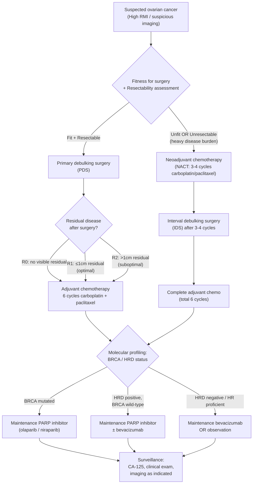

## Management of Ovarian Cancer

### Overarching Principles

Before diving into specifics, you need to understand the fundamental logic of ovarian cancer management. There are three pillars, and their sequencing depends on the stage, resectability, and patient fitness:

1. **Surgery** — the cornerstone. Ovarian cancer is unique among solid tumours in that **maximal surgical cytoreduction ("debulking") directly improves survival**. Every additional centimetre of residual disease left behind worsens the prognosis.
2. **Chemotherapy** — platinum-based chemotherapy (carboplatin + paclitaxel) is the backbone for almost all epithelial ovarian cancers.
3. **Targeted therapy** — primarily PARP inhibitors (for BRCA/HRD-positive disease) and bevacizumab (anti-VEGF), used as maintenance therapy after initial treatment.

***"Management is complicated, depends on many factors. If operable, want to operate first → time-sensitive operation, therapeutic and diagnostic. But if late stage and inoperable, then consider neoadjuvant"*** [17].

This quote captures the central decision point: **can we operate first, or do we need chemotherapy first?**

---

### 1. The Master Management Algorithm

---

### 2. Surgery — The Cornerstone

#### 2.1 Why Surgery Is So Important

Ovarian cancer has a unique relationship with surgery compared to most other cancers:
- The volume of **residual disease** after surgery is the **single most important prognostic factor** (after stage and grade). Patients with **no visible residual disease (R0)** after primary surgery have a median survival approximately double that of patients with suboptimal debulking.
- Surgery is both **diagnostic** (provides histological tissue, determines the true stage via systematic exploration) and **therapeutic** (removes tumour bulk, allowing chemotherapy to work on a smaller residual volume).

The goal is to achieve **complete cytoreduction (R0)** — no macroscopically visible residual disease. If that is not achievable, the next best is **optimal cytoreduction** (residual disease ≤ 1 cm).

#### 2.2 Primary Debulking Surgery — Components

***If operable, want to operate first → time-sensitive operation, therapeutic and diagnostic*** [17].

The standard primary debulking surgery (PDS) for advanced epithelial ovarian cancer includes:

| Component | Rationale |
|---|---|
| **Midline laparotomy** | Provides full access to the entire abdominal cavity — essential because ovarian cancer spreads diffusely throughout the peritoneum. A transverse or Pfannenstiel incision is **inadequate** for proper staging/debulking. |
| **Peritoneal cytology / washings** | Collect fluid from the pouch of Douglas, paracolic gutters, and subdiaphragmatic areas. Positive cytology upgrades staging (at least IC3). |
| ***Total abdominal hysterectomy (TAH)*** | Removes the uterus, which may harbour synchronous endometrial cancer (15–20% in endometrioid subtype) and eliminates a potential site of metastatic spread. |
| ***Bilateral salpingo-oophorectomy (BSO)*** | Removes both ovaries and tubes. Even if disease appears unilateral, microscopic contralateral involvement is common in advanced disease. ***TAH + BSO is the standard*** [7]. |
| ***Omentectomy (infracolic)*** | ***The omentum is the most common site of peritoneal metastasis*** — tumour cells have tropism for omental milky spots. Omentectomy removes the "omental cake" and is essential for staging even if the omentum looks normal (occult deposits). ***TAH + BSO + omentectomy + peritoneal cytology*** [7]. |
| **Peritoneal biopsies** | Systematic biopsies from multiple peritoneal sites: pouch of Douglas, paracolic gutters, pelvic side walls, diaphragm, mesentery. Required for accurate staging. |
| **Pelvic and para-aortic lymph node dissection** | Ovarian cancer drains to **para-aortic** nodes (following ovarian vessels) and **pelvic** (iliac) nodes. Lymph node metastasis without peritoneal spread upgrades to Stage IIIA1. Systematic lymphadenectomy is recommended in apparent early-stage disease for accurate staging. In advanced disease, enlarged nodes are resected for cytoreduction. |
| **Appendicectomy** | **Mandatory for mucinous tumours** (to exclude appendiceal primary). Also routinely done in comprehensive staging. |
| **Any other procedures needed for complete cytoreduction** | May include: bowel resection (if tumour involves bowel serosa/mesentery), splenectomy, diaphragm stripping/resection, partial hepatectomy (for surface deposits), peritonectomy. This is why the operation must be performed by a ***trained gynaecological oncologist*** [7]. |

***From lecture slides [7]: "High likelihood of ovarian malignancy → laparotomy, full staging procedure by a trained gynaecological oncologist. Low likelihood of ovarian malignancy → laparotomy, pelvic clearance (TAH + BSO + omentectomy + peritoneal cytology) by a suitably trained gynaecologist."***

<Callout title="Why a Gynae-Oncologist?" type="idea">
Multiple studies have shown that patients operated on by gynaecological oncologists have **higher rates of complete cytoreduction** and **better survival** compared to those operated on by general gynaecologists or general surgeons. This is because gynae-oncologists are trained in the ultra-radical procedures (bowel resection, diaphragm stripping, etc.) needed to achieve R0. This is why the lecture algorithm specifically differentiates between the two [7].
</Callout>

#### 2.3 Fertility-Sparing Surgery

In **selected young patients** (typically < 40 years) with **early-stage disease** who desire future fertility, a modified approach can be considered:

| Criteria for Fertility-Sparing Surgery | Procedure |
|---|---|
| Stage IA or IC, Grade 1–2 | Unilateral salpingo-oophorectomy (USO) + comprehensive staging (peritoneal biopsies, omentectomy, lymph node sampling, appendicectomy, contralateral ovarian biopsy) |
| Unilateral disease | Preserve contralateral ovary + uterus |
| Non-clear cell histology (preferably serous, endometrioid, mucinous, or borderline) | Clear cell has higher recurrence risk → fertility sparing is more controversial |
| Patient understands the risk | Completion surgery (TAH + contralateral SO) recommended after family completion |

For **germ cell tumours**: fertility-sparing surgery is **standard** regardless of stage (because germ cell tumours are exquisitely chemosensitive, and survival rates are excellent even with advanced disease treated by USO + chemo).

For **borderline tumours** in young women: USO + staging is appropriate. Even cystectomy alone may be considered in select cases (but associated with higher recurrence — still borderline, not invasive).

#### 2.4 Surgical Cytoreduction Classification

| Classification | Definition | Clinical Impact |
|---|---|---|
| **R0 (complete)** | No visible residual disease | Best prognosis. Median survival significantly longer. **This is the goal.** |
| **R1 (optimal)** | Largest residual deposit ≤ 1 cm | Good prognosis, but inferior to R0. |
| **R2 (suboptimal)** | Largest residual deposit > 1 cm | Worst prognosis from surgery. Consider whether NACT + IDS would have been a better strategy. |

---

### 3. Neoadjuvant Chemotherapy and Interval Debulking Surgery

***"If late stage and inoperable, then consider neoadjuvant"*** [17].

#### 3.1 When to Use NACT Instead of PDS

Not every patient can — or should — go straight to surgery. **Neoadjuvant chemotherapy (NACT)** followed by **interval debulking surgery (IDS)** is indicated when:

| Indication | Explanation |
|---|---|
| **Unresectable disease** | Extensive peritoneal carcinomatosis, heavy disease burden where complete cytoreduction is unlikely (e.g., extensive small bowel mesenteric involvement, porta hepatis involvement, diffuse diaphragmatic deposits) |
| **Patient unfit for major surgery** | Severe comorbidities, poor performance status (ECOG ≥ 3), severe malnutrition, massive pleural effusion causing respiratory compromise |
| **Stage IV disease with heavy burden** | Parenchymal liver/lung metastases, extensive extra-abdominal disease |

**How NACT works**: Give 3–4 cycles of carboplatin + paclitaxel → reassess with CT and CA-125 → if responding (tumour shrinkage, CA-125 falling), proceed to **interval debulking surgery (IDS)** → then complete the remaining cycles of chemotherapy (total 6 cycles).

**Evidence**: The landmark EORTC 55971 and CHORUS trials showed that NACT + IDS has **equivalent overall survival** to PDS + adjuvant chemo in patients with Stage IIIC–IV disease. However, the trials have been criticised because the PDS arms had suboptimal cytoreduction rates — in centres where high-quality PDS achieving R0 is possible, PDS likely remains superior.

**Current consensus**: PDS is preferred if R0 cytoreduction is achievable. NACT + IDS is a valid alternative when R0 is unlikely or the patient is unfit.

#### 3.2 Assessment of Resectability

Before deciding PDS vs. NACT, the surgeon must assess resectability. Tools include:

| Method | What It Assesses |
|---|---|
| **CT abdomen + pelvis** | Extent of peritoneal disease, omental cake, bowel involvement, lymphadenopathy, liver deposits |
| **Diagnostic laparoscopy** | Direct visualisation of disease burden. Scoring systems (e.g., Fagotti score) predict whether R0 is achievable. If Fagotti score > 8 → high risk of suboptimal debulking → NACT preferred. |
| **Serum albumin / nutritional status** | Reflects patient fitness. Albumin < 25 g/L is a poor prognostic sign for surgical recovery. |
| **Performance status (ECOG/WHO)** | ECOG 0–1: generally fit for PDS. ECOG ≥ 3: consider NACT first to improve fitness. |

---

### 4. Chemotherapy — Systemic Treatment

#### 4.1 Adjuvant Chemotherapy — Standard Regimen

The **backbone of systemic treatment** for epithelial ovarian cancer is:

**Carboplatin + Paclitaxel (TC) × 6 cycles, each cycle Q3 weeks**

| Drug | Class | Mechanism of Action | Key Side Effects |
|---|---|---|---|
| **Carboplatin** | Platinum agent ("carbo" = carbon, "platin" = platinum) | Cross-links DNA → prevents replication → cell death. Acts on rapidly dividing cells. Dosed by AUC (area under the curve) using the Calvert formula (accounts for renal function — GFR determines carboplatin clearance). | **Myelosuppression** (especially thrombocytopenia — more than cisplatin), nausea/vomiting, nephrotoxicity (less than cisplatin), neurotoxicity, hypersensitivity reactions (especially after multiple cycles). |
| **Paclitaxel** | Taxane ("taxel" from taxus = yew tree, originally derived from Pacific yew bark) | Stabilises microtubules → prevents depolymerisation → arrests cell division in M phase (mitotic spindle cannot disassemble). | **Peripheral neuropathy** (dose-limiting — cumulative sensory neuropathy), alopecia, myalgia/arthralgia, myelosuppression (neutropenia), hypersensitivity (requires premedication with dexamethasone + antihistamines). |

**Why carboplatin instead of cisplatin?** Carboplatin has equivalent efficacy but a much better toxicity profile: less nephrotoxicity, less ototoxicity, less severe nausea. However, it causes more myelosuppression (especially thrombocytopenia). For ovarian cancer, carboplatin is standard. Cisplatin is reserved for germ cell tumours (BEP regimen).

#### 4.2 Intraperitoneal Chemotherapy (IP chemo)

Because ovarian cancer spreads primarily within the peritoneal cavity, delivering chemotherapy **directly into the peritoneal cavity** achieves much higher local drug concentrations:

- **IP carboplatin/cisplatin + IV paclitaxel**: shown in GOG 172 trial to improve overall survival by ~16 months compared to IV-only chemo in optimally debulked Stage III disease.
- **HIPEC (Hyperthermic Intraperitoneal Chemotherapy)**: delivering heated chemotherapy (usually cisplatin at 42°C) directly into the abdomen at the time of interval debulking surgery. The OVHIPEC-1 trial showed a ~12-month improvement in recurrence-free survival. Increasingly used at select centres.
- **Drawbacks**: IP chemo has significant toxicity (abdominal pain, catheter complications, infection). Many patients cannot complete the planned cycles. HIPEC requires specialised facilities and adds to surgical time/morbidity.

#### 4.3 Chemotherapy for Specific Subtypes

| Subtype | Chemosensitivity | Standard Regimen | Notes |
|---|---|---|---|
| **High-grade serous (HGSOC)** | ***Chemosensitive*** (responds well to platinum initially) | Carboplatin + paclitaxel × 6 | Most respond initially but ~70% relapse within 3 years |
| **Low-grade serous** | ***Chemoresistant*** | Carboplatin + paclitaxel (low response ~4%) | Hormonal therapy (letrozole, tamoxifen) may be used. MEK inhibitors (trametinib) now approved. Surgery is the most important treatment. |
| **Endometrioid** | Moderately chemosensitive | Carboplatin + paclitaxel | Similar to HGSOC |
| **Clear cell** | ***Chemoresistant*** (particularly in East Asian populations where it is more common) | Carboplatin + paclitaxel (response rate only ~15–30% for advanced disease) | Surgery is critical (even more important to achieve R0). Checkpoint inhibitors under investigation. Consider molecular profiling for actionable mutations. |
| **Mucinous** | ***Chemoresistant*** to standard regimen | Consider adding oxaliplatin or capecitabine (GI-type regimen, since mucinous tumours resemble GI cancers) | Very poor prognosis if advanced. Surgery is the main treatment for early-stage disease. |

<Callout title="Chemoresistance — Why It Matters">
Low-grade serous, clear cell, and mucinous ovarian cancers are **relatively chemoresistant**. This means that:
1. **Surgery** is even more critical — achieving R0 may be the only chance for cure.
2. Standard carboplatin + paclitaxel has low response rates → alternative regimens or targeted therapies should be considered.
3. In Hong Kong/East Asia, clear cell carcinoma is more common → awareness of its chemoresistance is high yield for local exams.
</Callout>

#### 4.4 Chemotherapy for Germ Cell Tumours

Germ cell tumours are **exquisitely chemosensitive** — even advanced-stage disease has cure rates > 90%.

**Standard regimen: BEP × 3–4 cycles**

| Drug | Mechanism | Key Toxicity |
|---|---|---|
| **Bleomycin** | Causes DNA strand breaks via free radical generation | ***Pulmonary fibrosis*** (dose-limiting — must monitor with pulmonary function tests; cumulative dose limit ~400 units) |
| **Etoposide** | Topoisomerase II inhibitor → DNA double-strand breaks | Myelosuppression, alopecia, secondary leukaemia (rare late effect) |
| **Cisplatin** (not carboplatin) | DNA cross-linking | Nephrotoxicity (requires aggressive hydration), ototoxicity, peripheral neuropathy, severe nausea (5-HT3 antagonist + NK1 antagonist + dexamethasone as antiemetic prophylaxis) |

**Why cisplatin (not carboplatin) for germ cell tumours?** Historical evidence from testicular cancer trials established BEP as the gold standard. Cisplatin appears to have slightly superior efficacy in germ cell tumours compared to carboplatin, though this is debated. The cure rates with BEP are so high that there is reluctance to change the regimen.

#### 4.5 Hormonal Therapy for Sex Cord–Stromal Tumours

- **Granulosa cell tumours** are indolent and can recur late (even 10–20 years later).
- Surgery is the primary treatment.
- For recurrent/advanced disease: **hormonal therapy** (aromatase inhibitors, GnRH agonists) or chemotherapy (BEP or carboplatin/paclitaxel).

---

### 5. Targeted Therapy and Maintenance

This is where the molecular profiling discussed in the diagnosis section pays off.

#### 5.1 PARP Inhibitors

**PARP** = Poly ADP-Ribose Polymerase — an enzyme that repairs single-strand DNA breaks.

**Mechanism**: In cells with **BRCA dysfunction** (or other homologous recombination deficiency), the only remaining DNA repair pathway relies on PARP. If you inhibit PARP → the cell cannot repair any DNA breaks → catastrophic accumulation of double-strand breaks → cell death. This is called ***"synthetic lethality"*** — neither BRCA loss nor PARP inhibition alone is lethal, but together they are.

| PARP Inhibitor | Key Trial | Indication |
|---|---|---|
| **Olaparib** (Lynparza) | SOLO1, SOLO2, PAOLA-1 | 1st-line maintenance in BRCA-mutated advanced ovarian cancer after response to platinum-based chemo. Also maintenance in platinum-sensitive relapse. |
| **Niraparib** (Zejula) | PRIMA/ENGOT-OV26 | 1st-line maintenance for ALL patients with advanced ovarian cancer after platinum response (regardless of BRCA/HRD status — though benefit greatest in HRD+). |
| **Rucaparib** (Rubraca) | ARIEL3 | Maintenance in platinum-sensitive recurrent ovarian cancer. |

**Key side effects of PARP inhibitors**: Myelosuppression (anaemia, thrombocytopenia, neutropenia — especially niraparib), fatigue, nausea, and a small risk of MDS/AML (~1–2%, from genomic instability in haematopoietic cells).

> ***BRCA carriers with ovarian cancer benefit enormously from PARP inhibitors. In SOLO1, olaparib maintenance reduced the risk of disease progression or death by 70% in BRCA-mutated advanced ovarian cancer.***

#### 5.2 Bevacizumab (Anti-VEGF)

**Bevacizumab** ("beva" from the antibody, "cizumab" = chimeric monoclonal antibody) = a monoclonal antibody against **VEGF-A** (vascular endothelial growth factor A).

**Mechanism**: Ovarian cancer is highly angiogenic — tumour cells secrete large amounts of VEGF to stimulate new blood vessel formation (angiogenesis) and increase vascular permeability (contributing to ascites). Bevacizumab binds VEGF-A → blocks it from activating VEGFR on endothelial cells → ↓angiogenesis, ↓vascular permeability, ↓ascites, and ↓tumour growth.

| Setting | Evidence | Notes |
|---|---|---|
| **1st-line treatment** (with chemo + maintenance) | GOG 218, ICON7 | Bevacizumab added to carboplatin/paclitaxel then continued as maintenance → improved PFS by ~4 months. Most benefit in high-risk subgroups (Stage IV, suboptimally debulked Stage III). |
| **Recurrent disease** | OCEANS, AURELIA | Added to chemo in platinum-sensitive and platinum-resistant recurrence → improved PFS. |
| **Maintenance** (in combination with PARP inhibitor) | PAOLA-1 | Bevacizumab + olaparib maintenance → significant PFS benefit in HRD-positive tumours (median PFS 37.2 vs 17.7 months). |

**Key side effects**: Hypertension (dose-dependent VEGF inhibition → ↓nitric oxide → vasoconstriction), proteinuria (glomerular endothelial damage), GI perforation (2–3% — must be aware in patients with extensive bowel disease), delayed wound healing (must wait ≥ 4–6 weeks after surgery before starting, and stop ≥ 6 weeks before planned surgery), arterial thromboembolism, haemorrhage.

<Callout title="Bevacizumab — Surgical Timing" type="error">
Bevacizumab impairs wound healing and increases risk of GI perforation. It must NOT be started within **28 days of surgery** and must be stopped at least **6 weeks before any planned surgery**. This is a common exam point and a critical clinical safety issue.
</Callout>

#### 5.3 Immune Checkpoint Inhibitors

Currently, the role of immunotherapy in ovarian cancer is more limited than in other cancers (e.g., lung, melanoma), but emerging data exists:

- **MSI-high / dMMR tumours** (a subset of endometrioid and clear cell ovarian cancers, often Lynch-related): respond to **pembrolizumab** (anti-PD-1). FDA approved pembrolizumab for any MSI-H/dMMR solid tumour regardless of site.
- For the majority of HGSOC (which are MSS / pMMR): single-agent checkpoint inhibitors have shown disappointing results. Combination strategies (chemo + immunotherapy, PARP inhibitor + immunotherapy) are under investigation.

---

### 6. Management by Stage

#### 6.1 Early-Stage Disease (Stage I–IIA)

| Step | Details |
|---|---|
| **Surgery** | ***Full surgical staging***: TAH + BSO + omentectomy + peritoneal biopsies + peritoneal washings + pelvic and para-aortic lymph node dissection + appendicectomy (if mucinous). **Accurate staging is critical** — up to 30% of apparently Stage I patients are upstaged after comprehensive staging. |
| **Adjuvant chemotherapy** | **Stage IA/IB, Grade 1–2**: observation (no adjuvant chemo). The risk of recurrence is low (~5–10%). **Stage IA/IB, Grade 3 or clear cell**: adjuvant chemo (carboplatin + paclitaxel × 3–6 cycles). The high grade or clear cell histology confers higher risk. **Stage IC or IIA (any grade)**: adjuvant chemo (carboplatin + paclitaxel × 3–6 cycles). |
| **Fertility-sparing** | As described above, for select young patients with low-grade unilateral disease. |

#### 6.2 Advanced-Stage Disease (Stage IIB–IV) — The Majority at Presentation

| Step | Details |
|---|---|
| **Assess resectability** | CT + ± diagnostic laparoscopy (Fagotti score). Can R0 be achieved? |
| **If resectable → PDS** | Full cytoreductive surgery by gynae-oncologist. Goal: R0. May require ultra-radical procedures. |
| **If not resectable → NACT** | ***3–4 cycles carboplatin + paclitaxel → reassess → IDS*** [17] |
| **Adjuvant chemo** | Total of 6 cycles carboplatin + paclitaxel (including any neoadjuvant cycles given). |
| **Maintenance therapy** | Based on molecular profiling: BRCA+ → PARP inhibitor (olaparib); HRD+ → PARP inhibitor ± bevacizumab; HR proficient → bevacizumab or observation. |

#### 6.3 Recurrent Disease

Recurrent ovarian cancer is classified based on the **platinum-free interval (PFI)** — the time from last platinum dose to relapse:

| Category | PFI | Implication | Treatment |
|---|---|---|---|
| **Platinum-sensitive** | > 6 months (especially > 12 months) | Tumour likely to respond to re-challenge with platinum | Platinum-based combination (e.g., carboplatin + paclitaxel, carboplatin + gemcitabine, carboplatin + PLD) → then maintenance PARP inhibitor |
| **Partially platinum-sensitive** | 6–12 months | Intermediate likelihood of response | Platinum-based combination + consider bevacizumab |
| **Platinum-resistant** | < 6 months | Poor response to platinum; different mechanism needed | Single-agent non-platinum chemo (PLD = pegylated liposomal doxorubicin, topotecan, gemcitabine, weekly paclitaxel) ± bevacizumab. Consider clinical trials. |
| **Platinum-refractory** | Progresses during platinum therapy | Very poor prognosis | Best supportive care or clinical trials. Single-agent non-platinum chemo ± bevacizumab for palliation. |

**Secondary cytoreductive surgery** may be considered in **platinum-sensitive relapse** with a solitary or oligometastatic recurrence site, especially if the PFI is long (> 12–24 months) and complete resection is feasible (DESKTOP III trial showed survival benefit for secondary CRS in selected patients).

---

### 7. Palliative Care and Supportive Treatment

Advanced ovarian cancer inevitably progresses. Palliative and supportive measures are integral:

| Symptom / Issue | Management | Mechanism / Rationale |
|---|---|---|
| **Malignant ascites** | Therapeutic paracentesis (symptom relief). Diuretics (spironolactone ± furosemide — limited efficacy in malignant ascites vs. portal hypertensive ascites). Indwelling peritoneal catheter (PleurX/peritoneal drain) for recurrent symptomatic ascites. IP bevacizumab or catumaxomab (in some centres). | Malignant ascites results from peritoneal VEGF secretion and lymphatic obstruction. Paracentesis provides immediate relief. Diuretics work poorly because the pathophysiology is not hydrostatic (unlike cirrhotic ascites). |
| **Malignant bowel obstruction** | Conservative (NBG tube decompression, IV fluids, antiemetics, octreotide to reduce GI secretions). Dexamethasone (reduces peri-tumoural oedema). Surgery (bypass or stoma) in selected cases. Venting gastrostomy if surgery not possible. | Peritoneal carcinomatosis encases and compresses bowel loops. Surgery is high risk in this context (friable tissue, multiple levels of obstruction). Octreotide (a somatostatin analogue) reduces intestinal secretions → ↓distension. |
| **Malignant pleural effusion** | Therapeutic thoracentesis. Indwelling pleural catheter. Talc pleurodesis if recurrent. | Right-sided pleural effusion common (transdiaphragmatic lymphatic flow). |
| **Pain** | WHO analgesic ladder. Neuropathic pain: gabapentin/pregabalin. Bone pain: bisphosphonates/denosumab + RT. | Multi-modal approach needed. |
| **VTE prophylaxis / treatment** | LMWH (enoxaparin) or DOAC (rivaroxaban/apixaban). Prophylaxis peri-operatively and during chemotherapy. | Ovarian cancer carries high VTE risk (Trousseau syndrome — mucin-secreting tumours activate tissue factor → thrombin generation). |
| **Nutritional support** | Dietitian input. Oral supplements. Parenteral nutrition if bowel obstruction is prolonged. | Cancer cachexia (TNF-α, IL-6 mediated) + mechanical obstruction + poor appetite → malnutrition. |
| **Psychosocial support** | ***Counsel patients and to give bad news in a supportive manner*** [2]. MDT including palliative care team, psychology, social work. | Ovarian cancer diagnosis often presents at advanced stage → patients face significant distress. Breaking bad news with empathy is a key professional skill. |

---

### 8. Risk-Reducing Surgery for High-Risk Individuals

This was covered in detail in earlier sections but is included here as it is a management modality:

| Indication | Procedure | Timing |
|---|---|---|
| ***BRCA1/2 carriers*** | ***Bilateral salpingo-oophorectomy (BSO) ± HRT*** [4] | ***Recommended after complete childbearing or before 40y (BRCA1) / 40–45y (BRCA2)*** [4] |
| ***Lynch syndrome*** | ***TAH + BSO*** [5] | ***At the end of childbearing or ~40y*** [5] |
| **Opportunistic salpingectomy** | Bilateral salpingectomy at the time of other pelvic surgery (e.g., hysterectomy for fibroids, tubal ligation) | Growing practice — removes the fallopian tube fimbria (the origin of most HGSOC) without removing the ovaries, preserving hormonal function |

---

### 9. Follow-Up and Surveillance

After completion of primary treatment:

| Modality | Schedule | Purpose |
|---|---|---|
| **Clinical examination** | Q3–4 months for 2 years, then Q6 months for 3 years, then annually | Detect signs of recurrence |
| **CA-125** | At each visit | Rising CA-125 often precedes clinical/radiological relapse by months. However, early treatment of biochemical recurrence (CA-125 rise only) has NOT been shown to improve overall survival (MRC OV05/EORTC 55955 trial). Some centres delay treatment until symptomatic relapse. |
| **Imaging (CT / PET-CT)** | Not routinely scheduled — performed if CA-125 rising or new symptoms | To confirm and localise recurrence |
| **BRCA / genetic counselling** | If not already done | Implications for family members |

<Callout title="The CA-125 Surveillance Dilemma">
The MRC OV05 trial showed that treating ovarian cancer relapse based solely on rising CA-125 (before symptoms or imaging evidence) did NOT improve overall survival compared to waiting until clinical relapse. This is counterintuitive but important: early detection of recurrence does not necessarily translate to better outcomes if the available treatments for recurrence are palliative, not curative. Current practice varies — some centres monitor CA-125 and investigate rises, while others inform patients that CA-125 monitoring is optional.
</Callout>

---

### 10. Summary of Management by Clinical Scenario

| Scenario | Management |
|---|---|
| **Early-stage, low-grade (IA/IB G1–2)** | Full surgical staging → observation (no chemo) |
| **Early-stage, high-grade or IC/IIA** | Full surgical staging → adjuvant carboplatin + paclitaxel × 3–6 cycles |
| **Advanced, resectable** | PDS (aim R0) → adjuvant carboplatin + paclitaxel × 6 cycles → maintenance (PARP ± bevacizumab based on molecular profile) |
| **Advanced, unresectable or unfit** | NACT × 3–4 cycles → IDS → complete chemo × 6 total → maintenance |
| **Germ cell tumour** | Fertility-sparing surgery (USO) + BEP × 3–4 cycles. Excellent cure rates (> 90%). |
| **Borderline tumour** | Surgery (USO + staging for fertility-sparing; TAH + BSO + staging if complete). No adjuvant chemo. |
| **Recurrent, platinum-sensitive** | Re-challenge with platinum-based combo ± secondary CRS → PARP inhibitor maintenance |
| **Recurrent, platinum-resistant** | Non-platinum single-agent chemo ± bevacizumab. Clinical trials. Palliative care. |
| **BRCA carrier (no cancer yet)** | Risk-reducing BSO after childbearing. Interim: TVUS + CA-125 Q6mo + COCP. |

---

<Callout title="High Yield Summary">

**Surgery is the cornerstone**: Goal = R0 (no visible residual disease). Standard: TAH + BSO + omentectomy + peritoneal biopsies/washings + lymph node dissection ± appendicectomy. Must be performed by a trained gynae-oncologist for suspected malignancy.

**PDS vs. NACT**: If operable → PDS first (time-sensitive, therapeutic and diagnostic). If unresectable/unfit → NACT (3–4 cycles carboplatin + paclitaxel) → IDS → complete 6 cycles total.

**Chemotherapy backbone**: Carboplatin + paclitaxel × 6 cycles Q3 weeks. Germ cell tumours: BEP (bleomycin, etoposide, cisplatin).

**Maintenance therapy (the modern paradigm)**:
- BRCA-mutated → PARP inhibitor (olaparib)
- HRD-positive → PARP inhibitor ± bevacizumab
- HR proficient → Bevacizumab or observation

**PARP inhibitors** exploit synthetic lethality (BRCA loss + PARP inhibition = lethal). **Bevacizumab** targets VEGF → ↓angiogenesis, ↓ascites.

**Recurrence**: Platinum-free interval guides treatment. > 6 months = platinum-sensitive (re-challenge). < 6 months = platinum-resistant (non-platinum agents ± bevacizumab).

**Key chemoresistant subtypes**: Low-grade serous, clear cell (common in HK), mucinous. Surgery even more critical.

**Fertility-sparing**: Possible in Stage IA/IC low-grade (USO + staging). Standard for germ cell tumours.

**Risk reduction**: BRCA → BSO after childbearing. Lynch → TAH + BSO ~40y. Opportunistic salpingectomy gaining traction.

</Callout>

---

<ActiveRecallQuiz
  title="Active Recall - Management of Ovarian Cancer"
  items={[
    {
      question: "A 62-year-old woman with newly diagnosed Stage IIIC high-grade serous ovarian cancer has disease deemed resectable on CT. Outline the management plan including surgery, chemotherapy, and maintenance.",
      markscheme: "Primary debulking surgery (PDS) by gynae-oncologist aiming for R0: TAH + BSO + omentectomy + peritoneal biopsies + peritoneal washings + pelvic and para-aortic lymph node dissection + any additional procedures for complete cytoreduction. Then adjuvant carboplatin + paclitaxel x 6 cycles Q3 weeks. Molecular profiling: if BRCA mutated, maintenance olaparib; if HRD positive/BRCA wild-type, PARP inhibitor +/- bevacizumab; if HR proficient, bevacizumab or observation."
    },
    {
      question: "Explain the concept of synthetic lethality as it applies to PARP inhibitors in BRCA-mutated ovarian cancer.",
      markscheme: "BRCA proteins normally repair double-strand DNA breaks via homologous recombination. PARP repairs single-strand DNA breaks. In BRCA-mutated cancer cells, HR repair is already non-functional. Inhibiting PARP removes the remaining DNA repair pathway. Single-strand breaks accumulate, convert to double-strand breaks during replication, and cannot be repaired by HR (which is deficient). The combined loss of both pathways is lethal to the cell (synthetic lethality), while normal cells with intact BRCA can still repair via HR and survive."
    },
    {
      question: "When should neoadjuvant chemotherapy be used instead of primary debulking surgery in ovarian cancer? What is the regimen and the subsequent steps?",
      markscheme: "NACT is indicated when: (1) disease is unresectable (extensive peritoneal carcinomatosis, porta hepatis involvement, extensive small bowel mesenteric disease), (2) patient is unfit for major surgery (poor performance status, severe comorbidities, malnutrition), (3) R0 cytoreduction is judged unlikely. Regimen: 3-4 cycles of carboplatin + paclitaxel. Then reassess with CT + CA-125. If responding, proceed to interval debulking surgery (IDS), then complete remaining chemotherapy cycles (total 6). Then maintenance therapy based on molecular profile."
    },
    {
      question: "A 25-year-old woman has a Stage IC yolk sac tumour of the ovary. She desires future fertility. What is the surgical approach and adjuvant treatment?",
      markscheme: "Fertility-sparing surgery is standard for germ cell tumours: unilateral salpingo-oophorectomy (USO) + comprehensive staging (peritoneal biopsies, omentectomy, peritoneal washings, contralateral ovarian biopsy, appendicectomy). Preserve contralateral ovary and uterus. Adjuvant chemotherapy: BEP (bleomycin + etoposide + cisplatin) x 3-4 cycles. Monitor AFP (tumour marker for yolk sac tumour). Cure rate exceeds 90% even for advanced germ cell tumours."
    },
    {
      question: "Define the platinum-free interval and explain how it guides management of recurrent ovarian cancer.",
      markscheme: "Platinum-free interval (PFI) = time from completion of last platinum-based chemotherapy to disease relapse. Platinum-sensitive: PFI >6 months (especially >12 months) - tumour likely responds to platinum re-challenge. Treatment: platinum-based combination chemotherapy then PARP inhibitor maintenance. Platinum-resistant: PFI <6 months - poor response to platinum. Treatment: non-platinum single-agent chemotherapy (PLD, topotecan, gemcitabine, weekly paclitaxel) +/- bevacizumab. Platinum-refractory: progression during platinum therapy - worst prognosis, consider best supportive care or clinical trials."
    },
    {
      question: "Name two major side effects of bevacizumab that have important surgical implications, and state the required time intervals around surgery.",
      markscheme: "1. Impaired wound healing: bevacizumab inhibits VEGF which is essential for angiogenesis during tissue repair. Must wait at least 28 days after surgery before starting bevacizumab, and stop at least 6 weeks before any planned surgery. 2. GI perforation (2-3% risk): particularly concerning in patients with extensive peritoneal/bowel disease. Must carefully assess bowel involvement before starting. Other important side effects: hypertension, proteinuria, arterial thromboembolism, haemorrhage."
    }
  ]}
/>

## References

[2] Lecture slides: Block C - O&G Theme Case 3.pdf (p1; learning objectives including counselling patients and giving bad news)
[4] Senior notes: Ryan Ho Urogenital.pdf (p213; BRCA1/2 prophylactic BSO, timing, considerations)
[5] Senior notes: Ryan Ho GI.pdf (p183; Lynch syndrome cancer screening, prophylactic TAH + BSO)
[7] Lecture slides: GC 118. Pelvic mass ovarian cancer and cysts; uterine fibroid; pelvic imaging.pdf (p68; management algorithm — high likelihood of malignancy → laparotomy with full staging by gynae-oncologist; low likelihood → TAH + BSO + omentectomy + peritoneal cytology)
[17] Lecture slides: Block C - Pelvic mass_ ovarian cancer and cysts; uterine fibroid; pelvic imaging.pdf (p57; treatment — if operable operate first, if late stage and inoperable consider neoadjuvant)
