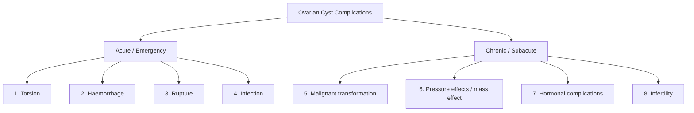
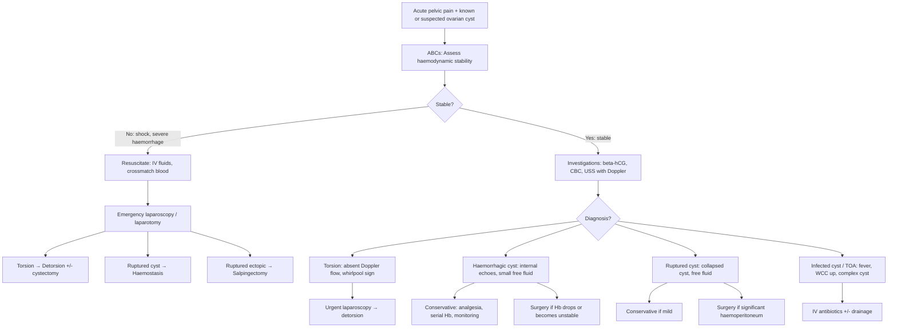

## Complications of Ovarian Cyst

### 1. Overview

Most ovarian cysts — particularly functional ones — are asymptomatic and self-resolving. However, **complications** are the reason ovarian cysts become clinically urgent. Understanding them is essential because they transform a benign, watchful-waiting condition into a surgical emergency.

***Ovarian cyst acute complications have 3 classical forms, all presenting with abdominal pain → torsion, haemorrhage, rupture*** [9]. To these, we add **infection** and **malignant transformation** as additional complications [9][17].

---

### 2. Acute Complications

#### 2.1 ***Torsion***

**"Torsion"** — from Latin *torsio* = twisting. The ovarian pedicle (containing the ovarian artery, vein, and lymphatics in the infundibulopelvic ligament and the utero-ovarian ligament) twists on its axis, compromising blood flow.

##### Pathophysiology

The sequence is predictable from first principles:

1. **Venous and lymphatic obstruction occurs first** (thin-walled veins compress before thick-walled arteries) → venous congestion → ovarian oedema
2. **Continued swelling increases intra-ovarian pressure** → arterial compromise → ischaemia
3. **Prolonged ischaemia** → haemorrhagic infarction → necrosis → peritonitis

> This is the same pathophysiology as testicular torsion — veins are compressed first because they have lower intraluminal pressure and thinner walls than arteries.

##### Risk Factors for Torsion

| Risk Factor | Mechanism |
|---|---|
| ***Dermoid cyst (mature teratoma)*** | ***Most common ovarian tumour to torse*** [3][17] — heavy (contains fat, bone, teeth), pendulous, mobile on a long pedicle. ***Dermoid cyst → usually mobile*** [9] → ***keeps rolling due to sediment*** [17] |
| **Cyst size 5–10 cm** | Large enough to create torque, but not so large that it becomes fixed by adhesions to surrounding structures |
| **Ovarian hyperstimulation (OHSS)** | Massively enlarged, heavy ovaries after IVF/gonadotropin therapy |
| **Pregnancy (1st trimester)** | Corpus luteum of pregnancy enlarges the ovary; growing uterus shifts the ovary superiorly |
| **Long ovarian pedicle** | Greater range of motion → easier to twist |
| **Previous torsion** | Stretched ligaments → recurrence risk |
| **Vigorous physical activity** | Sudden changes in body position → initiates the twisting |

##### Clinical Features

| Feature | Pathophysiological Basis |
|---|---|
| ***Sudden severe unilateral lower abdominal pain during agitating movement (e.g. exercise)*** [14] | Acute torsion of pedicle → sudden venous congestion and capsular stretching |
| **Colicky / intermittent pain** | ***Recurrent torsion/detorsion*** [3] — the ovary twists, partially untwists, then twists again |
| **Nausea and vomiting** | Vagal response to torsion of visceral peritoneum and stretching of the ovarian pedicle → vagal afferents stimulate the vomiting centre |
| ***Adnexal tenderness, ± lower abdominal tenderness and guarding*** [14] | Peritoneal irritation from congested, swollen ovary |
| **Absent/reduced Doppler flow on USS** | Twisted pedicle → arterial occlusion → no flow. "Whirlpool sign" = twisted vascular pedicle visualised on Doppler |
| **Enlarged, oedematous ovary on USS** | Venous/lymphatic congestion → interstitial oedema |
| **Low-grade fever** | Tissue ischaemia → inflammatory mediator release |

##### Management

- **Emergency laparoscopy → detorsion** (untwist the pedicle)
- **Assess ovarian viability** after detorsion — even if dusky/black, the ovary often recovers (do NOT reflexively remove it)
- **Cystectomy** if the causative cyst is identifiable and the ovary is viable (prevents recurrence)
- **Salpingo-oophorectomy** only if clearly gangrenous/necrotic with no recovery after detorsion

<Callout title="Exam Case: 24/F, Intermittent LLQ Pain, Tooth-shaped Radiodensity on AXR">
***This is a classic case from the radiology notes*** [3]: ***24/F, previously well, intermittent LLQ pain, LLQ tenderness, no rebound. AXR shows tooth-shaped radiodensity in LLQ. Impression: ovarian teratoma with recurrent torsion/detorsion*** [3]. The intermittent nature of the pain is the clue — the ovary twists (pain), then partially untwists (relief), then twists again (pain recurs). The teeth on AXR confirm a dermoid.
</Callout>

#### 2.2 ***Haemorrhage***

##### Pathophysiology

Haemorrhage into an ovarian cyst occurs when blood vessels in the cyst wall rupture. This is particularly common in:

- **Corpus luteal cysts** — the corpus luteum is inherently vascular (it develops a rich blood supply from theca interna vessels to support progesterone production). When these vessels rupture, blood fills the cyst cavity → **haemorrhagic corpus luteal cyst**
- **Endometriomas** — cyclical menstrual bleeding into the cyst cavity (the fundamental pathology of "chocolate cysts")
- **Malignant cysts** — neovascular tumour vessels are fragile and bleed easily

The haemorrhage may remain **contained within the cyst** (intracystic haemorrhage → painful but stable) or **rupture through the cyst wall** → haemoperitoneum.

##### Clinical Features

| Feature | Basis |
|---|---|
| Sudden unilateral pelvic pain | Rapid distension of cyst capsule by blood |
| Pain worse than torsion initially, then stabilises | Acute capsular stretch; blood clots and tamponades |
| USS: internal echoes within cyst, reticular "cobweb" pattern (fibrin strands) | Fresh blood → echogenic; organising clot → reticular pattern |
| USS: free fluid in pouch of Douglas (if ruptured) | Blood tracking from ruptured cyst into dependent pelvic recess |
| Falling haemoglobin, tachycardia, hypotension (if significant) | Blood loss → hypovolaemia |

##### Management

- **Haemodynamically stable + small haemoperitoneum:** Conservative (analgesia, monitoring, serial Hb, bed rest)
- **Haemodynamically unstable or large haemoperitoneum:** Emergency laparoscopy/laparotomy → haemostasis (cautery, suturing of bleeding point, cystectomy, or oophorectomy if bleeding uncontrollable) [6]

#### 2.3 ***Rupture***

##### Pathophysiology

Cyst rupture occurs when the cyst wall gives way — either spontaneously (thin-walled functional cyst) or due to trauma (including intercourse, vigorous exercise, or bimanual examination). The consequences depend on **what spills into the peritoneal cavity**:

| Cyst Type | Content Spilled | Peritoneal Response |
|---|---|---|
| **Follicular cyst** | Clear serous follicular fluid | Mild chemical peritonitis, self-limiting. ***Mid-cycle lower abdominal/pelvic pain due to rupture of follicular cyst and bleeding → irritates peritoneum*** [18] (this is "Mittelschmerz") |
| **Corpus luteal cyst** | Blood | ***Haemoperitoneum*** [6] — can be life-threatening if vessel continues to bleed actively |
| **Dermoid cyst (teratoma)** | Sebaceous material, hair, fat | ***Sebaceous material brings more irritation to peritoneum than serous or mucinous fluid*** [18] → **severe chemical peritonitis**, granulomatous reaction, dense adhesion formation |
| **Mucinous cystadenoma** | Mucin | **Pseudomyxoma peritonei** — mucinous ascites with peritoneal implants ("jelly belly"). Progressive, debilitating, requires cytoreductive surgery + HIPEC |
| **Malignant cyst** | Malignant cells | **Peritoneal carcinomatosis** — upstages from FIGO IA to IC2 (capsule rupture before surgery) or IC1 (intraoperative spill) |
| **Endometrioma** | Old blood (chocolate fluid) | Intense peritoneal inflammation, adhesion formation |

##### Clinical Features

| Feature | Basis |
|---|---|
| ***Sudden onset severe abdominal pain*** [1] | Peritoneal irritation by cyst contents |
| ***Peritoneal signs: guarding, rebound tenderness, rigidity*** | Chemical peritonitis from irritant cyst contents |
| **Shoulder tip pain** | Diaphragmatic irritation by free fluid (referred pain via phrenic nerve C3–C5) — especially with haemoperitoneum |
| ***Signs of hypovolaemic shock*** [14] | If ruptured corpus luteal cyst with active bleeding → haemoperitoneum |
| **USS: collapsed cyst wall, free fluid** | Cyst has decompressed; fluid/blood in pelvis |

##### Management

- **Mild, self-limited rupture (follicular):** Analgesia, observation
- **Significant haemoperitoneum (corpus luteal):** Resuscitation → emergency surgery → haemostasis [6]
- **Dermoid rupture:** Urgent surgical washout + adhesiolysis (to minimise chemical peritonitis and adhesion formation)
- **Mucinous rupture with pseudomyxoma peritonei:** Specialist referral → cytoreductive surgery + hyperthermic intraperitoneal chemotherapy (HIPEC)

<Callout title="Ruptured Ovarian Cyst as Cause of Haemoperitoneum" type="idea">
***Pelvic organ rupture (e.g. ruptured ovarian cyst, ruptured ectopic pregnancy)*** is a recognised cause of ***haemoperitoneum*** [6]. In the acute abdomen differential, always consider these alongside abdominal trauma, ruptured AAA, and ruptured HCC.
</Callout>

#### 2.4 ***Infection***

##### Pathophysiology

- Primary infection of an ovarian cyst is uncommon but can occur via:
  - **Ascending infection** from the lower genital tract (PID pathogens — *Neisseria gonorrhoeae*, *Chlamydia trachomatis*, polymicrobial anaerobes)
  - **Haematogenous spread** (rare)
  - **Secondary infection** of a ruptured or haemorrhagic cyst
- An infected ovarian cyst may progress to a **tubo-ovarian abscess (TOA)** when the inflammatory process involves the adjacent fallopian tube

##### Clinical Features

| Feature | Basis |
|---|---|
| Fever, rigors | Systemic inflammatory response to infection |
| Unilateral or bilateral pelvic pain | Infection → inflammation → capsular and peritoneal irritation |
| Purulent vaginal discharge | Ascending genital tract infection |
| ***Cervical motion tenderness (chandelier sign)*** [14] | Movement of the cervix tugs on the inflamed adnexal structures → exquisite pain |
| Elevated WCC, CRP | Acute phase inflammatory response |
| USS: complex cyst with thick walls, debris, loculations | Pus and inflammatory debris within the cyst |

##### Management

- **IV antibiotics** (broad-spectrum: cephalosporin + metronidazole + doxycycline)
- **Drainage** if abscess does not respond to antibiotics within 48–72 hours (percutaneous USS-guided or surgical)
- **Laparoscopy/laparotomy** if ruptured TOA → peritonitis → surgical emergency

---

### 3. Chronic / Subacute Complications

#### 3.1 Malignant Transformation

Not all ovarian cysts carry equal malignant risk. The key associations are:

| Cyst Type | Risk of Malignant Transformation | Malignancy Type |
|---|---|---|
| **Functional cysts** | Essentially zero | N/A |
| **Mature teratoma (dermoid)** | ~1–2% (almost exclusively in postmenopausal women) | Squamous cell carcinoma (arising from ectodermal component) |
| **Serous cystadenoma** | Can progress to **borderline** and then **serous cystadenocarcinoma** | Serous carcinoma (most common ovarian malignancy) |
| **Mucinous cystadenoma** | Lower than serous; benign → borderline → malignant spectrum | Mucinous carcinoma |
| **Endometrioma** | ~1% (especially large, longstanding endometriomas) | Clear cell carcinoma or endometrioid carcinoma |

> The concept of a **benign → borderline → malignant spectrum** is well established for epithelial ovarian tumours. However, the latest understanding is that many high-grade serous carcinomas actually arise de novo from the **fimbrial end of the fallopian tube** (serous tubal intraepithelial carcinoma, STIC) rather than from pre-existing ovarian cysts. This is why prophylactic bilateral salpingectomy (removing the tubes) is now increasingly offered at the time of hysterectomy for benign indications — it removes the precursor lesion.

#### 3.2 Pressure Effects / Mass Effect

Large ovarian cysts (especially mucinous cystadenomas, which can grow to enormous sizes) cause symptoms through **mechanical compression** of adjacent pelvic structures:

| Structure Compressed | Clinical Effect |
|---|---|
| **Bladder** | Urinary frequency, urgency, incomplete voiding |
| **Rectum / sigmoid colon** | Constipation, tenesmus |
| **Pelvic veins (iliac veins)** | Leg oedema, varicose veins, DVT risk. ***Ovarian cysts as extramural cause of venous obstruction*** [4] |
| **Ureters** | Hydronephrosis, renal impairment (rare, usually with very large or fixed/malignant masses) |
| **Pelvic nerves (lumbosacral plexus)** | Lower back pain, sciatica |
| **Diaphragm** (if very large or ascites) | Dyspnoea, Meigs syndrome (fibroma + ascites + right pleural effusion) |
| ***Lymphatics*** | ***Lower limb swelling — due to lymphatic invasion/impedance of lymphatic return*** [9] (more characteristic of malignancy) |

#### 3.3 Hormonal Complications

These arise from **functional** cysts or hormonally-active neoplasms:

| Hormone | Source | Complication |
|---|---|---|
| **Excess oestrogen** | Follicular cyst, granulosa cell tumour, thecoma | Menstrual irregularity, menorrhagia, endometrial hyperplasia → risk of endometrial cancer. ***Drop in secretion of ovarian hormone results in endometrial sloughing*** [18] (when oestrogen support from the cyst suddenly drops, withdrawal bleeding occurs) |
| **Excess progesterone** | Corpus luteal cyst | Amenorrhoea (mimics pregnancy — progesterone maintains endometrium), delayed menses |
| **Excess androgens** | Sertoli-Leydig cell tumour | Virilisation (hirsutism, deepening voice, clitoromegaly, male-pattern baldness) |
| **Excess thyroid hormone** | Struma ovarii (teratoma with thyroid tissue) | Hyperthyroidism (tachycardia, weight loss, tremor) |
| **Excess hCG response** | Theca lutein cysts | Associated with gestational trophoblastic disease — the primary pathology, not the cyst itself |

#### 3.4 Infertility

Ovarian cysts can impair fertility through multiple mechanisms:

| Mechanism | Examples |
|---|---|
| **Anovulation** | Large follicular cyst suppresses FSH → no new follicle recruitment; PCOS (multiple small antral follicles, anovulation) |
| **Destruction of ovarian tissue** | Large endometrioma replaces normal ovarian cortex → reduced ovarian reserve; repeated surgery on ovaries damages follicles |
| **Tubal distortion** | Large cysts or adhesions from endometriosis/PID distort tubo-ovarian anatomy → impair oocyte pick-up |
| **Hostile peritoneal environment** | Endometriosis → inflammatory peritoneal fluid with elevated cytokines, macrophages → impairs sperm function and embryo implantation |

---

### 4. Complications Related to Specific Cyst Types — Quick Reference

| Cyst Type | Most Important Complications |
|---|---|
| **Follicular cyst** | Rupture (Mittelschmerz), rarely haemorrhage. Self-resolves |
| **Corpus luteal cyst** | Haemorrhage (most common cyst to bleed significantly), rupture → haemoperitoneum [6] |
| **Dermoid cyst** | ***Torsion (most common tumour to torse)*** [3][17], rupture → chemical peritonitis, malignant transformation (~1–2%) |
| **Endometrioma** | Chronic pain, infertility, adhesion formation, malignant transformation (clear cell / endometrioid carcinoma ~1%) |
| **Mucinous cystadenoma** | Rupture → pseudomyxoma peritonei |
| **Serous cystadenoma** | Malignant transformation (benign → borderline → carcinoma) |
| **Fibroma** | Meigs syndrome (ascites + right pleural effusion) — resolves after tumour removal |
| **Theca lutein cyst** | Massive enlargement, torsion, rupture. Resolves once hCG stimulus removed |

---

### 5. Complications of Treatment (Iatrogenic)

| Complication | Context | Mechanism |
|---|---|---|
| **Reduced ovarian reserve** | Repeated cystectomy (especially for endometriomas) | Surgical excision removes normal ovarian cortex along with the cyst capsule → loss of primordial follicles |
| **Intraoperative spillage** | Laparoscopic cystectomy of malignant cyst | Rupture during extraction → peritoneal contamination → upstaging (IA → IC1) |
| **Adhesion formation** | Any pelvic surgery | Surgical trauma + inflammation → fibrinous adhesions → bands. Can cause bowel obstruction, chronic pain, infertility |
| **Surgical menopause** | Bilateral oophorectomy in premenopausal woman | Loss of ovarian oestrogen → acute menopausal symptoms (hot flushes, vaginal dryness, osteoporosis, cardiovascular risk). Requires HRT consideration |
| **Injury to adjacent structures** | Any pelvic surgery | Ureter (runs under the uterine artery — "water under the bridge"), bladder, bowel, major vessels |

<Callout title="Surgical Menopause After Bilateral Oophorectomy" type="error">
Bilateral oophorectomy in a premenopausal woman causes immediate surgical menopause — unlike natural menopause, there is no gradual transition. The sudden loss of oestrogen causes more severe vasomotor symptoms and accelerated bone loss. **HRT should be offered** to these women (at least until the natural age of menopause, ~50 years) unless contraindicated (e.g., oestrogen-receptor-positive breast cancer).
</Callout>

---

### 6. Emergency Algorithm for Ovarian Cyst Complications

---

<Callout title="High Yield Summary">

1. ***Three classical acute complications of ovarian cysts: torsion, haemorrhage, rupture*** [9][1]. All present with acute pelvic pain. **Infection** is a fourth acute complication [9][17].

2. ***Torsion:*** Most common with ***dermoid cysts*** [3][17] — heavy, mobile, pendulous. Venous obstruction occurs before arterial. **Emergency laparoscopic detorsion** — always attempt ovarian salvage.

3. **Haemorrhage:** Most common with corpus luteal cysts (highly vascular wall). Can cause haemoperitoneum [6]. Conservative if stable; surgical if unstable.

4. **Rupture:** Consequences depend on contents spilled. Follicular fluid → mild irritation (Mittelschmerz). ***Sebaceous material (dermoid) → severe chemical peritonitis*** [18]. Blood (corpus luteal) → haemoperitoneum. Mucin → pseudomyxoma peritonei. Malignant cells → peritoneal carcinomatosis and upstaging.

5. **Malignant transformation:** Endometrioma → clear cell / endometrioid carcinoma (~1%). Dermoid → SCC (~1–2%). Serous cystadenoma → borderline → serous carcinoma.

6. **Meigs syndrome:** Fibroma + ascites + right pleural effusion. Resolves completely with fibroma removal.

7. **Hormonal complications:** Oestrogen excess → endometrial hyperplasia/cancer. Progesterone excess → amenorrhoea. Androgen excess → virilisation.

8. **Iatrogenic complications:** Reduced ovarian reserve (repeated cystectomy), intraoperative spillage (upstaging malignancy), adhesion formation, surgical menopause (bilateral oophorectomy in premenopausal woman).

</Callout>

---

<ActiveRecallQuiz
  title="Active Recall - Complications of Ovarian Cyst"
  items={[
    {
      question: "Name the 3 classical acute complications of ovarian cysts mentioned in the lecture slides. Which type of cyst is most prone to each?",
      markscheme: "1. Torsion - most common with dermoid cyst (heavy, mobile, pendulous, sediment causes rolling). 2. Haemorrhage - most common with corpus luteal cyst (highly vascular wall). 3. Rupture - can occur with any cyst but clinically significant haemoperitoneum most common with corpus luteal cyst; chemical peritonitis most severe with dermoid cyst (sebaceous content). Infection is a fourth complication also highlighted.",
    },
    {
      question: "Explain why venous obstruction occurs before arterial obstruction in ovarian torsion. What is the clinical consequence of this sequence?",
      markscheme: "Veins have thinner walls and lower intraluminal pressure than arteries, so they are compressed first when the pedicle twists. Consequence: venous congestion and oedema occur while arterial inflow continues initially, causing the ovary to swell massively. The swelling then further increases intra-ovarian pressure, eventually compromising arterial inflow → complete ischaemia → haemorrhagic infarction → necrosis. Same principle as testicular torsion.",
    },
    {
      question: "What are the peritoneal consequences of rupture of each of the following: follicular cyst, corpus luteal cyst, dermoid cyst, and mucinous cystadenoma?",
      markscheme: "Follicular cyst: clear serous fluid → mild chemical peritonitis, self-limiting (Mittelschmerz). Corpus luteal cyst: blood → haemoperitoneum, can be life-threatening. Dermoid cyst: sebaceous material (fat, hair) → severe chemical peritonitis, granulomatous reaction, dense adhesions (sebaceous material is more irritating than serous or mucinous fluid). Mucinous cystadenoma: mucin → pseudomyxoma peritonei (mucinous ascites with peritoneal implants).",
    },
    {
      question: "Which benign ovarian cysts carry a risk of malignant transformation? Name the malignancy type for each.",
      markscheme: "1. Endometrioma → clear cell carcinoma or endometrioid carcinoma (approximately 1%). 2. Mature teratoma (dermoid) → squamous cell carcinoma (1-2%, almost exclusively postmenopausal). 3. Serous cystadenoma → borderline tumour → serous cystadenocarcinoma. 4. Mucinous cystadenoma → mucinous carcinoma (lower risk than serous). Functional cysts have essentially zero malignant potential.",
    },
    {
      question: "What is Meigs syndrome? Why does the pleural effusion resolve after tumour removal?",
      markscheme: "Meigs syndrome: triad of ovarian fibroma + ascites + right-sided pleural effusion. The ascites is caused by transudation of fluid from the tumour surface and peritoneal irritation. The pleural effusion occurs because peritoneal fluid tracks through transdiaphragmatic lymphatics (preferentially right-sided). After fibroma removal, the source of fluid production is eliminated, so both ascites and pleural effusion resolve completely. This resolution after tumour removal is a diagnostic criterion.",
    },
    {
      question: "Why can repeated ovarian cystectomy cause infertility? What specific histological structure is damaged?",
      markscheme: "During cystectomy, normal ovarian cortex is inevitably excised along with the cyst capsule. The ovarian cortex contains primordial follicles (the entire ovarian reserve). Each surgery removes some of these irreplaceable follicles, progressively reducing ovarian reserve. This is particularly problematic with endometrioma excision, where the cyst wall is closely adherent to the cortex. The result is diminished ovarian reserve, reduced AMH, poor response to stimulation, and potentially premature ovarian insufficiency.",
    },
  ]}
/>

---

## References

[1] Lecture slides: GC 118. Pelvic mass ovarian cancer and cysts; uterine fibroid; pelvic imaging.pdf (p12, p20, p24)
[3] Senior notes: Ryan Ho Radiology.pdf (p33 — ovarian teratoma with recurrent torsion/detorsion)
[4] Senior notes: Maksim Surgery Notes.pdf (p172 — ovarian cysts as extramural cause of venous obstruction)
[6] Senior notes: Maksim Surgery Notes.pdf (p177 — ruptured ovarian cyst as cause of haemoperitoneum)
[9] Lecture slides: Block C - Pelvic mass_ ovarian cancer and cysts; uterine fibroid; pelvic imaging.pdf (p8, p9, p10, p15)
[14] Senior notes: Ryan Ho Fundamentals.pdf (p273 — torsion/ruptured ovarian cyst clinical features)
[17] Lecture slides: Block C - O&G Theme Case 3.pdf (p4 — ovarian cyst complications: torsion, rupture, haemorrhage, infection; dermoid keeps rolling due to sediment)
[18] Senior notes: Ryan Ho GI.pdf (p151 — Mittelschmerz, sebaceous material more irritating than serous/mucinous fluid, endometrial sloughing)
