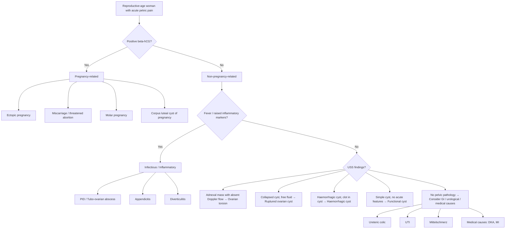

## Differential Diagnosis of Ovarian Cyst

The differential diagnosis (DDx) of an ovarian cyst is really two questions rolled into one:

1. **When you find a "cyst" on the ovary:** What type of ovarian cyst is it? (i.e., differentiating among the various ovarian cyst aetiologies discussed in the previous section — functional vs inflammatory vs neoplastic).
2. **When a patient presents with a pelvic mass or acute pelvic pain:** What else could mimic an ovarian cyst? (i.e., differentiating ovarian cyst from other pelvic pathology).

Both angles are essential for clinical practice and exams. The lecture slides emphasise that ***the most important part is the ability to formulate a list of differential diagnoses and to prioritise them according to the clinical condition*** [8].

---

### 1. Approach to the Differential Diagnosis

The approach depends on the **clinical scenario:**

| Presentation | Primary DDx Focus |
|---|---|
| **Incidental pelvic mass on imaging** | DDx of pelvic mass (gynaecological vs non-gynaecological) |
| **Acute pelvic pain in a reproductive-age woman** | Ovarian cyst complications vs ectopic pregnancy vs PID vs appendicitis |
| **Chronic pelvic pain / mass symptoms** | Ovarian cyst type, fibroid, endometriosis, malignancy |
| **Postmenopausal pelvic mass** | Ovarian malignancy until proven otherwise; benign cyst; uterine sarcoma |

<Callout title="Golden Rule" type="error">
***Attend patients who need URGENT management first. Shock, severe pain (peritoneal signs) → may require straight laparotomy. Exclude ovarian cyst complications and pregnancy complications*** [1]. In any reproductive-age woman with acute pelvic pain, **always exclude ectopic pregnancy** (β-hCG) before anything else — it is life-threatening and treatable.
</Callout>

---

### 2. DDx of a Pelvic Mass (The Overarching Framework)

The lecture slides provide a clear framework, classifying by **organ system of origin** [1]:

#### ***2.1 Gynaecological Causes*** [1]

| Category | Examples | Key Distinguishing Clues |
|---|---|---|
| ***Uterine fibroid (leiomyoma)*** | Subserosal, pedunculated, intramural | Firm, moves with cervix on bimanual exam. ***Very vascular on Doppler*** [3]. Menorrhagia with clots. Most common pelvic tumour overall |
| ***Adenomyosis*** | Diffuse or focal | Uniformly enlarged "boggy" uterus, dysmenorrhoea, menorrhagia. Moves with cervix |
| ***Pregnancy*** | ***Undiagnosed pregnancy, molar pregnancy*** | Always check β-hCG! Teenage girls especially — ***don't forget about pregnancy*** [9]. Enlarged uterus, amenorrhoea, +β-hCG |
| ***Ovarian cyst*** | Functional, endometrioma, teratoma, cystadenoma | Separate from uterus, cystic, does NOT move with cervix |
| ***Paraovarian cyst*** | Arises from mesosalpinx (Wolffian duct remnants) | Located between tube and ovary, separate from both. Thin-walled, unilocular, cannot be distinguished from ovarian cyst clinically — diagnosis often made at surgery or on USS |
| ***Hydrosalpinx*** | Blocked, dilated fallopian tube filled with serous fluid | Tubular/sausage-shaped cystic structure on USS (the "cogwheel sign" on cross-section). History of PID. Associated infertility |
| ***Malignancies*** | ***Ovarian cancer, uterine sarcoma, metastatic disease*** | Irregular, solid/mixed, fixed, ascites, raised CA125, ***bilateral + suspicious → think Krukenberg tumour, metastasis from colon, stomach, breast*** [9] |

> **Why is a paraovarian cyst important?** It arises from Wolffian (mesonephric) duct remnants in the broad ligament. Unlike ovarian cysts, it does NOT arise from the ovary itself and therefore does NOT have the same malignant potential. However, clinically it is indistinguishable and the diagnosis is often only confirmed intraoperatively.

#### ***2.2 Non-Gynaecological Causes*** [1]

| Category | Examples | Key Distinguishing Clues |
|---|---|---|
| ***Gastrointestinal*** | ***Mesenteric cyst, tumour (e.g. colorectal carcinoma), hernia, diverticulum (e.g. Meckel's), dilated bowel*** | GI symptoms (altered bowel habit, obstruction, per-rectal bleeding). CT abdomen differentiates. Mesenteric cyst: mobile perpendicular to mesentery root |
| ***Urological*** | ***Distended bladder, diverticulum, pelvic kidney, transplanted kidney*** | Check post-void residual / catheterise. Always exclude a full bladder before diagnosing a pelvic "mass." A pelvic kidney is incidental, non-tender, and visible on USS |
| ***Retroperitoneal*** | ***Sarcoma*** (***usually not palpable***) | Deep-seated, fixed, often large. Imaging (CT/MRI) essential. Rare |
| ***Others*** | ***Pseudocyst (related to previous surgeries), abscess*** | History of prior surgery (adhesions → loculated fluid = pseudocyst). Abscess: fever, raised inflammatory markers |

<Callout title="Don't Forget the Non-Gynaecological Mimics" type="error">
A **distended bladder** is one of the most embarrassing misdiagnoses of a pelvic mass. Always ask when the patient last voided and catheterise if in doubt. Similarly, a **pelvic kidney** can be mistaken for an adnexal mass on bimanual examination.
</Callout>

---

### 3. DDx of Acute Pelvic Pain (The Emergency Scenario)

***Torsion/haemorrhage of ovarian cyst, ectopic pregnancies, other early pregnancy complications and emergencies*** are the key gynaecological emergencies [8]. The DDx of acute lower abdominal/pelvic pain in a woman includes:

| Diagnosis | Key Differentiating Features |
|---|---|
| **Ruptured / haemorrhagic ovarian cyst** | Sudden onset unilateral pelvic pain, often mid-cycle (follicular) or luteal phase (corpus luteal). USS: free fluid, cyst wall collapse. May cause haemoperitoneum [6] |
| **Ovarian torsion** | Sudden, severe, colicky pain ± nausea/vomiting (vagal response to twisting of the pedicle). Tender adnexal mass. USS with Doppler: absent/reduced ovarian blood flow ("whirlpool sign" of twisted pedicle). Dermoids are the most common tumour to torse |
| ***Ectopic pregnancy*** | Amenorrhoea + positive β-hCG + unilateral pelvic pain ± vaginal bleeding. Adnexal mass ± free fluid. Always the **#1 rule-out** in reproductive-age women — ruptured ectopic is life-threatening [6][10] |
| ***PID / tubo-ovarian abscess*** | Bilateral lower abdominal pain, fever, vaginal discharge, cervical motion tenderness. Risk factors: young age, multiple sexual partners, IUD. Elevated WCC/CRP |
| ***Appendicitis*** | RLQ pain (McBurney's point), anorexia, nausea, fever. Pain migrates from periumbilical → RLQ. In pelvic appendix, may mimic right ovarian pathology. ***Important DDx of RLQ pain in women*** [10] |
| **"Mittelschmerz" pain** | ***Ovulation pain*** — mid-cycle, brief (hours), unilateral, self-limiting. Due to follicular rupture and minor peritoneal irritation by follicular fluid. Diagnosis of exclusion [10] |
| **Endometriosis** | Cyclical pain (dysmenorrhoea), dyspareunia, dyschezia, infertility. Chronic rather than acute. Tender nodules in pouch of Douglas on PV exam |
| **Ureteric colic** | Severe colicky flank-to-groin pain, haematuria. No relationship to menstrual cycle. CT KUB diagnostic |
| **UTI** | Dysuria, frequency, suprapubic pain. Urine dipstick +ve for leucocytes/nitrites |
| **Testicular torsion (male equivalent)** | Listed in paediatric surgical DDx [10] — analogous emergency in males |
| ***DKA, acute MI, Addisonian crisis*** | ***Important medical DDx of acute abdomen*** [11][12]. Must be excluded, especially DKA in a young woman with T1DM |

---

### 4. DDx Within Ovarian Cysts — Differentiating by Type

Once you've established that the mass is **ovarian** (separate from uterus on bimanual, confirmed on USS), the next step is to determine **what kind** of ovarian cyst. This is where ultrasound features, clinical context, and tumour markers guide you.

| Cyst Type | Age | USS Appearance | Key Clinical Clues | Tumour Markers |
|---|---|---|---|---|
| **Follicular cyst** | Reproductive | ***Anechoic, avascular*** [3], thin-walled, unilocular, < 8 cm | Mid-cycle pain, resolves in 4–8 weeks | Normal CA125 |
| **Corpus luteal cyst** | Reproductive | Thick wall ("ring of fire" on Doppler — peripheral vascularity), internal echoes (haemorrhagic), < 10 cm | Post-ovulation, delayed menses, mimics ectopic | Normal CA125, β-hCG –ve |
| **Theca lutein cyst** | Reproductive | Bilateral, multiple, large, multilocular | High β-hCG state (molar pregnancy, multiple pregnancy, OHSS) | Very high β-hCG |
| **Endometrioma** | Reproductive | "Ground glass" homogeneous low-level echoes, thick-walled, no internal vascularity | Dysmenorrhoea, dyspareunia, infertility | ↑CA125 (mildly) |
| **Mature teratoma** | 20–40 years | ***Variable depending on content*** [3]: fat-fluid level, dermoid plug (Rokitansky nodule), calcification | Often incidental. ***AXR: tooth-shaped radiodensity*** [3] | Normal CA125, raised AFP if immature |
| **Serous cystadenoma** | 30–50 years | Thin-walled, unilocular, anechoic (like a big simple cyst) | Cannot distinguish from large follicular cyst on USS alone → persistent, does not resolve | Normal CA125 |
| **Mucinous cystadenoma** | 30–50 years | Very large, multilocular with thin septae, echogenic mucin | Can fill entire abdomen. Unilateral | Normal CA125 |
| **Ovarian fibroma** | Postmenopausal | Solid, hypoechoic, well-circumscribed | Ascites + right pleural effusion (Meigs syndrome) | Normal CA125 |
| **Ovarian malignancy** | ***Postmenopausal*** (peak) | ***Mixed solid-cystic, thick septae, papillary projections, vascularity within solid components, bilateral, ascites*** | ***Increasing abdominal girth, ascites, weight loss*** | ***↑↑CA125 (typically > 200 U/mL)*** |

<Callout title="Exam Scenario: F/75 with increasing abdominal girth, pelvic mass, ascites, mixed solid-cystic on USS, uterus cannot be visualised" type="idea">
This is a classic exam question [3]. The answer is ***ovarian cancer*** — NOT a functional cyst (postmenopausal women don't ovulate, so functional cysts are very rare), NOT a dermoid (these are typically reproductive-age), NOT a fibroma (which is solid, not mixed). The inability to visualise the uterus suggests the mass has engulfed/replaced the ovary and obscured the uterus. Ascites with mixed solid-cystic features in a postmenopausal woman = malignancy until proven otherwise.
</Callout>

---

### 5. DDx by Clinical Presentation — Special Scenarios

#### 5.1 The Adolescent / Teenage Girl with Pelvic Mass

- ***Don't forget pregnancy*** [9] — even if the patient denies sexual activity. Always do a β-hCG.
- **Functional cysts** are common after menarche as the HPO axis matures (irregular ovulation).
- **Mature teratoma** — most common ovarian neoplasm in this age group.
- **Malignant germ cell tumours** (dysgerminoma, immature teratoma, yolk sac tumour) — rare but important; check AFP, β-hCG, LDH.

#### 5.2 The Premenopausal Woman (Adnexal Mass)

***Management approach from lecture slides*** [1]:
- ***Asymptomatic: can observe and repeat ultrasound (3–6 months)***
- ***Symptomatic: possible complications, needs removal***
- ***Persistent cyst: consider removal to confirm diagnosis (cystectomy vs salpingo-oophorectomy; laparoscopy vs laparotomy)***
- ***Suspected cancer: refer oncology, exclude secondary from colon, stomach, breast etc, staging surgery ± chemotherapy***

#### 5.3 The Postmenopausal Woman (Adnexal Mass)

- **Higher index of suspicion for malignancy** — postmenopausal ovaries are normally small and quiescent.
- Use ***RMI*** to triage [1] (detailed in previous section).
- ***If bilateral and suspicious-looking → think Krukenberg tumour*** (metastatic signet-ring cell carcinoma, usually from gastric or colonic primary) [9].

#### 5.4 Acute Abdomen — Surgical DDx Overlap

Per the surgery notes, ovarian cyst and its complications feature prominently in the DDx of acute abdomen [10][11][12]:

- ***RLQ pain DDx:*** appendicitis, caecal diverticulitis, Crohn's disease, Meckel's diverticulitis, ***Mittelschmerz, ovarian cyst complications, PID, ruptured ectopic pregnancy*** [10]
- ***Life-threatening DDx of acute abdomen:*** includes ***ruptured ectopic pregnancy*** [11] — always the top priority to exclude
- ***Paediatric acute abdomen (female):*** ***ectopic pregnancy / ovarian cyst torsion / PID*** [12]
- ***Haemoperitoneum:*** ***ruptured ovarian cyst*** and ***ruptured ectopic pregnancy*** are key pelvic causes [6]

---

### 6. How to Differentiate — Practical Clinical and Investigation Approach

| Step | What it tells you | Key action |
|---|---|---|
| **β-hCG** | Excludes pregnancy and ectopic | FIRST investigation in any reproductive-age woman with pelvic pain/mass |
| **Pelvic USS (TVS + TAS)** | Characterises the mass (simple vs complex, solid vs cystic, vascularity, septae, laterality) | ***First-line imaging for any pelvic mass*** [1] |
| **CA125** | Elevated in epithelial ovarian cancer, endometriosis, PID, TB, liver cirrhosis, menstruation — not specific | ***Calculate RMI in postmenopausal women*** [1] |
| **AFP, β-hCG, LDH** | Germ cell tumour markers (yolk sac tumour, dysgerminoma, choriocarcinoma) | Young women with solid/complex ovarian mass |
| **Inhibin** | Granulosa cell tumour marker | Postmenopausal woman with oestrogen excess symptoms |
| **CT abdomen + pelvis** | Staging if malignancy suspected; also differentiates GI/urological causes | ***RMI ≥ 200 → CT scan*** [1] |
| **MRI pelvis** | Better soft tissue characterisation; useful for endometrioma vs malignancy | Second-line when USS is indeterminate |
| **Doppler USS** | Vascularity within mass; absent flow in torsion | Whirlpool sign (torsion), ring of fire (corpus luteal cyst) |

---

### 7. Summary DDx Table — Putting It All Together

***Uterine fibroid, ovarian mass and cancer are important differential diagnoses of pelvic mass. History and physical examination usually help to suggest a diagnosis. Pelvic ultrasound is commonly performed. Management will depend on the age, symptom, condition and wish of the patient*** [1].

| Diagnosis | Moves with cervix? | Consistency | USS | β-hCG | CA125 | Special Features |
|---|---|---|---|---|---|---|
| Uterine fibroid | Yes | Firm | Solid, vascular | –ve | Normal/mildly ↑ | Menorrhagia, firm enlarged uterus |
| Ovarian cyst (functional) | No | Cystic | Anechoic, thin-walled | –ve | Normal | Self-resolves in 4–8 weeks |
| Ectopic pregnancy | No | Tender, adnexal | Adnexal mass ± free fluid, empty uterus | **+ve** | N/A | Amenorrhoea, vaginal spotting |
| Endometrioma | No | Cystic, tender | Ground glass echoes | –ve | Mildly ↑ | Cyclical pain, infertility |
| Ovarian malignancy | No | Solid/mixed, fixed | Complex, solid, papillary, ascites | –ve | ↑↑ | Postmenopausal, weight loss, ascites |
| PID/TOA | No | Tender, boggy | Tubo-ovarian complex, abscess | –ve | May be ↑ | Fever, discharge, cervical motion tenderness |
| Appendicitis | N/A | RLQ tenderness | Target sign, periappendiceal fluid | –ve | Normal | Migration of pain, anorexia, Rovsing's sign |
| Distended bladder | No | Smooth, midline | Full bladder | –ve | Normal | Disappears after catheterisation |

---

<Callout title="High Yield Summary">

1. ***DDx of pelvic mass: Gynaecological (fibroid, pregnancy, ovarian cyst, paraovarian cyst, hydrosalpinx, malignancies) vs Non-gynaecological (GI: mesenteric cyst, tumour; Urological: distended bladder, pelvic kidney; Retroperitoneal: sarcoma; Others: pseudocyst, abscess)*** [1].

2. ***Always exclude pregnancy first (β-hCG) — especially in teenage girls*** [8][9].

3. ***In the acute setting: exclude ovarian cyst complications and pregnancy complications first. Shock or peritoneal signs → may need straight laparotomy*** [1].

4. ***Premenopausal adnexal mass: Asymptomatic → observe with repeat USS in 3–6 months. Symptomatic → consider removal. Persistent → cystectomy vs salpingo-oophorectomy. Suspected cancer → oncology referral, exclude secondaries from colon, stomach, breast*** [1].

5. ***Postmenopausal adnexal mass: always calculate RMI. RMI ≥ 200 → CT + gynaecological oncology MDT*** [1].

6. ***Bilateral, suspicious adnexal masses → think Krukenberg tumour (metastatic from GI or breast primary)*** [9].

7. Key examination distinction: ovarian cyst is **separate from uterus** and does NOT move with cervix; fibroid moves with cervix.

8. The RLQ pain DDx in women must include ***Mittelschmerz, ovarian cyst complications, PID, and ruptured ectopic pregnancy*** alongside appendicitis [10].

</Callout>

---

<ActiveRecallQuiz
  title="Active Recall - Differential Diagnosis of Ovarian Cyst"
  items={[
    {
      question: "List the gynaecological and non-gynaecological categories in the differential diagnosis of a pelvic mass, with 2 examples each.",
      markscheme: "Gynaecological: (1) Uterine fibroid, (2) Pregnancy (undiagnosed, molar), (3) Ovarian cyst, (4) Paraovarian cyst, (5) Hydrosalpinx, (6) Malignancy (ovarian cancer, uterine sarcoma, metastatic). Non-gynaecological: GI (mesenteric cyst, colorectal tumour), Urological (distended bladder, pelvic kidney), Retroperitoneal (sarcoma), Others (pseudocyst, abscess). Need at least 2 from each broad category.",
    },
    {
      question: "A 17-year-old girl presents with acute abdominal pain. What is the single most important initial investigation and why?",
      markscheme: "Beta-hCG (urine or serum pregnancy test). Reason: must exclude ectopic pregnancy as a life-threatening cause of acute pelvic pain in any reproductive-age female, regardless of stated sexual history. Pregnancy is easily missed in teenagers.",
    },
    {
      question: "How do you differentiate a corpus luteal cyst from an ectopic pregnancy clinically and on investigation?",
      markscheme: "Both: delayed period, unilateral pelvic pain, adnexal mass on USS. Key difference: beta-hCG is NEGATIVE in corpus luteal cyst and POSITIVE in ectopic pregnancy. USS in ectopic: empty uterus with adnexal mass and/or free fluid; in corpus luteal cyst: thick-walled cyst with ring of fire on Doppler, normal uterine endometrium.",
    },
    {
      question: "A 75-year-old woman has increasing abdominal girth, a mixed solid-cystic pelvic mass on USS, and ascites. What is the most likely diagnosis and what key DDx must be excluded?",
      markscheme: "Most likely: ovarian cancer (postmenopausal, mixed solid-cystic, ascites). Must exclude: (1) Krukenberg tumour (metastatic from GI/breast - especially if bilateral), (2) Meigs syndrome (fibroma + ascites + pleural effusion - but fibroma is solid, not mixed), (3) Uterine sarcoma. Investigate with CA125, CT abdomen and pelvis, calculate RMI.",
    },
    {
      question: "List 4 gynaecological causes that must be considered in the differential of acute RLQ pain in a young woman.",
      markscheme: "(1) Ruptured/haemorrhagic ovarian cyst, (2) Ovarian torsion, (3) Ruptured ectopic pregnancy, (4) PID/tubo-ovarian abscess. Also acceptable: Mittelschmerz (ovulation pain). These must be distinguished from appendicitis.",
    },
  ]}
/>

---

## References

[1] Lecture slides: GC 118. Pelvic mass ovarian cancer and cysts; uterine fibroid; pelvic imaging.pdf (p23, p24, p66, p68, p71)
[3] Senior notes: Ryan Ho Radiology.pdf (p33, p39 — USS features of ovarian cyst and exam question on F/75 with ovarian cancer)
[6] Senior notes: Maksim Surgery Notes.pdf (p177 — ruptured ovarian cyst as cause of haemoperitoneum)
[8] Lecture slides: Block C - Gyanecological Emergency Notes to Students.pdf (p1 — DDx prioritisation, gynaecological emergencies)
[9] Lecture slides: Block C - Pelvic mass_ ovarian cancer and cysts; uterine fibroid; pelvic imaging.pdf (p16, p17, p28, p59)
[10] Senior notes: Maksim Surgery Notes.pdf (p89 — DDx of RLQ pain including Mittelschmerz, ovarian cyst, PID, ectopic)
[11] Senior notes: Maksim Surgery Notes.pdf (p45 — life-threatening DDx of acute abdomen)
[12] Senior notes: Maksim Surgery Notes.pdf (p336 — paediatric surgical abdomen DDx including ovarian cyst torsion)
