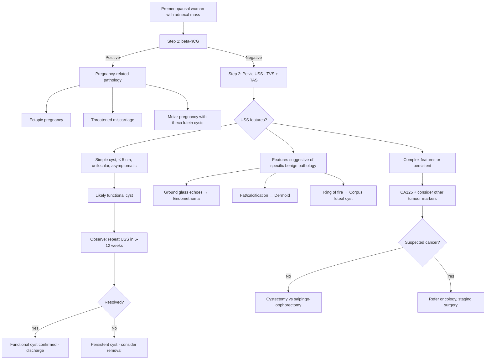
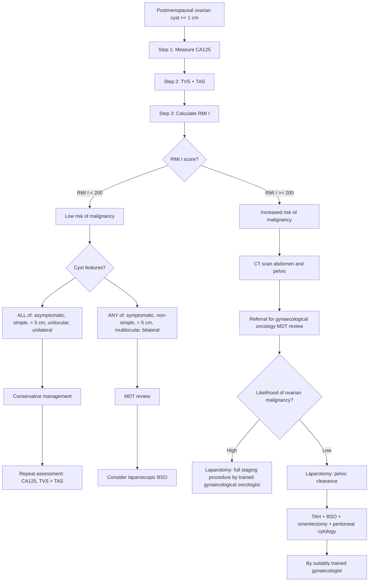
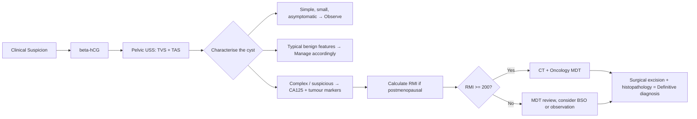

## Diagnosis of Ovarian Cyst

### 1. Diagnostic Principles — Thinking from First Principles

Unlike conditions such as rheumatoid arthritis or diabetes, ovarian cysts do not have formal "diagnostic criteria" per se (there is no equivalent of the ACR criteria or WHO diagnostic thresholds). Instead, the diagnosis is established by:

1. **Clinical suspicion** — history and examination (covered in previous sections)
2. **Imaging confirmation** — pelvic ultrasound is the cornerstone
3. **Characterisation** — determining the *type* of cyst (functional vs neoplastic vs inflammatory) and, critically, whether it is benign or malignant
4. **Tumour markers** — to risk-stratify, not to diagnose in isolation

The diagnostic challenge is not "does she have an ovarian cyst?" (USS answers that immediately) but rather **"what kind of ovarian cyst is it, and is it safe to leave alone?"** This is the clinical question that drives the entire algorithm.

---

### 2. Initial Evaluation — Bedside and History

Before any imaging, the clinical approach begins at the bedside:

| Step | Purpose | Key Points |
|---|---|---|
| **Vital signs** | ***Vital signs if in pain*** [1] — haemodynamic instability suggests rupture/torsion/ectopic | Tachycardia, hypotension → haemoperitoneum or sepsis |
| **Pregnancy test (β-hCG)** | **First and most important investigation** in any reproductive-age woman [13][14] | Must exclude ectopic pregnancy before proceeding. A positive β-hCG completely changes the differential |
| **Pain assessment** | Acute vs chronic, unilateral vs bilateral, relation to menstrual cycle | Sudden onset + severe → torsion or rupture; cyclical → endometrioma; mid-cycle → Mittelschmerz or follicular cyst |
| **Menstrual history** | Last menstrual period, regularity, intermenstrual/postmenopausal bleeding | Amenorrhoea → pregnancy or corpus luteal cyst; postmenopausal bleeding with adnexal mass → malignancy |
| **Bimanual examination** | Mass separate from uterus, ***mobility*** (***dermoid cyst → usually mobile; endometriotic cyst → not mobile due to surrounding inflammation***) [9], consistency, tenderness, ***peritoneal signs*** [1] | ***Usually separated from uterus; less mobile if adhesions, endometriosis. Usually no ascites (ascites → more neoplastic cause)*** [1][9] |

<Callout title="Key Examination Pointers from Lecture" type="idea">
***Ovarian cysts tend not to cause ascites → ascites would indicate a more neoplastic cause*** [9]. ***Dermoid cysts are usually mobile; endometriotic cysts are not mobile due to surrounding inflammation*** [9]. ***May not be palpable if small or soft*** [1]. ***Special situations: complications, Meigs syndrome*** [1].
</Callout>

---

### 3. Investigation Modalities

#### 3.1 Blood Investigations

| Investigation | Why | Key Findings and Interpretation |
|---|---|---|
| **β-hCG (serum/urine)** | Exclude pregnancy/ectopic pregnancy — the #1 life-threatening mimic [13][14] | Positive → pregnancy-related pathology (ectopic, miscarriage, molar pregnancy, theca lutein cyst). Negative → proceed with non-pregnancy workup |
| **CBC (FBC)** | Infection (↑WCC), haemorrhage (↓Hb), chronicity | ↑WCC → PID/TOA, torsion with necrosis. ↓Hb → ruptured haemorrhagic cyst. Left shift → acute inflammation |
| **CRP / ESR** | Inflammation | Elevated → PID/TOA, torsion. Normal in simple functional cysts |
| **CA125** | ***Ovarian cancer risk assessment*** [1] | See detailed interpretation below. **Not diagnostic alone** — elevated in many benign conditions |
| **AFP (alpha-fetoprotein)** | Germ cell tumour markers | ↑AFP → yolk sac tumour (endodermal sinus tumour), or immature teratoma |
| **β-hCG (as tumour marker)** | Germ cell tumour marker | ↑β-hCG → choriocarcinoma, dysgerminoma (10%), embryonal carcinoma |
| **LDH** | Germ cell tumour marker | ↑LDH → dysgerminoma (most common malignant germ cell tumour) |
| **Inhibin A and B** | Sex cord-stromal tumour marker | ↑Inhibin → granulosa cell tumour |
| **Oestradiol** | Functional status | ↑ → oestrogen-secreting tumour (granulosa cell, thecoma) causing endometrial hyperplasia |
| **Testosterone / DHEAS** | Androgen excess | ↑ → Sertoli-Leydig cell tumour, or PCOS |
| ***Serum mid-luteal progesterone*** | ***Ovulation confirmation*** (in infertility workup context) [15] | ***Measured a week before next expected period*** — level > 30 nmol/L confirms ovulation |
| ***FSH, prolactin, thyroxine*** | ***Irregular cycles workup*** [15] | ↑FSH → premature ovarian insufficiency; ↑prolactin → hyperprolactinaemia; abnormal TFTs → thyroid disease |
| **RFT, LFT** | Pre-operative baseline; also important because CA125 can be elevated in liver cirrhosis and renal failure | Elevated LFTs → hepatic cause of ↑CA125 (false positive) |
| **Clotting profile, group & save** | Pre-operative, especially if haemorrhagic cyst or planned surgery | Essential if surgery anticipated |

##### CA125 — Detailed Interpretation

CA125 (Cancer Antigen 125) is a glycoprotein expressed by coelomic epithelium (peritoneum, pleura, pericardium) and Müllerian duct derivatives (endocervix, endometrium, fallopian tube). Understanding its origin explains why it is elevated in so many conditions:

| Condition | CA125 Level | Explanation |
|---|---|---|
| **Epithelial ovarian cancer** (especially serous) | Markedly ↑↑ (often > 200 U/mL) | Tumour cells express CA125 abundantly |
| **Endometriosis** | Mildly ↑ (35–200) | Ectopic endometrial tissue expresses CA125 |
| **PID** | Mildly ↑ | Peritoneal inflammation |
| **Menstruation** | Mildly ↑ | Endometrial shedding releases CA125 |
| **Pregnancy (1st trimester)** | Mildly ↑ | Decidualised endometrium |
| **Liver cirrhosis / ascites** | ↑ | Peritoneal irritation; impaired hepatic clearance |
| **Peritoneal TB** | ↑ | Granulomatous peritoneal inflammation |
| **Uterine fibroids** | Normal or mildly ↑ | Myometrial stretching |

<Callout title="Exam Pearl" type="error">
CA125 has **poor specificity** in premenopausal women because of the many benign causes of elevation listed above. It is most useful in **postmenopausal women** where the background "noise" is lower, and as part of the ***RMI calculation*** [1]. **Never diagnose ovarian cancer on CA125 alone.**
</Callout>

#### 3.2 Imaging Investigations

##### a) ***Pelvic Ultrasound (TVS + TAS)*** — First-Line Investigation [1]

***Pelvic ultrasound is commonly performed*** [1] and is the **gold standard first-line imaging** for any pelvic mass. It is non-invasive, widely available, no radiation, and provides excellent pelvic soft tissue characterisation.

- ***TVS (Transvaginal Scanning):*** Higher frequency probe placed in the vaginal fornix → closer to the ovaries and uterus → **superior resolution** for characterising adnexal masses. The go-to approach.
- ***TAS (Transabdominal Scanning):*** Lower frequency probe on the anterior abdominal wall → **wider field of view**, better for large masses that extend beyond the pelvis. Requires a full bladder as an acoustic window.
- ***Both TVS + TAS should be performed together*** for comprehensive evaluation [1].

**Systematic USS Reporting of an Adnexal Mass** [9]:

***What to report for an adnexal mass on ultrasound:*** [9]

| Feature | What to Document | Significance |
|---|---|---|
| **Side** | Unilateral vs bilateral | ***Bilateral + suspicious → think Krukenberg tumour, metastasis*** [9] |
| **Size** | Maximum diameter in 3 planes | > 5 cm more likely neoplastic; > 7 cm → consider CT |
| **Morphology** | Cystic, solid, or mixed | Purely cystic → likely benign; solid/mixed → higher malignancy risk |
| **Wall** | Thin vs thick, smooth vs irregular | Thin + smooth = benign; thick + irregular = suspicious |
| **Septae** | Absent (unilocular), thin septae, thick septae | Thin septae = likely benign; thick septae (> 3 mm) = suspicious |
| **Internal content** | Anechoic, low-level echoes, debris, fat, calcification | Anechoic = simple cyst; ground glass = endometrioma; echogenic = dermoid/haemorrhagic |
| **Papillary projections** | Present/absent, number, height | Papillary projections = **strong indicator of malignancy** |
| **Vascularity (Doppler)** | No flow, peripheral flow, central flow, septal flow | ***A little Doppler flow is expected and normal → too much is abnormal*** [9]. Central/septal vascularity = suspicious |
| **Free fluid** | Absent, small amount, large amount | ***A little fluid in the peritoneal cavity is acceptable → too much is abnormal*** [9]. Large ascites = malignancy or rupture |
| **Associated findings** | Uterus, other adnexa, lymphadenopathy | Look at uterus first to orient yourself [9]. ***For postmenopausal women, atrophic ovaries are difficult to locate*** [9] |

##### USS Appearances by Cyst Type

| Cyst Type | USS Appearance |
|---|---|
| ***Simple cyst (functional)*** | ***Anechoic, avascular*** [3], thin-walled, well-defined, posterior acoustic enhancement. Unilocular |
| **Corpus luteal cyst** | Thick echogenic wall, "ring of fire" on colour Doppler (intense peripheral vascularity due to luteinised wall), internal echoes (haemorrhagic content), lace-like reticular pattern |
| **Endometrioma** | Homogeneous low-level internal echoes ("ground glass"), thick wall, no internal vascularity, may have wall nodularity |
| ***Mature teratoma (dermoid)*** | ***Variable appearance depending on content*** [3] — dermoid plug (Rokitansky nodule = mural echogenic nodule), fat-fluid level, "tip of the iceberg" sign (strong anterior echoes with posterior shadowing from hair/sebum), calcification |
| **Serous cystadenoma** | Thin-walled, unilocular, anechoic — indistinguishable from large simple cyst on USS |
| **Mucinous cystadenoma** | Large, multiloculated ("honeycomb" pattern), thin internal septae, variable echogenicity of locules (different mucin concentrations) |
| **Ovarian fibroma** | Solid, well-circumscribed, hypoechoic, ± posterior acoustic shadowing |
| **Ovarian malignancy** | Complex: mixed solid-cystic, thick septae (> 3 mm), papillary projections, solid components with vascularity, bilateral, ascites |

##### b) ***Plain Radiograph (AXR)***

Not routinely performed for ovarian cysts, but can provide incidental clues:
- ***AXR: tooth-shaped radiodensity*** in the pelvis → ***ovarian teratoma*** [3]
- Calcification patterns (teeth, bone fragments) are pathognomonic for mature teratoma

##### c) ***CT Scan (Abdomen and Pelvis)***

***CT scan is indicated when RMI ≥ 200*** [1] or when malignancy is suspected. It serves multiple roles:

| Role | Details |
|---|---|
| **Characterisation** | ***Definitive diagnosis for teratoma, especially when fat content is demonstrated*** [3] (fat has distinctive negative Hounsfield units on CT: -50 to -100 HU) |
| **Staging** | Evaluates peritoneal disease, lymphadenopathy (para-aortic, pelvic), omental cake, liver/lung metastases |
| **Surgical planning** | Delineates anatomical relationships, assesses operability |
| **Exclude non-gynaecological pathology** | Appendicitis, diverticulitis, urological pathology, mesenteric masses |

CT interpretation principles for ovarian masses [13]:

| CT Feature | Significance |
|---|---|
| Well-defined, round/oval | Slow, displacing growth → likely benign |
| Irregular, infiltrative | Malignancy |
| Fat density (-50 to -100 HU) | Teratoma (dermoid) |
| Calcification within cystic mass | Teratoma (teeth, bone) |
| Omental caking | Peritoneal carcinomatosis (ovarian cancer) |
| Ascites + peritoneal nodularity | Stage III/IV ovarian malignancy |

##### d) **MRI Pelvis**

Second-line imaging, used when USS is indeterminate. Superior soft tissue contrast compared to CT.

| Indication | MRI Advantage |
|---|---|
| **Indeterminate adnexal mass on USS** | T1W fat-sat sequences differentiate fat (teratoma) from blood (endometrioma) — both appear bright on T1W, but fat suppresses with fat-sat while blood does not |
| **Endometrioma vs haemorrhagic cyst** | T1W bright + T2W dark ("shading") = endometrioma (old blood with high protein/haemosiderin). Haemorrhagic cyst: T1W bright + T2W bright (acute blood) |
| **Characterising solid components** | Better than USS for determining if solid component is truly solid or just debris |
| ***Teratoma*** | ***Definitive diagnosis when fat content demonstrated*** [3] — chemical shift artifact at fat-water interface |

##### e) ***O-RADS (Ovarian-Adnexal Reporting and Data System)*** [9]

***O-RADS*** is the standardised ultrasound classification system for adnexal masses (analogous to BI-RADS for breast). It assigns risk categories based on USS features:

| O-RADS Score | Category | Management |
|---|---|---|
| **0** | Incomplete evaluation | Needs further imaging |
| **1** | Normal ovary / physiologic finding | No follow-up needed |
| **2** | Almost certainly benign (< 1% malignancy risk) | Follow-up USS |
| **3** | Low risk of malignancy (1–10%) | Follow-up USS or MRI |
| **4** | Intermediate risk (10–50%) | Referral to gynaecological oncology |
| **5** | High risk of malignancy (> 50%) | Referral to gynaecological oncology |

---

### 4. Diagnostic Algorithm

The overall diagnostic approach differs based on **menopausal status** — this is the most important branching point because the pretest probability of malignancy is fundamentally different.

#### ***4.1 Premenopausal Adnexal Mass Algorithm*** [1]

***Key management points for premenopausal adnexal mass:*** [1]
- ***Asymptomatic: can observe and repeat ultrasound (3–6 months)***
- ***Symptomatic: possible complications, needs removal***
- ***Persistent cyst: consider removal to confirm diagnosis (cystectomy vs salpingo-oophorectomy; laparoscopy vs laparotomy)***
- ***Suspected cancer: refer oncology, exclude secondary from colon, stomach, breast etc, staging surgery ± chemotherapy***

#### ***4.2 Postmenopausal Ovarian Cyst Algorithm*** [1]

This is the key algorithm from the lecture slides and must be known in detail:

***RMI I = U × M × CA125*** [1]

| ***Component*** | ***Scoring*** |
|---|---|
| ***Ultrasound score (U)*** | ***0 features = 0; 1 feature = 1; ≥ 2 features = 3. USS features: multilocular, solid areas, bilateral, ascites, metastases*** |
| ***Menopausal status (M)*** | ***Premenopausal = 1; Postmenopausal = 3*** |
| ***CA125*** | ***Absolute value in U/mL*** |

> **Example calculation:** A 65-year-old postmenopausal woman (M = 3) with a bilateral ovarian mass with solid areas (2 USS features → U = 3) and CA125 = 150 U/mL → RMI I = 3 × 3 × 150 = **1350** → well above 200 → CT + oncology MDT referral.

<Callout title="Why RMI I ≥ 200 is the threshold">
At this threshold, the sensitivity for detecting ovarian malignancy is approximately 78% and specificity is approximately 87%. It provides a pragmatic balance between catching cancers early and avoiding unnecessary surgical intervention in benign cases. The postmenopausal menopausal multiplier of 3 (vs 1 for premenopausal) reflects the inherently higher pretest probability of malignancy in postmenopausal women.
</Callout>

---

### 5. When to Use Specific Investigations — Quick Reference

| Clinical Scenario | Investigation of Choice | Rationale |
|---|---|---|
| Any reproductive-age woman with pelvic pain/mass | **β-hCG first** | Exclude ectopic pregnancy — life-threatening |
| Initial characterisation of any pelvic mass | ***TVS + TAS*** [1] | First-line, non-invasive, excellent resolution |
| ***PV detected left adnexal mass with urinary incontinence*** | ***Transvaginal USS*** [3] | Best for characterising adnexal pathology (transvaginal > transabdominal for adnexal detail) |
| Postmenopausal ovarian cyst | ***CA125 + TVS + TAS → calculate RMI*** [1] | Risk stratification for malignancy |
| Suspected malignancy / RMI ≥ 200 | ***CT abdomen and pelvis*** [1] | Staging and surgical planning |
| Indeterminate mass on USS | **MRI pelvis** | Superior soft tissue characterisation |
| Suspected dermoid (teratoma) | ***CT or MRI*** — ***definitive when fat demonstrated*** [3] | Fat has distinctive density/signal |
| ***Infertility workup — confirm tubal patency*** | ***Hysterosalpingogram (HSG)*** [3] | Radio-opaque dye instilled into uterus → tubal spill confirms patency |
| Suspected torsion | **USS with Doppler** | Absent/reduced ovarian blood flow; "whirlpool sign" of twisted pedicle |
| Young woman with solid ovarian mass | **AFP, β-hCG, LDH, inhibin** | Germ cell and sex cord-stromal tumour markers |

<Callout title="Exam Question Pattern" type="idea">
A past exam question [3] asks: "PV detected left adnexal mass with urinary incontinence — which investigation is most appropriate?" The answer is **transvaginal USS** (not transabdominal, not AXR, not HSG). TVS provides the best resolution for characterising adnexal pathology. The urinary incontinence is likely caused by mass effect on the bladder — TVS will characterise the mass AND assess its relationship to the bladder.
</Callout>

---

### 6. Histological Diagnosis — When and How

**Definitive diagnosis** of an ovarian cyst's histological type requires **tissue sampling** — but this is almost never done via percutaneous biopsy (risk of tumour seeding/spillage if malignant). Instead:

- **Surgical excision** (cystectomy or oophorectomy) → specimen sent for histopathology
- **Intraoperative frozen section** — rapid histological assessment during surgery to guide the extent of the procedure (e.g., if frozen section shows malignancy → proceed to full staging; if benign → stop at cystectomy)
- **Fine-needle aspiration (FNA)** of ovarian cysts is generally **NOT recommended** because:
  1. Cannot distinguish benign from malignant on cytology alone (needs architecture)
  2. Risk of cyst rupture and peritoneal spillage → upstaging if malignant
  3. High recurrence rate after aspiration alone

<Callout title="Important Principle" type="error">
**Do NOT aspirate an ovarian cyst to diagnose it.** The definitive diagnosis comes from surgical excision and histopathology. Aspiration risks tumour spillage (if malignant) and has a high recurrence rate. The exception is in very selected cases of clearly simple cysts in high-surgical-risk patients, but this is rare.
</Callout>

---

### 7. Summary — The Diagnostic Pathway at a Glance

---

<Callout title="High Yield Summary">

1. **β-hCG is the first investigation** in any reproductive-age woman with a pelvic mass or pelvic pain — to exclude ectopic pregnancy.

2. ***Pelvic USS (TVS + TAS) is the first-line imaging*** for all pelvic masses [1]. TVS provides superior resolution for adnexal characterisation.

3. **Systematic USS reporting** includes: side, size, morphology, wall, septae, content, papillary projections, vascularity, free fluid, and associated findings [9]. ***O-RADS*** classifies risk [9].

4. ***Simple cyst on USS: anechoic, avascular, thin-walled*** [3] — almost always benign; observe if small and asymptomatic.

5. **CA125** is useful in postmenopausal women as part of ***RMI calculation*** [1], but has poor specificity in premenopausal women (elevated in endometriosis, PID, menstruation, liver disease).

6. ***RMI I = U × M × CA125. RMI ≥ 200 → CT abdomen/pelvis + gynaecological oncology MDT referral*** [1].

7. ***CT/MRI: definitive for teratoma when fat content is demonstrated*** [3]. CT is for staging when malignancy suspected.

8. **Definitive diagnosis = surgical excision + histopathology.** Do NOT aspirate ovarian cysts for diagnosis (risk of spillage and recurrence).

9. ***Premenopausal: asymptomatic → observe with USS in 3–6 months; symptomatic → remove; persistent → cystectomy vs oophorectomy; suspected cancer → oncology referral*** [1].

10. ***Postmenopausal: low-risk RMI with simple features → conservative; low-risk with non-simple features → BSO; high-risk → staging laparotomy*** [1].

</Callout>

---

<ActiveRecallQuiz
  title="Active Recall - Diagnosis of Ovarian Cyst"
  items={[
    {
      question: "What is the first investigation you must perform in any reproductive-age woman presenting with a pelvic mass or acute pelvic pain? Why?",
      markscheme: "Beta-hCG (urine or serum pregnancy test). Reason: to exclude ectopic pregnancy, which is a life-threatening gynaecological emergency that mimics ovarian cyst (both present with adnexal mass and pelvic pain). A positive result completely changes the differential and management.",
    },
    {
      question: "Describe the USS appearances that distinguish a simple functional cyst from an endometrioma from a mature teratoma.",
      markscheme: "Simple functional cyst: anechoic, avascular, thin-walled, unilocular, posterior acoustic enhancement. Endometrioma: homogeneous low-level internal echoes (ground glass), thick wall, no internal vascularity. Mature teratoma: variable appearance depending on content - dermoid plug (Rokitansky nodule), fat-fluid level, calcification, tip of iceberg sign.",
    },
    {
      question: "Calculate the RMI I for a 62-year-old postmenopausal woman with a unilateral cyst showing solid areas and ascites on USS, and a CA125 of 300 U/mL. What is the next step?",
      markscheme: "M = 3 (postmenopausal). USS features: solid areas + ascites = 2 features, so U = 3. CA125 = 300. RMI I = 3 x 3 x 300 = 2700. This is well above 200, indicating increased risk of malignancy. Next step: CT abdomen and pelvis + referral to gynaecological oncology MDT review.",
    },
    {
      question: "Why is CA125 a poor diagnostic marker for ovarian cancer in premenopausal women? List 4 benign conditions that elevate CA125.",
      markscheme: "CA125 is expressed by coelomic epithelium and Mullerian duct derivatives, so many benign conditions elevate it, reducing specificity. Benign causes: (1) endometriosis, (2) PID/pelvic infection, (3) menstruation, (4) liver cirrhosis/ascites, (5) pregnancy (first trimester), (6) uterine fibroids. Any 4 accepted.",
    },
    {
      question: "Why should you NOT perform fine-needle aspiration of an ovarian cyst to diagnose it?",
      markscheme: "Three reasons: (1) Cytology alone cannot reliably distinguish benign from malignant (needs tissue architecture for histological diagnosis). (2) Risk of cyst rupture and peritoneal spillage, which upstages the disease if malignant (e.g. from stage IA to IC). (3) High recurrence rate after aspiration alone. Definitive diagnosis requires surgical excision and histopathology.",
    },
    {
      question: "A past exam question describes a patient with PV-detected left adnexal mass and urinary incontinence. What is the most appropriate investigation and why?",
      markscheme: "Transvaginal ultrasound (TVS). It provides the best resolution for characterising adnexal pathology (higher frequency probe, closer to structures). It will characterise the mass and assess its relationship to the bladder (which is likely compressed, causing the incontinence). Not transabdominal USS (lower resolution for adnexal detail), not AXR, not HSG (for tubal patency, not mass characterisation).",
    },
  ]}
/>

---

## References

[1] Lecture slides: GC 118. Pelvic mass ovarian cancer and cysts; uterine fibroid; pelvic imaging.pdf (p20, p21, p66, p68)
[3] Senior notes: Ryan Ho Radiology.pdf (p33, p39, p40 — USS features, AXR findings, exam questions)
[9] Lecture slides: Block C - Pelvic mass_ ovarian cancer and cysts; uterine fibroid; pelvic imaging.pdf (p15, p16, p18, p28, p30)
[13] Senior notes: Ryan Ho Diagnostic Radiology.pdf (p39 — CT interpretation principles)
[14] Senior notes: Ryan Ho Fundamentals.pdf (p279 — initial workup of acute abdomen including pregnancy test)
[15] Lecture slides: GC 117. I want to have a baby male and female infertility.pdf (p24 — ovulation investigations)
