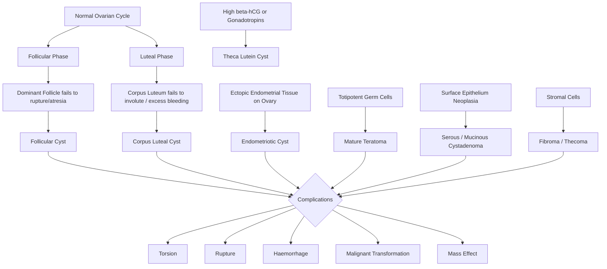

# Ovarian Cyst

## 1. Definition

An **ovarian cyst** is any fluid-filled sac arising from or within the ovary, typically ≥ 1 cm in diameter. The term encompasses a broad spectrum of pathology — from entirely physiological, self-resolving functional cysts that are part of normal ovulation, all the way to neoplastic cysts (benign or malignant). The clinical importance lies in distinguishing the harmless from the dangerous.

> **Etymology:** "Ovarian" = pertaining to the ovary (Latin *ovarium*, from *ovum* = egg); "Cyst" = from Greek *kystis* = bladder/sac. So literally, a "sac on the egg-producing organ."

<Callout title="Key Conceptual Point">
Not all ovarian cysts are pathological. The dominant follicle before ovulation and the corpus luteum after ovulation are both, technically, "cysts." They become clinically relevant only when they persist, enlarge, cause symptoms, or develop features suspicious of malignancy.
</Callout>

---

## 2. Epidemiology

- **Extremely common:** Ovarian cysts are found incidentally in up to 18% of postmenopausal women and are even more frequent in premenopausal women on imaging.
- **Functional cysts** are the most common type overall, occurring in virtually all ovulating women at some point.
- **Mature cystic teratoma (dermoid cyst)** is the most common benign ovarian neoplasm, accounting for ~10–20% of all ovarian tumours. Peak incidence: reproductive age (20–40 years).
- ***Epithelial ovarian tumours*** (serous and mucinous cystadenomas) become more common with advancing age, peaking in the 40s–60s.
- **Endometriotic cysts ("chocolate cysts")** affect ~17–44% of women with endometriosis.
- In Hong Kong, ovarian cancer ranks as the **6th most common cancer in women** (Hong Kong Cancer Registry data), with epithelial ovarian cancer being the predominant histological type.

---

## 3. Risk Factors

| Risk Factor | Mechanism / Explanation |
|---|---|
| **Reproductive age** | Active ovulation → functional cysts are physiological |
| **Endometriosis** | Ectopic endometrial tissue implants on ovary → forms endometrioma |
| **PCOS** | Anovulation → multiple small follicles arrested at 2–9 mm ("string of pearls") |
| **Ovulation induction (e.g. clomiphene, gonadotropins)** | Hyperstimulation → theca lutein cysts (multiple, bilateral) |
| **Tamoxifen** | Weak oestrogen agonist effect on ovary → functional cysts |
| **Smoking** | Associated with functional cysts (altered HPO axis) |
| **Tubal ligation / hysterectomy** | Altered ovarian blood flow → may predispose to cyst formation |
| **Early menarche / late menopause** | Prolonged ovulatory lifespan → increased cumulative risk |
| **Family history of ovarian/breast cancer (BRCA1/2)** | Risk of malignant ovarian neoplasms (but these can also present as "cysts") |
| ***Obesity, insulin resistance*** | Associated with PCOS and anovulatory cysts [1][2] |

---

## 4. Anatomy and Functional Review

### 4.1 Ovarian Anatomy

- **Paired organs**, almond-shaped, ~3 × 2 × 1 cm in the reproductive-age woman, located in the **ovarian fossa** on the lateral pelvic wall (bounded by the external iliac vessels above and the ureter and internal iliac artery behind).
- **Attachments:**
  - **Mesovarium** — posterior leaf of the broad ligament; contains ovarian vessels
  - **Suspensory (infundibulopelvic) ligament** — carries the **ovarian artery and vein** from the aorta/IVC (right) and renal vein (left) to the ovary
  - **Ovarian ligament (proper)** — connects ovary to uterine cornu (does NOT contain major vessels)
- **Blood supply:** Ovarian artery (branch of abdominal aorta at L2) + anastomosis with uterine artery branch. Venous drainage: right ovarian vein → IVC; left ovarian vein → left renal vein.
- **Lymphatic drainage:** Para-aortic lymph nodes (because of embryological gonadal origin from retroperitoneum).

### 4.2 Ovarian Histology (Three Layers)

| Layer | Components | Clinical Relevance |
|---|---|---|
| **Surface epithelium** (modified peritoneal mesothelium) | Single layer of cuboidal/columnar cells | Origin of **epithelial tumours** (serous, mucinous, endometrioid, clear cell) — the most common group of ovarian neoplasms |
| **Cortex** (stroma + follicles) | Primordial → primary → secondary → Graafian follicles; theca and granulosa cells | Origin of **sex cord-stromal tumours** (granulosa cell tumour, fibroma, thecoma) and **functional cysts** |
| **Medulla** | Loose connective tissue, hilar cells, blood vessels, nerves | Rarely gives rise to tumours |

### 4.3 Normal Ovarian Physiology (The Follicular Cycle)

Understanding the normal cycle is essential because functional cysts are just exaggerations of normal physiology:

1. **Follicular phase:** FSH recruits a cohort of follicles → one dominant follicle emerges (reaches ~20 mm), producing oestradiol.
2. **Ovulation:** LH surge → follicle ruptures → oocyte released.
3. **Luteal phase:** Ruptured follicle becomes the **corpus luteum** → produces progesterone (and some oestrogen). If no pregnancy, it involutes into the **corpus albicans** by ~day 14 post-ovulation.

> A **follicular cyst** = dominant follicle that fails to ovulate and keeps growing.
> A **corpus luteal cyst** = corpus luteum that fails to involute, fills with blood, and enlarges.

---

## 5. Aetiology and Classification

### ***5.1 Types of Benign Ovarian Masses*** [1]

This classification from the lecture slides is **high-yield** and must be memorised:

| ***Type*** | ***Entities*** |
|---|---|
| ***Functional*** | ***Follicular cyst, corpus luteal cyst, theca luteal cyst*** |
| ***Inflammatory*** | ***Endometriotic cyst, tubo-ovarian abscess*** |
| ***Germ cell*** | ***Mature teratoma (dermoid cyst)*** |
| ***Epithelial*** | ***Serous cystadenoma, mucinous cystadenoma, clear cell cystadenoma*** |
| ***Sex cord-stromal*** | ***Fibroma, thecoma*** |
| ***Others*** | ***Ovarian ectopic*** |

<Callout title="High Yield Classification" type="idea">
This table directly from the lecture is the framework you should use when asked "What are the causes of ovarian cyst?" in an exam. Classify by type (functional → inflammatory → neoplastic by cell of origin) rather than just listing randomly.
</Callout>

### 5.2 Detailed Aetiology and Pathophysiology

#### 5.2.1 Functional Cysts

These arise from the **normal ovulatory process gone slightly awry**. They are the most common ovarian cysts. By definition, they are **non-neoplastic** and usually **self-resolve** within 1–3 menstrual cycles.

##### a) ***Follicular Cyst***

- **Pathophysiology:** A Graafian (dominant) follicle fails to rupture or fails to undergo atresia → continues to be stimulated by FSH/LH → accumulates follicular fluid → enlarges (typically 3–8 cm, can reach up to 10 cm).
- Lined by **granulosa cells** (which produce oestrogen), so a large follicular cyst can produce enough oestrogen to cause:
  - **Menstrual irregularity** (oestrogen suppresses FSH via negative feedback → anovulation → delayed or missed period, followed by withdrawal bleed)
  - Breast tenderness
- Usually **unilateral, unilocular, thin-walled, anechoic** on ultrasound.
- **Natural history:** Most resolve spontaneously within 4–8 weeks as hormonal support wanes.

##### b) ***Corpus Luteal Cyst***

- **Pathophysiology:** After ovulation, the corpus luteum normally fills with a small amount of blood (corpus haemorrhagicum). If bleeding into the cavity is excessive or resorption fails, it forms a **corpus luteal cyst** (typically 3–10 cm).
- Lined by **luteinised granulosa and theca cells** → produces **progesterone** (and oestrogen).
- Can cause a **delayed period** (progesterone maintains the endometrium, mimicking early pregnancy) → important DDx of ectopic pregnancy!
- More likely to be **haemorrhagic** (internal echoes on USS, "lace-like" reticular pattern of fibrin strands) and more prone to **rupture** than follicular cysts.
- **Rupture** → haemoperitoneum → acute abdomen (see Complications).

##### c) ***Theca Lutein Cyst***

- **Pathophysiology:** Overstimulation of ovarian follicles by **high levels of β-hCG** or exogenous gonadotropins → massive luteinisation of theca cells → **bilateral, multiple, large cysts** (can be massive, up to 20–30 cm).
- **Causes of high β-hCG:**
  - **Gestational trophoblastic disease** (hydatidiform mole, choriocarcinoma)
  - **Multiple pregnancy**
  - Ovarian hyperstimulation syndrome (OHSS) — iatrogenic, from IVF/gonadotropin therapy
- These usually resolve once the hCG stimulus is removed (e.g., after evacuation of molar pregnancy).

<Callout title="Exam Trap" type="error">
Students often confuse corpus luteal cyst with ectopic pregnancy because both present with a delayed period and adnexal mass. Always do a **β-hCG** in any reproductive-age woman with pelvic pain and a missed period.
</Callout>

#### 5.2.2 Inflammatory Cysts

##### a) ***Endometriotic Cyst (Endometrioma / "Chocolate Cyst")***

- **Pathophysiology:** Ectopic endometrial glands and stroma implant on the ovarian surface → undergo cyclical menstrual bleeding (oestrogen-dependent) → blood collects within the ovary forming a **"chocolate cyst"** (thick, dark-brown, old blood = haemosiderin-laden, denatured blood that looks like melted chocolate).
- Typically **unilateral or bilateral**, thick-walled, with **homogeneous low-level internal echoes** ("ground glass" appearance on USS).
- Associated with **endometriosis** elsewhere (dysmenorrhoea, dyspareunia, dyschezia, infertility).
- Does NOT resolve spontaneously — requires medical (hormonal suppression) or surgical (excision/drainage) management.
- **Malignant transformation:** Small risk (~1%) of transformation into **endometrioid or clear cell carcinoma** of the ovary (particularly in longstanding, large endometriomas).

##### b) ***Tubo-ovarian Abscess (TOA)***

- **Pathophysiology:** Ascending infection (usually from PID — *Neisseria gonorrhoeae*, *Chlamydia trachomatis*, polymicrobial) → involves the fallopian tube (salpingitis) → spreads to and involves the ovary → a walled-off collection of pus forms, incorporating the tube and ovary.
- Presents with fever, severe pelvic pain, adnexal tenderness, cervical motion tenderness, and elevated inflammatory markers.
- **Important to distinguish from a simple ovarian cyst because TOA requires antibiotics ± drainage, not simple observation.**

#### 5.2.3 Benign Neoplastic Cysts

These are **true neoplasms** — they grow autonomously and do not resolve with observation (unlike functional cysts). Classified by **cell of origin**.

##### a) ***Mature Cystic Teratoma (Dermoid Cyst)*** — Germ Cell Origin

- **Pathophysiology:** Arises from **totipotent germ cells** that undergo differentiation into mature tissues from all three germ layers (ectoderm, mesoderm, endoderm). Hence, can contain:
  - **Ectodermal derivatives:** Skin, hair, sebaceous glands, neural tissue
  - **Mesodermal derivatives:** Bone, cartilage, fat, muscle
  - **Endodermal derivatives:** Thyroid tissue (struma ovarii), GI mucosa
- Usually **unilateral** (bilateral in ~10%), well-encapsulated, slow-growing.
- **Imaging:**
  - ***AXR: tooth-shaped radiodensity*** (calcified teeth/bone) in the pelvis [3]
  - ***USS: variable appearance depending on content*** — may show "dermoid plug" (Rokitansky nodule), fat-fluid level, hair [3]
  - ***CT/MRI: definitive diagnosis, especially when fat content is demonstrated*** [3]
- **Complications:**
  - ***Torsion*** — dermoids are the most common ovarian tumour to undergo torsion (because they are heavy, pendulous, and mobile)
  - Rupture → chemical peritonitis (sebaceous material is intensely irritant)
  - **Malignant transformation** (~1–2%, usually **squamous cell carcinoma** in postmenopausal women)
  - Struma ovarii → can cause **hyperthyroidism** (functional thyroid tissue)

> **"Teratoma"** → Greek *teras* = monster + *-oma* = tumour. Named because these tumours can contain a monstrous mix of hair, teeth, and bone.

##### b) Epithelial Cystadenomas — Surface Epithelial Origin

- **Serous cystadenoma:**
  - Most common benign epithelial ovarian tumour.
  - **Thin-walled, unilocular**, contains clear, straw-coloured fluid.
  - Lined by **ciliated tubal-type epithelium** (resembling fallopian tube lining).
  - Usually moderate size (5–15 cm). **Bilateral in ~20%.**
  - Malignant counterpart: serous cystadenocarcinoma (most common ovarian malignancy overall).

- ***Mucinous cystadenoma:***
  - Can become **very large** (up to 30–40 cm, filling the entire abdomen — historically the largest tumours in medicine).
  - **Multilocular** (multiple septated locules), filled with **thick, gelatinous, mucin-rich fluid**.
  - Lined by **mucin-secreting columnar epithelium** (resembling endocervical or GI epithelium).
  - Usually **unilateral**.
  - **Complication:** If ruptured → **pseudomyxoma peritonei** (mucinous ascites with peritoneal implants — "jelly belly"). This is actually more commonly from appendiceal mucinous tumours, but ovarian mucinous tumours are a classic association.

- **Clear cell cystadenoma:**
  - Less common. Contains clear cells with glycogen (hence "clear" on histology — PAS-positive, diastase-sensitive).
  - **Strong association with endometriosis** (may arise from endometriotic cysts).

##### c) ***Sex Cord-Stromal Tumours***

- ***Fibroma:***
  - Solid tumour of ovarian stromal fibroblasts (though may have cystic degeneration).
  - **Non-functional** (does not produce hormones).
  - **Meigs syndrome** = ovarian fibroma + ascites + right-sided pleural effusion. Why right-sided? Because peritoneal fluid preferentially tracks through transdiaphragmatic lymphatics on the right side.
  - Removal of the fibroma → resolution of ascites and effusion (curative).

- ***Thecoma:***
  - Arises from **theca cells** of the ovarian stroma.
  - **Functional** — produces **oestrogen** → may cause abnormal uterine bleeding, endometrial hyperplasia, or even endometrial cancer.
  - Almost always **benign**.
  - Predominantly postmenopausal.

#### 5.2.4 Other

- ***Ovarian ectopic pregnancy:*** Implantation of a fertilised ovum on the ovary itself (very rare, ~3% of ectopic pregnancies). Presents as an adnexal mass with positive β-hCG [1].

---

## 6. Relevant Classification Systems

### 6.1 Classification by Functionality

| Type | Examples | Hormone Production |
|---|---|---|
| **Non-functional** | Follicular cyst (small), fibroma, cystadenoma, teratoma | No hormone excess |
| **Functional (oestrogen-producing)** | Large follicular cyst, thecoma, granulosa cell tumour | Oestrogen → menstrual irregularity, endometrial hyperplasia |
| **Functional (progesterone-producing)** | Corpus luteal cyst | Progesterone → amenorrhoea, pregnancy-like symptoms |
| **Functional (androgen-producing)** | Sertoli-Leydig cell tumour | Androgens → virilisation |
| **Functional (hCG-related)** | Theca lutein cyst | Response to hCG, not producing hormones per se |

### 6.2 Simple vs Complex Cysts (Ultrasound-Based)

This distinction is critical for management:

| Feature | Simple Cyst | Complex Cyst |
|---|---|---|
| **Walls** | Thin, smooth | Thick, irregular |
| **Septae** | None (unilocular) | Present (multilocular) |
| **Contents** | Anechoic (clear fluid) | Mixed echogenicity, solid components, debris |
| **Vascularity** | None within cyst wall | Vascularity within solid/septal components |
| **Papillary projections** | Absent | Present → raises concern for malignancy |
| **Typical dx** | Functional cyst, simple serous cystadenoma | Endometrioma, teratoma, malignancy |

> ***USS findings of a simple cyst: anechoic, avascular*** [3]

### ***6.3 Risk of Malignancy Index (RMI)*** [1]

The **RMI** is used to triage ovarian masses, particularly in ***postmenopausal*** women, to determine the likelihood of malignancy and guide referral.

***RMI I = Ultrasound score (U) × Menopausal status (M) × CA125 level***

| Component | Scoring |
|---|---|
| ***Ultrasound score (U)*** | 0 points if 0 features; 1 point if 1 feature; 3 points if ≥ 2 features. Features: multilocular, solid areas, bilateral, ascites, metastases |
| ***Menopausal status (M)*** | 1 if premenopausal; 3 if postmenopausal (postmenopausal = ≥ 1 year amenorrhoea or age ≥ 50 after hysterectomy) |
| ***CA125*** | Absolute value in U/mL |

***RMI I < 200 → low risk of malignancy***
***RMI I ≥ 200 → increased risk of malignancy*** → ***CT scan (abdomen and pelvis)*** → ***Referral for gynaecological oncology MDT review*** [1]

<Callout title="High Yield: RMI Algorithm for Postmenopausal Ovarian Cyst">

***For a postmenopausal ovarian cyst (≥ 1 cm):*** [1]

1. ***Measure CA125***
2. ***TVS + TAS (transvaginal + transabdominal scanning)***
3. ***Calculate RMI I***

- ***RMI I < 200 (low risk):***
  - Cysts fulfilling ***ALL*** of: ***asymptomatic, simple cyst, < 5 cm, unilocular, unilateral*** → ***consider conservative management (usually bilateral)*** → ***repeat assessment with CA125, TVS + TAS***
  - Cysts with ***ANY*** of: ***symptomatic, non-simple features, > 5 cm, multilocular, bilateral*** → ***MDT review → consider laparoscopic BSO (bilateral salpingo-oophorectomy)***

- ***RMI I ≥ 200 (high risk):***
  - ***CT scan (abdomen and pelvis)***
  - ***Referral for gynaecological oncology MDT review***
  - ***High likelihood of ovarian malignancy*** → ***Laparotomy: full staging procedure by a trained gynaecological oncologist***
  - ***Low likelihood of ovarian malignancy*** → ***Laparotomy: pelvic clearance (TAH + BSO + omentectomy + peritoneal cytology) by a suitably trained gynaecologist***

</Callout>

---

## 7. Clinical Features

### 7.1 Symptoms

Many ovarian cysts are **asymptomatic** and found **incidentally** on imaging. When symptoms occur, they are due to **mass effect, hormonal activity, or complications** (torsion, rupture, haemorrhage, infection).

| Symptom | Pathophysiological Basis |
|---|---|
| **Asymptomatic / incidental finding** | Small cysts (< 5 cm) do not distort pelvic structures and produce no hormonal excess |
| **Pelvic pain / lower abdominal discomfort** | Stretching of the ovarian capsule by the expanding cyst → activation of visceral nociceptors. Dull, aching, unilateral |
| **Pelvic pressure / heaviness** | Mass effect of an enlarging cyst compressing pelvic structures |
| **Dyspareunia (deep)** | Cyst compresses or displaces the pouch of Douglas → painful with deep penetration |
| **Menstrual irregularity (oligomenorrhoea, amenorrhoea, or metrorrhagia)** | **Follicular cyst:** excess oestrogen → suppresses FSH → anovulation → amenorrhoea followed by withdrawal bleed. **Corpus luteal cyst:** excess progesterone → maintains endometrium → delayed menses mimicking pregnancy. **Thecoma/granulosa cell tumour:** excess oestrogen → endometrial hyperplasia → irregular/heavy bleeding |
| **Bloating / increased abdominal girth** | Large cysts (especially mucinous cystadenomas) can fill the pelvis and abdomen. In malignancy: ascites contributes |
| ***Increasing abdominal girth with ascites*** | ***Suggestive of ovarian malignancy*** (especially in postmenopausal women) [1][3] |
| **Urinary frequency / urgency** | Anterior cyst compresses the bladder → reduced bladder capacity → increased urinary frequency |
| **Constipation** | Posterior cyst compresses the rectosigmoid colon → impaired transit |
| **Back pain** | Cyst compresses the lumbosacral nerve plexus or sacral hollow |
| **Leg swelling / varicose veins** | ***Large ovarian cysts can cause extramural venous obstruction*** → compresses pelvic veins (especially iliac veins) → impaired venous return → varicose veins, leg oedema [4] |
| **Acute severe pelvic pain** | Complication: **Torsion** (sudden twisting of ovarian pedicle → ischaemia), **Rupture** (cyst wall gives way → peritoneal irritation ± haemoperitoneum), **Haemorrhage** (into the cyst) |
| **Virilisation (hirsutism, deepening voice, clitoromegaly)** | Androgen-producing tumour (Sertoli-Leydig cell tumour) — rare |
| **Symptoms of hyperthyroidism** | Struma ovarii (teratoma with functioning thyroid tissue) — rare |

### 7.2 Signs

| Sign | Pathophysiological Basis |
|---|---|
| **Pelvic/abdominal mass** | The cyst itself. Arises from the pelvis → on bimanual examination, mass is felt separate from the uterus (unlike fibroids). On abdominal examination: lower abdominal mass, cannot get below it (arises from pelvis) |
| **Mass characteristics:** smooth, cystic, mobile, non-tender | Suggests benign cyst (smooth capsule, fluid content, free of adhesions) |
| **Mass characteristics:** irregular, fixed, hard, nodular | Raises suspicion for malignancy (infiltration of surrounding structures, solid components) |
| ***Mass is separate from the uterus on bimanual examination*** | Key distinguishing feature from uterine fibroids (which move with the cervix on bimanual) |
| **Adnexal tenderness** | Capsular stretching, haemorrhage, or torsion |
| **Cervical motion tenderness (chandelier sign)** | Torsion or ruptured cyst with peritoneal irritation; also PID/TOA |
| **Ascites (shifting dullness, fluid thrill)** | Malignancy → peritoneal carcinomatosis; or **Meigs syndrome** (fibroma + ascites + pleural effusion) |
| **Pleural effusion (reduced breath sounds, dullness to percussion at right base)** | Meigs syndrome (usually right-sided, because diaphragmatic lymphatics preferentially drain rightward) |
| **Signs of oestrogen excess:** endometrial thickening, breast tenderness | Oestrogen-secreting tumours (granulosa cell tumour, thecoma, large follicular cyst) |
| **Signs of androgen excess:** hirsutism, acne, male-pattern baldness | Androgen-secreting tumours (Sertoli-Leydig cell tumour) |
| **Signs of peritonism (guarding, rebound tenderness, rigidity)** | Complication: ruptured cyst (chemical or haemoperitoneum), torsion with necrosis, or ruptured TOA |
| **Tachycardia, hypotension** | Haemodynamic instability from significant haemoperitoneum (ruptured corpus luteal cyst) or sepsis (ruptured TOA) |

### 7.3 Clinical Approach to Examining an Ovarian Cyst

**Abdominal examination:**
- Inspect: distension, scars (previous laparoscopy/laparotomy)
- Palpate: lower abdominal mass (cannot get below it = pelvic origin), tenderness, consistency (cystic vs solid), mobility, surface (smooth vs nodular)
- Assess for ascites: shifting dullness, fluid thrill
- Check for hepatomegaly (metastatic disease)

**Bimanual pelvic examination:**
- Assess uterine size and mobility
- Palpate adnexae: size, consistency, mobility, tenderness of the mass
- Determine if the mass is **separate from the uterus** (ovarian) or **moves with the cervix** (uterine)
- Assess the **pouch of Douglas**: fullness suggests ascites or mass

**Speculum examination:**
- Assess cervix (rule out cervical pathology)
- Any discharge, bleeding

<Callout title="Distinguishing Ovarian Cyst from Uterine Fibroid on Examination" type="idea">

| Feature | Ovarian Cyst | Uterine Fibroid |
|---|---|---|
| Moves with cervix | No | Yes |
| Separate from uterus | Yes | No (arises from uterus) |
| Consistency | Cystic (fluctuant) | Firm/hard |
| Surface | Smooth | May be irregular (multiple fibroids) |
| Laterality | Usually lateral to uterus | Central (midline) |

</Callout>

---

## 8. Special Considerations for Hong Kong

- **Endometriotic cysts** are common in the Hong Kong population, correlating with global endometriosis prevalence (~10% of reproductive-age women). Local practice emphasises conservative management and fertility preservation given the city's already low birth rate.
- **Mature cystic teratomas** are the most common benign ovarian neoplasm in Hong Kong, consistent with international data.
- **BRCA mutations** — while overall prevalence is lower in East Asian populations compared to Ashkenazi Jewish populations, BRCA-associated ovarian cancer still accounts for ~15–20% of high-grade serous ovarian carcinomas in Hong Kong Chinese women. Genetic counselling and BRCA testing are increasingly offered at HKU/QMH for patients with high-grade serous ovarian cancer.
- **CA125:** Can be elevated in benign conditions common in Hong Kong (e.g., endometriosis, pelvic inflammatory disease, hepatitis/liver cirrhosis) — leading to false positives. This must be interpreted in context.

---

## 9. Key Pathophysiology Summary Diagram

---

<Callout title="High Yield Summary">

1. **Ovarian cysts** range from physiological (functional) to neoplastic (benign and malignant). ***Classification: Functional, Inflammatory, Germ cell, Epithelial, Sex cord-stromal, Others*** [1].

2. ***Functional cysts*** (follicular, corpus luteal, theca lutein) are the most common and usually self-resolve. They arise from exaggerations of normal ovulatory physiology.

3. ***Endometriotic cysts*** ("chocolate cysts") are oestrogen-dependent, cyclically bleed, and do NOT resolve spontaneously. Small risk of clear cell / endometrioid carcinoma transformation.

4. ***Mature cystic teratoma (dermoid)*** is the most common benign ovarian neoplasm. Contains tissues from all three germ layers. Most common ovarian tumour to torse. ***AXR: tooth-shaped radiodensity; CT/MRI: diagnostic when fat demonstrated*** [3].

5. ***Mucinous cystadenomas*** can become enormous. Rupture → pseudomyxoma peritonei.

6. ***Meigs syndrome*** = fibroma + ascites + right pleural effusion (resolves with tumour removal).

7. ***RMI I = U × M × CA125***. ***RMI ≥ 200 → CT + gynaecological oncology MDT referral*** [1].

8. ***Postmenopausal ovarian cyst algorithm:*** Measure CA125 → TVS + TAS → Calculate RMI → triage into low risk (conservative vs BSO) or high risk (staging laparotomy vs pelvic clearance) [1].

9. Key distinguishing feature from fibroid: ovarian mass is **separate from the uterus** on bimanual examination and does NOT move with the cervix.

10. Always perform **β-hCG** in reproductive-age women with pelvic pain + adnexal mass to rule out ectopic pregnancy.

</Callout>

---

<ActiveRecallQuiz
  title="Active Recall - Ovarian Cyst: Definition, Epidemiology, Aetiology, Classification, Clinical Features"
  items={[
    {
      question: "List the 6 categories of benign ovarian masses as classified in the lecture slides, with one example each.",
      markscheme: "1. Functional (e.g. follicular cyst, corpus luteal cyst, theca lutein cyst). 2. Inflammatory (e.g. endometriotic cyst, tubo-ovarian abscess). 3. Germ cell (e.g. mature teratoma / dermoid). 4. Epithelial (e.g. serous cystadenoma, mucinous cystadenoma). 5. Sex cord-stromal (e.g. fibroma, thecoma). 6. Others (e.g. ovarian ectopic).",
    },
    {
      question: "Explain the pathophysiology of a follicular cyst and why it may cause menstrual irregularity.",
      markscheme: "Dominant Graafian follicle fails to rupture or undergo atresia, continues to accumulate follicular fluid and enlarge. Lined by granulosa cells producing oestrogen. Excess oestrogen suppresses FSH via negative feedback, causing anovulation and amenorrhoea, followed by withdrawal bleeding when the cyst eventually regresses.",
    },
    {
      question: "What is the RMI I formula and what is the threshold that indicates increased risk of malignancy?",
      markscheme: "RMI I = Ultrasound score (U) x Menopausal status (M) x CA125 (absolute value in U/mL). U: 0 if 0 features, 1 if 1 feature, 3 if 2+ features (multilocular, solid areas, bilateral, ascites, metastases). M: 1 if premenopausal, 3 if postmenopausal. Threshold: RMI >= 200 indicates increased risk of malignancy, warrants CT and gynaecological oncology MDT referral.",
    },
    {
      question: "How do you distinguish an ovarian cyst from a uterine fibroid on clinical examination?",
      markscheme: "Ovarian cyst: separate from uterus on bimanual exam, does NOT move with the cervix, usually lateral, cystic/fluctuant. Uterine fibroid: continuous with uterus, moves with cervix on bimanual, central/midline, firm/hard consistency.",
    },
    {
      question: "What is Meigs syndrome? Explain why the pleural effusion is typically right-sided.",
      markscheme: "Meigs syndrome: triad of ovarian fibroma + ascites + pleural effusion. The effusion is typically right-sided because peritoneal fluid preferentially tracks through transdiaphragmatic lymphatics on the right side. Resolves completely with removal of the fibroma.",
    },
    {
      question: "Name 3 conditions associated with theca lutein cysts and explain the underlying mechanism.",
      markscheme: "1. Gestational trophoblastic disease (molar pregnancy). 2. Multiple pregnancy. 3. Ovarian hyperstimulation syndrome (OHSS from IVF / gonadotropin therapy). Mechanism: All involve elevated beta-hCG or exogenous gonadotropins causing overstimulation and massive luteinisation of theca cells, resulting in bilateral, multiple, large cysts.",
    },
  ]}
/>

---

## References

[1] Lecture slides: GC 118. Pelvic mass ovarian cancer and cysts; uterine fibroid; pelvic imaging.pdf (p35, p68)
[2] Senior notes: Ryan Ho Endocrine.pdf (p77, p117 — PCOS and obesity associations)
[3] Senior notes: Ryan Ho Radiology.pdf (p33 — imaging features of ovarian teratoma and simple cyst)
[4] Senior notes: Maksim Surgery Notes.pdf (p172 — ovarian cysts as extramural cause of venous obstruction)
[5] Senior notes: Maksim Medicine Notes.pdf (p79 — ovarian causes of amenorrhoea including PCOS)
[6] Senior notes: Maksim Surgery Notes.pdf (p177 — ruptured ovarian cyst as cause of haemoperitoneum)
[7] Senior notes: Ryan Ho Rheumatology.pdf (p167 — dermoid cyst pathogenesis)
