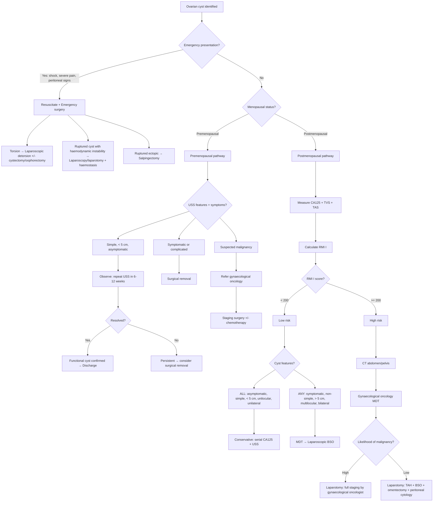
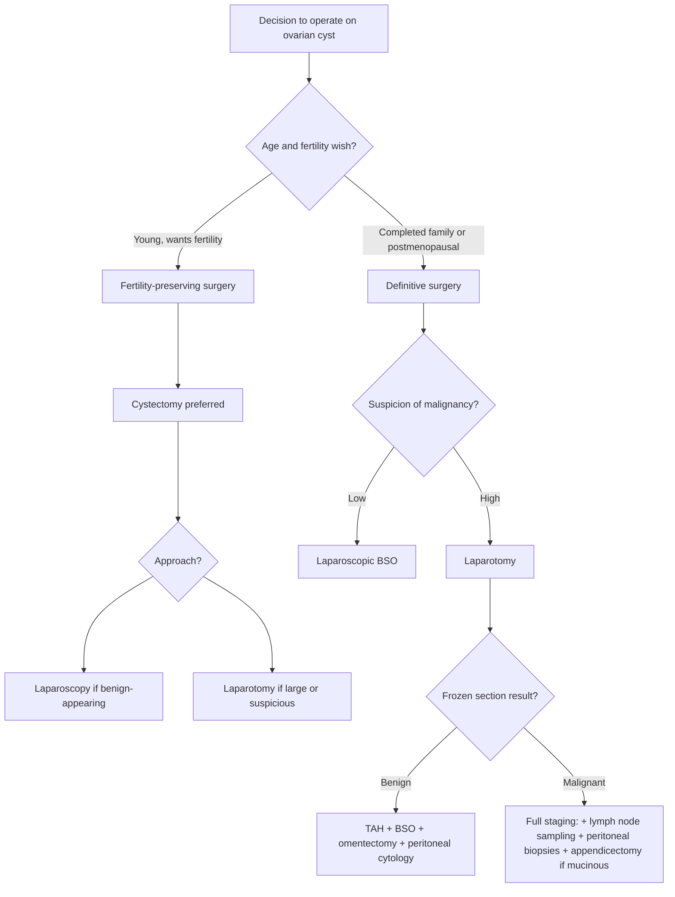

## Management of Ovarian Cyst

### 1. Management Principles — Thinking from First Principles

The management of an ovarian cyst is driven by **four key factors**, which you should always consider systematically:

1. **Age / menopausal status** — premenopausal women have a much lower pretest probability of malignancy and require fertility preservation; postmenopausal women have a higher malignancy risk and often do not need fertility preservation.
2. **Symptoms** — asymptomatic cysts can often be observed; symptomatic cysts (pain, pressure, complications) need intervention.
3. **Ultrasound morphology** — simple vs complex features determine the likelihood of malignancy.
4. ***The wish of the patient*** [1] — always factor in patient preference regarding fertility, surgery, and conservative management.

> ***Management will depend on the age, symptom, condition and wish of the patient*** [1].

The overarching philosophy is: **observe what is likely benign and functional; operate on what is persistent, symptomatic, or suspicious for malignancy.**

---

### 2. Master Management Algorithm

---

### 3. Management by Clinical Scenario

#### 3.1 Emergency Management

***Some indications require emergency management — ovarian cyst complications, pregnancy complications*** [9].

| Emergency | Management | Rationale |
|---|---|---|
| **Ovarian torsion** | **Emergency laparoscopy → detorsion** (untwist the pedicle). If ovary viable → **conserve** (cystectomy + detorsion). If ovary necrotic/gangrenous → **salpingo-oophorectomy** | Time-sensitive — ovarian viability depends on duration of torsion. Within 6–8 hours, detorsion can salvage the ovary. Beyond that, risk of necrosis increases. Always attempt detorsion first, even if the ovary looks dusky (it often recovers) |
| **Ruptured cyst with haemodynamic instability** | **Resuscitation** (IV fluids, crossmatch blood) → **emergency laparoscopy/laparotomy** → haemostasis (cautery, suturing, oophorectomy if bleeding uncontrollable) | Haemoperitoneum from ruptured corpus luteal cyst can be massive. Haemodynamically stable patients with small amounts of free fluid can be managed conservatively (analgesia, monitoring) |
| **Ruptured ectopic pregnancy** | **Emergency laparotomy/laparoscopy → salpingectomy** (or salpingotomy if contralateral tube absent/damaged) | Life-threatening haemoperitoneum. Must be excluded before any ovarian cyst can be managed conservatively |
| **Ruptured tubo-ovarian abscess** | **IV antibiotics** (broad-spectrum: cephalosporin + metronidazole + doxycycline) + **emergency drainage** (percutaneous or surgical) | Peritonitis and sepsis risk. Antibiotics alone may be insufficient if frank rupture has occurred |

<Callout title="Torsion — Detorse First, Think Later" type="idea">
The historical teaching was to remove a torsed ovary without untwisting it (fear of releasing thrombotic emboli). This is **outdated**. Current practice is to **detorse regardless of the ovary's appearance** — studies have shown that embolisation risk is negligible and ovarian salvage rates are significantly improved with detorsion. Even a dusky, oedematous ovary often recovers full function after untwisting.
</Callout>

#### ***3.2 Premenopausal Adnexal Mass / Cyst*** [1]

The guiding principle in premenopausal women is **fertility preservation** — be as conservative as possible unless malignancy is suspected.

##### a) ***Asymptomatic Cyst — Observation*** [1]

- ***Asymptomatic: can observe and repeat ultrasound (3–6 months)*** [1]
- **Indication:** Simple, unilocular, < 5 cm, anechoic cyst → overwhelmingly likely to be a **functional cyst** (follicular or corpus luteal)
- **Protocol:** Repeat USS in 6–12 weeks (at least one menstrual cycle later)
  - If **resolved** → confirms functional cyst → discharge
  - If **persistent** → unlikely to be functional → consider removal
- **Rationale:** Functional cysts resolve spontaneously as hormonal support wanes. Operating on them is unnecessary and exposes the patient to surgical risk. However, neoplastic cysts do NOT resolve, so persistence mandates further action.

##### b) ***Symptomatic Cyst — Surgical Removal*** [1]

- ***Symptomatic: possible complications, needs removal*** [1]
- **Indications for surgery:**
  - Pain not controlled with analgesia
  - Complications (torsion, rupture, haemorrhage)
  - Large size (> 5–7 cm) causing mass effect
  - Rapidly enlarging cyst

##### c) ***Persistent Cyst — Surgical Removal*** [1]

- ***Persistent cyst: consider removal to confirm diagnosis*** [1]
- A cyst that persists beyond 2–3 menstrual cycles is unlikely to be functional and needs histological diagnosis
- ***Cystectomy vs salpingo-oophorectomy:*** [1]
  - **Cystectomy** (remove cyst, preserve ovary) — preferred in young women to preserve fertility. Suitable for benign-appearing cysts (dermoid, endometrioma, cystadenoma)
  - **Salpingo-oophorectomy** (remove entire ovary + tube) — indicated if the cyst has destroyed the ovary, if the patient has completed childbearing, or if malignancy cannot be excluded
- ***Laparoscopy vs laparotomy:*** [1]
  - **Laparoscopy** — preferred approach for most benign cysts. Advantages: less pain, shorter recovery, smaller scars, better cosmesis
  - **Laparotomy** — indicated if the cyst is very large (difficult to extract laparoscopically), if malignancy is suspected (need intact specimen without spillage for staging), or if adhesions from prior surgery make laparoscopy unsafe

| Feature | Cystectomy | Salpingo-oophorectomy |
|---|---|---|
| Preserves ovary | Yes | No |
| Fertility preservation | Yes | Depends (if contralateral ovary intact) |
| Risk of recurrence | Higher (residual tissue) | Lower |
| Best for | Young women, benign-appearing cysts | Completed family, suspicious cysts, destroyed ovary |

##### d) ***Suspected Malignancy*** [1]

- ***Suspected cancer: refer oncology, exclude secondary from colon, stomach, breast etc, staging surgery ± chemotherapy*** [1]
- **Key point:** Do NOT perform a simple cystectomy/oophorectomy if malignancy is suspected — this can compromise staging and prognosis
- Refer to **gynaecological oncology** for proper staging surgery

#### 3.3 Specific Management by Cyst Type (Premenopausal)

| Cyst Type | Management | Rationale |
|---|---|---|
| **Follicular cyst** | Observe → resolves in 4–8 weeks. COC pills do NOT hasten resolution (common misconception), but can prevent new functional cysts | Self-limiting; granulosa cell lining involutes as FSH/LH support wanes |
| **Corpus luteal cyst** | Observe if stable. If ruptured with haemodynamic instability → surgical haemostasis | Often haemorrhagic; most reabsorb spontaneously |
| **Theca lutein cyst** | Treat underlying cause (evacuate mole, reduce gonadotropin dose). Cysts resolve once hCG stimulus removed | Driven by hCG — removing the stimulus → cyst regression |
| **Endometrioma** | Medical: hormonal suppression (COC pills, progestogens, GnRH agonists) → reduces size and symptoms but does not cure. Surgical: laparoscopic excision (cystectomy) for cysts > 3–4 cm, especially if infertility or refractory symptoms | Does NOT resolve spontaneously. Excision preferred over drainage (drainage has ~80% recurrence). Post-op hormonal therapy reduces recurrence |
| **Mature teratoma (dermoid)** | Surgical excision (cystectomy, laparoscopic). Careful intraoperative handling to avoid spillage (sebaceous content causes chemical peritonitis) | Does NOT resolve spontaneously. Risk of torsion (most common tumour to torse) — prophylactic removal often recommended even if asymptomatic, especially if > 5 cm |
| **Serous/mucinous cystadenoma** | Surgical excision (cystectomy or oophorectomy). Must send for histology to exclude borderline/malignant component | Neoplastic — will not resolve. Need histological diagnosis |

<Callout title="Do Oral Contraceptive Pills Treat Ovarian Cysts?" type="error">
A common misconception. **COC pills do NOT accelerate the resolution of existing functional cysts.** Randomised controlled trials have shown no difference in resolution rates. However, COC pills do **prevent the formation of new functional cysts** by suppressing ovulation (no follicle development → no follicular cyst; no ovulation → no corpus luteum). So they have a role in **prevention**, not **treatment**.
</Callout>

#### ***3.4 Postmenopausal Ovarian Cyst*** [1]

The management of postmenopausal ovarian cysts follows the ***RCOG algorithm*** [9] based on the ***RMI*** score:

##### ***Step 1: Measure CA125 + TVS + TAS*** [1]
##### ***Step 2: Calculate RMI I = U × M × CA125*** [1]

##### ***Step 3A: RMI I < 200 (Low Risk of Malignancy)*** [1]

***5 criteria to determine whether conservative management is possible*** [9]:

- ***Cysts fulfilling ALL of the following → consider conservative management:*** [1]
  1. ***Asymptomatic***
  2. ***Simple cyst***
  3. ***< 5 cm***
  4. ***Unilocular***
  5. ***Unilateral***

  → ***Repeat assessment with CA125, TVS + TAS*** at intervals (typically 4–6 monthly for at least 1 year) [1]

- ***Cysts with ANY of the following → MDT review → consider laparoscopic BSO (usually bilateral):*** [1]
  1. ***Symptomatic***
  2. ***Non-simple features***
  3. ***> 5 cm***
  4. ***Multilocular***
  5. ***Bilateral***

> ***For postmenopausal women, can be more radical with operation*** [9] — because fertility is no longer a concern and the risk of malignancy is higher, bilateral salpingo-oophorectomy is the standard surgical approach rather than cystectomy.

##### ***Step 3B: RMI I ≥ 200 (Increased Risk of Malignancy)*** [1]

1. ***CT scan (abdomen and pelvis)*** [1]
2. ***Referral for gynaecological oncology MDT review*** [1]
3. MDT determines likelihood of malignancy:

| ***Likelihood*** | ***Surgical Approach*** | ***By Whom*** |
|---|---|---|
| ***High likelihood of ovarian malignancy*** | ***Laparotomy: full staging procedure*** (TAH + BSO + pelvic/para-aortic lymph node sampling + omentectomy + peritoneal biopsies + peritoneal cytology + appendicectomy if mucinous) | ***By a trained gynaecological oncologist*** [1] |
| ***Low likelihood of ovarian malignancy*** | ***Laparotomy: pelvic clearance (TAH + BSO + omentectomy + peritoneal cytology)*** | ***By a suitably trained gynaecologist*** [1] |

<Callout title="Why Full Staging at Laparotomy?">
Staging at initial surgery is critical because:
1. **Prognosis** depends on stage — stage I ovarian cancer has > 90% 5-year survival vs < 30% for stage IV.
2. **Adjuvant chemotherapy decisions** depend on accurate staging — unstaged/incompletely staged patients may receive unnecessary chemotherapy or, worse, miss necessary treatment.
3. **Re-staging surgery** (if initial surgery was inadequate) adds morbidity and delays treatment.
This is why suspected malignancy should be referred to a gynaecological oncologist — they perform the full staging in one operation.
</Callout>

#### ***3.5 Ovarian Cancer — Treatment Overview*** [9]

***Management is complicated, depends on many factors*** [9]:

| Scenario | Approach |
|---|---|
| ***Operable disease*** | ***Operate first — time-sensitive operation, therapeutic and diagnostic*** [9]. Primary debulking surgery (PDS) → aim for complete cytoreduction (no residual disease) → adjuvant chemotherapy (carboplatin + paclitaxel, 6 cycles) |
| ***Late stage, inoperable*** | ***Consider neoadjuvant chemotherapy (NACT)*** [9] → 3 cycles carboplatin/paclitaxel → interval debulking surgery (IDS) → 3 further cycles chemotherapy |
| **Borderline ovarian tumours** | Surgery alone (cystectomy or staging surgery depending on age/fertility wish). Generally do NOT need chemotherapy |
| **Germ cell tumours** | Surgery (fertility-sparing unilateral salpingo-oophorectomy if stage IA) + adjuvant chemotherapy (BEP: bleomycin, etoposide, cisplatin). Highly chemo-sensitive, excellent prognosis |

---

### 4. Non-Surgical / Adjunctive Management Options

#### 4.1 Medical Management

| Therapy | Indication | Mechanism |
|---|---|---|
| **Analgesia (NSAIDs, paracetamol)** | Symptomatic relief in functional cysts, mild cyst-related pain | Pain from capsular stretch or peritoneal irritation; NSAIDs also reduce prostaglandin-mediated inflammation |
| **Combined oral contraceptive (COC) pills** | **Prevention** of new functional cysts (NOT treatment of existing ones) | Suppress HPO axis → no follicle recruitment → no follicular/corpus luteal cysts form |
| **Progestogens (e.g. dienogest, medroxyprogesterone)** | Endometrioma — symptom control, post-operative recurrence prevention | Oppose oestrogen's proliferative effect on ectopic endometrial tissue → decidualisation and atrophy |
| **GnRH agonists (e.g. leuprolide)** | Endometrioma — shrinkage before surgery, recurrence prevention | Downregulate GnRH receptors → medical menopause → oestrogen deprivation → endometrial tissue atrophies. Max 6 months due to bone loss risk |
| **GnRH antagonists (e.g. elagolix)** | Endometrioma — newer option | Direct GnRH receptor blockade, dose-dependent suppression without initial flare |
| **Antibiotics** | Tubo-ovarian abscess | Treat the infection; broad-spectrum coverage (e.g. IV ceftriaxone + metronidazole + doxycycline) |

#### 4.2 Interventional Radiology

| Procedure | Indication | Mechanism |
|---|---|---|
| ***Uterine fibroid embolisation (UAE)*** [16] | Uterine fibroids (NOT ovarian cysts — but mentioned here for completeness as the technique is relevant to pelvic mass management) | ***Embolic agents used to block specific blood vessels*** [16] — particulate embolisation of uterine arteries → ischaemic necrosis of fibroid |
| **USS-guided drainage** | Very selected cases: high surgical risk patients with clearly simple, symptomatic cysts | Aspiration of cyst fluid under USS guidance. **Generally NOT recommended** for ovarian cysts due to high recurrence rate (~50%) and inability to obtain tissue for histology |
| ***HIFU (High-Intensity Focused Ultrasound)*** [9][16] | ***Indication-specific selection criteria*** [9]. Primarily used for uterine fibroids. Emerging evidence for some benign ovarian conditions but NOT standard of care for ovarian cysts | ***Non-incisional, transcutaneous technique. Uses acoustic lens to concentrate multiple intersecting US beams at the lesion → thermal coagulative necrosis + acoustic cavitation*** [16] |

<Callout title="HIFU and Ovarian Cysts" type="idea">
***HIFU has indication-specific selection criteria*** [9] and is primarily validated for uterine fibroids. Its role in ovarian cyst management remains limited and experimental. For exams, know it exists but do NOT list it as a standard treatment for ovarian cysts.
</Callout>

---

### 5. Surgical Decision-Making — Choosing the Right Operation

| Operation | What It Involves | When to Choose |
|---|---|---|
| **Ovarian cystectomy** | Remove cyst, preserve normal ovarian tissue | Young women, benign-appearing cyst, fertility desired |
| **Unilateral salpingo-oophorectomy (USO)** | Remove one ovary + tube | Cyst has destroyed ovary; germ cell tumour stage IA in young woman (fertility-sparing) |
| ***Bilateral salpingo-oophorectomy (BSO)*** | Remove both ovaries + tubes | ***Postmenopausal women*** [1]; or when contralateral ovary also abnormal |
| ***Total abdominal hysterectomy + BSO (TAH + BSO)*** | Remove uterus + cervix + both ovaries + tubes | ***Postmenopausal with suspected malignancy*** [1]; also concurrent uterine pathology |
| **Full staging laparotomy** | TAH + BSO + omentectomy + pelvic/para-aortic LN sampling + peritoneal biopsies + peritoneal washings ± appendicectomy | ***Confirmed or strongly suspected ovarian malignancy, by a trained gynaecological oncologist*** [1] |

**Laparoscopy vs Laparotomy:**

| Feature | Laparoscopy | Laparotomy |
|---|---|---|
| **Preferred when** | Likely benign, cyst < 10 cm, no adhesions | Suspected malignancy, very large cyst, dense adhesions |
| **Advantages** | Less pain, shorter recovery, smaller scars, less adhesion formation | Better visualisation and access, intact specimen (no spillage risk) |
| **Risks** | Cyst rupture/spillage during extraction (use endobag), port-site metastasis (rare, in malignancy) | Longer recovery, more pain, larger scar, more adhesions |
| **Conversion** | Always consent for conversion to laparotomy | N/A |

<Callout title="Intraoperative Spillage — Why It Matters" type="error">
If an ovarian cyst that turns out to be malignant is ruptured intraoperatively, it upstages the disease from **FIGO stage IA to stage IC1** (surgical spill) or **IC2** (capsule ruptured before surgery). This worsens prognosis and may mandate adjuvant chemotherapy that otherwise would not have been needed. This is why:
1. **Suspected malignant cysts should be removed via laparotomy** (intact specimen)
2. Use an **endobag** if removing any cyst laparoscopically (catches spillage)
3. Send **peritoneal washings** for cytology at the start of surgery
</Callout>

---

### 6. Follow-Up and Surveillance

| Scenario | Follow-Up Protocol |
|---|---|
| **Functional cyst managed conservatively** | Repeat USS in 6–12 weeks. If resolved → discharge. If persistent → operate |
| ***Postmenopausal simple cyst managed conservatively*** | ***Repeat CA125, TVS + TAS*** [1] at 4–6 monthly intervals for at least 1 year. Discharge if stable/resolving |
| **Post-cystectomy for benign disease** | Clinical review at 6 weeks post-op. Annual USS for 1–2 years to check for recurrence (especially endometriomas — ~30% recurrence rate) |
| **Post-surgery for borderline tumour** | Long-term USS surveillance (5–10 years) — late recurrence is possible |
| **Post-surgery for ovarian cancer** | CA125 monitoring + clinical review every 3 months for 2 years, then 6-monthly. CT if CA125 rises or symptoms recur |

---

### 7. Special Situations

#### 7.1 Ovarian Cyst in Pregnancy

- **Functional cysts** (especially corpus luteal cysts) are common in the first trimester and usually resolve by 14–16 weeks as the placenta takes over progesterone production.
- **Surgery in pregnancy** is generally avoided in the first trimester (risk of miscarriage) unless emergency (torsion, rupture). Best timing if surgery needed: **second trimester** (14–20 weeks) — organogenesis complete, uterus not yet too large for laparoscopy.
- **Corpus luteal cyst removal before 12 weeks** can precipitate miscarriage (removes progesterone source) — supplemental progesterone must be given if surgery is unavoidable.

#### 7.2 Ovarian Cyst in Children/Adolescents

- Most are **functional or germ cell tumours**.
- **Fertility preservation** is paramount — always attempt cystectomy rather than oophorectomy.
- Check **AFP, β-hCG, LDH** to exclude malignant germ cell tumours (treatable with chemotherapy, excellent prognosis even if malignant).

---

<Callout title="High Yield Summary">

1. ***Management depends on age, symptom, condition, and wish of the patient*** [1].

2. **Emergency management:** Torsion → emergency laparoscopic detorsion (attempt ovarian salvage). Ruptured cyst with haemodynamic instability → laparoscopy/laparotomy for haemostasis.

3. ***Premenopausal:*** ***Asymptomatic → observe with repeat USS in 3–6 months. Symptomatic → remove. Persistent → cystectomy vs salpingo-oophorectomy (laparoscopy vs laparotomy). Suspected cancer → refer oncology*** [1].

4. **COC pills do NOT treat existing functional cysts** — they prevent new ones by suppressing ovulation.

5. ***Postmenopausal: Calculate RMI I.*** ***RMI < 200 with ALL 5 low-risk features (asymptomatic, simple, < 5 cm, unilocular, unilateral) → conservative with serial CA125 + USS.*** ***Any non-simple feature → BSO.*** ***RMI ≥ 200 → CT + gynaecological oncology MDT → laparotomy (full staging if high suspicion; pelvic clearance if low suspicion)*** [1].

6. ***Ovarian cancer: If operable → operate first (time-sensitive, therapeutic and diagnostic). If inoperable → neoadjuvant chemotherapy*** [9].

7. **Surgical principle:** Cystectomy for young women wanting fertility (benign-appearing); BSO/TAH+BSO for postmenopausal; full staging laparotomy for confirmed/suspected malignancy ***by a trained gynaecological oncologist*** [1].

8. **Avoid intraoperative spillage** — upstages malignancy from IA to IC1. Use endobag during laparoscopy.

9. ***Full staging includes: TAH + BSO + omentectomy + peritoneal cytology*** (minimum for low-suspicion); add lymph node sampling + peritoneal biopsies for high-suspicion [1].

</Callout>

---

<ActiveRecallQuiz
  title="Active Recall - Management of Ovarian Cyst"
  items={[
    {
      question: "A 28-year-old woman has an asymptomatic 3 cm simple ovarian cyst found incidentally on USS. What is the appropriate management and why?",
      markscheme: "Observe with repeat USS in 6-12 weeks (at least one menstrual cycle). Rationale: simple, small (< 5 cm), asymptomatic cyst in a premenopausal woman is overwhelmingly likely to be a functional cyst that will resolve spontaneously as hormonal support wanes. Surgery would expose her to unnecessary risk. If it persists beyond 2-3 cycles, it is unlikely functional and should be removed for histological diagnosis.",
    },
    {
      question: "Do combined oral contraceptive pills accelerate the resolution of existing ovarian cysts? Explain.",
      markscheme: "No. RCTs show COC pills do NOT hasten resolution of existing functional cysts compared to expectant management. However, they DO prevent formation of NEW functional cysts by suppressing the HPO axis (no follicle development, no ovulation). They have a role in prevention, not treatment of existing cysts.",
    },
    {
      question: "Describe the management algorithm for a postmenopausal woman with an ovarian cyst and RMI I score of 350.",
      markscheme: "RMI >= 200 = increased risk of malignancy. Steps: (1) CT scan abdomen and pelvis for staging. (2) Referral to gynaecological oncology MDT review. (3) MDT determines likelihood: if high likelihood → laparotomy with full staging procedure by trained gynaecological oncologist; if low likelihood → laparotomy with pelvic clearance (TAH + BSO + omentectomy + peritoneal cytology) by suitably trained gynaecologist.",
    },
    {
      question: "A 22-year-old woman presents with sudden severe right lower abdominal pain, nausea, and a known 6 cm right ovarian dermoid cyst. USS shows absent Doppler flow in the right ovary. What is the diagnosis and management?",
      markscheme: "Diagnosis: Right ovarian torsion (dermoid cysts are the most common tumour to torse due to their weight and pendulous nature; absent Doppler flow confirms ischaemia). Management: Emergency laparoscopy for detorsion. Attempt ovarian salvage - detorse regardless of ovary appearance (even if dusky, it often recovers). If viable after detorsion, perform cystectomy to preserve ovary and prevent recurrence. If necrotic/gangrenous, proceed to salpingo-oophorectomy.",
    },
    {
      question: "Why is intraoperative spillage of an ovarian cyst contents clinically significant if the cyst turns out to be malignant?",
      markscheme: "Intraoperative spillage upstages ovarian cancer from FIGO stage IA (confined to one ovary, capsule intact) to stage IC1 (surgical spill). This worsens prognosis and may mandate adjuvant chemotherapy that otherwise would not have been needed for stage IA disease. Prevention: use endobag during laparoscopic removal; perform laparotomy (not laparoscopy) if malignancy is suspected to allow intact specimen removal.",
    },
    {
      question: "List the 5 criteria that must ALL be met for conservative management of a postmenopausal ovarian cyst with RMI < 200.",
      markscheme: "(1) Asymptomatic, (2) Simple cyst, (3) Less than 5 cm, (4) Unilocular, (5) Unilateral. If ANY of these are not met (symptomatic, non-simple, > 5 cm, multilocular, or bilateral), the patient should undergo MDT review and likely laparoscopic bilateral salpingo-oophorectomy.",
    },
  ]}
/>

---

## References

[1] Lecture slides: GC 118. Pelvic mass ovarian cancer and cysts; uterine fibroid; pelvic imaging.pdf (p66, p68, p71)
[9] Lecture slides: Block C - Pelvic mass_ ovarian cancer and cysts; uterine fibroid; pelvic imaging.pdf (p18, p53, p55, p56, p57)
[16] Senior notes: Ryan Ho Diagnostic Radiology.pdf (p85, p89 — uterine fibroid embolisation, HIFU)
