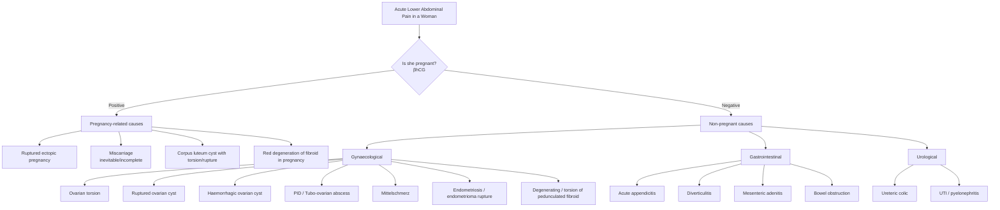

## Differential Diagnosis of Ovarian Torsion

### Approach to Differential Diagnosis

The cardinal teaching point from the lecture slides is this: ***the most important part is the ability to formulate the list of differential diagnoses and to prioritize them according to the clinical condition and NOT just to give the right diagnosis*** [1]. In practice, a woman presenting with acute lower abdominal pain requires you to think systematically across organ systems — gynaecological, gastrointestinal, and urological — and then triage by urgency.

The core clinical scenario is: **a reproductive-age woman with sudden-onset severe unilateral lower abdominal/pelvic pain ± nausea/vomiting ± adnexal mass**. Your job is to figure out whether this is ovarian torsion versus the other diagnoses that can mimic it.

<Callout title="First Principles – Why Is the DDx Broad?">
The pelvis is a crowded space. The ovary sits immediately adjacent to the fallopian tube, uterus, ureter, appendix (on the right), sigmoid colon (on the left), and bladder. All of these structures share overlapping visceral innervation (T10–L1 sympathetic afferents). This is why pain from the ovary, ureter, appendix, and tube all present similarly — your nervous system genuinely cannot tell the difference at first. The DDx is therefore based on associated features (vaginal bleeding? discharge? urinary symptoms? pregnancy status?) that help you localise the source.
</Callout>

---

### DDx Framework: Mermaid Diagram

---

### Detailed Differential Diagnoses

#### A. Gynaecological Causes (Priority DDx)

These are the most important differentials to consider and ***exclude*** [7][8]. The lecture explicitly states: ***Exclude ovarian cyst complications, pregnancy complications*** as urgent priorities [7].

---

##### 1. Ruptured Ectopic Pregnancy

***Ectopic pregnancy*** [4][9] — this is the **most dangerous** DDx and must be excluded first in any woman of reproductive age with acute lower abdominal pain.

| Feature | Ectopic Pregnancy | Ovarian Torsion |
|---|---|---|
| **βhCG** | ***Positive*** | Negative (unless incidentally pregnant) |
| **Vaginal bleeding** | ***Present*** (typically dark, scanty PV bleeding) | Usually absent |
| **Pain character** | Sudden severe lower abdominal pain, may generalise if ruptured | Sudden severe unilateral pain |
| **Preceding symptoms** | ***S/S of pregnancy (morning sickness, amenorrhoea, breast swelling, +ve test)*** [9]; preceded by a few days of mild abdominal pain | None typically |
| **Cervical excitation** | ***Positive*** | Usually ***negative*** [1] |
| **Shoulder tip pain** | ***Present if blood collects beneath the diaphragm*** [9] (phrenic nerve irritation, C3–C5 dermatome) | Absent |
| **Shock** | ***Signs of hypovolaemia (tachycardia, pale, sweating, postural hypotension)*** [9] if ruptured | Rare unless haemorrhagic infarction with rupture |
| **Risk factors** | History of PID, fertility problems, IUD, previous ectopic | Ovarian cyst, dermoid |

> **Why is βhCG the single most important first-line test?** Because a negative βhCG immediately eliminates all pregnancy-related causes from your differential. This is why ***girls: ask LMP, order PT (pregnancy test)*** [10] is drilled into surgical teaching.

---

##### 2. Ruptured Ovarian Cyst

***Ovarian cyst complications*** — ***rupture*** [3][11] is the other major acute complication of an ovarian cyst alongside torsion.

| Feature | Ruptured Cyst | Ovarian Torsion |
|---|---|---|
| **Onset** | ***Sudden onset***, often begins with ***strenuous physical activity*** [11] | Sudden onset, often with agitating movement |
| **Pain character** | Sudden sharp pain that may then improve (once the cyst ruptures, the capsular tension is released) | Pain is persistent and worsening (ongoing ischaemia) |
| **Free fluid** | Usually present on USS (leaked cyst contents / blood in POD) | Minimal or absent early; may be present later |
| **Adnexal mass** | May collapse/disappear after rupture | Persistent, enlarged, oedematous ovary |
| **Peritonism** | ***Especially painful if dermoid cyst rupture*** [11] (sebaceous contents cause chemical peritonitis) | Present if necrosis develops |
| **Vaginal bleeding** | ***May be associated with light vaginal bleeding*** [11] | Absent |
| **Doppler** | Normal flow in remaining ovary | Absent or reduced flow (though can be falsely normal) |

> **Key distinction:** In rupture, the pain often **peaks then partially improves** (pressure is released). In torsion, the pain **progressively worsens** (ongoing ischaemia escalates).

---

##### 3. Haemorrhagic Ovarian Cyst (Haemorrhage into Cyst)

***Ovarian cyst acute complications have 3 classical forms, all will present with abdominal pain → torsion, haemorrhage, rupture*** [3].

- Haemorrhage *into* an ovarian cyst (without rupture) causes sudden expansion of the cyst → capsular distension → acute pain.
- The cyst remains intact (no free fluid), but the ovary is enlarged and tender.
- USS shows internal echoes within the cyst (blood clot = "reticular" or "cobweb" pattern on ultrasound).
- Important distinction from torsion: **Doppler flow is preserved** (the vessels are not twisted, just the cyst is bleeding internally).

---

##### 4. Pelvic Inflammatory Disease (PID) / Tubo-Ovarian Abscess

***PID*** [4] — salpingitis and associated infection of the supporting tissues around the adnexa.

| Feature | PID | Ovarian Torsion |
|---|---|---|
| **Onset** | ***Gradual onset*** of constant lower abdominal pain [4] | **Sudden onset** |
| **Fever** | ***High fever (38–39.5°C)*** [4] | Low-grade or absent early |
| **Vaginal discharge** | ***Preceded by purulent yellow-white vaginal discharge*** [4] | Absent |
| **Cervical excitation** | ***Chandelier sign positive*** [4] (cervical motion tenderness so painful the patient "reaches for the chandelier") | Usually negative |
| **Bilaterality** | ***Often bilateral*** but may be asymmetric [4] | **Unilateral** |
| **Dyspareunia** | ***Often a/w dyspareunia*** [4] | Not a feature |
| **History** | ***Sexually active, Hx of previous gyne procedures, IUD, or STDs*** [4] | Ovarian cyst history |
| **N/V** | ***No N/V or changes in bowel habits*** [4] | N/V common (autonomic response) |
| **Pain location** | ***Usually lower and nearer to midline*** compared to appendicitis [4] | Lateral, in iliac fossa |

> **Why no N/V in PID but present in torsion?** PID is an inflammatory/infectious process with gradual onset — the autonomic nervous system is not acutely overwhelmed. Torsion produces sudden, intense visceral ischaemic pain that triggers the vagal reflex → nausea/vomiting (same reason you vomit with testicular torsion or renal colic).

---

##### 5. Mittelschmerz ("Middle Pain")

***Mittelschmerz: mid-cycle lower abdominal/pelvic pain due to rupture of follicular cyst and bleeding → irritate peritoneum*** [11].

- "Mittel" = middle (German), "schmerz" = pain. Literally "middle pain" — occurring mid-cycle at ovulation (~day 14).
- Caused by physiological rupture of the Graafian follicle during ovulation → small amount of follicular fluid ± blood irritates the peritoneum → brief, self-limiting pain.
- Key distinction: **Timing correlates with mid-cycle**, pain is typically **mild and self-limiting** (resolves within hours to 1–2 days), and there is **no adnexal mass**.
- Can mimic torsion or appendicitis if on the right side.

---

##### 6. Endometriosis / Ruptured Endometrioma

- ***Dysmenorrhoea (endometriosis)*** [5] — chronic cyclic pelvic pain.
- ***Chronic ovarian cyst pain also possible → endometriotic cyst*** [3].
- Endometriomas ("chocolate cysts") can rupture, causing sudden chemical peritonitis (dark, old blood spills into the peritoneum).
- Key distinction from torsion: **history of chronic dysmenorrhoea, dyspareunia, cyclical pain**. Endometriomas are usually associated with adhesions → ***less mobile if adhesions, endometriosis*** [5], which actually *reduces* risk of torsion (but doesn't eliminate it).

---

##### 7. Degenerating / Torsion of Pedunculated Uterine Fibroid

***Degeneration of fibroid → outgrowing blood supply and becoming necrotic*** [3]. This is analogous to torsion of the ovary — a pedunculated fibroid twists on its stalk, cutting off its blood supply.

| Feature | Fibroid Degeneration / Torsion | Ovarian Torsion |
|---|---|---|
| **Mass** | Arises from the uterus; moves WITH the uterus on bimanual examination | ***Usually separated from uterus*** [5] |
| **Known history** | Often known fibroids; menorrhagia | Known ovarian cyst |
| **Pain** | Acute if torsion of pedunculated fibroid; subacute if red degeneration | Acute, sudden |
| **Pregnancy** | ***Red / haemorrhagic degeneration during pregnancy*** [3] | Torsion can also occur in pregnancy |

> **How to distinguish?** On bimanual examination, a fibroid is **continuous with the uterus** (you cannot separate it), while an ovarian cyst is **separate** from the uterus (you can feel a cleavage plane between them). USS confirms the organ of origin.

---

#### B. Gastrointestinal Causes

##### 8. Acute Appendicitis

This is the **most important non-gynaecological DDx**, especially for right-sided ovarian torsion [10][11].

| Feature | Appendicitis | Ovarian Torsion |
|---|---|---|
| **Pain migration** | ***Classical: periumbilical → RLQ over 12–24h*** [10] | No migration; sudden onset in iliac fossa |
| **Anorexia** | Prominent (almost always present) | Variable |
| **Fever** | Low-grade initially | Low-grade or absent early |
| **McBurney's point** | ***Maximum tenderness at McBurney's point*** [10] | Tenderness more medial/inferior (pelvic) |
| **Rovsing's sign** | Positive | Negative |
| **Psoas/Obturator signs** | May be positive (retrocaecal or pelvic appendix) [10] | Negative |
| **Vaginal exam** | Usually normal | Tender adnexal mass |
| **βhCG** | Negative | Negative |

***Differential diagnoses in adult females: consider pelvic causes. Should ALWAYS take a full gynaecological Hx, esp menstrual cycle, vaginal D/C and possible pregnancy*** [11]. This is a critical clinical teaching point — any young woman with RLQ pain needs gynae causes excluded.

---

##### 9. Sigmoid Diverticulitis (Left-sided)

- More relevant for **left-sided** ovarian torsion DDx (both cause LLQ pain).
- ***Diverticular disease is almost exclusively in sigmoid colon (95%) in Caucasians but more commonly to be in Rt colon in Asians*** [4] — important Hong Kong-specific point.
- Key distinction: **older age group** (usually > 50), **history of constipation/altered bowel habit**, **CT shows diverticular inflammation with pericolic fat stranding**, no adnexal mass.

---

##### 10. Mesenteric Adenitis

- Inflammation of mesenteric lymph nodes, often following a **viral illness prodrome** [10].
- More common in children/adolescents.
- Can mimic both appendicitis and ovarian torsion.
- USG shows mesenteric lymphadenopathy without appendiceal or ovarian abnormality.

---

##### 11. Bowel Obstruction / Meckel's Diverticulitis

- ***Meckel's diverticulitis: CT abdomen*** [10] — right-sided pain, can mimic appendicitis or right ovarian torsion.
- Bowel obstruction: colicky, intermittent pain with distension, vomiting, constipation — different character from the constant worsening pain of torsion.

---

#### C. Urological Causes

##### 12. Ureteric Colic (Renal/Ureteric Stone)

***Ureteric colic: colicky pain typically waxes and wanes, each episode lasting 20–60 min*** [11].

| Feature | Ureteric Colic | Ovarian Torsion |
|---|---|---|
| **Pain character** | ***Severe, gripping true colic*** with ***pain-free remissions*** [9] | Constant, worsening |
| **Radiation** | ***From renal angle, parallel to inguinal ligament into groin*** [9] | Ipsilateral iliac fossa, may radiate to groin |
| **Behaviour** | ***Patient rolling around bed or walking around*** [9] (restless) | Patient lies still (peritonism) |
| **Haematuria** | ***Gross or microscopic haematuria*** [9] | Absent |
| **Autonomic symptoms** | ***Sweating, N/V*** [9] | N/V present |
| **Adnexal mass** | Absent | Present |

> **Key distinction:** Colicky pain with **pain-free intervals** is classic for ureteric colic. Torsion pain is **constant and worsening**. Also, the **restlessness** of renal colic (patient cannot stay still) contrasts with the **stillness** of peritonitis (any movement worsens parietal peritoneal pain).

---

##### 13. UTI / Acute Pyelonephritis

***Right pyelonephritis: preceded by irritative urinary symptoms (frequency, urgency); associated with loin tenderness, high fever ( > 39°C), rigors, pyuria*** [11].

- Key distinction: **dysuria, frequency, urgency, loin tenderness, pyuria on urinalysis**. These urinary symptoms are absent in ovarian torsion.
- Fever is typically **higher** (> 39°C with rigors) compared to the low-grade fever of torsion.

---

#### D. Pregnancy-Related Causes (if βhCG Positive)

If βhCG is positive, the differential shifts entirely:

| Diagnosis | Key Features |
|---|---|
| **Ruptured ectopic pregnancy** | ***Most urgent — may require straight laparotomy*** [7]. Acute pain, vaginal bleeding, shock, positive βhCG. |
| ***Miscarriage (inevitable/incomplete)*** [3] | ***Associated symptoms → leaking sensation (liquor), per-vaginal bleeding*** [3]. Positive βhCG. Cervical os open on speculum. |
| **Corpus luteum cyst complications in pregnancy** | Torsion or rupture of corpus luteum cyst. First trimester. Positive βhCG but intrauterine pregnancy confirmed on USS. |
| ***Red degeneration of fibroid in pregnancy*** [3] | Subacute pain, known fibroids, second/third trimester. Positive βhCG with confirmed IUP. |

---

### Prioritisation of DDx by Clinical Urgency

***Attend patients who need URGENT management: Shock, severe pain (peritoneal signs). May require straight laparotomy*** [7].

| Priority | Diagnosis | Reason |
|---|---|---|
| **1 (Immediate)** | Ruptured ectopic pregnancy | Haemodynamic instability; life-threatening haemorrhage |
| **2 (Urgent)** | Ovarian torsion | Gonadal ischaemia; irreversible damage if delayed |
| **3 (Urgent)** | Acute appendicitis (complicated) | Risk of perforation → peritonitis |
| **4 (Semi-urgent)** | Ruptured ovarian cyst with haemoperitoneum | May need surgical haemostasis |
| **5 (Semi-urgent)** | Tubo-ovarian abscess | Requires antibiotics ± drainage |
| **6 (Less urgent)** | Ureteric colic, UTI, Mittelschmerz | Painful but not immediately life/organ-threatening |

---

### Key Discriminating Questions in the History

These questions help you narrow the DDx efficiently:

| Question | What It Rules In/Out |
|---|---|
| **"When was your last menstrual period?"** | Pregnancy (ectopic), Mittelschmerz (mid-cycle) |
| **"Could you be pregnant?" + βhCG** | ***ALWAYS ask; ALWAYS test*** [10][11] |
| **"Any vaginal bleeding or discharge?"** | Ectopic (bleeding), PID (discharge), miscarriage (bleeding) |
| **"Was the pain sudden or gradual?"** | Sudden → torsion, rupture, ectopic. Gradual → PID, appendicitis |
| **"Any nausea/vomiting?"** | Torsion (yes), PID (no) [4], appendicitis (yes) |
| **"Any urinary symptoms?"** | UTI, pyelonephritis, ureteric colic |
| **"Any known ovarian cysts?"** | Strongly suggests cyst complication |
| **"Any fever?"** | High fever → PID, appendicitis, pyelonephritis. Low-grade → torsion (late) |
| **"Does the pain come and go with pain-free intervals?"** | Colicky → ureteric colic. Constant worsening → torsion |

---

### Summary Table: DDx of Ovarian Torsion at a Glance

| Diagnosis | Onset | βhCG | PV Bleed | Discharge | Fever | N/V | Cervical Excitation | Adnexal Mass |
|---|---|---|---|---|---|---|---|---|
| **Ovarian torsion** | Sudden | − | − | − | Low/absent | ++ | − | + |
| **Ruptured ectopic** | Sudden | + | + | − | − | ± | + | ± |
| **Ruptured ovarian cyst** | Sudden | − | ± | − | − | ± | − | ± (collapsed) |
| **Haemorrhagic cyst** | Sudden | − | − | − | − | ± | − | + |
| **PID** | Gradual | − | − | ++ | +++ | − | +++ | ± bilateral |
| **Appendicitis** | Migratory | − | − | − | + | + | − | − |
| **Ureteric colic** | Sudden colicky | − | − | − | − | + | − | − |
| **Mittelschmerz** | Mid-cycle | − | − | − | − | − | − | − |
| **Degenerating fibroid** | Subacute | −/+ | − | − | ± | ± | − | + (uterine) |

---

<Callout title="High Yield Summary – Differential Diagnosis of Ovarian Torsion">

1. **βhCG is the single most important first test** — it immediately dichotomises your DDx into pregnant vs non-pregnant causes.
2. **Ruptured ectopic pregnancy** is the most dangerous mimic — must be excluded first in any reproductive-age woman with acute lower abdominal pain.
3. ***Ovarian cyst acute complications have 3 classical forms: torsion, haemorrhage, rupture*** — all present with sudden pain but differ in trajectory (torsion worsens; rupture may improve).
4. **PID** is gradual onset, bilateral, with discharge and high fever — contrasts sharply with the sudden, unilateral, dry presentation of torsion.
5. **Appendicitis** is the most important non-gynae DDx for right-sided torsion — distinguished by pain migration (periumbilical → RLQ), anorexia, and absence of adnexal mass.
6. **Ureteric colic** has colicky pain with pain-free intervals and haematuria — torsion has constant, worsening pain.
7. ***Always take a full gynaecological history in any woman with lower abdominal pain*** — including LMP, vaginal discharge, pregnancy possibility, sexual history.
8. ***Prioritise by urgency: shock and peritoneal signs may require straight laparotomy.***

</Callout>

---

<ActiveRecallQuiz
  title="Active Recall - Differential Diagnosis of Ovarian Torsion"
  items={[
    {
      question: "A 22-year-old woman presents with sudden RLQ pain, nausea, and vomiting. What is the single most important first-line investigation to narrow the differential, and why?",
      markscheme: "Urine or serum beta-hCG (pregnancy test). It immediately dichotomises the differential into pregnant causes (ectopic pregnancy, miscarriage, corpus luteum cyst complications) vs non-pregnant causes (ovarian torsion, appendicitis, ruptured cyst, PID). A negative beta-hCG eliminates all pregnancy-related emergencies. Must always be done in any reproductive-age woman with acute lower abdominal pain."
    },
    {
      question: "List 3 clinical features that distinguish PID from ovarian torsion.",
      markscheme: "1) Onset: PID is gradual vs torsion is sudden. 2) Vaginal discharge: PID has purulent yellow-white discharge vs absent in torsion. 3) Cervical excitation tenderness (Chandelier sign): positive in PID vs usually negative in torsion. Additional: PID has high fever (38-39.5C) vs low-grade/absent in early torsion. PID often bilateral vs torsion unilateral. N/V absent in PID vs common in torsion."
    },
    {
      question: "Why does ureteric colic cause the patient to be restless and rolling around, while ovarian torsion with peritonitis causes the patient to lie still?",
      markscheme: "Ureteric colic is visceral pain (smooth muscle spasm of the ureter) - visceral pain is poorly localised and not worsened by movement, so patients move around trying to find a comfortable position. Ovarian torsion with necrosis causes parietal peritoneal inflammation (somatic pain) - parietal peritoneum is innervated by somatic nerves and any movement stretches the inflamed peritoneum, worsening pain, so patients lie still."
    },
    {
      question: "Name the 3 classical acute complications of an ovarian cyst and describe how the pain trajectory differs between torsion and rupture.",
      markscheme: "Three classical acute complications: torsion, haemorrhage, and rupture. Pain trajectory: In torsion, pain is sudden onset and progressively worsens because ischaemia escalates as venous congestion leads to arterial compromise. In rupture, pain peaks suddenly then may partially improve because once the cyst ruptures, the capsular tension is released (though chemical peritonitis from contents can cause ongoing pain, especially with dermoid cyst rupture)."
    },
    {
      question: "A young woman presents with acute RLQ pain. What features in the history would make you suspect appendicitis rather than right ovarian torsion?",
      markscheme: "1) Pain migration from periumbilical to RLQ over 12-24 hours (classic for appendicitis; torsion has no migration). 2) Prominent anorexia (almost always present in appendicitis). 3) Sequence of anorexia then pain then vomiting (not the other way round). 4) Low-grade fever. 5) No adnexal mass on vaginal examination. 6) Positive McBurney point tenderness, Rovsing sign, psoas or obturator signs. 7) No relationship to menstrual cycle or known ovarian pathology."
    },
    {
      question: "Why do malignant ovarian tumours rarely cause ovarian torsion, despite often being large?",
      markscheme: "Malignant tumours tend to invade locally and cause a desmoplastic (fibrotic) reaction in surrounding tissues, forming adhesions to adjacent structures (bowel, peritoneum, omentum). These adhesions tether the ovary in place and prevent it from rotating freely on its pedicle. In contrast, benign tumours like dermoid cysts are smooth-walled, non-invasive, and do not form adhesions, so the ovary remains mobile and can tort."
    }
  ]}
/>

## References

[1] Lecture slides: Block C - Gyanecological Emergency Notes to Students.pdf (p1)
[3] Lecture slides: Block C - O&G Theme Case 3.pdf (p4)
[4] Senior notes: Ryan Ho Fundamentals.pdf (p273)
[5] Lecture slides: GC 118. Pelvic mass ovarian cancer and cysts; uterine fibroid; pelvic imaging.pdf (p12, p20)
[7] Lecture slides: GC 118. Pelvic mass ovarian cancer and cysts; uterine fibroid; pelvic imaging.pdf (p24)
[8] Lecture slides: GC 118. Pelvic mass ovarian cancer and cysts; uterine fibroid; pelvic imaging.pdf (p71)
[9] Senior notes: Ryan Ho GI.pdf (p100)
[10] Senior notes: Maksim Surgery Notes.pdf (p89, p335–336)
[11] Senior notes: Ryan Ho GI.pdf (p151)
