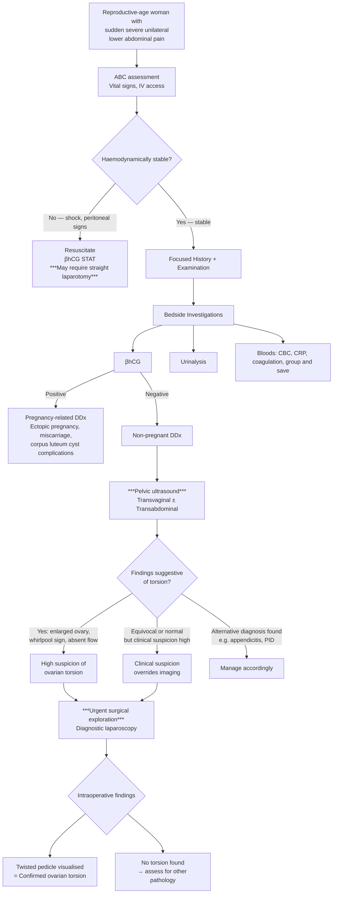

## Diagnostic Criteria, Algorithm, and Investigations for Ovarian Torsion

### Why There Are No Formal "Diagnostic Criteria" for Ovarian Torsion

Unlike conditions such as rheumatic fever (Jones criteria) or SLE (SLICC criteria), ovarian torsion has **no validated, universally accepted diagnostic criteria or scoring system**. This is a critical concept to understand from first principles:

- Ovarian torsion is a **surgical diagnosis** — the definitive diagnosis is made **intraoperatively** when you directly visualise the twisted pedicle.
- All pre-operative assessments (history, examination, imaging) are **supportive but not definitive**. The clinical picture + imaging findings together generate a **high index of suspicion** that justifies urgent surgical exploration.
- This is analogous to testicular torsion, where ***Doppler USG cannot rule out*** torsion [10] and ***urgent exploration is indicated regardless*** [14].

<Callout title="The Golden Rule" type="error">
Do NOT wait for a definitive imaging diagnosis before proceeding to surgery. If the clinical picture is strongly suggestive of ovarian torsion, proceed to urgent surgical exploration. Delays waiting for imaging increase ischaemia time and reduce the chance of ovarian salvage. The diagnosis is confirmed on the operating table.
</Callout>

---

### Clinical Diagnostic Features (Constellation Approach)

While there are no formal criteria, the diagnosis is supported by a **constellation of findings**:

| Domain | Findings Supporting Ovarian Torsion |
|---|---|
| **History** | Sudden-onset severe unilateral lower abdominal/pelvic pain ± nausea/vomiting; known ovarian cyst; pain during physical activity; intermittent prior episodes (torsion-detorsion) |
| **Examination** | Unilateral adnexal tenderness; palpable tender adnexal mass; peritoneal signs (guarding, rebound); ***vital signs if in pain*** [5]; ***usually separated from uterus*** [5] |
| **Bedside tests** | Negative βhCG (excludes pregnancy-related causes); urinalysis negative (excludes urological causes) |
| **Ultrasound** | Enlarged oedematous ovary; underlying cyst/mass; whirlpool sign on Doppler; reduced or absent ovarian blood flow; free fluid |
| **Intraoperative** | ***Torsion of the stalk / infundibulopelvic ligament*** [15] — direct visualisation of the twisted pedicle is the definitive diagnosis |

---

### Diagnostic Algorithm

---

### Investigation Modalities — Detailed

#### 1. Bedside Investigations

##### 1a. Urine Pregnancy Test (βhCG)

- **Why first?** ***Girls: ask LMP, order PT*** [10]. A positive βhCG completely redirects your differential to pregnancy-related causes (ectopic pregnancy, miscarriage). A negative result allows you to focus on non-pregnant gynaecological and surgical causes.
- **Serum βhCG** is more sensitive than urine and is used when urine is equivocal or in early pregnancy (serum can detect βhCG at ~5 mIU/mL vs urine at ~20–25 mIU/mL).
- **Key point:** Ovarian torsion can occur IN pregnancy (especially first trimester due to corpus luteum cysts), so a positive βhCG does NOT exclude torsion — it just adds pregnancy complications to the DDx.

##### 1b. Urinalysis (Dipstick + Microscopy)

- **Purpose:** Exclude urological causes — ***urinalysis: dipstick, microscopy → urological causes*** [12][13].
- **Haematuria** → suggests ureteric colic (stones), UTI.
- **Pyuria + nitrites + leucocyte esterase** → UTI / pyelonephritis.
- **Normal urinalysis** supports a gynaecological or GI cause.

##### 1c. Vital Signs

- ***Vital signs if in pain*** [5] — tachycardia (pain/stress response), blood pressure (haemodynamic stability), temperature (low-grade fever suggests necrosis; high fever suggests PID or appendicitis).

---

#### 2. Blood Investigations

| Test | Purpose and Interpretation |
|---|---|
| **CBC** | ***WBC for infection (inflammatory source may cause left shift on differential)*** [12][13]. Mild leukocytosis (10–15 × 10⁹/L) is common in torsion due to tissue stress/necrosis. Markedly elevated WBC ( > 16) may suggest gangrenous/necrotic ovary. **Normal WBC does NOT exclude torsion** (same principle as appendicitis). Hb to assess for anaemia if haemoperitoneum suspected. |
| **CRP** | Non-specific inflammatory marker. Elevated in torsion with necrosis, but also in PID, appendicitis. Helps track inflammatory response but not diagnostic in isolation. |
| **Coagulation profile** | Pre-operative workup — ***clotting profile, T/S for surgery*** [12][13]. |
| **Group and Save / Crossmatch** | Pre-operative — in case of haemorrhage during surgery or if ruptured cyst with haemoperitoneum. |
| **RFT** | ***Hydration status; Cr → suitability of contrast scans*** [12][13]. Dehydration from vomiting. |
| **LFT** | Usually normal; baseline pre-operative assessment. |
| **Serum βhCG** | ***Urine pregnancy test → ectopic pregnancy*** [12][13]. If urine test equivocal. |
| **Lactate / ABG** | ***Metabolic acidosis, ↑lactate → intestinal ischaemia*** [12][13]. In severe cases with necrotic ovary and peritonitis, lactate may be elevated reflecting tissue ischaemia, though this is not specific to ovarian torsion. |

<Callout title="Bloods Are Supportive, Not Diagnostic" type="idea">
No single blood test can diagnose or exclude ovarian torsion. Bloods serve three purposes: (1) exclude other diagnoses (βhCG, urinalysis), (2) assess severity/complications (WBC, CRP, lactate), and (3) pre-operative preparation (group and save, coagulation, RFT).
</Callout>

---

#### 3. Tumour Markers

| Marker | Role |
|---|---|
| ***CA125*** | ***CA125 and other imaging like CT/MRI/PET-CT for suspected ovarian cancer*** [8]. CA125 is NOT useful in the acute setting of torsion. It is elevated in ovarian malignancy (especially epithelial), endometriosis, PID, and even normal menstruation. It is used for the ***Risk of Malignancy Index (RMI)*** in postmenopausal women with ovarian cysts [16], not for diagnosing torsion. |
| **AFP, βhCG, LDH** | Germ cell tumour markers. Relevant if the underlying cyst is suspected to be a malignant germ cell tumour (e.g., immature teratoma in young women). Not part of the initial torsion workup. |
| **Inhibin, AMH** | Sex cord-stromal tumour markers. Not routinely measured in acute torsion. |

---

#### 4. Imaging — The Centrepiece

##### 4a. Pelvic Ultrasound (First-Line Imaging)

***Pelvic ultrasound is a common investigation tool*** [8]. This is the **first and most important imaging modality** for suspected ovarian torsion.

**Two approaches:**

| Modality | Advantages | Limitations |
|---|---|---|
| ***Transvaginal ultrasound (TVS)*** | Higher resolution for pelvic structures; better visualisation of ovarian morphology; closer to the ovary | May be uncomfortable in acute pain; contraindicated in prepubertal patients; operator-dependent |
| ***Transabdominal ultrasound (TAS)*** | Non-invasive; better for large masses extending out of the pelvis; suitable for children/virgo intacta | Lower resolution for deep pelvic structures |
| **Combined TVS + TAS** | ***TVS + TAS*** [16] — optimal approach. TVS for detail, TAS for overview and large masses | Requires trained sonographer |

***For the ovaries, look at the uterus first, at the sides. If you can find a cystic, follicular-filled structure, then that should be the ovaries. For some postmenopausal women, if the ovaries become atrophic, they are difficult to locate*** [17].

##### Key USS Findings in Ovarian Torsion

| Finding | Description | Pathophysiological Basis |
|---|---|---|
| **Enlarged, oedematous ovary** | Ovary appears significantly larger than contralateral (often > 4 cm in longest axis, compared to normal ~3 cm) with a rounded, globular shape | Venous congestion → oedematous swelling. Blood enters via arteries but cannot exit via compressed veins → ovary balloons up. |
| **Underlying ovarian mass/cyst** | ***Complex cystic lesion with heteroechogenic content*** [1] (as in dermoid); or simple cyst; or solid mass | The predisposing lesion that caused the torsion. ***USG: variable appearance depending on content*** [6] for teratomas. |
| **Whirlpool sign** | Twisted vascular pedicle seen as a round, hypoechoic structure with concentric rings on grey-scale, or a spiral of colour flow on Doppler | The physically twisted infundibulopelvic ligament/mesovarium. This is the **most specific USS sign** of torsion (specificity ~85–100%). Analogous to the ***whirlpool sign*** described in testicular torsion [14]. |
| **Absent or reduced Doppler flow** | No colour flow or reduced/absent arterial and venous waveforms within the ovary | Vascular occlusion from torsion. **BUT — presence of flow does NOT exclude torsion** because: (1) dual blood supply may preserve some flow; (2) partial torsion may not fully occlude vessels; (3) intermittent torsion-detorsion. ***Doppler USG cannot rule out*** [10]. |
| **Peripheral follicles pushed to the cortex** | Multiple small follicles displaced to the periphery of the swollen ovary, creating a "string of pearls" appearance at the edge | Oedema in the ovarian stroma pushes the cortical follicles outward. This sign is particularly useful in torsion of a normal ovary (no underlying mass). |
| **Free fluid in Pouch of Douglas** | Small to moderate amount of anechoic or echogenic fluid posterior to the uterus | Reactive peritoneal fluid from congested/ischaemic ovary. In the lecture case, ***no fluid at POD*** was noted [1] — demonstrating that free fluid is not always present. Its absence does not exclude torsion. |
| **"Missing ovary" sign** | ***Left ovary not seen*** on USS with an ipsilateral adnexal mass [1] | The torted, oedematous ovary is so distorted and enlarged that the sonographer cannot identify it as a normal ovary — instead, they see the cyst/mass. The ovary IS the mass. |
| **Midline deviation of the ovary** | The torted ovary may be displaced medially, anterior to or above the uterus | The twist on the pedicle can pull the ovary out of its normal lateral position. In the lecture case: ***complex cystic lesion at left antero-lateral aspect of uterus*** [1] and ***cystic mass felt in the anterior fornix*** [1]. |

<Callout title="Critical Exam Point – Doppler Flow and Torsion" type="error">
**The most common exam pitfall:** Students (and clinicians) assume that normal Doppler flow excludes ovarian torsion. It does NOT. The sensitivity of absent Doppler flow for torsion is only ~50–75%. Up to 60% of confirmed torsion cases have some detectable flow on Doppler. Always correlate with clinical findings. If clinical suspicion is high, proceed to surgery regardless of Doppler results.
</Callout>

##### USS Findings for the Underlying Pathology

| Underlying Pathology | USS Appearance |
|---|---|
| **Dermoid cyst** | ***Heteroechogenic content*** [1]; mixed echogenicity with echogenic foci (fat, hair), calcification (teeth), "dermoid plug," "tip of the iceberg" sign (dense echogenic component obscures deeper structures). ***AXR: tooth-shaped radiodensity*** [6]. ***CT/MRI: definitive dx, esp when fat content is demonstrated*** [6]. |
| **Simple/functional cyst** | ***Anechoic, avascular*** [6] — thin-walled, no internal echoes, no solid components, no septations. |
| **Endometrioma** | "Ground glass" homogeneous low-level internal echoes (old blood); thick wall; no internal vascularity. |
| **Cystadenoma** | Thin-walled, unilocular or multilocular, may have thin septations. Serous = anechoic; mucinous = low-level echoes. |
| **Malignant features** | ***Heterogeneous with solid component; irregular wall; papillary projections; increased vascularity; multilocular*** [3]. If any of these are present, raise suspicion for malignancy → refer to gynaecological oncology MDT. |

> ***Should also check for Doppler flow*** [3] — the lecture explicitly emphasises adding Doppler to all pelvic USS assessments.

---

##### 4b. Plain Radiography (AXR)

Not a primary investigation for ovarian torsion, but can provide incidental clues:

- ***AXR: tooth-shaped radiodensity in LLQ*** [6] → diagnostic of **dermoid cyst** (the teeth/bone within the teratoma are radio-opaque).
- **Impression:** ***Ovarian teratoma with recurrent torsion/detorsion*** [6].
- AXR may also show **calcifications** within mature cystic teratomas.
- **Limitation:** AXR is insensitive for most ovarian pathology and is not recommended as a primary investigation. The dermoid cyst finding on AXR is usually incidental.

---

##### 4c. CT Abdomen and Pelvis

***CT abdomen and pelvis: emergency, eg. GI obstruction or perforation, stones, peritonitis*** [18].

| Role in Torsion | Details |
|---|---|
| **Not first-line** | USS is preferred because it is faster, radiation-free, cheaper, and provides real-time Doppler assessment. CT is used when USS is equivocal or when an alternative diagnosis (appendicitis, diverticulitis) needs to be excluded. |
| **CT findings of torsion** | Enlarged, oedematous ovary; thickened, twisted pedicle ("whirl sign"); wall thickening of the fallopian tube; deviation of the uterus to the affected side; pelvic free fluid; reduced or absent enhancement of the ovary on contrast CT (indicates ischaemia). |
| **CT for dermoid** | ***CT/MRI: definitive dx, esp when fat content is demonstrated*** [6]. CT shows macroscopic fat within the cyst (fat = very low attenuation, typically -20 to -120 HU), calcification (teeth, bone), and the Rokitansky nodule. |
| **Contrast CT** | IV contrast helps assess ovarian perfusion — a non-enhancing ovary on contrast CT strongly suggests ischaemia/infarction. |
| **Radiation exposure** | Significant concern in young reproductive-age women (ovarian radiation dose). Avoid if USS is diagnostic. |

---

##### 4d. MRI Pelvis

- **Role:** Second-line imaging; used when USS is inconclusive and CT is to be avoided (e.g., pregnancy, young patients, radiation concerns).
- ***CT/MRI: definitive dx, esp when fat content is demonstrated*** [6] — MRI is excellent for tissue characterisation.
- **MRI findings in torsion:** Enlarged ovary with stromal oedema (high T2 signal); twisted pedicle; haemorrhagic changes; non-enhancement of ovary post-gadolinium.
- **MRI advantage in pregnancy:** No ionising radiation; safe for the fetus (gadolinium generally avoided in pregnancy, but non-contrast MRI is useful).
- **Limitation:** Takes longer (~30–45 minutes); less readily available in emergencies.

---

##### 4e. Diagnostic Laparoscopy (Definitive)

***Diagnostic laparoscopy*** [13] — the **gold standard** and definitive investigation for ovarian torsion.

- This is both diagnostic AND therapeutic — you can visualise the torsion and immediately perform detorsion/cystectomy/oophorectomy in the same procedure.
- ***Intraoperative finding: a 7 cm left ovarian cyst with torsion for 1.5 turn. Satisfactory perfusion of left ovary noted after detorsion*** [1].
- ***Torsion of the stalk / infundibulopelvic ligament*** [15] — directly seen at laparoscopy.

**What you see at laparoscopy:**

| Finding | Significance |
|---|---|
| Twisted pedicle (infundibulopelvic ligament / mesovarium) | Confirms the diagnosis; count the number of turns |
| Colour of ovary — dusky blue/black vs pink | Indicates degree of ischaemia; ***satisfactory perfusion noted after detorsion*** [1] = ovary recovers pink colour = viable |
| Oedematous, enlarged ovary | Consistent with venous congestion |
| ***Sebum and hair found inside the cyst*** [1] | Confirms dermoid cyst as underlying pathology |
| Normal contralateral ovary and uterus | ***Uterus and right ovary normal*** [1] |

---

#### 5. Histopathology (Post-Operative)

- All excised ovarian tissue should be sent for histological examination to confirm the underlying pathology and **exclude malignancy**.
- ***Pathology: Mature cystic teratoma of left ovary*** [1] — this was the definitive histological diagnosis in the lecture case.
- **Immature teratoma** (malignant) accounts for ~5% of ovarian teratomas [19] — histology distinguishes mature (benign) from immature (malignant) based on the presence of immature neural tissue.

---

### Investigation Prioritisation — Summary Table

| Priority | Investigation | Purpose | Key Findings |
|---|---|---|---|
| **1** | βhCG (urine/serum) | Exclude pregnancy | Negative in pure torsion |
| **2** | Urinalysis | Exclude urological cause | Normal |
| **3** | CBC, CRP | Assess inflammation/necrosis, pre-op | Mild leukocytosis; elevated CRP if necrotic |
| **4** | Group and save, coagulation, RFT | Pre-operative preparation | Baseline values |
| **5** | ***Pelvic USS (TVS + TAS with Doppler)*** | **Primary imaging** | Enlarged ovary, whirlpool sign, reduced flow, underlying mass |
| **6** | CT abdomen/pelvis | If USS equivocal or alternative Dx suspected | Whirl sign, non-enhancing ovary, fat in dermoid |
| **7** | MRI pelvis | If USS equivocal + CT to be avoided | Stromal oedema, twisted pedicle, tissue characterisation |
| **8** | ***Diagnostic laparoscopy*** | **Definitive — diagnostic AND therapeutic** | Twisted pedicle visualised; ovarian viability assessed |
| **9** | Histopathology | Post-operative | Confirms underlying pathology; excludes malignancy |

---

### RMI Score — For Postmenopausal Ovarian Cysts (Not Torsion-Specific, but Relevant)

The ***Risk of Malignancy Index (RMI)*** [16] is used for postmenopausal women with ovarian cysts to determine the likelihood of malignancy and guide referral. While not specific to torsion, it is relevant because the underlying cyst in a torted ovary may need malignancy risk stratification, especially in older women.

***RMI I = Menopausal status score × USS score × CA125 level*** [16]

| Component | Scoring |
|---|---|
| **Menopausal status (M)** | Pre-menopausal = 1; Post-menopausal = 3 |
| **USS score (U)** | 0 features = 0; 1 feature = 1; ≥ 2 features = 3. Features: multilocular, solid areas, bilateral, ascites, metastases |
| **CA125** | Absolute value in U/mL |

- ***RMI < 200: low risk of malignancy*** → consider conservative management if meets all criteria (asymptomatic, simple, < 5 cm, unilocular, unilateral) [16].
- ***RMI ≥ 200: increased risk of malignancy*** → ***CT scan (abdomen and pelvis), referral for gynaecological oncology MDT review*** [16].

<Callout title="When Does RMI Apply in Torsion?">
If a postmenopausal woman presents with ovarian torsion, the underlying cyst should be assessed for malignancy risk using RMI postoperatively. However, in the acute emergency setting, the priority is detorsion to save the ovary (or oophorectomy if non-viable). Malignancy workup follows after the emergency is resolved.
</Callout>

---

### Key Exam Questions: Past Paper Insight

***PV detect Left adnexal mass. The patient has urinary incontinence, which investigation is most appropriate? Answer: E. Transvaginal US*** [20].

This past exam question reinforces that ***transvaginal ultrasound*** is the investigation of choice for evaluating an adnexal mass. The rationale: TVS provides superior resolution for pelvic structures compared to TAS, CT, or MRI, and is non-invasive with no radiation.

---

<Callout title="High Yield Summary – Diagnosis and Investigations">

1. **Ovarian torsion is a surgical diagnosis** — definitive confirmation is intraoperative visualisation of the twisted pedicle at laparoscopy.
2. **No formal diagnostic criteria or scoring system exists** — diagnosis is based on a constellation of clinical features + USS findings + surgical confirmation.
3. **βhCG is always the first investigation** — to exclude ectopic pregnancy and other pregnancy-related causes.
4. ***Pelvic ultrasound (TVS + TAS with Doppler)*** is the primary imaging modality.
5. **Key USS signs of torsion:** Enlarged oedematous ovary, whirlpool sign (most specific), reduced/absent Doppler flow, peripheral follicles, underlying cyst/mass, free fluid, "missing ovary" sign.
6. **Doppler flow does NOT exclude torsion** — sensitivity of absent flow is only ~50–75% due to dual blood supply and partial torsion.
7. **CT** is second-line (radiation concern in young women); **MRI** is useful in pregnancy or when CT is contraindicated.
8. **If clinical suspicion is high, proceed to surgery regardless of imaging findings** — do not delay for "definitive" imaging.
9. **All excised tissue → histopathology** to confirm underlying pathology and exclude malignancy.
10. ***RMI score*** is used for postmenopausal ovarian cysts to stratify malignancy risk — not specific to torsion but relevant for the underlying cyst.

</Callout>

---

<ActiveRecallQuiz
  title="Active Recall - Diagnosis and Investigations for Ovarian Torsion"
  items={[
    {
      question: "What is the single most specific USS sign of ovarian torsion, and what does it represent anatomically?",
      markscheme: "The whirlpool sign. It represents the physically twisted vascular pedicle (infundibulopelvic ligament and mesovarium) seen as concentric rings on grey-scale or a spiral of colour flow on Doppler USS. Specificity approximately 85-100%. It is the USS equivalent of directly visualising the torsion."
    },
    {
      question: "Why can Doppler ultrasound show normal arterial flow in a confirmed case of ovarian torsion? Give two reasons.",
      markscheme: "1) The ovary has a dual blood supply (ovarian artery via infundibulopelvic ligament AND ovarian branch of uterine artery via utero-ovarian ligament) - in partial torsion, one vessel may remain patent. 2) Veins compress before arteries due to their thin walls and low pressure - so early torsion has arterial inflow but obstructed venous outflow, meaning arterial Doppler signal is still present. Sensitivity of absent Doppler flow is only approximately 50-75%."
    },
    {
      question: "A 24-year-old woman with LLQ pain has an AXR showing a tooth-shaped radiodensity. What is the diagnosis, what imaging would you do next, and what is the definitive imaging modality?",
      markscheme: "Diagnosis: ovarian dermoid cyst (mature cystic teratoma). Next imaging: pelvic USS (TVS plus TAS with Doppler) to assess the cyst and check for torsion. Definitive imaging: CT or MRI, especially when fat content is demonstrated - this confirms the diagnosis of dermoid. The tooth-shaped radiodensity represents teeth or bone within the teratoma."
    },
    {
      question: "What bloods would you order for a woman with suspected ovarian torsion, and what is the single most important bedside test?",
      markscheme: "Most important bedside test: urine beta-hCG (pregnancy test) to exclude ectopic pregnancy and other pregnancy-related causes. Bloods: CBC (mild leukocytosis with torsion, markedly elevated WBC may suggest necrosis), CRP (inflammatory marker), coagulation profile, group and save/crossmatch (pre-operative), RFT (hydration status, suitability for contrast), LFT (baseline). Also urinalysis to exclude urological causes."
    },
    {
      question: "Describe the 'missing ovary sign' on USS and explain why it occurs in ovarian torsion.",
      markscheme: "The 'missing ovary sign' is when the sonographer cannot identify the normal ovary on the affected side, but instead sees an adnexal cystic or solid mass. It occurs because the torted, oedematous ovary is so distorted and enlarged by venous congestion that it no longer looks like a normal ovary - the mass IS the torted ovary. In the lecture case: left ovary not seen on USS, but a 6 cm complex cystic lesion was present at the left antero-lateral aspect of uterus."
    },
    {
      question: "What is the RMI score, what are its three components, and when would you use it in the context of ovarian torsion?",
      markscheme: "RMI = Risk of Malignancy Index = Menopausal status score x USS score x CA125 level. Used for postmenopausal women with ovarian cysts to stratify malignancy risk. RMI less than 200 = low risk (consider conservative management if simple, less than 5 cm, unilocular, unilateral, asymptomatic). RMI 200 or more = increased risk (CT abdomen and pelvis, referral to gynaecological oncology MDT). In the context of torsion, RMI is not used in the acute emergency setting. It is applied after the emergency is resolved to assess the underlying cyst for malignancy risk, especially in postmenopausal women."
    }
  ]}
/>

## References

[1] Lecture slides: Block C - Gyanecological Emergency Notes to Students.pdf (Cards 13–19)
[3] Lecture slides: Block C - O&G Theme Case 3.pdf (p4)
[5] Lecture slides: GC 118. Pelvic mass ovarian cancer and cysts; uterine fibroid; pelvic imaging.pdf (p12, p20)
[6] Senior notes: Ryan Ho Radiology.pdf (p33)
[8] Lecture slides: GC 118. Pelvic mass ovarian cancer and cysts; uterine fibroid; pelvic imaging.pdf (p26, p71)
[10] Senior notes: Maksim Surgery Notes.pdf (p328, p336)
[12] Senior notes: Ryan Ho Fundamentals.pdf (p279)
[13] Senior notes: Ryan Ho GI.pdf (p105)
[14] Senior notes: Ryan Ho Urogenital.pdf (p231–233)
[15] Lecture slides: Block C - Pelvic mass_ ovarian cancer and cysts; uterine fibroid; pelvic imaging.pdf (p41)
[16] Lecture slides: GC 118. Pelvic mass ovarian cancer and cysts; uterine fibroid; pelvic imaging.pdf (p68)
[17] Lecture slides: Block C - Pelvic mass_ ovarian cancer and cysts; uterine fibroid; pelvic imaging.pdf (p30)
[18] Senior notes: Ryan Ho Diagnostic Radiology.pdf (p36)
[19] Senior notes: Ryan Ho Rheumatology.pdf (p167)
[20] Senior notes: Ryan Ho Radiology.pdf (p40)
