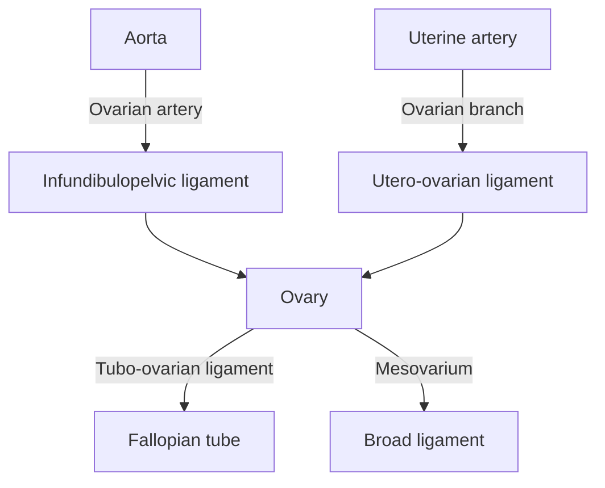
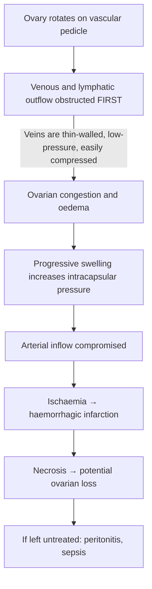

# Ovarian Torsion

## 1. Definition

**Ovarian torsion** (also called adnexal torsion) refers to the partial or complete rotation of the ovary — and often the ipsilateral fallopian tube — around its vascular pedicle (the infundibulopelvic ligament and the utero-ovarian ligament). This rotation kinks the ovarian vessels, initially obstructing venous and lymphatic outflow (because veins are low-pressure and thin-walled, so they compress first), and eventually compromising arterial inflow. The result is progressive ischaemia and, if untreated, haemorrhagic infarction and necrosis of the ovary.

> **Etymology:** "Torsion" derives from the Latin *torquere* = to twist. So ovarian torsion literally means "twisting of the ovary."

<Callout title="Key Concept">
Ovarian torsion is a ***gynaecological emergency***. The principle is identical to testicular torsion in males — a gonad twists on its pedicle, cutting off blood supply. Delay in surgical intervention leads to irreversible ischaemic damage and loss of the ovary. Time is gonad.
</Callout>

---

## 2. Epidemiology

- **Incidence:** Ovarian torsion accounts for approximately 2.7–3% of all gynaecological emergencies [1][2]. The estimated annual incidence is ~5.9 per 100,000 women.
- **Age distribution:**
  - Can occur at **any age** from neonates to postmenopausal women.
  - Most common in **reproductive-age women** (peak 20–40 years), because this is when functional ovarian cysts and benign neoplasms are most prevalent.
  - Also seen in children/adolescents — in fact, ovarian torsion is one of the most important causes of acute abdominal pain in young girls to consider.
  - ~17% of cases occur in pre-menarchal or pregnant patients.
- **Pregnancy:** Incidence is higher during pregnancy, especially in the first trimester and early second trimester, due to corpus luteum cysts and ovarian hyperstimulation (e.g., from assisted reproductive technology). Approximately 10–20% of torsion cases occur during pregnancy.
- **Laterality:**
  - ***Right side is more commonly affected than the left*** (~60% right vs 40% left), possibly because the sigmoid colon on the left side limits the mobility of the left ovary, and because right-sided pain may be more aggressively investigated (to rule out appendicitis) [1].
  - Bilateral torsion is extremely rare (< 1%) but can occur.

---

## 3. Risk Factors

Understanding the risk factors is logical: anything that **enlarges the ovary** or **increases its mobility** predisposes to torsion (a heavier or bigger ovary swings on its pedicle more easily, like a pendulum).

| Risk Factor | Mechanism |
|---|---|
| **Ovarian cyst or mass (5–10 cm)** | ***Torsion is most commonly caused by dermoid cyst (mature cystic teratoma)*** — because dermoid cysts contain heterogeneous material (sebum, hair, teeth) that acts as sediment, causing the ovary to be "off-balance" and prone to rolling/rotating [2][3]. Masses between 5–10 cm are the highest risk size — smaller ones don't create enough momentum, while very large masses (> 10 cm) are often less mobile because they become fixed by adhesions. |
| **Benign ovarian neoplasms** | Benign tumours are far more commonly associated with torsion than malignant ones, because malignant tumours tend to form adhesions to surrounding structures (cancer is "sticky"), which paradoxically protects against torsion. |
| **Ovarian hyperstimulation syndrome (OHSS)** | Exogenous gonadotropins (IVF treatment) cause multiple enlarged follicular cysts → heavy, swollen ovaries → prone to torsion. |
| **Pregnancy** | Corpus luteum cyst of pregnancy + ligamentous laxity → increased ovarian mobility. |
| **Long utero-ovarian ligament / long pedicle** | Greater "stalk" length means more freedom to rotate (like a ball on a long string). More common in children/adolescents whose ligaments may be relatively elongated. |
| **Normal ovary (without a mass)** | In children and adolescents, torsion of a normal ovary can occur because the ligaments are more lax and the ovary is more mobile before being fixed by adhesions from ovulation/inflammation. |
| **Previous pelvic surgery / tubal ligation** | Can alter the normal anatomical fixation of the adnexa. |
| **Physical activity / sudden body movements** | ***Sudden onset of severe abdominal pain during agitating movement (e.g., exercise)*** [4] — abrupt movements can initiate the twisting. |

<Callout title="High Yield – Dermoid Cysts and Torsion" type="idea">
***Torsion → most common by dermoid cyst (have sediment so keeps rolling)*** [3]. The heterogeneous content (fat, hair, teeth) inside dermoid cysts creates an eccentric centre of gravity, making the ovary inherently unstable and prone to rotating on its pedicle — like a top-heavy ball.
</Callout>

---

## 4. Anatomy and Function (Relevant to Torsion)

### 4.1 Ovarian Attachments and Blood Supply

To understand torsion, you must know the ovarian "pedicle" — the structures that suspend the ovary and carry its blood supply:

1. **Infundibulopelvic ligament (suspensory ligament of the ovary)**
   - Runs from the ovary to the lateral pelvic wall.
   - Contains the **ovarian artery** (branch of the aorta), **ovarian vein** (drains to IVC on right, left renal vein on left), and lymphatics.
   - This is the primary vascular supply to the ovary.

2. **Utero-ovarian ligament (ovarian ligament / proper ligament of the ovary)**
   - Runs from the medial pole of the ovary to the uterine cornu.
   - Contains the **ovarian branch of the uterine artery** (an anastomotic supply from the uterine artery via the broad ligament).
   - This provides a secondary blood supply.

3. **Mesovarium**
   - The posterior leaf of the broad ligament that attaches the ovary to the broad ligament.
   - Through the mesovarium, vessels from both the infundibulopelvic ligament and the utero-ovarian ligament enter the ovarian hilum.

4. **Tubo-ovarian ligament (fimbria ovarica)**
   - Connects the fimbriated end of the fallopian tube to the ovary.
   - This is why when the ovary torts, the tube often goes with it.

> **Why does the ovary tort?** The ovary is relatively mobile because it is only suspended by these ligamentous structures (unlike the uterus, which is held by the cardinal and uterosacral ligaments). If something enlarges the ovary (e.g., a cyst), it becomes heavier and can rotate on the axis formed by the infundibulopelvic ligament and utero-ovarian ligament — like a pendulum swinging and flipping.

### 4.2 Dual Blood Supply — Clinical Significance

The ovary has a **dual blood supply**: the ovarian artery (via the infundibulopelvic ligament) and the ovarian branch of the uterine artery (via the utero-ovarian ligament). This dual supply has several important clinical implications:

- In partial torsion, one vessel may remain patent, allowing some perfusion to continue. This is why Doppler flow may still be detectable even in a torted ovary — **the presence of Doppler flow does NOT exclude torsion**.
- The dual supply also provides collateral flow, which may allow the ovary to survive longer than the testis in torsion (testis has a single arterial supply via the testicular artery).

### 4.3 Fallopian Tube Involvement

In the majority (60–80%) of cases, the fallopian tube torts together with the ovary because of the tubo-ovarian ligament connecting them. This is why the term **"adnexal torsion"** is often more accurate than "ovarian torsion." Isolated tubal torsion is rare but can occur.

---

## 5. Aetiology (with Focus on Hong Kong)

The aetiology of ovarian torsion is essentially the aetiology of the **underlying ovarian pathology** that predisposes to torsion:

### 5.1 Most Common Underlying Pathologies

| Pathology | Frequency | Notes |
|---|---|---|
| ***Mature cystic teratoma (dermoid cyst)*** | **Most common cause of torsion** (~30–40% of torsion cases) | ***Sebum and hair found inside the cyst*** [1]. Heterogeneous content → eccentric weight → prone to rolling. Most common benign ovarian tumour in reproductive age. |
| **Functional cysts (follicular / corpus luteum)** | Very common | Especially in reproductive-age women. Corpus luteum cysts are common in early pregnancy. |
| **Serous/mucinous cystadenoma** | Common | Large benign cysts that enlarge the ovary. |
| **Paraovarian cysts** | Occasional | Arise from the broad ligament, can cause adnexal torsion. |
| **Endometrioma** | Less common | Endometriotic cysts, though adhesions from endometriosis may somewhat protect against torsion. ***Dysmenorrhoea (endometriosis)*** [5]. |
| **OHSS-related enlarged ovaries** | Context-dependent | Relevant in HK given the high utilisation of IVF/ART services. |
| **Normal ovary (no mass)** | ~20–30% (especially in children) | Paediatric/adolescent torsion may occur in normal ovaries. |
| **Malignant ovarian tumours** | Rare cause of torsion (< 5%) | Malignant tumours form adhesions → paradoxically protective against torsion. |

### 5.2 Hong Kong Context
- **Dermoid cysts** are the most common benign ovarian neoplasm in young women in Hong Kong and are the leading pathological cause of ovarian torsion locally.
- **IVF/ART usage** is increasing in Hong Kong due to delayed childbearing (average age at first birth ~32 years), increasing the population at risk for OHSS-related torsion.
- **Endometriosis** is common in Hong Kong (estimated 10% of reproductive-age women), contributing to ovarian cysts (endometriomas).

---

## 6. Pathophysiology

The pathophysiology of ovarian torsion follows a predictable sequence once rotation occurs:

### 6.1 Sequence of Vascular Compromise

**Step-by-step explanation:**

1. **Rotation occurs** — the ovary (and usually the fallopian tube) twists on the infundibulopelvic and utero-ovarian ligaments.
2. **Venous and lymphatic obstruction first** — because veins and lymphatics are thin-walled and low-pressure, they are compressed before arteries. This causes venous congestion and oedema of the ovary.
   - *This is why the ovary becomes massively swollen and oedematous on imaging and at surgery.*
3. **Arterial inflow continues initially** — blood keeps flowing INTO the ovary but cannot get OUT. This causes the ovary to become engorged with blood (haemorrhagic congestion).
   - *This is why Doppler may initially still show arterial flow — leading to false negatives.*
4. **Progressive oedema increases tissue pressure** → eventually exceeds arterial pressure → arterial occlusion → true ischaemia.
5. **Ischaemic necrosis** — if not relieved, the ovary undergoes haemorrhagic infarction (the trapped blood has nowhere to go).
6. **If necrotic ovary is left in situ** → infection, abscess formation, peritonitis, sepsis. There is also a theoretical (though debated) risk of thromboembolism from the thrombosed ovarian vein.

### 6.2 Intermittent (Partial) Torsion

***The ovary can undergo intermittent torsion and detorsion*** — the ovary twists partially, causing temporary pain, then untwists spontaneously, with resolution of symptoms. This explains:
- **Recurrent episodes of lower abdominal pain** that resolve spontaneously.
- ***Intermittent LLQ pain*** as described in the case of ovarian teratoma with ***recurrent torsion/detorsion*** [6].
- The clinical challenge: patients may present multiple times with "resolved" pain before the definitive torsion event occurs.

### 6.3 Degree of Torsion

- Torsion is described in terms of **number of turns** (e.g., ***torsion for 1.5 turn*** as described in the lecture case [1]).
- Greater degrees of torsion → more complete vascular compromise → worse prognosis for ovarian viability.
- Even a single 360° turn can cause complete vascular occlusion.

<Callout title="Why Veins Compress Before Arteries" type="idea">
Think of it like squeezing a garden hose. A high-pressure fire hose (artery) requires much more force to compress than a thin, floppy soaker hose (vein). This venous > arterial compression sequence is the same principle seen in testicular torsion, compartment syndrome, and ovarian torsion.
</Callout>

---

## 7. Classification

### 7.1 By Structures Involved

| Type | Description |
|---|---|
| **Ovarian torsion** | Ovary alone torts (less common in isolation) |
| **Adnexal torsion** | Ovary + fallopian tube tort together (most common pattern, ~60–80%) |
| **Isolated tubal torsion** | Fallopian tube torts without the ovary (rare) |

### 7.2 By Completeness

| Type | Description |
|---|---|
| **Complete torsion** | Full rotation with complete vascular occlusion |
| **Partial/Incomplete torsion** | Partial rotation; venous congestion but preserved arterial flow initially |
| **Intermittent torsion-detorsion** | Recurrent partial torsion that spontaneously resolves (as in dermoid cysts) [6] |

### 7.3 By Underlying Pathology

| Category | Examples |
|---|---|
| **Cyst-associated torsion** | Dermoid, functional cyst, cystadenoma, endometrioma |
| **Mass-associated torsion** | Solid benign tumours (fibroma, thecoma) |
| **Normal ovary torsion** | Especially in paediatric patients |
| **OHSS-associated torsion** | Post-IVF/ART |

---

## 8. Clinical Features

### 8.1 Symptoms

| Symptom | Pathophysiological Basis |
|---|---|
| ***Sudden onset of severe unilateral lower abdominal/pelvic pain*** [4][5] | The acute twist causes immediate stretching of the ovarian capsule (visceral peritoneum) and ischaemia of the ovarian tissue. Visceral pain from the ovary is referred to the ipsilateral iliac fossa via the T10–L1 dermatomes (ovarian nerve supply from the ovarian plexus, derived from the aortic plexus). |
| ***Pain during agitating movement (e.g., exercise)*** [4] | Sudden movement can initiate or worsen the torsion. Analogous to testicular torsion occurring with physical exertion. |
| **Colicky/intermittent pain** (in partial torsion) | ***Intermittent LLQ pain*** [6] — in partial torsion-detorsion, the ovary repeatedly twists and untwists, causing episodic ischaemic pain that resolves when the ovary untwists and blood flow resumes. |
| **Nausea and vomiting** | Autonomic response to severe visceral pain. Visceral pain fibres travel with sympathetic afferents → stimulate the area postrema and vomiting centre in the brainstem. Same mechanism as nausea/vomiting in testicular torsion, renal colic, and bowel obstruction. |
| **Radiation to groin, flank, or back** | Referred pain along the distribution of the ovarian nerve plexus (T10–L1 dermatomes, overlapping with renal and ureteric innervation — hence pain can mimic renal colic). |
| **Pain that worsens progressively** | Initially venous congestion → then ischaemia → then infarction. Each stage produces more intense pain as tissue damage escalates. |
| ***Abdominal distension*** [5] | Due to the cyst itself, reactive free fluid from peritoneal irritation, or paralytic ileus from peritoneal inflammation. |
| ***Pressure symptoms (urinary/bowel)*** [5] | Large ovarian cyst compressing adjacent bladder or rectum, causing urinary frequency/urgency or constipation/tenesmus. |
| **Absence of vaginal bleeding** | This is an important negative feature that helps distinguish torsion from ruptured ectopic pregnancy or miscarriage (which typically present with vaginal bleeding). |

### 8.2 Signs

| Sign | Pathophysiological Basis |
|---|---|
| ***Vital signs: tachycardia, may have low-grade fever*** [5] | Tachycardia reflects pain and stress response (sympathetic activation). Low-grade fever (< 38.5°C) occurs due to tissue necrosis/inflammation. High fever (> 38.5°C) suggests established necrosis or superimposed infection. |
| ***Lower abdominal tenderness with or without guarding*** [4] | Peritoneal irritation from the congested, oedematous, or necrotic ovary. Initially, tenderness is localised. Guarding (involuntary contraction of abdominal muscles) indicates parietal peritoneal inflammation. |
| **Rebound tenderness** (if advanced) | Indicates peritonitis — the inflamed/necrotic ovary irritates the parietal peritoneum. |
| ***Tender adnexal mass on bimanual pelvic examination*** | The swollen, congested, torted ovary is palpable as a ***~6 cm cystic mass felt in the anterior fornix, tender & slightly mobile only*** [1]. Limited mobility because the torted pedicle restricts movement. |
| **Unilateral adnexal tenderness** | Ovary is exquisitely tender because of ischaemia and capsular distension. |
| ***Cervical excitation tenderness*** (variable) | In the lecture case, ***cervix — no excitation tenderness*** was noted [1]. Cervical motion tenderness is more classically associated with PID or ectopic pregnancy, but may occasionally be present in torsion if there is significant peritoneal irritation. Its *absence* helps distinguish torsion from PID. |
| ***Mass usually separated from uterus*** [5] | The ovary is anatomically separate from the uterus (connected only by the utero-ovarian ligament), so the mass is typically felt lateral and separate from the uterus on bimanual examination — unlike uterine fibroids, which move with the uterus. |
| ***Less mobile if adhesions (endometriosis)*** [5] | If there is underlying endometriosis or prior surgery, adhesions limit the mobility of the mass on examination. |
| **Reduced bowel sounds** | Peritoneal irritation from the torted ovary causes a reflexive paralytic ileus, reducing bowel sounds. |
| ***Signs of intra-abdominal bleeding / haemodynamic instability*** [4] | If the torted ovary undergoes haemorrhagic infarction and ruptures, there can be significant haemoperitoneum → ***signs of hypovolemic shock*** (tachycardia, hypotension, pallor, cold extremities). |

### 8.3 Distinguishing Features from Similar Conditions

| Feature | Ovarian Torsion | Ruptured Ectopic | PID | Appendicitis |
|---|---|---|---|---|
| **Pain onset** | Sudden, severe | Sudden, severe | Gradual | Gradual (migrates) |
| **Vaginal bleeding** | Usually absent | Present | Discharge, not blood | Absent |
| **Fever** | Low-grade (late) | Usually absent | High (38–39.5°C) | Moderate |
| **βhCG** | Negative (unless pregnant) | Positive | Negative | Negative |
| **Cervical excitation** | Usually absent | Present | Present (Chandelier sign) | Absent |
| **Nausea/vomiting** | Common | Variable | Uncommon | Common |
| **Adnexal mass** | Present | ± present | Bilateral tenderness | Absent |

<Callout title="Clinical Pearl – Why Pain Is Sudden" type="idea">
Unlike PID (which has gradual onset from infection spreading through the tubes), ovarian torsion causes sudden pain because it is a mechanical event — the ovary physically rotates, acutely stretching the capsule and occluding vessels. This sudden onset is your best clinical clue.
</Callout>

<Callout title="Important – Do NOT Rely on Doppler to Rule Out Torsion" type="error">
A common mistake is assuming that the presence of arterial flow on Doppler ultrasound rules out torsion. It does NOT. Because the dual blood supply may allow some arterial flow to persist even in partial torsion, and because veins compress before arteries, you can have a torted ovary WITH Doppler flow. ***Satisfactory perfusion of left ovary noted after detorsion*** [1] — implying there was likely reduced perfusion before detorsion. The diagnosis is clinical + surgical; Doppler is supportive but not definitive.
</Callout>

---

## 9. Important Lecture Case Summary

The lecture presents a classic case illustrating ovarian torsion [1]:

- **Patient:** Young woman with ***acute lower abdominal pain*** (likely left-sided)
- **Examination:** ***A ~6 cm cystic mass felt in the anterior fornix; tender & slightly mobile only***
- **Rectal exam:** ***Cervix — no excitation tenderness; uterus — ill defined; both lateral adnexae found clear*** (because the mass was anterior, not lateral)
- **USG (Pelvis):** ***Normal sized retroverted uterus. A complex cystic lesion (6 cm × 5.8 cm × 6.2 cm) at left antero-lateral aspect of uterus. Heteroechogenic content. Right ovary normal. Left ovary not seen. No fluid at POD. Impression: Dermoid cyst.***
- **Intraoperative findings:** ***A 7 cm left ovarian cyst with torsion for 1.5 turn. Uterus and right ovary normal. Satisfactory perfusion of left ovary noted after detorsion. Cystectomy performed. Sebum and hair found inside the cyst.***
- **Pathology:** ***Mature cystic teratoma of left ovary***

> This case perfectly illustrates the classic scenario: a dermoid cyst (mature cystic teratoma) → torsion → cystectomy with ovarian conservation after confirming viability.

---

<Callout title="High Yield Summary">

1. **Ovarian torsion = gynaecological emergency** — partial or complete rotation of the ovary on its vascular pedicle → vascular compromise → ischaemia → infarction.
2. **Most common predisposing lesion = dermoid cyst (mature cystic teratoma)** — heterogeneous content (sebum, hair, teeth) makes it prone to rolling.
3. **Veins compress before arteries** → venous congestion → oedema → then arterial occlusion → haemorrhagic infarction. This is why Doppler flow may be preserved early and DOES NOT rule out torsion.
4. **Clinical presentation:** Sudden severe unilateral lower abdominal pain ± nausea/vomiting, tender adnexal mass, often during or after physical activity. Low-grade fever if necrosis. No vaginal bleeding (distinguishes from ectopic pregnancy).
5. **Right side > left** (sigmoid colon restricts left ovary mobility).
6. **Risk factors:** Ovarian cyst 5–10 cm (especially dermoid), OHSS, pregnancy, long pedicle, normal ovary in children.
7. **Benign tumours cause torsion more than malignant** — malignant tumours form adhesions that prevent rotation.
8. **Intermittent torsion-detorsion** can occur, causing recurrent episodes of lower abdominal pain.
9. **"Left ovary not seen" on USS with an ipsilateral cystic mass is a clue** — the cyst IS the torted ovary.
10. **Key differential diagnoses:** Ruptured ectopic pregnancy, PID, appendicitis, ruptured ovarian cyst, endometriosis.

</Callout>

---

<ActiveRecallQuiz
  title="Active Recall - Ovarian Torsion (Definition, Epidemiology, Anatomy, Aetiology, Pathophysiology, Clinical Features)"
  items={[
    {
      question: "What is the most common ovarian pathology predisposing to ovarian torsion, and why does this particular pathology increase the risk?",
      markscheme: "Mature cystic teratoma (dermoid cyst). Contains heterogeneous material (sebum, hair, fat, teeth) creating an eccentric centre of gravity, making the ovary prone to rolling/rotating on its pedicle. Accounts for 30-40% of torsion cases."
    },
    {
      question: "Explain the sequence of vascular compromise in ovarian torsion. Why are veins affected before arteries?",
      markscheme: "Sequence: rotation of ovary on pedicle -> venous and lymphatic obstruction first (thin-walled, low-pressure vessels compress easily) -> ovarian congestion and oedema -> progressive swelling increases intracapsular pressure -> arterial inflow eventually compromised -> ischaemia -> haemorrhagic infarction -> necrosis. Veins compress first because they are thin-walled and low-pressure compared to thick-walled, high-pressure arteries."
    },
    {
      question: "Why does the presence of arterial flow on Doppler ultrasound NOT rule out ovarian torsion?",
      markscheme: "The ovary has a dual blood supply (ovarian artery via infundibulopelvic ligament AND ovarian branch of uterine artery via utero-ovarian ligament). In partial torsion, one vessel may remain patent. Also, veins compress before arteries, so early torsion has arterial inflow but obstructed venous outflow. False-negative rate of Doppler is significant."
    },
    {
      question: "A 24-year-old woman presents with intermittent left lower quadrant pain over several weeks. AXR shows a tooth-shaped radiodensity in the LLQ. What is the diagnosis and explain the pathophysiology of the intermittent pain?",
      markscheme: "Ovarian teratoma (dermoid cyst) with recurrent torsion-detorsion. The ovary partially twists on its pedicle (causing ischaemic pain) and then spontaneously untwists (relieving the vascular compromise and pain). The heterogeneous content of the dermoid makes it prone to repeated rolling. The tooth-shaped radiodensity represents calcified tissue (e.g., teeth) within the teratoma."
    },
    {
      question: "Why is ovarian torsion more common on the right side than the left? And why do benign tumours cause torsion more commonly than malignant ones?",
      markscheme: "Right side: the sigmoid colon on the left restricts mobility of the left ovary; also diagnostic bias as right-sided pain is investigated more aggressively (to rule out appendicitis). Benign vs malignant: malignant tumours form adhesions to surrounding structures (cancer is 'sticky' due to local invasion and desmoplastic reaction), which paradoxically tethers the ovary and prevents it from rotating."
    },
    {
      question: "List 4 clinical features that help distinguish ovarian torsion from PID and ruptured ectopic pregnancy.",
      markscheme: "1) Sudden onset pain in torsion vs gradual in PID. 2) No vaginal bleeding in torsion vs present in ectopic. 3) Cervical excitation tenderness usually absent in torsion vs present in PID (Chandelier sign) and ectopic. 4) Beta-hCG negative in torsion (unless coincidentally pregnant) vs positive in ectopic. 5) Unilateral adnexal mass in torsion vs bilateral tenderness in PID. 6) High fever in PID vs low-grade/absent early in torsion."
    }
  ]}
/>

---

## References

[1] Lecture slides: Block C - Gyanecological Emergency Notes to Students.pdf (Cards 13–19)
[2] Lecture slides: Block C - O&G Theme Case 3.pdf (p4)
[3] Lecture slides: Block C - O&G Theme Case 3.pdf (p4 — "Torsion → most common by dermoid cyst (have sediment so keeps rolling)")
[4] Senior notes: Ryan Ho Fundamentals.pdf (p273 — "Torsion/ruptured of ovarian cyst")
[5] Lecture slides: GC 118. Pelvic mass ovarian cancer and cysts; uterine fibroid; pelvic imaging.pdf (p12, p20)
[6] Senior notes: Ryan Ho Radiology.pdf (p33 — "ovarian teratoma with recurrent torsion/detorsion")
